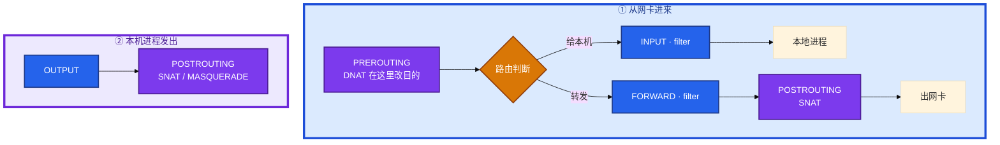
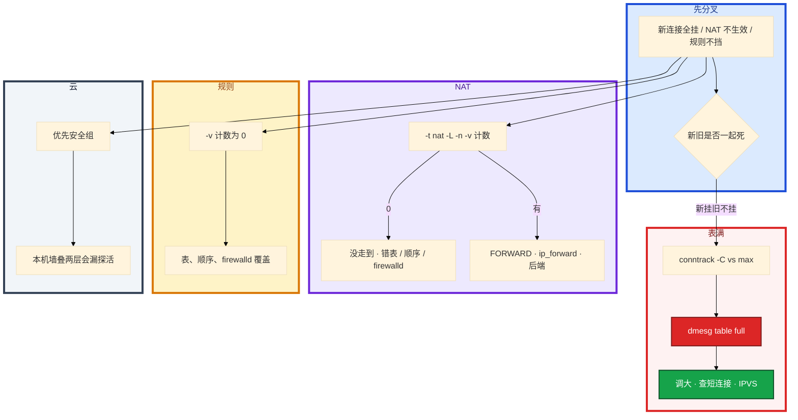

# iptables 与 conntrack


活动高峰，登录入口「新玩家进不去、在线的还在打」。群里有人要改安全组，有人在 filter 表里找 DNAT；K8s 节点上 `iptables -L` 卡到怀疑人生，dmesg 还没人看。先别动手——这一章教你 **画链定责、证表满、写 NAT 不锁死 SSH**。

**本章主线（排障就按这三步想）：**

1. **画链**：进来给本机走 INPUT，转发走 FORWARD；DNAT 在 PREROUTING，SNAT 在 POSTROUTING——**别在 filter 里找 NAT**。
2. **证表满**：新挂旧不挂 → `conntrack -C` vs max + dmesg `table full`——**别先改安全组**。
3. **持久化**：规则 save；调大 max 是买时间，治本 Keep-Alive / 查泄漏 / 规则爆炸换 IPVS。

**读完你能：** 白板上画出进来给本机 vs 转发 vs 本机发出；DNAT/SNAT 能指到链；`conntrack -C` vs max 能一口定表满；能讲清 iptables 和 IPVS 差在哪、游戏 UDP 为什么不能乱 NOTRACK。

## 本章目录

- [1. 基本概念](#1-基本概念)
- [2. 架构图](#2-架构图)
- [3. 原理](#3-原理)
  - [3.1 规则匹配](#31-规则匹配从上到下)
  - [3.2 NAT 游戏服](#32-nat游戏入口)
  - [3.3 conntrack](#33-conntrack状态防火墙)
  - [3.4 表满](#34-nf_conntrack-table-full)
  - [3.5 iptables vs IPVS](#35-iptables-vs-ipvs)
- [4. 落地](#4-落地)
- [5. 核心配置](#5-核心配置)
- [6. 命令与操作](#6-命令与操作)
- [7. 生产排障](#7-生产排障)
- [8. 必会 · 常考](#8-必会--常考)
- [合上书](#合上书问自己)

**本章不讲：** 分层抓包、SYN 黑洞 → [11 网络排障与抓包](../11-网络排障与抓包/)；socket 队列、TW/CW → [06 网络栈与Socket](../06-网络栈与Socket/)；kube-proxy 细节 → [K8s 08 Service与kube-proxy](../../04-Kubernetes/08-Service与kube-proxy/)；Cilium / eBPF 换掉 iptables → [K8s 23](../../04-Kubernetes/23-eBPF与Cilium/)；somaxconn、conntrack sysctl 持久化 → [18 内核参数与sysctl](../18-内核参数与sysctl/)；云安全组 → [07 云平台](../../07-云平台/01-云网络与安全/)。

---

## 1. 基本概念

iptables 不是一张「允许/拒绝」清单，是 **五条链上按四张表依次过规则**。命中即停。DNAT 必须在路由之前改目的，SNAT 必须在出网卡之前改源，所以它们不在 filter。

**值班里什么时候碰到**（先对现象，再对表）：

| 你听到的 | 多半是什么 | 第一刀 |
|----------|------------|--------|
| 「新登录全挂、老玩家还在」 | conntrack 表满 | `-C` vs max、dmesg |
| 「VIP 不通、本机 80 能 curl」 | DNAT / FORWARD / ip_forward | `-t nat -L -v` |
| 「加了放行还是登不进」 | 规则顺序反了 | `-L -v --line-numbers` |
| 「改完墙 ssh 断了」 | DROP 在 ACCEPT 前 / 没另开会话 | console |
| 「昨天还通今天不通」 | 规则没 save、reboot 丢 | `iptables-save` |

四表（优先级高 → 低）：**raw → mangle → nat → filter**。

五链：**PREROUTING / INPUT / FORWARD / OUTPUT / POSTROUTING**。

| 表 | 干什么 |
|----|--------|
| raw | 连接跟踪前，给 NOTRACK 豁免 |
| mangle | 改 TOS/TTL/mark |
| nat | DNAT / SNAT / MASQUERADE |
| filter | ACCEPT / DROP / REJECT |

conntrack：内核给每条连接记账。回包匹配 ESTABLISHED 直接放行，不必再写一条反向规则。表有上限——满了新 SYN 在 PREROUTING 就被丢，长连接 ESTAB 还在。一条 SSH 包和一条 DNAT 包走的链不同，不要用同一张「filter 没放行」解释所有不通。

> **记住**：进来先 PREROUTING 再路由，给本机走 INPUT，转发走 FORWARD；NAT 不在 filter 里。

---

## 2. 架构图

后面 NAT、表满、排障都对着这张图。



**读图三句话：**

1. **从网卡进来**先 PREROUTING，路由判定给本机走 INPUT，要转发走 FORWARD——VIP 转发永远不是「只开 INPUT 80」就够。
2. **DNAT 在 PREROUTING** 改目的，**SNAT/MASQUERADE 在 POSTROUTING** 改源——排障去 `-t nat`，别在 filter 里翻。
3. **`iptables -L -v`** 看命中计数；0 = 没走到这条链，或前面已命中返回。

链 × 表（有 ✓ 才有钩子）：

| | raw | mangle | nat | filter |
|--|:---:|:------:|:---:|:------:|
| PREROUTING | ✓ | ✓ | ✓ | |
| INPUT | | ✓ | ✓ | ✓ |
| FORWARD | | ✓ | | ✓ |
| OUTPUT | ✓ | ✓ | ✓ | ✓ |
| POSTROUTING | | ✓ | ✓ | |

两条对照（背下来能白板）：

```text
外网 SSH → 本机 sshd
  PREROUTING（一般不改）→ 路由判定给本机 → INPUT（这里放行 22）

外网 → VIP:80 → 后端 10.0.0.5:8080
  PREROUTING DNAT → 路由判定转发 → FORWARD → POSTROUTING
  只开 INPUT 22/80 不够，转发要开 FORWARD，还要 ip_forward=1
```

---

## 3. 原理

原理只保留动手和面试会用到的：顺序、游戏 NAT、表满铁证、为什么规则爆炸要换 IPVS。

### 3.1 规则匹配：从上到下

**一句话：** 命中即停，放行必须写在拒绝前面。

**打个比方**：像排队检票——前面写着「全员禁止入内」，后面「内网员工放行」永远走不到。iptables 不是「最后一条说了算」，是 **从上到下第一条命中的规则** 就结束。

**现场走一遍**（内网 SSH 突然登不进，刚有人「加固」了墙）：

1. 跳板机 `ssh gateway` 失败，报错 `Connection timed out` 或 hang（policy DROP 时像超时）。
2. 有 console 的运维登录网关，先看规则顺序：

```bash
iptables -L INPUT -n -v --line-numbers
```

3. 屏幕出现：

```text
Chain INPUT (policy DROP 0 packets, 0 bytes)
num   pkts bytes target     prot opt in     out     source               destination
1        0     0 DROP       tcp  --  *      *       0.0.0.0/0            0.0.0.0/0            tcp dpt:22
2        0     0 ACCEPT     tcp  --  *      *       10.0.0.0/8           0.0.0.0/0            tcp dpt:22
3    12M  800M ACCEPT     all  --  *      *       0.0.0.0/0            0.0.0.0/0            state RELATED,ESTABLISHED
```

4. 问题一眼可见：**DROP 在 ACCEPT 前面**，内网 10.x 的 22 永远到不了第 2 条。当前 ssh 若还活着，是因为第 3 条 ESTABLISHED——断开就再也进不去。
5. 修法：用 `-I` 把 ACCEPT 插到 DROP 前面，或删错序 DROP；**另开一条新 ssh** 验证，不要信当前会话。

**输出解读：**

| 列 | 含义 | 上面例子 |
|----|------|----------|
| `num` | 规则序号，`-D INPUT 1` 按这个删 | DROP 是 1 |
| `pkts` / `bytes` | 命中计数，`-v` 才有 | DROP 为 0 可能是还没人撞上来 |
| `policy DROP` | 链默认策略，**所有规则都不命中时** 的最终动作 | 新 SYN 没明确放行就死 |
| `state ESTABLISHED` | 回包走这条，不必对每个端口写反向规则 | 丢了回包会被后面 DROP 干掉 |

常见加固模板（ESTABLISHED 放最前）：

```bash
iptables -A INPUT -m state --state ESTABLISHED,RELATED -j ACCEPT
iptables -A INPUT -p tcp --dport 22 -s 10.0.0.0/8 -j ACCEPT
iptables -A INPUT -p tcp --dport 22 -j DROP
```

**面试怎么说**：「iptables 命中即停，放行必须在拒绝前；我改墙会先 ESTABLISHED，再业务端口，另开 ssh 验证；当前会话 ESTABLISHED 不能证明 DROP 没锁死自己。」

> **记住**：命中即停；改完 save，reboot 丢规则会表现为「昨天还通」。

### 3.2 NAT：游戏入口

**一句话：** DNAT 在 PREROUTING 改目的，SNAT/MASQUERADE 在 POSTROUTING 改源。

**打个比方**：DNAT 像快递中转站 **改收件地址**（必须在分拣前改，否则包裹以为寄给本站）；SNAT 像 **改寄件人**（出站包裹贴网关公网 IP，回件才能找回来）。

**现场走一遍**（外网打登录 VIP 超时，本机 `curl 10.0.0.5:8080` 正常）：

1. 在网关上查 NAT 有没有吃到包：

```bash
iptables -t nat -L PREROUTING -n -v --line-numbers
sysctl net.ipv4.ip_forward
iptables -L FORWARD -n -v | head
```

2. 屏幕出现：

```text
Chain PREROUTING (policy ACCEPT 0 packets, 0 bytes)
num   pkts bytes target     prot opt in     out     source               destination
1     8521  511K DNAT       tcp  --  eth0   *       0.0.0.0/0            203.0.113.10         tcp dpt:443 to:10.0.0.5:8080

net.ipv4.ip_forward = 0

Chain FORWARD (policy DROP 0 packets, 0 bytes)
    0     0 DROP       all  --  *      *       0.0.0.0/0            0.0.0.0/0
```

3. **DNAT 计数 8521** → 包到了 PREROUTING、目的已改成 10.0.0.5:8080。但 `ip_forward = 0` 且 FORWARD policy DROP → 包在转发链被扔，外网仍超时。
4. 修法：`sysctl -w net.ipv4.ip_forward=1`；FORWARD 放行内网段；再 `curl -w` 测 VIP（见 11）。
5. 若 PREROUTING 计数 **为 0** → DNAT 没走到（错网卡、错表、firewalld 覆盖、VIP 没绑在这台）。

| 动作 | 链 / 表 | 改什么 | 游戏里 |
|------|---------|--------|--------|
| DNAT | nat / PREROUTING | 目的 IP:端口 | 登录 / 大厅 VIP → 后端 |
| SNAT | nat / POSTROUTING | 源 → 固定 IP | 出口 IP 固定的网关 |
| MASQUERADE | 同上 | 源 → **当前网卡 IP** | 弹性 IP、拨号、Pod 出站 |

**输出解读（nat 表 `-v`）：** `pkts` 涨说明这条 NAT 在吃流量；`to:10.0.0.5:8080` 是改完后的真实目的；计数为 0 先查链和表，计数有了还不通查 FORWARD 和后端 `ss -lntp`。

游戏服：登录 HTTP 和房间长连接是 **两条 NAT**（大厅能进房间不能 → 查房间端口）；UDP 心跳走 conntrack，默认超时 **30s**，心跳大于超时会「被踢」；SNAT 后后端见网关 IP（要真实 IP 用 TOA/Proxy Protocol）；内网打自己 VIP 要 hairpin；固定公网 IP 用 SNAT，弹性 IP 用 MASQUERADE；乱 NOTRACK 会坏 NAT 会话。

**面试怎么说**：「VIP 不通我先 nat 表 `-v` 看 DNAT 计数；有计数不通查 ip_forward 和 FORWARD；大厅和房间是两条 NAT；UDP 要看超时和心跳，不能全体 NOTRACK。」

> **记住**：DNAT 在 PREROUTING，SNAT 在 POSTROUTING；游戏 UDP 超时和源 IP 比 HTTP 更容易踩坑。

### 3.3 conntrack：状态防火墙

**一句话：** conntrack 记住五元组和状态，回包走 ESTABLISHED。

**打个比方**：像门卫的访客登记表——记下「谁从哪来、要去哪、什么状态」。回包不用重新问一遍「你是谁」，对照表上 ESTABLISHED 直接放行。

**现场走一遍**（加固后小包通、大包 HTTPS 偶发挂，见 11 PMTUD）：

1. 网关上有规则：

```bash
iptables -A INPUT -m state --state INVALID -j DROP
iptables -L INPUT -n -v | grep INVALID
```

2. 执行 `curl` 大包或跨 NAT 的 TLS，同时看计数：

```text
    42  2520 DROP       all  --  *      *       0.0.0.0/0            0.0.0.0/0            state INVALID
```

3. `pkts` 在涨 → 内核把部分包标成 INVALID 后被 DROP。常见诱因：PMTUD 分片相关、某些 NAT 边角、乱序极端场景（详查 11）。
4. 止血：临时注释 INVALID DROP，测大包；确认后要么修路径（放行 ICMP 需要分片），要么更精细的 match，别长期裸 DROP INVALID。

**输出解读（`conntrack -L` 单行）：**

```text
tcp      6 431999 ESTABLISHED src=10.0.0.1 dst=10.0.0.5 sport=52341 dport=8080 packets=128 bytes=18432 src=10.0.0.5 dst=10.0.0.1 sport=8080 dport=52341 [ASSURED] mark=0 zone=0 use=2
```

| 字段 / 状态 | 含义 |
|-------------|------|
| `ESTABLISHED` | 已建立，回包走状态匹配 |
| 前半 / 后半五元组 | 原始 vs 回复方向（NAT 后可能和肉眼包不一致） |
| NEW / RELATED / INVALID | 新连接 / 关联连接 / 认不出 |
| `use=2` | 引用计数；`[ASSURED]` 淘汰优先级更低 |

**面试怎么说**：「状态防火墙靠 conntrack 记账，回包 ESTABLISHED 直接过；INVALID DROP 能加固但要测大包和 NAT；表是有上限的，满了新连接进不来。」

> **记住**：conntrack 记住五元组和状态；表满是下一节的重点。

### 3.4 nf_conntrack table full

**一句话：** 新挂旧不挂先对 `conntrack -C` vs max；dmesg 有 table full 就是铁证。

**打个比方**：访客登记表只有 **65536 行**。活动高峰新游客（新登录 SYN）没位子就拒收；已经在馆里的老玩家（ESTAB 长连接）占着行还能继续打。

**现场走一遍**（活动 5 万在线，新登录全超时，房间里还在打）：

1. 入口网关节点执行：

```bash
conntrack -C
cat /proc/sys/net/netfilter/nf_conntrack_max
dmesg | tail -20 | grep conntrack
```

2. 屏幕出现：

```text
65512
65536
nf_conntrack: table full, dropping packet
nf_conntrack: table full, dropping packet
```

3. 口算：`65512 / 65536 ≈ 0.999` —— 表顶满。dmesg **table full** 是铁证：新 SYN 在 PREROUTING 被丢，`curl` 超时（11）；已在 ESTAB 的战斗连接不占「新槽」那一步，所以 **旧玩家还在打**。
4. 止血：`sysctl -w net.netfilter.nf_conntrack_max=1048576`（买时间，持久化见 18）。
5. 治本：查短连接没 Keep-Alive（09）、谁扫端口、`conntrack -L` 按源 IP 聚合；K8s 规则爆炸考虑 IPVS（3.5）。

**输出解读：**

| 证据 | 说明 |
|------|------|
| `-C` 接近 `max` | 使用率 >0.8 应告警，=1.0 新连接已挂 |
| dmesg `table full` | 内核主动丢包，不是「光纤断了」 |
| 光纤断 | **新旧一起死**；不对称优先表满 |
| 安全组 drop | 通常也是新旧都死，别先改安全组 |

处理顺序：① 调大 max（hashsize ≈ max/8，见 18）② 缩短短连接超时 / Keep-Alive（09）③ NOTRACK 定点豁免 ④ 换 IPVS/Cilium（08/23）⑤ 查泄漏。谁占满：`conntrack -L | awk '{print $5}' | sort | uniq -c | sort -rn | head`——扫端口或短连接上游一眼可见。

**面试怎么说**：「新挂旧不挂我先 `-C` 对 max，dmesg 有 table full 就是铁证；调大 max 是止血，根治 Keep-Alive 和查泄漏；光纤断是新旧一起死，不对称不是先改安全组。」

> **记住**：新挂旧不挂先 conntrack count vs max；dmesg 有 table full 就是铁证。

### 3.5 iptables vs IPVS

**一句话：** IPVS 治规则爆炸，不治短连接泄漏；两边都要看 conntrack。

**打个比方**：iptables 像 **逐条念名单**——Service 和 Endpoint 越多，名单越长，进门核对越慢；IPVS 像 **哈希查表**——按 VIP 直接定位后端，但访客登记表（conntrack）仍可能满。

**现场走一遍**（K8s 游戏节点，上千 Service，活动高峰 kube-proxy 刷规则、登录抖）：

1. 节点上感受：

```bash
time iptables -L -n | wc -l
conntrack -C
cat /proc/sys/net/netfilter/nf_conntrack_max
ipvsadm -Ln 2>/dev/null || echo "not ipvs mode"
```

2. 屏幕出现：

```text
iptables mode:
48231 lines in 8.2s

65508
65536
not ipvs mode
```

3. **四万多行规则** + `-L` 要数秒 → 规则爆炸，CPU 软中断和 kube-proxy 同步都是压力。`conntrack` 仍 **65508/65536** → 表满和规则爆炸常同框。
4. 动机：换 kube-proxy **IPVS 模式**（K8s 08）或 Cilium（23）减轻 **匹配成本**；切完仍监控 count/max。

| | iptables 模式 | IPVS 模式 |
|--|---------------|-----------|
| 匹配 | 链表 / 规则条数线性涨 | 哈希 |
| Service 多了 | CPU 软中断涨、`-L` 卡、发布延迟 | 规模明显更好 |
| NAT / conntrack | 每条连接一项 | **多数路径仍吃 conntrack** |
| 表满 | 更容易（规则×连接） | 减轻规则爆炸，**不自动消灭表满** |
| 主机防火墙 | 就是 iptables | 另有 ipvsadm；filter 仍可能在 |

主机 LVS 四层集群见 [16 负载均衡与LVS](../16-负载均衡与LVS/)。本章只要能说：iptables 是规则遍历；IPVS 是哈希；游戏 K8s 节点规则爆炸 + 表满是同一类压力。

**面试怎么说**：「iptables 模式 Service×Endpoint 规则线性涨，`-L` 慢是信号；换 IPVS 治匹配成本，不是不用 conntrack；切完仍要看 count/max 和短连接。」

> **记住**：IPVS 治规则爆炸，不治短连接泄漏；两边表满都要看 conntrack。

---

## 4. 落地

生产二选一：手写 iptables **或** firewalld，不要混改。云上优先安全组，不要在 ECS 里再堆一套本地墙——健康检查源很容易漏，表现为间歇 502 / 探活失败。

| 项 | 选 | 不选 |
|----|----|------|
| 云主机 | 安全组 +（K8s）NetworkPolicy | 安全组 + firewalld + 手写 iptables 三层叠 |
| CentOS/RHEL | 要么 firewalld，要么关了写 iptables | `firewall-cmd` 和 `iptables -A` 对着改 |
| 规则持久化 | `iptables-save` / iptables-persistent | 只内存里加，reboot 变「昨天还通」 |
| K8s 节点 | 常关 firewalld | 本机墙把探活源丢掉 |
| 内核转发 | 转发 / NAT 开 `ip_forward=1` | 只写 DNAT 不开 FORWARD |

nftables 是继任者，很多发行版 `iptables` 跑在兼容层上，概念仍是五链四表。`iptables-save > /etc/sysconfig/iptables` 持久化。验收：新 ssh 能登；NAT 计数非 0；`conntrack -C` 远低于 max；reboot 后规则还在。

---

## 5. 核心配置

只动有证据的项。sysctl 持久化在 [18 内核参数与sysctl](../18-内核参数与sysctl/)。

| 参数 | 生产怎么用 | 改错会怎样 |
|------|------------|------------|
| nf_conntrack_max | 入口节点显式 **1048576** 量级 | 默认 65536 活动即满 |
| nf_conntrack_count | 监控 **> 0.8** 告警 | 满了才知道 = 登录已经挂 |
| hashsize | 约 max/8 | 只加 max 查找变慢 |
| tcp ESTABLISHED 超时 | 短连接场景缩短 | 长连接房间不要误伤 |
| udp_timeout | 对齐游戏心跳 | 30s 默认踢空闲 UDP |
| ip_forward | NAT / 转发必须 1 | DNAT 计数有了仍不通 |
| NOTRACK | 定点豁免 | 乱豁免 UDP NAT 会话坏 |

> **记住**：调大 max 是买时间；根治是 Keep-Alive、别扫端口、规则不要爆炸。

---

## 6. 命令与操作

```bash
iptables -L -n -v --line-numbers
iptables -t nat -L -n -v
conntrack -C
cat /proc/sys/net/netfilter/nf_conntrack_max
dmesg | grep conntrack
sysctl net.ipv4.ip_forward
ipvsadm -Ln
```

| 目的 | 命令 | 看什么 |
|------|------|--------|
| 规则有没有走到 | `-L -n -v` | 计数；0 = 没走到或前面命中 |
| NAT | `-t nat -L -n -v` | 不要只看 filter |
| 表满 | `-C` vs max；dmesg | table full |
| 谁占满 | `conntrack -L` 聚合源 IP | 扫描 / 短连接上游 |
| 转发 | `ip_forward`、FORWARD 链 | DNAT 之后 |

值班口诀：新挂旧不挂先 `-C`；NAT 不生效先 nat 表计数；规则不挡先 `-v` 和顺序。K8s 节点 `-L` 很慢本身也是性能信号。

改墙不锁死 SSH：留 console → ESTABLISHED 放行 → INSERT 放行 IP → DROP → **另开新 ssh 验证** → `iptables-save`。当前 ESTAB 会话不能证明 DROP 没锁死自己。

NAT 落地：`PREROUTING DNAT` + `POSTROUTING SNAT/MASQUERADE` + `ip_forward=1` + FORWARD 放行。表满止血：`sysctl -w net.netfilter.nf_conntrack_max=1048576`，再查短连接和是否切 IPVS。

---

## 7. 生产排障

三问：新连接还是旧连接？包走哪条链？表满了没有？



| 现象 | 先做什么 | 不要做什么 |
|------|----------|------------|
| 新挂旧不挂 | `-C` vs max、dmesg | 先改安全组、当光纤 |
| NAT 不生效 | nat 表 `-v`；FORWARD；ip_forward | 只在 filter 里找 |
| 规则写了但不挡 | `-v` 计数；顺序；firewalld | 再 `-A` 一条相同的 |
| 大厅通房间不通 | 房间端口 DNAT / UDP 超时 | 只查 443 |
| UDP 房间被踢 | udp_timeout vs 心跳 | 全部 UDP NOTRACK |
| `-L` 卡死 | 规则爆炸，考虑 IPVS | 高峰反复 `-L` |
| 探活间歇 502 | 安全组漏健康检查源 | 再叠一层本机墙 |
| ssh 改墙后自己进不去 | console | 用当前 ESTAB 会话当唯一证据 |
| 昨天还通 | 规则没 save | 先怀疑业务 |

活动高峰正确处理：确认进程还在 → `conntrack -C` → 表满就买时间 → 不要重启还活着的战斗服。SYN 出了网卡对端不回是 [11](../11-网络排障与抓包/) 的锅；表满是本章的锅。不要一上来改 iptables policy。

---

## 8. 必会 · 常考

白板和追问高频，能一口回：

| 说法 | 对错 | 口径 |
|------|:----:|------|
| NAT 规则在 filter | 错 | nat 表；DNAT=PREROUTING |
| 只开 INPUT 80，VIP 转发就通 | 错 | 还要 FORWARD + ip_forward |
| DROP 写在 ACCEPT 前面更安全 | 错 | 命中即停，放行永远走不到 |
| 光纤断了只死新连接 | 错 | 新旧一起死；不对称先表满 |
| 表满先改安全组 | 错 | `-C` vs max、dmesg |
| 调大 max 就是根治 | 错 | 买时间；要 Keep-Alive / 查泄漏 |
| IPVS 不用 conntrack | 错 | 多数 DNAT 仍吃表 |
| IPVS 换完不用监控表 | 错 | 规则爆炸减轻，表满仍可能 |
| 全部 UDP NOTRACK 治表满 | 错 | 游戏心跳 / NAT 会话会坏 |
| firewalld 和 iptables 一起改 | 错 | 互相覆盖；二选一 |
| 当前 ssh 还在就能证明 DROP 没把自己锁死 | 错 | 已是 ESTABLISHED；另开会话 |
| 云上再堆本机墙更稳 | 错 | 探活源易漏 |
| `-L` 不带 `-v` 能判断生效 | 错 | 看计数 |
| kube-proxy iptables 能扛几千 Service | 险 | 规则线性涨，这是换 IPVS 的动机 |

数字：默认 max 常见 **65536**；止血 **1048576**；告警 count/max **> 0.8**；UDP timeout 常见 **30s**；hashsize ≈ max/8。

易混：INPUT vs FORWARD；DNAT vs SNAT vs MASQUERADE；drop vs reject（[11](../11-网络排障与抓包/)）；表满 vs 安全组；iptables 规则爆炸 vs conntrack 表满；NOTRACK vs 调大 max；firewalld vs 手写。

---

## 合上书，问自己

1. 进来给本机、转发、本机发出各走哪些链？DNAT / SNAT 在哪？
2. 放行和拒绝顺序？ESTABLISHED 为什么常放最前？怎么避免锁死 SSH？
3. 游戏登录 DNAT 和房间 UDP NAT 各踩什么坑？源 IP、心跳超时、hairpin？
4. 表满铁证是哪两条？新挂旧不挂为什么不是光纤？调大之后还做什么？
5. iptables 和 IPVS 差在哪？换 IPVS 还要不要看 conntrack？
6. firewalld 混改会怎样？云上优先改什么？`-v` 计数为 0 查什么？

六题都能口述，这一章就过了。下一章把 LVS 剖开：四层负载、DR/NAT/TUN、会话保持——见 [16 负载均衡与LVS](../16-负载均衡与LVS/)。
