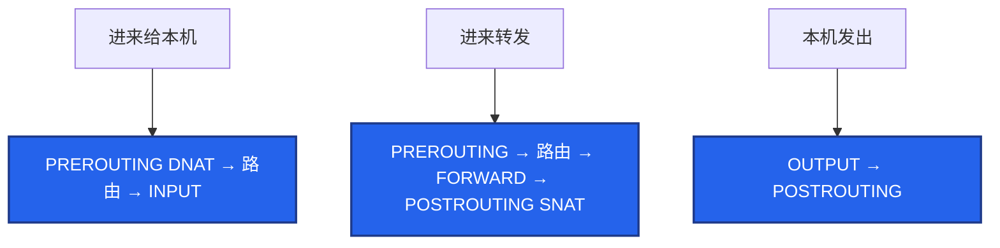

# 15｜iptables 与 conntrack · 练习题

先对照 [知识点](知识点.md) **本章主线** 自己口述，再对答案。每题标了覆盖范围：

| 标记 | 含义 |
|------|------|
| **核心** | 不懂整章就没建立起来 |
| **必会** | 值班和面试都要能讲 |
| **常用** | 线上会反复碰到 |
| **常考** | 白板和追问的高频口径 |

## 本题目录

- [Q1 五链四表](#q1)
- [Q2 规则顺序与锁 SSH](#q2)
- [Q3 NAT 游戏服](#q3)
- [Q4 conntrack 表满](#q4)
- [Q5 iptables vs IPVS](#q5)
- [Q6 K8s DNAT / MASQUERADE](#q6)
- [Q7 firewalld](#q7)
- [Q8 NOTRACK 与 INVALID](#q8)
- [Q9 -v 计数](#q9)
- [Q10 和新连接证据链](#q10)
- [合上书](#合上书)

---

## Q1

**★★★★★｜iptables 的五链四表是什么？包怎么经过？**

**覆盖**：核心 · 必会 · 常考

**对应**：知识点 §2 架构图 · §3 原理

### 场景

开场就让你画「一个包从网卡进到本机进程」。有人开始背 filter 的 ACCEPT。

### 完整解答

**一句话**：四表 raw>mangle>nat>filter，五链 PREROUTING/INPUT/FORWARD/OUTPUT/POSTROUTING；DNAT 在路由前，SNAT 在出接口前。

四表优先级：raw > mangle > nat > filter。五链：PREROUTING、INPUT、FORWARD、OUTPUT、POSTROUTING。



DNAT 必须在路由前改目的，SNAT 必须在出接口前改源。所以它们不在 filter。外网 SSH 走 INPUT；VIP 转发走 FORWARD，还要 `ip_forward=1`。只开 INPUT 80 不够。

### 再追问

- DNAT 和 SNAT 分别在哪个链、改什么？——DNAT 在 PREROUTING 改目标 IP/端口。SNAT 在 POSTROUTING 改源 IP。MASQUERADE 是出口 IP 不固定时的动态 SNAT。

---

## Q2

**★★★★★｜只允许内网 10.0.0.0/8 访问 22，其他拒绝。顺序反了会怎样？怎么避免锁死？**

**覆盖**：核心 · 必会 · 常用

**对应**：知识点 §3 原理 · §7 生产排障

### 场景

安全要求收紧 SSH。有人先写了一条 DROP 再写 ACCEPT。只有当前这一条 ssh。准备加默认 DROP。

### 完整解答

**一句话**：规则从上到下命中即停，放行必须在拒绝前，ESTABLISHED 放最前；另开新 ssh 验证，留 console 防锁死。

从上到下匹配，命中即停。放行必须在拒绝前。

```bash
iptables -A INPUT -m state --state ESTABLISHED,RELATED -j ACCEPT
iptables -A INPUT -p tcp --dport 22 -s 10.0.0.0/8 -j ACCEPT
iptables -A INPUT -p tcp --dport 22 -j DROP
```

DROP 在前：所有 22 都被丢掉，ACCEPT 永远走不到。ESTABLISHED 通常放最前：回包不必写反向规则。这条丢了，SYN 放行了回包可能被 DROP。

防锁死：留 console；先 INSERT 放行你的 IP；**另开一条新 ssh** 验证——当前会话已是 ESTABLISHED，DROP 对它暂时无效；保存前再验证。云上能改安全组就改安全组。已经锁死走 console 删 DROP / 改 policy。INPUT policy DROP 时必须先放行 ESTABLISHED 和需要的端口。

### 再追问

- 保存错了 reboot？——也回不来。所以保存前验证；没有 console 就不要在唯一 ssh 上加默认 DROP。

---

## Q3

**★★★★★｜游戏登录 VIP 和房间 UDP，NAT 怎么讲？**

**覆盖**：核心 · 必会 · 常考

**对应**：知识点 §3 原理 · §8 必会 · 常考

### 场景

大厅 HTTPS 通，房间进不去。有人在 filter 里找 NAT。后端反外挂看到的全是网关 IP。UDP 心跳 40s 一次，玩家空闲一两分钟被踢。

### 完整解答

**一句话**：登录和房间是不同 DNAT；UDP 也走 conntrack，心跳必须短于 `udp_timeout`，SNAT 后源 IP 变网关。

登录：DNAT 在 PREROUTING 把 VIP:443 改到大厅。房间是 **另一条连接、另一个端口**，要单独的 DNAT/FORWARD/安全组。

UDP 也走 conntrack。默认 `udp_timeout` 常见 **30s**。心跳 > 超时 → 项过期，下一次包变 NEW，表现为房间被踢。不要把全部 UDP NOTRACK——NAT 不记账，会话会坏。

SNAT 之后后端看到网关 IP。要真实客户端 IP：少一层无脑 SNAT，或 TOA / Proxy Protocol。出口 IP 固定用 SNAT；弹性 IP 用 MASQUERADE。内网打自己的 VIP 不通、外网通 → hairpin。

计数：`iptables -t nat -L -n -v`。0 = 没走到；有了仍不通 → FORWARD / `ip_forward=1`。

### 再追问

- MASQUERADE 和 SNAT 怎么选？——出口 IP 会变用 MASQUERADE；游戏网关公网 IP 固定用 SNAT，会话更稳。

---

## Q4

**★★★★★｜conntrack 表满了怎么办？怎么证明？**

**覆盖**：核心 · 必会 · 常用

**对应**：知识点 §3 原理 · §7 生产排障 · §8 必会 · 常考

### 场景

活动高峰新登录全失败，战斗长连接还在。有人要改安全组。dmesg 还没看。默认 max 65536。

### 完整解答

**一句话**：新挂旧不挂是表满铁证——`conntrack -C` vs max + dmesg `table full`；调大 max 只是买时间。

新连接丢、旧连接在，优先表满，不是光纤、不是安全组（安全组通常新旧都死）。

```
conntrack -C  vs  nf_conntrack_max
dmesg | grep conntrack
   nf_conntrack: table full, dropping packet
```

新 SYN 在 PREROUTING 就被丢。处理：

1. 调大 `nf_conntrack_max`（如 1048576）买时间；hashsize ≈ max/8
2. 缩短 ESTABLISHED 超时（短连接）
3. UDP 对齐心跳，不要误伤房间
4. raw 表 NOTRACK **定点**豁免
5. 换 IPVS / nftables / Cilium
6. 查短连接泄漏、没开 Keep-Alive

`conntrack -L` 按源 IP 聚合看谁占满。先证明满，再调大。只调大是推迟爆炸。sysctl 持久化在 [18](../18-内核参数与sysctl/)。K8s iptables kube-proxy 规则爆炸会一起把表打满。

### 再追问

- 调大之后还要做什么？——查谁占满、短连接是否能复用、K8s 是否该切 IPVS。
- 算术：5 万在线 + 登录重试、没 Keep-Alive，65536 几分钟顶满。长连接已在 ESTAB，所以旧玩家还在打。

---

## Q5

**★★★★★｜iptables 和 IPVS 差在哪？换 IPVS 还要看 conntrack 吗？**

**覆盖**：核心 · 必会 · 常考

**对应**：知识点 §3 原理 · §8 必会 · 常考

### 场景

K8s 节点上千 Service。`iptables -L` 要数秒。活动高峰 conntrack 反复满。有人说「切 IPVS 就不用管表了」。

### 完整解答

**一句话**：iptables 规则 O(n) 会爆炸；IPVS 哈希快，但多数 DNAT 仍吃 conntrack，换 IPVS 不等于不管表满。

| | iptables | IPVS |
|--|----------|------|
| 匹配 | 规则条数线性，O(n) | 哈希，接近 O(1) |
| 规模 | Service×Endpoint 爆炸；`-L` 慢 | 大规模更好 |
| conntrack | 每条连接一项 | **多数 DNAT 仍吃表** |

切换动机：规则爆炸、kube-proxy 刷规则抖 P99、表反复满。IPVS 治 **规则规模**，不自动消灭表满，也不治短连接泄漏。切完仍要监控 count/max。Cilium 见 K8s 23。主机 LVS 见 [16](../16-LVS与四层负载均衡/)。

游戏大厅几百个 Service 的节点上，活动高峰先 `conntrack -C`，不要先怀疑 CNI。

### 再追问

- 主机防火墙还用 iptables 吗？——filter 仍可能在。IPVS 是转发平面，不是「删掉五链四表」。

---

## Q6

**★★★★☆｜K8s 里哪条是 DNAT、哪条是 MASQUERADE？表满会怎样？**

**覆盖**：必会 · 常用 · 常考

**对应**：知识点 §3 原理 · §6 命令与操作

### 场景

Service 通，节点上新 Pod 访问外网失败。长连接还在。有人在 filter 表里找 K8s 规则。

### 完整解答

**一句话**：集群外进 Service 是 DNAT，Pod 出网是 MASQUERADE，都写 conntrack；表满则 NAT 失败。

```
集群外 → Service VIP     DNAT（PREROUTING）→ Pod
Pod → 外网               MASQUERADE（POSTROUTING）改成节点 IP
```

都写 conntrack。表满则 NAT 失败，新连接挂。看 `iptables -t nat -L -n -v` 的命中，不要只看 filter。规则条数爆炸 + 表满 → IPVS / Cilium。kube-proxy 的大量规则在 nat 和 filter 都有，排查要带 `-t`。

### 再追问

- 为什么 NAT 不在 filter？——filter 只做放行/拒绝。改地址是 nat 表。

---

## Q7

**★★★★☆｜firewalld 和 iptables 一起改会怎样？云上怎么做？**

**覆盖**：必会 · 常用

**对应**：知识点 §4 落地 · §7 生产排障

### 场景

CentOS 节点。有人 `firewall-cmd` 开了端口，你又 `iptables -A` 加了一条。重启后只剩一边。探活间歇 502。

### 完整解答

**一句话**：firewalld 和 iptables 二选一，混改会互相覆盖；云上优先改安全组，不要在 ECS 再堆本地墙。

firewalld 是前端，背后是 nft/iptables。两边对着改会互相覆盖。生产二选一。规则「写了但不挡」、`-v` 计数为 0，有可能是 firewalld 把你手写的冲掉了。

K8s 节点常关 firewalld，交给安全组 + NetworkPolicy。云上优先改安全组，不要在 ECS 再堆本地墙——健康检查源很容易漏，表现为间歇探活失败 / 502。

发行版已经用 nftables：多数是兼容层。概念还是五链四表。长期学 nft 语法，排障时先搞清到底谁在写规则。

### 再追问

- reboot 丢规则？——没 iptables-save / persistent。表现为「昨天还通」。

---

## Q8

**★★★★☆｜NOTRACK 什么时候用？乱豁免有什么风险？DROP INVALID 呢？**

**覆盖**：必会 · 常用

**对应**：知识点 §3 原理 · §7 生产排障

### 场景

表满之后有人要把全部 UDP 都 NOTRACK。战斗服心跳正好是 UDP。另一次加固 DROP INVALID，大包不通。

### 完整解答

**一句话**：NOTRACK 是 raw 表定点减账，乱豁免会让 NAT 和状态防火墙失效；DROP INVALID 可能误伤 PMTUD。

raw 表在 conntrack 之前。NOTRACK 让这类包不进表，能给短连接、不需要状态的流量减账。

乱豁免：状态防火墙失效，回包对不上，NAT 也不记账，DNAT 会话会坏。游戏 UDP 心跳如果还做 NAT，不能随便 NOTRACK。先调大 max、缩短超时、治短连接，豁免是定点手术。

INVALID：常见加固会 DROP。但 PMTUD、某些 NAT 边角会被误判 INVALID，表现为大包不通（[11](../11-网络排障与抓包/) MTU）。加这条要能回滚、要测大包。

### 再追问

- 定点豁免什么流量？——例如节点上不需要状态的健康检查网段、明确不走 NAT 的流量。不要「全部 UDP」。

---

## Q9

**★★★★☆｜-L 没有命中计数，规则「没生效」？**

**覆盖**：必会 · 常用

**对应**：知识点 §6 命令与操作 · §7 生产排障

### 场景

加了 DROP，攻击还在。`iptables -L -n` 看得到规则。没加 `-v`。

### 完整解答

**一句话**：必须 `-v` 看计数；为 0 说明包没走到这条链，或写错表、被 firewalld 覆盖。

必须 `-v` 看计数。计数为 0：包没走到这条链，或前面已经匹配返回。还有可能改错表（写在 filter，包在 nat 就被改走了），或 firewalld 覆盖了。

```bash
iptables -L -n -v --line-numbers
iptables -t nat -L -n -v
```

K8s 节点规则极多，`-L` 会很慢，这本身也是性能问题信号（Q5）。policy DROP 是链末兜底；规则是中间匹配。

### 再追问

- 计数在涨但仍通？——命中的是 ACCEPT，或 DNAT 之后走了别的链。对着架构图看这条包该走哪。

---

## Q10

**★★★★☆｜新连接失败，你怎么用本章和 11 拼成一条证据链？**

**覆盖**：必会 · 常用

**对应**：知识点 §7 生产排障

### 场景

oncall：登录超时。ss 显示大量 ESTAB。安全组没人动过。

### 完整解答

**一句话**：旧 ESTAB 在、新建不了 → 先证 conntrack 表满，再抓新 SYN，最后才查安全组。

```
① ss：旧 ESTAB 在，新的建不起来     不像光纤
② conntrack -C vs max、dmesg table full     ← 本章
③ 抓新 SYN 有没有出网卡（11）
④ 才轮到安全组 / 对端
```

表满是本章的锅；SYN 出了网卡对端不回是 [11](../11-网络排障与抓包/) 的锅。不要一上来改 iptables policy。大厅通房间不通：房间端口 / UDP 超时，不要只抓登录 443。

调大 max 之后：查谁占满、短连接是否能复用、K8s 是否该切 IPVS。只调大是推迟爆炸。

### 再追问

- 活动高峰该不该重启战斗服？——不要。旧长连接还在。先救表、停短连接风暴。

---

## 合上书

- [ ] 能画出本机/转发/本机发出各走哪些链；DNAT/SNAT 在哪
- [ ] 能写放行在拒绝前、ESTABLISHED 最前；另开 ssh 验证防锁死
- [ ] 能讲游戏登录 DNAT、房间 UDP、源 IP、心跳超时、hairpin
- [ ] 能证表满：`conntrack -C` vs max + dmesg；调大之后还做什么
- [ ] 能对比 iptables 和 IPVS；换 IPVS 仍要看 conntrack
- [ ] 能说明 firewalld 混改、云上改安全组、`-v` 计数为 0 查什么
