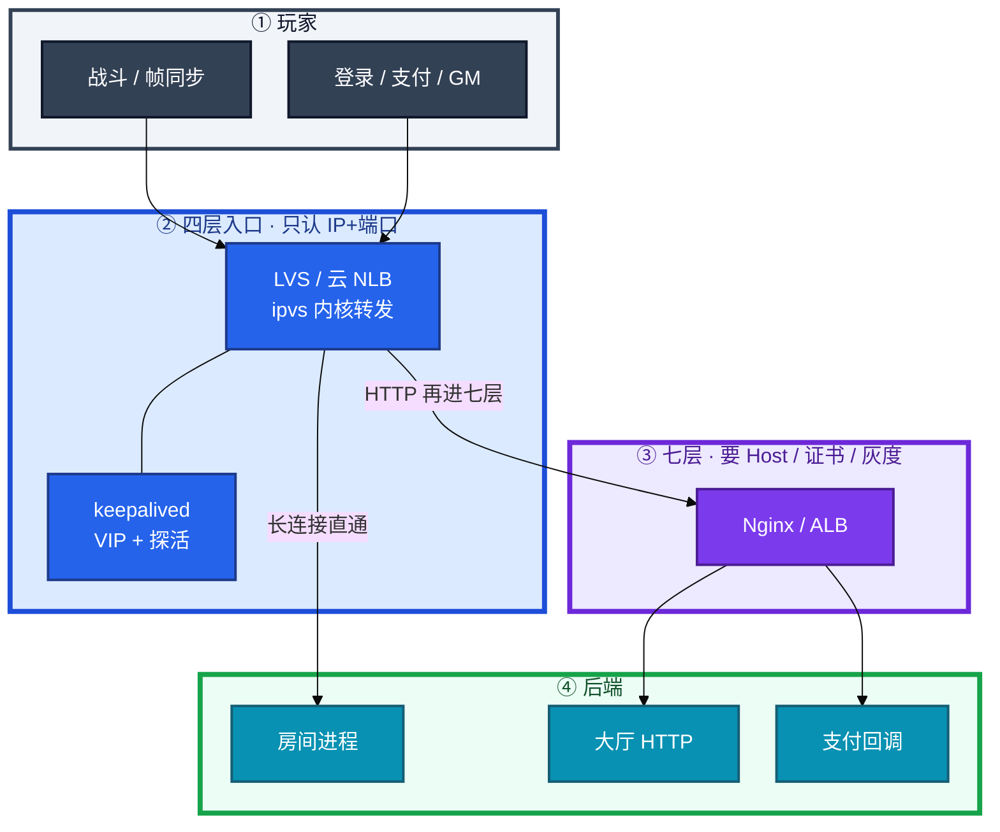
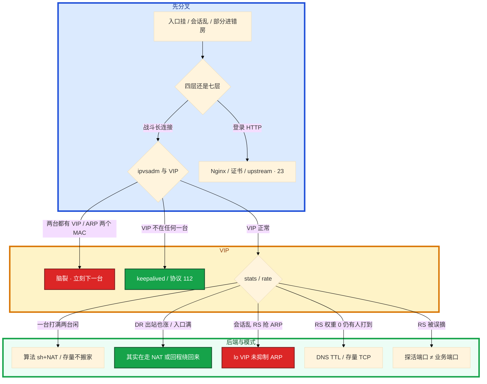

# LVS 与四层负载均衡


活动开闸，战斗入口网卡打满。群里有人要把房间挂到 Nginx「统一入口」，另有人把 NAT 模式的 LVS 权重加满——Meanwhile `ip neigh` 里 VIP 已经对应两个 MAC，部分玩家进 A 房、部分直连某台 RS，会话全乱。

先别动手。这一章后半全是你会动手的：**怎么选 NAT/DR/TUN、怎么给 RS 探活、怎么加机器、怎么漂 VIP、会话乱时先下一台还是先改算法。** 前面的概念和原理，是为了让你动手时不把长连接塞进七层、不把回包再打一遍入口。

**本章主线（排障就按这三步想）：**

1. **分层**：战斗长连接走四层直通；登录 HTTP 可再进七层。
2. **选模式**：同二层用 DR + 抑制 ARP；回包大别用 NAT。
3. **探活摘机**：只停新分配；双 VIP 先下一台。

**读完你能：** 白板上画出 NAT / DR / TUN 回程差在哪；战斗长连接说清走四层还是七层；会加 RS、健康检查摘机、VIP 切换；会话乱能分清双主、后端抢 VIP、还是算法打偏。

## 本章目录

- [1. 基本概念](#1-基本概念)
- [2. 架构图](#2-架构图)
- [3. 原理](#3-原理)
  - [3.1 NAT / DR / TUN](#31-nat--dr--tun回程决定瓶颈)
  - [3.2 调度算法](#32-调度算法第一次分配)
  - [3.3 会话与长连接](#33-会话与长连接建立后不切)
  - [3.4 RS 健康检查](#34-rs-健康检查摘的是新分配)
- [4. 落地](#4-落地)
- [5. 核心配置](#5-核心配置)
- [6. 命令与操作](#6-命令与操作)
- [7. 生产排障](#7-生产排障)
- [8. 必会 · 常考](#8-必会--常考)
- [合上书](#合上书问自己)

**本章不讲：** HAProxy 配置、Keepalived 配置细节、VPN → [24 HAProxy 与 Keepalived](../24-HAProxy与Keepalived/)；Nginx 七层、证书、upstream → [23 Nginx](../23-Nginx/)；kube-proxy IPVS → [04-08 Service 与 kube-proxy](../../04-Kubernetes/08-Service与kube-proxy/)；高可用 RTO、脑裂总论 → [20 高可用与容灾](../20-高可用与容灾/)；DNS TTL 与「用户已切」 → [10 DNS 与 CDN](../10-DNS与CDN/)。

---

## 1. 基本概念

LVS（Linux Virtual Server）是内核 **四层负载均衡**：看 **IP + 端口**，不看 URL、不拼 HTTP、不终结 TLS。工作在 netfilter hook，用户态只有 `ipvsadm` 下规则。数据包在内核里改个目的就走，不必先变成「请求」。

**值班里什么时候碰到**：活动入口打满、部分玩家进错房、双 VIP 脑裂、探活把活房间摘了、NAT 入口网卡双向流量爆表——这些词一出现，先想四层而不是 Nginx。

七层（Nginx / ALB）必须把字节流解析成 HTTP：证书、Host、路径、缓冲、超时。适合登录、支付、按 URL 灰度。**不适合把战斗长连接塞进去**——连接要钉几十分钟，中间几乎没有「一次请求结束」，解析层会变成缓冲和超时的事故源，容量也比四层差一个数量级。

**打个比方**：四层像快递分拣中心只看「收件地址 + 门牌号」就派车；七层还要拆箱读单据、验签名、按品类改路线——短包裹行，一整柜货（长连接）塞进去会堵死流水线。

三个角色不要混：

| 角色 | 干什么 |
|------|--------|
| **ipvs** | 内核转发。规则在，进程挂了正在转的连接通常还在 |
| **ipvsadm** | 用户态下规则、看 stats。它挂 ≠ 正在跑的连接立刻断 |
| **keepalived** | VIP（VRRP）+ 常兼 RS 健康检查。配置怎么写在 24 |

| 在四层里 | 不在四层里 |
|----------|------------|
| IP、端口、TCP/UDP 五元组 | URL、Header、Cookie、Host |
| 第一次把连接分到哪台 RS | 按路径灰度、改响应、终结 TLS |
| DR 改 MAC、NAT 改 IP | 理解「这一帧是登录还是心跳」 |

> **记住**：四层转发会话，七层理解请求。长连接没有「请求结束」，不要为了「统一入口」把战斗挂到 Nginx。规则在内核里转，`ipvsadm` 挂了不等于正在跑的连接立刻断——和 kube-proxy 同一类影响面。

**面试怎么说**：「战斗长连接走 LVS 四层直通，登录 HTTP 可以四层后再进 Nginx；ipvsadm 挂不会立刻踢玩家，双 VIP 才要立刻下一台。」

---

## 2. 架构图

先把整张图钉住。后面排障都对着这张图。



**读图三句话：**

1. **战斗长连接：玩家 → 四层 LB → 房间进程，不再进七层。**
2. **登录 / 支付：可以先过四层入口，再进 Nginx 做 Host、证书、灰度。**
3. **公告 / 包体走 CDN（10），不是 LVS。**

三种转发模式（装的时候选，挂的时候瓶颈不一样）：

```mermaid
%%{init: {"flowchart": {"padding": 16, "nodeSpacing": 36, "rankSpacing": 48}, "theme": "base"}}%%
flowchart TB
    subgraph nat ["NAT · 双向都过 LVS"]
        n1[客户端] --> n2[LVS DNAT]
        n2 --> n3[RS]
        n3 --> n2
        n2 --> n1
    end

    subgraph dr ["DR · 回包直出 · 最常用"]
        d1[客户端] --> d2[LVS 改 MAC]
        d2 --> d3[RS · VIP 在 lo]
        d3 --> d1
    end

    subgraph tun ["TUN · IPIP · 可跨网段"]
        t1[客户端] --> t2[LVS 封装]
        t2 --> t3[RS tunl0]
        t3 --> t1
    end

    classDef lvs fill:#2563EB,stroke:#1E3A8A,stroke-width:2px,color:#fff
    classDef rs fill:#16A34A,stroke:#14532D,stroke-width:2px,color:#fff
    classDef c fill:#334155,stroke:#0F172A,stroke-width:2px,color:#fff
    class n2,d2,t2 lvs
    class n3,d3,t3 rs
    class n1,d1,t1 c

    style nat fill:#FEF3C7,stroke:#D97706,stroke-width:4px,color:#92400E
    style dr fill:#ECFDF5,stroke:#16A34A,stroke-width:4px,color:#14532D
    style tun fill:#DBEAFE,stroke:#2563EB,stroke-width:4px,color:#1E3A8A
```



NAT：LVS 是瓶颈，后端可以跨网段、无需特殊配置。DR：只扛入站，要同二层且 RS 抑制 ARP。TUN：跨网段又想直回，RS 要解封装。

---

## 3. 原理

原理只保留动手和面试会用到的：回包过不过 LVS、算法只管第一次分配、探活摘的是新连接、VIP 漂了存量会断。

### 3.1 NAT / DR / TUN：回程决定瓶颈

**一句话：** DR 改 MAC、回包直出；NAT 双向过 LVS，游戏回包大会先把入口打满。

**打个比方**：NAT 像所有快递必须回分拣中心再出库——货越多入口越堵；DR 像只派单一次，回程司机直接从仓库开到客户家；TUN 像给包裹套一层保温袋（IPIP 封装）跨区送达，到了再拆。

**现场走一遍**（怀疑 NAT 把入口打满，在 LVS 上确认模式）：

1. SSH 到 LVS，先看虚拟服务和 RS 模式：

```bash
ipvsadm -L -n
ipvsadm -L -n --stats
```

2. 屏幕出现（节选）：

```text
TCP  203.0.113.1:7777 wlc
  -> 10.0.0.11:7777             Route   wgt   ActiveConn  InActConn
  -> 10.0.0.12:7777             Masq    5     1200        80
  -> 10.0.0.13:7777             Masq    5     1180        75
```

3. `--stats` 再看累计字节（节选）：

```text
Prot LocalAddress:Port               Conns   InPkts  OutPkts  InBytes OutBytes
TCP  203.0.113.1:7777              50000   2.1M    2.0M     180G    420G
  -> 10.0.0.11:7777                16000   700K    680K     60G     140G
```

4. 若 `Route` 列是 **Masq** → 你在走 **NAT（`-m`）**；若是 **Route** 且 stats 里 LVS 本行 **OutBytes 接近 InBytes** → 回包也过 LVS，入口网卡双向打满符合预期。
5. 若改成 DR，应看到 `Route` 为 **Route**（`-g`），且 LVS 虚拟服务行的 **OutBytes 远小于 InBytes**（出站近 0）。下一步去 RS 确认 lo 上 VIP 和 ARP 抑制（§5）。

**输出解读：**

| 字段 / 现象 | 说明 | 下一步 |
|-------------|------|--------|
| `Masq` | NAT 模式，双向过 LVS | 回包大 → 评估改 DR |
| `Route` + LVS OutBytes ≈ 0 | DR，回包直出 | 查 RS lo VIP、抑制 ARP |
| `Tunnel` | TUN（`-i`），IPIP 封装 | 查 tunl0、MTU、rp_filter |
| OutBytes 约为 InBytes 2～3 倍 | 游戏状态同步回包大于请求 | NAT 下入口先满，不是加 RS 能根治 |

**面试怎么说**：「同二层战斗入口我选 DR：LVS 只改 MAC，回包 RS 用 VIP 直出；NAT 双向过 LVS，状态同步回包大会先把入口网卡打满。TUN 用 IPIP 跨网段，要调 MTU。」

| 模式 | ipvsadm | LVS 瓶颈 | 后端要求 | 性能 | 场景 |
|------|---------|----------|----------|------|------|
| NAT | `-m` | 大（双向） | 网关指向 LVS；可跨网段 | 中 | 简单、端口映射、RS 不想改网卡 |
| DR | `-g` | 小（仅入站） | **同二层**、lo 上 VIP、抑制 ARP | 高 | **最常用** |
| TUN | `-i` | 小（仅入站） | IPIP / tunl0、VIP、注意 MTU | 高 | 跨网段又想直回 |

> **记住**：DR 改 MAC、回包直出，要同二层且后端抑制 ARP；NAT 双向过 LVS，游戏回包大会先把入口打满；TUN 用封装换跨网段。

### 3.2 调度算法：第一次分配

**一句话：** 算法只管第一次分配；长连接建立后本身不切后端。

**打个比方**：算法像银行叫号——只决定你第一次去哪个窗口；办业务中途（TCP 已 ESTAB）不会把你搬到隔壁窗口。rr 是严格轮流；lc 是看哪个窗口排队最短。

**现场走一遍**（一台 RS CPU 满、两台闲，怀疑算法打偏）：

1. LVS 上看实时速率和连接数：

```bash
ipvsadm -L -n --rate
ipvsadm -L -n | grep -A5 203.0.113.1:7777
```

2. 屏幕出现（节选）：

```text
Prot LocalAddress:Port  CPS   InPPS  OutPPS  InBPS   OutBPS
TCP  203.0.113.1:7777   120   8000   120     12M     18M
  -> 10.0.0.11:7777     95    7200   90      10M     2M
  -> 10.0.0.12:7777     12    400    15      800K    8M
  -> 10.0.0.13:7777     13    400    15      800K    8M
```

3. **口算对比**：`10.0.0.11` 的 CPS **95**、InBPS **10M**；另两台各 **12～13** CPS——新连接明显扎堆 11 号。
4. 查调度器：`ipvsadm -L -n` 第一行若是 `rr` 且 11 号刚维护加回 → rr 会立刻再灌满。改 `lc` 或 `wlc` 只影响**新连接**：

```bash
ipvsadm -E -t 203.0.113.1:7777 -s wlc
```

5. 等 2～3 分钟再看 `--rate`：新 CPS 应更均匀；**11 号上已有 ActiveConn 不会搬家**——存量要靠客户端重连或进程重启才释放。

**输出解读：**

| 字段 | 含义 | 异常时怀疑 |
|------|------|------------|
| CPS | 每秒新连接 | 一台特别高 → rr / sh+NAT 打偏 |
| ActiveConn | 当前活跃连接 | 一台特别高、CPS 已平 → **存量**不随算法变 |
| InBPS / OutBPS | 入站 / 出站带宽 | DR 下 LVS 行 OutBPS 应远小于 RS |
| `-s rr` / `-s sh` | 轮询 / 源哈希 | NAT 出口后多用户同 IP → sh 扎堆 |
| `lc` / `wlc` | 最少连接 / 加权 | **长连接入口常用** |

**面试怎么说**：「长连接入口我用 wlc，算法只管第一次 SYN 分配；改算法不会搬已有 TCP。一台满两台闲，先看 ActiveConn 是不是存量，再看是不是 rr 或 sh+NAT 打偏。」

> **别混**：改算法 ≠ 踢存量；权重 `-w` 只影响新分配比例。

### 3.3 会话与长连接：建立后不切

**一句话：** VIP 漂移瞬间存量连接会断；不要答「完全无感」。

**打个比方**：VIP 像商场总机号码——号码迁到新前台那一秒，正在通话的老顾客线路会断，只能重拨；四层不会把「正在通话的线」悄悄接到另一台分机。

**现场走一遍**（主 LVS 故障，VIP 漂到备机，玩家大面积掉线）：

1. 两台 LVS 同时查 VIP（活动事故第一刀）：

```bash
ip addr show | grep 203.0.113.1
```

2. 正常应**只有一台**有 `203.0.113.1/32`；若两台都有 → **脑裂**，立刻下一台（§7），不要等玩家重连。
3. 只有备机有 VIP 时，在**旧主**上看存量是否还在：

```bash
ipvsadm -L -n --stats | head
conntrack -C    # NAT 模式下旧主上可能还有条目
```

4. 旧主 screen：`ActiveConn` 可能仍 > 0，但 VIP 已不在 → 新 SYN 进不来；**已在旧主 NAT 表里的连接**，回包对不上 → 玩家感觉「突然全断」。
5. DR 下回包不经 LVS，但 VIP 离开旧 MAC 的瞬间，仍打到旧 LVS 的帧会丢。结论：**漂移会断存量**；降低影响靠客户端重连、`nopreempt` 少闪断、必要时 conntrack 同步（成本高，见 20）。

**输出解读：**

| 现象 | 技术含义 | 口径 |
|------|----------|------|
| 两台都有 VIP | VRRP 脑裂 | 立刻下一台，查 IP 协议 112 |
| 备机有 VIP、旧主 ActiveConn>0 | 存量绑在旧转发路径 | 四层不搬连接，等重连 |
| NAT + 漂移 | conntrack 在旧主 | 比 DR 断得更「齐」 |
**面试怎么说**：「长连接建立后 LB 不会 mid-flight 换 RS；VIP 漂移会断存量，NAT 下 conntrack 在旧机更明显。我不会说漂移完全无感，靠重连和探活快速摘掉坏后端。」

> **记住**：不要指望四层在 TCP 中途把连接搬到另一台——那是七层终止或应用自己的迁移。

### 3.4 RS 健康检查：摘的是新分配

**一句话：** 探活摘的是新分配；存量 TCP 还在旧 RS 上。

**打个比方**：探活像餐厅「今日满座」灯——灯灭了新客不再进门，但里面正在吃的客人不会被强行换桌；要清场只能关进程或断连接。

**现场走一遍**（监控显示 RS 已摘，仍有玩家连到死机器）：

1. LVS 上看 RS 权重和连接：

```bash
ipvsadm -L -n | grep -A10 203.0.113.1:7777
```

2. 屏幕出现：

```text
  -> 10.0.0.11:7777             Route   0     0           0
  -> 10.0.0.12:7777             Route   5     890         12
  -> 10.0.0.13:7777             Route   5     910         10
```

3. **11 号权重已是 0**、ActiveConn **0** → 新连接不会再分过去，符合探活摘机。
4. 但玩家仍报「在 11 号房卡死」→ 查 11 号本机是否还有 ESTAB（存量）：

```bash
ss -ant | grep ':7777' | wc -l
```

5. 若 `ss` 仍有几百条 → **探活只停新分配，不踢存量**。要清只能停进程或 `iptables`/应用层断连。同时查 DNS：`dig +short fight.example.com` 仍指向 VIP（10）——**摘流量要 LB 摘 + DNS**，不要只改 DNS。

**输出解读：**

| 状态 | ipvsadm 表现 | 存量 TCP | 新连接 |
|------|--------------|----------|--------|
| 权重 0 | `-w 0`，仍在表里 | 仍在 RS 上 | 不再分配 |
| 从表删除 `-d` | 无此行 | 仍在 RS 上 | 不再分配 |
| 探活端口 ≠ 业务端口 | 误摘活 RS | 玩家被踢去重连 | 错杀 |

| 层 | 例子 | 假活 / 误摘 |
|----|------|-------------|
| 进程 | `killall -0` | 进程在但不 accept |
| TCP | `TCP_CHECK` 连业务端口 | 端口开着逻辑已死 |
| HTTP | `HTTP_GET` `/health` → 200 | 静态 200，房间已挂 |
| 外部脚本 | `MISC_CHECK` | 探活 8080、战斗 7777 → **误摘** |


**面试怎么说**：「健康检查失败只停新分配，四层不会把 ESTAB 搬到别的 RS；权重 0 后存量还在，要配合 DNS TTL。探针必须打业务端口，连续失败 3～5 次再摘。」

---

## 4. 落地

| 项 | 选 | 不选 |
|----|----|------|
| 长连接入口 | 云 NLB 或自建 LVS+**DR** | Nginx stream 硬扛百万连接 |
| HTTP 登录/支付 | 四层入口后再进七层 | 战斗和登录合成一个「入口」 |
| 模式 | 同二层用 DR；跨网段用 TUN 或 NAT | 游戏回包大还用 NAT |
| HA | 两台 LVS + keepalived | 单台 LVS；心跳和业务口混在一起还不监控双 VIP |
| 算法 | 长连接 lc/wlc | 默认 rr；NAT 后对海量用户用 sh |
| RS | lo 上 VIP + 抑制 ARP；探活打业务口 | 后端响应 VIP 的 ARP |

云上多数用 NLB 就够。本章的 NAT/DR/脑裂仍要会：健康检查、后端 ARP、连接耗尽还是你的。自建 LVS 用于机房或要 DR 直回。

Keepalived 心跳：VRRP 是 **IP 协议 112**（不是「UDP 端口 112」）。防火墙 / 安全组按协议号放行。心跳走独立链路或单播；`nopreempt` 避免主恢复来回抢；监控「同时存在两个 VIP」。

| 位置 | 内容 |
|------|------|
| LVS 上 `ip_vs` 模块 | 内核转发 |
| `ipvsadm -L -n` | 虚拟服务、RS、权重、ActiveConn |
| `/etc/keepalived/keepalived.conf` | VRRP + `virtual_server` + 探活（写法 24） |
| RS `lo:0` / `tunl0` | VIP；DR 还要 ARP sysctl |
| 本机防火墙 | 放行业务口、VRRP 112；DR 不要把 VIP 的 ARP 放乱 |

验收：进程在不算数。必须 `ipvsadm -L -n --stats` 看到入站在涨、RS 权重符合预期；DR 下出站几乎为 0；RS 上 `ip addr` 能看到 lo 上的 VIP，且 **二层上只有 LVS 在答 VIP 的 ARP**。

---

## 5. 核心配置

只动有证据的项。keepalived 深配置在 24；这里是影响面和 RS 侧必须对的旋钮。

LVS 上（示意）：

```bash
ipvsadm -A -t 203.0.113.1:80 -s wlc
ipvsadm -a -t 203.0.113.1:80 -r 10.0.0.1:80 -g -w 5   # -g = DR
ipvsadm -a -t 203.0.113.1:80 -r 10.0.0.2:80 -g -w 3
```

| 参数 | 含义 | 改错会怎样 |
|------|------|------------|
| `-s wlc` / `lc` | 长连接调度 | 默认 rr 会把刚加回的机器瞬间灌满 |
| `-g` / `-m` / `-i` | DR / NAT / TUN | 回包路径错，会话全乱或入口打满 |
| `-w` | 权重 | 规格不同却等权 → 小机器先炸 |
| `-p <秒>` | persistent | NAT 出口后同 IP 更扎堆 |

RS 上 DR 抑制 ARP（示意，持久化进 sysctl.d）：

```bash
# VIP 配在 lo
ip addr add 203.0.113.1/32 dev lo

net.ipv4.conf.all.arp_ignore = 1
net.ipv4.conf.all.arp_announce = 2
net.ipv4.conf.lo.arp_ignore = 1
net.ipv4.conf.lo.arp_announce = 2
```

`arp_ignore=1`：只在目标 IP 配在入接口上才答 ARP。VIP 在 lo，物理网卡不答。`arp_announce=2`：宣告用最合适的源，避免用 VIP 当源去喊。TUN 还要放行 IPIP、调 MTU，`rp_filter` 过严会丢解包。

> **记住**：`-g -m -i` 和回包路径绑定。DR 后端不抑制 ARP = 和 LVS 抢 VIP。探活端口错 = 误摘还活着的房间。

---

## 6. 命令与操作

值班先跑这几条：

```bash
ipvsadm -L -n
ipvsadm -L -n --stats
ipvsadm -L -n --rate
ip addr show
ip neigh show | grep <VIP>
```

| 目的 | 命令 | 看什么 |
|------|------|--------|
| 虚拟服务和 RS | `ipvsadm -L -n` | 模式、算法、权重、是否还在表里 |
| 累计流量 | `ipvsadm -L -n --stats` | DR 入站涨、出站近 0；NAT 进出都涨 |
| 实时速率 | `ipvsadm -L -n --rate` | 打偏、某 RS 为 0 |
| 本机 VIP | `ip addr` | 两台都有 VIP = 脑裂 |
| ARP | `ip neigh` / 交换机 MAC 表 | VIP 对应几个 MAC |
| RS 上 lo | `ip addr show lo` | VIP 在不在；不该在物理网卡上 |
| 模块 | `lsmod \| grep ip_vs` | 没加载等于没转发 |

改服务调度器：`ipvsadm -E -t <VIP:port> -s lc`。已有连接仍按旧绑定，看的是**新连接**分布。

不要只 `ping VIP`。ICMP 和 TCP 80/战斗口不是一条规则。

### 6.1 加 / 摘 RS


1. 新 RS：DR 配 lo VIP + `arp_ignore=1` / `arp_announce=2`；TUN 配隧道；NAT 确认网关。
2. `ipvsadm -a -t <VIP:port> -r <RS:port> -g -w <n>`。
3. `--stats` / `--rate` 确认有流量。探活脚本也要覆盖新机器。
4. 摘机：**先把权重改 0**，等新连接不再来、存量自己消；再 `-d`。直接 delete 只停新分配，存量仍在，但表项没了更难看清。

维护窗口不要高峰 rr 把刚加回的机器打满，用 wlc 或先给低权重观察。

### 6.2 健康检查调权

探活失败 → 权重 0 或删除。失败恢复 → 再加回来。卡住先确认：

- 探针是不是业务端口（探活 8080、战斗 7777 是常见误摘）。
- `/health` 是不是静态 200。
- 连续失败次数是不是 1（活动抖动会来回摘）。

云 NLB：改健康检查端口和路径，看目标组 healthy。不要只看实例「running」。

### 6.3 VIP 切换

主挂 → VRRP → VIP 到备。出现双主：立刻下一台、查心跳（协议 112）、修 ARP，不要靠玩家重连「试」。

漂移会断存量连接。NAT 下 conntrack 在旧机。DR 也会在 VIP 离开的瞬间丢打到旧 MAC 的包。切完验证：只有一台 `ip addr` 有 VIP，ARP 只有一个 MAC，`ipvsadm` 规则在新主上。

`nopreempt`：主恢复不要立刻抢回，避免二次闪断。细节 24。

### 6.4 升级 / 回滚 / 迁移

**升级**：先摘流量（权 0 或 VIP 赶到备机）→ 升备验证 → 再切 VIP 升原主；不要两台同时换内核、活动中改 NAT↔DR。RS 逐台权 0 再升。

**回滚**：`ipvsadm` / keepalived.conf 回上一份 reload，看 stats；VIP 已在备上且正常，不要为「主必须是原机」再抢。模式改错须同时回滚 RS 网关/ARP。

**迁移**：换 LVS 先备后切；NAT→DR 低峰改 `-g` 看出站近 0；跨网段 DR 不行改 TUN/NAT；上云 NLB 对齐健康检查与空闲超时。Stacked 改架构走变更窗口，活动中不做。

---

## 7. 生产排障

和入口事故同一套三问：VIP 还在不在？新连接还能不能分出去？已有长连接还通不通？

**LVS 用户态挂了 ≠ 立刻踢玩家。** 内核 ipvs 规则还在，已有连接通常还在转。VIP 没了或双 VIP，才会大面积进错房。



现场顺序：

```bash
ipvsadm -L -n --stats
ipvsadm -L -n --rate
ip addr show
ip neigh show
# RS 上
ip addr show lo
sysctl net.ipv4.conf.all.arp_ignore net.ipv4.conf.all.arp_announce
```

| 现象 | 先做什么 | 不要做什么 |
|------|----------|------------|
| 两台都有 VIP、ARP 两个 MAC | 立刻下一台，查 VRRP 心跳（IP 112） | 让玩家重连试试；先改算法 |
| DR 会话乱 | RS lo 上 VIP 有没有抑制 ARP | 先加机器 |
| NAT 入口网卡满 | 确认回包过 LVS；评估改 DR | 只加带宽 |
| 一台 CPU 满两台闲 | `--stats` 看 ActiveConn；sh+NAT 或存量 | 改完算法指望旧连接搬家 |
| 探活已摘仍有人打到死机器 | DNS TTL（10）+ 存量 TCP | 只改 DNS 不摘 ipvs |
| 健康检查把活房间摘了 | 探活端口是否等于业务端口 | 关掉检查当修复 |
| DR 抓包源 IP 是 VIP | **这是设计** | 当 NAT 没改干净去 SNAT |
| 云 NLB 超时 | 空闲超时 vs 游戏心跳 | 先重启房间 |

活动高峰 ipvs 和日志同机、NAT 回包把入口打满。正确处理：确认 VIP 唯一 → 停发版 → 看 stats 模式和打偏 → 误摘先修探针 → 双主先下一台。不要把战斗切到 Nginx。

---

## 8. 必会 · 常考

白板和追问高频，能一口回：

| 说法 | 对错 | 口径 |
|------|:----:|------|
| 战斗长连接挂 Nginx 方便按 Header 灰度 | 错 | 四层直通；灰度不要牺牲长连接 |
| ipvsadm 挂了正在转的连接立刻断 | 错 | 规则在内核；和 kube-proxy 同类 |
| DR 最常用是因为配置最简单 | 错 | 因为回包直出；要同二层和 ARP |
| NAT 适合游戏状态同步大回包 | 错 | 双向过 LVS，入口先满 |
| TUN 和 DR 一样要求同二层 | 错 | TUN 用 IPIP，可跨网段 |
| 长连接用 rr 就行 | 错 | 常用 lc/wlc；rr 会把刚加回的机器灌满 |
| sh 做会话保持，NAT 后一定均匀 | 错 | 同出口 IP 打到同一 RS |
| 健康检查失败会把存量 TCP 踢到别的机器 | 错 | 只停新分配；四层不搬连接 |
| VIP 漂移完全无感 | 错 | 存量会断；NAT 下 conntrack 在旧机 |
| 心跳 UDP 112 | 错 | VRRP 是 **IP 协议 112** |
| 后端抓包源 IP 是 VIP 说明 NAT 没改干净 | 错 | DR 的设计 |
| 只改 DNS 就能摘流量 | 错 | 还要 ipvs 摘 RS；注意 TTL |
| 云 NLB 就不用懂 DR/ARP | 错 | 健康检查、超时、后端仍是你的 |
| Keepalived 配置在本章展开 | 错 | 影响面本章；conf 在 24 |

数字：VIP 示例 `203.0.113.1`；`-g` DR、`-m` NAT、`-i` TUN；ARP `arp_ignore=1`、`arp_announce=2`；探活连续失败常见 3～5 次、间隔 1～5s；VRRP **IP 112**；权重示例 5 和 3。

易混：NAT vs DR vs TUN（回程）；四层 vs 七层；算法只管新连接 vs 存量；健康检查摘机 vs DNS TTL；双 VIP 脑裂 vs RS 抢 ARP；ipvs 内核 vs ipvsadm 用户态；VRRP 通 vs 后面进程活着。

---

## 合上书，问自己

1. 战斗长连接走四层还是七层？ipvsadm 挂了玩家会不会立刻掉？
2. NAT / DR / TUN 回程差在哪？游戏为什么默认 DR？
3. DR 后端为什么要 `arp_ignore=1` / `arp_announce=2`？TUN 什么时候上？
4. 长连接用 rr 还是 lc？sh 在 NAT 后会怎样？
5. 健康检查摘 RS 之后，存量 TCP 和 DNS TTL 分别怎么办？
6. 双 VIP 先做什么？VIP 漂移会不会断存量？升级怎么滚？

六题都能口述，这一章就过了。下一章把门关死：sshd、sudo、防火墙最小化，以及被拦了为什么不能 `setenforce 0`。
