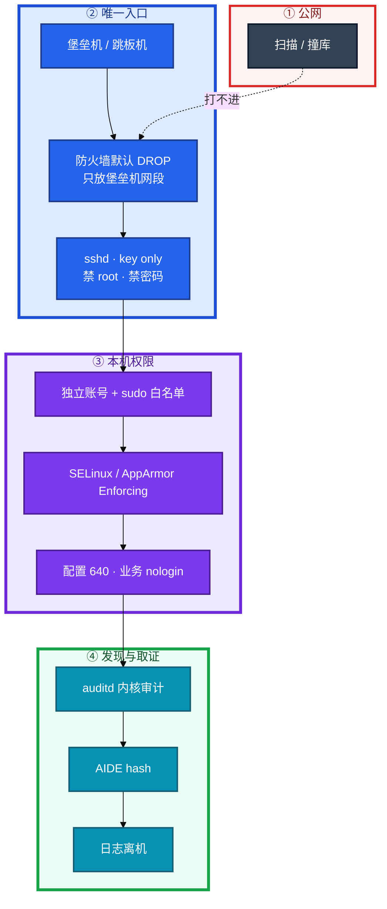
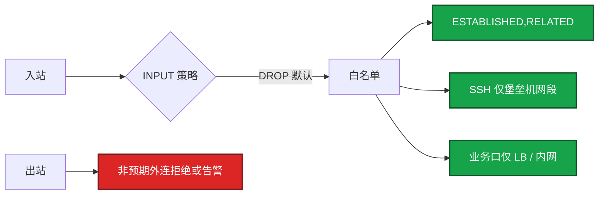
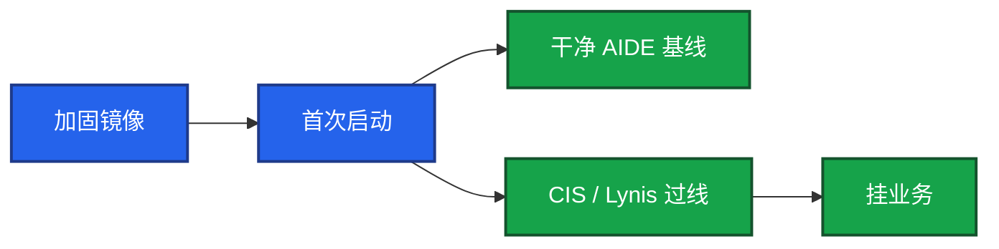
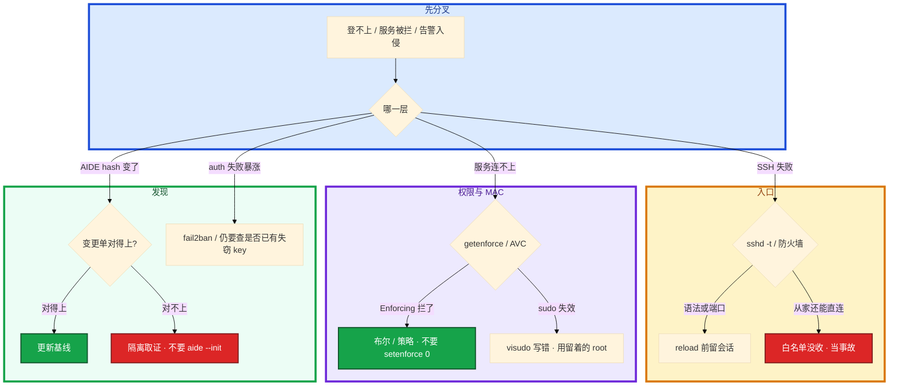

# Linux 安全加固


凌晨大厅机 `auth` 失败次数暴涨。`Failed password for root from 45.x.x.x`。群里有人说「先改成 2222 顶一阵」，另有人 `setenforce 0` 让 Nginx 反代先通。AIDE 还没跑过。

先别动手。这一章后半全是你会动手的：**sshd 怎么关死、sudo 怎么白名单、防火墙怎么最小化、被拦了查 AVC 而不是关 SELinux、发现入侵先隔离取证。** 前面的概念，是为了让你开口先讲三层，而不是报一串工具名。

**读完你能：** 从入口讲到发现；sshd/sudo/防火墙给出可落地的最小集；MAC 被拦会查 AVC；auditd/AIDE 能说清和 history 的差别；CIS 不过知道哪些必须修。

## 本章目录

缩进 = 上下级。3 下面才是 3.1。

想钉在**正文左边**跟着滚：菜单 **查看 → 打开视图 → 大纲**。Markdown 预览做不到独立左栏，目录只能写在文章开头。

- [1. 基本概念](#1-基本概念)
- [2. 架构图](#2-架构图)
- [3. 原理](#3-原理)
  - [3.1 入口：sshd](#31-入口sshd先把门关死)
  - [3.2 权限：sudo 与文件](#32-权限sudo-与文件最小可追责)
  - [3.3 防火墙最小化](#33-防火墙最小化默认拒绝)
  - [3.4 MAC：SELinux / AppArmor](#34-macselinux--apparmor别关)
  - [3.5 发现：auditd / AIDE](#35-发现auditd--aide)
- [4. 安装部署](#4-安装部署)
  - [4.1 生产怎么选](#41-生产怎么选)
  - [4.2 基线镜像落地](#42-基线镜像落地)
- [5. 核心配置](#5-核心配置)
- [6. 常用命令](#6-常用命令)
- [7. 常用操作](#7-常用操作)
  - [7.1 改 sshd](#71-改-sshd)
  - [7.2 改 sudoers](#72-改-sudoers)
  - [7.3 防火墙变更](#73-防火墙变更)
  - [7.4 证书与密钥轮转](#74-密钥轮转)
  - [7.5 升级基线](#75-升级基线)
  - [7.6 入侵响应](#76-入侵响应)
- [8. 生产排障](#8-生产排障)
- [9. 必会 · 常考](#9-必会--常考)
- [合上书](#合上书问自己)

**本章不讲：** 堡垒机产品、录屏、审批工单、ProxyJump 细节 → [25 堡垒机与跳板机](../25-堡垒机与跳板机/)；云 IAM、安全组产品 → [07 云平台](../../07-云平台/)；K8s RBAC / PSS / NetworkPolicy → [04-13](../../04-Kubernetes/13-RBAC与安全/)；conntrack / iptables 链细则 → [15 iptables 与 conntrack](../15-iptables与conntrack/)；somaxconn、tw_reuse、fd → [18 内核参数与 sysctl](../18-内核参数与sysctl/)；审计日志怎么轮转、怎么集中 → [22 日志运维](../22-日志运维/)。

---

## 1. 基本概念

加固不是「改一个 sshd 端口」。生产要叠三层：**谁能进来、进来能干什么、干了什么能不能查到。** 少一层，出事只能猜。

| 层 | 管什么 | 典型手段 |
|----|--------|----------|
| **入口** | 谁能连上这台 | 堡垒机唯一、SSH key only、禁 root、禁密码、防火墙默认拒绝 |
| **权限** | 进来能跑什么 | 独立账号、sudo 白名单、业务 nologin、配置 640、MAC Enforcing |
| **发现** | 事后对得上人 | auditd 离机、AIDE hash、异常登录/外连、fail2ban |

游戏逻辑服被扫 22、被撞 `root/123456`，这是入口没收。入侵后把 `/usr/bin/ssh` 换成后门，这是完整性没盯。两件事都要能讲。

DAC（chmod/chown）管的是「属主同不同意」。**MAC**（SELinux / AppArmor）是内核按策略拦：就算进程已经是 root，不在策略里也碰不到不该碰的文件。关 SELinux = 入侵后横向移动少了一道墙。

> **记住**：改端口只减扫描噪音，扫描器照样扫到。安全核心是 key only + 只从堡垒机进。本机 `history` 和本机日志都能被 root 改掉，发现层必须离机。

---

## 2. 架构图

先把整张图钉住。后面配置、命令、排障都对着这张图说话。



图上三条线：

1. **生产机 SSH 不对世界开。** 人从堡垒机进，机器只认堡垒机网段的 key。
2. **sudo 白名单到具体命令**，禁 `sudo su` / `sudo bash`。
3. **审计离机。** 本机文件入侵者有 root 就能改。

云安全组是第一层，主机防火墙是第二层。不要只开 syncookies 就说防火墙做好了。链和 conntrack 细则在 15。

---

## 3. 原理

原理只保留动手和面试会用到的：门怎么关、权怎么收、包怎么丢、拦了查哪、事后靠什么。

**本节 5 块：** 3.1 sshd · 3.2 sudo · 3.3 防火墙 · 3.4 MAC · 3.5 发现

### 3.1 入口：sshd 先把门关死

公网 22 对世界开着、还允许密码和 root，扫描器扫到就开始撞库。改端口能少一点这种日志，**不是安全核心**。

生产机 **不允许直连**。人从堡垒机进，机器只认堡垒机网段的 key。

```bash
# /etc/ssh/sshd_config
PermitRootLogin no                 # 禁 root 直登，审计才分得清人
PasswordAuthentication no          # 禁密码，只用 key
PubkeyAuthentication yes
PermitEmptyPasswords no
Port 2222                          # 减噪音，不是银弹
AllowUsers deploy@10.0.0.0/8       # 限用户 + 源网段
MaxAuthTries 3                     # 限制重试
LoginGraceTime 30
ClientAliveInterval 300            # 空闲断开
ClientAliveCountMax 2
X11Forwarding no
AllowTcpForwarding no              # 不需要隧道就关，防跳板
```

| 加固项 | 为什么 |
|--------|--------|
| 禁密码 | 暴力破解；key 不可猜 |
| 禁 root | root 权限太大，日志分不清谁干的 |
| 限 IP / AllowUsers | 堡垒机是唯一入口 |
| key + passphrase | key 被拷走还有口令 |
| 改端口 | 减少自动扫描和日志量，扫描器仍能发现 |
| 关 X11 / TcpForwarding | 缩小被当成跳板的面 |
| MaxAuthTries 3 / LoginGraceTime 30 | 减撞库窗口 |

从家里直连还能上 = 安全组 / iptables 白名单没收，当入口事故，不是「方便」。key 被盗：立刻从 `authorized_keys` 拿掉、堡垒机侧吊销、轮换。发现泄漏不要只「改密码」——密码已经关了。

### 3.2 权限：sudo 与文件，最小、可追责

业务用户只碰自己的服务，**不给空 sudo**。每人独立账号，禁共享 `deploy` 当万能钥匙。`sudo su -` / `sudo bash` 等于把白名单拆掉。

```bash
# /etc/sudoers（必须 visudo，语法错会锁死 sudo）
Cmnd_Alias NGINXCTL = /bin/systemctl restart nginx, /bin/systemctl reload nginx
deploy ALL=(root) NGINXCTL
deploy ALL=(root) !/bin/su, !/bin/bash, !/bin/sh
Defaults timestamp_timeout=5
```

| 做法 | 对 | 错 |
|------|----|----|
| 命令 | 白名单到具体二进制和参数 | `NOPASSWD: ALL` |
| 逃逸 | 显式禁 `su`/`bash`/`sh` | 只给 ALL 再口头约束 |
| 账号 | 每人独立 | 共享 `ops` |
| 临时 root | 工单 → 堡垒机限时 → 录屏 → 收回 | 「活动周」永久 NOPASSWD |
| 编辑 | **visudo** | 直接 vi，语法错锁死 |

sudo 日志：CentOS/RHEL 看 `/var/log/secure`，Ubuntu 看 `/var/log/auth.log`。**本机日志能被改**，生产要转发到集中日志（22）。

用户和文件权限是基本功，配错等于没加固：

| 概念 | 要点 |
|------|------|
| 属主/属组/其他人 | 文件 `chmod 640`、目录 `750`；配置不要 `777` |
| umask | 常见 `022`；共享目录才考虑 `002` |
| SUID | `chmod u+s`：以文件属主身份跑。`passwd` 合法；来历不明的当后门 |
| SGID 目录 | 新文件继承目录组，共享目录用 |
| sticky bit | `/tmp` 的 `1777`，只能删自己的 |
| ACL | `setfacl` 细粒度；能用组就不要上 ACL |
| 服务账号 | `useradd -r -s /sbin/nologin`；禁止业务用 root 跑 |

`chmod 777`：谁都能改，被植入后门无法追责。游戏配置、密钥、脚本出现 777，当事故处理。SUID 定期 `find /usr/bin /usr/sbin -perm -4000`。多出来的先下线再分析，不要先跑一下「看看是什么」。

### 3.3 防火墙最小化：默认拒绝

主机防火墙和云安全组一起做 **默认拒绝、显式放行**。最小化不是「多写几条 DROP」，是 INPUT 默认 DROP，只留必要的口，来源收窄到该来的网段。



最小集：

1. **默认策略 DROP**（INPUT；FORWARD 非路由机关掉）。
2. **先放 `ESTABLISHED,RELATED`**，再放新连接。否则自己的回包也丢。
3. **SSH 只放堡垒机 CIDR**，不要 `0.0.0.0/0` 的 22/2222。
4. **业务口只放上游**：四层 LB 网段、内网网关，不要对世界开房间端口。
5. **本机不是路由器：`ip_forward=0`，FORWARD DROP。**
6. **出站最小化**：生产机不该主动连陌生 IP。C2 外连靠 OUTPUT 收紧 + 发现层（异常外连告警）。排障需要的 DNS/NTP/制品库显式放行。
7. **改完保存**，否则 reboot 表现为「昨天还通」（15）。

把自己锁在 SSH 外面：维护窗口留 console / 带外，**先加 ACCEPT 再加 DROP**，改完用**另一条会话**验证。当前这条已经 ESTABLISHED，新 DROP 对它暂时无效，你以为通了，一断开就进不去。

链顺序、NAT、conntrack 在 15。本章要的是策略口径：默认拒绝、来源收窄、出站也管。

安全向 sysctl（和 18 的性能清单分开写）：

```bash
# /etc/sysctl.d/99-security.conf
net.ipv4.conf.all.accept_redirects = 0
net.ipv4.conf.default.accept_redirects = 0
net.ipv4.conf.all.accept_source_route = 0
net.ipv4.tcp_syncookies = 1
net.ipv4.ip_forward = 0          # 这台不是路由器就关
net.ipv4.conf.all.rp_filter = 1  # 反欺骗
# net.ipv4.icmp_echo_ignore_all = 1   # 禁 ping 可选，排障会疼
```

禁 ping 不是必开。CIS 扫到要能解释风险接受。这台误开 `ip_forward=1`，等于可能被当成跳板做转发。

### 3.4 MAC：SELinux / AppArmor 别关

| | SELinux | AppArmor |
|---|---------|----------|
| 模型 | 标签（label）+ 策略 | 路径 + profile |
| 系统 | CentOS / RHEL | Ubuntu / Debian |
| 复杂度 | 高 | 中 |
| 状态 | Enforcing / Permissive / Disabled | Enforce / Complain |

生产保持 **Enforcing**。Permissive 只记不拦，等于没开。Disabled 是审计红灯。大厂安全扫描会查 `getenforce`。

服务被拦（连不上、写不了）正确顺序：`getenforce` → `ausearch -m AVC` → 缺布尔 `setsebool -P` → 缺策略 `audit2allow` 评审后再装。临时 Permissive 只给这台、只给排查窗口，**当天回到 Enforcing**。`setenforce 0` 当第一刀是事故。

容器宿主机仍要 MAC。容器里的隔离靠 04-13 的 PSS / RBAC / NetworkPolicy，**不能拿「已经上 K8s」当关 SELinux 的理由**。

### 3.5 发现：auditd / AIDE

`history` 是 shell 记事本：`history -c` 就没了。**auditd** 走内核，记文件访问、syscall、身份变更，本机用户清不掉（仍要离机转发，防 root 直接改日志文件）。

```bash
# /etc/audit/rules.d/audit.rules
-w /var/log/secure -p wa -k logins
-w /etc/passwd -p wa -k identity
-w /etc/sudoers -p wa -k sudoers
-a always,exit -F arch=b64 -S execve -k cmd
```

**完整性检测**是拿现在的 hash 对比基线。入侵后改 `/usr/bin/ssh`、改 `sshd_config`、扔一个 SUID 到 `/tmp`，进程监控不一定立刻看见。

```bash
aide --init
mv /var/lib/aide/aide.db.new /var/lib/aide/aide.db
aide --check
```

关键路径：`/etc/passwd`、`/etc/shadow`、`/usr/bin`、`/usr/sbin`、`/etc/ssh/`、sudoers。基线要在**干净安装**时做；在已经中招的机器上 `aide --init` 等于把后门写进信任根。发布/打补丁会改二进制，要有「变更窗口内的预期 diff」，否则全是误报，最后没人看。

fail2ban 挡扫描，挡不住已经进了堡垒机的失窃 key。key 失窃靠 MFA、过期、审计回放（25）。

```bash
# fail2ban sshd
[sshd]
enabled = true
maxretry = 3
bantime = 3600
findtime = 600
```

> **记住**：追责靠内核审计离机转发，不靠 shell 的 history。干净时做 AIDE 基线；中招后再 init 等于给后门发证书。

---

## 4. 安装部署

### 4.1 生产怎么选

| 项 | 选 | 不选 |
|----|----|------|
| SSH | key only、禁 root、只从堡垒机进 | 密码、root 直登、公网 22 |
| sudo | 白名单 + 独立账号 | `NOPASSWD: ALL`、共享账号 |
| 防火墙 | 默认 DROP、SSH/业务来源收窄 | INPUT ACCEPT；业务口对世界 |
| MAC | Enforcing | Disabled 写进镜像；被拦就 `setenforce 0` |
| 审计 | auditd + 离机 | 只开 histappend |
| 完整性 | AIDE + 定时告警 | 中招后再 `--init` |
| 镜像 | 加固基线镜像出厂 | 每台手搓 |
| 合规 | CIS 定期扫，不合格有人认领 | 扫了不管；或每条噪音都当 P0 |

大厂安全会用 **CIS Benchmark** 扫。不用背每一条，要知道标准在、会跑工具、不合格项能解释「风险接受还是修」。工具：Lynis 轻量、OpenSCAP / CIS-CAT 对标正式基准。

### 4.2 基线镜像落地

新机从过线的镜像出，比每台手修快。镜像里应已有：sshd 加固、sudo 骨架、防火墙默认 DROP 模板、SELinux Enforcing、auditd 规则、AIDE 基线（安装时生成）、安全 sysctl。



验收：`sshd -T` 看到 `permitrootlogin no`、`passwordauthentication no`；`getenforce` 为 Enforcing；INPUT 默认 DROP；`sudo -l` 不是 ALL；`systemctl is-enabled auditd chronyd`。从家里直连失败才算入口合格。

---

## 5. 核心配置

只动有证据的项。改 sshd 先 `sshd -t`，语法过了再 **reload**，不要 `restart` 把现有会话全掐。visudo 写错会锁死 sudo，保留一个已登录的 root 会话或云控制台，直到 `sudo -l` 正常。

| 文件 | 关键项 | 改错会怎样 |
|------|--------|------------|
| `sshd_config` | 禁 root、禁密码、AllowUsers、MaxAuthTries 3、ClientAliveInterval 300 | 语法错 + restart 可能锁在外面 |
| `sudoers` | 命令白名单、禁 su/bash、timestamp_timeout=5 | ALL；或语法错锁死 |
| iptables / firewalld | 默认 DROP、ESTABLISHED、SSH 仅堡垒机 | 0.0.0.0/0；或把自己锁死 |
| `99-security.conf` | redirects=0、source_route=0、syncookies=1、ip_forward=0、rp_filter=1 | 非路由开转发当跳板 |
| audit.rules | watch passwd/sudoers/sshd、execve | 只靠 history |
| fail2ban sshd | maxretry=3、bantime=3600、findtime=600 | 当银弹挡失窃 key |
| AIDE | 干净时 init | 中招后 init |

> **记住**：门只开给堡垒机的 key；独立账号 + sudo 白名单；防火墙默认拒绝且来源收窄。安全 sysctl 和性能清单（18）分开写。

---

## 6. 常用命令

值班 / 审计先跑这几条：

```bash
sshd -T | grep -E 'permitrootlogin|passwordauthentication|port|allowusers'
getenforce
sudo -l
iptables -L -n -v --line-numbers   # 或 firewall-cmd --list-all
ausearch -k sudoers
aide --check
find /usr/bin /usr/sbin -perm -4000 -ls
```

| 目的 | 命令 | 看什么 |
|------|------|--------|
| sshd 生效值 | `sshd -T` | 不是只看配置文件注释 |
| 语法 | `sshd -t` | 过了再 reload |
| MAC | `getenforce` / `sestatus` / `aa-status` | Enforcing |
| AVC | `ausearch -m AVC -ts recent` | 谁拦了谁 |
| sudo | `sudo -l`；`visudo` | 实际能跑什么 |
| SUID | `find ... -perm -4000` | 多出来的先隔离 |
| 身份 | `id`；`getent passwd game` | nologin、uid |
| 合规 | `lynis audit system` | 高危项认领 |
| 跳转 | `ssh -J deploy@bastion deploy@prod` | 人只从堡垒机进（产品化 25） |

SELinux 调布尔：`setsebool httpd_can_network_connect on -P`（`-P` 持久化）。先 AVC，再布尔，不要先关。

---

## 7. 常用操作

### 7.1 改 sshd

1. 堡垒机或 console 会话留着。
2. 改 `sshd_config` → `sshd -t` → `systemctl reload sshd`（不要 restart）。
3. **新开一条**会话验证 key 能进、密码/root 不能进、非堡垒机 IP 不能进。
4. 确认防火墙仍只放堡垒机网段到新端口。改端口不同步防火墙 = 把自己锁死。

### 7.2 改 sudoers

必须 `visudo`。加 `Cmnd_Alias`，禁 shell 逃逸。改完 `sudo -l -U deploy` 核对。临时 root：审批 → 堡垒机限时授权 → 到期收回。不要把活动周变成永久 NOPASSWD。

### 7.3 防火墙变更

先加放行，再收紧；另一条会话验证。保存规则（iptables-save / firewalld reload 持久化）。业务新端口：来源写 LB 网段，不要对公网。出站放行制品库/NTP 也要显式，避免「最小化」把 chrony 打死（19）。

### 7.4 密钥轮转

定期轮换 deploy key；人员离职当天从 `authorized_keys` 和堡垒机吊销。泄漏：revoke → 查 auditd / 堡垒机录像 → 轮换所有可能被拷走的 key。passphrase 只能减窗，不能当「被盗也没关系」。

### 7.5 升级基线

补丁窗口会改 `/usr/bin`。流程：变更单 → 打补丁 → AIDE `--check` 对上预期 diff → **更新 AIDE 基线** 并留记录。CIS / Lynis 定期扫。高危（密码登录、root SSH、SELinux Disabled、777、无审计）必须修。和架构冲突的（这台就是 NAT 要 `ip_forward`）文档写明、扫描白名单。噪音（改 banner、禁 ping）可接受但要有记录。

镜像升级：新基线出厂 → 滚动换机，不要在已中招机器上「修到过线」。

### 7.6 入侵响应


不要先 `kill` 后门再取证。关机丢内存。先隔离。

---

## 8. 生产排障

安全相关现场也是三问：门还在不在？权限被没被拆开？发现层还看不看得见？



| 现象 | 先做什么 | 不要做什么 |
|------|----------|------------|
| Nginx 反代被 SELinux 拦 | `ausearch -m AVC`；`setsebool -P` | `setenforce 0` 当第一刀 |
| 改完 sshd 登不上 | console；检查防火墙是否同步端口 | 再 restart 一次赌 |
| visudo 写错 | 已有 root 会话 / 云控制台修 | 重启碰运气 |
| AIDE `/usr/bin/ssh` 变了 | 对变更单；对不上当入侵 | 先 kill 再 `aide --init` |
| history 是空的 | auditd 离机 + 堡垒机录像 | 断定没人登过 |
| CIS 几十条不过 | 高危必修；架构冲突书面接受 | 每条噪音当 P0，或全不修 |
| 容器上了还要不要加固 | 宿主机要 | 拿 K8s 当关 SELinux 的理由 |

活动中被拦：先恢复业务路径（布尔/策略），不要关 MAC。入口撞库：fail2ban 减噪音，同时确认堡垒机 MFA 和 key 没有漏。

---

## 9. 必会 · 常考

白板和追问高频，能一口回：

| 说法 | 对错 | 口径 |
|------|:----:|------|
| 改成 2222 就算加固完成 | 错 | 核心是 key only + 堡垒机入口 |
| 生产允许 root 密码应急 | 错 | 禁 root、禁密码；应急走堡垒机/console（25） |
| `deploy ALL=(ALL) NOPASSWD: ALL` 方便值班 | 错 | 白名单到命令；禁 su/bash |
| 被拦先 `setenforce 0` | 错 | 先 AVC；关 Enforcing 是事故 |
| Permissive 等于开了 SELinux | 错 | 只记不拦 |
| 上了 K8s 可以关宿主机 SELinux | 错 | 容器层是 PSS/RBAC；宿主机仍要 MAC |
| history 空 = 没人操作过 | 错 | 可清可改；靠 auditd 离机 |
| 本机 audit.log 够合规 | 错 | root 能改；必须转发 |
| 中招后 `aide --init` 重建基线 | 错 | 把后门写进信任根 |
| fail2ban 能挡失窃的 key | 错 | 只挡扫描；key 靠吊销和 MFA |
| INPUT ACCEPT、靠业务自己鉴权 | 错 | 默认 DROP，来源收窄 |
| 禁 ping 必须开 | 错 | 可选；排障会疼，书面接受即可 |
| `chmod 777` 先跑起来再说 | 错 | 配置 640、目录 750 |
| CIS 过了就不会被入侵 | 错 | 基线不是 IDS |

数字：`MaxAuthTries 3`；`ClientAliveInterval 300`、`CountMax 2`；`LoginGraceTime 30`；文件 `640`、目录 `750`、`/tmp` `1777`；umask `022`；fail2ban `maxretry=3`、`bantime=3600`、`findtime=600`；syncookies=1、ip_forward=0、rp_filter=1、redirects=0；timestamp_timeout=5。

易混：改端口 vs 认证方式；DAC vs MAC；Permissive vs Disabled；auditd vs history；AIDE 预期变更 vs 入侵；fail2ban vs 失窃 key；安全 sysctl vs 18 性能清单；主机防火墙 vs 云安全组 vs 15 的链细节。

---

## 合上书，问自己

1. 三层是什么？为什么改端口不是核心？
2. sshd 必关哪几项？改完为什么 reload 而不是 restart？
3. sudo 怎么写才不算拆掉白名单？visudo 写错怎么办？
4. 防火墙最小化默认策略是什么？SSH/业务口来源怎么收？出站管不管？
5. 被 SELinux 拦了先跑哪条命令？发现入侵第一步？
6. AIDE 什么时候 init？CIS 不过哪些必须修？

六题都能口述，这一章就过了。下一章把性能旋钮按场景打开：web / db / k8s node 各调哪些 sysctl，以及为什么容器里改了不算。
