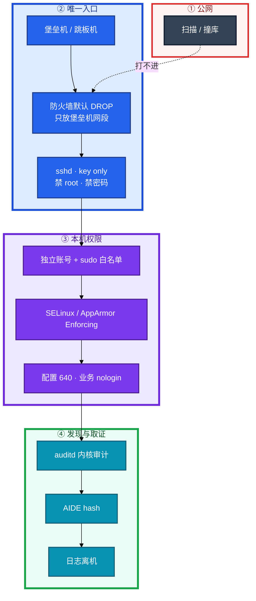
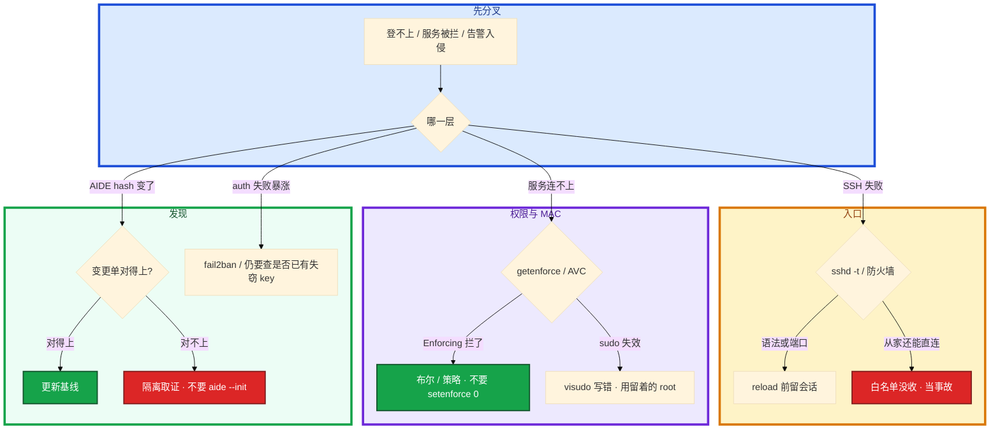

# Linux 安全加固


凌晨大厅机 `auth` 失败次数暴涨，`Failed password for root from 45.x.x.x` 刷满 `/var/log/secure`。群里有人说「先改成 2222 顶一阵」，另有人 `setenforce 0` 让 Nginx 反代先通，还有人提议给 `deploy` 开 `NOPASSWD: ALL` 方便活动周值班——AIDE 基线从没跑过。

先别动手。加固不是改一个端口：**谁能进来、进来能干什么、干了什么能不能查到**，三层少一层出事只能猜。本章后半全是你会动手的：sshd 怎么关死、sudo 怎么白名单、防火墙怎么最小化、被拦了查 AVC 而不是关 SELinux、发现入侵先隔离取证。

**本章主线（排障就按这三步想）：**

1. **三层**：入口（堡垒机 + key only）→ 权限（sudo 白名单）→ 发现（auditd 离机）。
2. **被拦查 AVC**：不要 `setenforce 0` 当第一刀。
3. **改 sshd 留会话**：`sshd -t` → reload，另开会话验证。

**读完你能：** 从入口讲到发现；sshd/sudo/防火墙给出可落地的最小集；MAC 被拦会查 AVC；auditd/AIDE 能说清和 history 的差别；CIS 不过知道哪些必须修。

## 本章目录

- [1. 基本概念](#1-基本概念)
- [2. 架构图](#2-架构图)
- [3. 原理](#3-原理)
- [4. 落地](#4-落地)
- [5. 核心配置](#5-核心配置)
- [6. 命令与操作](#6-命令与操作)
- [7. 生产排障](#7-生产排障)
- [8. 必会 · 常考](#8-必会--常考)
- [合上书](#合上书问自己)

**本章不讲：** 堡垒机产品、录屏、审批工单、ProxyJump 细节 → [25 堡垒机与跳板机](../25-堡垒机与跳板机/)；云 IAM、安全组产品 → [07 云平台](../../07-云平台/)；K8s RBAC / PSS / NetworkPolicy → [04-13 RBAC与安全](../../04-Kubernetes/13-RBAC与安全/)；conntrack / iptables 链细则 → [15 iptables 与 conntrack](../15-iptables与conntrack/)；somaxconn、tw_reuse、fd → [18 内核参数与 sysctl](../18-内核参数与sysctl/)；审计日志怎么轮转、怎么集中 → [22 日志运维](../22-日志运维/)。

---

## 1. 基本概念

加固不是「改一个 sshd 端口」。生产要叠三层：**谁能进来、进来能干什么、干了什么能不能查到。** 少一层，出事只能猜。

**值班里怎么认现象**（先听监控/审计怎么说，再对表）：

| 监控/日志说的 | 技术含义 | 你的第一刀 |
|---------------|----------|------------|
| auth 失败暴涨 | 扫描 / 撞库 / 失窃 key | `sshd -T` + 防火墙来源 |
| Nginx 502 但进程在 | 可能是 SELinux AVC | `ausearch -m AVC`，别关 MAC |
| AIDE hash 变了 | 变更 or 入侵 | 对变更单；对不上隔离 |
| 从家里还能 SSH 上 | 入口没收 | 安全组 + iptables 当事故 |
| `sudo su` 日志很多 | 白名单被拆掉 | `visudo` + auditd |

| 层 | 管什么 | 典型手段 |
|----|--------|----------|
| **入口** | 谁能连上这台 | 堡垒机唯一、SSH key only、禁 root、禁密码、防火墙默认拒绝 |
| **权限** | 进来能跑什么 | 独立账号、sudo 白名单、业务 nologin、配置 640、MAC Enforcing |
| **发现** | 事后对得上人 | auditd 离机、AIDE hash、异常登录/外连、fail2ban |

游戏逻辑服被扫 22、被撞 `root/123456`，这是入口没收。入侵后把 `/usr/bin/ssh` 换成后门，这是完整性没盯。两件事都要能讲。

DAC（chmod/chown）管的是「属主同不同意」。**MAC**（SELinux / AppArmor）是内核按策略拦：就算进程已经是 root，不在策略里也碰不到不该碰的文件。关 SELinux = 入侵后横向移动少了一道墙。

**打个比方**：像公司大楼——入口是门禁卡（SSH key + 堡垒机），楼层是 sudo 白名单（只能进自己工位），监控是 auditd 离机（保安室录像不能在本机删）。

> **记住**：改端口只减扫描噪音，扫描器照样扫到。安全核心是 key only + 只从堡垒机进。本机 `history` 和本机日志都能被 root 改掉，发现层必须离机。

**面试怎么说**：「我按入口、权限、发现三层讲：堡垒机 key only、sudo 白名单到命令、auditd 离机转发；被 SELinux 拦先 AVC，不 setenforce 0。」

---

## 2. 架构图

后面 sshd、sudo、防火墙、MAC、取证都对着这张图。



**读图三句话：**

1. **生产机 SSH 不对世界开。** 人从堡垒机进，机器只认堡垒机网段的 key。
2. **sudo 白名单到具体命令**，禁 `sudo su` / `sudo bash`。
3. **审计离机。** 本机文件入侵者有 root 就能改。

云安全组是第一层，主机防火墙是第二层。不要只开 syncookies 就说防火墙做好了。链和 conntrack 细则在 15。

---

## 3. 原理

原理只保留动手和面试会用到的：门怎么关、权怎么收、包怎么丢、拦了查哪、事后靠什么。

### 3.1 入口：sshd 先把门关死

**一句话：** 改端口只减扫描噪音；核心是 key only + 只从堡垒机进。

**打个比方**：改端口像把门牌从 101 改成 1001——小偷仍会挨家试；真正安全是换指纹锁（key only）且只认物业卡（堡垒机网段）。

**现场走一遍**（auth 失败暴涨，先别改端口）：

1. 堡垒机或已有会话上，看**生效值**（不是只看配置文件注释）：

```bash
sshd -T | grep -E 'permitrootlogin|passwordauthentication|port|allowusers|maxauthtries'
```

2. 屏幕出现：

```text
permitrootlogin no
passwordauthentication no
port 2222
allowusers deploy@10.0.0.0/8
maxauthtries 3
```

3. **说明什么**：root 和密码都关了，端口 2222 只是减噪音；`AllowUsers` 限了源网段——若从家里还能直连，是**防火墙/安全组**没收，不是 sshd 写错。

4. 改配置前语法检查：

```bash
sshd -t && systemctl reload sshd
```

5. **另开一条** SSH 会话验证：key 能进、密码/root 不能进、非堡垒机 IP 不能进。

**输出解读**：

| 字段 | 正常生产 | 异常 |
|------|----------|------|
| `permitrootlogin` | `no` | `yes` = 审计分不清人 |
| `passwordauthentication` | `no` | `yes` = 撞库面 |
| `allowusers` | 带 `@CIDR` | 无限制 = 全世界可试 key |
| `maxauthtries` | `3` | 默认 6 = 撞库窗口大 |

key 被盗：立刻从 `authorized_keys` 拿掉、堡垒机侧吊销、轮换——不要只「改密码」，密码已经关了。

**面试怎么说**：「改 2222 不算加固完成；核心是禁 root、禁密码、AllowUsers 限堡垒机网段；改完 sshd -t 再 reload，另开会话验，不 restart 掐现有会话。」

> **记住**：从家里直连还能上 = 安全组 / iptables 白名单没收，当入口事故。

### 3.2 权限：sudo 与文件，最小、可追责

**一句话：** sudo 白名单到具体命令；`sudo su` / `sudo bash` 等于拆掉白名单。

**打个比方**：白名单像酒店房卡只能开自己房间；`sudo su -` 是拿万能钥匙开整栋楼——口头说「别乱用」不算数。

**现场走一遍**（活动周有人要 `NOPASSWD: ALL`）：

1. 看 deploy 实际能跑什么：

```bash
sudo -l -U deploy
```

2. 屏幕出现（合格示例）：

```text
User deploy may run the following commands on prod-game-01:
    (root) /bin/systemctl restart nginx, /bin/systemctl reload nginx
    (root) !/bin/su, !/bin/bash, !/bin/sh
```

3. **说明什么**：只能 reload/restart nginx，显式禁了 shell 逃逸——若看到 `(ALL) NOPASSWD: ALL`，等于没加固。

4. 编辑必须 `visudo`（语法错会锁死 sudo）：

```bash
visudo
# Cmnd_Alias NGINXCTL = /bin/systemctl restart nginx, /bin/systemctl reload nginx
# deploy ALL=(root) NGINXCTL
# deploy ALL=(root) !/bin/su, !/bin/bash, !/bin/sh
# Defaults timestamp_timeout=5
```

5. 查 sudo 谁干了什么（本机可被改，生产要离机）：

```bash
ausearch -k sudoers -ts recent | tail -20
# CentOS: grep sudo /var/log/secure
```

**输出解读**：

| 检查项 | 合格 | 事故 |
|--------|------|------|
| `sudo -l` | 命令列表 | `ALL` / `NOPASSWD: ALL` |
| 账号 | 每人独立 | 共享 `ops` / `deploy` 万能钥匙 |
| 文件权限 | 配置 `640`、目录 `750` | `chmod 777` |
| SUID | `passwd` 等已知项 | `find` 多出来的先隔离 |

`chmod 777`：谁都能改，被植入后门无法追责。SUID 定期 `find /usr/bin /usr/sbin -perm -4000`；多出来的先下线再分析。

**面试怎么说**：「sudo 白名单到具体二进制和参数，显式禁 su/bash/sh；每人独立账号；visudo 写错用留着的 root 会话或云控制台修，不要重启碰运气。」

### 3.3 防火墙最小化：默认拒绝

**一句话：** 默认 DROP，SSH/业务来源收窄；出站也要管。

**打个比方**：像小区门禁——默认不放行，只给物业（堡垒机）和快递柜（LB）发临时通行证；不是「大门敞开、靠每户自己锁门」。

**现场走一遍**（改完 sshd 2222，从家里突然登不上——可能是防火墙没同步）：

1. 看当前规则（iptables 示例）：

```bash
iptables -L INPUT -n -v --line-numbers | head -20
```

2. 屏幕出现：

```text
Chain INPUT (policy DROP 0 packets, 0 bytes)
num   pkts bytes target     prot opt in     out     source               destination
1      12M  890M ACCEPT     all  --  *      *       0.0.0.0/0            0.0.0.0/0            state RELATED,ESTABLISHED
2      456  27360 ACCEPT     tcp  --  *      *       10.0.0.0/8           0.0.0.0/0            tcp dpt:2222
```

3. **输出解读**：`policy DROP` = 默认拒绝；第 1 条放已建立连接（**必须先放**，否则自己回包也丢）；第 2 条 SSH **只放 10.0.0.0/8**（堡垒机网段），不是 `0.0.0.0/0`。

4. 本机不是路由器：

```bash
sysctl net.ipv4.ip_forward
# 应为 0；误开 1 = 可能被当跳板
```

5. 改规则：**先加 ACCEPT 再收紧 DROP**；用**另一条会话**验证；`iptables-save` / firewalld 持久化（细节见 15）。

安全向 sysctl（和 18 的性能清单分开写）：

```bash
# /etc/sysctl.d/99-security.conf
net.ipv4.conf.all.accept_redirects = 0
net.ipv4.conf.default.accept_redirects = 0
net.ipv4.conf.all.accept_source_route = 0
net.ipv4.tcp_syncookies = 1
net.ipv4.ip_forward = 0
net.ipv4.conf.all.rp_filter = 1
```

出站最小化：生产机不该主动连陌生 IP；排障需要的 DNS/NTP/制品库显式放行（NTP 见 19）。

**面试怎么说**：「INPUT 默认 DROP，先 ESTABLISHED 再放 SSH 仅堡垒机 CIDR、业务口仅 LB；出站也管；syncookies 不是防火墙替代品。」

### 3.4 MAC：SELinux / AppArmor 别关

**一句话：** 被拦先 `ausearch -m AVC`，不要 `setenforce 0` 当第一刀。

**打个比方**：SELinux 像银行金库的第二道门——DAC 是营业厅柜台（属主同意就能拿），MAC 是金库规则（就算你是行长，没标签也进不去）。

**现场走一遍**（Nginx 反代 upstream 连不上，curl 本机 127.0.0.1 通）：

1. 看 MAC 状态：

```bash
getenforce
sestatus | head -5
```

```text
Enforcing
SELinux status:                 enabled
Current mode:                   enforcing
```

2. 查最近 AVC（谁拦了谁）：

```bash
ausearch -m AVC -ts recent | tail -5
```

```text
type=AVC msg=audit(...): avc:  denied  { name_connect } for  pid=1234 comm="nginx"
  scontext=system_u:system_r:httpd_t:s0 tcontext=system_u:object_r:http_port_t:s0
  tclass=tcp_socket permissive=0
```

3. **输出解读**：`httpd_t` 进程想 `name_connect` 到 `http_port_t` 被拒绝——常见修法是布尔值，不是关 SELinux：

```bash
setsebool -P httpd_can_network_connect on
getsebool httpd_can_network_connect
# --> httpd_can_network_connect --> on
```

4. 仍缺策略：`audit2allow` 评审后再装模块。临时 Permissive **只给这台、只给排查窗口**，当天回到 Enforcing。

| | SELinux | AppArmor |
|---|---------|----------|
| 模型 | 标签 + 策略 | 路径 + profile |
| 系统 | CentOS / RHEL | Ubuntu / Debian |
| 状态 | Enforcing / Permissive / Disabled | enforce / complain |

容器宿主机仍要 MAC。容器里的隔离靠 04-13 的 PSS / RBAC / NetworkPolicy，**不能拿「已经上 K8s」当关 SELinux 的理由**。

**面试怎么说**：「502 但进程在，我先 getenforce 和 ausearch AVC；缺布尔 setsebool -P；setenforce 0 当第一刀是事故。」

### 3.5 发现：auditd / AIDE

**一句话：** 追责靠 auditd 离机转发，不靠 shell 的 history。

**打个比方**：`history` 是员工自己写的值班本，能撕页；auditd 是总部监控，本机 root 删不掉记录（仍要离机防改日志文件）。

**现场走一遍**（怀疑有人改过 sudoers，history 是空的）：

1. 看 auditd 是否在跑：

```bash
systemctl is-active auditd
ausearch -k sudoers -ts today | aureport -f --summary
```

2. 完整性检查（基线必须在**干净安装**时做过）：

```bash
aide --check 2>&1 | tail -10
```

```text
File: /usr/bin/ssh
  S    : Size
  M    : Permissions
  MD5  : Hash
Changed files: 1
```

3. **输出解读**：`/usr/bin/ssh` 的 Size/Hash 变了——先对**变更单**（补丁窗口）；对不上当入侵，**隔离取证**，不要 `aide --init` 把后门写进信任根。

4. 关键 watch 规则示例：

```bash
# /etc/audit/rules.d/audit.rules
-w /var/log/secure -p wa -k logins
-w /etc/passwd -p wa -k identity
-w /etc/sudoers -p wa -k sudoers
-a always,exit -F arch=b64 -S execve -k cmd
```

fail2ban 挡扫描，挡不住已经进了堡垒机的失窃 key：

```ini
[sshd]
enabled = true
maxretry = 3
bantime = 3600
findtime = 600
```

**面试怎么说**：「history 空不能断定没人操作；靠 auditd 离机 + 堡垒机录像。AIDE 干净时 init；中招后再 init 等于给后门发证书。」

> **记住**：追责靠内核审计离机转发，不靠 shell 的 history。

---

## 4. 落地

| 项 | 选 | 不选 |
|----|----|------|
| SSH | key only、禁 root、只从堡垒机进 | 密码、root 直登、公网 22 |
| sudo | 白名单 + 独立账号 | `NOPASSWD: ALL`、共享账号 |
| 防火墙 | 默认 DROP、SSH/业务来源收窄 | INPUT ACCEPT；业务口对世界 |
| MAC | Enforcing | Disabled 写进镜像；被拦就 `setenforce 0` |
| 审计 | auditd + 离机 | 只开 histappend |
| 完整性 | AIDE + 定时告警 | 中招后再 `--init` |
| 镜像 | 加固基线镜像出厂 | 每台手搓 |
| 合规 | CIS 定期扫，不合格有人认领 | 扫了不管；或每条噪音都当 P0 |

大厂用 **CIS Benchmark** / Lynis / OpenSCAP 扫；不合格项能解释「风险接受还是修」。验收：`sshd -T` 看到 `permitrootlogin no`、`passwordauthentication no`；`getenforce` 为 Enforcing；INPUT 默认 DROP；`sudo -l` 不是 ALL；`systemctl is-enabled auditd chronyd`。从家里直连失败才算入口合格。

---

## 5. 核心配置

只动有证据的项。改 sshd 先 `sshd -t`，语法过了再 **reload**，不要 `restart` 把现有会话全掐。visudo 写错会锁死 sudo，保留一个已登录的 root 会话或云控制台，直到 `sudo -l` 正常。

| 文件 | 关键项 | 改错会怎样 |
|------|--------|------------|
| `sshd_config` | 禁 root、禁密码、AllowUsers、MaxAuthTries 3、ClientAliveInterval 300 | 语法错 + restart 可能锁在外面 |
| `sudoers` | 命令白名单、禁 su/bash、timestamp_timeout=5 | ALL；或语法错锁死 |
| iptables / firewalld | 默认 DROP、ESTABLISHED、SSH 仅堡垒机 | 0.0.0.0/0；或把自己锁死 |
| `99-security.conf` | redirects=0、source_route=0、syncookies=1、ip_forward=0、rp_filter=1 | 非路由开转发当跳板 |
| audit.rules | watch passwd/sudoers/sshd、execve | 只靠 history |
| fail2ban sshd | maxretry=3、bantime=3600、findtime=600 | 当银弹挡失窃 key |
| AIDE | 干净时 init | 中招后 init |

> **记住**：门只开给堡垒机的 key；独立账号 + sudo 白名单；防火墙默认拒绝且来源收窄。安全 sysctl 和性能清单（18）分开写。

---

## 6. 命令与操作

值班 / 审计先跑这几条：

```bash
sshd -T | grep -E 'permitrootlogin|passwordauthentication|port|allowusers'
getenforce
sudo -l
iptables -L -n -v --line-numbers   # 或 firewall-cmd --list-all
ausearch -k sudoers
aide --check
find /usr/bin /usr/sbin -perm -4000 -ls
```

| 目的 | 命令 | 看什么 |
|------|------|--------|
| sshd 生效值 | `sshd -T` | 不是只看配置文件注释 |
| 语法 | `sshd -t` | 过了再 reload |
| MAC | `getenforce` / `sestatus` / `aa-status` | Enforcing |
| AVC | `ausearch -m AVC -ts recent` | 谁拦了谁 |
| sudo | `sudo -l`；`visudo` | 实际能跑什么 |
| SUID | `find ... -perm -4000` | 多出来的先隔离 |
| 身份 | `id`；`getent passwd game` | nologin、uid |
| 合规 | `lynis audit system` | 高危项认领 |
| 跳转 | `ssh -J deploy@bastion deploy@prod` | 人只从堡垒机进（产品化 25） |

**改 sshd**：留 console → `sshd -t` → reload（不 restart）→ 另开会话验；防火墙同步新端口。

**改 sudoers**：必须 `visudo`；改完 `sudo -l -U deploy` 核对。

**防火墙**：先加 ACCEPT 再收紧；保存规则；业务口只放 LB 网段。

**密钥轮转**：离职当天吊销；泄漏 → auditd + 堡垒机录像 → 轮换 key。

**升级基线**：补丁后 AIDE 对变更单 → 更新基线；镜像滚动换机，不在中招机「修到过线」。

**入侵响应**：


不要先 `kill` 后门再取证。关机丢内存。先隔离。

---

## 7. 生产排障

安全相关现场也是三问：门还在不在？权限被没被拆开？发现层还看不看得见？



| 现象 | 先做什么 | 不要做什么 |
|------|----------|------------|
| Nginx 反代被 SELinux 拦 | `ausearch -m AVC`；`setsebool -P` | `setenforce 0` 当第一刀 |
| 改完 sshd 登不上 | console；检查防火墙是否同步端口 | 再 restart 一次赌 |
| visudo 写错 | 已有 root 会话 / 云控制台修 | 重启碰运气 |
| AIDE `/usr/bin/ssh` 变了 | 对变更单；对不上当入侵 | 先 kill 再 `aide --init` |
| history 是空的 | auditd 离机 + 堡垒机录像 | 断定没人登过 |
| CIS 几十条不过 | 高危必修；架构冲突书面接受 | 每条噪音当 P0，或全不修 |
| 容器上了还要不要加固 | 宿主机要 | 拿 K8s 当关 SELinux 的理由 |

活动中被拦：先恢复业务路径（布尔/策略），不要关 MAC。

---

## 8. 必会 · 常考

| 说法 | 对错 | 口径 |
|------|:----:|------|
| 改成 2222 就算加固完成 | 错 | 核心是 key only + 堡垒机入口 |
| 生产允许 root 密码应急 | 错 | 禁 root、禁密码；应急走堡垒机/console（25） |
| `deploy ALL=(ALL) NOPASSWD: ALL` 方便值班 | 错 | 白名单到命令；禁 su/bash |
| 被拦先 `setenforce 0` | 错 | 先 AVC；关 Enforcing 是事故 |
| Permissive 等于开了 SELinux | 错 | 只记不拦 |
| 上了 K8s 可以关宿主机 SELinux | 错 | 容器层是 PSS/RBAC；宿主机仍要 MAC |
| history 空 = 没人操作过 | 错 | 可清可改；靠 auditd 离机 |
| 本机 audit.log 够合规 | 错 | root 能改；必须转发 |
| 中招后 `aide --init` 重建基线 | 错 | 把后门写进信任根 |
| fail2ban 能挡失窃的 key | 错 | 只挡扫描；key 靠吊销和 MFA |
| INPUT ACCEPT、靠业务自己鉴权 | 错 | 默认 DROP，来源收窄 |
| 禁 ping 必须开 | 错 | 可选；排障会疼，书面接受即可 |
| `chmod 777` 先跑起来再说 | 错 | 配置 640、目录 750 |
| CIS 过了就不会被入侵 | 错 | 基线不是 IDS |

数字：`MaxAuthTries 3`；`ClientAliveInterval 300`、`CountMax 2`；`LoginGraceTime 30`；文件 `640`、目录 `750`、`/tmp` `1777`；umask `022`；fail2ban `maxretry=3`、`bantime=3600`、`findtime=600`；syncookies=1、ip_forward=0、rp_filter=1、redirects=0；timestamp_timeout=5。

易混：改端口 vs 认证方式；DAC vs MAC；Permissive vs Disabled；auditd vs history；AIDE 预期变更 vs 入侵；fail2ban vs 失窃 key；安全 sysctl vs 18 性能清单；主机防火墙 vs 云安全组 vs 15 的链细节。

---

## 合上书，问自己

1. 三层是什么？为什么改端口不是核心？
2. sshd 必关哪几项？改完为什么 reload 而不是 restart？
3. sudo 怎么写才不算拆掉白名单？visudo 写错怎么办？
4. 防火墙最小化默认策略是什么？SSH/业务口来源怎么收？出站管不管？
5. 被 SELinux 拦了先跑哪条命令？发现入侵第一步？
6. AIDE 什么时候 init？CIS 不过哪些必须修？

六题都能口述，这一章就过了。下一章把性能旋钮按场景打开：web / db / k8s node 各调哪些 sysctl，以及为什么容器里改了不算。
