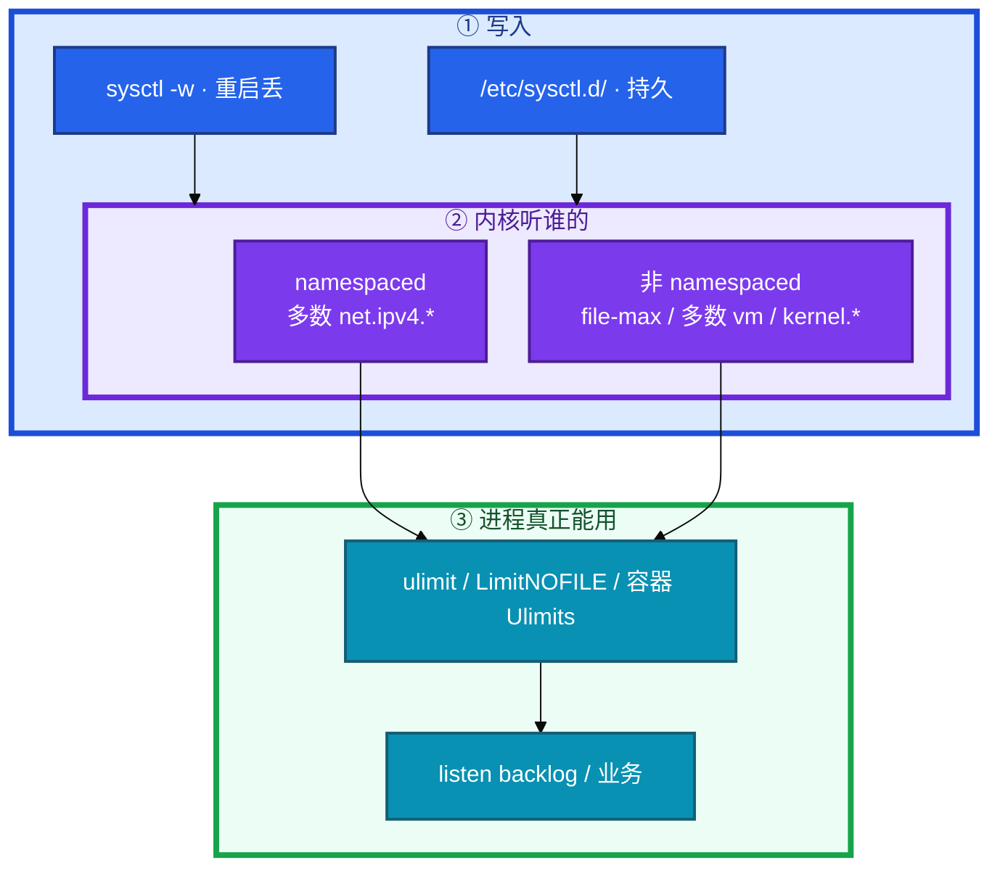
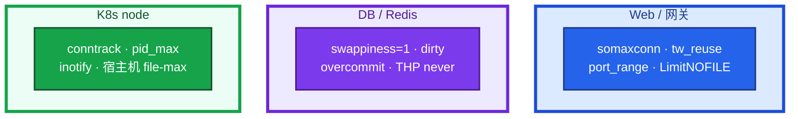

# 内核参数与 sysctl


活动开闸，登录超时。网关 `listen(65535)` 写得很满，宿主机 `somaxconn` 还是 128。群里有人把「生产清单」整份糊到 Redis 节点上，另有人在容器里 `sysctl -w` 打印成功，进程还是 1024。

先别动手。这一章后半全是你会动手的：**怎么证明该调、怎么持久化、web/db/k8s 各套哪一份、容器里改了为什么不算。** 前面的概念，是为了让你不要开机就把网传清单全糊上去。

**读完你能：** 说出队列、TIME_WAIT、fd 各看哪一层；按 web / db / k8s node 给清单；会验证 namespaced 和 LimitNOFILE；conntrack 80%、dirty_ratio、keepalive 能和业务心跳分开讲。

## 本章目录

缩进 = 上下级。3 下面才是 3.1。

想钉在**正文左边**跟着滚：菜单 **查看 → 打开视图 → 大纲**。Markdown 预览做不到独立左栏，目录只能写在文章开头。

- [1. 基本概念](#1-基本概念)
- [2. 架构图](#2-架构图)
- [3. 原理](#3-原理)
  - [3.1 连接队列](#31-连接队列somaxconn-和-backlog-取-min)
  - [3.2 TIME_WAIT 与端口](#32-time_wait-与出站端口)
  - [3.3 文件描述符](#33-文件描述符三层改一层不够)
  - [3.4 内存与脏页](#34-内存swap-overcommit-脏页)
  - [3.5 conntrack 与其它上限](#35-conntrack-与其它上限)
- [4. 安装部署](#4-安装部署)
  - [4.1 生产怎么选](#41-生产怎么选按场景)
  - [4.2 落地与容器](#42-落地与容器)
- [5. 核心配置](#5-核心配置)
- [6. 常用命令](#6-常用命令)
- [7. 常用操作](#7-常用操作)
  - [7.1 证明再调](#71-证明再调)
  - [7.2 按角色套清单](#72-按角色套清单)
  - [7.3 升级内核](#73-升级内核)
  - [7.4 回滚](#74-回滚)
  - [7.5 迁移 / 换节点](#75-迁移--换节点)
- [8. 生产排障](#8-生产排障)
- [9. 必会 · 常考](#9-必会--常考)
- [合上书](#合上书问自己)

**本章不讲：** TCP 握手 / TIME_WAIT 状态机原理 → [08 TCP 与 UDP](../08-TCP与UDP/)；套接字在协议栈哪一层 → [06 网络栈与 Socket](../06-网络栈与Socket/)；conntrack 表结构、NAT、iptables → [15 iptables 与 conntrack](../15-iptables与conntrack/)；Nginx keepalive 三件套 → [23 Nginx](../23-Nginx/)；安全 sysctl（redirects、rp_filter）→ [17 Linux 安全加固](../17-Linux安全加固/)；cgroup 限额、容器内存 → [07 cgroup](../07-cgroup与容器/)、[04 Kubernetes](../../04-Kubernetes/)。

---

## 1. 基本概念

sysctl 就是 `/proc/sys/` 里那批内核旋钮。容器里 `sysctl -w` 打印成功，不等于进程真用上了这个数。中间有三道门，改错一层就会「以为调了」。

| 门 | 含义 |
|----|------|
| **写到哪** | `sysctl -w` 重启丢；`/etc/sysctl.d/` 才持久 |
| **内核听谁的** | namespaced（多数 `net.ipv4.*`）看这份网络 NS；非 namespaced（`fs.file-max`、多数 `vm.*`）只能宿主机 |
| **进程还要过 rlimit** | `ulimit` / systemd `LimitNOFILE` / 容器 Ulimits。内核 `file-max=100` 万，LimitNOFILE=1024 → 进程仍然 1024 |

原则：**先有监控证明瓶颈，再改一个观察一阵。** 不要开机就把网传「生产清单」全糊上去。写进 `/etc/sysctl.d/`，变更和发版一样留记录。安全向参数和性能清单分开写（17）。

> **记住**：容器不是小虚机。somaxconn 和 listen backlog 取 **min**。fd 耗尽先看进程 LimitNOFILE，不要只看 `fs.file-max`。

---

## 2. 架构图

先把整张图钉住。后面场景清单、命令、排障都对着这张图说话。



三种角色不要混用一份清单：



Web 先撞队列和 fd；数据库先撞换页和脏页；K8s 节点先撞 conntrack 和 PID。把 Redis 的 overcommit=1 糊到所有 Worker 上，叫拍脑袋。

---

## 3. 原理

原理只保留动手和面试会用到的：队列取 min、TW 治本是连接池、fd 看进程、swap 用 1 不是 0、表满是间歇丢新连接。

**本节 5 块：** 3.1 队列 · 3.2 TIME_WAIT · 3.3 fd · 3.4 内存 · 3.5 conntrack 与其它

### 3.1 连接队列：somaxconn 和 backlog 取 min

全连接队列实际长度 = **min(应用 listen backlog, somaxconn)**。只改一边等于没改。


半连接满了且没 syncookies → 丢 / 重传。全连接满了 → 新连接排队失败，延迟飙。

| 参数 | 常见默认 | 生产量级 | 作用 |
|------|----------|----------|------|
| `net.core.somaxconn` | 128 | **32768+** | 全连接队列上限 |
| `net.ipv4.tcp_max_syn_backlog` | 1024 | **8192+** | 半连接队列 |
| `net.ipv4.tcp_syncookies` | 1 | **保持 1** | SYN flood 时不靠队列硬扛 |

眼睛看到什么：`ss -lnt` 里 **Recv-Q 持续 >0**；`netstat -s | grep -i overflow` 计数在涨。只改 Nginx `listen` 或只改 somaxconn，另一边仍是短板。

容器里 somaxconn 在较新内核是 namespaced，用 Pod `securityContext.sysctls`；旧内核改宿主机才生效。用容器内 `/proc/sys/net/core/somaxconn` 读一眼，别假设 YAML 写了就进了。

### 3.2 TIME_WAIT 与出站端口

短连接出站多（Nginx → 后端没开 keepalive）会堆 TIME_WAIT，再把本地端口池打满，**新连接建不出来**。已有长连接还活着，看起来像「间歇登不上」。

| 参数 | 常见默认 | 生产 | 作用 |
|------|----------|------|------|
| `net.ipv4.tcp_tw_reuse` | 0 | **1** | 出站端复用 TIME_WAIT，只影响客户端方向 |
| `net.ipv4.ip_local_port_range` | 32768-60999 | **1024-65535** | 出站本地端口池 |
| `net.ipv4.tcp_max_tw_buckets` | 系统相关 | 一般不调 | 到上限内核开始丢 TW |

**`tcp_tw_recycle` 在 4.12+ 已删除。** NAT 下会丢连接。被问到：已废弃，不用，不要在老文档里打开。

`tcp_tw_reuse` 安全：只对**本机作为客户端**的出站生效，需要 timestamps。治本仍是 **连接池 / upstream keepalive**（23），调参数是买时间。不要靠把 `tcp_fin_timeout` 拧得很短来「消灭 TIME_WAIT」。

TCP Keep-Alive 默认 `tcp_keepalive_time=7200`（2 小时），**不能当游戏心跳**。游戏必须应用层 **15–45s**。内核 keepalive 只适合清死连接，发现不了「连着但卡死」。

| 参数 | 默认 | 生产可收到 | 说明 |
|------|------|------------|------|
| `tcp_keepalive_time` | 7200s | **600** | 空闲多久开始探 |
| `tcp_keepalive_intvl` | 75s | **30** | 探测间隔 |
| `tcp_keepalive_probes` | 9 | **3** | 次数 |

生产 600/30/3 仍然不是玩法心跳。空闲超过 time 才探；有数据的连接不会无故被探死。怕 NAT 超时，才把 time 降到分钟级。

其它常调网络：`tcp_fastopen=3`（双端，看应用支不支持）；`rmem_max` / `wmem_max` 长连接、防 UDP 丢可加大；`tcp_rmem` / `tcp_wmem` 按带宽时延积；`netdev_max_backlog` 高 PPS 加大；`tcp_slow_start_after_idle=0` 长连接保吞吐。

### 3.3 文件描述符：三层，改一层不够

`Too many open files` 十次有九次是 **进程 soft limit 还是 1024**，不是 kernel 全局不够。

```
  fs.file-max          系统全局 fd 上限
       |
       v
  fs.nr_open           单进程 hard 上限（一般不用手调）
       |
       v
  ulimit -n / LimitNOFILE   进程真正能用的 soft
```

| 参数 | 常见默认 | 生产量级 |
|------|----------|----------|
| `fs.file-max` | 系统算 | **1000000+** |
| `fs.nr_open` | 1048576 | 通常不调 |
| `ulimit -n` | 1024 | **65535+** |

**经典坑：** 改了 `fs.file-max=1000000`，Nginx 还是 1024。systemd 托管的服务**不读 PAM** `limits.conf`，必须 unit 里 `LimitNOFILE=65535`。

**容器坑：** Docker/containerd 的 fd 继承自 shim 父进程，**不读 limits.conf**。K8s 用 Pod/容器 `securityContext` 或入口进程 `setrlimit`。看 `/proc/<pid>/limits` 验证，不要看节点上的 ulimit。

### 3.4 内存：swap、overcommit、脏页

默认 `swappiness=60` 会在还有 cache 时就把匿名页换出去。逻辑服 / Redis 延迟毛刺。

| 参数 | 默认 | 生产 | 作用 |
|------|------|------|------|
| `vm.swappiness` | 60 | **1–10** | 高则爱换页；低则优先回收 cache |
| `vm.overcommit_memory` | 0 | 0 或 **1** | 0 启发式；1 允许超分；2 按比例 |
| `vm.dirty_ratio` | 20 | **10–15** | 脏页到此，**写进程阻塞**刷盘 |
| `vm.dirty_background_ratio` | 10 | **5** | 后台刷，不阻塞 |
| `vm.min_free_kbytes` | 系统算 | 少动 | 留最低空闲，太大浪费 |

游戏逻辑服、Redis：**swappiness=1–10**。Redis 官方建议 **1 不是 0**。0 = 尽量不用 swap，内存突增更容易直接 OOM；1 = 几乎不换，极端时仍给内核一条退路。大厂常见：开着 swap，但 swappiness 很低。

Redis `fork` 写时复制，短时间看起来内存翻倍：`overcommit_memory=1` 避免 fork 失败。副作用是允许超分，有 OOM 风险，按场景选——不要给所有 Web 机一刀切。

日志盘、数据库高写入：`dirty_ratio=20` 会积一大坨再全体阻塞。收到 10、后台 5，刷盘更平滑。磁盘本身慢仍要查 05。

### 3.5 conntrack 与其它上限

kube-proxy iptables 模式、本机 NAT，连接都进 conntrack。默认 `nf_conntrack_max` 往往 **65536**，游戏短连接 + NAT 很容易顶满。表满时 **新连接被丢**，已跟踪的还在，所以像间歇故障。`dmesg` 刷 `nf_conntrack: table full, dropping packet`。

| 参数 | 作用 |
|------|------|
| `nf_conntrack_max` | 表容量；生产常见到 **1048576**，按内存算 |
| `nf_conntrack_count` | 当前（只读），**>80%** 告警 |
| `nf_conntrack_buckets` | hash 桶，建表时定，不能随便动态改 |

调大 max 是买时间。治本：少短连接、切 IPVS、NodeLocal DNS Cache（15、04-08）。

其它会卡死业务的上限：

| 参数 | 默认 | 生产 | 谁疼 |
|------|------|------|------|
| `fs.inotify.max_user_watches` | 8192 | **524288+** | Node / webpack / CI：`ENOSPC` 文件监视 |
| `vm.max_map_count` | 65530 | **≥262144** | ES / Lucene 启动报错 |
| `kernel.pid_max` | 32768 | **4194304** | 高密度节点 fork 失败 |
| `transparent_hugepage` | 常 madvise | Redis **never** | 延迟毛刺 |
| `vm.nr_hugepages` | 0 | 按需预分配 | 大堆 Java 有时用 |

`ENOSPC` 不一定是盘满，也可能是 inotify。ES 起不来先看 `max_map_count`。

> **记住**：TIME_WAIT 靠 keepalive 治本，`tw_reuse` 买时间；`tw_recycle` 已经删了。swappiness 用 1 不是 0。conntrack 满是间歇丢新连接，不是机器挂了。

---

## 4. 安装部署

### 4.1 生产怎么选：按场景

先证明再套。大部分机器默认能跑，不要为了「优化」全调一遍。

**Web / Nginx / 游戏网关（入站多、短连接出站多、fd 多）**

| 旋钮 | 量级 | 证据 |
|------|------|------|
| somaxconn | 32768+ | Recv-Q、overflow |
| tcp_max_syn_backlog | 8192+ | SYN 重传 |
| tcp_syncookies | 1 | 保持 |
| tcp_tw_reuse | 1 | TIME-WAIT 堆、`Cannot assign requested address` |
| ip_local_port_range | 1024 65535 | 端口池见底 |
| tcp_keepalive_* | 600/30/3 | 僵尸连接；仍要应用心跳 15–45s |
| file-max | 1000000+ | 全局 |
| LimitNOFILE | 65535+ | `/proc/pid/limits` |
| 治本 | upstream keepalive（23） | 少短连接 |

**DB / Redis / MySQL（延迟敏感、fork、脏页）**

| 旋钮 | 量级 | 证据 |
|------|------|------|
| swappiness | **1**（1–10） | `vmstat` si/so、延迟毛刺 |
| overcommit_memory | Redis **1**；其它按场景 | fork 失败 |
| dirty_ratio / background | **10** / **5** | 写进程集体卡住 |
| THP | Redis **never** | 延迟毛刺 |
| max_map_count | ES **≥262144** | 启动报错 |
| somaxconn | 按连接数，不必抄网关 32768 | 没有 overflow 就别抄 |

swap **开着**、swappiness 很低，当 OOM 前的缓冲，而不是当内存扩展盘。不要 `swapoff -a` 一了百了。

**K8s node / 高密度 Worker**

| 旋钮 | 量级 | 证据 |
|------|------|------|
| nf_conntrack_max | **1048576** 量级 | count/max >80%、table full |
| kernel.pid_max | **4194304** | 容器密度、fork 失败 |
| fs.inotify.max_user_watches | **524288+** | 节点上文件监视、部分 Agent |
| fs.file-max | 1000000+ | 整机 |
| somaxconn | 宿主机 32768+（旧内核 Pod 改不进） | 节点上 NodePort/Ingress |
| 多数 vm.swappiness | 宿主机统一；不要每个 Pod 幻想独立 | namespaced？多数否 |

不要把 Redis 的 overcommit=1、THP never 无脑推到所有 Worker。kube-proxy iptables 模式几乎每条连接占一项 conntrack；切 IPVS 是治本（04-08）。

### 4.2 落地与容器

```bash
sysctl net.core.somaxconn
sysctl -w net.core.somaxconn=32768          # 临时，重启丢
# 持久化：/etc/sysctl.d/99-production.conf
sysctl --system                             # 重新加载所有 conf
```

```yaml
spec:
  securityContext:
    sysctls:
      - name: net.ipv4.tcp_keepalive_time
        value: "600"
      - name: net.core.somaxconn
        value: "32768"
```

| sysctl | namespaced？ | 怎么改 |
|--------|----------------|--------|
| 多数 `net.ipv4.*` | 是 | Pod `securityContext.sysctls` |
| `net.core.somaxconn` | 较新内核是 | 旧内核只能改宿主机 |
| `fs.file-max` | 否 | 宿主机 |
| `vm.swappiness` | 多数否 | 宿主机 |
| `kernel.shmmax` / 多数 `kernel.*` | 否 | 宿主机 |

非 namespaced 的不要指望 initContainer 里 `sysctl -w`（没特权还会失败）。特权 init 能改宿主机，等于改整节点，要当节点配置管理，不要藏在业务 Pod 里。

验收：读 **进程** `/proc/<pid>/limits` 和容器内 `/proc/sys/...`，不要只看 apply 成功或当前 shell 的 `ulimit`。

---

## 5. 核心配置

有证据再套。安全向不要和这份混成一锅（17）。

```bash
# /etc/sysctl.d/99-production.conf   # 网关/高并发示例，DB/K8s 按 4.1 裁剪
net.core.somaxconn = 32768
net.ipv4.tcp_max_syn_backlog = 8192
net.ipv4.tcp_syncookies = 1
net.ipv4.tcp_tw_reuse = 1
net.ipv4.ip_local_port_range = 1024 65535
net.ipv4.tcp_keepalive_time = 600
net.ipv4.tcp_keepalive_intvl = 30
net.ipv4.tcp_keepalive_probes = 3

fs.file-max = 1000000
fs.inotify.max_user_watches = 524288

vm.swappiness = 1
vm.overcommit_memory = 1
vm.dirty_ratio = 10
vm.dirty_background_ratio = 5
vm.max_map_count = 262144

net.netfilter.nf_conntrack_max = 1048576
kernel.pid_max = 4194304
```

systemd：

```ini
# /etc/systemd/system/<service>.d/limits.conf
[Service]
LimitNOFILE=65535
```

PAM（交互登录，**服务不读这个**）：

```
# /etc/security/limits.conf
* soft nofile 65535
* hard nofile 65535
```

> **记住**：`election` 式一刀切清单会害人。overcommit=1 是 Redis fork 的场景项。fd 以进程 limits 为准。

---

## 6. 常用命令

值班先跑这几条：

```bash
sysctl net.core.somaxconn net.ipv4.tcp_tw_reuse vm.swappiness
ss -lnt
ss -s
cat /proc/<pid>/limits | grep "open files"
cat /proc/sys/net/netfilter/nf_conntrack_count
cat /proc/sys/net/netfilter/nf_conntrack_max
```

| 目的 | 命令 | 看什么 |
|------|------|--------|
| 当前值 | `sysctl <key>` | 是否真写进内核 |
| 临时改 | `sysctl -w` | 重启丢 |
| 持久加载 | `sysctl --system` | `/etc/sysctl.d/` |
| 队列 | `ss -lnt`；`netstat -s \| grep overflow` | Recv-Q、overflow |
| TW / 端口 | `ss -s` | TIME-WAIT 数量 |
| fd | `cat /proc/<pid>/limits` | 以进程为准 |
| conntrack | count / max；`dmesg \| grep conntrack` | >80%；table full |
| THP | `cat /sys/kernel/mm/transparent_hugepage/enabled` | Redis 要 never |
| inotify / map / pid | 对应 sysctl | ENOSPC、ES、fork |

不要只看当前 shell 的 `ulimit -n`。systemd 和容器都不是这个数。

---

## 7. 常用操作

### 7.1 证明再调

1. 先证明：队列 overflow、端口耗尽、fd 用尽、conntrack 80%、ES 报 max_map_count。
2. 一参一改，测环境先看副作用。
3. 写 `/etc/sysctl.d/99-xxx.conf`，`sysctl --system`，重启还在。
4. 服务 fd 改 unit，`daemon-reload` + 重启该服务（reload 不够）。

### 7.2 按角色套清单

新机用角色标签：`web` / `redis` / `mysql` / `k8s-node`，配不同 conf 片段。不要一份 99-production.conf 打全球。Redis 节点加 THP never、overcommit=1；Worker 加 conntrack 和 pid_max；网关加 somaxconn 和 LimitNOFILE。

### 7.3 升级内核

内核大版本：`tw_recycle` 可能已经不存在；somaxconn 是否 namespaced 会变。升级前 snapshot 配置；升级后读 `/proc/sys` 对清单，跑 overflow / conntrack 基线。不要假定旧脚本 `sysctl -w tcp_tw_recycle=1` 还能过。

滚动：先升一台观察 Recv-Q、延迟、OOM，再铺开。

### 7.4 回滚

sysctl 回滚 = 改 conf + `sysctl --system`，或重启（若只改了 -w）。**LimitNOFILE 必须重启进程**才回去。错误地把 swappiness 调到 0 导致 OOM：改回 1，不要先关 swap 掩盖。

### 7.5 迁移 / 换节点

换机器：基线镜像带角色 sysctl，不要登录后再手糊。K8s：非 namespaced 项进节点 DaemonSet/配置管理；namespaced 进 Pod securityContext。特权 init 改宿主机要当节点变更，走窗口。

---

## 8. 生产排障

三问：队列还是端口还是 fd？这台是 web 还是 db 还是 node？改在宿主机还是容器里？


| 现象 | 先做什么 | 不要做什么 |
|------|----------|------------|
| 登录超时 Recv-Q=128 | somaxconn **和** listen 一起拉 | 先加机器 |
| `Cannot assign requested address` | tw_reuse + 扩端口 + keepalive | 开 tw_recycle；猛降 fin_timeout |
| Too many open files，file-max 已百万 | `/proc/pid/limits` | 只调全局 |
| 容器 sysctl 不生效 | 问是否 namespaced | 特权 init 悄悄改整节点 |
| 间歇登不上 | conntrack count/max、dmesg | 当机器挂了重启业务 |
| Redis 延迟毛刺 | swappiness=1；THP never | swappiness=0 赌 OOM |
| 写卡住几秒 | dirty_ratio 10 / bg 5 | 只骂磁盘（仍要查 05） |
| 内核 keepalive 30s 当游戏心跳 | 应用层 15–45s | 指望内核发现逻辑卡死 |

活动高峰：确认进程还在 → 看 Recv-Q / overflow / limits / conntrack → 一参一改。不要把 DB 清单糊到登录网关。

---

## 9. 必会 · 常考

白板和追问高频，能一口回：

| 说法 | 对错 | 口径 |
|------|:----:|------|
| 只把 somaxconn 调到 32768 就够 | 错 | 和 listen 取 min |
| 容器里 sysctl -w 成功 = 进程用上了 | 错 | namespaced + rlimit 两道门 |
| systemd 服务读 limits.conf | 错 | 要 LimitNOFILE |
| tcp_tw_recycle 生产打开 | 错 | 4.12+ 已删；NAT 下丢连接 |
| tw_reuse 影响入站玩家连接 | 错 | 只给出站客户端侧 |
| 内核 keepalive 能当游戏心跳 | 错 | 默认 2 小时；生产 600/30/3 仍只清僵尸 TCP；玩法 15–45s |
| swappiness 设 0 最安全 | 错 | Redis **1 不是 0**；0 更容易 OOM |
| overcommit=1 所有机器都要 | 错 | Redis fork 场景；Web 别抄 |
| conntrack 满 = 机器死了 | 错 | 间歇丢**新**连接 |
| ENOSPC 一定是盘满 | 错 | 也可能 inotify watches |
| ES 起不来先加内存 | 错 | 先看 max_map_count ≥262144 |
| 一份 sysctl 打 web/db/k8s | 错 | 按场景裁剪 |
| 先调参再看监控 | 错 | 先证明瓶颈 |

数字：somaxconn 默认 **128** / 生产 **32768+**；backlog **1024→8192+**；syncookies **1**；port_range **32768-60999→1024-65535**；keepalive 默认 **7200/75/9**，生产 **600/30/3**；游戏心跳 **15–45s**；file-max **1000000+**；ulimit **1024→65535+**；nr_open **1048576**；swappiness **60→1–10**；dirty **20/10→10/5**；conntrack 默认常见 **65536**、生产 **1048576**、告警 **>80%**；inotify **8192→524288+**；max_map_count **65530→≥262144**；pid_max **32768→4194304**；fastopen **3**。

易混：somaxconn vs listen；file-max vs LimitNOFILE；tw_reuse vs tw_recycle；namespaced vs 宿主机；swappiness 0 vs 1；内核 keepalive vs 应用心跳；conntrack 满 vs 队列满；dirty_ratio 阻塞 vs 磁盘真慢；web 清单 vs db 清单 vs k8s node。

---

## 合上书，问自己

1. 三道门是什么？容器里改 file-max 为什么不算？
2. 全连接队列实际长度怎么算？默认 128 活动会怎样？
3. TIME_WAIT 治本和买时间各是什么？recycle 还能开吗？
4. Too many open files，file-max 已经百万，下一步看哪？
5. web / Redis / k8s node 各优先哪几个旋钮？
6. conntrack 80%、dirty_ratio、内核 keepalive 和游戏心跳怎么分开讲？

六题都能口述，这一章就过了。下一章对表：Chrony 和 ntpd、时钟把 etcd / Kerberos / 证书打崩时你先看哪。
