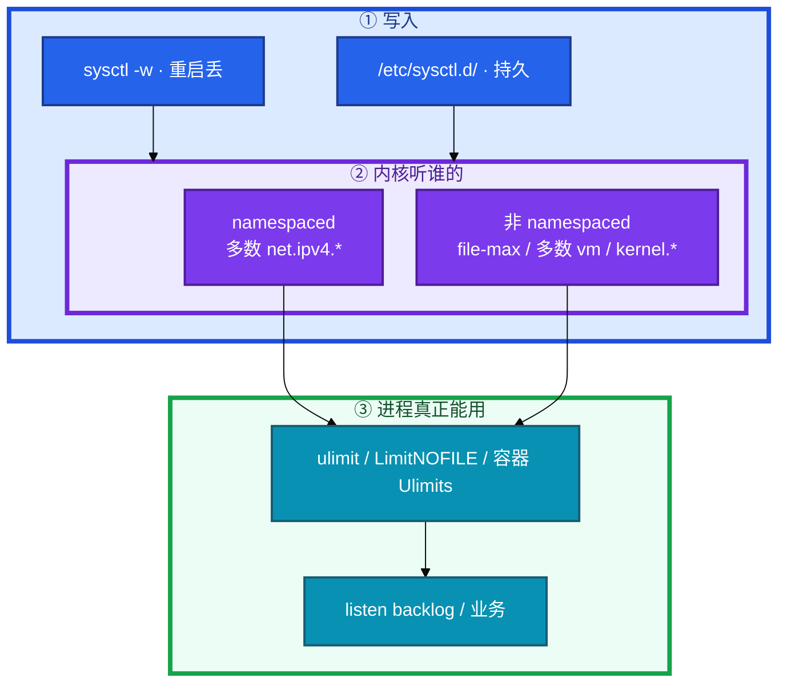
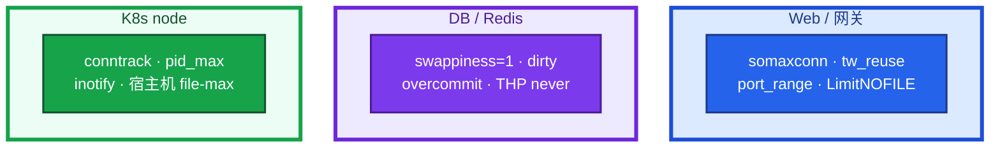
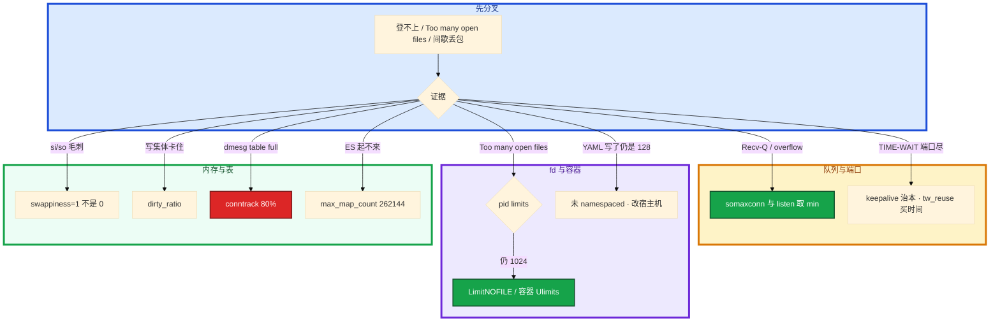

# 内核参数与 sysctl


活动开闸，登录超时。网关 `listen(65535)` 写得很满，宿主机 `somaxconn` 还是 128；`ss -lnt` 里 Recv-Q 顶在 128 下不来。群里有人把「生产清单」整份糊到 Redis 节点上，另有人在容器里 `sysctl -w` 打印成功，Nginx 还是 `Too many open files`。

先别动手。sysctl 是 `/proc/sys/` 里那批内核旋钮，但**改一层不够**：持久化、namespaced、LimitNOFILE 三道门。本章教你按 web / db / k8s 角色套清单，先有证据再调一个。

**本章主线（排障就按这三步想）：**

1. **三道门**：持久化 / namespaced / LimitNOFILE，改一层不够。
2. **按角色套**：web 队列+fd；db swappiness+dirty；k8s conntrack+pid_max。
3. **先证明再调**：Recv-Q、limits、count/max 有证据再改一个。

**读完你能：** 说出队列、TIME_WAIT、fd 各看哪一层；按 web / db / k8s node 给清单；会验证 namespaced 和 LimitNOFILE；conntrack 80%、dirty_ratio、keepalive 能和业务心跳分开讲。

## 本章目录

- [1. 基本概念](#1-基本概念)
- [2. 架构图](#2-架构图)
- [3. 原理](#3-原理)
- [4. 落地](#4-落地)
- [5. 核心配置](#5-核心配置)
- [6. 命令与操作](#6-命令与操作)
- [7. 生产排障](#7-生产排障)
- [8. 必会 · 常考](#8-必会--常考)
- [合上书](#合上书问自己)

**本章不讲：** TCP 握手 / TIME_WAIT 状态机原理 → [08 TCP 与 UDP](../08-TCP与UDP/)；套接字在协议栈哪一层 → [06 网络栈与 Socket](../06-网络栈与Socket/)；conntrack 表结构、NAT、iptables → [15 iptables 与 conntrack](../15-iptables与conntrack/)；Nginx keepalive 三件套 → [23 Nginx](../23-Nginx/)；安全 sysctl（redirects、rp_filter）→ [17 Linux 安全加固](../17-Linux安全加固/)；cgroup 限额、容器内存 → [07 cgroup 与容器](../07-cgroup与容器/)、[04 Kubernetes](../../04-Kubernetes/)。

---

## 1. 基本概念

sysctl 就是 `/proc/sys/` 里那批内核旋钮。容器里 `sysctl -w` 打印成功，不等于进程真用上了这个数。中间有三道门，改错一层就会「以为调了」。

**值班里怎么认现象**（先听监控/应用怎么说，再对表）：

| 监控/应用说的 | 技术含义 | 你的第一刀 |
|---------------|----------|------------|
| 登录超时、新连接挂 | 全连接队列满 | `ss -lnt` Recv-Q + somaxconn |
| `Cannot assign requested address` | TIME_WAIT / 端口池尽 | `ss -s` + keepalive |
| `Too many open files` | 进程 fd 上限 | `/proc/pid/limits` |
| 间歇登不上、dmesg table full | conntrack 满 | count/max |
| Redis 延迟毛刺 | swap / THP | `vmstat` si/so + THP |
| ES 起不来 | max_map_count | sysctl + 启动日志 |

| 门 | 含义 |
|----|------|
| **写到哪** | `sysctl -w` 重启丢；`/etc/sysctl.d/` 才持久 |
| **内核听谁的** | namespaced（多数 `net.ipv4.*`）看这份网络 NS；非 namespaced（`fs.file-max`、多数 `vm.*`）只能宿主机 |
| **进程还要过 rlimit** | `ulimit` / systemd `LimitNOFILE` / 容器 Ulimits。内核 `file-max=100` 万，LimitNOFILE=1024 → 进程仍然 1024 |

原则：**先有监控证明瓶颈，再改一个观察一阵。** 不要开机就把网传「生产清单」全糊上去。安全向参数和性能清单分开写（17）。

> **记住**：容器不是小虚机。somaxconn 和 listen backlog 取 **min**。fd 耗尽先看进程 LimitNOFILE，不要只看 `fs.file-max`。

**面试怎么说**：「sysctl 有三道门：持久化、namespaced、进程 rlimit；Too many open files 十次九次是 LimitNOFILE 还是 1024，不是 file-max。」

---

## 2. 架构图

后面队列、fd、conntrack 排障都对着这张图。



**读图三句话：**

1. `sysctl -w` 重启丢；`/etc/sysctl.d/` 才持久。
2. 多数 `net.ipv4.*` 是 namespaced；`fs.file-max`、多数 `vm.*` 只能改宿主机。
3. 进程真正能用多少 fd，看 `/proc/pid/limits`，不是 shell 的 `ulimit`。

三种角色不要混用一份清单：



Web 先撞队列和 fd；数据库先撞换页和脏页；K8s 节点先撞 conntrack 和 PID。把 Redis 的 overcommit=1 糊到所有 Worker 上，叫拍脑袋。

---

## 3. 原理

原理只保留动手和面试会用到的：队列取 min、TW 治本是连接池、fd 看进程、swap 用 1 不是 0、表满是间歇丢新连接。

### 3.1 连接队列：somaxconn 和 backlog 取 min

**一句话：** 全连接队列 = min(listen backlog, somaxconn)；只改一边等于没改。

**打个比方**：像餐厅等位区——应用 `listen` 是前台登记的座位数，内核 `somaxconn` 是实际等位区大小；前台写 65535、等位区只有 128，客人照样堵在门口。

**现场走一遍**（活动开闸登录超时，先别加机器）：

1. 看监听队列（Recv-Q = 当前排队，Send-Q = 发送缓冲）：

```bash
ss -lnt | head -5
sysctl net.core.somaxconn
```

```text
State   Recv-Q Send-Q Local Address:Port
LISTEN  128    128    0.0.0.0:443
net.core.somaxconn = 128
```

2. **说明什么**：Recv-Q **持续顶在 128** 且等于 somaxconn → 全连接队列满了；只改 Nginx `listen 65535` 没用，短板在内核。

3. 查 overflow 是否在涨：

```bash
netstat -s | grep -i overflow
# 或 ss -s
```

```text
    128 times the listen queue of a socket overflowed
    128 SYNs to LISTEN sockets dropped
```

4. 两边一起拉（持久化）：

```bash
# /etc/sysctl.d/99-web.conf
net.core.somaxconn = 32768
net.ipv4.tcp_max_syn_backlog = 8192
sysctl --system
```

5. Nginx 侧 `listen 443 backlog=32768;`（和 23 章 upstream keepalive 配合）。改完观察 Recv-Q 是否还顶满。

**输出解读**：

| 信号 | 含义 | 下一步 |
|------|------|--------|
| Recv-Q ≈ somaxconn 且持续 | 全连接队列满 | somaxconn **和** listen 一起拉 |
| `listen queue overflowed` 涨 | 同上 | 不要只加机器 |
| 半连接丢 | SYN flood / backlog 小 | `tcp_max_syn_backlog`；syncookies 保持 1 |
| 容器内 somaxconn 仍 128 | 未 namespaced / 未生效 | 读容器内 `/proc/sys/net/core/somaxconn` |

**面试怎么说**：「Recv-Q 顶在 128 我先对 somaxconn 和 listen backlog 取 min；只改一边等于没改；容器要读容器内 /proc/sys 验证 namespaced。」

### 3.2 TIME_WAIT 与出站端口

**一句话：** TIME_WAIT 治本靠 keepalive；`tw_reuse` 买时间；`tw_recycle` 已删。

**打个比方**：短连接像每次打车都换新车牌——TIME_WAIT 是「车牌冷却期」，车牌池（`ip_local_port_range`）用完了就「Cannot assign requested address」，像没车牌可挂。

**现场走一遍**（网关到后端短连接，间歇 502）：

1. 看 TIME_WAIT 和端口：

```bash
ss -s
sysctl net.ipv4.ip_local_port_range net.ipv4.tcp_tw_reuse
```

```text
TCP:   12000 (estab), 45000 (closed), 44000 timewait
net.ipv4.ip_local_port_range = 32768  60999
net.ipv4.tcp_tw_reuse = 0
```

2. **做差**：可用出站端口约 60999−32768 ≈ **28231**；44000 个 TIME_WAIT 已经把池子打满——新连接建不出来，老长连接还在，像「间歇故障」。

3. 买时间（sysctl）：

```bash
net.ipv4.tcp_tw_reuse = 1
net.ipv4.ip_local_port_range = 1024 65535
```

4. **治本**：upstream keepalive（23），少短连接。`tcp_tw_recycle` **4.12+ 已删除**，NAT 下会丢连接，不要开。

5. 内核 keepalive 默认 7200s，**不能当游戏心跳**（玩法 15–45s）：

```bash
sysctl net.ipv4.tcp_keepalive_time net.ipv4.tcp_keepalive_intvl net.ipv4.tcp_keepalive_probes
```

生产可收到 600/30/3，仍只清僵尸 TCP，发现不了「连着但卡死」。

**输出解读**：

| 参数 | 默认 | 生产 | 注意 |
|------|------|------|------|
| `tcp_tw_reuse` | 0 | **1** | 只影响**出站**客户端 |
| `ip_local_port_range` | 32768-60999 | **1024-65535** | 扩大池子 |
| `tcp_keepalive_time` | 7200s | **600** | ≠ 应用心跳 |
| `tcp_tw_recycle` | — | **禁止** | 已删 |

**面试怎么说**：「TIME_WAIT 治本是连接池和 keepalive；tw_reuse 买时间只给出站；tw_recycle 已删；内核 keepalive 600/30/3 仍不能当游戏 15–45s 心跳。」

### 3.3 文件描述符：三层，改一层不够

**一句话：** Too many open files 十次有九次是进程 soft limit 还是 1024。

**打个比方**：`fs.file-max` 是商场总容量，`LimitNOFILE` 是你手里的购物袋大小——商场能装一百万件，你袋子只有 1024，照样装不下。

**现场走一遍**（Nginx 报 Too many open files，运维说 file-max 已经百万）：

1. 找 Nginx 主进程 PID，看**进程级**限制：

```bash
pid=$(pgrep -o nginx)
cat /proc/$pid/limits | grep "open files"
sysctl fs.file-max
```

```text
Max open files            1024                 524288 files
fs.file-max = 1000000
```

2. **输出解读**：内核全局 100 万够用；进程 **soft=1024** 才是瓶颈——改 file-max 没用。

3. systemd 托管必须写 unit（**不读** PAM limits.conf）：

```ini
# /etc/systemd/system/nginx.service.d/limits.conf
[Service]
LimitNOFILE=65535
```

```bash
systemctl daemon-reload && systemctl restart nginx
cat /proc/$(pgrep -o nginx)/limits | grep "open files"
```

```text
Max open files            65535                65535 files
```

4. 容器看 Pod securityContext 或入口 `setrlimit`；不要只看节点 `ulimit -n`。

**面试怎么说**：「file-max 百万还报错，我看 /proc/pid/limits；systemd 服务要 LimitNOFILE，limits.conf 服务不读。」

### 3.4 内存：swap、overcommit、脏页

**一句话：** Redis swappiness 用 1 不是 0；dirty_ratio 太高会集体阻塞写进程。

**打个比方**：swappiness 像「多爱用仓库备用间（swap）」——60 是有点占地方就把客厅东西搬进仓库；1 是尽量收拾客厅（回收 cache），仓库只作最后退路。

**现场走一遍**（Redis 延迟毛刺，怀疑内存）：

1. 看换页和脏页：

```bash
vmstat 1 5
sysctl vm.swappiness vm.dirty_ratio vm.dirty_background_ratio
cat /sys/kernel/mm/transparent_hugepage/enabled
```

```text
 procs -----------memory---------- ---swap-- -----io----
  r  b   swpd   free   buff  cache   si   so    bi    bo
  2  1  12000  80000  5000 200000    5   12     0     8
vm.swappiness = 60
vm.dirty_ratio = 20
[always] madvise never
```

2. **输出解读**：`si/so` 持续 >0 = 在换页；swappiness=60 会爱换；Redis 要 **1 不是 0**（0 更容易直接 OOM）。THP `always` → Redis 要 **never**。

3. 高写入场景 dirty_ratio=20 会积一大坨再**全体阻塞**写进程 → 收到 10、后台 5。

4. Redis fork：`overcommit_memory=1` 避免 fork 失败；**不要给所有 Web 机抄**。

| 参数 | 默认 | 生产 | 作用 |
|------|------|------|------|
| `vm.swappiness` | 60 | **1–10** | 低则优先回收 cache |
| `vm.overcommit_memory` | 0 | Redis **1** | fork 场景 |
| `vm.dirty_ratio` | 20 | **10–15** | 到此写进程阻塞刷盘 |
| `vm.dirty_background_ratio` | 10 | **5** | 后台刷 |

**面试怎么说**：「Redis swappiness 用 1 不是 0；THP never；dirty 20 写会集体卡几秒，收到 10/5；overcommit=1 是 Redis fork 场景项。」

### 3.5 conntrack 与其它上限

**一句话：** 表满时间歇丢新连接；count/max >80% 告警。

**打个比方**：conntrack 像酒店入住登记表——满了不是酒店塌了，是新客人（新 TCP 连接）办不了入住，老客人还在房间里。

**现场走一遍**（K8s 节点间歇登不上，长连接还在）：

1. 读表使用情况：

```bash
cat /proc/sys/net/netfilter/nf_conntrack_count
cat /proc/sys/net/netfilter/nf_conntrack_max
dmesg | tail -5 | grep conntrack
```

```text
65520
65536
nf_conntrack: table full, dropping packet
```

2. **做差**：65520/65536 ≈ **99.9%** → 新连接被丢，已跟踪的还在 → 「间歇故障」。先告警阈值 **>80%**。

3. 买时间：

```bash
net.netfilter.nf_conntrack_max = 1048576
sysctl --system
```

4. 治本：少短连接、kube-proxy 切 IPVS、NodeLocal DNS（15、04-08）。`ENOSPC` 也可能是 `inotify.max_user_watches`；ES 起不来先看 `max_map_count ≥262144`。

| 参数 | 默认 | 生产 | 谁疼 |
|------|------|------|------|
| `nf_conntrack_max` | 65536 | **1048576** | NAT / iptables 模式 |
| `fs.inotify.max_user_watches` | 8192 | **524288+** | Node / CI |
| `vm.max_map_count` | 65530 | **≥262144** | ES / Lucene |
| `kernel.pid_max` | 32768 | **4194304** | 高密度节点 |

**面试怎么说**：「count/max 超 80% 告警；table full 是间歇丢新连接不是机器死了；调 max 是买时间，治本少短连接或 IPVS。」

> **记住**：TIME_WAIT 靠 keepalive 治本；swappiness 用 1 不是 0；conntrack 满是间歇丢新连接。

---

## 4. 落地

先证明再套。大部分机器默认能跑，不要为了「优化」全调一遍。

| 角色 | 优先旋钮 | 证据 |
|------|----------|------|
| Web / 网关 | somaxconn 32768+、tw_reuse、port_range、LimitNOFILE；治本 keepalive（23） | Recv-Q、overflow、TIME-WAIT |
| DB / Redis | swappiness **1**、dirty 10/5、overcommit=1、THP never | si/so、写卡住、fork 失败 |
| K8s node | conntrack_max 1048576、pid_max 4194304、inotify 524288+ | count/max >80%、ENOSPC |

```bash
sysctl net.core.somaxconn
sysctl -w net.core.somaxconn=32768          # 临时，重启丢
sysctl --system                             # 加载 /etc/sysctl.d/
```

```yaml
spec:
  securityContext:
    sysctls:
      - name: net.core.somaxconn
        value: "32768"
```

| sysctl | namespaced？ | 怎么改 |
|--------|----------------|--------|
| 多数 `net.ipv4.*` | 是 | Pod `securityContext.sysctls` |
| `net.core.somaxconn` | 较新内核是 | 旧内核改宿主机 |
| `fs.file-max` | 否 | 宿主机 |
| `vm.swappiness` | 多数否 | 宿主机 |

验收：读 **进程** `/proc/<pid>/limits` 和容器内 `/proc/sys/...`，不要只看 apply 成功。

---

## 5. 核心配置

有证据再套。安全向不要和这份混成一锅（17）。

```bash
# /etc/sysctl.d/99-production.conf   # 网关示例，DB/K8s 按 4 裁剪
net.core.somaxconn = 32768
net.ipv4.tcp_max_syn_backlog = 8192
net.ipv4.tcp_syncookies = 1
net.ipv4.tcp_tw_reuse = 1
net.ipv4.ip_local_port_range = 1024 65535
net.ipv4.tcp_keepalive_time = 600
net.ipv4.tcp_keepalive_intvl = 30
net.ipv4.tcp_keepalive_probes = 3

fs.file-max = 1000000
fs.inotify.max_user_watches = 524288

vm.swappiness = 1
vm.overcommit_memory = 1
vm.dirty_ratio = 10
vm.dirty_background_ratio = 5
vm.max_map_count = 262144

net.netfilter.nf_conntrack_max = 1048576
kernel.pid_max = 4194304
```

```ini
# /etc/systemd/system/<service>.d/limits.conf
[Service]
LimitNOFILE=65535
```

> **记住**：一份清单打全球会害人。fd 以进程 limits 为准；overcommit=1 是 Redis 场景项。

---

## 6. 命令与操作

值班先跑这几条：

```bash
sysctl net.core.somaxconn net.ipv4.tcp_tw_reuse vm.swappiness
ss -lnt
ss -s
cat /proc/<pid>/limits | grep "open files"
cat /proc/sys/net/netfilter/nf_conntrack_count
cat /proc/sys/net/netfilter/nf_conntrack_max
```

| 目的 | 命令 | 看什么 |
|------|------|--------|
| 当前值 | `sysctl <key>` | 是否真写进内核 |
| 持久加载 | `sysctl --system` | `/etc/sysctl.d/` |
| 队列 | `ss -lnt`；`netstat -s \| grep overflow` | Recv-Q、overflow |
| TW / 端口 | `ss -s` | TIME-WAIT 数量 |
| fd | `cat /proc/<pid>/limits` | 以进程为准 |
| conntrack | count / max；`dmesg \| grep conntrack` | >80%；table full |
| THP | `cat .../transparent_hugepage/enabled` | Redis 要 never |

**证明再调**：先有 overflow / fd / conntrack 证据 → 一参一改 → 写 `/etc/sysctl.d/` + `sysctl --system`；fd 改 unit 并**重启进程**。

**按角色套**：`web` / `redis` / `k8s-node` 各一份 conf 片段，不要一份打全球。

**升级 / 回滚**：内核大版本后 `tw_recycle` 可能不存在；回滚改 conf + `sysctl --system`；LimitNOFILE 必须重启进程。

---

## 7. 生产排障

三问：队列还是端口还是 fd？这台是 web 还是 db 还是 node？改在宿主机还是容器里？



| 现象 | 先做什么 | 不要做什么 |
|------|----------|------------|
| 登录超时 Recv-Q=128 | somaxconn **和** listen 一起拉 | 先加机器 |
| `Cannot assign requested address` | tw_reuse + 扩端口 + keepalive | 开 tw_recycle |
| Too many open files，file-max 已百万 | `/proc/pid/limits` | 只调全局 |
| 容器 sysctl 不生效 | 问是否 namespaced | 特权 init 悄悄改整节点 |
| 间歇登不上 | conntrack count/max、dmesg | 当机器挂了重启业务 |
| Redis 延迟毛刺 | swappiness=1；THP never | swappiness=0 赌 OOM |
| 内核 keepalive 当游戏心跳 | 应用层 15–45s | 指望内核发现逻辑卡死 |

活动高峰：确认进程还在 → 看 Recv-Q / limits / conntrack → 一参一改。

---

## 8. 必会 · 常考

| 说法 | 对错 | 口径 |
|------|:----:|------|
| 只把 somaxconn 调到 32768 就够 | 错 | 和 listen 取 min |
| 容器里 sysctl -w 成功 = 进程用上了 | 错 | namespaced + rlimit 两道门 |
| systemd 服务读 limits.conf | 错 | 要 LimitNOFILE |
| tcp_tw_recycle 生产打开 | 错 | 4.12+ 已删；NAT 下丢连接 |
| tw_reuse 影响入站玩家连接 | 错 | 只给出站客户端侧 |
| 内核 keepalive 能当游戏心跳 | 错 | 默认 2 小时；生产 600/30/3 仍只清僵尸 TCP；玩法 15–45s |
| swappiness 设 0 最安全 | 错 | Redis **1 不是 0**；0 更容易 OOM |
| overcommit=1 所有机器都要 | 错 | Redis fork 场景；Web 别抄 |
| conntrack 满 = 机器死了 | 错 | 间歇丢**新**连接 |
| ENOSPC 一定是盘满 | 错 | 也可能 inotify watches |
| ES 起不来先加内存 | 错 | 先看 max_map_count ≥262144 |
| 一份 sysctl 打 web/db/k8s | 错 | 按场景裁剪 |
| 先调参再看监控 | 错 | 先证明瓶颈 |

数字：somaxconn 默认 **128** / 生产 **32768+**；backlog **1024→8192+**；syncookies **1**；port_range **32768-60999→1024-65535**；keepalive 默认 **7200/75/9**，生产 **600/30/3**；游戏心跳 **15–45s**；file-max **1000000+**；ulimit **1024→65535+**；nr_open **1048576**；swappiness **60→1–10**；dirty **20/10→10/5**；conntrack 默认 **65536**、生产 **1048576**、告警 **>80%**；inotify **8192→524288+**；max_map_count **65530→≥262144**；pid_max **32768→4194304**；fastopen **3**。

易混：somaxconn vs listen；file-max vs LimitNOFILE；tw_reuse vs tw_recycle；namespaced vs 宿主机；swappiness 0 vs 1；内核 keepalive vs 应用心跳；conntrack 满 vs 队列满；dirty_ratio 阻塞 vs 磁盘真慢；web 清单 vs db 清单 vs k8s node。

---

## 合上书，问自己

1. 三道门是什么？容器里改 file-max 为什么不算？
2. 全连接队列实际长度怎么算？默认 128 活动会怎样？
3. TIME_WAIT 治本和买时间各是什么？recycle 还能开吗？
4. Too many open files，file-max 已经百万，下一步看哪？
5. web / Redis / k8s node 各优先哪几个旋钮？
6. conntrack 80%、dirty_ratio、内核 keepalive 和游戏心跳怎么分开讲？
六题都能口述，这一章就过了。下一章对表：Chrony 和 ntpd、时钟把 etcd / Kerberos / 证书打崩时你先看哪。
