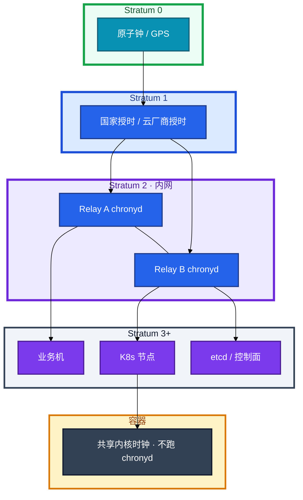
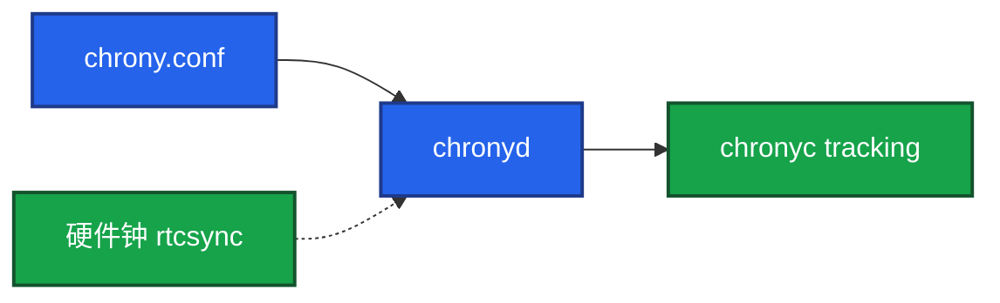
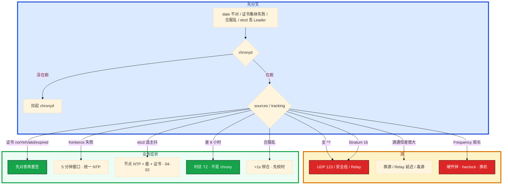

# NTP 与时间同步


合服当晚排行榜和邮件时间全乱。两边 `date` 差 3 秒，证书也开始集体 `notYetValid`。群里有人要先合再补，另有人 crontab 里 `ntpdate` 每小时猛调一次——etcd 那边 `has_leader` 也在抖。

先别动手。分布式里没有「大概对一下」：TLS、Kerberos、租约、binlog、日志对齐，用的都是这台机器以为的「现在」。本章教你布内网 Relay、读 tracking、合服前校时门禁，以及时钟把控制面打崩时先对表。

**本章主线（排障就按这三步想）：**

1. **业务只指内网 Relay**；容器共享节点时钟，不跑 chronyd。
2. **读 tracking**：Stratum 16 = 没同步；System time >0.5s 告警。
3. **合服门禁**：两套环境差 >1s 停止合服；运行中不要手打跳钟。

**读完你能：** 画出 Stratum 和 Relay；说出 Chrony 相对 ntpd / ntpdate 为什么是默认；会读 tracking（Stratum 16、0.5s 告警）；合服、证书、etcd、Kerberos 能各举一刀。

## 本章目录

- [1. 基本概念](#1-基本概念)
- [2. 架构图](#2-架构图)
- [3. 原理](#3-原理)
- [4. 落地](#4-落地)
- [5. 核心配置](#5-核心配置)
- [6. 命令与操作](#6-命令与操作)
- [7. 生产排障](#7-生产排障)
- [8. 必会 · 常考](#8-必会--常考)
- [合上书](#合上书问自己)

**本章不讲：** NTP 报文格式；API Server / kubelet 证书轮换流程 → [04-03 API Server](../../04-Kubernetes/03-API-Server/)；etcd Raft 细节 → [04-02 etcd](../../04-Kubernetes/02-etcd/)；合服、回档流程本身 → [08 游戏运维专题](../../08-游戏运维专题/)；云 NTP 产品、专线延迟 → [07 云平台](../../07-云平台/)；日志时间戳字段规范 → [22 日志运维](../22-日志运维/)。

---

## 1. 基本概念

分布式里没有「大概对一下」。TLS、Kerberos、租约、binlog 时间、日志对齐，用的都是这台机器以为的「现在」。

**值班里怎么认现象**（先听业务/监控怎么说，再对表）：

| 业务/监控说的 | 技术含义 | 你的第一刀 |
|---------------|----------|------------|
| 证书还有 60 天却 expired | 节点时间在未来 | `chronyc tracking` |
| 合服排行榜乱 3 秒 | 两套时钟不一致 | 两边 tracking，>1s 停合 |
| API 集体 401 / Kerberos 失败 | 票据窗口对不上 | 统一 NTP，别各指各的 |
| etcd 丢 Leader | 可能是时钟偏移 | tracking + 盘 + 证书（04-02） |
| 日志差 8 小时 | 多半是时区 | `timedatectl`，不是 chrony |
| Stratum 16 | 没同步上 | sources + UDP 123 |

生产用 **Chrony**，不要再用 `ntpdate`（一次性猛调，已过时），也不要把 ntpd 当新环境默认。RHEL 8+ / Ubuntu 20+ 默认就是 Chrony。

偏差量级（经验，不是法条）：

| 场景 | 量级 |
|------|------|
| 金融 | 常盯 **<50ms** |
| 游戏结算 / 合服 | 盯到 **<500ms** |
| 日志对齐 | **<1s** 就要开始难受 |
| 告警线 | 常见 **>0.5s** |
| tracking 排查 | System time **>0.1s** 就要查 |
| 合服门禁 | 两套环境差 **>1s 停止合服** |
| 硬件钟 vs 系统 | `hwclock` 差 **>1s** 当故障 |
| 业务机 Stratum | 一般 **≤4**；**>10** 当同步链断了；**16 = 没同步** |

业务机只指 **内网 Relay**，不要每台直连公网 NTP。容器默认共享宿主机内核时钟，**Pod 自己不跑 chrony**。时区是另一件事：差 8 小时先看 TZ。

**打个比方**：NTP 像全公司只对一块表——每人手表各走各的，结算、门禁、录像对不上号；Relay 是楼层的大钟，公网授时是总局原子钟。

> **记住**：时钟差看起来像业务 bug。合服、结算、证书、lease、etcd 选主，先对表。

**面试怎么说**：「业务机只指内网 2～3 台 Relay；读 chronyc tracking，Stratum 16 是未同步；容器共享节点时钟不跑 chronyd；合服差 >1s 停合。」

---

## 2. 架构图

后面 tracking、Relay、证书排障都对着这张图。



**读图三句话：**

1. **数字越大离钟源越远，不是更准。** Stratum 16 = 没对上表。
2. **业务只同步内网 2～3 台 Relay。** Relay 再指云 / 公网。
3. **etcd、kubelet、游戏服都是这张图上的客户机。** 时钟是控制面健康的一部分。

云上可直接用厂商 NTP 降低出公网；大规模仍建议 VPC 内 Relay，避免每台打公网池。

---

## 3. 原理

原理只保留动手和面试会用到的：怎么估偏差、为什么 Chrony、谁会被时钟打死。

### 3.1 NTP 在干什么（够用版）

**一句话：** Stratum 16 = 没同步上；运行中不要手打 makestep。

**打个比方**：对表像调钢琴音准——平时 **slew**（微调琴弦）几乎无感；**step**（猛拧弦轴）音会突然跳，正在演出的曲子（结算、lease）全乱。

**现场走一遍**（新业务机刚上线，怀疑没对上表）：

1. 看同步状态和层级：

```bash
systemctl is-active chronyd
chronyc tracking
chronyc sources -v
```

2. 屏幕出现（健康示例）：

```text
Reference ID    : CB6B0B0A (203.107.6.10)
Stratum         : 3
System time     : 0.000123456 seconds slow of NTP time
Last offset     : +0.000098765 seconds
RMS offset      : 0.000112233 seconds
Frequency       : 5.678 ppm slow relative to hardware clock
Leap status     : Normal
```

3. sources 里应有 `^*` 标记当前选用源：

```text
^* 203.107.6.10   3   6   377    45   +0.012ms  +0.008ms
```

4. **说明什么**：Stratum 3 = 离原子钟三层，正常；System time **0.00012s** ≈ 0.12ms，远小于告警 0.5s；`^*` = 正在用这个源。

5. 若 Stratum **16** 或 sources 全 `^?` → 没同步，先修源和 UDP 123，不要手改 `date`。

**输出解读**：

| 字段 | 正常 | 异常 |
|------|------|------|
| Stratum | **≤4**（业务机） | **16** = 未同步；**>10** = 链断 |
| System time | 绝对值 **<0.05s** 更好 | **>0.1s** 查；**>0.5s** 告警 |
| Last / RMS offset | 小且稳定 | 持续变大 = 源或网络差 |
| Frequency | 几十 ppm 内 | **>100 ppm** 怀疑 CMOS/主板 |
| Leap status | Normal | 非 Normal 关注闰秒公告 |

`makestep 1.0 3`：**前 3 次**同步若偏差 **>1 秒**就 step，之后 slew。开机对齐靠它；运行中突然 `chronyc -a makestep` 会让时间突跳——证书、lease、游戏结算都怕。`rtcsync` 把系统时写回硬件钟，避免重启后又偏。

**面试怎么说**：「Stratum 16 是未同步不是更准；我看 tracking 的 System time 和 sources 的 ^*；开机 makestep 对齐，跑着不手打跳钟。」

### 3.2 Chrony vs ntpd

**一句话：** RHEL 8+ / Ubuntu 20+ 默认 Chrony；禁止 crontab ntpdate。

**打个比方**：ntpd 像老式机械表——大偏差时要慢慢拧很久；Chrony 像石英表加智能校准——开机几秒对齐，断网恢复也快。`ntpdate` 像每月猛掰一次指针，和 chronyd 抢表。

**现场走一遍**（老机器还跑着 ntpd + crontab ntpdate）：

1. 看谁在管时钟：

```bash
systemctl is-active ntpd chronyd 2>/dev/null
crontab -l 2>/dev/null | grep ntpdate
```

```text
inactive
active
# （无 ntpdate 行）
```

2. 若 ntpd 和 chronyd **同时 active** → 两个服务抢时钟，必须停 ntpd、删 crontab ntpdate，只留 chronyd。

3. 对比初始同步速度（新装机观察）：

| | ntpd | Chrony |
|--|------|--------|
| 初始同步 | 慢，可能几十分钟 | 快，**秒级** |
| 网络闪断后 | 恢复慢 | 恢复快 |
| 大偏差 | 常要人介入 | `makestep` 可按策略 step |
| 默认 | 老系统 | **RHEL 8+ / Ubuntu 20+** |

4. 更严可 `makestep 0.1 2`（0.1s 就允许前两次跳）。默认 `makestep 1.0 3` 是平衡：前 3 次 >1s 才跳，之后微调。

5. 虚拟机看 hypervisor 是否注入时钟；云上优先厂商 NTP（AWS **169.254.169.123**），不要两套猛调。

**输出解读**：`chronyc activity` 能看到有多少客户端在问——Relay 上应看到内网业务机；业务机上应只有 2～3 个内网 server 行，不应再写一堆公网池。

**面试怎么说**：「新环境 Chrony 默认；禁止 crontab ntpdate 和 ntpd 并存；Chrony 开机秒级对齐、闪断恢复快，不是换了 NTP 协议。」

### 3.3 时钟打崩：etcd / Kerberos / 证书

**一句话：** 证书失败先 tracking，再 openssl；时钟差看起来像业务 bug。

**打个比方**：证书校验像查身份证有效期——机器时钟跑到「明年」，身份证明明有效却被判「还没生效」（notYetValid）；Kerberos 像限时入场券，表差 5 分钟门口就不认。

**现场走一遍**（一批节点 kubelet 报证书 expired，openssl 看还有 60 天）：

1. **先对表**，再 openssl：

```bash
chronyc tracking | grep -E 'Stratum|System time'
date -u
openssl x509 -in /var/lib/kubelet/pki/kubelet-client-current.pem -noout -dates 2>/dev/null | head -2
```

```text
Stratum         : 3
System time     : 62.345678 seconds fast of NTP time
notBefore=Jan  1 00:00:00 2026 GMT
notAfter=Jan  1 00:00:00 2027 GMT
```

2. **输出解读**：节点比 NTP **快 62 秒**——若再快一点跨过 notBefore/notAfter 窗口，TLS 会集体炸。先 `chronyc -a makestep`（低峰、广播窗口）或修源，**对表后往往立刻好**；已经因时间乱写下的租约/票据另说。

3. 各场景一刀：

| 场景 | 表现 | 量级直觉 |
|------|------|----------|
| **TLS / K8s 证书** | `notYetValid` / `expired` | **分钟级**就可能炸 |
| **Kerberos** | 票据窗口对不上 | 默认 **5 分钟**窗口 |
| **etcd / Raft** | 选主抖、lease 错 | 控制面节点 NTP 必须健康（04-02） |
| MySQL 主从 | binlog 时间戳乱 → PITR 错 | 按时间点恢复会恢复错 |
| Redis | 过期 key 提前或推迟删 | 秒级就能客诉 |
| 游戏排行榜 / 合服 | 结算时间戳不一致 | **>1s** 合服停 |
| 日志 | 多机时间线对不齐 | **<1s** 开始难受 |

4. etcd 排障 `has_leader==0` 时，NTP 和盘、证书**并列查**，不要跨 region 靠拧 election-timeout 硬扛。

5. 出海：服务器和日志用 **UTC**，展示层转本地；活动开关按运营指定时区，不要每台 `timedatectl` 各调各的。

**面试怎么说**：「证书 expired 但 notAfter 还有很久，我先 tracking 看 System time 是否在未来；Kerberos 默认 5 分钟窗口要统一 NTP；etcd 丢 Leader 时钟偏移和网抖都要查。」

> **记住**：Stratum 16 = 没对上表。证书失败先 tracking，再 openssl。合服差 >1s 停合，不要先合再回档。

---

## 4. 落地

| 项 | 选 | 不选 |
|----|----|------|
| 客户端 | Chrony，开机自启 | ntpd 当新默认；crontab ntpdate |
| 拓扑 | 内网 **2～3** 台 Relay；业务只指内网 | 每台直连公网池 |
| 云上 | 厂商 NTP / VPC Relay | 安全组不放 UDP 123 还怪 Chrony |
| 容器 | 节点 Chrony；Pod 不跑 chronyd | sidecar 抢时钟 |
| 时间表示 | 存 UTC，展示再转 | 每台 localtime 当唯一真相 |
| 监控 | 偏差 **>0.5s** 告警 | 只看本机 date 对网站 |

| 云 | 地址 | 特点 |
|----|------|------|
| 阿里云 | ntp.aliyun.com / ntp1–7 | 免费、低延迟 |
| AWS | **169.254.169.123** | VPC 内 link-local，不必出公网 |
| 火山 | ntp.volcengine.com | 同理 |

安全组放行 **UDP 123**。云上 `chronyc sources` 全是 `^?`，十次有九次是安全组或 NAT。



验收：进程在不算数。必须 tracking **Stratum ≤4**、至少一个 `^*`、System time 绝对值生产更好 **<0.05s**，告警 **0.5s**。`hwclock -r` 与系统 **<1s**。`timedatectl` 时区全集群一致。

---

## 5. 核心配置

```ini
# Ubuntu: /etc/chrony/chrony.conf    RHEL: /etc/chrony.conf

# —— Relay 示例：指云 NTP ——
server ntp.aliyun.com iburst minpoll 4 maxpoll 10
server ntp1.aliyun.com iburst

# —— 业务机：只写内网 Relay，不要公网 ——
# server 10.0.0.10 iburst
# server 10.0.0.11 iburst

makestep 1.0 3
rtcsync

# Relay 给内网服务时打开：
# allow 10.0.0.0/8
# local stratum 10

logdir /var/log/chrony
```

| 参数 | 含义 | 改错会怎样 |
|------|------|------------|
| `iburst` | 加快初始同步 | 去掉则开机对齐慢 |
| `makestep 1.0 3` | 前 3 次、>1s 跳齐 | 运行中乱加次数 = 结算突跳 |
| `makestep 0.1 2` | 更严 | 网络差时可能过频 step |
| `rtcsync` | 写回硬件钟 | 关掉则重启又偏 |
| `allow` | Relay 给内网服务 | 不写则业务指了也拒 |
| `local stratum 10` | 源全死时临时源 | 滥用会把错钟传遍 |

> **记住**：开机用 makestep；跑着不要手打跳钟。看 tracking 的 Stratum 和 System time，不要只看 `date`。

---

## 6. 命令与操作

值班先跑这几条：

```bash
systemctl status chronyd
chronyc tracking
chronyc sources -v
chronyc sourcestats -v
timedatectl
hwclock -r
```

| 目的 | 命令 | 看什么 |
|------|------|--------|
| 强制跳齐 | `sudo chronyc -a makestep` | **应急才用** |
| 活动 | `chronyc activity` | 源是否可达 |
| 时区 | `timedatectl` | 全集群一致；差 8 小时先看这个 |
| 监控 | node_exporter vs NTP | **>0.5s** 告警 |

### 6.1 巡检与告警

每台：chronyd 能问到、Stratum ≤10（生产更好 ≤4）、System time 绝对值 **<0.5s**。规模用 Prometheus，不要只靠 SSH 扫。合服前两套环境都扫。

### 6.2 合服前校时

两套区服 `chronyc tracking`，偏差 **>1s 停止合服**。流水线做成门禁。不要靠事后回档补时钟错误（08）。

### 6.3 应急对齐

Stratum 16：先修源和 UDP 123，再考虑 makestep。证书集体失败：先 tracking，对表后往往立刻好。应急 makestep 要广播窗口：lease、结算会疼。

### 6.4 升级

Chrony 包滚动：先升一台 Relay，业务机指向剩余 Relay。不要两台 Relay 同时停。升级 ntpd → Chrony：停 ntpd 和 crontab ntpdate，再启 chronyd，确认 `^*`。

### 6.5 回滚 / 换源

源毒、反复 step：换 Relay / 云 NTP，不要在业务机加大 makestep 掩盖。Frequency 几百 ppm：换电池或下线，**不要当 NTP Relay**。

### 6.6 迁移与容器

K8s：NTP 做在节点。Pod 差 8 小时：挂 `/etc/localtime` 或 `TZ=Asia/Shanghai`，不要 sidecar chronyd。

```yaml
env:
  - name: TZ
    value: Asia/Shanghai
```

手改 `date` 禁止：和 chrony 打架，会再跳回来或再跳走。

---

## 7. 生产排障

三问：chronyd 在不在？源通不通？这是时钟还是时区？



现场顺序：

```bash
systemctl status chronyd
chronyc sources -v
chronyc tracking
hwclock -r
timedatectl
```

| 现象 | 先做什么 | 不要做什么 |
|------|----------|------------|
| Stratum 16 | 源、UDP 123、chronyd | 手改 date |
| sources 全 `^?` | 安全组 UDP 123；AWS 用 169.254.169.123 | 重装 chrony |
| 时间突跳 | 查 makestep、谁手打了、源是否毒 | 再 makestep 掩盖 |
| 证书还有 60 天却 expired | 节点时间是否在未来 | 先重签 |
| 日志差 8 小时 | TZ / localtime | 当 NTP 事故 |
| etcd 丢 Leader | 节点 tracking + 盘 + peer 证书 | 只重启逻辑服 |
| Frequency 几百 ppm | 换电池/下线；勿当 Relay | 加大 makestep |
| 合服差 3 秒 | **停合**，对齐再跑 | 先合再回档 |

---

## 8. 必会 · 常考

| 说法 | 对错 | 口径 |
|------|:----:|------|
| crontab ntpdate 每小时一次就算同步 | 错 | 猛调、过时、和 Chrony 抢时钟 |
| 新系统默认继续用 ntpd | 错 | RHEL 8+ / Ubuntu 20+ 用 Chrony |
| Stratum 数字大更准 | 错 | 离钟源更远；16 = 没同步 |
| 每台直连公网 NTP 最好 | 错 | 大规模内网 Relay |
| 容器里要跑 chronyd | 错 | 共享节点时钟 |
| 差 8 小时一定是 NTP | 错 | 先看时区 |
| 运行中随便 makestep | 错 | 跳钟；结算/lease/证书怕 |
| 证书报过期先重签 | 错 | 先 tracking，可能时钟在未来 |
| Kerberos 和 NTP 无关 | 错 | 默认约 5 分钟窗口 |
| etcd 丢 Leader 只看磁盘 | 错 | 时钟偏移也会抖 |
| 合服差 >1s 先合再补 | 错 | 门禁停合；回档更贵 |
| 存当地时区方便运营 | 错 | 存 UTC，展示再转 |
| 硬件漂了加大 makestep | 错 | 换机；勿当 Relay |
| 只看 date 对网站就够 | 错 | 看不到 Stratum、毒源、漂移 |

数字：金融 **<50ms**；游戏结算/合服 **<500ms**；日志 **<1s** 难受；告警 **>0.5s**；排查 **>0.1s**；合服门禁 **>1s**；硬件钟差 **>1s**；Stratum **≤4** / **>10** 断链 / **16** 未同步；makestep **1.0 3**（更严 **0.1 2**）；Frequency **>100** ppm；Kerberos **5 分钟**；UDP **123**；Relay **2～3** 台；minpoll **4** maxpoll **10**。

易混：Chrony vs ntpd vs ntpdate；slew vs step；时钟 vs 时区；Stratum 远 vs 未同步；证书过期 vs 时钟快了；etcd 网抖 vs 时钟抖；合服数据错 vs 时钟错；Leap vs 硬件漂移。

---

## 合上书，问自己

1. 业务机指谁？Stratum 16 是什么？容器要不要 chronyd？
2. Chrony 相对 ntpd / ntpdate 差在哪？makestep 1.0 3 什么意思？
3. 证书失败、Kerberos 失败、etcd 丢 Leader，时钟各怎么炸？
4. tracking 看哪几列？告警 0.5s、合服 1s 分别干什么？
5. sources 全 `^?` 先查什么？云上 AWS 地址是什么？
6. 差 8 小时先看什么？硬件 Frequency 很大这台能不能当 Relay？

六题都能口述，这一章就过了。下一章把可用性说成数字：RTO/RPO、双活 vs 主备 vs 两地三中心，以及游戏合服和跨区容灾怎么选。
