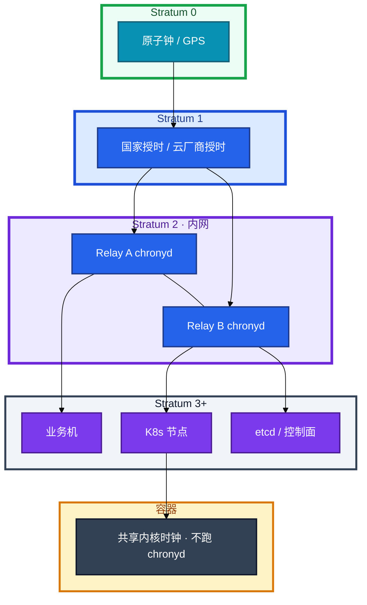
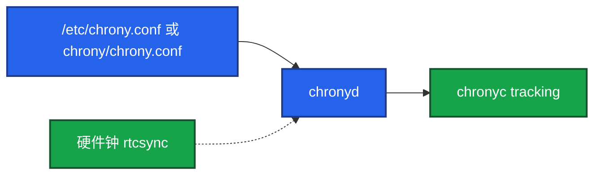
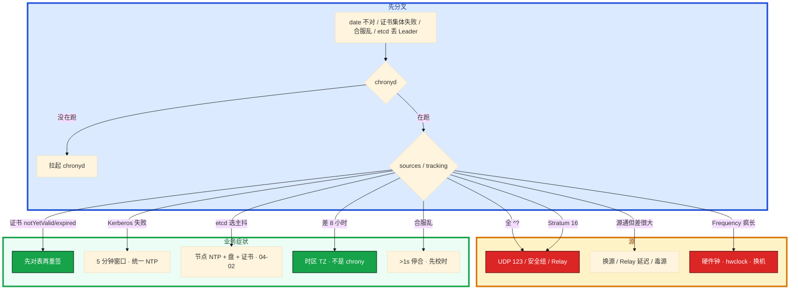

# NTP 与时间同步


合服当晚排行榜和邮件时间全乱。两边 `date` 差 3 秒。群里有人要先合再补，另有人 crontab 里 `ntpdate` 每小时猛调一次。证书也开始集体 `notYetValid`。

先别动手。这一章后半全是你会动手的：**怎么布内网 Relay、怎么读 tracking、合服前校时门禁、时钟把 etcd/Kerberos/证书打崩时先对表。** 前面的概念，是为了让你别把「差 8 小时」当成 NTP、别在运行中手打跳钟。

**读完你能：** 画出 Stratum 和 Relay；说出 Chrony 相对 ntpd / ntpdate 为什么是默认；会读 tracking（Stratum 16、0.5s 告警）；合服、证书、etcd、Kerberos 能各举一刀。

**本章主线（排障就按这三步想）：**

1. **业务只指内网 Relay**；容器共享节点时钟，不跑 chronyd。
2. **读 tracking**：Stratum 16 = 没同步；System time >0.5s 告警。
3. **合服门禁**：两套环境差 >1s 停止合服；运行中不要手打跳钟。

## 本章目录

- [1. 基本概念](#1-基本概念)
- [2. 架构图](#2-架构图)
- [3. 原理](#3-原理)
  - [3.1 NTP 在干什么](#31-ntp-在干什么够用版)
  - [3.2 Chrony vs ntpd](#32-chrony-vs-ntpd)
  - [3.3 时钟打崩什么](#33-时钟打崩etcd--kerberos--证书)
- [4. 落地](#4-落地)
- [5. 核心配置](#5-核心配置)
- [6. 命令与操作](#6-命令与操作)
- [7. 生产排障](#7-生产排障)
- [8. 必会 · 常考](#8-必会--常考)
- [合上书](#合上书问自己)

**本章不讲：** NTP 报文格式；API Server / kubelet 证书轮换流程 → [04-03 API Server](../../04-Kubernetes/03-API-Server/)；etcd Raft 细节 → [04-02 etcd](../../04-Kubernetes/02-etcd/)；合服、回档流程本身 → [08 游戏运维](../../08-游戏运维专题/)；云 NTP 产品、专线延迟 → [07 云平台](../../07-云平台/)；日志时间戳字段规范 → [22 日志运维](../22-日志运维/)。

---

## 1. 基本概念

分布式里没有「大概对一下」。TLS、Kerberos、租约、binlog 时间、日志对齐，用的都是这台机器以为的「现在」。

生产用 **Chrony**，不要再用 `ntpdate`（一次性猛调，已过时），也不要把 ntpd 当新环境默认。RHEL 8+ / Ubuntu 20+ 默认就是 Chrony。

偏差量级（经验，不是法条）：

| 场景 | 量级 |
|------|------|
| 金融 | 常盯 **<50ms** |
| 游戏结算 / 合服 | 盯到 **<500ms** |
| 日志对齐 | **<1s** 就要开始难受 |
| 告警线 | 常见 **>0.5s** |
| tracking 排查 | System time **>0.1s** 就要查 |
| 合服门禁 | 两套环境差 **>1s 停止合服** |
| 硬件钟 vs 系统 | `hwclock` 差 **>1s** 当故障 |
| 业务机 Stratum | 一般 **≤4**；**>10** 当同步链断了；**16 = 没同步** |

业务机只指 **内网 Relay**，不要每台直连公网 NTP。容器默认共享宿主机内核时钟，**Pod 自己不跑 chrony**。时区是另一件事：差 8 小时先看 TZ。

> **记住**：时钟差看起来像业务 bug。合服、结算、证书、lease、etcd 选主，先对表。

---

## 2. 架构图

先把整张图钉住。后面排障都对着这张图。



**读图三句话：**

1. **数字越大离钟源越远，不是更准。** Stratum 16 = 没对上表。
2. **业务只同步内网 2～3 台 Relay。** Relay 再指云 / 公网。
3. **etcd、kubelet、游戏服都是这张图上的客户机。** 时钟是控制面健康的一部分。

云上可直接用厂商 NTP 降低出公网；大规模仍建议 VPC 内 Relay，避免每台打公网池。

---

## 3. 原理

原理只保留动手和面试会用到的：怎么估偏差、为什么 Chrony、谁会被时钟打死。

**本节 3 块：** 3.1 NTP · 3.2 Chrony vs ntpd · 3.3 etcd / Kerberos / 证书

### 3.1 NTP 在干什么（够用版）

**一句话：** Stratum 16 = 没同步上；运行中不要手打 makestep。

客户端带时间戳发请求，服务端带回时间戳。用四元时间戳估 **网络延迟** 和 **时钟偏差**，再 **slew**（微调频率）或 **step**（跳变）。

层级：Stratum 0 是钟源本身。**Stratum 16 表示没同步上。** 生产业务机一般 ≤4。

`makestep` 是 **跳钟** 不是「慢慢纠」。开机对齐靠它；运行中突然大 step 会让时间突跳——证书、lease、游戏结算都怕。所以 Relay 要稳，业务机不要随便 `chronyc -a makestep`。

`rtcsync` 把系统时写回硬件钟，避免重启后又是错的。硬件漂移（Frequency ppm 长期 **>100**）怀疑 CMOS/主板；这台不要当 Relay。

闰秒看 Leap status：非 Normal 要关注公告，别和硬件漂移混为一谈。

### 3.2 Chrony vs ntpd

**一句话：** RHEL 8+ / Ubuntu 20+ 默认 Chrony；禁止 crontab ntpdate。

| | ntpd | Chrony |
|--|------|--------|
| 初始同步 | 慢，可能几十分钟 | 快，**秒级** |
| 网络闪断后 | 恢复慢 | 恢复快 |
| 大偏差 | 常要人介入 | 可按 makestep 自动 step |
| 资源 | 略重 | 轻 |
| 默认 | 老系统 | **RHEL 8+ / Ubuntu 20+** |
| 和 ntpdate | 常被 crontab ntpdate 抢时钟 | 不要并存 |

Chrony 用另一套滤波估偏差和延迟，允许开机几次 **step**；ntpd 更偏向缓慢 slew，大偏差会卡很久。不是「NTP 协议换了」。

`ntpdate`：一次性猛调、已过时、和 chronyd 抢时钟。新环境禁止 crontab 里跑。

更严可以 `makestep 0.1 2`（0.1s 就允许前两次跳）。默认常见 `makestep 1.0 3`：**前 3 次**同步若偏差 **>1 秒**就 step，之后 slew。

虚拟机还要看 hypervisor 是否注入时钟。云上优先厂商 NTP；客机 Chrony 和宿主对表策略冲突时，以厂商文档为准，不要两套猛调。

### 3.3 时钟打崩：etcd / Kerberos / 证书

**一句话：** 证书失败先 tracking，再 openssl；时钟差看起来像业务 bug。

能举三例就算会。游戏服最疼的四件再单列。

| 场景 | 表现 | 量级直觉 |
|------|------|----------|
| **TLS / K8s 证书** | `notYetValid` / `expired` → API 拒连 | 快了当过期，慢了当未生效；**分钟级**就可能炸 |
| **Kerberos** | 票据窗口对不上，认证失败 | 默认 **5 分钟**窗口 |
| **etcd / Raft** | 选主抖、lease 到期判断错 | 控制面 etcd **不要靠跨地域扛 RTT**；时钟偏移会抖（04-02） |
| 分布式锁 | lease 到期错 → **双主** | 和「真脑裂」叠在一起更难查 |
| MySQL 主从 | 从库快了 → binlog 时间戳乱 → **PITR** 出错 | 按时间点恢复会恢复错 |
| Redis | 过期 key 提前或推迟删 | 秒级就能客诉 |
| 日志 | 多机时间线对不齐 | **<1s** 开始难受 |
| 游戏排行榜 / 活动 | 结算时间戳不一致 | 盯 **<500ms**；**>1s** 合服停 |
| 反作弊 | 请求时间戳被判外挂 | 误杀 |

**证书：** kubelet 报过期，openssl 看 notAfter 还有 60 天——先看节点是不是跑到未来。一批节点同时挂、证书同一套 CA，更像 NTP 或时区，不像单张证书坏了。先对表，再重签。时钟拉回来，校验窗口恢复，往往立刻好。已经因时间乱写下的租约/票据另说。

**Kerberos：** 默认时钟偏差超过约 5 分钟就拒。域控、堡垒机、业务机必须同一套 NTP。不要各 NTP 各的。

**etcd：** Raft 心跳和选举超时按**物理时间**走。节点之间偏差大，表现为丢 Leader、频繁选举，看起来像网抖。控制面节点 Chrony 必须健康；排障 `has_leader==0` 时 NTP 和盘、证书并列（04-02）。不要跨 region 靠拧 `election-timeout` 硬扛。

出海：服务器和日志用 **UTC**，展示层转本地。活动开关按运营指定时区或 UTC+偏移，不要每台 `timedatectl` 各调各的。

> **记住**：Stratum 16 = 没对上表。开机用 makestep 对齐；跑着不要手打跳钟。证书失败先 tracking，再 openssl。

---

## 4. 落地

### 4.1 生产怎么选

| 项 | 选 | 不选 |
|----|----|------|
| 客户端 | Chrony，开机自启 | ntpd 当新默认；crontab ntpdate |
| 拓扑 | 内网 **2～3** 台 Relay；业务只指内网 | 每台直连公网池 |
| 云上 | 厂商 NTP / VPC Relay | 安全组不放 UDP 123 还怪 Chrony |
| 容器 | 节点 Chrony；Pod 不跑 chronyd | sidecar 抢时钟 |
| 时间表示 | 存 UTC，展示再转 | 每台 localtime 当唯一真相 |
| 监控 | 偏差 **>0.5s** 告警 | 只看本机 date 对网站 |

| 方案 | 适用 | 注意 |
|------|------|------|
| 每台直连公网 NTP | 小规模 | 延迟抖动、安全组、源质量 |
| 内网 2～3 台 Relay | **大规模默认** | 业务只指内网；Relay 再指云/公网 |
| 云厂商 NTP | 云上 | 延迟低，少出公网 |

| 云 | 地址 | 特点 |
|----|------|------|
| 阿里云 | ntp.aliyun.com / ntp1–7 | 免费、低延迟 |
| AWS | **169.254.169.123** | VPC 内 link-local，不必出公网 |
| 火山 | ntp.volcengine.com | 同理 |

安全组放行 **UDP 123**。云上 `chronyc sources` 全是 `^?`，十次有九次是安全组或 NAT。

### 4.2 落地你实际看到什么



| 路径 | 内容 |
|------|------|
| Ubuntu `/etc/chrony/chrony.conf`；RHEL `/etc/chrony.conf` | 源、makestep、allow |
| `systemctl status chronyd` | active + enabled |
| `chronyc tracking` | Stratum、System time |
| `chronyc sources -v` | `^*` 当前选用 |
| `/var/log/chrony/` | 是否反复 step |
| 容器 | **没有** chronyd；`date` 跟节点 |

验收：进程在不算数。必须 tracking **Stratum ≤4**（巡检阈值 ≤10 当 WARN）、至少一个 `^*`、System time 绝对值生产更好 **<0.05s**，告警 **0.5s**。硬件钟 `hwclock -r` 与系统 **<1s**。`timedatectl` 时区全集群一致。

---

## 5. 核心配置

```ini
# Ubuntu: /etc/chrony/chrony.conf    RHEL: /etc/chrony.conf
server ntp.aliyun.com iburst minpoll 4 maxpoll 10
server ntp1.aliyun.com iburst
server cn.pool.ntp.org iburst

# 前 3 次同步：偏差 >1s 就 step，之后 slew
makestep 1.0 3
rtcsync

# 大集群：这台当内网服务端
# allow 192.168.0.0/16
# local stratum 10

logdir /var/log/chrony
```

业务机把 `server` 改成两台 Relay，不要再写公网。Relay 自己指云 NTP，`allow` 内网。

| 参数 | 含义 | 改错会怎样 |
|------|------|------------|
| `iburst` | 加快初始同步 | 去掉则开机对齐慢 |
| `makestep 1.0 3` | 前 3 次、>1s 跳齐 | 运行中乱加次数 = 结算突跳 |
| `makestep 0.1 2` | 更严 | 网络差时可能过频 step |
| `rtcsync` | 写回硬件钟 | 关掉则重启又偏 |
| `allow` | Relay 给内网服务 | 不写则业务指了也拒 |
| `local stratum 10` | 源全死时仍可当临时源 | 滥用会把错钟传遍 |

> **记住**：开机用 makestep；跑着不要手打跳钟。看 tracking 的 Stratum 和 System time，不要只看 `date`。

---

## 6. 命令与操作

值班先跑这几条：

```bash
systemctl status chronyd
chronyc tracking
chronyc sources -v
chronyc sourcestats -v
timedatectl
hwclock -r
```

`chronyc tracking` 要会读：

```
Reference ID    : CB6B0B0A (203.107.6.10)
Stratum         : 3
System time     : 0.000123456 seconds slow of NTP time
Last offset     : +0.000098765 seconds
RMS offset      : 0.000112233 seconds
Frequency       : 5.678 ppm slow relative to hardware clock
Leap status     : Normal
```

| 字段 | 生产怎么看 |
|------|------------|
| Stratum | **>10 或 16** = 没同步 |
| System time | 偏差；**>0.1s** 排查，告警常 **0.5s** |
| Last offset | 持续变大 = 源或网络差 |
| Frequency | 硬件漂移 ppm；长期 **>100** 怀疑 CMOS/主板 |
| Leap status | 非 Normal 要关注闰秒 |

| 目的 | 命令 | 看什么 |
|------|------|--------|
| 强制跳齐 | `sudo chronyc -a makestep` | **应急才用** |
| 活动 | `chronyc activity` | 源是否可达 |
| 时区 | `timedatectl` | 全集群一致；差 8 小时先看这个 |
| 监控 | node_exporter vs NTP | **>0.5s** 告警 |

`get /registry` 式手改 `date` 禁止：和 chrony 打架，会再跳回来或再跳走。

---

### 6.1 巡检与告警

每台：chronyd 能问到、Stratum ≤10（生产更好 ≤4）、System time 绝对值 **<0.5s**。规模用 Prometheus，不要只靠 SSH 扫。合服前两套环境都扫。

### 6.2 合服前校时

两套区服 `chronyc tracking`，偏差 **>1s 停止合服**。流水线做成门禁。不要靠事后回档补时钟错误——回档比校时贵一个数量级（08）。

### 6.3 应急对齐

Stratum 16：先修源和 UDP 123，再考虑 makestep。证书集体失败：先 tracking，对表后往往立刻好。应急 `chronyc -a makestep` 要广播窗口：lease、结算会疼。

### 6.4 升级

Chrony 包滚动：先升一台 Relay，业务机指向剩余 Relay。不要两台 Relay 同时停。升级 ntpd → Chrony：停 ntpd 和 crontab ntpdate，再启 chronyd，确认 `^*`。

### 6.5 回滚 / 换源

源毒、反复 step：换 Relay / 云 NTP，不要在业务机加大 makestep 掩盖。配置回滚 = 上一份 conf + restart chronyd（会短暂失同步，选低峰）。Frequency 几百 ppm：换电池或下线，**不要当 NTP Relay**；云主机换实例。

### 6.6 迁移与容器

换机器：镜像带 chrony 指向 Relay。K8s：NTP 做在节点。Pod 差 8 小时：挂 `/etc/localtime` 或 `TZ=Asia/Shanghai`，不要 sidecar chronyd。

```yaml
env:
  - name: TZ
    value: Asia/Shanghai
```

---

## 7. 生产排障

三问：chronyd 在不在？源通不通？这是时钟还是时区？



现场顺序：

```bash
systemctl status chronyd
chronyc sources -v
chronyc tracking
hwclock -r
timedatectl
# 证书场景再 openssl 看 notBefore / notAfter
```

| 现象 | 先做什么 | 不要做什么 |
|------|----------|------------|
| Stratum 16 | 源、UDP 123、chronyd | 手改 date |
| sources 全 `^?` | 安全组 UDP 123；AWS 用 169.254.169.123 | 重装 chrony |
| 时间突跳 | 查 makestep、谁手打了、源是否毒 | 再 makestep 掩盖 |
| 证书还有 60 天却 expired | 节点时间是否在未来 | 先重签 |
| 日志差 8 小时 | TZ / localtime | 当 NTP 事故 |
| etcd 丢 Leader | 节点 tracking + 盘 + peer 证书 | 只重启逻辑服 |
| Frequency 几百 ppm | 换电池/下线；勿当 Relay | 加大 makestep |
| 合服差 3 秒 | **停合**，对齐再跑 | 先合再回档 |

---

## 8. 必会 · 常考

白板和追问高频，能一口回：

| 说法 | 对错 | 口径 |
|------|:----:|------|
| crontab ntpdate 每小时一次就算同步 | 错 | 猛调、过时、和 Chrony 抢时钟 |
| 新系统默认继续用 ntpd | 错 | RHEL 8+ / Ubuntu 20+ 用 Chrony |
| Stratum 数字大更准 | 错 | 离钟源更远；16 = 没同步 |
| 每台直连公网 NTP 最好 | 错 | 大规模内网 Relay |
| 容器里要跑 chronyd | 错 | 共享节点时钟 |
| 差 8 小时一定是 NTP | 错 | 先看时区 |
| 运行中随便 makestep | 错 | 跳钟；结算/lease/证书怕 |
| 证书报过期先重签 | 错 | 先 tracking，可能时钟在未来 |
| Kerberos 和 NTP 无关 | 错 | 默认约 5 分钟窗口 |
| etcd 丢 Leader 只看磁盘 | 错 | 时钟偏移也会抖 |
| 合服差 >1s 先合再补 | 错 | 门禁停合；回档更贵 |
| 存当地时区方便运营 | 错 | 存 UTC，展示再转 |
| 硬件漂了加大 makestep | 错 | 换机；勿当 Relay |
| 只看 date 对网站就够 | 错 | 看不到 Stratum、毒源、漂移 |

数字：金融 **<50ms**；游戏结算/合服 **<500ms**；日志 **<1s** 难受；告警 **>0.5s**；排查 **>0.1s**；合服门禁 **>1s**；硬件钟差 **>1s**；Stratum **≤4** / **>10** 断链 / **16** 未同步；makestep **1.0 3**（更严 **0.1 2**）；Frequency **>100** ppm；Kerberos **5 分钟**；UDP **123**；Relay **2～3** 台；minpoll **4** maxpoll **10**。

易混：Chrony vs ntpd vs ntpdate；slew vs step；时钟 vs 时区；Stratum 远 vs 未同步；证书过期 vs 时钟快了；etcd 网抖 vs 时钟抖；合服数据错 vs 时钟错；Leap vs 硬件漂移。

---

## 合上书，问自己

1. 业务机指谁？Stratum 16 是什么？容器要不要 chronyd？
2. Chrony 相对 ntpd / ntpdate 差在哪？makestep 1.0 3 什么意思？
3. 证书失败、Kerberos 失败、etcd 丢 Leader，时钟各怎么炸？
4. tracking 看哪几列？告警 0.5s、合服 1s 分别干什么？
5. sources 全 `^?` 先查什么？云上 AWS 地址是什么？
6. 差 8 小时先看什么？硬件 Frequency 很大这台能不能当 Relay？

六题都能口述，这一章就过了。下一章把可用性说成数字：RTO/RPO、双活 vs 主备 vs 两地三中心，以及游戏合服和跨区容灾怎么选。
