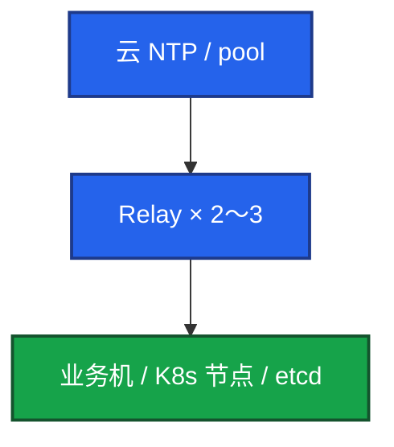

# 19｜NTP与时间同步 · 练习题

先自己画图或口述，再对照解答。每题标了覆盖范围：

| 标记 | 含义 |
|------|------|
| **核心** | 不懂整章就没建立起来 |
| **必会** | 值班和面试都要能讲 |
| **常用** | 线上会反复碰到 |
| **常考** | 白板和追问的高频口径 |

## 本题目录

- [Q1 生产怎么同步](#q1)
- [Q2 不同步炸什么](#q2)
- [Q3 Chrony vs ntpd](#q3)
- [Q4 etcd / Kerberos / 证书](#q4)
- [Q5 游戏合服](#q5)
- [Q6 容器与时区](#q6)
- [Q7 tracking 排障](#q7)
- [Q8 巡检](#q8)
- [Q9 升级换源](#q9)
- [合上书](#合上书)

---

## Q1

**★★★★★｜生产怎么保证时间同步？**

**覆盖**：核心 · 必会 · 常考

### 场景

「机器时间谁在管？」有人说 crontab 里 `ntpdate` 每小时跑一次。

### 完整解答

统一 **Chrony**，开机自启。大规模不要每台直连公网：



关键配置：`iburst`；`makestep 1.0 3` 开机允许大偏差跳齐；`rtcsync` 写回硬件钟。监控 node_exporter，**偏差 >0.5s 告警**。

不要用 ntpdate：一次性猛调、已过时、和 chronyd 抢时钟。

### 再追问

为什么不用 ntpd？——Chrony 初始更快、闪断恢复更快、大偏差可按规则 step、更轻。RHEL 8+ / Ubuntu 20+ 默认就是它。

---

## Q2

**★★★★★｜时间不同步会出什么事？举三个**

**覆盖**：核心 · 必会 · 常考

### 场景

证书突然大面积失败。有人先重签。后来发现节点快了 20 分钟。

### 完整解答

先举三件，再补：

1. **K8s / TLS**：偏差到证书有效期窗外 → 未生效或已过期 → API 拒连。
2. **MySQL PITR**：binlog 时间戳乱，按时间恢复恢复错。
3. **游戏排行榜 / 活动**：结算时间戳不一致，客诉回档。

还有：Kerberos 默认 **5 分钟**窗口；Redis 过期提前/推迟；分布式锁 lease → 双主；多机日志对不齐（**<1s** 开始难受）；反作弊误杀。

发现：监控对比 NTP；巡检 `chronyc tracking`。先对表，再重签证书。

### 再追问

偏差多少会出事？——TLS 可能分钟级就炸；游戏结算 1s 就可能客诉；告警不要等到 1s，**0.5s** 就叫人。金融常盯 **<50ms**；游戏结算/合服盯 **<500ms**。

---

## Q3

**★★★★☆｜Chrony 和 ntpd 差在哪？makestep 是什么意思？**

**覆盖**：核心 · 必会 · 常用

### 场景

旧机房还在跑 ntpd，新镜像换成 Chrony。有人怕「跳钟」把游戏结算打乱。

### 完整解答

Chrony：秒级对齐、闪断恢复快、可 makestep、更轻。  
ntpd：慢 slew，大偏差可能几十分钟甚至要人介入。不是 NTP 协议换了，是滤波和是否允许受控 step。

`makestep 1.0 3`：**前 3 次**同步若偏差 **>1 秒**就 **step（跳变）**，之后 slew。这是开机用的。更严 `makestep 0.1 2`。运行中频繁 step = 时间突跳。应急才 `chronyc -a makestep`。

### 再追问

Chrony 为什么更快？——滤波算法不同，允许受控 step；ntpd 更保守地拧频率。

---

## Q4

**★★★★★｜时钟怎么打崩 etcd、Kerberos、证书？先看什么？**

**覆盖**：核心 · 必会 · 常考

### 场景

三张工单：① kubelet 报证书过期，openssl 看 notAfter 还有两个月 ② 堡垒机 Kerberos 集体失败 ③ etcd `has_leader==0`，有人要重启逻辑服。

### 完整解答

| # | 机制 | 先做什么 |
|---|------|----------|
| 证书 | 时钟快了 → 已过期；慢了 → notYetValid | `chronyc tracking`，再 openssl notBefore/After，最后才轮换 |
| Kerberos | 默认约 **5 分钟**窗口 | 域控和业务机同一套 NTP |
| etcd | Raft 按物理时钟走心跳/选举；偏移会抖 | 节点 NTP + 盘 + peer 证书；不要只重启战斗服 |

一批节点同时挂、证书同一套 CA，更像 NTP。对表后校验窗口恢复，往往立刻好。已经写坏的租约另说。

控制面 etcd 不要跨 region 靠拧 election-timeout 硬扛（04-02）。

### 再追问

对表之后 API 立刻好吗？——时钟拉回来往往立刻好。lease/票据已按错误时间发出的要另处理。

---

## Q5

**★★★★☆｜游戏服对时钟有什么特殊要求？合服差 3 秒？**

**覆盖**：必会 · 常用 · 常考

### 场景

合服当晚排行榜和邮件时间全乱。两边 `date` 差 3 秒。有人要先合再补。

### 完整解答

四件敏感事：排行榜结算、活动开关、合服按时间合并、反作弊时间戳。

合服流水线 **前置校时**：偏差 **>1s 停**。不要先合再补。回档比校时贵一个数量级（08）。告警线 **0.5s**，结算盯 **<500ms**。

出海：进程和库用 **UTC**，客户端展示转本地。活动「北京时间 12:00」写成 UTC+8 的绝对时间，不要依赖各机 localtime。

### 再追问

跨 Region 怎么处理时区？——存 UTC。展示层转。不要每台 `timedatectl` 设当地时区当唯一真相。

---

## Q6

**★★★★☆｜Pod 时间和宿主机一样吗？容器里要装 Chrony 吗？**

**覆盖**：必会 · 常用

### 场景

游戏 Pod 日志比节点 `date` 快 8 小时。有人要在 sidecar 里跑 chronyd。

### 完整解答

**时钟一样**：容器共享宿主机内核时钟。节点 Chrony 好了，Pod 的 UTC 就对。**不要**在容器里再跑 chrony。

差 8 小时通常是 **时区**：镜像 UTC vs 宿主机 CST。挂 `/etc/localtime` 或 `TZ=Asia/Shanghai`。

K8s 节点之间不同步：证书、etcd、日志关联一起坏。NTP 做在节点，不是做在每个 Pod。

### 再追问

用 UTC 还是本地时区？——服务器和日志 UTC；展示层转本地。

---

## Q7

**★★★★☆｜chronyc tracking 里 Stratum 16、偏差 2s，你怎么查？**

**覆盖**：必会 · 常用

### 场景

告警：某逻辑服偏移 2 秒。`chronyc tracking` 显示 Stratum 16。

### 完整解答

Stratum **16** = **当前没有同步源**。

```
  1. systemctl status chronyd
  2. chronyc sources -v     全 ^? → UDP 123 / 安全组 / Relay 挂了
  3. 源通但差 → 换源、查延迟、Relay 自己是否同步
  4. Frequency ppm 很大（>100） → 硬件钟，hwclock -r，考虑换机
  5. /var/log/chrony 是否反复失败
```

先修同步，不要在业务机上手改 `date`。云上 sources 全失败：安全组 / NACL 没放 **UDP 123**。AWS 用 **169.254.169.123**。

### 再追问

硬件时钟漂移很大怎么办？——Chrony 拧不过坏硬件。这台 **不要当 NTP Relay**。云主机换实例，不要加大 makestep 掩盖。Leap status 非 Normal 是闰秒，别和漂移混谈。

---

## Q8

**★★★☆☆｜写一个巡检：扫一批机器的时间同步**

**覆盖**：常用

### 场景

合服前要确认两套环境所有节点偏差 <0.5s。

### 完整解答

每台三件事：chronyd 能问到、Stratum ≤10（生产更好 ≤4）、System time 绝对值 **<0.5s**。硬件钟与系统 **<1s**。至少一个 `^*`。

规模上去用 Prometheus 比 SSH 扫更合适。只看本机 date 和标准时间网站能发现大偏差，看不到 Stratum、源是否毒、硬件漂移。

### 再追问

合格线 tracking 更好是多少？——偏差 **<0.05s** 更好；告警仍是 **0.5s**。

---

## Q9

**★★★☆☆｜升级 Chrony、换源、两台 Relay 怎么滚？**

**覆盖**：必会 · 常用

### 场景

要升 chrony 包；有人两台 Relay 一起停。另一次源反复 step。

### 完整解答

先升一台 Relay，业务仍指向另一台。不要两台同时停。ntpd → Chrony：停 ntpd 和 crontab ntpdate，再启 chronyd，确认 `^*`。

源毒：换 Relay / 云 NTP，不要在业务机加大 makestep。应急 makestep 要窗口广播。虚拟机以厂商 NTP 文档为准，不要客机和宿主两套猛调。

### 再追问

`local stratum 10` 什么时候用？——Relay 源全死时的临时兜底。滥用会把错钟传遍。

---

## 合上书

- [ ] 能画出 Relay 架构，并拒绝 ntpdate / 每台公网 NTP
- [ ] 能对比 Chrony vs ntpd，解释 makestep 1.0 3
- [ ] 能把证书 / Kerberos 5 分钟 / etcd 选主抖讲到先对表
- [ ] 能执行合服门禁 >1s 停；告警 0.5s；结算 <500ms
- [ ] 能读 tracking：Stratum 16、sources ^?、Frequency、时区 vs 时钟
- [ ] 能说容器不跑 chrony；升级时 Relay 滚动
