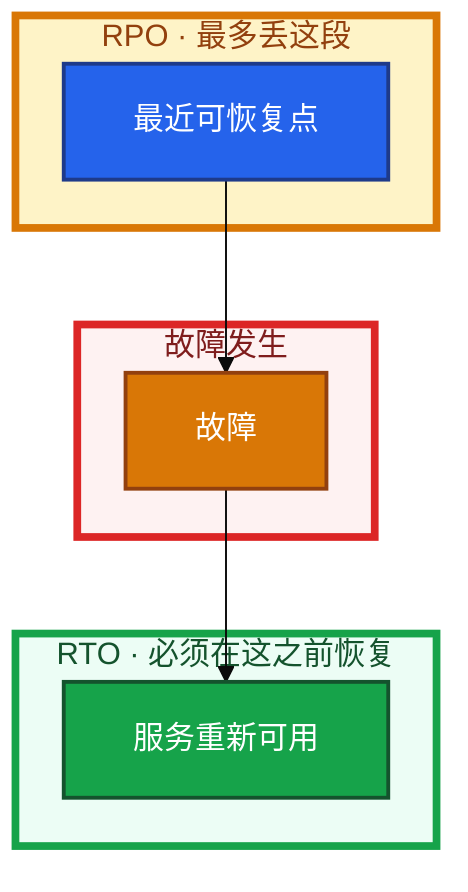
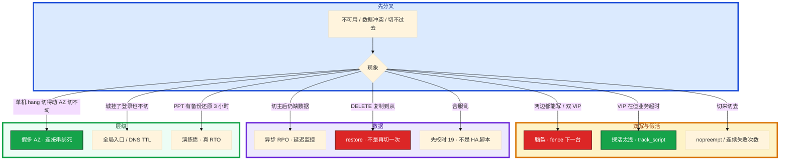

# 高可用与容灾


老板说「登录不能挂」。群里有人直接画异地双活；机房中间交换机闪断后两台都自称主，一半充值写在 A、一半写在 B。备份任务天天绿，却从没 restore 过。合服当晚还叠了一次强更——玩家排行乱了，值班在抢 VIP 和合并脚本之间来回跑。

**本章主线（排障就按这三步想）：**

1. **先问 RTO/RPO**，再选主备 / 双活 / 两地三中心。
2. **奇数 quorum**：3 台扛 1 故障；Keepalived 两台不算 quorum。
3. **备份要 restore 演练**；合服不是容灾切换。

**读完你能：** 把 RTO/RPO 换成方案档；分清主备 / 双活 / 两地三中心；奇数 quorum 一口回；健康检查连续失败再切；备份没有演练不算；游戏合服和跨区容灾不混成一件事。

## 本章目录

- [1. 基本概念](#1-基本概念)
- [2. 架构图](#2-架构图)
- [3. 原理](#3-原理)
  - [3.1 几个 9](#31-几个-9)
  - [3.2 主备 / 双活 / 两地三中心](#32-主备--双活--两地三中心)
  - [3.3 脑裂与奇数](#33-脑裂与奇数)
  - [3.4 健康检查](#34-健康检查查什么何时切)
  - [3.5 游戏合服与跨区容灾](#35-游戏合服与跨区容灾)
- [4. 落地](#4-落地)
- [5. 核心配置](#5-核心配置)
- [6. 命令与操作](#6-命令与操作)
- [7. 生产排障](#7-生产排障)
- [8. 必会 · 常考](#8-必会--常考)
- [合上书](#合上书问自己)

**本章不讲：** LVS NAT/DR/TUN、ipvs → [16 LVS](../16-LVS与四层负载均衡/)；Keepalived 配置、双 VIP、GARP、nopreempt → [24 HAProxy 与 Keepalived](../24-HAProxy与Keepalived/)；云多 AZ、SLB、跨 Region DNS → [07 云平台](../../07-云平台/)；游戏 SLO 细账、活动高峰、回档步骤 → [08 游戏运维](../../08-游戏运维专题/)；etcd quorum 操作 → [04-02 etcd](../../04-Kubernetes/02-etcd/)；MySQL 复制细节 → [03-01 MySQL](../../03-中间件与数据库/01-MySQL/)。

---

## 1. 基本概念

高可用不是「画两台机器」，是 **先问能挂多久、能丢多少**，再选热备还是备份。现场 80% 的翻车来自：没数字就开干、备份从没 restore、把合服当容灾切换。

**值班里怎么认现象**（先听业务/监控怎么说，再对表）：

| 群里说的 | 技术含义 | 你的第一刀 |
|----------|----------|------------|
| 「登录挂了要双活」 | 可能只要主备 + VIP | 先问 RTO/RPO 数字 |
| 「两台都是主」 | 脑裂 / 双 VIP | fence 一台，停写 |
| 「切过去了数据少了」 | 异步 RPO 兑现 | 看复制延迟，不是再切 |
| 「备份天天成功」 | 不等于能恢复 | 问上次 restore 时间 |
| 「今晚合服顺便升内核」 | 变更叠加 | 拆开窗口 |

| 指标 | 全称 | 含义 |
|------|------|------|
| **RTO** | Recovery Time Objective | 中断到恢复的**目标上限** |
| **RPO** | Recovery Point Objective | 最多丢多少数据（用时间说） |
| **MTTR** | Mean Time To Repair | **实测**平均修复时间 |
| **MTBF** | Mean Time Between Failures | 平均无故障间隔 |
| 可用性 | MTBF / (MTBF + MTTR) | 几个 9 的来源之一 |

RTO 是承诺，MTTR 是成绩单。发现、到位、决策、切换、验证都算进 RTO。演练缩短的是 MTTR，不是祈祷少挂。切换解决「进程没了」；误删、勒索、逻辑错误只能靠 restore——主从一起复制过去的 `DELETE`，切主救不了。

**打个比方**：像买保险——RTO 是「多久能赔到车开走」，RPO 是「最多丢多少行李」；备份是保单，没理赔演练过的保单是废纸。

| 档 | RTO | RPO | 典型 |
|----|-----|-----|------|
| 热备 / 同步 / 多活 | ≈0 | ≈0 | 成本最高 |
| 温备 / 异步 + 快速切换 | 分钟级 | 秒～分钟 | 常见 |
| 冷备 / 快照 + 人拉起 | 小时级 | 小时级 | 成本低 |

> **记住**：先问能挂多久、能丢多少，再画主备。没有演练过 restore 的备份，RPO 是空话。

**面试怎么说**：「我不会先画双活，我先问 RTO/RPO，有状态默认主备，备份必须季度 restore。」

---

## 2. 架构图

后面 RTO/RPO、切换、脑裂都对着这张图。



**读图三句话：**

1. **先问 RTO/RPO**，再选主备 / 双活 / 两地三中心——图上的 RPO 段是备份点与故障之间，RTO 段是故障到恢复。
2. **切换救不了误删**——那要靠 restore 演练过的备份（08 回档）。
3. **现场顺序**：数字 → 形态 → quorum/探活 → 演练记录，不要跳步画全球双活。

三种生产形态：


主备：同一时刻一份写，切换有缝，冲突少。双活：两边都接写，无切换延迟，脑裂更难。两地三中心：同城抗 AZ 级、异地抗城级，异地通常异步，RPO 不是 0。

---

## 3. 原理

### 3.1 几个 9：525600 分钟是口算尺子

**一句话：** 525600 分钟/年；99.99% ≈ 年停机 **52.6 分钟**。

**打个比方**：像学校考勤——一年 525600 分钟上课，99.99% 允许你缺 **52.6 分钟**；缺一次 8 小时（99.9% 的量级），全年预算直接爆。

**现场走一遍**（业务说「我们要四个 9」，你先口算）：

1. 白板上写：`365 × 24 × 60 = 525600` 分钟/年。
2. 算停机预算：`525600 × (1 - SLA)`。
3. 屏幕心算表：

| SLA | 算法 | 年停机约 |
|-----|------|----------|
| 99% | ×0.01 | **87.6 小时** |
| 99.9% | ×0.001 | **8.76 小时** |
| 99.95% | ×0.0005 | **4.38 小时** |
| 99.99% | ×0.0001 | **52.6 分钟** |
| 99.999% | ×0.00001 | **5.26 分钟** |

4. 对照业务：游戏整体常 **99.95%～99.99%**；登录/支付按 **99.99%** 谈（细则 08、04-18）。
5. 问 MTTR：一年只挂一次、修 8 小时 → 已远超 52.6 分钟，**故障次数少救不了修得慢**。

**输出解读**：

```text
承诺 99.99% → 年停机预算 52.6 min
实测 MTTR 单次 120 min → 全年只能容忍 0.4 次「这种级」事故
```

差一个 9，停机预算差一个数量级。对外 SLA 应松于内部 SLO，留 error budget。

**面试怎么说**：「99.99% 一年大约 52.6 分钟，不是 8 小时；8.76 小时是 99.9%。我先口算预算，再谈要不要双活。」

> **记住**：525600 是口算尺子；RTO 是承诺，MTTR 是成绩单。

### 3.2 主备 / 双活 / 两地三中心：有状态默认主备

**一句话：** 有状态默认主备；无状态才能双活。

**打个比方**：主备像银行只有一个出纳窗口记账；双活像两个窗口同时改同一本账——快，但要对账。两地三中心像同城两个营业厅 + 异地保险柜，异地那个平时不接日常存取。

**现场走一遍**（新游戏服架构评审）：

1. 问写路径：玩家状态在 **内存** 还是 **MySQL**？
2. 内存房间 / 逻辑服 → 画 **单写 + 落库 + 拉起**，不要跨城内存双活。
3. 无状态登录 API → 多副本 + LB（16），可双活。
4. 要抗城级 → 两地三中心，**异地脚多为灾备**，不日常双写。
5. 复制方式定 RPO：同步 ≈0；异步 = `Seconds_Behind_Master` 那段。

| | 主备 | 双活 | 两地三中心 |
|--|------|------|------------|
| 写 | 一份 | 多份 | 同城写；异地多为备 |
| 切换 | 秒～分钟 | 无（已在接） | 同城秒～分；异地分～小时 |
| 冲突 | 少 | 同时写同一行就炸 | 异地切回要处理落后 |
| 适合 | 有状态默认 | 无状态 | 抗城级 |

**输出解读**（MySQL 切主后玩家缺 5 分钟充值）：

```text
Seconds_Behind_Master: 312
→ 异步 RPO ≈ 5 分钟，不是「切坏了」，是方案档如此
→ 若承诺 RPO=0，应用半同步或同城同步（03-01）
```

**面试怎么说**：「有状态逻辑服我状态落库 + 拉起，不假装无状态双活；两地三中心的异地中心是灾备，不是日常双写。」

### 3.3 脑裂与奇数：两台 Keepalived 不算 quorum

**一句话：** 奇数 quorum；Keepalived 两台不算多数派。

**打个比方**：三人投票选班长能决出胜负；两人各投自己一票永远平票——网络一断，两边都以为对方死了，同时开门营业。

**现场走一遍**（充值写了两份，两台都有 VIP）：

1. 两台业务机分别执行：

```bash
ip addr | grep -E 'inet .*/32|inet .*/24' | grep -v 127.0.0.1
```

2. **输出解读**：若 **同一 VIP 出现在两台** → 脑裂 / 双主，立刻 **fence 一台、停写**，不是让玩家重连试。

3. 查 etcd / MGR 成员数（04-02、03-01）：

| N | quorum | 可挂 | 备注 |
|---|--------|------|------|
| 2 | 2 | **0** | 平票，不要当集群 |
| **3** | **2** | **1** | 生产最常见 |
| 4 | 3 | 1 | 和 3 一样只扛 1 台，浪费 |
| **5** | **3** | **2** | 要扛 2 台再上 |

4. Keepalived 两台：靠优先级 + VRRP（**IP 协议 112**）；防火墙挡 VRRP → **双 VIP**（细节 24）。
5. 普通 MySQL 主从 **不防脑裂**；MGR / fencing 才有说法。

**面试怎么说**：「3 台 quorum 是 2，可挂 1 台；4 台仍是挂 1 台。Keepalived 两台没有多数派，脑裂要 fence，不是重启逻辑服。」

> **别混**：quorum（etcd/Raft）vs VRRP（Keepalived 心跳）——解决的不是同一层问题。

### 3.4 健康检查：连续 3～5 次失败再切

**一句话：** 连续 **3～5** 次失败再切；`/health` 要碰到关键依赖。

**打个比方**：探活像体检——只摸脉搏（`killall -0 nginx`）不知道人已经昏迷（不 accept）；要测能否跑两步（查库 / 真登录）。

**现场走一遍**（VIP 在主，玩家全超时，监控说「主还活着」）：

1. 看 Keepalived track_script 探的是什么：

```bash
curl -s -o /dev/null -w '%{http_code} %{time_total}\n' http://127.0.0.1/health
curl -s -o /dev/null -w '%{http_code}\n' http://127.0.0.1/health/deep
```

2. **输出解读**：

| 探活方式 | 返回 | 含义 |
|----------|------|------|
| `killall -0 nginx` | 0 | 进程在，可能已不 accept |
| GET `/health` → 200 静态 | 200 | DB 挂了也 200 → **假活** |
| GET `/health/deep` 查库 | 503 / 超时 | 该切了 |

3. 配置口径：间隔 **1～5s**；单次超时 **< 间隔**；连续 **N=3～5** 失败再切；切回用 `nopreempt`（24）。
4. VRRP 心跳只说明对端 keepalived 在发报文，**不说明** Nginx/HAProxy 还活着 → 必须 `track_script`。

**面试怎么说**：「失败一次就切会活动抖动；`/health` 只 return 200 不够，要碰 DB。VIP 在但业务死，先查探活太浅。」

### 3.5 游戏合服与跨区容灾：合服不是切 VIP

**一句话：** 合服是运营动作，不是容灾切换；校时 **>1s 停**（19）。

**打个比方**：合服像两家店并账——要关门盘点、备份账本、再合并会员；跨区容灾像主店火灾，顾客去分店办卡，不是把两家会员名单硬粘在一起。

**现场走一遍**（合服当晚 02:00）：

1. **校时门禁**（19）：

```bash
chronyc tracking | grep 'System time'
```

偏差 **>1s** → **停合服**，先对时。

2. 停写 / 锁服 → 合服前 **全量备份**（3-2-1，且本季度 restore 过）。
3. 跑合并脚本 → 校验名单、邮件、排行。
4. **不要**叠不相关强更、不要同时切 VIP。
5. 失败 → 合服前快照回滚，不是「再切一次主」。

| | 合服 | 跨区容灾 |
|--|------|----------|
| 触发 | 运营排期 | Region/机房故障 |
| 数据 | 两套合并 | 灾备可恢复点，RPO=复制落后 |
| 战斗服 | 常停服合并 | 房间散了，玩家重连 |
| 成功标准 | 名单/排行正确 | RTO 内登录支付可用 |

游戏组件：无状态登录 DNS 切流 **<30s**；MySQL 同城同步 RPO=0；Redis Session 可丢一点；有状态房间 **落库 + 拉起**；CDN 多源（10）。

**输出解读**（跨区切完连接串仍指向死 AZ）：

```text
jdbc:mysql://10.0.1.50:3306/game
→ 绑死 AZ 内网 IP，「多 AZ」是假多 AZ
→ 切流要改连接串 / 用托管 endpoint（07）
```

**面试怎么说**：「合服是运营合并，不是 HA 切换；高峰不切主、不合服叠强更。跨区先演练 DNS TTL 和连接串。」

---

## 4. 落地

| 项 | 选 | 不选 |
|----|----|------|
| 先问 | RTO / RPO 数字 | 先画全球双活 |
| 有状态写 | 主备或状态外置 | DB 主主；房间内存双活 |
| 无状态 | 多副本 + LB | 单机硬扛 99.99% |
| 抗 1 故障域 | 3 节点 quorum | 2 节点当 Raft |
| 抗城级 | 两地三中心 / 异地备份 | 只靠同机 snapshot |
| 备份 | 3-2-1 + restore 演练 | 本机 cron 绿灯 |
| 变更 | 高峰不切主；合服不叠强更 | 当晚什么都做 |

组件落法（与 08 对齐）：

| 组件 | RTO | RPO | 路子 |
|------|-----|-----|------|
| 登录 | **<30s** | — | 无状态多副本 + LB |
| 玩家 MySQL | **<5min** | **0** | 同步主从 + 自动切 |
| Redis Session | **<30s** | 可丢一点 | Sentinel / 主从 |
| 逻辑服 | **<2min** | **0**（状态在库） | 落库 + 拉起 |

同城 MySQL：托管多 AZ **<30s**；MHA+VIP **1～2min**；MGR **<30s** 带 quorum。验收：**PPT 上的 RTO 必须被演练过的 MTTR 证明**——没摘过 AZ、没 restore 过，不算部署完成。

---

## 5. 核心配置

本章是口径，不是 keepalived.conf（24）也不是 my.cnf（03-01）。

| 项 | 生产怎么用 | 改错会怎样 |
|----|------------|------------|
| 探活连续失败 | **3～5** 次 | 1 次就切 → 活动抖动 |
| 探活间隔 | **1～5s**，超时 < 间隔 | 切太慢破 RTO |
| `/health` | 碰到库 / 登录依赖 | 静态 200 假活 |
| nopreempt | 主恢复不抢 | 二次闪断 |
| VRRP | IP **112**；心跳独立 | 双 VIP |
| 复制 | RPO=0 用同步 | 异步却承诺不丢 |
| 备份 | 3 份、2 介质、1 异地 | 同盘 snapshot 当 3-2-1 |

**3-2-1：** 至少三份（生产 + 本地备份 + 异地）；两种介质；一份异地或另一账号。同盘 snapshot 不算 3。没演练过 restore 的备份，RPO 是空话。

> **记住**：Keepalived 两台不是 quorum；3-2-1 是份数和地点。

---

## 6. 命令与操作

HA 总论没有一条万能 CLI，值班按组件取证：

| 目的 | 看什么 |
|------|--------|
| 谁在接写 | VIP 落在哪（`ip addr`）；DB 只读还是可写 |
| 复制落后 | `Seconds_Behind_Master`；当前 RPO 证据 |
| 脑裂 | 两台都有 VIP；两边都能写 |
| 探活 | 连续失败计数；`/health` 是否打到库 |
| 备份 | 最近成功、异地是否有、上次 restore |
| 时钟 | 合服前 `chronyc tracking`（19） |
| etcd | `endpoint health`（04-02） |

### 6.1 主备切换 SOP


1. 确认旧主真死或已 fence，避免双写。
2. 切 VIP / 托管 endpoint / 选主。
3. 验证写入和关键读；看复制角色。
4. `nopreempt`：备机稳住就不抢。
5. 记下真实切换时间，对照 RTO。高峰不切主。

### 6.2 备份与 restore

按 RPO 间隔打；变更、合服、扩容前加打。异地留。**季度 restore 演练**，记下真实 RTO。误 `DROP TABLE`：切主没用，走 restore（08）。

### 6.3 升级与回滚

滚动：先升备 → 切 → 升旧主。etcd 保多数派（04-02）。切错了且新主已写 → 回滚是数据决策，不是撤销。没有升级前快照 = 没有回滚。

### 6.4 容灾切换 / 合服窗口

**摘 AZ / 切异地：** 验证跨 AZ 复制、DNS/LB、连接串、防火墙。混沌先在预发跑通。

**合服：** 校时 → 停写 → 备份 → 合并 → 校验 → 失败用快照回滚。

---

## 7. 生产排障

三问：进程还在不在？还能不能写入？已有流量还通不通？



| 现象 | 先做什么 | 不要做什么 |
|------|----------|------------|
| 双 VIP / 两边写充值 | 立刻下一台、fence、停写 | 让玩家重连试 |
| 进程在业务死 | `/health` 打到依赖 | 只 killall -0 |
| 一年挂一次修 8 小时 | 拆 MTTR：发现到验证 | 用 99.99% 口头对冲 |
| 备份绿灯勒索加密 | 异地 restore 演练记录 | 相信同盘 snapshot |
| 合服排行乱 | 时钟门禁、合并顺序 | 当脑裂去抢 VIP |
| 房间双活掉线更惨 | 状态落库 | 跨城内存双写 |
| 2 节点 etcd 省钱 | 上 3 | 当集群卖可用性 |
| 高峰切主失败 | 变更窗口本身破 SLA | 再切一次赌 |

活动高峰：停发版和合服、停切主。先分清入口（16）、控制面（04-02）、库复制、假活探活。不要重启还活着的战斗服「试 HA」。

---

## 8. 必会 · 常考

| 说法 | 对错 | 口径 |
|------|:----:|------|
| 先画双活再问能丢多久 | 错 | 先 RTO/RPO |
| RTO 和 MTTR 是一回事 | 错 | RTO 承诺；MTTR 实测 |
| 99.99% 一年大约停 8 小时 | 错 | **52.6 分钟**；8.76 小时是 99.9% |
| 有状态逻辑服内存双活 | 错 | 状态落库 + 拉起 |
| 数据库默认主主 | 错 | 冲突比切换贵 |
| 两地三中心 = 异地双活 | 错 | 异地多为灾备，不日常双写 |
| 4 台比 3 台更能抗 2 台故障 | 错 | 4 台容错仍是 1 |
| Keepalived 两台算 quorum | 错 | 优先级 + 心跳；IP 112 |
| `/health` return 200 够了 | 错 | 要碰到关键依赖 |
| 失败一次就切更灵敏 | 错 | 连续 3～5 次 |
| VIP 漂移完全无感 | 错 | 存量会断（16/24） |
| 备份任务绿 = 有 RPO | 错 | 必须 restore 演练 |
| 合服就是容灾切换 | 错 | 运营合并 vs 故障切城 |
| 高峰切主缩短窗口 | 错 | 变更窗口也是可用性 |
| 2 节点 etcd 能上生产 | 错 | 挂 1 台没多数 |

数字：525600 分钟/年；99% **87.6h**、99.9% **8.76h**、99.95% **4.38h**、99.99% **52.6min**、99.999% **5.26min**；游戏整体 **99.95%～99.99%**，登录支付 **99.99%**；登录 RTO **<30s**；玩家 MySQL **<5min / RPO 0**；Redis Session **<30s** 可丢一点；逻辑服 **<2min** 状态在库；托管多 AZ 常 **<30s**；MHA **1～2min**；MGR **<30s**；探活 N=**3～5**、间隔 **1～5s**；合服校时 **>1s 停**；quorum 3→2、5→3。

易混：RTO vs MTTR vs RPO；主备 vs 双活 vs 两地三中心；同步 vs 异步；quorum vs VRRP；合服 vs 跨区容灾；切主 vs restore；假活探活 vs 真死；同城多 AZ vs 假两台同 AZ。

---

## 合上书，问自己

1. RTO/RPO/MTTR 各是什么？99.99% 一年允许多少停机？
2. 有状态为什么默认主备？双活给谁？两地三中心异地那只脚干什么？
3. 脑裂是什么？3 和 4 和 5 怎么选？Keepalived 两台算不算 quorum？
4. 探活为什么连续 3～5 次？`/health` 只 200 为什么不够？
5. 3-2-1 是什么？只备份不 restore 行不行？
6. 合服和跨区容灾差在哪？高峰能切主、能叠强更吗？

六题都能口述，这一章就过了。入口怎么转在 16，门怎么关在 17，旋钮在 18，对表在 19——可用性是把它们焊成今晚能走的步骤。告警响了先定域：监控在 21，日志在 22。
