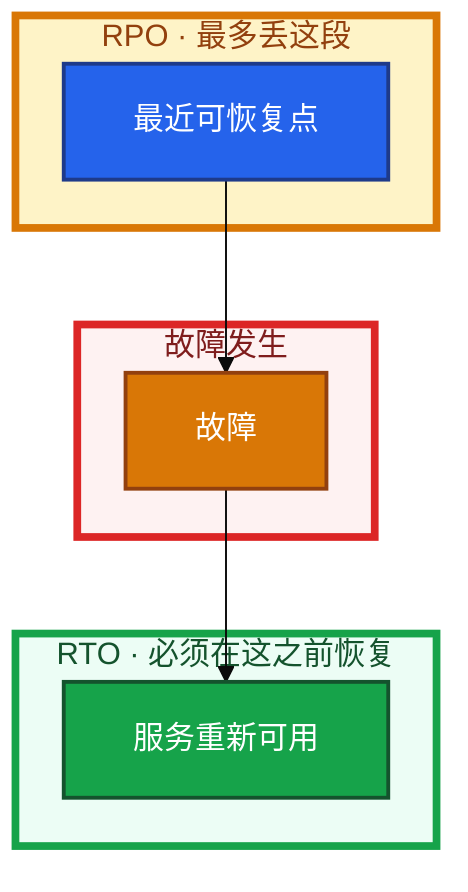
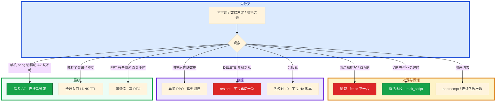

# 高可用与容灾

老板说「登录不能挂」。有人直接画异地双活。机房中间交换机闪断后两台都自称主，一半充值写在 A、一半写在 B。备份任务天天绿，却从没 restore 过。合服当晚还叠了一次强更。

先别动手。这一章后半全是你会动手的：**怎么用 RTO/RPO 选型、主备怎么切、脑裂怎么防、3-2-1 怎么演练、合服和跨区容灾怎么分开。** 前面的概念，是为了让你先问「能挂多久、能丢多少」，再画双活。

**读完你能：** 把 RTO/RPO 换成方案档；分清主备 / 双活 / 两地三中心；奇数 quorum 一口回；健康检查连续失败再切；备份没有演练不算；游戏合服和跨区容灾不混成一件事。

## 本章目录

缩进 = 上下级。3 下面才是 3.1。

想钉在**正文左边**跟着滚：菜单 **查看 → 打开视图 → 大纲**。Markdown 预览做不到独立左栏，目录只能写在文章开头。

- [1. 基本概念](#1-基本概念)
- [2. 架构图](#2-架构图)
- [3. 原理](#3-原理)
  - [3.1 几个 9](#31-几个-9)
  - [3.2 主备 / 双活 / 两地三中心](#32-主备--双活--两地三中心)
  - [3.3 脑裂与奇数](#33-脑裂与奇数)
  - [3.4 健康检查](#34-健康检查查什么何时切)
  - [3.5 游戏合服与跨区容灾](#35-游戏合服与跨区容灾)
- [4. 安装部署](#4-安装部署)
  - [4.1 生产怎么选](#41-生产怎么选)
  - [4.2 组件落法](#42-组件落法)
- [5. 核心配置](#5-核心配置)
- [6. 常用命令](#6-常用命令)
- [7. 常用操作](#7-常用操作)
  - [7.1 主备切换](#71-主备切换)
  - [7.2 备份与 restore](#72-备份与-restore)
  - [7.3 升级](#73-升级)
  - [7.4 回滚](#74-回滚)
  - [7.5 容灾切换 / 合服窗口](#75-容灾切换--合服窗口)
- [8. 生产排障](#8-生产排障)
- [9. 必会 · 常考](#9-必会--常考)
- [合上书](#合上书问自己)

**本章不讲：** LVS NAT/DR/TUN、ipvs → [16 LVS](../16-LVS与四层负载均衡/)；Keepalived 配置、双 VIP、GARP、nopreempt → [24 HAProxy 与 Keepalived](../24-HAProxy与Keepalived/)；云多 AZ、SLB、跨 Region DNS → [07 云平台](../../07-云平台/)；游戏 SLO 细账、活动高峰、回档步骤 → [08 游戏运维](../../08-游戏运维专题/)；etcd quorum 操作 → [04-02 etcd](../../04-Kubernetes/02-etcd/)；MySQL 复制细节 → [03-01 MySQL](../../03-中间件与数据库/01-MySQL/)。

---

## 1. 基本概念

开口先问业务要 **RTO / RPO**，再选热备还是备份。先画双活再问「能丢多久」，一定被成本打脸。

| 指标 | 全称 | 含义 |
|------|------|------|
| **RTO** | Recovery Time Objective | 中断到恢复的**目标上限** |
| **RPO** | Recovery Point Objective | 最多丢多少数据（用时间说） |
| **MTTR** | Mean Time To Repair | **实测**平均修复时间 |
| **MTBF** | Mean Time Between Failures | 平均无故障间隔 |
| 可用性 | MTBF / (MTBF + MTTR) | 几个 9 的来源之一 |

RTO 是承诺，MTTR 是成绩单。MTTR 长期贴着 RTO，说明没有余量，一次复杂故障就会破 SLA。发现、到位、决策、切换、验证都算进 RTO。演练缩短的是 MTTR，不是祈祷少挂。

越低越贵：

| 档 | RTO | RPO | 典型 |
|----|-----|-----|------|
| 热备 / 同步 / 多活 | ≈0 | ≈0 | 成本最高 |
| 温备 / 异步 + 快速切换 | 分钟级 | 秒～分钟 | 常见 |
| 冷备 / 快照 + 人拉起 | 小时级 | 小时级 | 成本低 |

切换解决的是「进程没了」。磁盘写坏、误删、勒索、逻辑错误，只能靠备份。主从一起复制过去的 `DELETE`，切主救不了。

> **记住**：先问能挂多久、能丢多少，再画主备。没有演练过 restore 的备份，RPO 是空话。

---

## 2. 架构图

先把整张图钉住。后面选型、切换、排障都对着这张图说话。

三种生产形态（装的时候选，挂的时候冲突模型不一样）：

主备：同一时刻一份写，切换有缝，冲突少。双活：两边都接写，无切换延迟，冲突和脑裂都更难。两地三中心：同城抗 AZ 级、异地抗城级，异地通常异步，RPO 不是 0。

---

## 3. 原理

原理只保留动手和面试会用到的：9 怎么换算、三种形态差在哪、脑裂靠什么防、探活探什么、游戏合服不是容灾切换。

**本节 5 块：** 3.1 几个 9 · 3.2 三种形态 · 3.3 脑裂 · 3.4 探活 · 3.5 合服与跨区

### 3.1 几个 9

算法：一年 365×24×60 = **525600** 分钟。`525600 × (1-0.9999) ≈ 52.6 分钟`。所以 **99.99% ≈ 年停机 52.6 分钟**。99.9% 大约 8.76 小时，差一个 9，停机预算差一个数量级。

| SLA | 年停机约 | 常放哪 |
|-----|----------|--------|
| 99% | **87.6 小时** | 内部工具 |
| 99.9% | **8.76 小时** | 普通 Web |
| 99.95% | **4.38 小时** | 不少互联网业务 |
| 99.99% | **52.6 分钟** | 核心登录 / 支付 |
| 99.999% | **5.26 分钟** | 金融核心 |

游戏常见整体 **99.95%～99.99%**，登录和支付按 **99.99%** 谈。具体 SLO 怎么拆、error budget 怎么冻发版，在 08 和 04-18。本章会换算、会用 RTO 反推方案即可。

一年只挂一次、修 8 小时，已经远超 52.6 分钟。**故障次数少不能补救修得慢。** 对外 SLA 应松于内部 SLO，留 error budget。对外承诺更严就要更贵的 RTO/RPO。

### 3.2 主备 / 双活 / 两地三中心

**主备（Active-Standby）**：同一时刻一份写。切换靠 VIP / DNS / 客户端重连，有短暂不可用。简单，冲突少，备机常闲着。适合：MySQL 主从、Redis Sentinel、Nginx/HAProxy 双机。游戏有状态逻辑服常常 **单 AZ 一份状态 + 快速拉起**（状态在 DB），不要假装无状态双活。

**双活（Active-Active）**：两边都接写。无切换延迟，利用率高，**冲突和脑裂**都更难。适合无状态 API、DNS 多活、全局入口。**数据库主主默认不要**，冲突解决比切换贵得多。有状态逻辑服强行双活，等于自研分布式一致性。

**两地三中心**：同城两个生产中心（或两 AZ）承担日常，第三中心在异地做灾备。同城可同步（RPO≈0），异地多异步（RPO=复制延迟或备份间隔）。不要把「两地三中心」说成双活——异地那一中心通常 **不接写**，切过去是灾备演练/城级事故，不是日常负载均衡。

| | 主备 | 双活 | 两地三中心 |
|--|------|------|------------|
| 写 | 一份 | 多份 | 同城生产写；异地多为备 |
| 切换 | 秒～分钟 | 无（已在接） | 同城秒～分；异地分～小时 |
| 冲突 | 少 | 同时写同一行就炸 | 异地切回要处理落后 |
| 脑裂 | 仍可能双主 | 更敏感 | 跨城分区更要 quorum/fencing |
| 成本 | 备机浪费 | 利用率高、研发贵 | 最高 |
| 适合 | 有状态默认 | 无状态 | 要抗城级灾难 |

复制方式决定 RPO：同步复制 RPO≈0，延迟和抖动换安全；异步 RPO=复制延迟，切换快但能丢那一截。延迟监控（如 `Seconds_Behind_Master`）是 RPO 是否兑现的证据。

容灾层级：

| 级别 | 典型 | RTO | RPO | 成本 |
|------|------|-----|-----|------|
| 同机房多实例 | 单 AZ 多副本 | 秒 | 0 | 低 |
| 同城多 AZ | 跨 AZ 同步 | 秒～分 | 0（同步时） | 中 |
| 异地灾备 | 异步复制 / 备份 | 分～小时 | 分钟级 | 高 |
| 异地多活 | 多城同时写 | ≈0 | ≈0 | 极高 |

云怎么买多 AZ、专线、DNS 切流，去 07。这里只要会按 RTO/RPO 选层级。

### 3.3 脑裂与奇数

心跳断了，两边都认为对方死了，都接写。网络恢复后两份数据无法自动和解。Keepalived 两台都升主，VIP 各宣告一次——「哪边是真相」就是新的 RPO：不是「丢 5 秒」，是「选一边扔掉另一边」。

| 方法 | 原理 | 谁在用 |
|------|------|--------|
| **Quorum 多数派** | 凑不够多数就不能写 / 不能当主 | etcd、ZK、Raft、MGR |
| **Fencing** | 新主接管前先把旧主隔离（STONITH：断电源/断网） | Pacemaker |
| **VIP 唯一** | 同一二层里 VIP 只应落在一台（仍要防双发 ARP） | Keepalived，细节 24 |
| **仲裁节点** | 奇数成员，避免平票 | MGR、多数分布式 |

**奇数节点**：Quorum = `floor(N/2)+1`。3 台多数是 2，可挂 1 台；2 台多数是 2，挂 1 台就达不成，等于全停。4 台多数是 3，挂 2 台也不够，**和 3 台一样只扛 1 台**，多花一台却没有更抗造。

| N | 可挂 | quorum | 备注 |
|---|------|--------|------|
| 1 | 0 | 1 | 单点 |
| 2 | 0 | 2 | 平票，不要当集群 |
| **3** | **1** | **2** | 生产最常见 |
| 4 | 1 | 3 | 和 3 一样只扛 1 台，浪费 |
| **5** | **2** | **3** | 要扛 2 台再上 |

Keepalived 两台 **没有多数派**。靠优先级 + 心跳；防火墙挡住 VRRP（**IP 协议 112**，不是 UDP 端口 112）就会 **双 VIP**。两节点 VRRP 防不了真正的网络分区，只能尽量别让心跳不通。细节 24。

普通 MySQL 主从 **不防脑裂**。MGR / 带 fencing 的 MHA+VIP 才有说法。etcd 必须奇数，见 04-02。2 节点 etcd/ZK 不能当有 quorum 的集群：挂 1 台就没多数，**可用性还不如 1 台好懂**。

### 3.4 健康检查：查什么、何时切

切换的前提是「判定死了」。探错了会抖，探得太浅会假活。Nginx 进程还在、已经不 accept，Keepalived 只 `killall -0 nginx`，VIP 还钉在这台——玩家打 VIP 全超时，监控却说「主还活着」。

| 层 | 例子 | 假活风险 |
|----|------|----------|
| 进程 | `killall -0 nginx` | 进程在但已经不 accept |
| 端口 | TCP connect | 端口开着业务死了 |
| HTTP | GET /health → 200 | 只返回静态 200，DB 已经挂 |
| 业务 | 真查库 / 真登录 | 最准，最贵 |

原则：

1. `/health` 要碰到关键依赖，不要只 `return 200`。
2. 连续 **N 次失败再切（N=3～5）**，抗抖动。
3. 间隔 **1～5s**；单次超时 **小于** 间隔。
4. 切回更保守：观察一段时间再抢回，避免主备来回打（Keepalived 的 `nopreempt` 在 24）。

VRRP 心跳本身只说明对端 keepalived 还在发报文，**不说明**后面的 HAProxy/Nginx 还活着。所以要 `track_script`。探活太重会把 DB 打满，造成自己制造的故障。

### 3.5 游戏合服与跨区容灾

**合服**是运营动作：两套区服数据合并、玩家进同一世界。不是容灾切换。合服窗口要：**校时门禁**（19，偏差 **>1s 停**）、停写/锁服、备份 + 已演练的 restore 路径、**不要叠不相关强更**。失败回滚靠合服前快照，不是靠「再切一次 VIP」。

**跨区容灾**是故障动作：一个 Region / 机房没了，登录和数据去另一边。和合服的差别：

| | 合服 | 跨区容灾 |
|--|------|----------|
| 触发 | 运营排期 | 城级/Region 故障或演练 |
| 数据 | 两套都要留下并合并 | 以灾备侧可恢复点为准，RPO=复制/备份落后 |
| 战斗服 | 常停服合并 | 有状态房间通常散了，玩家重连 |
| 时钟 | 两边都必须准 | 两边本来就应在同一 NTP 体系 |
| 成功标准 | 名单、邮件、排行正确 | RTO 内登录和支付可用 |

游戏组件不要一套双活打天下：

| 组件 | 跨区常见 |
|------|----------|
| 无状态登录 / 选服 | DNS / 全局入口切到活着的 Region；RTO 可到 **<30s** |
| 玩家 MySQL | 同城同步；跨区异步。切异地接受分钟级 RPO，或声明「以备份为准」 |
| Redis Session | 可丢一点；切过去重新登录往往可接受 |
| 有状态逻辑服 / 房间 | **状态落库 + 拉起**；不要内存双活跨城 |
| 资源 / 包体 | CDN 多源（10），不是 LVS 双活 |

高峰不切主、不合服当晚叠加强更——**变更窗口也是可用性的一部分**。跨区切流要提前演练：连接串有没有绑死 AZ 内网 IP、防火墙是否只放了同 AZ、DNS TTL 用户是否还打进死区（10）。很多「多 AZ」其实是同 AZ 两台。

> **记住**：有状态默认主备；无状态才能双活。两地三中心的异地脚通常是灾备不是日常双写。合服不是容灾。

---

## 4. 安装部署

### 4.1 生产怎么选

| 项 | 选 | 不选 |
|----|----|------|
| 先问 | RTO / RPO 数字 | 先画全球双活 |
| 有状态写 | 主备或状态外置 | DB 主主；房间内存双活 |
| 无状态 | 多副本 + LB | 单机硬扛 99.99% |
| 抗 1 个故障域 | 3 节点 quorum | 2 节点当 Raft；4 节点浪费 |
| 抗城级 | 两地三中心 / 异地备份 | 只靠同机 snapshot |
| 备份 | 3-2-1 + restore 演练 | 本机 cron 绿灯 |
| 变更 | 高峰不切主；合服不叠强更 | 当晚什么都做 |

### 4.2 组件落法

和 08 对齐，不在这里定 SLO 表。设计开口常用：

| 组件 | RTO | RPO | 路子 |
|------|-----|-----|------|
| 登录 | **<30s** | — | 无状态多副本 + LB |
| 玩家 MySQL | **<5min** | **0** | 同步主从 + 自动切 |
| Redis Session | **<30s** | 可丢一点 | Sentinel / 主从 |
| 逻辑服 | **<2min** | **0**（状态在库） | 落库 + 拉起 |

同城 MySQL HA（RPO=0，RTO 两分钟内）：

| 路子 | RTO | RPO |
|------|-----|-----|
| 托管多 AZ | 常 **<30s** | 0 |
| MHA + VIP | **1～2min** | 0～秒（看半同步） |
| MGR | **<30s** | 0，带多数派防脑裂 |

写走主，读可走从。备份打从库。切主不要人肉改 DNS 当唯一手段。主从延迟要监控。云怎么买盘和跨 AZ 网络在 07。

验收：PPT 上的 RTO 必须被演练过的 MTTR 证明。没有摘过 AZ、没有 restore 过，不算部署完成。

---

## 5. 核心配置

本章是口径，不是 keepalived.conf（24）也不是 my.cnf（03-01）。落地时只钉这些旋钮的**影响面**：

| 项 | 生产怎么用 | 改错会怎样 |
|----|------------|------------|
| 探活连续失败 | **3～5** 次 | 1 次就切 → 活动抖动 |
| 探活间隔 | **1～5s**，超时 < 间隔 | 检查重叠；或切得太慢破 RTO |
| `/health` | 碰到库 / 登录依赖 | 静态 200 假活 |
| nopreempt | 主恢复不抢 | 二次闪断 |
| VRRP | IP **112**；心跳独立 | 双 VIP |
| 复制 | RPO=0 用同步 | 异步却承诺不丢 |
| 备份 | 3 份、2 介质、1 异地 | 同盘 snapshot 当 3-2-1 |

**3-2-1：** 至少三份（生产 + 本地备份 + 异地）；两种介质（本地盘和对象存储不是同一种风险）；一份在异地或另一账号（防机房和账号一起没）。同盘 snapshot 不算 3。和主机同账号同地域的桶，火灾和账号被盗一起没。主机层至少：配置（Git / etcd）、`/etc`、crontab、证书；密钥不进明文仓库但要有受控副本。

> **记住**：3-2-1 是份数和地点；没演练过 restore 的备份，RPO 是空话。Keepalived 两台不是 quorum。

---

## 6. 常用命令

HA 总论没有一条万能 CLI，值班按组件取证：

| 目的 | 看什么 |
|------|--------|
| 谁在接写 | VIP 落在哪（`ip addr`）；DB 只读还是可写 |
| 复制落后 | `Seconds_Behind_Master` 等；这就是当前 RPO 证据 |
| 脑裂 | 两台都有 VIP；两边都能写 |
| 探活 | 连续失败计数；`/health` 是否打到库 |
| 备份 | 最近成功时间、异地是否有、上次 restore 记录 |
| 时钟 | 合服/切城前 `chronyc tracking`（19） |
| etcd | `endpoint health`（04-02） |

游戏库回档步骤在 08。etcd snapshot 在 04-02。不要用「备份任务绿灯」代替 `restore` 成功日志。

---

## 7. 常用操作

### 7.1 主备切换

1. 确认旧主真死或已被 fence，避免双写。
2. 切 VIP / 托管 endpoint / 选主。
3. 验证写入和关键读；看复制角色。
4. `nopreempt`：备机稳住就不抢，除非要轮转维护。
5. 记下真实切换时间，对照 RTO。

高峰不切主。演练放低峰或预发。

### 7.2 备份与 restore

至少按 RPO 间隔打；变更、合服、扩容控制面前加打一份。异地留。**季度做一次 restore 演练**，记下真实 RTO（往往比 PPT 大）。只 backup 成功不算。

误 `DROP TABLE`：切主没用，走 restore / 回档（08）。

### 7.3 升级

滚动：先升备 → 切 → 升旧主。etcd / 有 quorum 的组件保多数派（04-02）。数据库大版本：升级前快照，失败不能只靠换二进制（数据目录可能回不去）。活动中、合服当晚不要叠不相关强更。

### 7.4 回滚

切错了：若新主已经写了，回滚 = 一次新的数据决策（哪边是真相），不是按一下撤销。没有升级前快照 = 没有回滚。VIP 抢回会造成第二次闪断。

### 7.5 容灾切换 / 合服窗口

**摘 AZ / 切异地：** 验证跨 AZ 复制是否真同步、DNS/LB 是否还会把流量打进死区、连接串是否绑死 AZ 内网 IP、防火墙是否只放了同 AZ。混沌工程先在预发跑通切换和告警，再生产小剂量。目的是验证 RTO，不是表演勇气。

**合服：** 校时 → 停写 → 备份 → 合并 → 校验名单/邮件/排行 → 失败用合服前快照回滚。不要和容灾切主、内核强更叠在同一晚。

---

## 8. 生产排障

三问：进程还在不在？还能不能变更/写入？已有流量还通不通？和 01、etcd 同一套。控制面挂了 ≠ 立刻踢玩家；双主 ≠ 用重启逻辑服和解。

| 现象 | 先做什么 | 不要做什么 |
|------|----------|------------|
| 双 VIP / 两边写充值 | 立刻下一台、fence、停写 | 让玩家重连试；先改算法 |
| 进程在业务死 | `/health` 打到依赖 | 只 killall -0 |
| 一年挂一次修 8 小时 | 拆 MTTR：发现到验证 | 用 99.99% 口头对冲 |
| 备份绿灯勒索加密 | 异地 restore 演练记录 | 相信同盘 snapshot |
| 合服排行乱 | 时钟门禁、合并顺序 | 当脑裂去抢 VIP |
| 房间双活掉线更惨 | 状态落库 | 跨城内存双写 |
| 2 节点 etcd 省钱 | 上 3 | 当集群卖可用性 |
| 高峰切主失败 | 变更窗口本身破 SLA | 再切一次赌 |

活动高峰：停发版和合服、停切主。先分清是入口（16）、控制面（04-02）、库复制、还是假活探活。不要重启还活着的战斗服「试 HA」。

---

## 9. 必会 · 常考

白板和追问高频，能一口回：

| 说法 | 对错 | 口径 |
|------|:----:|------|
| 先画双活再问能丢多久 | 错 | 先 RTO/RPO |
| RTO 和 MTTR 是一回事 | 错 | RTO 承诺；MTTR 实测 |
| 99.99% 一年大约停 8 小时 | 错 | **52.6 分钟**；8.76 小时是 99.9% |
| 有状态逻辑服内存双活 | 错 | 状态落库 + 拉起 |
| 数据库默认主主 | 错 | 冲突比切换贵 |
| 两地三中心 = 异地双活 | 错 | 异地多为灾备，不日常双写 |
| 4 台比 3 台更能抗 2 台故障 | 错 | 4 台容错仍是 1 |
| Keepalived 两台算 quorum | 错 | 优先级 + 心跳；IP 112 |
| `/health` return 200 够了 | 错 | 要碰到关键依赖 |
| 失败一次就切更灵敏 | 错 | 连续 3～5 次 |
| VIP 漂移完全无感 | 错 | 存量会断（16/24） |
| 备份任务绿 = 有 RPO | 错 | 必须 restore 演练 |
| 合服就是容灾切换 | 错 | 运营合并 vs 故障切城 |
| 高峰切主缩短窗口 | 错 | 变更窗口也是可用性 |
| 2 节点 etcd 能上生产 | 错 | 挂 1 台没多数 |

数字：525600 分钟/年；99% **87.6h**、99.9% **8.76h**、99.95% **4.38h**、99.99% **52.6min**、99.999% **5.26min**；游戏整体 **99.95%～99.99%**，登录支付 **99.99%**；登录 RTO **<30s**；玩家 MySQL **<5min / RPO 0**；Redis Session **<30s** 可丢一点；逻辑服 **<2min** 状态在库；托管多 AZ 常 **<30s**；MHA **1～2min**；MGR **<30s**；探活 N=**3～5**、间隔 **1～5s**；合服校时 **>1s 停**；quorum 3→2、5→3。

易混：RTO vs MTTR vs RPO；主备 vs 双活 vs 两地三中心；同步 vs 异步；quorum vs VRRP；合服 vs 跨区容灾；切主 vs restore；假活探活 vs 真死；同城多 AZ vs 假两台同 AZ。

---

## 合上书，问自己

1. RTO/RPO/MTTR 各是什么？99.99% 一年允许多少停机？
2. 有状态为什么默认主备？双活给谁？两地三中心异地那只脚干什么？
3. 脑裂是什么？3 和 4 和 5 怎么选？Keepalived 两台算不算 quorum？
4. 探活为什么连续 3～5 次？`/health` 只 200 为什么不够？
5. 3-2-1 是什么？只备份不 restore 行不行？
6. 合服和跨区容灾差在哪？高峰能切主、能叠强更吗？

六题都能口述，这一章就过了。入口怎么转在 16，门怎么关在 17，旋钮在 18，对表在 19——可用性是把它们焊成今晚能走的步骤。
