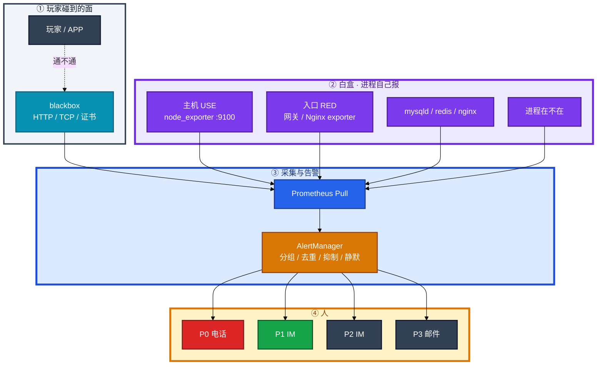
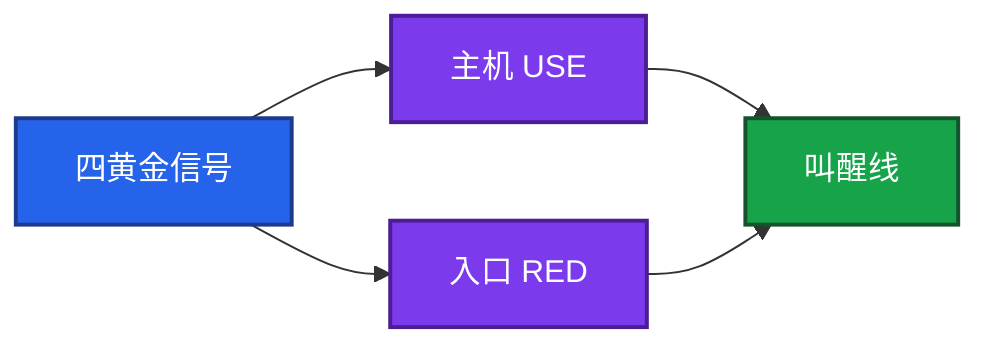
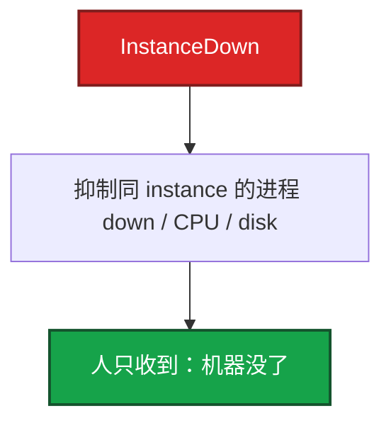
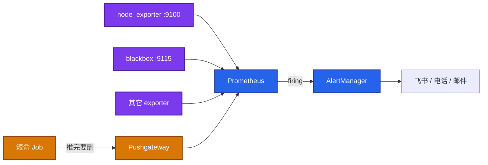
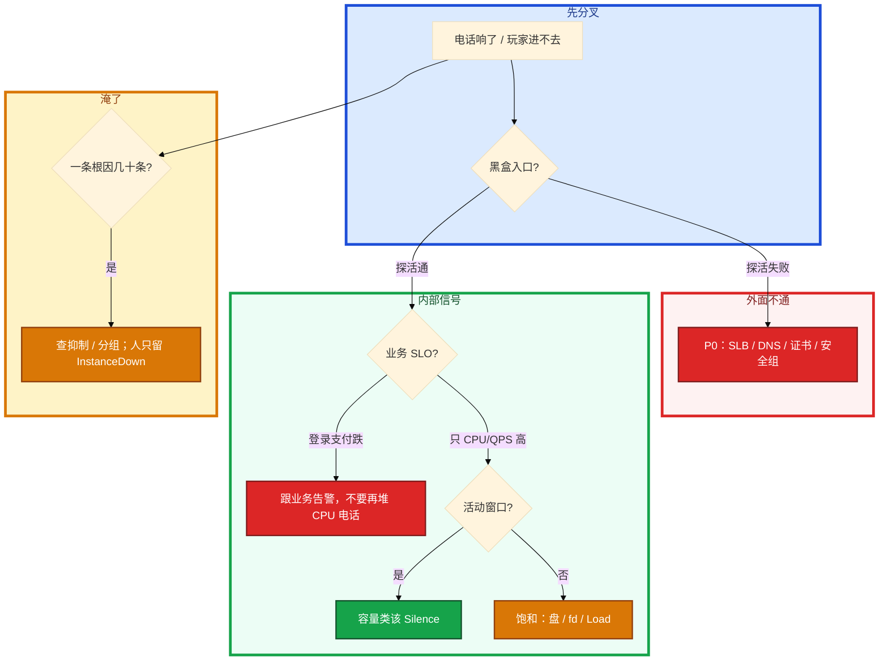

# 监控与告警


活动开场 3 分钟，电话被 CPU、连接数、QPS 打爆。登录入口其实已经 5xx，黑盒探活夹在四十条「机器黄了」里没人点。群里有人要重启大厅，另有人说 Grafana 全绿不用管。

先别动手。这一章后半全是你会动手的：**怎么分级、怎么抑制、怎么静默活动容量告警、证书和盘将满怎么提前叫。** 前面的黄金信号和采集原理，是为了让你动手时不拿 CPU 70% 冒充故障。

**读完你能：** 白板上画出白盒 / 黑盒 / AlertManager；半夜能判断该不该叫醒；会配 `for`、抑制、活动窗口 Silence；会用预测盘满和证书倒计时，而不是等玩家报。

## 本章目录

缩进 = 上下级。3 下面才是 3.1。

想钉在**正文左边**跟着滚：菜单 **查看 → 打开视图 → 大纲**。Markdown 预览做不到独立左栏，目录只能写在文章开头。

- [1. 基本概念](#1-基本概念)
- [2. 架构图](#2-架构图)
- [3. 原理](#3-原理)
  - [3.1 黄金信号](#31-黄金信号四信号--use--red)
  - [3.2 采集](#32-采集pull-类型-rate)
  - [3.3 分级与降噪](#33-分级与降噪)
- [4. 安装部署](#4-安装部署)
- [5. 核心配置](#5-核心配置)
- [6. 常用命令](#6-常用命令)
- [7. 常用操作](#7-常用操作)
  - [7.1 静默与 Annotation](#71-静默与-annotation)
  - [7.2 活动窗口](#72-活动窗口游戏高峰红线)
  - [7.3 规则治理](#73-规则治理)
- [8. 生产排障](#8-生产排障)
- [9. 必会 · 常考](#9-必会--常考)
- [合上书](#合上书问自己)

**本章不讲：** PromQL 向量匹配、`histogram_quantile`、高基数治理 → [04-18 监控可观测性](../../04-Kubernetes/18-监控可观测性/)；kube-prometheus、ServiceMonitor、cAdvisor → 同 04-18；游戏 SLO 窗口、HPA/发布闸门 → [08](../../08-游戏运维专题/)；日志告警、盘满止血 → [22 日志运维](../22-日志运维/)；Oncall 排班、事故复盘 → [05-06](../../05-工程化与自动化/06-运维平台与Oncall/)；云监控产品 → [07](../../07-云平台/)。

---

## 1. 基本概念

基础运维的监控不是「会写 `rate()`」。是 **主机还能否服务、告警能不能当人看、漏报会不会死人**。K8s 那套 Prometheus Operator 不要在这章复述。

三支柱只记分工：

| 支柱 | 回答什么 | 本章 |
|------|----------|------|
| **Metrics** | 现在怎样、趋势怎样 | 主战场 |
| **Logs** | 发生过什么 | 22 |
| **Traces** | 这一次请求走了哪 | 应用侧，不在这章 |

叫醒线对齐 **玩家能不能玩、数据会不会丢、会不会很快不可恢复**，不是对齐「数字看起来不圆」。

| 该半夜叫醒 | 不该叫醒 |
|------------|----------|
| 探活失败（入口 / 登录 / 支付） | 单机 CPU 70%，登录/支付曲线正常 |
| 登录跌、支付失败 | 已被 InstanceDown 抑制的进程/CPU/disk |
| 磁盘 **predict 24h 内打满** | 磁盘 60%、inode 还早 |
| OOM **风暴**（不是一次单进程） | 已知维护窗口（该静默却没静默是流程问题） |
| 证书 **7 天内**过期（白天没处理就升级） | 活动预期内的容量类 P2（该 Silence 却没 Silence） |

从库延迟 200ms 算不算叫：看是不是同步要求 RPO=0、玩家读是否打到从。有 SLO 跟 SLO，没有就不要发明 P0。

> **记住**：内部绿、外面不通，缺的是黑盒，不是再加一条 CPU 规则。所有人电话 = 没有人接。分级和抑制是监控的一部分。

---

## 2. 架构图

先把整张图钉住。后面安装、命令、排障都对着这张图说话。



图上三条线：

1. **没有黑盒箭头，内部全绿也可以入口挂。** SLB 配错、证书过期、安全组挡了、DNS 挂了，`node_exporter` 不知道。
2. **Prometheus Pull**：Server 去 scrape `/metrics`。排障就是 `curl` 那张页。目标必须被 Server 访问到。
3. **AlertManager 才对人**：规则 firing 之后还要分组、去重、抑制、静默，再按 P0～P3 路由。

面板：第一行入口 **RED**，第二行机器 **USE**，发布打 **Annotation**。`node_exporter` 是主机标配。

分层仍然要有：机器 node_exporter、中间件各自 exporter、应用 `/metrics`、业务 CCU、端侧 APM。缺一层就会「机器绿、玩家进不去」。

Zabbix 等是 **Push**：Agent 上报，防火墙友好，服务发现弱一些。不是谁淘汰谁：云原生主机常用 Prom；老机房大量 Zabbix 仍在。

短命 Job 来不及拉 → **Pushgateway**（推完要自己删，指标不会过期）。全部改 Push 能做，但失去「目标活着才能被拉到」这份探活。

VictoriaMetrics：更省存储、可集群、兼容 Prom API，规模大了常见。中小集群 Prometheus 够用。选型一句话即可。

Grafana：Dashboard / Panel / Variable 切实例。告警主路径仍建议 Prometheus 规则 + AlertManager，和主机指标同一套。曲线用 P99 看毛刺，平均值会撒谎。领导看板可以糙；值班必须能从告警跳回这条时序。

监控自己也要被盯：`up == 0`（scrape 失败），以及一条 **Watchdog / Deadman's Snitch**（规则引擎挂了要另通道叫人）。否则全员虚假绿色。

---

## 3. 原理

原理只保留动手和面试会用到的：看什么、怎么采、怎么叫到人而不淹死人。

**本节 3 块：** 3.1 黄金信号 · 3.2 采集 · 3.3 分级与降噪

### 3.1 黄金信号：四信号 + USE + RED

Google SRE 四信号（Golden Signals）看 **服务**：

| 信号 | 问什么 | 主机/入口上对应 |
|------|--------|-----------------|
| **Latency** | 多慢 | 入口 P99；不要用平均值当 SLA |
| **Traffic** | 多忙 | QPS、CCU、网关连接数 |
| **Errors** | 多错 | 5xx、登录失败、探活失败、网卡 drop |
| **Saturation** | 多满 | CPU/Load、内存 available、磁盘%/inode/fd、队列 |

主机层对上 USE：Utilization 使用率、Saturation 饱和（排队/打满）、Errors 错误。入口层对上 RED：Rate、Errors、Duration。



| 层级 | 必看 | 典型告警 |
|------|------|----------|
| 探活 | 进程在、blackbox HTTP/TCP | 连续失败 **P0** |
| 饱和 | CPU、Load vs 核数、磁盘%、inode、fd | 预测满盘 P1，打满 P0 |
| 错误 | 网卡 drop/error、OOM、磁盘 IO error | P1 |
| 业务 | 登录成功率、网关 5xx、CCU | 按 SLO，细则 08 |

Load 和 CPU% 不是一回事（03）。磁盘 60% 不叫人；**predict 24h 内打满** 要叫。inode 满、fd 打满，`df -h` 还很空，一样能把游戏日志和 Nginx 写挂（14、18）。内存看 **MemAvailable**，不要只看 Free（cache 会把 Free 吃光，其实还能用）。

主机 CPU **不能当玩家体验 SLO**。它是饱和信号，最多当 P2 容量。叫醒线应对齐 SLI（登录成功率），不要对齐 CPU。

| 词 | 意思 |
|----|------|
| SLI | 测什么（成功率、P99） |
| SLO | 内部目标 |
| SLA | 对外承诺，破了可能赔 |
| Error Budget | 1−SLO，例如 99.9% → 月约 **43.2 分钟** |

预算够可以发版；快没了冻非紧急变更。怎么算窗口、怎么和 HPA/发布闸门结合，**去 04-18 和 08**。本章会用：叫醒线对齐 SLO。

### 3.2 采集：Pull、类型、rate

数据长这样：`metric{label="v"} value`。四种类型记用途：

| 类型 | 行为 | 用途 |
|------|------|------|
| **Counter** | 只增 | 请求总数；阈值必须 `rate()` / `increase()` |
| **Gauge** | 可上可下 | 内存、在线人数 |
| **Histogram** | 分桶 | 延迟分布，**能跨实例聚合**；生产延迟用这个 |
| **Summary** | 客户端分位数 | 难聚合；P99 跨实例加不起来 |

Counter 是开机以来累计。`http_requests_total > 100000000` 会永远 firing。重启归零时 `rate()` 也能接上。应用错误率、P99 桶聚合放到 04-18，这里不要展开成 PromQL 专题。

主机常用（会读、会改阈值即可）：

```promql
# CPU（节点）：非 idle 占比，不是 Load
1 - avg(rate(node_cpu_seconds_total{mode="idle"}[5m])) by (instance)

# 内存：看 available
1 - node_memory_MemAvailable_bytes / node_memory_MemTotal_bytes

# 磁盘使用率
1 - node_filesystem_avail_bytes / node_filesystem_size_bytes

# 24h 内将满
predict_linear(node_filesystem_avail_bytes[6h], 24*3600) < 0

# 证书剩余
probe_ssl_earliest_cert_expiry - time() < 7 * 24 * 3600
```

静态磁盘 70% 在大盘上会永远黄，造成疲劳。活动服更该用 **斜率**。6h 窗口太短会把活动脉冲当满盘；太长则突发打满来不及。可 6h 预测 24h，再加一条 **1h 预测 2h** 的紧急线。已经 95%+ 或 inode 满 → P0。日志盘满的止血在 22，监控负责提前叫。

### 3.3 分级与降噪

| 级 | 含义 | 响应 | 通知 |
|----|------|------|------|
| **P0** | 不可用、丢数据风险 | **5 分钟** | 电话 + IM |
| **P1** | 明显损伤、部分不可用 | **15 分钟** | IM + 邮件 |
| **P2** | 水位高、还没伤玩家 | **1 小时** | IM |
| **P3** | 巡检、优化 | 工作时间 | 邮件 |

同一件事不要既 P0 又 P2。CPU 70% 是 P3 或不上报；登录成功率破 SLO 是 P0/P1。CPU 85% 持续 5 分钟：有 `for: 5m` 的 warning 可以 IM；没有业务损伤仍不必电话。登录已经跌了就走业务告警，不要两条都打电话。

`for:` 是防抖：CPU 冲一下 5 秒不要打电话。磁盘将满可以 `for: 10m` 再 P1。`for` 不是把规则写松。

根因一台机器挂了，上面 40 个进程的探活、磁盘、CPU 一起炸。人会关通知，然后真正的支付失败被淹没。正确体验：**人只收到「机器没了」**，子告警被抑制。

AlertManager 五件套：

| 能力 | 干什么 |
|------|--------|
| 路由 | 按 label 发给不同人 |
| 去重 | 同一告警不刷屏 |
| 分组 | 同类合并成一封 |
| 静默 | 维护窗口、活动容量类 |
| **抑制 Inhibition** | 父告警在，子告警不发 |



治理四步：**分组 → `for` 防抖 → 分级路由（不是所有人电话）→ 每月砍从未处理的规则。** 告警疲劳 = 没人信告警，等于没有监控。

漏报另一头：没有黑盒、没有心跳、阈值太宽。覆盖率要 review：登录、支付、证书、磁盘预测、OOM，缺一补一。疲劳和漏报要一起治，只删规则会漏。

长期 Silence 等于删除规则。日历 + 工单到期自动解除。

> **记住**：风暴靠抑制和分组；P0 才打电话。白盒看里面，黑盒看玩家能不能碰到。

---

## 4. 安装部署

主机版，不是 K8s 版。进程在不算数，必须 `curl` 通 `/metrics`，规则能 firing 到人。

| 组件 | 端口 / 路径 | 生产怎么放 |
|------|-------------|------------|
| node_exporter | **:9100**/metrics | 每台机器；systemd；监控网可达 |
| blackbox_exporter | **:9115**/probe | 从「用户能碰到的地方」探，不要只探内网回环 |
| 中间件 exporter | mysqld / redis / kafka / nginx / process_exporter | 主机章要求 **node + blackbox 必会**，其余知道去哪找 |
| Prometheus | scrape + 规则 | 能访问全部 target；保留按盘算 |
| AlertManager | 通知 | 与 Prom 同故障域要有备份；电话网关单独测 |
| Pushgateway | 仅短任务 | CI / 一次性 Job；用完删除 |



验收：

1. `curl -s localhost:9100/metrics | head` 有 `node_` 前缀。
2. Prometheus targets 全 UP；`up{job="node"} == 0` 本身有告警。
3. 对登录 / 支付 URL 做一次 blackbox，故意断安全组能 P0。
4. 打一条测试 firing，电话/IM 真的响，不是只写了 receiver。
5. Watchdog 规则在；Prom 停掉要能从外层（另一套 blackbox 或云监控）叫到人。

防火墙：Prom 拉目标，目标入站要开；Zabbix 场景才是 Agent 出站。不要两套都半开。

---

## 5. 核心配置

只动有证据的项。改完 `promtool check rules`，再 reload。

```yaml
- alert: HighCPUUsage
  expr: 1 - avg(rate(node_cpu_seconds_total{mode="idle"}[5m])) by (instance) > 0.85
  for: 5m
  labels:
    severity: warning
- alert: DiskWillFull
  expr: predict_linear(node_filesystem_avail_bytes[6h], 24*3600) < 0
  for: 10m
  labels:
    severity: critical
```

blackbox：job 的 target 是 URL，relabel 打到 exporter。探的是 **玩家点的那个 URL**，不要只探 `/health` 若 health 没走到登录依赖（20）。

```yaml
- job_name: http_probe
  metrics_path: /probe
  params:
    module: [http_2xx]
  static_configs:
    - targets:
        - https://game-api.example.com/health
  relabel_configs:
    - source_labels: [__address__]
      target_label: __param_target
    - target_label: __address__
      replacement: blackbox-exporter:9115
```

| 参数 | 生产怎么用 | 改错会怎样 |
|------|------------|------------|
| scrape_interval | 主机 15s～30s | 过短打爆 exporter；过长活动脉冲看不见 |
| `for` | CPU 5m；盘将满 10m；探活可 1～2m | 过短风暴；过长入口挂了还不叫 |
| severity | 一事一级 | 同一登录失败既 P0 又 P2 |
| inhibit_rules | InstanceDown 抑制同 instance 子告警 | 没有抑制 = 故障越大噪音越大 |
| Silence | 维护 / 活动容量类 P2；**到期必须解除** | 忘了开 = 全员 P0；忘了关 = 等于删规则 |
| 证书阈值 | **7 天 P1**，更短升级 P0 | 等浏览器 expired |

> **记住**：证书用 expiry 倒计时。7 天白天必须处理。Pushgateway 上的序列不会自动过期，Job 结束要删，否则 Grafana 永远显示最后一次成功。

---

## 6. 常用命令

值班先跑这几条：Grafana 对上实例 → 规则是否 firing → AM 是否被抑制/静默 → 目标 `up`。

```bash
curl -s localhost:9100/metrics | grep -E '^node_(cpu|memory|filesystem)'
curl -s 'http://blackbox:9115/probe?target=https://game-api.example.com/health&module=http_2xx'
promtool check rules /etc/prometheus/rules.yml
amtool alert query
amtool silence query
```

| 目的 | 命令 / 指标 | 看什么 |
|------|-------------|--------|
| 采到没有 | `curl :9100/metrics` | 通、有 `node_` |
| 探活 | blackbox `/probe` | `probe_success`、证书剩余 |
| 规则语法 | `promtool check rules` | reload 前 |
| 正在响 | AM UI / `amtool alert` | 是否被 inhibit / silenced |
| scrape 死 | `up == 0` | node_exporter 自己挂了 |
| 盘将满 | `predict_linear(...) < 0` | 斜率，不是静态 70% |

指标阈值（主机）：

| 指标 | 阈值 | 级别 |
|------|------|------|
| blackbox 连续失败（登录/支付/入口） | 失败 | **P0** |
| 登录 / 支付破 SLO | 按 08 | **P0/P1** |
| WAL/盘将满 predict 24h | `< 0` | P1；95%+ / inode 满 = P0 |
| 证书剩余 | **< 7 天** | P1；更短 P0 |
| OOM 风暴 | 多进程 | P1 |
| `up == 0` | scrape 失败 | 按该 job 关键度 |

---

## 7. 常用操作

### 7.1 静默与 Annotation

维护窗口：AM Silence，匹配 instance / alertname，写原因和到期。发布必须打 Grafana Annotation，否则每次发版都有人猜「是不是发布导致的」。

图和告警最好同源：同一 PromQL，避免「图上已经红了脚本还没跑」。Grafana 也能告警，主机环境更常见 Prom rule + AlertManager（静默、抑制、值班路由一套）。

### 7.2 活动窗口：游戏高峰红线

静态阈值按日常定，活动必炸。正确处理不是关掉监控，是关掉「我们知道会高」的那些，留下「不该坏」的那些。

| 活动中 | 做 | 不做 |
|--------|----|------|
| 容量类 P2（CPU、连接数、QPS 绝对值） | **Silence** 或动态/环比阈值（04-18） | 全员电话 |
| 登录成功率、支付、网关 5xx、blackbox | **不静默** | 用「活动期间忙」当借口 |
| 盘将满、inode、证书、OOM 风暴 | 照叫 | 当成容量噪声 |
| 发布 / 活动开关 | Annotation | 事后靠回忆 |

红线一口回：探活、登录、支付、盘、证书、OOM。CPU 和 CCU 涨是预期负载，除非伴随错误率和延迟一起破 SLO。

### 7.3 规则治理

每月砍从未处理、从未行动的规则。覆盖率 review：登录、支付、证书、磁盘预测、OOM、Watchdog。缺一层补一层，不要只堆 CPU。

---

## 8. 生产排障

和别处同一套三问：玩家还能不能进？告警是不是一个人能看完？漏的是不是入口？



现场顺序：

```bash
# 入口通不通（黑盒 / curl 公网 URL）
# Grafana：RED 第一行，USE 第二行，有没有 Annotation
# AM：这条是 firing 还是 silenced / inhibited
# up == 0？node_exporter 自己死了？
df -h && df -i
```

| 现象 | 先做什么 | 不要做什么 |
|------|----------|------------|
| 机器全绿，玩家进不去 | blackbox；SLB/DNS/证书/安全组 | 再加一条 CPU 规则 |
| 一台 hang，四十条 IM | 抑制 InstanceDown；人只看机器 | 关通知 |
| 活动开场全员 P0 | Silence 容量类；SLO 不静默 | 关掉整个监控 |
| 磁盘告了两周没人理 | 改 predict_linear；95% 升级 P0 | 继续静态 70% |
| 图上红了脚本还没叫 | 告警与图同源 | 两套阈值各说各的 |
| Prom 自己挂了全绿 | Watchdog / 外层探活 | 相信「没有告警就是好」 |

活动高峰 etcd 和日志同盘、CPU 打满，正确处理：确认入口探活和登录 SLO → 停止把容量告警当 P0 → 救盘 / 入口 / 支付 → 不要为了「做点什么」重启还活着的战斗服。

---

## 9. 必会 · 常考

白板和追问高频，能一口回：

| 说法 | 对错 | 口径 |
|------|:----:|------|
| CPU 70% 该半夜打电话 | 错 | 对齐入口和 SLO |
| 内部指标绿就等于玩家能进 | 错 | 要黑盒 |
| 所有人电话更保险 | 错 | 等于没人接 |
| Counter 可以直接比阈值 | 错 | 必须 `rate()` |
| 内存看 MemFree 就行 | 错 | 看 MemAvailable |
| 磁盘 70% 静态告警最稳 | 错 | 疲劳；用 predict |
| `for` 是把规则写松 | 错 | 防抖 |
| 一台挂了报 40 条才叫全面 | 错 | 要抑制 |
| Histogram / Summary 看 P99 一样 | 错 | 跨实例用 Histogram |
| 主机 CPU 能当玩家 SLO | 错 | 饱和信号，最多 P2 |
| 活动高峰该关掉监控 | 错 | 只静默容量类 |
| Pushgateway 推完不用管 | 错 | 序列不过期，要删 |
| node_exporter 挂了业务告警会顶上 | 错 | 要 `up == 0` |
| 证书等玩家报 expired | 错 | 7 天 P1 |
| Grafana 好看、告警用 SSH 扫盘 | 错 | 图和告警最好同源 |
| 探 `/health` 200 就等于登录通 | 错 | 要探玩家点的 URL |
| 托管云监控这章能跳过 | 错 | 叫醒线、抑制、活动红线仍是你的 |

数字：P0 **5 分钟** / P1 **15 分钟** / P2 **1 小时**；证书 **7 天**；盘预测 **6h → 24h**（可加 1h → 2h）；Error Budget 99.9% ≈ 月 **43.2 分钟**；node **:9100**、blackbox **:9115**。

易混：USE vs RED vs 四黄金信号；白盒 vs 黑盒；Pull vs Push vs Pushgateway；抑制 vs 静默 vs 去重；P0 业务 vs P2 容量；`for` vs 把阈值放宽；scrape `up` vs 业务探活。

---

## 合上书，问自己

1. 四黄金信号是哪四个？主机 USE、入口 RED 各看什么？
2. 哪些该半夜叫醒？CPU 70%、磁盘 60% 呢？
3. Pull / Push / Pushgateway 各用在哪？`curl` 不通算采到了吗？
4. AlertManager 分组、抑制、静默、`for` 各防什么？一台挂了人该看到几条？
5. blackbox 补哪块盲区？证书用哪条指标？
6. 活动高峰哪些 Silence、哪些死也不静默？监控自己挂了谁叫人？

六题都能口述，这一章就过了。下一章先让机器别被自己的日志写死：journal、rotate、采集。
