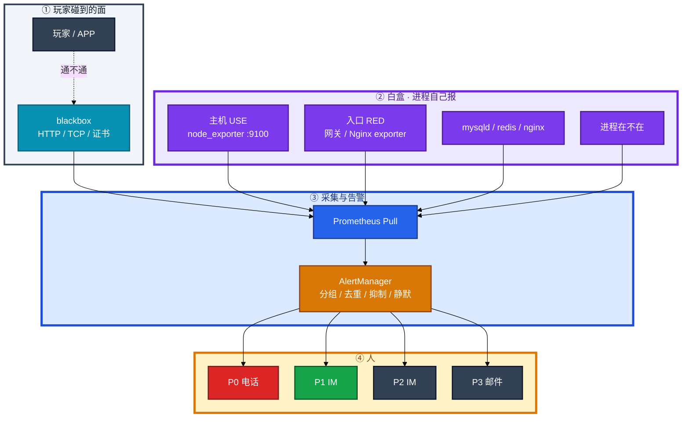
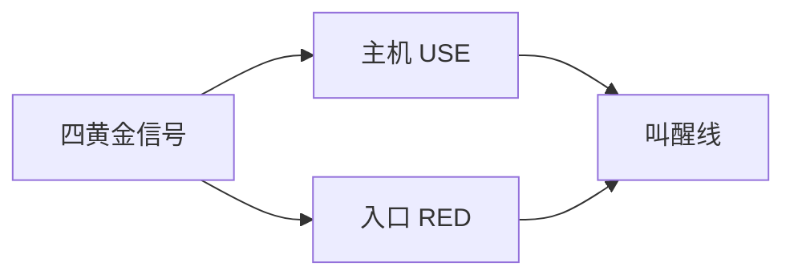
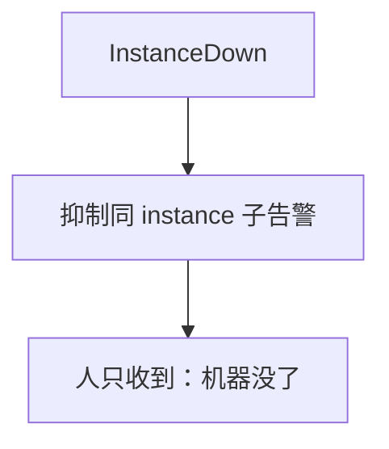
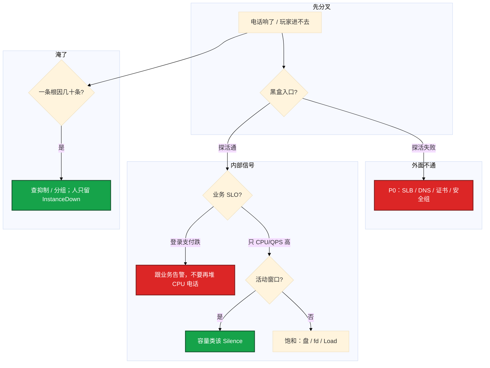

# 监控与告警


活动开场 3 分钟，电话被 CPU、连接数、QPS 打爆。登录入口其实已经 5xx，黑盒探活夹在四十条「机器黄了」里没人点。群里有人要重启大厅，另有人说 Grafana 全绿不用管——内部全绿、外面不通，缺的是黑盒，不是再加一条 CPU 规则。

**本章主线（排障就按这三步想）：**

1. **黑盒 + 白盒**：没有 blackbox，内部全绿也能入口挂。
2. **抑制风暴**：InstanceDown 抑制同 instance 子告警。
3. **活动 Silence 容量类**，SLO/探活/盘/证书不静默。

**读完你能：** 白板上画出白盒 / 黑盒 / AlertManager；半夜能判断该不该叫醒；会配 `for`、抑制、活动窗口 Silence；会用预测盘满和证书倒计时，而不是等玩家报。

## 本章目录

- [1. 基本概念](#1-基本概念)
- [2. 架构图](#2-架构图)
- [3. 原理](#3-原理)
  - [3.1 黄金信号](#31-黄金信号四信号--use--red)
  - [3.2 采集](#32-采集pull-类型-rate)
  - [3.3 分级与降噪](#33-分级与降噪)
- [4. 落地](#4-落地)
- [5. 核心配置](#5-核心配置)
- [6. 命令与操作](#6-命令与操作)
- [7. 生产排障](#7-生产排障)
- [8. 必会 · 常考](#8-必会--常考)
- [合上书](#合上书问自己)

**本章不讲：** PromQL 向量匹配、`histogram_quantile`、高基数治理 → [04-18 监控可观测性](../../04-Kubernetes/18-监控可观测性/)；kube-prometheus、ServiceMonitor、cAdvisor → 同 04-18；游戏 SLO 窗口、HPA/发布闸门 → [08](../../08-游戏运维专题/)；日志告警、盘满止血 → [22 日志运维](../22-日志运维/)；Oncall 排班、事故复盘 → [05-06](../../05-工程化与自动化/06-运维平台与Oncall/)；云监控产品 → [07](../../07-云平台/)。

---

## 1. 基本概念

监控不是「会写 `rate()`」。是 **主机还能否服务、告警能不能当人看、漏报会不会死人**。叫醒线对齐 **玩家能不能玩、数据会不会丢、会不会很快不可恢复**，不是对齐「CPU 看起来不圆」。

**值班里怎么认现象**（先听电话/群消息，再对表）：

| 群里说的 | 技术含义 | 你的第一刀 |
|----------|----------|------------|
| 「四十条 CPU 告警」 | 抑制没配 / 一台挂了 | InstanceDown 抑制子告警 |
| 「Grafana 全绿玩家进不去」 | 缺黑盒 | blackbox / 公网 URL |
| 「活动开场电话炸了」 | 容量类该 Silence | SLO/探活不静默 |
| 「磁盘黄了两周」 | 静态阈值疲劳 | predict_linear |
| 「证书昨天才过期」 | 没倒计时告警 | probe_ssl 7 天 |

三支柱分工：

| 支柱 | 回答什么 | 本章 |
|------|----------|------|
| **Metrics** | 现在怎样、趋势怎样 | 主战场 |
| **Logs** | 发生过什么 | 22 |
| **Traces** | 这一次请求走了哪 | 应用侧，不在这章 |

| 该半夜叫醒 | 不该叫醒 |
|------------|----------|
| 探活失败（入口 / 登录 / 支付） | 单机 CPU 70%，登录/支付曲线正常 |
| 登录跌、支付失败 | 已被 InstanceDown 抑制的进程/CPU/disk |
| 磁盘 **predict 24h 内打满** | 磁盘 60%、inode 还早 |
| OOM **风暴**（不是一次单进程） | 已知维护窗口（该静默却没静默是流程问题） |
| 证书 **7 天内**过期 | 活动预期内的容量类 P2（该 Silence 却没 Silence） |

**打个比方**：白盒像看发动机转速表；黑盒像站在路边看车能不能开动——转速正常，轮胎掉了你也看不见。

> **记住**：内部绿、外面不通，缺黑盒。所有人电话 = 没有人接。分级和抑制是监控的一部分。

**面试怎么说**：「我先看 blackbox 和登录 SLO，CPU 70% 不对齐玩家体验；一台挂了人只该收到 InstanceDown。」

---

## 2. 架构图

后面黄金信号、采集、告警风暴都对着这张图。



**读图三句话：**

1. **没有黑盒箭头，内部全绿也可以入口挂**——SLB 配错、证书过期、安全组挡了、DNS 挂了，`node_exporter` 不知道。
2. **Prometheus Pull**：Server 去 scrape `/metrics`；排障就是 `curl` 那张页；目标必须被 Server 访问到。
3. **AlertManager 才对人**：规则 firing 之后还要分组、去重、抑制、静默，再按 P0～P3 路由。

面板：第一行入口 **RED**，第二行机器 **USE**，发布打 **Annotation**。`node_exporter` 是主机标配。监控自己也要被盯：`up == 0` + **Watchdog**（规则引擎挂了要另通道叫人）。

Zabbix 等是 **Push**：Agent 上报，防火墙友好，服务发现弱。不是谁淘汰谁：云原生常用 Prom；老机房 Zabbix 仍在。短命 Job → **Pushgateway**（推完要删）。VictoriaMetrics：更省存储、兼容 Prom API，规模大了常见。

---

## 3. 原理

### 3.1 黄金信号：四信号 + USE + RED

**一句话：** 叫醒线对齐 SLI/SLO，不是 CPU 70%。

**打个比方**：四黄金信号像看病——Latency 是「多难受」、Traffic 是「门诊多忙」、Errors 是「化验异常」、Saturation 是「床位满没满」。主机 USE、入口 RED 是把这四样落到具体仪表盘上。

**现场走一遍**（活动开场，电话响了，你先开 Grafana）：

1. **第一行 RED**（入口）：QPS、5xx 率、P99 延迟——登录/支付 URL 对应的网关面板。
2. **第二行 USE**（机器）：CPU、Load vs 核数、MemAvailable、磁盘%、inode、fd。
3. 看有没有 **Annotation**（是不是刚发版）。
4. 若 RED 正常、只有 USE 黄 → 容量类，活动窗口可能该 Silence。
5. 若 RED 5xx 飙、USE 也满 → 先救入口/SLO，不要先重启战斗服。

Google SRE 四信号：

| 信号 | 问什么 | 主机/入口上对应 |
|------|--------|-----------------|
| **Latency** | 多慢 | 入口 P99；不要用平均值当 SLA |
| **Traffic** | 多忙 | QPS、CCU、网关连接数 |
| **Errors** | 多错 | 5xx、登录失败、探活失败、网卡 drop |
| **Saturation** | 多满 | CPU/Load、MemAvailable、磁盘%/inode/fd |



| 层级 | 必看 | 典型告警 |
|------|------|----------|
| 探活 | blackbox HTTP/TCP | 连续失败 **P0** |
| 饱和 | CPU、Load、磁盘%、inode | predict 满盘 P1，打满 P0 |
| 错误 | 网卡 drop、OOM、IO error | P1 |
| 业务 | 登录成功率、网关 5xx | 按 SLO（08） |

**输出解读**（Grafana 截图口述）：

```text
登录 P99: 120ms → 正常
网关 5xx rate: 12% → P0，跟 CPU 无关
node_cpu: 72% → 饱和 P2/P3，不对齐玩家 SLO
MemAvailable / MemTotal: 18% → 还可；勿只看 MemFree（cache 会把 Free 吃光）
```

Load 和 CPU% 不是一回事（03）。磁盘 60% 不叫人；**predict 24h 内打满** 要叫。inode 满、fd 打满，`df -h` 还很空，一样能把日志和 Nginx 写挂（14、22）。

| 词 | 意思 |
|----|------|
| SLI | 测什么（成功率、P99） |
| SLO | 内部目标 |
| SLA | 对外承诺 |
| Error Budget | 1−SLO，99.9% → 月约 **43.2 分钟** |

**面试怎么说**：「主机 CPU 是饱和信号，最多 P2；叫醒线对齐登录 SLI。面板第一行 RED，第二行 USE。」

> **记住**：平均值会撒谎，延迟看 P99。主机 CPU 不能当玩家体验 SLO。

### 3.2 采集：Pull、类型、rate

**一句话：** Counter 必须 `rate()`；磁盘用 `predict_linear` 斜率告警。

**打个比方**：Counter 像水表累计读数——你不能说「读数大于 1 亿就漏水」，要看**每小时流了多少**（rate）。Gauge 像油箱指针，可直接比阈值。

**现场走一遍**（规则一直 firing，或盘 70% 永远黄）：

1. 在 Prometheus 或跳板机查表达式：

```promql
# CPU（节点）
1 - avg(rate(node_cpu_seconds_total{mode="idle"}[5m])) by (instance)

# 内存
1 - node_memory_MemAvailable_bytes / node_memory_MemTotal_bytes

# 磁盘使用率
1 - node_filesystem_avail_bytes / node_filesystem_size_bytes

# 24h 内将满（斜率）
predict_linear(node_filesystem_avail_bytes[6h], 24*3600) < 0

# 证书剩余
probe_ssl_earliest_cert_expiry - time() < 7 * 24 * 3600
```

2. 验证 node_exporter 采到没有：

```bash
curl -s localhost:9100/metrics | grep -E '^node_(cpu|memory|filesystem)' | head
```

3. **输出解读**：

| 类型 | 行为 | 错误用法 |
|------|------|----------|
| **Counter** | 只增 | `http_requests_total > 1e8` 永远 firing |
| **Gauge** | 可上可下 | 内存、在线人数 |
| **Histogram** | 分桶 | **跨实例聚合 P99** 用这个 |
| **Summary** | 客户端分位数 | 跨实例 P99 **加不起来** |

```text
node_filesystem_avail_bytes{mountpoint="/var"} 趋势 6h 线性外推 24h 后为负
→ DiskWillFull 该响；静态 70% 可能还早

rate(http_requests_total[5m]) 重启后短暂 NaN 可接受，随后接上
```

活动服用 **6h → 24h** 预测；可加 **1h → 2h** 紧急线。已经 95%+ 或 inode 满 → P0。日志盘满止血在 22。

**面试怎么说**：「Counter 直接比阈值是错的，必须 rate。盘告警我看斜率 predict_linear，不是静态 70%。延迟跨实例用 Histogram。」

### 3.3 分级与降噪：P0 才打电话

**一句话：** 风暴靠抑制和分组；P0 才打电话。

**打个比方**：AlertManager 像前台分拣——同一栋楼着火（InstanceDown），不要给每个房间单独打四十通电话；先广播「楼没了」，再抑制「某房间灯坏了」。

**现场走一遍**（一台 hang，IM 四十条，登录其实还好）：

1. 打开 AlertManager UI 或：

```bash
amtool alert query
amtool silence query
```

2. **输出解读**：若看到同一 `instance` 下 ProcessDown、HighCPU、DiskHigh **同时 firing**，但没有 **inhibit_rules** → 人会被淹死。

3. 配抑制（示意）：

```yaml
inhibit_rules:
  - source_match:
      alertname: InstanceDown
    target_match_re:
      alertname: .+
    equal: ['instance']
```

4. 人应只收到：**「instance game-03 挂了」**一条父告警。

| 级 | 含义 | 响应 | 通知 |
|----|------|------|------|
| **P0** | 不可用、丢数据风险 | **5 分钟** | 电话 + IM |
| **P1** | 明显损伤 | **15 分钟** | IM + 邮件 |
| **P2** | 水位高 | **1 小时** | IM |
| **P3** | 巡检 | 工作时间 | 邮件 |

`for:` 是防抖：CPU 冲 5 秒不打电话。根因一台挂了，上面 40 个进程一起炸 → **抑制**。治理四步：**分组 → `for` → 分级路由 → 每月砍从未处理的规则**。



**活动窗口**（红线一口回）：

| 活动中 | 做 | 不做 |
|--------|----|------|
| 容量类 P2（CPU、QPS 绝对值） | **Silence** | 全员电话 |
| 登录、支付、blackbox、盘、证书 | **不静默** | 用「忙」当借口 |
| 发布 | Annotation | 事后靠回忆 |

长期 Silence 等于删规则。漏报另一头：没黑盒、没心跳、阈值太宽——覆盖率要 review。

**面试怎么说**：「一台挂了我配 InstanceDown 抑制同 instance 子告警；P0 才电话。活动只 Silence 容量类，SLO 和探活死也不静默。」

> **记住**：白盒看里面，黑盒看玩家能不能碰到。`for` 不是把规则写松，是防抖。

---

## 4. 落地

主机版，不是 K8s 版（K8s 见 04-18）。

| 组件 | 端口 / 路径 | 生产怎么放 |
|------|-------------|------------|
| node_exporter | **:9100**/metrics | 每台机器；systemd；监控网可达 |
| blackbox_exporter | **:9115**/probe | 从「用户能碰到的地方」探 |
| Prometheus | scrape + 规则 | 能访问全部 target |
| AlertManager | 通知 | 电话网关单独测 |
| Pushgateway | 仅短任务 | 推完删除 |

验收：

1. `curl -s localhost:9100/metrics | head` 有 `node_` 前缀。
2. targets 全 UP；`up{job="node"} == 0` 本身有告警。
3. 对登录 URL 故意断安全组能 P0。
4. 测试 firing，电话/IM 真的响。
5. Watchdog 在；Prom 停掉外层能叫人。

防火墙：Prom **拉**目标，目标入站要开；Zabbix 才是 Agent 出站。

---

## 5. 核心配置

改完 `promtool check rules`，再 reload。

```yaml
- alert: HighCPUUsage
  expr: 1 - avg(rate(node_cpu_seconds_total{mode="idle"}[5m])) by (instance) > 0.85
  for: 5m
  labels:
    severity: warning
- alert: DiskWillFull
  expr: predict_linear(node_filesystem_avail_bytes[6h], 24*3600) < 0
  for: 10m
  labels:
    severity: critical
```

blackbox：探 **玩家点的那个 URL**，不要只探静态 `/health` 若没碰到登录依赖（20）。

```yaml
- job_name: http_probe
  metrics_path: /probe
  params:
    module: [http_2xx]
  static_configs:
    - targets:
        - https://game-api.example.com/health
  relabel_configs:
    - source_labels: [__address__]
      target_label: __param_target
    - target_label: __address__
      replacement: blackbox-exporter:9115
```

| 参数 | 生产怎么用 | 改错会怎样 |
|------|------------|------------|
| scrape_interval | 主机 15s～30s | 过短打爆 exporter |
| `for` | CPU 5m；盘 10m；探活 1～2m | 过短风暴 |
| severity | 一事一级 | 同一事既 P0 又 P2 |
| inhibit_rules | InstanceDown 抑制子告警 | 故障越大噪音越大 |
| Silence | 维护 / 活动容量；**到期解除** | 忘了关 = 删规则 |
| 证书阈值 | **7 天 P1** | 等浏览器 expired |

> **记住**：证书用 expiry 倒计时。Pushgateway 序列不会自动过期，Job 结束要删。

---

## 6. 命令与操作

值班先跑这几条：

```bash
curl -s localhost:9100/metrics | grep -E '^node_(cpu|memory|filesystem)'
curl -s 'http://blackbox:9115/probe?target=https://game-api.example.com/health&module=http_2xx'
promtool check rules /etc/prometheus/rules.yml
amtool alert query
amtool silence query
```

| 目的 | 命令 / 指标 | 看什么 |
|------|-------------|--------|
| 采到没有 | `curl :9100/metrics` | 通、有 `node_` |
| 探活 | blackbox `/probe` | `probe_success`、证书剩余 |
| 规则语法 | `promtool check rules` | reload 前 |
| 正在响 | AM UI / `amtool alert` | inhibit / silenced |
| scrape 死 | `up == 0` | exporter 自己挂了 |
| 盘将满 | `predict_linear(...) < 0` | 斜率 |

指标阈值（主机）：

| 指标 | 阈值 | 级别 |
|------|------|------|
| blackbox 连续失败 | 失败 | **P0** |
| 登录 / 支付破 SLO | 按 08 | **P0/P1** |
| WAL/盘 predict 24h | `< 0` | P1；95%+ / inode 满 = P0 |
| 证书剩余 | **< 7 天** | P1；更短 P0 |
| OOM 风暴 | 多进程 | P1 |
| `up == 0` | scrape 失败 | 按 job 关键度 |

### 6.1 静默与 Annotation

维护：AM Silence，写原因和到期。发布必须打 Grafana Annotation。图和告警最好同源——同一 PromQL。

### 6.2 活动窗口

静态阈值按日常定，活动必炸。Silence 容量类 P2；登录、支付、盘、证书、OOM **不静默**。CPU 和 CCU 涨是预期，除非伴随错误率和延迟破 SLO。

### 6.3 规则治理

每月砍从未处理的规则。覆盖率 review：登录、支付、证书、磁盘预测、OOM、Watchdog。

---

## 7. 生产排障

三问：玩家还能不能进？告警是不是一个人能看完？漏的是不是入口？



现场顺序：

```bash
# 入口：blackbox / curl 公网 URL
# Grafana：RED 第一行，USE 第二行，Annotation
# AM：firing 还是 silenced / inhibited
# up == 0？
df -h && df -i
```

| 现象 | 先做什么 | 不要做什么 |
|------|----------|------------|
| 机器全绿，玩家进不去 | blackbox；SLB/DNS/证书/安全组 | 再加 CPU 规则 |
| 一台 hang，四十条 IM | 抑制 InstanceDown | 关通知 |
| 活动开场全员 P0 | Silence 容量类；SLO 不静默 | 关掉整个监控 |
| 磁盘告了两周没人理 | predict_linear；95% 升级 P0 | 继续静态 70% |
| 图上红了脚本还没叫 | 告警与图同源 | 两套阈值各说各的 |
| Prom 自己挂了全绿 | Watchdog / 外层探活 | 相信「没告警就好」 |

活动高峰：先确认入口探活和登录 SLO → 停把容量当 P0 → 救盘/入口/支付 → 不要为了「做点什么」重启还活着的战斗服。

---

## 8. 必会 · 常考

| 说法 | 对错 | 口径 |
|------|:----:|------|
| CPU 70% 该半夜打电话 | 错 | 对齐入口和 SLO |
| 内部指标绿就等于玩家能进 | 错 | 要黑盒 |
| 所有人电话更保险 | 错 | 等于没人接 |
| Counter 可以直接比阈值 | 错 | 必须 `rate()` |
| 内存看 MemFree 就行 | 错 | 看 MemAvailable |
| 磁盘 70% 静态告警最稳 | 错 | 疲劳；用 predict |
| `for` 是把规则写松 | 错 | 防抖 |
| 一台挂了报 40 条才叫全面 | 错 | 要抑制 |
| Histogram / Summary 看 P99 一样 | 错 | 跨实例用 Histogram |
| 主机 CPU 能当玩家 SLO | 错 | 饱和信号，最多 P2 |
| 活动高峰该关掉监控 | 错 | 只静默容量类 |
| Pushgateway 推完不用管 | 错 | 序列不过期，要删 |
| node_exporter 挂了业务告警会顶上 | 错 | 要 `up == 0` |
| 证书等玩家报 expired | 错 | 7 天 P1 |
| Grafana 好看、告警用 SSH 扫盘 | 错 | 图和告警最好同源 |
| 探 `/health` 200 就等于登录通 | 错 | 要探玩家点的 URL |
| 托管云监控这章能跳过 | 错 | 叫醒线、抑制、活动红线仍是你的 |

数字：P0 **5 分钟** / P1 **15 分钟** / P2 **1 小时**；证书 **7 天**；盘预测 **6h → 24h**（可加 1h → 2h）；Error Budget 99.9% ≈ 月 **43.2 分钟**；node **:9100**、blackbox **:9115**。

易混：USE vs RED vs 四黄金信号；白盒 vs 黑盒；Pull vs Push vs Pushgateway；抑制 vs 静默 vs 去重；P0 业务 vs P2 容量；`for` vs 把阈值放宽；scrape `up` vs 业务探活。

---

## 合上书，问自己

1. 四黄金信号是哪四个？主机 USE、入口 RED 各看什么？
2. 哪些该半夜叫醒？CPU 70%、磁盘 60% 呢？
3. Pull / Push / Pushgateway 各用在哪？`curl` 不通算采到了吗？
4. AlertManager 分组、抑制、静默、`for` 各防什么？一台挂了人该看到几条？
5. blackbox 补哪块盲区？证书用哪条指标？
6. 活动高峰哪些 Silence、哪些死也不静默？监控自己挂了谁叫人？

六题都能口述，这一章就过了。下一章先让机器别被自己的日志写死：journal、rotate、采集在 22。
