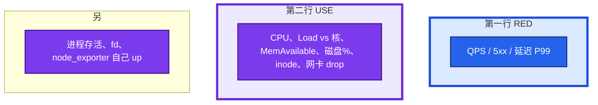

# 21｜监控与告警 · 练习题

先自己画图或口述，再对照解答。每题标了覆盖范围：

| 标记 | 含义 |
|------|------|
| **核心** | 不懂整章就没建立起来 |
| **必会** | 值班和面试都要能讲 |
| **常用** | 线上会反复碰到 |
| **常考** | 白板和追问的高频口径 |

## 本题目录

- [Q1 叫醒线](#q1)
- [Q2 黄金信号 / 面板](#q2)
- [Q3 风暴与降噪](#q3)
- [Q4 黑盒](#q4)
- [Q5 Pull / Push / Pushgateway](#q5)
- [Q6 盘满预测](#q6)
- [Q7 Counter 与类型](#q7)
- [Q8 SLO 点到为止](#q8)
- [Q9 图与告警同源](#q9)
- [Q10 活动高峰红线](#q10)
- [合上书](#合上书)

---

## Q1

**★★★★★｜哪些告警该半夜打电话？哪些不该？**

**覆盖**：核心 · 必会 · 常考

### 场景

群里 CPU 70%、磁盘 60%、某从库延迟 200ms、登录成功率从 99.9% 掉到 80%。值班不知该不该打给老板。

### 完整解答

对齐 **玩家能不能玩、数据会不会丢、会不会很快不可恢复**，不是对齐「数字看起来不圆」。

```mermaid
flowchart TB
    subgraph call ["叫醒 P0/P1"]
        a[探活失败：登录/支付/入口]
        b[登录、支付跌破 SLO]
        c[磁盘 predict 24h 内满]
        d[OOM 风暴]
        e[证书 ≤7 天]
    end
    subgraph nocall ["不叫醒"]
        f[单机 CPU 70% 且业务曲线正常]
        g[磁盘 60%]
        h[已被 InstanceDown 抑制的进程告警]
    end
    classDef bad fill:#DC2626,stroke:#7F1D1D,stroke-width:2px,color:#fff
    classDef ok fill:#334155,stroke:#0F172A,stroke-width:2px,color:#fff
    class a,b,c,d,e bad
    class f,g,h ok
    style call fill:#FEF2F2,stroke:#DC2626,stroke-width:4px
    style nocall fill:#F1F5F9,stroke:#334155,stroke-width:4px
```

从库 200ms：看是不是同步要求 RPO=0、玩家读是否打到从。有 SLO 跟 SLO，没有就不要发明 P0。靠 AlertManager 分级，不靠群。

### 再追问

CPU 85% 持续 5 分钟？——有 `for: 5m` 的 warning 可以 IM；没有业务损伤仍不必电话。登录已经跌了就走业务告警，不要两条都打电话。

---

## Q2

**★★★★★｜黄金信号是什么？主机先看什么？面板怎么摆？**

**覆盖**：核心 · 必会 · 常考

### 场景

新环境只接了 Prometheus，Grafana 空的。问「机器先看什么」，另有人要你背四黄金信号。

### 完整解答

四信号：Latency、Traffic、Errors、Saturation。主机对 USE，入口对 RED。



告警：探活连续失败 P0；盘将满 P1/P0；OOM、磁盘 IO error P1。Load 高 CPU 不高先看 03。内存看 **MemAvailable**。发布打 Annotation。平均值不当延迟 SLA。

### 再追问

inode 和 fd 为什么进黄金？——`df -h` 还有空间，inode 满或 fd 满，日志和 Nginx 照样写失败。14、18。

---

## Q3

**★★★★★｜告警太多没人看了，怎么治？抑制怎么用？**

**覆盖**：核心 · 必会 · 常考

### 场景

一台宿主机内核 hang，四十条 IM。之后支付失败混在里面没人点。

### 完整解答

四步：① 分组 group_by instance/alertname；② `for` 防抖；③ 分级路由，P0 电话少数人，P3 邮件；④ 每月删从未处理的规则。

抑制：父告警触发时不发子告警。`InstanceDown` 抑制同 instance 的进程 down、CPU、disk。人看到：机器没了。AlertManager `inhibit_rules`。没有抑制 = 故障越大噪音越大。

静默是维护窗口，不是抑制。长期 Silence = 删规则。

### 再追问

漏报怎么办？——补黑盒、补心跳、review 覆盖（登录/支付/证书/盘/OOM）。疲劳和漏报要一起治，只删规则会漏。

---

## Q4

**★★★★★｜blackbox 干什么？机器指标很绿入口却挂了？**

**覆盖**：核心 · 必会 · 常用

### 场景

node_exporter 全绿。玩家打不开登录页。SLB 后端指向了旧 IP。

### 完整解答

白盒看进程自报；**黑盒从外往里探**。DNS、证书、安全组、LB 配错，Exporter 不知道。用途：登录 URL、TCP 端口、DNS、TLS 剩余天数。

```promql
probe_ssl_earliest_cert_expiry - time() < 7 * 24 * 3600
```

配置：job 的 target 是 URL，relabel 成 `module=http_2xx` 打到 blackbox:9115。连续失败 P0。7 天 P1，更短 P0。

### 再追问

探 `/health` 返回 200 但登录仍失败？——health 没走到登录依赖（20）。黑盒要对「玩家点的那个 URL」，或单独探登录 API。

---

## Q5

**★★★★☆｜Prometheus 拉取和 Zabbix 推送差在哪？Pushgateway 何时用？**

**覆盖**：必会 · 常用 · 常考

### 场景

「为什么不用 Zabbix，我们机房防火墙入站很难开。」

### 完整解答

Prom **拉**：Server 访问 `/metrics`，`curl` 即排障，服务发现自然。目标必须可达。  
Zabbix **推**：Agent 出站上报，防火墙好做，发现和标签模型弱一些。

短任务（CI、批处理）跑完就没了，来不及 scrape → 推到 **Pushgateway**，Prom 再拉网关。网关上的序列 **不会自动过期**，Job 结束要删，否则「永远成功」。

### 再追问

能不能全部改 Push？——能，但失去「目标活着才能被拉到」这份探活。主机标配仍是 node_exporter + 拉。

---

## Q6

**★★★★☆｜磁盘告警该用使用率还是 predict_linear？**

**覆盖**：必会 · 常用

### 场景

磁盘 70% 告了两周没人理。某天活动日志把盘 2 小时打满，游戏服全部卡住。

### 完整解答

静态 70% 在大盘上会永远黄，造成疲劳。活动服更该用 **斜率**：

```promql
predict_linear(node_filesystem_avail_bytes[6h], 24*3600) < 0
```

24h 内满 → P1。已经 95%+ 或 inode 满 → P0。日志盘满的止血在 22，监控负责提前叫。

### 再追问

6h 窗口太短或太长？——太短：活动脉冲误报。太长：突发打满来不及。可 6h 预测 24h，再加一条 1h 预测 2h 的紧急线。

---

## Q7

**★★★★☆｜Counter 为什么不能直接阈值？CPU 那条怎么读？**

**覆盖**：必会 · 常用

### 场景

有人告警 `http_requests_total > 100000000`，一直 firing。

### 完整解答

Counter 是开机以来累计，只增。阈值永远会破。必须 `rate()` / `increase()` 看 **最近多快**。重启归零 `rate()` 也能接上。

CPU：`1 - avg(rate(node_cpu_seconds_total{mode="idle"}[5m]))` 是「非 idle 占比」，不是 Load。Load 要另画。应用错误率公式放到 04-18。

### 再追问

Histogram 和 Summary 选哪个看 P99？——跨实例聚合用 Histogram。Summary 在客户端算完，Pod 之间加不起来。展开在 04-18。

---

## Q8

**★★★★☆｜SLO / Error Budget 和「该不该发版」——点到为止**

**覆盖**：必会 · 常考

### 场景

被问 Error Budget。这章不要讲成 K8s 可观测专题。

### 完整解答

SLO 内部目标，如成功率 ≥99.9%。Budget = 允许失败时间（约每月 **43.2 分钟** @99.9%）。预算充足可以发；将尽冻非紧急；耗尽复盘。SLA 对外，通常松于 SLO。

**叫醒线应对齐 SLI**（登录成功率），不要对齐 CPU。怎么算滚动窗口、和发布闸门，去 04-18 / 08。

### 再追问

主机 CPU 能当 SLO 吗？——不能当玩家体验 SLO。它是饱和信号，最多当 P2 容量。

---

## Q9

**★★★★☆｜Grafana 只给领导看图，告警却在另一个系统，行不行？**

**覆盖**：常用 · 常考

### 场景

漂亮 Dashboard，告警还是脚本 SSH 扫磁盘。

### 完整解答

图和告警最好同源：同一 PromQL，避免「图上已经红了脚本还没跑」。Grafana 也能告警，主机环境更常见 Prom rule + AlertManager。

领导看板可以糙；值班必须：RED+USE、Annotation、跳得回这条时序。

### 再追问

node_exporter 挂了谁告警？——Prometheus 对 scrape 失败本身要有 `up == 0`。监控系统挂了要有外层探活（另一套 blackbox 或云监控），否则全员虚假绿色。Watchdog / Deadman's Snitch。

---

## Q10

**★★★★☆｜活动高峰 CCU 涨，告警怎么避免「全员 P0」？红线是什么？**

**覆盖**：必会 · 常用 · 常考

### 场景

活动开始 CPU、连接数、QPS 一起破静态阈值，电话打爆，全是预期负载。登录入口其实已经在 5xx。

### 完整解答

静态阈值按日常定，活动必炸。做法：活动窗口 **Silence** 容量类 P2；业务 SLO（登录成功率、支付、错误率、blackbox）**不静默**；或用环比/动态阈值（04-18）。发布和活动开关打 Annotation。

红线：探活、登录、支付、盘将满、证书、OOM。CPU 和 CCU 涨不是红线，除非伴随错误率和延迟破 SLO。

预期高峰不是关掉监控，是关掉「我们知道会高」的那些，留下「不该坏」的那些。

### 再追问

Silence 忘了打开怎么办？——日历 + 工单到期自动解除。长期 Silence 等于删除规则。忘了开 = 全员电话，和没降噪一样。

---

## 合上书

- [ ] 能说出四黄金信号，并画出 USE / RED 面板
- [ ] 能判断半夜该不该叫醒，而不是看 CPU 70%
- [ ] 能讲清分组、`for`、抑制、静默、分级路由
- [ ] 能说明白盒绿仍可能入口挂，证书用 expiry 倒计时
- [ ] 能区分 Pull / Push / Pushgateway，Counter 必须 `rate()`
- [ ] 能处理活动高峰：Silence 容量类，登录支付盘证书不静默
- [ ] 能说监控自己挂了靠 `up == 0` 和外层 Watchdog
