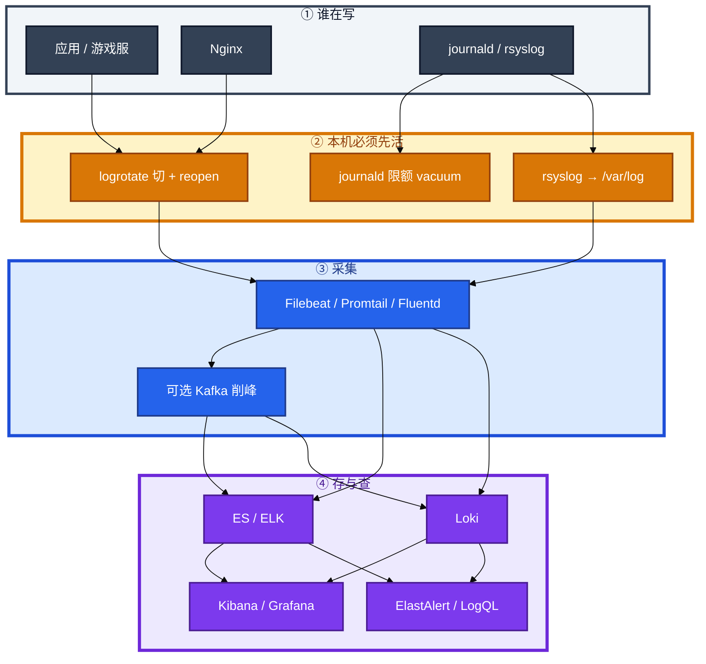
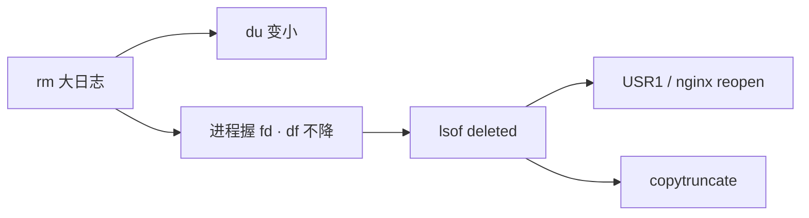
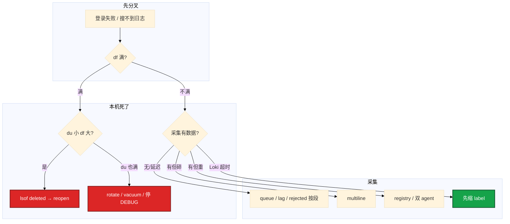

# 日志运维


活动开始 2 小时，游戏服磁盘 100%，登录失败。有人 `rm /var/log/game/*.log`，`du` 立刻变小，`df` 还是 100%。另有人要把 Filebeat 先装上「好排查」——机器已经写不动了，采集也挂。

**本章主线（排障就按这三步想）：**

1. **本机先活**：journald 限额、logrotate、Docker max-size。
2. **盘满三步**：`df` → `du` → `lsof deleted`。
3. **采集按段查**：queue → lag → rejected，不要猜 ES 慢。

**读完你能：** 盘满按 `df` → `du` → `lsof deleted` 止血；会配 logrotate / journald / Filebeat multiline；能讲清 ELK 和 Loki 谁搜玩家 ID；日志告警不替代探活。

## 本章目录

- [1. 基本概念](#1-基本概念)
- [2. 架构图](#2-架构图)
- [3. 原理](#3-原理)
  - [3.1 分级](#31-分级级别与保留)
  - [3.2 切割](#32-切割rotate--reopen)
  - [3.3 采集](#33-采集按段与丢失)
- [4. 落地](#4-落地)
- [5. 核心配置](#5-核心配置)
- [6. 命令与操作](#6-命令与操作)
- [7. 生产排障](#7-生产排障)
- [8. 必会 · 常考](#8-必会--常考)
- [合上书](#合上书问自己)

**本章不讲：** DaemonSet vs Sidecar、kubelet 容器日志轮转 → [04-19 日志管理](../../04-Kubernetes/19-日志管理/)；ES 集群调优、分片 → [03-09](../../03-中间件与数据库/09-Elasticsearch/)；磁盘满、删文件不释放原理 → [05](../05-磁盘与IO/)、[14](../14-文件系统与inode/)；审计规则本身 → [17](../17-Linux安全加固/)；主机告警分级、探活 → [21 监控与告警](../21-监控与告警/)。

---

## 1. 基本概念

采集平台之前，主机已经能用日志把自己写挂。游戏服最常见的不是 ES 没了，是 `/var` 100%、进程还握着已删 fd。

**值班里怎么认现象**（先听监控/业务怎么说，再对表）：

| 群里说的 | 技术含义 | 你的第一刀 |
|----------|----------|------------|
| 「rm 了还满」 | deleted fd | `lsof \| grep deleted` |
| 「搜不到刚才的 ERROR」 | 采集延迟/丢 | queue → lag → rejected |
| 「堆栈碎成 40 条」 | multiline 没配 | 行首 pattern |
| 「/run 满了 ssh 卡」 | journal 没限额 | vacuum + SystemMaxUse |
| 「活动缺 10 分钟日志」 | 管道某段堵 | 按段查，不猜 ES |

三件事不要混：

| 事 | 干什么 |
|----|--------|
| **本机先活** | journald 限额、rsyslog、logrotate 切 + reopen |
| **采集** | Filebeat / Promtail 把文件交出去 |
| **检索与告警** | ELK 全文 / Loki 按 label；日志解释为什么，探活决定叫不叫人（21） |

系统 vs 应用：`/var/log/messages`、`secure`/`auth.log`、`cron` 走 rsyslog。auditd 另有文件（17）。**应用不要和 syslog 抢同一个 messages**。journald 生产要显式限额，不要无限 `journalctl -f` 当长期采集。

**打个比方**：本机日志像厨房下水——先通管道（rotate/reopen），再谈装净水器（Filebeat）；下水道堵了，净水器也转不动。

> **记住**：本机先活，再谈采集。`du` 变小、`df` 不降，先找 deleted fd，不要加盘。

**面试怎么说**：「盘满我先 df、du、lsof deleted；会 reopen 用 USR1，不会就 copytruncate。搜玩家 ID 走 ELK，Loki 不能把 player_id 当 label。」

---

## 2. 架构图

后面分级、切割、采集丢失都对着这张图。



**读图三句话：**

1. **没有「先上采集」越过本机限额**——盘满了 Filebeat 也写不动。
2. **系统日志和业务日志分目录**——两套抢一个文件会轮转打架。
3. **丢失按段查**：Filebeat queue → Kafka lag → Logstash → ES rejected。不要猜「ES 慢」。

排障顺序：`df -h` 满 → `du -sh /var/log/*` → `lsof | grep deleted`。治理是 rotate / reopen，不是先加盘。

---

## 3. 原理

### 3.1 分级：级别与保留

**一句话：** 生产 DEBUG 关；日志告警解释为什么，探活决定叫不叫人。

**打个比方**：日志级别像广播音量——生产把 DEBUG 关小声，不然活动期间像全场喇叭尖叫，值班耳朵先聋（磁盘和 ES 一起爆）。

**现场走一遍**（客服要搜玩家登录失败，你先确认日志长什么样）：

1. 看应用配置：生产是否 **DEBUG 全开**。
2. 抽一条线上 ERROR（应是 JSON）：

```json
{
  "@timestamp": "2026-08-26T10:00:00.000Z",
  "level": "ERROR",
  "service": "game-server",
  "trace_id": "abc123",
  "player_id": "12345",
  "message": "登录失败：token 过期",
  "error": "TokenExpiredError",
  "duration_ms": 42
}
```

3. **输出解读**：

| 字段 | 没有会怎样 |
|------|------------|
| `@timestamp` UTC | Kibana 按收割时间排，时间线错 |
| `trace_id` | 和 Metrics/Traces 串不起来 |
| `player_id` | 客服搜不到（注意脱敏） |
| `level` | 告警无法按级别滤 |

4. 保留策略（热/温/冷）：

| 类型 | 热 | 温 | 冷 |
|------|----|----|-----|
| 应用 | **7d** | 30d | 90d |
| 访问 | **3d** | 15d | 30d |
| 安全审计 | **30d** | 90d | **1y+** |
| 慢查询 | 7d | 30d | — |

5. 日志告警示例：5 分钟 ERROR **>100** 条可 IM；FATAL/支付 ERROR 可 P0。**不要**用日志告警替代 blackbox（21）。

**面试怎么说**：「生产 DEBUG 关；时间戳 UTC。日志告警讲为什么，半夜叫人不叫看探活。审计 1 年+，不和访问日志混 7 天。」

> **记住**：JSON 少 grok；`@timestamp` 必须 UTC（19 校时）。

### 3.2 切割：rotate + reopen

**一句话：** 会 reopen 用 USR1；不会就 copytruncate。

**打个比方**：日志像水管——`rm` 只拆了水龙头标牌，管子还接着漏水（inode 占着盘）；要关阀门（USR1 reopen）或截断管子（copytruncate）。

**现场走一遍**（`rm` 了大日志，`df` 仍 100%）：

1. 确认满盘：

```bash
df -h /var && df -i /var
du -sh /var/log/* | sort -h | tail
```

2. 找 deleted fd：

```bash
lsof | grep deleted | head
```

3. **输出解读**：

```text
game-serv 12345  moonton  3w  REG  8,1  8589934592  1234567 /var/log/game/server.log (deleted)
```

| 列 | 含义 |
|----|------|
| `3w` | 写 fd |
| 8589934592 | **仍占 ~8GB**，所以 df 不降 |
| `(deleted)` | 目录项没了，inode 还在 |

4. 会 reopen（nginx/rsyslog）：

```bash
nginx -s reopen
# 或 postrotate: kill -USR1 `cat /var/run/nginx.pid`
```

5. 不会 reopen（自研游戏服）→ logrotate **copytruncate**，或紧急 `> /proc/PID/fd/3` 止血。



| 策略 | 何时用 |
|------|--------|
| `copytruncate` | 进程不知 USR1 |
| `create` + `postrotate USR1` | nginx、rsyslog |
| Docker `json-file` | 必须 `max-size` / `max-file` |

journald：`SystemMaxUse=1G` 封顶；应急 `journalctl --vacuum-size=500M`。Docker 不设上限，overlay 能把节点写死（K8s 见 04-19）。

**面试怎么说**：「rm 后 df 不降我先 lsof deleted；nginx 用 USR1，自研用 copytruncate。Docker 必须 max-size。」

### 3.3 采集：按段与丢失

**一句话：** 丢失按 queue → lag → rejected 逐段查。

**打个比方**：日志管道像接力赛——Filebeat 是第一棒，Kafka 是中转，ES 是终点；哪一棒掉棒，别在终点骂裁判。

**现场走一遍**（Kibana 缺最近 10 分钟 ERROR）：

1. 本机 Filebeat 还在读吗？

```bash
systemctl status filebeat
ls -la /var/lib/filebeat/registry
```

2. 看 Filebeat 监控 / 日志：queue 是否堆积。
3. 有 Kafka → `kafka-consumer-groups.sh --describe` 看 **lag**。
4. Logstash / ES：是否有 **rejected**、磁盘满、线程池拒绝。
5. 堆栈碎成多行 → 查 multiline 是否匹配**行首**时间戳。

**输出解读**（按段定责）：

| 段 | 现象 | 下一步 |
|----|------|--------|
| Filebeat queue 满 | 下游慢或网络断 | 调 bulk/背压；修 ES |
| Kafka lag 涨 | 消费跟不上 | 扩 consumer；查 Logstash |
| ES rejected | 映射冲突/磁盘 | ILM；修模板（03-09） |
| multiline 碎 | pattern 不对 | 对齐真实行首 |
| 重启重放昨天 | registry 删了 | 别删 registry |

多行配置要点：

```yaml
multiline.pattern: '^[0-9]{4}-[0-9]{2}-[0-9]{2}'
multiline.negate: true
multiline.match: after
```

轮转后 inode 变了，注意 `close_renamed`。Kafka 削峰不是无限水坝，队列满要有策略。

**ELK vs Loki**（选型一口回）：

| | ELK / EFK | Loki |
|--|-----------|------|
| 索引 | 全文倒排 | 只索引 **label** |
| 成本 | 高 | 低 |
| 查询 | 任意关键词快 | label + 正则扫内容 |
| 适合 | **搜玩家 ID** | 按 service/level/pod |

Loki 查询先缩流：

```logql
{service="game-server"} |= "ERROR"
{service="game-server"} | json | level="error"
```

`status` 可抽 label（基数低）；**player_id、path 不行**——高基数爆炸。

**面试怎么说**：「丢了按 Filebeat queue、Kafka lag、ES rejected 查。搜玩家 ID 用 ELK；Loki 不能把 player_id 当 label。」

> **记住**：一台一个 agent；删 registry = 从头重读。加 Kafka 不保证不丢。

---

## 4. 落地

本机先配限额和 rotate，再上 agent。

| 层 | 落地 | 验收 |
|----|------|------|
| journald | `Storage=`、`SystemMaxUse=` | `journalctl --disk-usage` 不超限 |
| rsyslog | 系统文件；业务不进 messages | 业务不在 messages 膨胀 |
| logrotate | `/etc/logrotate.d/` | 切完 `df` 降 |
| Docker | `max-size` / `max-file` | overlay 活动打不满 |
| Filebeat | 每台一个；registry 持久 | 堆栈一条；重启不重放昨天 |
| 中心 | Kafka / ES 或 Loki | queue/lag/rejected 有指标 |

录屏、堡垒审计、游戏热日志不要同一块盘（25、21 盘预测对着业务盘）。

---

## 5. 核心配置

journald、自研 copytruncate、nginx USR1、Filebeat multiline，四份都要会改。

```
/var/log/game/*.log {
    daily
    rotate 7
    missingok
    compress
    delaycompress
    copytruncate
    notifempty
    dateext
}
```

nginx/rsyslog：`create` + `postrotate` 里 USR1，去掉 copytruncate。

```yaml
filebeat.inputs:
- type: log
  paths:
    - /var/log/nginx/access.log
    - /var/log/app/*.log
  multiline.pattern: '^[0-9]{4}-[0-9]{2}-[0-9]{2}'
  multiline.negate: true
  multiline.match: after
  fields:
    service: game-server
    env: production
processors:
  - add_host_metadata: ~
output.elasticsearch:
  hosts: ["es-cluster:9200"]
  index: "logs-%{[fields.service]}-%{+yyyy.MM.dd}"
queue.mem.events: 4096
bulk_max_size: 2048
```

Promtail（Loki）：

```yaml
clients:
  - url: http://loki:3100/loki/api/v1/push
scrape_configs:
  - job_name: nginx
    static_configs:
      - targets: [localhost]
        labels:
          service: nginx
          __path__: /var/log/nginx/access.log
```

| 参数 | 生产怎么用 | 改错会怎样 |
|------|------------|------------|
| SystemMaxUse | 按盘封顶，常见 1G | 吃光 /run 或 /var |
| copytruncate vs USR1 | 会 reopen 就 USR1 | 只会 rm → df 不降 |
| Docker max-size | 必须有 | overlay 写死节点 |
| multiline | 行首时间戳 | 堆栈碎成几十条 |
| registry | 盘持久，别删 | 重启重读历史 |
| Loki label | service/level/env | player_id = 高基数 |

> **记住**：会 reopen 用 USR1；Loki 只索引 label。

---

## 6. 命令与操作

盘满先这几条，再谈采集。

```bash
df -h && df -i
du -sh /var/log/* | sort -h
lsof | grep deleted
journalctl --disk-usage
journalctl --vacuum-size=500M
journalctl -u nginx -n 100 --no-pager
logrotate -d /etc/logrotate.conf
nginx -s reopen
```

| 目的 | 命令 | 看什么 |
|------|------|--------|
| 空间 | `df -h` / `df -i` | 空间还是 inode |
| 谁大 | `du -sh /var/log/*` | 哪个文件 |
| rm 后不降 | `lsof \| grep deleted` | 握着的 PID |
| journal | `--disk-usage` / `-u` | 限额、最近行 |
| rotate | `logrotate -d` | 路径、权限、cron |
| nginx 切 | `nginx -s reopen` | 新文件开始长 |

日志告警示例（ElastAlert frequency）：

```yaml
name: game-server-error-spike
type: frequency
index: logs-game-*
num_events: 100
timeframe:
  minutes: 5
filter:
  - term: { level: "ERROR" }
alert:
  - feishu
```

### 6.1 盘满止血

1. `df` → `du` → `lsof deleted`。
2. 会 reopen：USR1 / `nginx -s reopen`。
3. 不会：copytruncate 或 `> /proc/PID/fd/N`。
4. journal：vacuum，再改 `SystemMaxUse`。
5. **不要先 kill 游戏逻辑服**；不要先加盘当根因。

### 6.2 Filebeat 与中心管道

堆栈：multiline。重复：registry、双 agent、rotate inode。延迟：bulk/queue；下游满走 Kafka。

Logstash 示意：

```ruby
input {
  kafka {
    bootstrap_servers => "kafka:9092"
    topics => ["logs"]
    codec => "json"
  }
}
filter {
  date {
    match => ["@timestamp", "ISO8601"]
    target => "@timestamp"
  }
}
output {
  elasticsearch {
    hosts => ["es-cluster:9200"]
    index => "logs-%{[fields.service]}-%{+YYYY.MM.dd}"
  }
}
```

丢了按链路：Filebeat queue？ → Kafka lag？ → Logstash 慢？ → ES rejected？

### 6.3 降本与 Loki

已有 Grafana 体系，Loki 面板统一。**不是二选一**：搜玩家 ID → ELK；按 Pod/service 查 → Loki。ES 盘不够：ILM 热温冷删；访问日志 200 采样、4xx/5xx 全留。

---

## 7. 生产排障

三问：盘还能写吗？空间不降是不是 deleted fd？采集丢了卡在哪一段？



| 现象 | 先做什么 | 不要做什么 |
|------|----------|------------|
| rm 了 `df` 仍 100% | `lsof deleted`，USR1 / copytruncate | 先加盘；先杀逻辑服 |
| /run 或 ssh 诡异卡 | journal vacuum + SystemMaxUse | 无限 journalctl -f |
| messages 一天 50G | 应用改独立目录 | print 进 syslog |
| 堆栈碎 40 行 | multiline 行首日期 | 加大 ES |
| 重启 Filebeat 重放昨天 | 查 registry | 当「ES 重复」删索引 |
| 活动缺 10 分钟日志 | queue/lag/rejected | 猜 ES 慢 |
| Loki 搜一句话超时 | 先 `{service=}` 再 `|=` | 当 ES 倒排用 |
| ERROR 一多就电话 | 速率 + 级别；探活归 21 | 活动 INFO 也 P0 |
| access.log 10G 没切 | `logrotate -d`、USR1、SELinux（17） | 只改 rotate 天数 |
| 容器 overlay 满 | daemon max-size | 用 04-19 代替裸 Docker |

活动高峰日志和 etcd 同盘：先让本机活（rotate、停 DEBUG、vacuum），再救采集。监控 21 负责提前叫盘将满。

---

## 8. 必会 · 常考

| 说法 | 对错 | 口径 |
|------|:----:|------|
| 盘满先加盘 / 先装 Filebeat | 错 | 先 rotate / reopen |
| `rm` 后 `df` 一定下降 | 错 | 进程握 fd 则 inode 还在 |
| 会 reopen 也该 copytruncate | 错 | 能 USR1 就 USR1 |
| journal 可以不限额 | 错 | 吃光 /run 或 /var |
| 业务 print 进 messages | 错 | 独立目录 |
| Docker json-file 不设上限 | 错 | overlay 写死节点 |
| 搜玩家 ID 用 Loki 当谷歌 | 错 | 全文走 ELK；Loki 先缩 label |
| player_id 当 Loki label | 错 | 高基数；放行内 |
| 时间戳用本机 localtime | 错 | 存 UTC |
| 生产全开 DEBUG 靠 ES 滤 | 错 | 级别当开关 |
| 日志告警替代探活 | 错 | 探活 21，日志解释为什么 |
| 加 Kafka 就一定不丢 | 错 | 队列也会满 |
| compact 式：只 vacuum 不改限额 | 错 | 还会满 |
| 审计和访问日志同一套 7 天 | 错 | 审计 1y+、独立索引 |
| logrotate 有配置就等于切了 | 错 | 要 cron、权限、USR1 |
| K8s 轮转能代替裸 Docker 主机 | 错 | daemon.json 必须设 |

数字：应用热 **7d** / 访问热 **3d** / 审计 **1y+**；ERROR 频率例 **5 分钟 >100**；rsyslog TCP **@@:514**；Filebeat registry `/var/lib/filebeat/registry`。

易混：copytruncate vs USR1；`du` vs `df`；ELK vs Loki；label vs 行内过滤；日志告警 vs blackbox；宿主机 lsof vs 容器 df；热温冷 vs 合规审计。

---

## 合上书，问自己

1. 盘满三步？`rm` 后空间不回来先找什么？
2. journald / rsyslog / 应用文件怎么分工？SystemMaxUse 不设会怎样？
3. 会 reopen 和不会 reopen 各配哪套 rotate？Docker 呢？
4. Filebeat multiline、registry 各解决什么？丢失按哪几段查？
5. 搜玩家 ID 用谁？Loki 为什么不能把 player_id 当 label？
6. 日志告警和探活怎么分工？JSON 必备字段有哪些？

六题都能口述，这一章就过了。下一章把入口 HTTP 反代剖开：超时链、502/504/499、keepalive。
