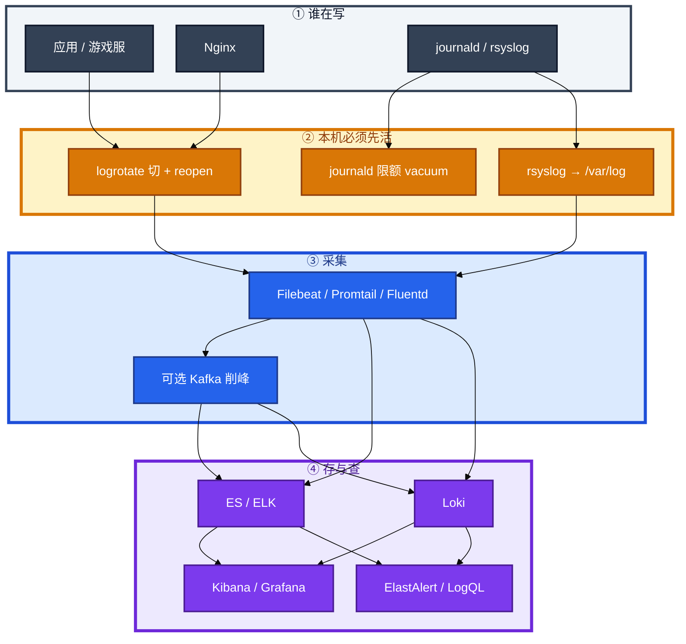
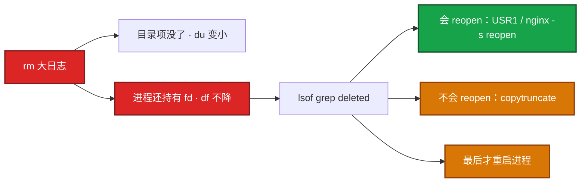
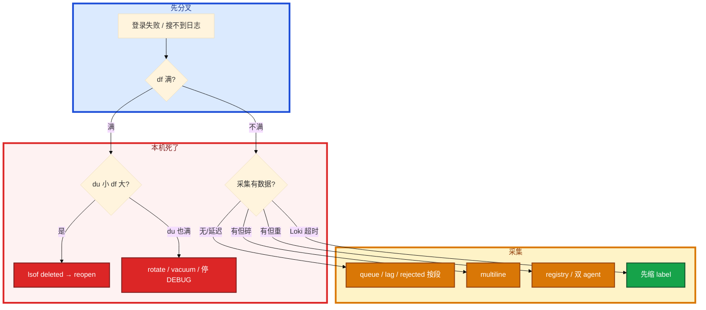

# 日志运维


活动开始 2 小时，游戏服磁盘 100%，登录失败。有人 `rm /var/log/game/*.log`，`du` 立刻变小，`df` 还是 100%。另有人要把 Filebeat 先装上「好排查」。机器已经写不动了。

先别动手。这一章后半全是你会动手的：**怎么 rotate、怎么 reopen、journal 怎么限额、采集丢了按哪段查。** 前面的分级和链路，是为了让你动手时不先加盘、不先上 ES。

**读完你能：** 盘满按 `df` → `du` → `lsof deleted` 止血；会配 logrotate / journald / Filebeat multiline；能讲清 ELK 和 Loki 谁搜玩家 ID；日志告警不替代探活。

## 本章目录

缩进 = 上下级。3 下面才是 3.1。

想钉在**正文左边**跟着滚：菜单 **查看 → 打开视图 → 大纲**。Markdown 预览做不到独立左栏，目录只能写在文章开头。

- [1. 基本概念](#1-基本概念)
- [2. 架构图](#2-架构图)
- [3. 原理](#3-原理)
  - [3.1 分级](#31-分级级别与保留)
  - [3.2 切割](#32-切割rotate--reopen)
  - [3.3 采集](#33-采集按段与丢失)
- [4. 安装部署](#4-安装部署)
- [5. 核心配置](#5-核心配置)
- [6. 常用命令](#6-常用命令)
- [7. 常用操作](#7-常用操作)
  - [7.1 盘满止血](#71-盘满止血)
  - [7.2 Filebeat 与中心管道](#72-filebeat-与中心管道)
  - [7.3 降本与 Loki](#73-降本与-loki)
- [8. 生产排障](#8-生产排障)
- [9. 必会 · 常考](#9-必会--常考)
- [合上书](#合上书问自己)

**本章不讲：** DaemonSet vs Sidecar、kubelet 容器日志轮转 → [04-19 日志管理](../../04-Kubernetes/19-日志管理/)；ES 集群调优、分片 → [03-09](../../03-中间件与数据库/09-Elasticsearch/)；磁盘满、删文件不释放原理 → [05](../05-磁盘与IO/)、[14](../14-文件系统与inode/)；审计规则本身 → [17](../17-Linux安全加固/)；主机告警分级、探活 → [21 监控与告警](../21-监控与告警/)。

---

## 1. 基本概念

采集平台之前，主机已经能用日志把自己写挂。游戏服最常见的不是 ES 没了，是 `/var` 100%、进程还握着已删 fd。

三件事不要混：

| 事 | 干什么 |
|----|--------|
| **本机先活** | journald 限额、rsyslog 系统文件、logrotate 切 + reopen |
| **采集** | Filebeat / Promtail 把文件交出去 |
| **检索与告警** | ELK 全文 / Loki 按 label；日志告警解释为什么，探活决定叫不叫人（21） |

系统 vs 应用：`/var/log/messages`（或 `syslog`）、`secure`/`auth.log`、`cron` 走 rsyslog。auditd 另有文件（17）。**应用不要和 syslog 抢同一个 messages**，否则轮转和权限都乱。游戏业务写独立目录。

journald 是 systemd 的日志：有的发行版只进内存（重启丢、占 tmpfs），有的持久化到 `/var/log/journal`。生产要显式限额。不要无限 `journalctl -f` 当长期采集。

> **记住**：本机先活，再谈采集。盘满了 Filebeat 也写不动。`du` 变小、`df` 不降，先找 deleted fd，不要加盘。

---

## 2. 架构图

先把整张图钉住。后面安装、命令、排障都对着这张图说话。



图上三条线：

1. **没有「先上采集」的箭头越过本机限额。** 盘满了再装 Filebeat 没有意义。
2. **系统日志和业务日志分目录。** 两套抢一个文件会轮转打架。
3. **丢失按段查：** Filebeat queue → Kafka lag → Logstash → ES rejected。不要猜「ES 慢」。

排障顺序永远是：`df -h` 满 → `du -sh /var/log/*` → `lsof | grep deleted`。治理是 rotate / reopen，不是先加盘。

---

## 3. 原理

原理只保留动手会用到的：级别怎么开、切了空间为什么不回来、采集为什么重复或丢。

**本节 3 块：** 3.1 分级 · 3.2 切割 · 3.3 采集

### 3.1 分级：级别与保留

生产级别当开关，不当「全打 DEBUG 再靠 ES 滤」。

| 级别 | 生产 |
|------|------|
| DEBUG | **关** |
| INFO / WARN / ERROR / FATAL | 开 |

JSON 结构化，少 grok、按字段滤、`trace_id` 把 Metrics/Logs/Traces 串起来。时间戳 **UTC**（19）。`player_id` 注意脱敏和合规。

```json
{
  "@timestamp": "2026-08-26T10:00:00.000Z",
  "level": "ERROR",
  "service": "game-server",
  "trace_id": "abc123",
  "player_id": "12345",
  "message": "登录失败：token 过期",
  "error": "TokenExpiredError",
  "duration_ms": 42
}
```

必备：`@timestamp`（UTC）、`level`、`service`、`message`；尽量 `trace_id`、`error`、`duration_ms`。时间字段必须进 `@timestamp`，否则 Kibana 按收割时间排，排障时间线是错的。本机 localtime 不行：合服、跨 Region 时间线错。

| 类型 | 热 | 温 | 冷 |
|------|----|----|----|
| 应用 | **7d** | 30d | 90d |
| 访问 | **3d** | 15d | 30d |
| 安全审计 | **30d** | 90d | **1y+** |
| 慢查询 | 7d | 30d | — |

审计日志按合规留 1 年+，不要和访问日志同一套 7 天，也不要和游戏 DEBUG 混一个 index（17）。录屏/堡垒审计同理，别和 ES 热日志抢盘（25）。

日志告警：ElastAlert 扫 ES；Grafana Alert 跑 LogQL；或 mtail 抽指标进 Prometheus（21）。例如 5 分钟 ERROR >100 条。FATAL、支付 ERROR 可以 P0；活动正常刷的 INFO/WARN 不能打电话。**不要用日志告警替代探活**：探活在 21，日志证明「为什么」。

### 3.2 切割：rotate + reopen

游戏自研服最大坑：**只 rm / 只 truncate，进程不 reopen**，inode 还指着旧文件，`du` 和 `df` 对不上。删的是目录项，inode 还在（14）。



| 策略 | 何时用 |
|------|--------|
| `copytruncate` | 进程一直握着 fd 写，不知道 USR1（很多自研） |
| `create` + `postrotate kill -USR1` | nginx、rsyslog 会 reopen；空间马上释放，少一次空洞大拷贝 |
| Docker `json-file` | 必须 `max-size` / `max-file`，否则 overlay 把节点打满 |

`copytruncate` 有短暂重复或丢失一行的窗口，比盘满死机便宜。能 USR1 就不要 copytruncate。Nginx：`nginx -s reopen` 或 USR1。不要 `kill -9` 当轮转。`delaycompress`：今天切的先不压，明天再压昨天的，避免还在 reopen 窗口的文件被 gzip。

Docker / containerd 的 json-file 驱动不配上限，活动期间容器日志能把节点写死。K8s kubelet 轮转参数在 04-19，**裸 Docker 主机必须在 daemon 上设**。`lsof deleted` 在 **实际写文件的那个 mount 命名空间** 看。宿主机 `lsof` 能看到容器进程握着的已删文件。别只进容器 `df`。

journald：`Storage=persistent` 需要落盘的；`SystemMaxUse=1G`（按盘大小改）封顶。没设限额：占满 `/run` → 机器诡异卡、登不上；占满 `/var` → 和业务日志一起 100%。应急 `journalctl --vacuum-size=500M` 或 `--vacuum-time=7d`。生产持久化并封顶，不要只放内存。

### 3.3 采集：按段与丢失


| 来源 | 典型路径 | 谁采 |
|------|----------|------|
| 应用 | `/var/log/app/` | Filebeat tail |
| 系统 | messages / secure | Filebeat 或 rsyslog 转发 `*.* @@logserver:514`（TCP；`@` 是 UDP） |
| Nginx | `/var/log/nginx/` | Filebeat |
| 容器（节点文件） | 04-19 | DaemonSet，本章不展开 |
| 慢查询 | MySQL slow | Filebeat + 解析 |
| 审计 | audit.log / 云审计 | 专用，离机 |

Filebeat：Go 写的，比 JVM 的 Logstash 轻。Logstash 放中心做 grok/geoip。EFK 里的 F 常是 Filebeat 或 Fluent Bit。registry（`/var/lib/filebeat/registry`）记录读到哪。删了 registry 再启动 = 从头读一遍。一台一个 agent，多实例会抢同一文件。

多行：pattern 匹配**行首**（时间戳），`negate: true` + `match: after` = 不匹配的行（堆栈）拼到上一行。Java 异常没有这个会碎成几十条，搜不全。pattern 要和真实行首一致。

轮转后 inode 变了，要了解 `close_renamed` 等，否则当新文件再采一遍。

Kafka 是削峰，不是无限水坝。队列也会满，满了要有策略（阻塞、丢弃、死信）。加 Kafka 一定不丢？否。

Logstash grok 失败进 `_grokparsefailure` 或原样。JSON 日志少 grok。先改应用输出，再堆滤镜。`date` 滤镜对上 `@timestamp`。

---

## 4. 安装部署

本机先配限额和 rotate，再上 agent。进程在不算数。

| 层 | 落地 | 验收 |
|----|------|------|
| journald | `/etc/systemd/journald.conf`：`Storage=`、`SystemMaxUse=` | `journalctl --disk-usage` 不超过顶 |
| rsyslog | 系统文件；应用不进 messages | `secure` / `cron` 在，业务不在 messages 里膨胀 |
| logrotate | `/etc/logrotate.d/` | `logrotate -d` 能匹配；切完 `df` 降 |
| Docker | `daemon.json` `max-size` / `max-file` | 活动 access 打不满 overlay |
| Filebeat | 每台一个；registry 盘要持久 | 堆栈一条；重启不重放昨天 |
| 中心 | Logstash / Kafka / ES 或 Loki | 按段有队列/lag/rejected 指标 |

转发系统日志离机：`*.* @@logserver:514`。应用更常用 Filebeat 直读文件。审计也要离机（17）。

录屏、堡垒审计、游戏热日志不要同一块盘（25、21 的盘预测对着业务盘）。

---

## 5. 核心配置

journald 限额、自研 copytruncate、nginx USR1、Filebeat multiline，四份都要会改。

```
/var/log/game/*.log {
    daily
    rotate 7
    missingok
    compress
    delaycompress
    copytruncate
    notifempty
    dateext
}
```

nginx/rsyslog：`create` + `postrotate` 里 USR1，去掉 copytruncate。

```yaml
filebeat.inputs:
- type: log
  paths:
    - /var/log/nginx/access.log
    - /var/log/app/*.log
  multiline.pattern: '^[0-9]{4}-[0-9]{2}-[0-9]{2}'
  multiline.negate: true
  multiline.match: after
  fields:
    service: game-server
    env: production
processors:
  - add_host_metadata: ~
  - drop_fields:
      fields: ["log.offset"]
output.elasticsearch:
  hosts: ["es-cluster:9200"]
  index: "logs-%{[fields.service]}-%{+yyyy.MM.dd}"
# output.kafka:
#   hosts: ["kafka:9092"]
#   topic: "logs"
queue.mem.events: 4096
bulk_max_size: 2048
```

Logstash 中心：input（Kafka）→ filter（grok、date、geoip、mutate）→ output（ES）。示意见操作 7.2。

Promtail 扫文件、打 label；HTTP status 基数低可以升为 label，URL path、玩家 ID 不行。

```yaml
clients:
  - url: http://loki:3100/loki/api/v1/push
scrape_configs:
  - job_name: nginx
    static_configs:
      - targets: [localhost]
        labels:
          service: nginx
          __path__: /var/log/nginx/access.log
    pipeline_stages:
      - regex:
          expression: '.*"(?P<method>\w+) (?P<path>\S+).*" (?P<status>\d+)'
      - labels:
          method:
          status:
```

| 参数 | 生产怎么用 | 改错会怎样 |
|------|------------|------------|
| SystemMaxUse | 按盘封顶，常见 1G 量级 | 不设吃光 /run 或 /var |
| copytruncate vs USR1 | 会 reopen 就 USR1 | 只会 rm → df 不降 |
| Docker max-size | 必须有 | overlay 活动写死节点 |
| multiline | 行首时间戳 | 堆栈碎成几十条 |
| registry | 盘持久，别删 | 重启重读历史 |
| Loki label | service/level/env/status | player_id 当 label = 高基数爆炸 |
| bulk / queue | 太大吃内存 | 太小延迟；下游满了要有背压 |

> **记住**：会 reopen 用 USR1；不会就 copytruncate。Loki 只索引 label；player_id 放行内过滤。

---

## 6. 常用命令

盘满先这几条，再谈采集。

```bash
df -h && df -i
du -sh /var/log/* | sort -h
lsof | grep deleted
journalctl --disk-usage
journalctl --vacuum-size=500M
journalctl -u nginx -n 100 --no-pager
logrotate -d /etc/logrotate.conf
nginx -s reopen
```

| 目的 | 命令 | 看什么 |
|------|------|--------|
| 空间 | `df -h` / `df -i` | 满的是空间还是 inode |
| 谁大 | `du -sh /var/log/*` | 哪个文件 |
| rm 后不降 | `lsof \| grep deleted` | 还握着的 PID |
| journal | `journalctl --disk-usage` / `-u` | 限额、最近 100 行 |
| rotate 没切 | `logrotate -d` | 路径、权限、是否真被 cron 调 |
| nginx 切 | `nginx -s reopen` | 新文件开始长 |

日志告警示例（ElastAlert frequency，同一思想：速率不是单条）：

```yaml
name: game-server-error-spike
type: frequency
index: logs-game-*
num_events: 100
timeframe:
  minutes: 5
filter:
  - term: { level: "ERROR" }
alert:
  - feishu
```

---

## 7. 常用操作

### 7.1 盘满止血

1. `df` → `du` → `lsof deleted`。
2. 会 reopen：USR1 / `nginx -s reopen`，空间马上释放。
3. 不会：copytruncate，或 `> /proc/PID/fd/N` 止血。
4. journal：vacuum，再改 `SystemMaxUse`。
5. **不要先 kill 游戏逻辑服**；不要先加盘当根因。

### 7.2 Filebeat 与中心管道

堆栈：配 multiline。重复：查 registry、双 agent、rotate inode。延迟：调小 bulk/queue；下游打满走 Kafka 缓冲。

Logstash 示意：

```ruby
input {
  kafka {
    bootstrap_servers => "kafka:9092"
    topics => ["logs"]
    codec => "json"
  }
}
filter {
  grok { match => { "message" => "%{COMBINEDAPACHELOG}" } }
  date {
    match => ["timestamp", "dd/MMM/yyyy:HH:mm:ss Z"]
    target => "@timestamp"
  }
  geoip { source => "clientip" }
  mutate { remove_field => ["message", "timestamp"] }
}
output {
  elasticsearch {
    hosts => ["es-cluster:9200"]
    index => "nginx-%{+YYYY.MM.dd}"
  }
}
```

丢了按链路看指标：

Filebeat queue 堆积？ → Kafka consumer lag？ → Logstash 处理慢？ → ES rejected / 磁盘 / 线程池？

### 7.3 降本与 Loki

| | ELK / EFK | Loki |
|--|-----------|------|
| 索引 | 全文倒排 | 只索引 **label** |
| 成本 | 高 | 低（压缩原文） |
| 查询 | 任意关键词快 | label + 正则扫内容，复杂查询慢 |
| 运维 | ES 集群重 | 像 Prometheus |
| UI | Kibana | Grafana |
| 适合 | 搜玩家 ID、任意正文 | 按 service/level/pod 查，省钱 |

**不是二选一：** K8s 基础日志、按 Pod 查 → Loki；玩家行为、客服搜角色 ID → ELK。已有 Grafana 体系，Loki 面板统一。按场景拆分，不要只站队。

ES 盘不够：ILM 热温冷删；访问日志 200 采样、4xx/5xx 全留；Kafka 削峰；冷归档对象存储。

Loki 先缩流再扫内容：

```
{service="game-server"} |= "ERROR"
{service="game-server"} | json | level="error"
rate({service="game-server"} |= "ERROR" [5m])
```

随便关键词 = 全表扫，超时。`status` 抽成 label 可以（基数几十）；path、player_id 不行。

---

## 8. 生产排障

三问：盘还能写吗？空间不降是不是 deleted fd？采集丢了卡在哪一段？



| 现象 | 先做什么 | 不要做什么 |
|------|----------|------------|
| rm 了 `df` 仍 100% | `lsof deleted`，USR1 / copytruncate | 先加盘；先杀逻辑服 |
| /run 或 ssh 诡异卡 | journal vacuum + SystemMaxUse | 无限 journalctl -f |
| messages 一天 50G | 应用改独立目录 | 继续 print 进 syslog |
| 堆栈碎 40 行 | multiline 行首日期 | 加大 ES |
| 重启 Filebeat 重放昨天 | 查 registry | 当「ES 重复」去删索引 |
| 活动缺 10 分钟日志 | 按段 queue/lag/rejected | 猜 ES 慢 |
| Loki 搜一句话超时 | 先 `{service=}` 再 `|=` | 当 ES 倒排用 |
| ERROR 一多就电话 | 速率 + 级别；探活归 21 | 活动 INFO 也 P0 |
| access.log 10G 没切 | `logrotate -d`、USR1、SELinux AVC（17） | 只改 rotate 天数 |
| 容器 overlay 满 | daemon max-size | 用 04-19 代替裸 Docker |

活动高峰日志和 etcd 同盘：先让本机活（rotate、停 DEBUG、vacuum），再救采集。监控 21 负责提前叫盘将满。

---

## 9. 必会 · 常考

白板和追问高频，能一口回：

| 说法 | 对错 | 口径 |
|------|:----:|------|
| 盘满先加盘 / 先装 Filebeat | 错 | 先 rotate / reopen |
| `rm` 后 `df` 一定下降 | 错 | 进程握 fd 则 inode 还在 |
| 会 reopen 也该 copytruncate | 错 | 能 USR1 就 USR1 |
| journal 可以不限额 | 错 | 吃光 /run 或 /var |
| 业务 print 进 messages | 错 | 独立目录 |
| Docker json-file 不设上限 | 错 | overlay 写死节点 |
| 搜玩家 ID 用 Loki 当谷歌 | 错 | 全文走 ELK；Loki 先缩 label |
| player_id 当 Loki label | 错 | 高基数；放行内 |
| 时间戳用本机 localtime | 错 | 存 UTC |
| 生产全开 DEBUG 靠 ES 滤 | 错 | 级别当开关 |
| 日志告警替代探活 | 错 | 探活 21，日志解释为什么 |
| 加 Kafka 就一定不丢 | 错 | 队列也会满 |
| compact 式：只 vacuum 不改限额 | 错 | 还会满 |
| 审计和访问日志同一套 7 天 | 错 | 审计 1y+、独立索引 |
| logrotate 有配置就等于切了 | 错 | 要 cron、权限、USR1 |
| K8s 轮转能代替裸 Docker 主机 | 错 | daemon.json 必须设 |

数字：应用热 **7d** / 访问热 **3d** / 审计 **1y+**；ERROR 频率例 **5 分钟 >100**；rsyslog TCP **@@:514**；Filebeat registry 路径 `/var/lib/filebeat/registry`。

易混：copytruncate vs USR1；`du` vs `df`；ELK vs Loki；label vs 行内过滤；日志告警 vs blackbox；宿主机 lsof vs 容器 df；热温冷 vs 合规审计。

---

## 合上书，问自己

1. 盘满三步？`rm` 后空间不回来先找什么？
2. journald / rsyslog / 应用文件怎么分工？SystemMaxUse 不设会怎样？
3. 会 reopen 和不会 reopen 各配哪套 rotate？Docker 呢？
4. Filebeat multiline、registry 各解决什么？丢失按哪几段查？
5. 搜玩家 ID 用谁？Loki 为什么不能把 player_id 当 label？
6. 日志告警和探活怎么分工？JSON 必备字段有哪些？

六题都能口述，这一章就过了。下一章把入口 HTTP 反代剖开：超时链、502/504/499、keepalive。
