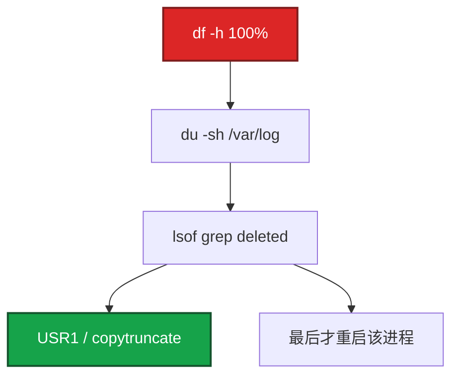

# 22｜日志运维 · 练习题

先自己画图或口述，再对照解答。每题标了覆盖范围：

| 标记 | 含义 |
|------|------|
| **核心** | 不懂整章就没建立起来 |
| **必会** | 值班和面试都要能讲 |
| **常用** | 线上会反复碰到 |
| **常考** | 白板和追问的高频口径 |

## 本题目录

- [Q1 盘满 / logrotate](#q1)
- [Q2 journald / rsyslog 分工](#q2)
- [Q3 ELK vs Loki](#q3)
- [Q4 Filebeat 多行与重复](#q4)
- [Q5 JSON 与分级](#q5)
- [Q6 ES 撑不住 / 丢失](#q6)
- [Q7 Loki 查询](#q7)
- [Q8 日志告警 vs 探活](#q8)
- [Q9 Docker overlay](#q9)
- [Q10 rotate 没切](#q10)
- [合上书](#合上书)

---

## Q1

**★★★★★｜日志把磁盘写满了，怎么处理？logrotate 怎么配？**

**覆盖**：核心 · 必会 · 常考

### 场景

活动开始 2 小时，游戏服磁盘 100%，登录失败。有人 `rm /var/log/game/*.log`，`df` 还是 100%。

### 完整解答



空间不释放是 14 的经典：删的是目录项，inode 还在。治理是 **轮转 + reopen**，不是加一块盘当根因。不要先 kill 逻辑服。

不会 reopen 的自研服：`daily / rotate 7 / copytruncate / compress / delaycompress / missingok / notifempty / dateext`。nginx/rsyslog：`create` + `postrotate` 里 USR1，去掉 copytruncate。journald：`SystemMaxUse`，应急 vacuum。Docker json-file：`max-size`/`max-file`。

### 再追问

copytruncate 有什么缺点？——拷贝时仍在写，可能丢或重复一行。比盘满值得。能 USR1 就不要用它。

---

## Q2

**★★★★☆｜journald / rsyslog / 应用文件怎么分工？**

**覆盖**：核心 · 必会 · 常用

### 场景

所有业务 `print` 打到 syslog，messages 一天 50G。journal 没限额，/run 也爆。

### 完整解答

systemd 服务 stdout → journald（必须 `SystemMaxUse`）。认证 / cron / 内核 → rsyslog → `/var/log/secure`、`cron`、`messages`。游戏业务 → 独立目录 + logrotate，不要挤 messages。

转发：`*.* @@logserver:514` 把系统日志离机（17 审计也要离机）。应用更常用 Filebeat 直读文件。两套抢一个文件会轮转打架。

### 再追问

journal 只放内存行不行？——重启丢、占 tmpfs。生产持久化并封顶。排障用 `journalctl -u`，采集不要无限 `-f`。

---

## Q3

**★★★★★｜ELK 和 Loki 怎么选？**

**覆盖**：核心 · 必会 · 常考

### 场景

老板要「像搜谷歌一样搜日志」，也要「别那么贵」。

### 完整解答

要 **正文关键词 / 玩家 ID** → ELK（倒排）。只要 **service + level + 时间**、已有 Grafana、成本敏感 → Loki（只索引 label）。

可以拆：基础与 K8s 平台日志 Loki（集群形态 04-19）；客服搜角色行为 ELK。不是信仰。Loki 把 player_id 当 label = 高基数爆炸。ID 放行内过滤。

### 再追问

你们生产用哪个？——按场景答拆分，不要只站队。

---

## Q4

**★★★★☆｜Java 堆栈 Filebeat 怎么合成一条？重复采集呢？**

**覆盖**：必会 · 常用

### 场景

异常在 Kibana 里碎成 40 行，grep 不全。重启 Filebeat 后昨天的日志又进了一遍。

### 完整解答

```yaml
multiline.pattern: '^[0-9]{4}-[0-9]{2}-[0-9]{2}'
multiline.negate: true
multiline.match: after
```

行首是日期的是新事件；否则追加。pattern 要和真实行首一致。

重复：registry（`/var/lib/filebeat/registry`）丢了会从头读；两个 Filebeat 盯同一路径；rotate 后 inode 变，配置没处理 renamed。

### 再追问

Logstash grok 失败会怎样？——解析失败进 `_grokparsefailure` 或原样。JSON 日志少 grok。先改应用输出，再堆滤镜。

---

## Q5

**★★★★☆｜为什么生产要 JSON？关键字段有哪些？级别怎么开？**

**覆盖**：必会 · 常用 · 常考

### 场景

每条前面加了明文，Logstash grok 随版本改格式一直炸。另有人生产全开 DEBUG。

### 完整解答

1. 采集直接 decode，少 grok。
2. `level`、`player_id`、`trace_id` 当字段滤。
3. `trace_id` 串指标和链路。

必备：`@timestamp`（UTC）、`level`、`service`、`message`；尽量 `trace_id`、`error`、`duration_ms`；业务 ID 注意脱敏。DEBUG 生产关掉。级别当开关，不当「全打 DEBUG 再靠 ES 滤」。保留：应用热 7d，访问更短，审计 1y+。

### 再追问

时间戳用本机 localtime 行不行？——不行。存 UTC（19）。Kibana 再转。否则合服、跨 Region 时间线错。

---

## Q6

**★★★★☆｜ES 磁盘撑不住？日志中途丢了怎么查？**

**覆盖**：必会 · 常用

### 场景

活动日志洪峰，ES reject，Kibana 缺 10 分钟。

### 完整解答

降本：ILM 热→温→冷→删；200 采样、错误全留；Kafka 挡洪峰；冷数据进 OSS。审计日志按合规留 1 年+，不要和访问日志同一套 7 天。

丢了按链路看指标，不要猜：Filebeat queue → Kafka consumer lag → Logstash 慢 → ES rejected / 磁盘 / 线程池。

### 再追问

加 Kafka 一定不丢吗？——队列也会满。满了要有策略（阻塞、丢弃、死信）。Kafka 是削峰，不是无限水坝。

---

## Q7

**★★★★☆｜Loki 查询怎么写？和 ES 思维差在哪？**

**覆盖**：必会 · 常用

### 场景

有人在 Loki 里搜「任意一句话」，扫半天超时。

### 完整解答

先缩流（label）再扫内容：

```
{service="game-server"} |= "ERROR"
{service="game-server"} | json | level="error"
rate({service="game-server"} |= "ERROR" [5m])
```

ES 是倒排，随便关键词。Loki 无全文索引，label 选错就全表扫。高基数 label 禁止。

### 再追问

status 抽成 label 行不行？——HTTP status 基数低（几十个）可以。URL path、玩家 ID 不行。

---

## Q8

**★★★★☆｜日志告警和探活告警怎么分工？**

**覆盖**：必会 · 常考

### 场景

ERROR 一多就打电话，活动正常刷错误也打。入口挂了却没人知道，因为进程还在打 INFO。

### 完整解答

入口死活用 **blackbox / 进程 / SLO**（21）。日志告警证明「错误在涨、有异常模式」，阈值要有 burst 和级别，避免活动 INFO/WARN 噪声。FATAL、支付 ERROR 可以 P0；DEBUG 泄漏不能进生产。

ElastAlert frequency、Grafana LogQL、或日志抽指标进 Prom，都是同一思想：速率，不是单条。

### 再追问

audit.log 要不要进 ES？——要离机（17）。可以进独立索引、更长保留、更严权限。不要和游戏 DEBUG 混一个 index。

---

## Q9

**★★★★☆｜Docker 把节点 overlay 写满，谁的责任？**

**覆盖**：必会 · 常用

### 场景

容器 json-file 无上限，活动 access 日志在容器里打满节点。K8s 还没上。

### 完整解答

daemon.json 设 `max-size`、`max-file`。应用仍应打 stdout 有节制或挂卷 + logrotate。这是 **主机日志** 问题。上 K8s 后 kubelet 轮转在 04-19，不要用那章代替裸 Docker 主机的配置。

### 再追问

lsof deleted 是容器里的还是宿主机？——在 **实际写文件的那个 mount 命名空间** 看。宿主机 `lsof` 能看到容器进程握着的已删文件。别只进容器 `df`。

---

## Q10

**★★★★☆｜logrotate 跑了但文件还在长，nginx 没切？**

**覆盖**：常用 · 常考

### 场景

`/etc/logrotate.d/nginx` 有了，access.log 10G。日期文件没生成。

### 完整解答

1. 是否真的被 cron/timer 调了：`logrotate -d /etc/logrotate.conf` 调试。
2. 路径是否匹配、权限能否 rename。
3. nginx 是否 USR1：没 reopen 会继续写旧 inode，看起来「没切」。
4. `missingok`/`notifempty` 会让空文件跳过，不是这个症状。
5. SELinux 拦 rename（17 AVC）。

### 再追问

delaycompress 是什么？——今天切的先不压，明天再压昨天的，避免还在 reopen 窗口的文件被 gzip。

---

## 合上书

- [ ] 能按 df → du → lsof deleted 处理盘满，而不是先加盘
- [ ] 能说出 journald / rsyslog / 应用目录分工，SystemMaxUse 必设
- [ ] 能区分 copytruncate 与 USR1，Docker json-file 必须有上限
- [ ] 能配 Filebeat multiline，并解释 registry 重复采集
- [ ] 能按场景拆 ELK / Loki，禁止 player_id 当 label
- [ ] 能按段查丢失，并说明 Kafka 不是无限水坝
- [ ] 能把日志告警和 21 的探活分开；JSON + UTC + 级别开关
