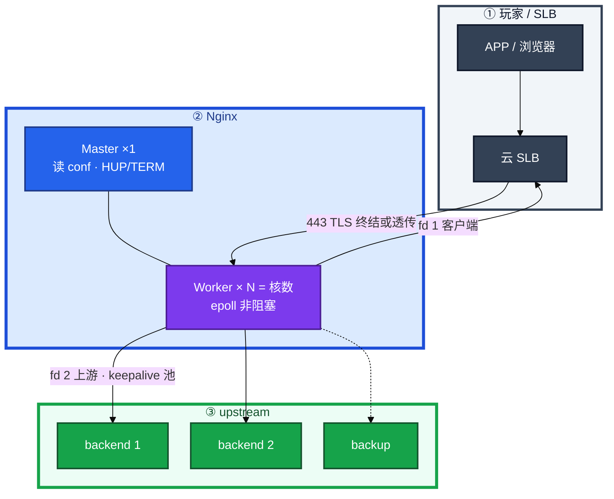
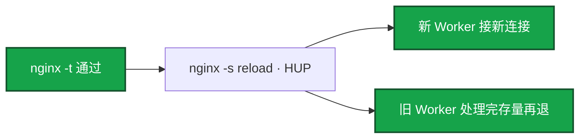
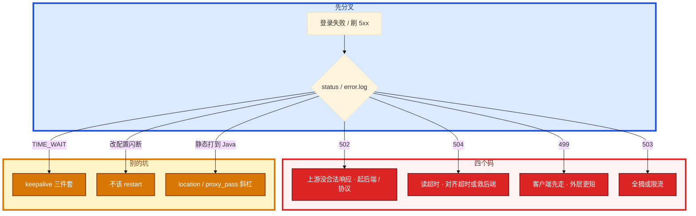

# Nginx


活动登录全 502。有人重启全部逻辑服，error.log 里其实是 `Connection refused`。另一次改个 header，有人 `systemctl restart nginx`，大厅 HTTP 长轮询全断。群里还有人要把战斗 TCP 挂到 Nginx「统一入口」——先别动手。

**本章主线（排障就按这三步想）：**

1. **超时外短内长**：客户端先走是 499，Nginx 先走是 504。
2. **keepalive 三件套**：`keepalive N` + HTTP/1.1 + `Connection ""`。
3. **先 `-t` 再 reload**；战斗长连接不走 HTTP 反代。

**读完你能：** 502/504/499/503 对上 error.log；超时链外短内长；reload 不掐连接；upstream keepalive 真开起来；活动接口 limit_req；证书用 blackbox 盯过期。

## 本章目录

- [1. 基本概念](#1-基本概念)
- [2. 架构图](#2-架构图)
- [3. 原理](#3-原理)
- [4. 落地](#4-落地)
- [5. 核心配置](#5-核心配置)
- [6. 命令与操作](#6-命令与操作)
- [7. 生产排障](#7-生产排障)
- [8. 必会 · 常考](#8-必会--常考)
- [合上书](#合上书问自己)

**本章不讲：** APISIX、动态路由、插件、etcd 热更新 → [03-04 接入网关](../../03-中间件与数据库/04-接入网关/)；HTTP 语义、TLS 握手细节 → [09 HTTP 与 TLS](../09-HTTP与TLS/)；TIME_WAIT、somaxconn → [08](../08-TCP与UDP/)、[18](../18-内核参数与sysctl/)；LVS 四层模式 → [16](../16-LVS与四层负载均衡/)；HAProxy TCP、Keepalived → [24](../24-HAProxy与Keepalived/)；证书过期告警怎么接到人 → [21](../21-监控与告警/)。

---

## 1. 基本概念

Nginx 是 **Master + 多个 Worker**。Master 读配置、收信号、拉起 Worker，**不处理业务连接**。Worker 单线程 epoll，一个进程扛大量连接。`worker_processes auto` = CPU 核数；多于核数只会多切换，不会更快。

**值班里怎么认现象**（先听玩家/监控怎么说，再对表）：

| 玩家/监控说的 | 技术含义 | 你的第一刀 |
|---------------|----------|------------|
| 「登录一直转圈」 | 504 或 ttfb 慢 | access 两列时间 + error.log |
| 「闪一下失败」 | 502 refused 或 503 | error.log `connect refused` |
| 「活动领奖刷不出来」 | 限流 429/503 或后端慢 | limit_req 日志 + 上游 health |
| 「改配置后全断」 | restart 不是 reload | 问是不是 `systemctl restart` |

| 术语 | 值班里什么时候碰到 | 定义 |
|------|-------------------|------|
| Master | reload / 升级 | 管进程，不接请求 |
| Worker | 连接数飙、CPU 高 | epoll 接连接，反代占 2 fd |
| location | 静态打到 Java、路径错 | URL 匹配规则，有优先级 |
| upstream | 502/503、TIME_WAIT 爆 | 后端池 + 负载算法 + keepalive |
| proxy_pass | 改 URI 后 404 | 反代目标，尾斜杠影响路径 |

游戏场景：**HTTP API / 登录 / 静态资源** 用 Nginx。战斗 TCP 长连接走 [16](../16-LVS与四层负载均衡/) / [24](../24-HAProxy与Keepalived/) 四层，不要用 HTTP 反代扛帧同步。stream 模块也能四层，能，但不是这个量级的默认答案。

反代一条请求占 **2 个 fd**（对客户端一个，对 upstream 又一个）。最大连接约 `worker_processes × worker_connections`，还要 ≤ `worker_rlimit_nofile` ≤ 进程 `ulimit`（18）。反代时按 **2 倍** 估 fd。

location 优先级：`=` 精确 > `^~` 前缀（不再走正则）> 正则 `~` 按文件顺序 > 最长前缀。`proxy_pass` 带不带尾斜杠会改 URI。改完 `nginx -t`，`curl -v` 看真实路径。

四层 vs 七层（和 16/24 对齐）：七层理解 Host、路径、证书、缓冲、超时，适合登录支付灰度。长连接没有「一次请求结束」，解析层会变成缓冲和超时的事故源。

> **记住**：Master 管进程，Worker 接连接。reload 是换 Worker，不是重启整台机器。战斗长连接不要走 HTTP 反代。

**面试怎么说**：「Nginx 我用来扛 HTTP 登录和静态，战斗 TCP 走四层 LB；反代按 2 fd 估连接上限，排障先看 error.log 和 access 两列时间。」

---

## 2. 架构图

后面超时链、状态码、keepalive 都对着这张图。



**读图三句话：**

1. **Master 不接请求。** HUP 换 Worker；TERM/kill -9 才拆连接。
2. **反代两个 fd。** 连接上限按 2 倍估，再对 18 的 LimitNOFILE。
3. **超时链在 SLB → Nginx → 应用 → DB 上对齐。** 反了就会 499 满天飞或 504。

三种生产形态：静态 `root`；七层 `proxy_pass`；证书在本机终结。精细四层 TCP、主动 HTTP 探活 → 前面再挂 HAProxy（24）或内核 LVS（16）。

---

## 3. 原理

### 3.1 超时链：外短内长

**一句话：** 必须外短内长；客户端先走是 499，Nginx 先走是 504。

**打个比方**：像接力赛交棒——APP 15 秒就离场了，Nginx 还举着棒等 60 秒，棒掉地上记 499；反过来 Nginx 30 秒先喊停，玩家还在等，就是 504。

**现场走一遍**（活动登录 499 和 504 同时飞）：

1. 跳板机看 access 日志两列时间：

```bash
tail -20 /var/log/nginx/access.log | awk '{print $9,$NF,$(NF-1)}'
```

2. 屏幕出现：

```text
499 3.512 3.498
504 30.001 29.998
200 0.045 0.042
```

3. **说明什么**：第一行 status 499，`$request_time` 3.5s、`$upstream_response_time` 也接近 3.5s → 客户端在 ~3.5s 先断，后端还在算。第二行 504，总时间卡在 30s → Nginx `proxy_read_timeout` 到期。

4. 对齐三层超时（示例：APP 15s < SLB 20s < Nginx 25s < Java 30s）：

```bash
nginx -T | grep -E 'proxy_read_timeout|proxy_connect|proxy_send'
```

5. 只把 Nginx 调到 300s、SLB 还是 60s → 玩家侧仍是 499。**先对齐整条链，再优化慢查询。**


**输出解读**：

| 字段 | 含义 | 怎么读 |
|------|------|--------|
| `$request_time` | Nginx 看的总时间 | 含 ssl、写客户端、缓冲 |
| `$upstream_response_time` | 上游处理时间 | 接近总时间 → 后端慢 |
| 总时间 >> 上游 | 卡在 Nginx 侧 | ssl、缓冲、写慢客户端 |
| 499 + 上游仍大 | 客户端先走 | 查更外层超时，不是只调 Nginx |

`proxy_buffering` 一般 API **on**，避免上游被慢客户端拖死。`off` 边收边转，占 Worker 更久，适合特殊流。

**面试怎么说**：「超时链必须外短内长。499 是客户端先断，504 是 Nginx 读上游超时。我只加大 Nginx 超时消不了 499，因为 APP 或 SLB 更短。」

> **记住**：HTTP 才有完整 tls 段；纯反代看 connect 和 read 就够。改超时先画整条链。

### 3.2 状态码：502 / 504 / 499 / 503

**一句话：** 502 没合法上游响应；504 是读超时；499 客户端先走；503 无可用上游或限流。

**打个比方**：502 是快递到了仓库门口发现没人签收（refused/协议错）；504 是签收员等太久走了（读超时）；499 是买家取消订单（客户端先断）；503 是仓库关门或限流（全摘/限流）。

**现场走一遍**（登录接口全 502，有人要重启战斗服）：

1. 先看 error.log，别猜：

```bash
tail -50 /var/log/nginx/error.log | grep -iE 'upstream|connect|timed out|refused|invalid'
```

2. 屏幕出现：

```text
2026/08/28 14:02:11 [error] connect() failed (111: Connection refused) while connecting to upstream, client: 10.0.0.5, server: api.game.com, request: "POST /api/login HTTP/1.1", upstream: "http://10.0.1.20:8080/api/login"
```

3. **说明什么**：111 = refused，上游 **10.0.1.20:8080 没进程在听**——起大厅服，别重启 Nginx，更别重启战斗服。

4. 验证上游：

```bash
curl -v http://10.0.1.20:8080/health
ss -tlnp | grep 8080
```

5. 若 error.log 是 `upstream timed out` → 504，对齐超时或救后端。`no live upstreams` → 全被 max_fails 摘掉或限流。

**输出解读**：

| status | error.log 关键字 | 含义 | 第一刀 |
|--------|------------------|------|--------|
| **502** | `connect refused` | 没监听 | `ss -lntp`、起后端 |
| **502** | `invalid header` | 不是 HTTP | curl -v 看首字节 |
| **502** | `prematurely closed` | 上游崩或 keepalive 错 | OOM/137、三件套 |
| **504** | `upstream timed out` | 读超时 | 超时链、慢查询 |
| **499** | 常无 error | 客户端先断 | 外层超时更短 |
| **503** | `no live upstreams` | 全摘 | 后端 health |
| **503/429** | limit_req | 限流 | 看 zone 配置 |

| 码 | 含义 | 常见因 |
|----|------|--------|
| **502** | 没拿到合法上游响应 | 没起来、拒连、协议乱、过早关连接 |
| **504** | 连上了，读超时内没回完 | 后端慢、超时太短 |
| **499** | 客户端先断开 | 更上游超时更短、玩家取消 |
| **503** | 无可用上游或限流 | max_fails 全摘、limit_req/conn |

`limit_req_status 429` 就 429；默认可能 503。conn 限制常用 503。和「上游全死」的 503 要靠日志区分。

**面试怎么说**：「502 我对 error.log：refused 起后端，timed out 是 504 不是 502，invalid header 查协议。活动高峰我不会为了做点什么去重启还在跑的战斗进程。」

### 3.3 upstream：算法、摘除、keepalive

**一句话：** keepalive 三件套缺一不可；开源 Nginx 健康检查偏被动 max_fails。

**打个比方**：upstream 像出租车调度站——`least_conn` 看谁车上人少，`ip_hash` 让同一乘客总坐同一辆车（换出口就迷路），keepalive 是车不熄火直接接下一单（少三件套就每单都重新打火）。

**现场走一遍**（配置了 keepalive 但后端 TIME_WAIT 仍爆，见 08/18）：

1. 看生效配置：

```bash
nginx -T | grep -A15 'upstream backend'
```

2. 屏幕只有：

```nginx
upstream backend {
    server 10.0.0.1:8080;
    keepalive 32;
}
```

3. **说明什么**：少了 `proxy_http_version 1.1` 和 `proxy_set_header Connection ""`——等于没开池，每次新建 TCP。

4. 补全三件套后 reload：

```nginx
upstream backend {
    least_conn;
    server 10.0.0.1:8080 max_fails=3 fail_timeout=30s;
    server 10.0.0.2:8080 max_fails=3 fail_timeout=30s;
    server 10.0.0.3:8080 backup;
    keepalive 32;
}
server {
    location / {
        proxy_http_version 1.1;
        proxy_set_header Connection "";
        proxy_pass http://backend;
    }
}
```

5. `nginx -t && nginx -s reload`，再在 upstream 机器上看 TIME_WAIT 是否下降。

**输出解读**：

| 算法 | 何时用 | 坑 |
|------|--------|-----|
| 轮询 | 后端差不多 | 默认 |
| weight | 机器规格不一 | — |
| ip_hash | 有状态会话粘滞 | NAT 出口变就破功 |
| least_conn | 长连接、耗时不均 | 慢机可能吸走连接 |
| hash / consistent | 按 key 粘滞 | 看版本/模块 |
| random | 大规模 | — |

开源 Nginx 健康检查是 `max_fails` / `fail_timeout`，被动失败才摘。主动 HTTP 探活要模块或商业版，或前面再挂 HAProxy（24）。全摘 → `no live upstreams` 503。backup 只在全挂时上。

keepalive **32～100** 常见，配合后端超时；不是越大越好。客户端 HTTP/2 到 Nginx，到上游仍常是 1.1 池，两段别混。

**面试怎么说**：「keepalive 必须三行：upstream 里 keepalive N、location 里 HTTP/1.1 和 Connection 空串。开源 Nginx 探活靠 max_fails，精细主动探活我放 HAProxy 或商业版。」

> **记住**：keepalive 必须 `keepalive N` + HTTP/1.1 + `Connection ""`。超时必须外短内长。

---

## 4. 落地

| 项 | 选 | 不选 |
|----|----|------|
| 场景 | HTTP API、静态、TLS 终结 | 战斗 TCP 长连接 |
| 进程数 | `worker_processes auto` | 多于核数 |
| 连接 | connections 10240+，rlimit 65535 | 不估 2 fd |
| 日志 | access 含两列时间 | 只有 status |
| 变更 | `nginx -t` → reload | restart / kill -9 |
| 证书 | fullchain + blackbox 7 天 | 等玩家报 expired |

全局示意：

```nginx
worker_processes auto;
worker_rlimit_nofile 65535;

events {
    worker_connections 10240;
    use epoll;
    multi_accept on;
}

http {
    sendfile on;
    tcp_nopush on;
    tcp_nodelay on;
    keepalive_timeout 65;
    keepalive_requests 1000;

    log_format main '$remote_addr - [$time_local] "$request" $status '
                    '$request_time $upstream_response_time';
    # gzip、upstream、server 块见第 5 节
}
```

`tcp_nodelay on` 关 Nagle；高流量 `access_log ... buffer=32k flush=5s`。HTTPS 80 跳 443，证书用 **fullchain**；`client_max_body_size` 不够会 413。systemd `LimitNOFILE=65535` 对齐 rlimit（18）；`worker_shutdown_timeout 30s`。路径 `/etc/nginx/`；日志走 22 rotate。验收：`nginx -t` → `curl -vI` → 经 SLB 探（21）→ 停一个 upstream 看摘除。

---

## 5. 核心配置

只动有证据的项。改完 **先 `-t` 再 reload**。语法错时 reload 会拒绝换代，旧 Worker 继续。

| 参数 | 建议 | 改错会怎样 |
|------|------|------------|
| worker_processes | **auto** | 多于核数抢 CPU |
| worker_connections | **10240+** | 反代 ×2 fd |
| worker_rlimit_nofile | **65535** | 连接数上不去 |
| proxy_read_timeout | 外短内长对齐 | 499 或 504 满天飞 |
| keepalive 三件套 | 缺一不可 | TIME_WAIT 爆 |
| max_fails / fail_timeout | 被动摘 | 全摘 503 |
| gzip | API JSON 可开 | 已压缩的别再压 |
| ssl_protocols | **TLSv1.2 / 1.3** | 允许 1.0 = 扣分 |
| client_max_body_size | 按上传/热更包 | 太小 413 |
| ssl_certificate | **fullchain** | 缺中间证客户端失败 |
| stub_status | 仅监控网 | 对公网泄容量 |

反代 location 模板：

```nginx
location /api/ {
    proxy_pass http://backend;
    proxy_connect_timeout 5s;
    proxy_send_timeout 60s;
    proxy_read_timeout 60s;
    proxy_http_version 1.1;
    proxy_set_header Connection "";
    proxy_set_header Host $host;
    proxy_set_header X-Real-IP $remote_addr;
    proxy_set_header X-Forwarded-For $proxy_add_x_forwarded_for;
    proxy_set_header X-Forwarded-Proto $scheme;
    proxy_buffering on;
}
```

TLS（算法细节 09）：

```nginx
listen 443 ssl http2;
ssl_certificate     /etc/nginx/ssl/fullchain.pem;
ssl_certificate_key /etc/nginx/ssl/privkey.pem;
ssl_protocols TLSv1.2 TLSv1.3;
ssl_session_cache shared:SSL:10m;
ssl_stapling on;
add_header Strict-Transport-Security "max-age=63072000" always;
```

证书轮转：新 fullchain → `nginx -t` → reload → blackbox 看 `probe_ssl_earliest_cert_expiry`。**7 天 P1**（21）。

> **记住**：先 `-t` 再 reload。access 日志必须有两列时间。

---

## 6. 命令与操作

值班先跑：`-t`、error.log、上游通不通、ss、upstream 配置。

```bash
nginx -t
nginx -T | grep -A20 upstream
nginx -s reload
tail -100 /var/log/nginx/error.log | grep -iE 'upstream|connect|timed out|refused'
curl -v http://backend:8080/health
ss -tlnp | grep 8080
ss -s
awk '$9 ~ /^5/ {print $7}' /var/log/nginx/access.log | sort | uniq -c | sort -rn | head
```

| 目的 | 命令 | 看什么 |
|------|------|--------|
| 语法 | `nginx -t` | reload 前必过 |
| 生效配置 | `nginx -T` | location / upstream 真值 |
| 平滑 | `nginx -s reopen` / `reload` | 日志切；换 Worker |
| 502/504 | error.log 关键字 | refused / timed out |
| 慢在哪 | access 两列时间 | 上游 vs 总时间 |
| 5xx 路径 | awk 按 `$status` | 哪个 URI |

### 6.1 reload：平滑换 Worker



`systemctl restart` = 先停掉所有连接再起，生产会闪断。`kill -9` 等于把长连接全掐。配置语法错时新 Worker 起不来，旧配置继续——所以先 `-t`。

### 6.2 限流

活动领奖被刷，单 IP 把登录打满：

```nginx
limit_req_zone $binary_remote_addr zone=api_limit:10m rate=100r/s;
limit_conn_zone $binary_remote_addr zone=conn_limit:10m;

location /api/ {
    limit_req zone=api_limit burst=200 nodelay;
    limit_req_status 429;
    proxy_pass http://backend;
}
location /download/ {
    limit_conn conn_limit 10;
    limit_conn_status 503;
}
```

`rate` 长期速率；`burst` 桶深；`nodelay` 突发立刻处理。活动出口 NAT 会让「按 IP」变成「按整栋楼」，要换 key 或上 03-04 按玩家 ID。限流 429 要进面板（21 RED）。

### 6.3 证书与动静分离

静态 `root` + `expires`，`access_log off`。动态才 `proxy_pass`。`proxy_cache` 给可缓存接口；玩家私有接口不要 cache。监控 21 blackbox，**7 天 P1**。

---

## 7. 生产排障

三问：进程还在？玩家看到的码是哪一个？超时链谁最短？



现场顺序：error.log → 进程和端口 → `curl` 上游 → 连接数 → `nginx -T` upstream。access 两列时间判断慢在 Nginx 还是上游。

| 现象 | 先做什么 | 不要做什么 |
|------|----------|------------|
| 大量 502 + refused | 起后端 | 重启 Nginx / 战斗服 |
| 499 + 504 同时 | 对齐超时链 | 只把 Nginx 调到 300s |
| keepalive 写了仍 TIME_WAIT | 补 HTTP/1.1 和 Connection "" | 再加大 keepalive 到几千 |
| restart 后长轮询全断 | 改用 reload | kill -9 |
| 领奖被刷 | limit_req + burst | 先扩一倍机器当根因 |
| invalid header | curl -v 看首字节 | 当网断了乱重启 |
| P99 2s 去优 gzip | 先看两列时间 | 先动装饰项 |
| 证书玩家报 expired | 21 blackbox 7 天 | 等浏览器 |

活动高峰：先对码和超时链，停止发版和重启战斗服，再限流保登录。

---

## 8. 必会 · 常考

| 说法 | 对错 | 口径 |
|------|:----:|------|
| Master 接业务连接 | 错 | Worker 接；Master 管进程 |
| worker 数越多越快 | 错 | auto = 核数 |
| 战斗长连接走 Nginx HTTP 反代 | 错 | 四层 16/24 |
| 502 就是上游超时 | 错 | 502 没合法响应；超时是 504 |
| 499 是 Nginx 的锅 | 错 | 客户端先走 |
| 只加大 Nginx 超时能消 499 | 错 | 外层更短仍 499 |
| keepalive 只写 upstream 一行 | 错 | 必须三件套 |
| restart 和 reload 一样平滑 | 错 | restart 断连接 |
| 语法错 reload 会带着错误配置上 | 错 | 拒绝换代，旧 Worker 继续 |
| 开源 Nginx 主动 HTTP 探活很强 | 错 | 被动 max_fails；主动看 24 |
| ip_hash 换 NAT 出口还粘 | 错 | 破功 |
| limit_req 默认一定 429 | 错 | 要 `limit_req_status` |
| 客户端 HTTP/2 则上游也是 2 | 错 | 上游常仍 1.1 池 |
| 证书等玩家报 | 错 | blackbox 7 天 |
| 平均值当延迟 SLA | 错 | P99 |
| APISIX 能让这章超时链作废 | 错 | 哪层网关都成立 |

数字：反代 **2 fd**；connections **10240+**；rlimit **65535**；keepalive **32～100**；`max_fails=3` `fail_timeout=30s`；证书 **7 天**；HSTS `max-age=63072000`；limit 例 **100r/s burst 200**。

易混：502 vs 504 vs 499 vs 503；reload vs restart vs reopen；三件套缺哪行；limit_req vs limit_conn；429 vs 503；location 优先级；proxy_pass 斜杠；四层 vs 七层。

---

## 合上书，问自己

1. Master / Worker 谁接连接？反代几个 fd？战斗为什么不走 Nginx？
2. 超时为什么必须外短内长？499 和 504 各是谁先走？
3. keepalive 三件套是哪三行？少了为什么 TIME_WAIT 爆？
4. reload 和 restart 差在哪？为什么必须先 `-t`？
5. 活动接口怎么限流？burst / nodelay 干什么？
6. 证书要配哪些？过期谁告警？动静分离什么时候上？

六题都能口述，这一章就过了。下一章把四层 LB 和 VIP 漂起来：HAProxy、VRRP、脑裂。
