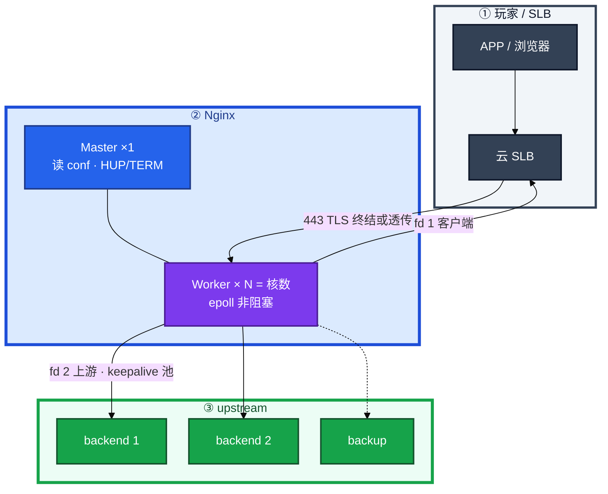
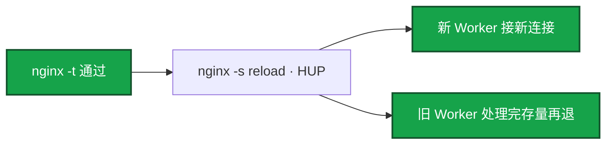
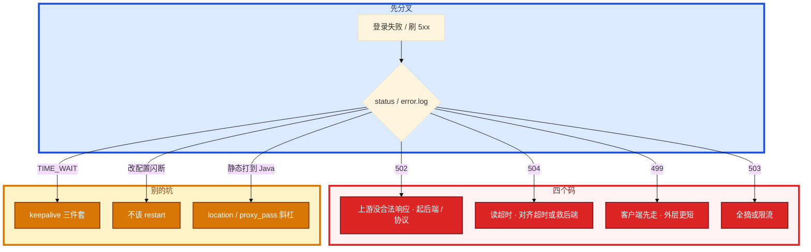

# Nginx


活动登录全 502。有人重启全部逻辑服。error.log 里其实是 `Connection refused`。另一次改个 header，有人 `systemctl restart nginx`，大厅 HTTP 长轮询全断。群里还有人要把战斗 TCP 挂到 Nginx「统一入口」。

先别动手。这一章后半全是你会动手的：**怎么读 error.log、怎么配超时链、怎么 reload、keepalive 三件套、限流和证书。** 前面的 Master/Worker 和 status 码，是为了让你动手时不选错路。

**读完你能：** 502/504/499/503 对上 error.log；超时外短内长；reload 不掐连接；upstream keepalive 真开起来；活动接口 limit_req；证书用 blackbox 盯过期。

## 本章目录

缩进 = 上下级。3 下面才是 3.1。

想钉在**正文左边**跟着滚：菜单 **查看 → 打开视图 → 大纲**。Markdown 预览做不到独立左栏，目录只能写在文章开头。

- [1. 基本概念](#1-基本概念)
- [2. 架构图](#2-架构图)
- [3. 原理](#3-原理)
  - [3.1 超时链](#31-超时链外短内长)
  - [3.2 状态码](#32-状态码502--504--499--503)
  - [3.3 upstream](#33-upstream算法摘除keepalive)
- [4. 安装部署](#4-安装部署)
- [5. 核心配置](#5-核心配置)
- [6. 常用命令](#6-常用命令)
- [7. 常用操作](#7-常用操作)
  - [7.1 reload](#71-reload平滑换-worker)
  - [7.2 限流](#72-限流)
  - [7.3 证书与动静分离](#73-证书与动静分离)
- [8. 生产排障](#8-生产排障)
- [9. 必会 · 常考](#9-必会--常考)
- [合上书](#合上书问自己)

**本章不讲：** APISIX、动态路由、插件、etcd 热更新 → [03-04 接入网关](../../03-中间件与数据库/04-接入网关/)；HTTP 语义、TLS 握手细节 → [09 HTTP 与 TLS](../09-HTTP与TLS/)；TIME_WAIT、somaxconn → [08](../08-TCP与UDP/)、[18](../18-内核参数与sysctl/)；LVS 四层模式 → [16](../16-LVS与四层负载均衡/)；HAProxy TCP、Keepalived → [24](../24-HAProxy与Keepalived/)；证书过期告警怎么接到人 → [21](../21-监控与告警/)。

---

## 1. 基本概念

Nginx 是 **Master + 多个 Worker**。Master 读配置、收信号、拉起 Worker，**不处理业务连接**。Worker 单线程 epoll，一个进程扛大量连接。`worker_processes auto` = CPU 核数。多于核数只会多切换，不会更快。事件驱动 vs 一连接一线程：内存低、切换少。Linux 用 epoll。

游戏：**HTTP API / 登录 / 静态资源** 用 Nginx。战斗 TCP 长连接走 16/24 四层，不要用 HTTP 反代扛帧同步。stream 模块也能四层，能，但不是这个量级的默认答案。

反代一条请求占 **2 个 fd**（对客户端一个，对 upstream 又一个）。最大连接约 `worker_processes × worker_connections`，还要 ≤ `worker_rlimit_nofile` ≤ 进程 `ulimit`（18）。反代时按 **2 倍** 估 fd。

location 优先级：`=` 精确 > `^~` 前缀（不再走正则）> 正则 `~` 按文件顺序 > 最长前缀。`proxy_pass` 带不带尾斜杠会改 URI。改完 `nginx -t`，`curl -v` 看真实路径。

四层 vs 七层（和 16/24 对齐）：七层理解 Host、路径、证书、缓冲、超时，适合登录支付灰度。长连接没有「一次请求结束」，解析层会变成缓冲和超时的事故源。

> **记住**：Master 管进程，Worker 接连接。reload 是换 Worker，不是重启整台机器。战斗长连接不要走 HTTP 反代。

---

## 2. 架构图

先把整张图钉住。后面安装、命令、排障都对着这张图说话。



图上三条线：

1. **Master 不接请求。** HUP 换 Worker；TERM/kill -9 才拆连接。
2. **反代两个 fd。** 连接上限按 2 倍估，再对 18 的 LimitNOFILE。
3. **超时链在 SLB → Nginx → 应用 → DB 上对齐。** 反了就会 499 满天飞或 504。

三种生产形态：静态 `root`；七层 `proxy_pass`；证书在本机终结。精细四层 TCP、主动 HTTP 探活 → 前面再挂 HAProxy（24）或内核 LVS（16）。

---

## 3. 原理

原理只保留动手会用到的：谁先超时、四个码、upstream 为什么 keepalive 假开。

**本节 3 块：** 3.1 超时链 · 3.2 状态码 · 3.3 upstream

### 3.1 超时链：外短内长

反了就会 **499 满天飞、后端还在算**，或 **504 而浏览器还在转圈**。

必须 **客户端 < Nginx < 应用**（读超时）。客户端最短：它先走 → Nginx 记 **499**（Client Closed Request）。Nginx 最短：等上游到期 → **504**。上游从未连上 / 直接 RST / 非 HTTP → **502**。


场景：玩家 APP 15s，Nginx 60s，Java 120s。活动时 499 和 504 都有。APP 先断 → 499，Java 还在算、写库。只把 Nginx 调到 300s、SLB 还是 60s，玩家侧仍是 499。先对齐（例如 15 < 20 < 30），再优化慢查询。

SLB 60s、Nginx 30s：Nginx 先 504，玩家看到失败，SLB 还没到自己的超时。外层更长、里层更短，504 为主。

`$request_time` 是 Nginx 看的总时间；`$upstream_response_time` 是上游。499/504 要对这两列，不要只看 status。上游时间≈总时间 → 后端慢。总时间远大于上游 → 卡在 Nginx（ssl、写客户端、缓冲、磁盘 log）。499 时上游可能仍很大（客户端不等）。

`proxy_buffering` 一般 API **on**，避免上游被慢客户端拖死。`off` 边收边转，占 Worker 更久，适合特殊流。

### 3.2 状态码：502 / 504 / 499 / 503

玩家打登录接口，Nginx 反代到大厅。卡住时不要从「服务挂了」倒推，按 status 和 error.log 对号。

| 码 | 含义 | 常见因 | 先看 |
|----|------|--------|------|
| **502** | 没拿到合法上游响应 | 没起来、拒连、协议乱、过早关连接 | `connect refused` / `invalid header` |
| **504** | 连上了，读超时内没回完 | 后端慢、超时太短 | `upstream timed out` |
| **499** | 客户端先断开 | 更上游超时更短、玩家取消 | 对照超时链 |
| **503** | 无可用上游或限流 | `max_fails` 全摘、limit_req/conn | `no live upstreams`、429/503 |

`limit_req_status 429` 就 429；默认可能 503。conn 限制常用 503。和「上游全死」的 503 要靠日志区分。

| error.log | 含义 |
|-----------|------|
| `connect() failed (111: Connection refused)` | 进程没听端口 |
| `connect() failed (110: Connection timed out)` | 网络 / 安全组 |
| `upstream prematurely closed connection` | 上游崩了或短连接关太快；keepalive 配错也会 |
| `upstream sent invalid header` | 不是 HTTP（TLS 打到明文、调试二进制） |
| `no live upstreams` | 全被 max_fails 摘掉 |
| `upstream timed out` | 504 |

不要为了「做点什么」重启还在跑的战斗进程。111 refused：起后端，别先重启 Nginx。

### 3.3 upstream：算法、摘除、keepalive

开源 Nginx 健康检查是 `max_fails` / `fail_timeout`，被动失败才摘。主动 HTTP 探活要模块或商业版，或前面再挂 HAProxy（24）。全摘 → `no live upstreams` 503。先看后端是不是真死，别只加大 fails 掩盖。backup 只在全挂时上。

| 算法 | 何时 |
|------|------|
| 轮询 | 后端差不多 |
| weight | 机器规格不一 |
| ip_hash | 会话粘在同一台（有状态）；换 IP / NAT 出口会破功 |
| least_conn | 长连接、耗时不均；一台慢机可能把连接全吸走 |
| hash / consistent | 按 key 粘滞（开源 hash；一致性哈希看版本/模块） |
| random | 大规模 |

三件套缺一不可，少一行后端 **TIME_WAIT** 照样爆（08、18）：

```nginx
upstream backend {
    least_conn;
    server 10.0.0.1:8080 max_fails=3 fail_timeout=30s;
    server 10.0.0.2:8080 max_fails=3 fail_timeout=30s;
    server 10.0.0.3:8080 backup;
    keepalive 32;
}
server {
    location / {
        proxy_http_version 1.1;
        proxy_set_header Connection "";
        proxy_pass http://backend;
    }
}
```

HTTP/1.0 代理默认 `Connection: close`。少后两行等于没开池，每次新建 TCP。keepalive 太大占满上游 fd、空闲连接过多。32～100 常见，配合后端超时。不是越大越好。

客户端 HTTP/2 到 Nginx，到上游仍常是 1.1 池。两段别混。

> **记住**：keepalive 必须 `keepalive N` + HTTP/1.1 + `Connection ""`。超时必须外短内长；客户端先走是 499，Nginx 先走是 504。

---

## 4. 安装部署

生产怎么选：七层 HTTP/静态走 Nginx；精细 TCP/库端口走 HAProxy；超大四层走 LVS。双机 VIP 在 24。证书文件权限、独立日志盘（不要和 etcd 同盘，21/22）。

清单里必须有的全局（示意）：

```nginx
worker_processes auto;
worker_rlimit_nofile 65535;

events {
    worker_connections 10240;
    use epoll;
    multi_accept on;
}

http {
    sendfile on;
    tcp_nopush on;
    tcp_nodelay on;
    keepalive_timeout 65;
    keepalive_requests 1000;

    gzip on;
    gzip_types text/plain application/json application/javascript text/css;
    gzip_min_length 1024;

    log_format main '$remote_addr - $remote_user [$time_local] '
                    '"$request" $status $body_bytes_sent '
                    '"$http_referer" "$http_user_agent" '
                    '$request_time $upstream_response_time';
}
```

`tcp_nodelay on`：关 Nagle，长连接降延迟。access 日志必须有 **request_time 和 upstream_response_time**，否则 499/504 只能猜。高流量 `access_log ... buffer=32k flush=5s`。静态可 `access_log off` 减 IO。

反代 location：

```nginx
location /api/ {
    proxy_pass http://backend;
    proxy_connect_timeout 5s;
    proxy_send_timeout 60s;
    proxy_read_timeout 60s;
    proxy_set_header Host $host;
    proxy_set_header X-Real-IP $remote_addr;
    proxy_set_header X-Forwarded-For $proxy_add_x_forwarded_for;
    proxy_set_header X-Forwarded-Proto $scheme;
    proxy_buffering on;
    proxy_buffer_size 4k;
    proxy_buffers 8 4k;
}
```

HTTPS server 落地（80 只跳，443 终结；证书用 **fullchain**）：

```nginx
server {
    listen 80;
    server_name api.game.example;
    return 301 https://$host$request_uri;
}

server {
    listen 443 ssl http2;
    server_name api.game.example;
    ssl_certificate     /etc/nginx/ssl/fullchain.pem;
    ssl_certificate_key /etc/nginx/ssl/privkey.pem;
    # ssl_* 套件见第 5 节

    location /static/ {
        alias /var/www/game/static/;
        expires 7d;
        access_log off;
    }
    location /api/ {
        proxy_pass http://backend;
        # 超时、头、keepalive 三件套见上
    }
}
```

`client_max_body_size` 上传/热更包不够会 413，和 504 无关。活动资源包先对这个值，再怪上游。

`stub_status` 只给监控网：`Active connections`、握手排队。不要对公网。指标进 21 的 nginx_exporter 更完整。

`stream {}` 能做四层，生产战斗仍默认 16/24。误用 stream 时超时、proxy_protocol、UDP 都要单独配，不要从 http 块抄。

systemd drop-in：`LimitNOFILE=65535`，与 `worker_rlimit_nofile` 对齐（18）。`ExecReload=/usr/sbin/nginx -s reload`。`worker_shutdown_timeout 30s`，避免旧 Worker 挂着不退。

路径习惯：`/etc/nginx/nginx.conf` 主文件；`conf.d/` 或 `sites-enabled/` 拆 server；证书 `/etc/nginx/ssl/` 权限 600。日志 `/var/log/nginx/` 走 22 的 rotate + USR1。不要和 etcd 数据盘同盘（21 高峰红线）。

验收：`nginx -t` 通过；`curl -vI` 本地 80 跳 443；经 SLB 再探一次（黑盒 21）；error.log 能对上码；`ss -s` 看连接；upstream keepalive 后后端 TIME_WAIT 下降。不要只探 TCP 80/443。故意停一个 upstream，看 max_fails 摘除和 502/503，而不是靠感觉。

---

## 5. 核心配置

只动有证据的项。改完 **先 `-t` 再 reload**。语法错时 reload 会拒绝换代，旧 Worker 继续。

| 参数 | 建议 | 改错会怎样 |
|------|------|------------|
| worker_processes | **auto** | 多于核数抢 CPU，延迟变差 |
| worker_connections | **10240+** | 反代 ×2 fd；还要 ≤ rlimit |
| worker_rlimit_nofile | **65535**，且 > connections | 连接数上不去 |
| multi_accept | on | 高峰建连快；不是「多 Worker」 |
| proxy_read_timeout | 外短内长对齐 | 499 或 504 满天飞 |
| keepalive 三件套 | 缺一不可 | 后端 TIME_WAIT 爆 |
| max_fails / fail_timeout | 被动摘 | 全摘 503；加大 fails 会掩盖真死 |
| gzip | API JSON 可开 | 已经压缩的别再压 |
| open_file_cache | 静态多时开 | — |
| ssl_protocols | **TLSv1.2 / 1.3** | 允许 1.0 = 面试扣分 |
| client_max_body_size | 按上传/热更包 | 太小 413，别当成 504 |
| ssl_certificate | **fullchain** | 缺中间证，部分客户端失败 |
| stub_status | 仅监控网 | 对公网等于泄容量 |

TLS（算法套件细节 09）：

```nginx
listen 443 ssl http2;
ssl_certificate     /etc/nginx/ssl/game.crt;
ssl_certificate_key /etc/nginx/ssl/game.key;
ssl_protocols TLSv1.2 TLSv1.3;
ssl_ciphers ECDHE-ECDSA-AES128-GCM-SHA256:ECDHE-RSA-AES128-GCM-SHA256;
ssl_prefer_server_ciphers off;
ssl_session_cache shared:SSL:10m;
ssl_session_timeout 1d;
ssl_stapling on;
ssl_stapling_verify on;
add_header Strict-Transport-Security "max-age=63072000" always;
```

80 → 301 HTTPS。证书过期监控用 21 的 blackbox `probe_ssl_earliest_cert_expiry`，**7 天 P1**。不要等到浏览器报 expired。全链证书：缺中间证，部分客户端握手失败，error.log 不一定像「过期」。

> **记住**：先 `-t` 再 reload。access 日志必须有两列时间。证书用 blackbox 盯过期。

---

## 6. 常用命令

值班先跑这几条：`-t`、error.log、上游自己通不通、ss、upstream 配置。

```bash
nginx -t
nginx -T | grep -A20 upstream
nginx -s reload
tail -100 /var/log/nginx/error.log | grep -iE 'upstream|connect|timed out|refused'
curl -v http://backend:8080/health
ss -tlnp | grep 8080
ss -s
awk '$9 ~ /^5/ {print $7}' /var/log/nginx/access.log | sort | uniq -c | sort -rn | head
```

| 目的 | 命令 | 看什么 |
|------|------|--------|
| 语法 | `nginx -t` | reload 前必过 |
| 生效配置 | `nginx -T` | location / upstream 真值 |
| 平滑 | `nginx -s reopen` / `reload` | 日志切；换 Worker |
| 502/504 | error.log 关键字 | refused / timed out / invalid header |
| 慢在哪 | access 两列时间 | 上游 vs 总时间 |
| 5xx 路径 | awk 按 `$status` | 哪个 URI |

`nginx -s reopen` 是切日志（22），`reload` 是换配置。不要 `kill -9`。

---

## 7. 常用操作

### 7.1 reload：平滑换 Worker



`systemctl restart` = 先停掉所有连接再起，生产会闪断。`kill -9` 等于把长连接全掐。战斗/大厅若误走 Nginx，reload 也要设 `worker_shutdown_timeout`。配置语法错时新 Worker 起不来，旧配置继续——所以先 `-t`。

HTTP 反代不要扛战斗。四层走 16/24。误走 Nginx 时 reload 仍可能让旧连接在旧 Worker 上活一阵，但不要当方案。

### 7.2 限流

活动领奖被刷。单 IP 把登录打满。`limit_req` 按 IP 限速率，超限 429；下载用 `limit_conn` 限并发。

```nginx
limit_req_zone $binary_remote_addr zone=api_limit:10m rate=100r/s;
limit_conn_zone $binary_remote_addr zone=conn_limit:10m;

location /api/ {
    limit_req zone=api_limit burst=200 nodelay;
    limit_req_status 429;
    proxy_pass http://backend;
}
location /download/ {
    limit_conn conn_limit 10;
    limit_conn_status 503;
}
```

`rate` 长期速率；`burst` 桶深；`nodelay` 突发立刻处理（仍受 burst 上限），否则匀速排队、延迟变差。超 burst 仍拒。`limit_req_zone` 的 `10m` 约能装上万级 IP 状态（按二进制地址估），活动出口 NAT 会让「按 IP」变成「按整栋楼」，这时要换 key 或上 03-04 按玩家 ID。按 server 的 zone 可保后端总 QPS。

活动高峰限流顺序：先保 **登录 / 支付** 不被领奖接口拖死，再扩机器。限流 429 要进面板（21 RED），不要只看 CPU。

| 场景 | 手段 |
|------|------|
| 单 IP 刷 API | limit_req 按 IP |
| 下载占满连接 | limit_conn |
| 保后端总 QPS | 按 server 的 zone |
| 活动峰值 | rate + burst |

动态规则、插件链、按玩家 ID 限流 → 03-04，不要在 Nginx 静态 conf 里硬造一套网关中台。

### 7.3 证书与动静分离

静态直接 `root` + `expires`，`access_log off`。动态才 `proxy_pass`。`proxy_cache` 给可缓存的接口；`X-Cache-Status` 便于确认命中。玩家私有接口不要 cache。资源版本和 CDN 在 10 / 08-06。所有 `.js` 都打到 Java 是浪费。

证书轮转：

1. 新 fullchain + key 放到同路径（或新路径写进 conf）。
2. `nginx -t`。
3. `nginx -s reload`。只换 pem 不 reload，Worker 还拿着旧证。
4. blackbox 看 `probe_ssl_earliest_cert_expiry` 已刷新；浏览器/APP 再抽查。
5. 旧证保留一个回滚窗口，不要 `rm` 光。

监控 21 blackbox，**7 天 P1**，不要等玩家报。HSTS、session cache、OCSP stapling 见第 5 节。Let's Encrypt 一类要盯 **续期是否真 reload**，cron 续了文件、忘了 HUP，过期照样发生。

热重载全局项（worker 数、某些 ssl 引擎）可能仍要重启窗口，活动中不要碰。

---

## 8. 生产排障

三问：进程还在？玩家看到的码是哪一个？超时链谁最短？



现场顺序：error.log → 进程和端口 → `curl` 上游 → somaxconn/连接数 → `nginx -T` upstream。access 两列时间判断慢在 Nginx 还是上游。

| 现象 | 先做什么 | 不要做什么 |
|------|----------|------------|
| 大量 502 + refused | 起后端 | 重启 Nginx / 战斗服 |
| 499 + 504 同时 | 对齐超时链 | 只把 Nginx 调到 300s |
| keepalive 写了仍 TIME_WAIT | 补 HTTP/1.1 和 Connection "" | 再加大 keepalive 到几千 |
| restart 后长轮询全断 | 改用 reload | kill -9 |
| 领奖被刷 | limit_req + burst | 先扩一倍机器当根因 |
| invalid header | curl -v 看首字节 | 当网断了乱重启 |
| P99 2s 去优 gzip | 先看两列时间 | 先动 Nginx 装饰项 |
| 证书玩家报 expired | 21 blackbox 7 天 | 等浏览器 |

活动高峰：先对码和超时链，停止发版和重启战斗服，再限流保登录。

---

## 9. 必会 · 常考

白板和追问高频，能一口回：

| 说法 | 对错 | 口径 |
|------|:----:|------|
| Master 接业务连接 | 错 | Worker 接；Master 管进程 |
| worker 数越多越快 | 错 | auto = 核数 |
| 战斗长连接走 Nginx HTTP 反代 | 错 | 四层 16/24 |
| 502 就是上游超时 | 错 | 502 没合法响应；超时是 504 |
| 499 是 Nginx 的锅 | 错 | 客户端先走 |
| 只加大 Nginx 超时能消 499 | 错 | 外层更短仍 499 |
| keepalive 只写 upstream 一行 | 错 | 必须三件套 |
| restart 和 reload 一样平滑 | 错 | restart 断连接 |
| 语法错 reload 会带着错误配置上 | 错 | 拒绝换代，旧 Worker 继续 |
| 开源 Nginx 主动 HTTP 探活很强 | 错 | 被动 max_fails；主动看 24 |
| ip_hash 换 NAT 出口还粘 | 错 | 破功 |
| limit_req 默认一定 429 | 错 | 要 `limit_req_status` |
| 客户端 HTTP/2 则上游也是 2 | 错 | 上游常仍 1.1 池 |
| 证书等玩家报 | 错 | blackbox 7 天 |
| 平均值当延迟 SLA | 错 | P99 |
| APISIX 能让这章超时链作废 | 错 | 哪层网关都成立 |

数字：反代 **2 fd**；connections **10240+**；rlimit **65535**；keepalive **32～100**；`max_fails=3` `fail_timeout=30s`；证书 **7 天**；HSTS `max-age=63072000`；limit 例 **100r/s burst 200**。

易混：502 vs 504 vs 499 vs 503；reload vs restart vs reopen；三件套缺哪行；limit_req vs limit_conn；429 vs 503；location 优先级；proxy_pass 斜杠；四层 vs 七层。

---

## 合上书，问自己

1. Master / Worker 谁接连接？反代几个 fd？战斗为什么不走 Nginx？
2. 超时为什么必须外短内长？499 和 504 各是谁先走？
3. keepalive 三件套是哪三行？少了为什么 TIME_WAIT 爆？
4. reload 和 restart 差在哪？为什么必须先 `-t`？
5. 活动接口怎么限流？burst / nodelay 干什么？
6. 证书要配哪些？过期谁告警？动静分离什么时候上？

六题都能口述，这一章就过了。下一章把四层 LB 和 VIP 漂起来：HAProxy、VRRP、脑裂。
