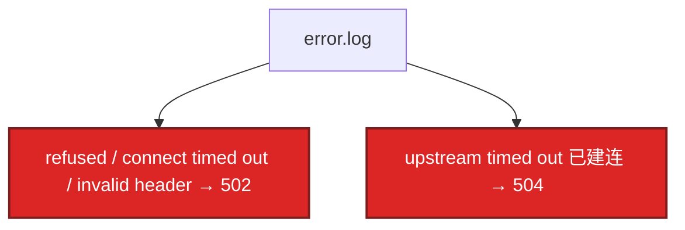

# 23｜Nginx · 练习题

先自己画图或口述，再对照解答。每题标了覆盖范围：

| 标记 | 含义 |
|------|------|
| **核心** | 不懂整章就没建立起来 |
| **必会** | 值班和面试都要能讲 |
| **常用** | 线上会反复碰到 |
| **常考** | 白板和追问的高频口径 |

## 本题目录

- [Q1 502 / 504](#q1)
- [Q2 499 与超时链](#q2)
- [Q3 keepalive 三件套](#q3)
- [Q4 reload vs restart](#q4)
- [Q5 限流](#q5)
- [Q6 worker 与连接](#q6)
- [Q7 upstream 算法](#q7)
- [Q8 两列时间](#q8)
- [Q9 证书](#q9)
- [Q10 动静分离](#q10)
- [合上书](#合上书)

---

## Q1

**★★★★★｜大量 502，怎么查？和 504 怎么分？**

**覆盖**：核心 · 必会 · 常考

### 场景

登录全 502。有人重启全部逻辑服。error.log 里其实是 `Connection refused`。

### 完整解答

502 = **没拿到合法上游响应**（没起来、拒连、RST、非 HTTP）。504 = **连上了但读超时没回完**。



链：error.log → 进程和端口 → `curl` 上游 → somaxconn/连接数 → `nginx -T` upstream。111 refused：起后端，别先重启 Nginx。110：安全组/路由。prematurely closed：上游崩或 keepalive 配错。no live upstreams：全被 max_fails 摘了。不要重启还在跑的战斗进程。

### 再追问

upstream sent invalid header？——上游不是 HTTP（TLS 打到明文、打印了调试二进制）。抓包或 curl -v 看首字节。

---

## Q2

**★★★★★｜499 和 504 同时出现，超时怎么配？**

**覆盖**：核心 · 必会 · 常考

### 场景

玩家 APP 超时 15s，Nginx `proxy_read_timeout 60s`，Java 120s。活动时 499 和 504 都有。

### 完整解答

必须 **客户端 < Nginx < 应用**。APP/SLB 15s 先断 → Nginx 记 499，Java 还在算。Nginx 60s 先到 → 504。先对齐（例如 15 < 20 < 30），再优化慢查询。只加大 Nginx 到 300，玩家设备 15s 照样 499。

看 access 的 `$request_time` vs `$upstream_response_time`：上游已经很长、status 499 = 客户端不等了。

### 再追问

SLB 60s、Nginx 30s 会怎样？——Nginx 先 504，玩家看到失败，SLB 还没到自己的超时。外层更长、里层更短，504 为主。

---

## Q3

**★★★★★｜upstream 写了 keepalive 32，后端 TIME_WAIT 仍爆？**

**覆盖**：核心 · 必会 · 常用

### 场景

短连接打满逻辑端口（18）。upstream 里明明有 keepalive。

### 完整解答

三件套缺一不可：`upstream { keepalive 32; }` + `proxy_http_version 1.1` + `proxy_set_header Connection ""`。HTTP/1.0 代理默认 `Connection: close`。少后两行等于没开池，每次新建 TCP。

### 再追问

keepalive 太大有什么问题？——占满上游 fd、空闲连接过多。32～100 常见，配合后端超时。不是越大越好。

---

## Q4

**★★★★★｜reload 会不会断现有连接？和 restart 呢？**

**覆盖**：核心 · 必会 · 常考

### 场景

改个 header 有人 `systemctl restart nginx`，大厅 HTTP 长轮询全断。

### 完整解答

`nginx -t` 再 `nginx -s reload`：Master HUP → 新 Worker 接新连接；旧 Worker 把存量处理完再退。**平滑。** restart：先停后起，连接全拆。`kill -9` 更粗。长连接再加 `worker_shutdown_timeout`。语法错误则新 Worker 起不来，旧配置继续——所以必须先 `-t`。

### 再追问

战斗 TCP 能靠 Nginx reload 平滑吗？——HTTP 反代不要扛战斗。四层走 16/24。误走 Nginx 时 reload 仍可能让旧连接在旧 Worker 上活一阵，但不要当方案。

---

## Q5

**★★★★☆｜活动接口怎么限流？burst 和 nodelay？**

**覆盖**：必会 · 常用 · 常考

### 场景

领奖被刷。要保正经玩家短时高峰。

### 完整解答

```nginx
limit_req_zone $binary_remote_addr zone=api:10m rate=100r/s;
location /api/activity/ {
    limit_req zone=api burst=200 nodelay;
    limit_req_status 429;
}
```

`rate` 长期速率；`burst` 桶深；`nodelay` 突发立刻处理，超 burst 仍拒。不 nodelay 则排队匀速，延迟变差。下载用 `limit_conn`。按玩家 ID 的动态网关在 03-04。

### 再追问

503 和 429？——你指定 `limit_req_status 429` 就 429；默认可能 503。conn 限制常用 503。和「上游全死」的 503 要靠日志区分。

---

## Q6

**★★★★☆｜worker 数、最大连接怎么算？**

**覆盖**：必会 · 常用

### 场景

32 核机器 `worker_processes 64`，延迟变差。

### 完整解答

`auto` = 核数。事件驱动单 Worker 已能高并发，多 Worker 是为了用多核。多于核数 = 抢同一 CPU。上限 ≈ 核数 × `worker_connections`。反代 ×2 fd。`worker_rlimit_nofile` 必须更大，否则连接数上不去（18）。

### 再追问

multi_accept 呢？——一次 accept 多个新连接，高峰建连快。不是「多 Worker」。

---

## Q7

**★★★★☆｜ip_hash、least_conn 怎么选？max_fails 摘光了？**

**覆盖**：必会 · 常用 · 常考

### 场景

有状态购物车用轮询，用户乱跳。或一台慢机把 least_conn 全吸走。

### 完整解答

无状态轮询/加权。会话粘滞 ip_hash（换 IP / NAT 出口会破功）。长连接、耗时不均 least_conn。backup 只在全挂时上。`max_fails` + `fail_timeout` 被动摘。全摘 → `no live upstreams` 503。先看后端是不是真死，别只加大 fails 掩盖。主动探活开源 Nginx 弱，可前面加 HAProxy httpchk（24）。

### 再追问

location 匹配错了导致静态打到后端？——`=` > `^~` > 正则顺序 > 最长前缀。`proxy_pass` 斜杠改 URI。用 `nginx -T` 和 curl 验证。

---

## Q8

**★★★★☆｜怎么从日志判断慢在 Nginx 还是上游？**

**覆盖**：必会 · 常用

### 场景

P99 2s。有人优化 Nginx gzip。

### 完整解答

日志必须有 `$request_time` 和 `$upstream_response_time`。上游时间≈总时间 → 后端慢。总时间远大于上游 → 卡在 Nginx（ssl、写客户端、缓冲、磁盘 log）。499 时上游可能仍很大（客户端不等）。

### 再追问

proxy_buffering off 会怎样？——边收边转，占 Worker 更久，适合特殊流。一般 API 保持 on，避免上游被慢客户端拖死。

---

## Q9

**★★★★☆｜HTTPS 要配哪些？证书过期谁告警？**

**覆盖**：必会 · 常用 · 常考

### 场景

只开了 443，协议还允许 TLSv1.0。

### 完整解答

TLS1.2/1.3、现代 cipher、session cache、OCSP stapling、HSTS、80 跳 443。证书监控用 21 blackbox `probe_ssl_earliest_cert_expiry`，7 天 P1，不要等玩家报。全链缺中间证，部分客户端会失败。细节握手 09。

### 再追问

http2 和上游 keepalive 关系？——客户端 HTTP/2 到 Nginx，到上游仍常是 1.1 池。两段别混。

---

## Q10

**★★★★☆｜动静分离和 cache 什么时候上？**

**覆盖**：常用 · 常考

### 场景

所有 `.js` 都打到 Java。活动静态更新靠清 CDN（10）。

### 完整解答

静态 `root` + 长 expires + 可不记 access_log。动态才反代。可缓存接口 `proxy_cache` + `X-Cache-Status`。玩家私有接口不要 cache。资源版本和 CDN 在 10 / 08-06。

### 再追问

APISIX 能替代这章吗？——动态路由、插件、etcd 热更新在 03-04。超时链、502/504/499、keepalive 三件套在哪层网关都成立，先在 Nginx 上会讲。

---

## 合上书

- [ ] 能用 error.log 区分 502 / 504 / 499 / 503，而不是重启逻辑服
- [ ] 能把超时讲成外短内长，并读两列时间
- [ ] 能默写 keepalive 三件套，说明少哪行 TIME_WAIT 会爆
- [ ] 能区分 reload / restart / reopen，先 `-t`
- [ ] 能配 limit_req + burst + nodelay，并区分 429 与 503
- [ ] 能说 worker 怎么定、反代 2 fd、location 优先级
- [ ] 能配 TLS1.2/1.3 + HSTS，证书用 blackbox 盯 7 天
