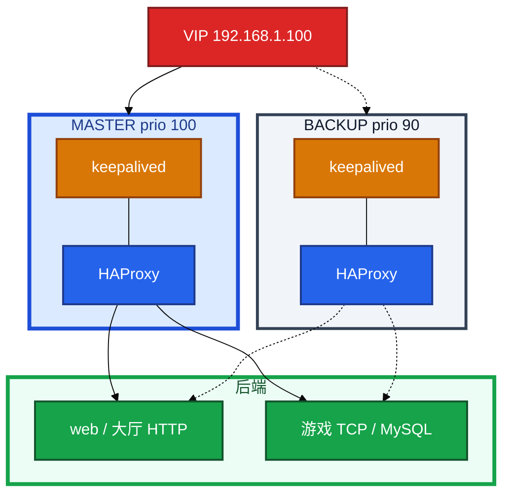
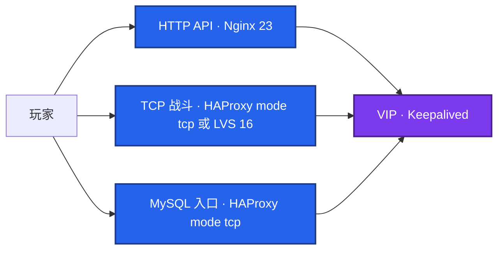
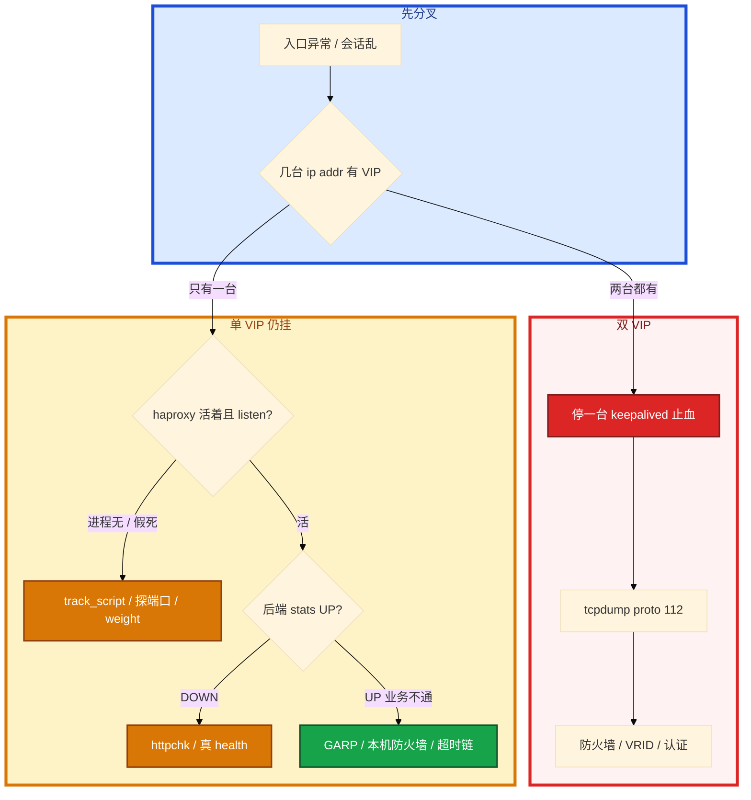

# HAProxy 与 Keepalived


防火墙策略改完，两台 `ip a` 都有 VIP。一半玩家打到 A，一半打到 B，会话错乱。另一次 haproxy 进程没了，VIP 还在这台，玩家全超时。群里有人要把战斗 TCP 和登录 HTTP 都塞进同一层 Nginx。

先别动手。这一章后半全是你会动手的：**怎么配 mode tcp / httpchk、VIP 怎么漂、双 VIP 先停哪台、weight 算完为什么不切。** 前面的四层七层和 VRRP，是为了让你动手时不把 LVS DR 和 HAProxy 搅在一起。

**读完你能：** 画出 Keepalived + HAProxy 双机；讲清 VRRP 协议 112 和 GARP；脑裂先停一台再抓包；HAProxy 挂了 VIP 仍会切；办公 VPN 不拿去给玩家加速。

## 本章目录

缩进 = 上下级。3 下面才是 3.1。

想钉在**正文左边**跟着滚：菜单 **查看 → 打开视图 → 大纲**。Markdown 预览做不到独立左栏，目录只能写在文章开头。

- [1. 基本概念](#1-基本概念)
- [2. 架构图](#2-架构图)
- [3. 原理](#3-原理)
  - [3.1 四层七层](#31-四层七层haproxy-vs-nginx)
  - [3.2 VRRP](#32-vrrp通告gARP抢占)
  - [3.3 脑裂](#33-脑裂两节点没有-quorum)
- [4. 安装部署](#4-安装部署)
- [5. 核心配置](#5-核心配置)
- [6. 常用命令](#6-常用命令)
- [7. 常用操作](#7-常用操作)
  - [7.1 探活与读写分离](#71-探活与读写分离)
  - [7.2 VIP 与脚本](#72-vip-与-track_script)
  - [7.3 VPN 与正向代理](#73-vpn-与正向代理)
- [8. 生产排障](#8-生产排障)
- [9. 必会 · 常考](#9-必会--常考)
- [合上书](#合上书问自己)

**本章不讲：** LVS NAT/DR/TUN、RIP、ipvsadm → [16](../16-LVS与四层负载均衡/)；Nginx 502/超时链/keepalive → [23](../23-Nginx/)；RTO、多数派、3-2-1 → [20](../20-高可用与容灾/)；云 SLB、专线 → [07](../../07-云平台/)；MySQL 复制本身 → [03-01](../../03-中间件与数据库/01-MySQL/)；SSH 跳板 → [25](../25-堡垒机与跳板机/)。

---

## 1. 基本概念

两台同等机器，各跑 HAProxy（或 Nginx）+ Keepalived。对外只宣告 **一个 VIP**。Keepalived 用 VRRP 决定谁占 VIP；HAProxy 负责把流量分到后端并做健康检查。

两件事别混：

| 组件 | 干什么 |
|------|--------|
| **Keepalived** | VIP 在哪台；VRRP 通告；track_script 探本机代理 |
| **HAProxy** | 流量怎么分；四层/七层；rise/fall 摘后端 |

LVS 是内核四层、超大并发入口，模式和 DR 里 RIP 配置在 **16**。不要在这章背三种 LVS 模式。Keepalived 也可以管 LVS 的 ipvs 规则，那是 16 的搭配；这里默认 **Keepalived 只做 VIP + 探 HAProxy 进程**。

脑裂概念（分区双主）在 20。两节点 VRRP **没有 quorum**，心跳被挡就会双 VIP，这是本章现场题。etcd 靠多数派停写；Keepalived 两台停不了写。重要数据不要指望 VRRP 当一致性协议。

云上「VIP」常常是产品 SLB，不一定能自建 VRRP，那是 07。

> **记住**：Keepalived 管 VIP 在哪台，HAProxy 管流量怎么分。VRRP 通 ≠ 后面的代理还活着。必须 track_script。

---

## 2. 架构图

先把整张图钉住。后面安装、命令、排障都对着这张图说话。



图上三条线：

1. **玩家只认 VIP。** 切主靠 GARP 刷 ARP，一般 1～2 秒，客户端常无感。整段常 2～3 秒。
2. **VRRP 是 IP 协议号 112**，不是「UDP 端口 112」。防火墙按端口拦会双主。
3. **HAProxy 摘的是后端 server；Keepalived 摘的是这台 VIP。** rise/fall 两层都要连续 N 次，抗抖（20）。

入口怎么分层：



可以说「LVS+Keepalived 做入口，后面 HAProxy 做七层」，但 **NAT/DR 细节留在 16**。本章要求会 **HAProxy 双机 + 探脚本** 这一套。

---

## 3. 原理

原理只保留动手会用到的：哪层用谁、VIP 怎么漂、为什么两台都能自称 Master。

**本节 3 块：** 3.1 四层七层 · 3.2 VRRP · 3.3 脑裂

### 3.1 四层七层：HAProxy vs Nginx

四层看 IP+端口，不解析 HTTP，适合高并发和长连接。七层看 URL/Header/Host，能灰度、改 Cookie，要解析、常重建连接。长连接没有「请求结束」，不要为了统一入口把战斗挂到 Nginx（16、23）。

| | HAProxy | Nginx |
|--|---------|-------|
| 定位 | 专业 LB | Web + 反代 + LB |
| 四层 TCP/UDP | 很强、原生 `mode tcp` | stream 模块有 |
| 七层 | 有，ACL 够用 | 静态、缓存、更花 |
| 健康检查 | HTTP/TCP/自定义，细 `rise/fall` | 开源偏被动 max_fails |
| Stats | 自带页面看会话 | 要模块 |
| 典型 | 库代理、游戏 TCP、纯 LB | 站点、API 网关 |

数据库、Redis、战斗 TCP、要精细探活 → HAProxy。静态和复杂 HTTP → Nginx（23）。超大四层、要上内核 → LVS（16）。

超时链同样外短内长（23）：`timeout client` / `timeout server` 要对齐应用，不要只抄 30s。游戏 TCP：`mode tcp`、`leastconn`、长连接超时加大，必要时 `timeout tunnel`。Stats 页面看当前会话，不要用它当唯一告警（21）。

热重载：HAProxy 也能平滑换进程，生产仍先检查配置再 reload，避免 maxconn 类全局项踩坑。

### 3.2 VRRP：通告、GARP、抢占

Master 发 VRRP 通告（**IP 协议号 112**）。组播常见 `224.0.0.18`。有的环境改单播 advert，防火墙规则跟着改。Backup 超时（约 `advert_int × 3`）收不到 → 升主 → 发 **Gratuitous ARP** 刷同网段 ARP 缓存，VIP 落到新 MAC。

`state MASTER/BACKUP` 只是开机意愿；**真正谁主看 priority**。备机差 ≥10 常见（100 vs 90）。`nopreempt`：主恢复后不抢回，避免二次闪断。默认抢占：priority 高的回来就抢，第二次 GARP。很多生产选非抢占，把「闪」留在故障那一次。轮转维护再手动切。

`virtual_router_id` 同组必须相同，别和别人撞。同网段两组用了同一个 id 会抢同一组通告，VIP 乱跳。规划 id，像规划 VLAN。

VRRP 通常要 **二层互通**。跨三层 ARP/GARP 刷不到，表现为漂了仍打到旧机。

weight：脚本失败 `weight -30`，100-30=70 < 90，备机才能抢。weight 太小，降完仍比备机高，表现为「HAProxy 挂了 VIP 不漂」。

### 3.3 脑裂：两节点没有 quorum

两节点 VRRP **没有多数派**。心跳看不见对方就会双主。防火墙把 VRRP 当「UDP 112」拦了，是现场最高频。


etcd 不会双 Leader 双写（多数派）。Keepalived 两台停不了写，只能尽量让通告到达。若后端已双写，按 20 选真相、评估 RPO，不是只修 VIP。

止血：**先停一台 keepalived，保证只有一个 VIP**。不要两台一起改 priority 抢。再 `tcpdump -i eth0 proto 112` 看通告过不过来。

> **记住**：VRRP 是协议 112；VIP 漂不漂看 priority 减完 weight 还够不够。进程在不等于还在接请求。双 VIP 先停一台。

---

## 4. 安装部署

两台同规格、同网段（VRRP 二层）、安全组放行协议 112（不要写成 UDP 112 端口）。HAProxy 与 keepalived systemd enable。VIP 不要和业务 IP 抢 ARP。云上先确认能不能自建 VRRP。

HAProxy 配置要点（`/etc/haproxy/haproxy.cfg`）：

```
global
    maxconn 50000
    log /dev/log local0
    user haproxy
    group haproxy

defaults
    mode http
    timeout connect 5s
    timeout client 30s
    timeout server 30s
    option httplog
    option dontlognull

frontend stats
    bind *:8080
    stats enable
    stats uri /haproxy-stats
    stats auth admin:password
    stats refresh 10s

frontend web_frontend
    bind *:80
    default_backend web_backend
    acl is_api path_beg /api/
    use_backend api_backend if is_api

backend web_backend
    balance roundrobin
    option httpchk GET /health
    server web1 192.168.1.10:8080 check inter 2s rise 2 fall 3
    server web2 192.168.1.11:8080 check inter 2s rise 2 fall 3
    server web3 192.168.1.12:8080 check backup

frontend mysql_frontend
    bind *:3306
    mode tcp
    default_backend mysql_backend

backend mysql_backend
    mode tcp
    balance leastconn
    option tcp-check
    server mysql-master 192.168.1.20:3306 check
    server mysql-slave  192.168.1.21:3306 check backup
```

Keepalived（`/etc/keepalived/keepalived.conf`）：

```
vrrp_script chk_haproxy {
    script "/etc/keepalived/check_haproxy.sh"
    interval 2
    weight -30
    fall 2
    rise 1
}

vrrp_instance VI_1 {
    state MASTER
    interface eth0
    virtual_router_id 51
    priority 100
    advert_int 1
    authentication {
        auth_type PASS
        auth_pass yourpassword
    }
    virtual_ipaddress {
        192.168.1.100/24
    }
    track_script {
        chk_haproxy
    }
}
```

Backup 那台：同一 `virtual_router_id`、同一 VIP、`state BACKUP`、`priority 90`、同一 `auth_pass`、同一 `track_script`。只改 priority。两台 `interface` 必须是 VRRP 实际走的网卡。

云上组播常被禁：改 **单播** `unicast_src_ip` + `unicast_peer`，安全组放行协议 112（仍不是 UDP 端口）。组播地址常见 `224.0.0.18`，抓包看不到时先问是不是已经被改成单播。

读写再拆一个 frontend 示例（应用连两个端口，不是解析 SQL）：

```
frontend mysql_read
    bind *:3307
    mode tcp
    default_backend mysql_slaves
backend mysql_slaves
    mode tcp
    balance leastconn
    option tcp-check
    server s1 192.168.1.21:3306 check
    server s2 192.168.1.22:3306 check
```

游戏 TCP frontend：`mode tcp`、`timeout client/server` 加大（分钟级长连接）、`option clitcpka` / `srvtcpka` 视后端而定。不要从 http defaults 继承 30s。

systemd：`haproxy.service` 与 `keepalived.service` 都 enable；脚本 `chmod +x`；SELinux 若 enforcing，先让脚本跑通再上生产（17）。VIP 不要写进 `/etc/hosts` 当本机名，避免解析到自己。

验收：只有一台 `ip addr` 有 VIP；`tcpdump proto 112` 备机能收到；停 Master 的 haproxy，VIP 漂到 Backup；httpchk 真死 Java（端口还在）能把 server 摘掉；停 Backup 不影响流量。Stats 要鉴权，不要对公网裸奔。活动前再演练一次切主，记下玩家侧是否重连（战斗 TCP 往往要重连，HTTP 常无感）。

---

## 5. 核心配置

| 选项 | 含义 | 改错会怎样 |
|------|------|------------|
| `mode tcp` / `http` | 四层 / 七层 | 战斗走 http 会解析失败或超时事故 |
| `check` | 开启探活 | 不 check = 死后端仍打 |
| `inter 2s` | 间隔 | 太大切得慢 |
| `rise 2` / `fall 3` | 连续成功才 UP / 失败才 DOWN | 抗抖；太小抖动 |
| `backup` | 主全挂才用 | — |
| `httpchk GET /health` | HTTP 探；/health 要有意义（20） | 只 200 端口活、Java 卡死仍 UP |
| `tcp-check` | 四层探端口 | 游戏 TCP 假活，要应用层心跳 |
| `dontlognull` | 探活不打日志 | 否则 access 被淹没 |
| `timeout client/server` | 外短内长 | 只抄 30s 会 499/超时错位 |
| `virtual_router_id` | 同组相同 | 撞 id → VIP 乱跳 |
| `priority` + `weight` | 谁主 | weight 太小不漂 |
| `nopreempt` | 不抢回 | 要不要二次闪断 |
| `advert_int` | 通告间隔 | 太大漂得慢 |
| `auth_pass` | VRRP 认证 | 失败像看不见对方 |
| `unicast_peer` | 云上禁组播时 | 仍要放行协议 112 |
| `timeout tunnel` | 长连接隧道 | 游戏 TCP 只抄 30s 会断 |
| `option clitcpka` | 四层 keepalive | 中间 NAT 静默断流 |
| stats bind | 内网 + auth | 公网裸奔等于泄后端名单 |

探脚本：

```bash
#!/bin/bash
# /etc/keepalived/check_haproxy.sh
if ! killall -0 haproxy 2>/dev/null; then
    systemctl start haproxy
    sleep 2
    if ! killall -0 haproxy 2>/dev/null; then
        exit 1
    fi
fi
exit 0
```

只 `killall -0` 是进程级。HAProxy 假死不 accept，VIP 还在这台 → 要探端口或 HTTP。脚本无执行权限、SELinux 拦（17）表现为永不降权。Nginx 双机同理，脚本改探 nginx。

> **记住**：四层用 mode tcp + tcp-check；七层用 httpchk，/health 要碰到业务。进程在不等于还在听端口。

---

## 6. 常用命令

值班先跑：谁有 VIP、协议 112 通不通、haproxy 在不在听、stats 里 server 是否 UP。

```bash
ip addr show
ip vs  # 若这台兼 LVS，模式仍看 16
tcpdump -i eth0 proto 112
killall -0 haproxy
ss -tlnp | grep -E '80|3306|8080'
haproxy -c -f /etc/haproxy/haproxy.cfg
systemctl reload haproxy
systemctl stop keepalived   # 脑裂止血：只停一台
```

| 目的 | 命令 | 看什么 |
|------|------|--------|
| VIP 在谁 | `ip addr` | 是否双主 |
| VRRP | `tcpdump proto 112` | 通告双向？ |
| 配置 | `haproxy -c` | reload 前 |
| 后端 | stats 页 / socket | rise/fall 后 UP 没有 |
| 脚本 | 手工跑 check_haproxy.sh | exit 码；权限 |
| 运行时会话 | `echo show stat \| socat stdio /run/haproxy/admin.sock` | 后端 UP/DOWN、会话数 |
| 切主演练 | `systemctl stop haproxy`（有 track 时） | VIP 是否漂；玩家是否重连 |

WireGuard 密钥当生产密钥，进堡垒/密管，不要散落 wiki（25、17）。

---

## 7. 常用操作

### 7.1 探活与读写分离

HTTP 业务用 `httpchk GET /health`，health 要碰到依赖。TCP 端口探会假活。`inter 2s rise 2 fall 3`。backup 机平时不上。

游戏 TCP 只能 tcp-check 时，要有应用层心跳或独立探活，否则假活。

MySQL 读写分离：两个 frontend。写 3306 → master；读 3307 → slaves + leastconn。应用自己连两个端口。不是解析 SQL 的中间件（03）。

### 7.2 VIP 与 track_script

weight -30 必须让降完 **低于** 备机。没配 track_script：VRRP 只保证 keepalived 活着。主修完回来：有 `nopreempt` 则不抢，避免二次闪。

漂了但业务不通：新主 HAProxy 没起来；本机防火墙；ARP 没刷新（抓 GARP）；跨三层。

### 7.3 VPN 与正向代理

| 场景 | 选 |
|------|----|
| 运维进内网 | WireGuard（新）/ OpenVPN（老、可 TCP 443） |
| 跨云机房 | 云 IPSec VPN / 专线（07） |
| 开发进测试 | WireGuard / Tailscale |
| 出海加速 | 云全球加速（GAAP），**不是**给玩家上办公 VPN |

WireGuard：内核实现、配置短、好审计。OpenVPN：老环境、UDP 被 QoS 时走 TCP 443。每端一对密钥；Peer 的 AllowedIPs 收紧。

```
# 服务端 wg0.conf 要点
[Interface]
PrivateKey = <server>
Address = 10.0.0.1/24
ListenPort = 51820
PostUp = iptables -A FORWARD -i wg0 -j ACCEPT; iptables -t nat -A POSTROUTING -o eth0 -j MASQUERADE

[Peer]
PublicKey = <client>
AllowedIPs = 10.0.0.2/32
```

```bash
wg genkey | tee server_private.key | wg pubkey > server_public.key
wg-quick up wg0
systemctl enable wg-quick@wg0
```

**正向代理**代表客户端出网（审计、无外网机器拉镜像）；**反向代理**代表服务端接用户（23）。Squid HTTP、Dante SOCKS5、3proxy 轻量。SSH `-D` 也是 SOCKS（25），临时排障可以，不是生产出网方案。

```bash
export http_proxy=http://proxy.internal:3128
export https_proxy=http://proxy.internal:3128
export no_proxy=localhost,127.0.0.1,10.0.0.0/8
```

Docker 要写 systemd drop-in，否则拉镜像不走代理。内网 CIDR 必须进 `no_proxy`，否则访问自己的仓库绕一圈还失败。

选型收口：

| 需求 | 工具 |
|------|------|
| Web + 静态 | Nginx 23 |
| 精细 TCP/HTTP LB | HAProxy |
| 内核超大四层 | LVS 16 |
| 主备 VIP | Keepalived（本章；LVS 场景也在 16） |
| 办公 VPN | WireGuard |
| 内网出网代理 | Squid + no_proxy |

---

## 8. 生产排障

三问：VIP 几个？协议 112 通不通？代理还在接请求吗？



| 现象 | 先查 | 不要做什么 |
|------|------|------------|
| 两台都是 MASTER、都有 VIP | 协议 **112**；`tcpdump proto 112` | 两台同时调 priority 对打 |
| VIP 不漂 | priority/weight 算完备机仍低；脚本其实成功了；`nopreempt` | 只重启业务 |
| 漂了但业务不通 | 新主 HAProxy；防火墙；GARP | 当后端全死重启战斗服 |
| 漂得慢 | `advert_int` 太大 | — |
| Java 卡死仍 UP | httpchk 要碰到依赖，不要只 tcp-check | 加大 timeout 掩盖 |
| 主恢复又闪一次 | nopreempt | 当成又一次故障去切来切去 |
| 构建机设了代理连不上 Harbor | no_proxy 内网 CIDR；Docker systemd | 只 export 当前 shell |

活动高峰入口：先确认 VIP 唯一、HAProxy listen、后端 health，不要把 VRRP 抖动当成要重启逻辑服。

---

## 9. 必会 · 常考

白板和追问高频，能一口回：

| 说法 | 对错 | 口径 |
|------|:----:|------|
| 入口有 Nginx 就不必 HAProxy | 错 | 库/战斗 TCP/精细探活用 HAProxy |
| 战斗长连接和登录都塞七层 | 错 | 长连接走四层 |
| VRRP 是 UDP 端口 112 | 错 | **IP 协议号 112** |
| `state MASTER` 决定谁主 | 错 | 看 priority |
| 两节点 VRRP 有 quorum | 错 | 没有；会双 VIP |
| 脑裂和 etcd 一样停写 | 错 | Keepalived 停不了写 |
| 只探 PID 就等于代理活着 | 错 | 假死不 accept 要探端口 |
| weight -10 一定能切（主 100 备 90） | 错 | 90 仍低于 90？100-10=90 不够；要低于备机 |
| httpchk 只 200 即可 | 错 | health 要碰到依赖 |
| 玩家加速走办公 VPN | 错 | GAAP / 云加速，不是 WireGuard 办公 |
| 正向代理不用 no_proxy | 错 | 内网会绕一圈失败 |
| 双 VIP 先两台一起改优先级 | 错 | 先停一台止血 |
| Keepalived 不能只做 LVS | 错 | 能，那是 16；本章是 HAProxy 双机 |
| 主恢复必须抢回 VIP | 错 | nopreempt 可避免二次闪 |
| Docker 只 export 代理就够 | 错 | systemd Environment= |

数字：协议 **112**；GARP **1～2s**；整段切 **2～3s**；`advert_int` 常见 **1s**，超时约 ×3；priority **100/90**，weight **-30**；`inter 2s rise 2 fall 3`；VRID 例 **51**。

易混：HAProxy vs Nginx vs LVS；VIP vs 后端探活；协议 112 vs UDP 112；抢占 vs nopreempt；tcp-check vs httpchk；正向 vs 反向代理；脑裂止血 vs 修数据。

---

## 合上书，问自己

1. 四层七层怎么选 HAProxy / Nginx / LVS？Keepalived 管什么？
2. VRRP 协议号？GARP 干什么？谁主看 state 还是 priority？
3. 两台都有 VIP 先做什么？和 etcd 脑裂差在哪？
4. HAProxy 挂了 VIP 不切，可能哪几条？weight 怎么算？
5. httpchk 和 tcp-check 假活分别长什么样？MySQL 读写怎么拆端口？
6. WireGuard 还是 OpenVPN？正向代理为什么必须 no_proxy？

六题都能口述，这一章就过了。下一章把人怎么进生产焊死：堡垒机、审计、二次认证、最小权限。
