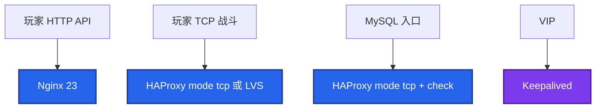
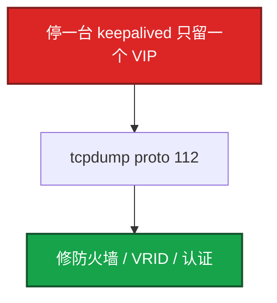

# 24｜HAProxy 与 Keepalived · 练习题

先对照 [知识点](知识点.md) **本章主线** 自己口述，再对答案。每题标了覆盖范围：

| 标记 | 含义 |
|------|------|
| **核心** | 不懂整章就没建立起来 |
| **必会** | 值班和面试都要能讲 |
| **常用** | 线上会反复碰到 |
| **常考** | 白板和追问的高频口径 |

## 本题目录

- [Q1 HAProxy vs Nginx](#q1)
- [Q2 双机与 VIP](#q2)
- [Q3 脑裂](#q3)
- [Q4 VIP 不切](#q4)
- [Q5 健康检查](#q5)
- [Q6 VPN](#q6)
- [Q7 正向代理](#q7)
- [Q8 别和 LVS 搅](#q8)
- [Q9 抢占](#q9)
- [Q10 四层七层现场](#q10)
- [合上书](#合上书)

---

## Q1

**★★★★★｜HAProxy 和 Nginx 做 LB 差在哪？什么时候用 HAProxy？**

**覆盖**：核心 · 必会 · 常考

**对应**：知识点 §1 基本概念 · §2 架构图

### 场景

「入口已经有 Nginx 了，为什么还要 HAProxy？」后面要挂 MySQL 和战斗 TCP。

### 完整解答

**一句话**：HAProxy 是 LB 本职（四层/TCP/MySQL）；Nginx 是 Web 全能；超大入口内核转发看 LVS（16）。

Nginx 是 Web 全能。HAProxy 是 **LB 本职**：四层性能和健康检查更细，Stats 看得清会话。库、游戏 TCP、纯转发选 HAProxy；站点、静态、复杂 HTTP 选 Nginx。内核超大入口选 LVS（[16](../16-LVS与四层负载均衡/)），不要在这章讲 DR。

四层看 IP+端口，不解析 HTTP，适合长连接。七层理解请求，适合登录支付灰度。不要统一入口把战斗塞进 Nginx。

### 再追问

HAProxy 怎么做 MySQL 读写分离？——两个 frontend：3306 只打 master；3307 `leastconn` 打从库。应用写读分开连。不是解析 SQL 的中间件。

---

## Q2

**★★★★★｜画 Keepalived + HAProxy 双机。VIP 怎么漂？**

**覆盖**：核心 · 必会 · 常考

**对应**：知识点 §2 架构图 · §3 原理

### 场景

系统设计起手：两台入口怎么避免单点。

### 完整解答

**一句话**：Keepalived 管 VIP（VRRP 协议 112），HAProxy 管流量；track_script 探 haproxy，失败降 priority 让备机抢。

VIP → MASTER prio 100（haproxy+keepalived）与 BACKUP 90 同组件 → 后端们。Master 发 VRRP（协议 **112**）。Backup 超时 → GARP → 交换机/主机改 ARP。track_script 探 haproxy，失败 `weight -30` 让 90 > 70，备机抢。整段常 2～3 秒。`state` 只是开机意愿，谁主看 priority。

探活失败但 VIP 不走：降完 priority 仍高于备机；或 nopreempt。

### 再追问

GARP 是什么？ARP 缓存没刷新？——免费 ARP 强制更新 VIP→新 MAC。一般 1～2s。若仍打到旧机，抓包看有没有 GARP、是不是跨三层（VRRP 通常要二层互通）。

---

## Q3

**★★★★★｜两台都变成 MASTER（脑裂），怎么处理？**

**覆盖**：核心 · 必会 · 常考

**对应**：知识点 §7 生产排障 · §3 原理

### 场景

防火墙策略改完，两台 `ip a` 都有 VIP。玩家连上时而 A 时而 B，会话错乱。

### 完整解答

**一句话**：双 VIP 先停一台；VRRP 没有 quorum，和 etcd 脑裂不同——要抓 proto 112 修防火墙。

两节点 VRRP **没有多数派**（[20](../20-高可用与容灾/)）。心跳看不见对方就会双主。防火墙常把 112 当「UDP 112 端口」丢掉。

1. ping 对端、查防火墙是否误拦协议 112。
2. `tcpdump -i eth0 proto 112` 两边是否收到 advert。
3. 止血：停一台 keepalived。不要两台同时调 priority 对打。
4. 若后端已双写，按脑裂收数据，不是只修 VIP。

### 再追问

和 etcd 脑裂一样吗？——不一样。etcd 靠 quorum 停写。Keepalived 两台停不了写，只能尽量让通告到达。重要数据不要指望 VRRP 当一致性协议。

---

## Q4

**★★★★☆｜HAProxy 挂了 VIP 不切换，可能原因？**

**覆盖**：必会 · 常用 · 常考

**对应**：知识点 §7 生产排障 · §5 核心配置

### 场景

haproxy 进程没了，VIP 还在这台，玩家全超时。

### 完整解答

**一句话**：没配 track_script 或 weight 降不够，VRRP 只保证 keepalived 活着，不保证 haproxy 活着。

1. 没配 `track_script`：VRRP 只保证 keepalived 活着。
2. `weight` 太小，100-10 仍 ≥ 备机 90。要 100-30=70 < 90。
3. 脚本 `killall -0` 看到僵尸/残留进程以为还活。
4. `nopreempt` 且当前就是备机逻辑乱了（少见）。
5. 脚本无执行权限、SELinux 拦（[17](../17-Linux安全加固/)）。

进程在但不 listen：要探端口/HTTP，不要只探 PID。

### 再追问

rise/fall 在 HAProxy 和 Keepalived 各管什么？——HAProxy：摘不摘 **后端 server**。Keepalived：这台还要不要 **VIP**。两层都要连续 N 次，抗抖（[20](../20-高可用与容灾/)）。

---

## Q5

**★★★★☆｜HAProxy 健康检查字段怎么配？/health 只 200？**

**覆盖**：必会 · 常用

**对应**：知识点 §5 核心配置 · §3 原理

### 场景

后端 Java 卡死但端口还在。tcp-check 仍 UP，玩家 504。

### 完整解答

**一句话**：HTTP 业务用 httpchk 碰到依赖；纯 TCP 端口探会假活，游戏 TCP 要有应用心跳。

HTTP 业务用 `httpchk GET /health`，health 要碰到依赖。TCP 端口探会假活。`inter 2s rise 2 fall 3`：两次成功才上、三次失败才下。backup 机平时不上。游戏 TCP 只能 tcp-check 时，要有应用层心跳或独立探活，否则假活。

### 再追问

dontlognull？——健康检查连接不打进日志，否则 access 被探活淹没。

---

## Q6

**★★★★☆｜WireGuard 还是 OpenVPN？出海用 VPN 吗？**

**覆盖**：必会 · 常用

**对应**：知识点 §4 落地 · §3 原理

### 场景

给运营和运维进生产网。另有人要把玩家流量走办公 VPN 加速。

### 完整解答

**一句话**：办公隧道新建 WireGuard；玩家加速用云 GAAP，不要把战斗包送进办公 VPN。

新建办公隧道：**WireGuard**（内核、配置短）。已有 OpenVPN 或必须 TCP 443 穿透：OpenVPN。**玩家加速用云 GAAP 一类产品**，不是把战斗包送进办公 VPN。跨云专线是 [07](../../07-云平台/)。

### 再追问

WireGuard 密钥怎么管？——每端一对；Peer 的 AllowedIPs 收紧。私钥当生产密钥，进堡垒/密管，不要散落 wiki（[25](../25-堡垒机与跳板机/)、[17](../17-Linux安全加固/)）。

---

## Q7

**★★★★☆｜正向代理和反向代理？no_proxy 为什么要设？**

**覆盖**：必会 · 常用

**对应**：知识点 §3 原理 · §6 命令与操作

### 场景

构建机无外网，要拉 Docker Hub。设了 `https_proxy` 后连不上内网 Harbor。

### 完整解答

**一句话**：正向代理代表客户端出网；`no_proxy` 必须含 localhost 和内网 CIDR，否则内网也绕代理。

正向：代表 **客户端** 出网（Squid）。反向：代表 **服务端** 接用户（Nginx）。`no_proxy` 必须包含 localhost 和内网 CIDR，否则内网请求也进代理，绕一圈失败或绕过审计。Docker 还要 systemd `Environment=`，只 export 当前 shell 不够。

### 再追问

SOCKS 和 HTTP 代理？——HTTP 代理管 HTTP(S)。SOCKS5（Dante）更通用。SSH `-D` 也是 SOCKS（[25](../25-堡垒机与跳板机/)），临时排障可以，不是生产出网方案。

---

## Q8

**★★★★☆｜LVS 和 HAProxy 怎么同时出现在答案里而不混？**

**覆盖**：必会 · 常考

**对应**：知识点 §1 基本概念 · §8 必会 · 常考

### 场景

「四层负载均衡讲一下」，有人把 DR 和 HAProxy roundrobin 搅在一起。

### 完整解答

**一句话**：LVS 讲 NAT/DR/TUN 内核转发；HAProxy 讲用户态代理和 httpchk；VIP/VRRP 在本章 Keepalived。

超大规模内核转发、三种模式、real server 配 RIP → [16](../16-LVS与四层负载均衡/) LVS。用户态代理、七层 ACL、精细 HTTP 检查、库端口 → 本章 HAProxy。VIP 漂移、VRRP 112、双主 → 本章 Keepalived（LVS 也常用它管 ipvs，模式仍在 16）。

可以说「LVS+Keepalived 做入口，后面 HAProxy 做七层」，但 **NAT/DR 细节留在 16**。

### 再追问

Keepalived 能不能只做 LVS 不做 HAProxy？——能。那是 16 的经典图。本章要求会 **HAProxy 双机 + 探脚本** 这一套。

---

## Q9

**★★★★☆｜主恢复后 VIP 抢不抢回来？**

**覆盖**：常用 · 常考

**对应**：知识点 §5 核心配置 · §3 原理

### 场景

主修完 keepalived 回来，流量又闪一次。

### 完整解答

**一句话**：默认抢占会二次 GARP 闪断；生产常选 nopreempt，把闪断留在故障那一次。

默认抢占：priority 高的回来就抢，第二次 GARP。`nopreempt`：谁先当主谁继续，直到它挂。很多生产选非抢占，把「闪」留在故障那一次。轮转维护再手动切。

### 再追问

virtual_router_id 冲突？——同网段两组 Keepalived 用了同一个 id 会抢同一组通告，VIP 乱跳。规划 id，像规划 VLAN。

---

## Q10

**★★★★☆｜给出现象，你先走哪条：双 VIP、不漂、假活？**

**覆盖**：必会 · 常用

**对应**：知识点 §7 生产排障

### 场景

三个工单：① 两台都有 VIP ② haproxy 死了 VIP 还在 ③ Java 卡死 tcp-check 仍 UP。

### 完整解答

**一句话**：双 VIP→停一台抓 112；VIP 不漂→track_script/weight；假活→httpchk 碰依赖。

| # | 走哪条 | 不要做 |
|---|--------|--------|
| ① | 停一台；`tcpdump proto 112`；修防火墙 | 两台改 priority 对打 |
| ② | track_script、weight 算完备机更高、探端口 | 只重启业务 Pod |
| ③ | httpchk 碰到依赖；游戏 TCP 要应用心跳 | 加大 timeout 掩盖 |

现场：`ip addr` → proto 112 → haproxy listen → stats UP。

### 再追问

超时只抄 defaults 30s 行不行？——不行。外短内长和 [23](../23-Nginx/) 同一条链。游戏 TCP 还要加大、必要时 `timeout tunnel`。

---

## 合上书

- [ ] 能说出四层七层怎么选 HAProxy/Nginx/LVS；Keepalived 管什么
- [ ] 能说出 VRRP 协议号；GARP 干什么；谁主看 priority 不是 state
- [ ] 能处理双 VIP：先停一台；和 etcd 脑裂差在哪
- [ ] 能解释 HAProxy 挂了 VIP 不切的可能原因；weight 怎么算
- [ ] 能配 httpchk/tcp-check；MySQL 读写怎么拆端口
- [ ] 能选 WireGuard；正向代理为什么必须 no_proxy
