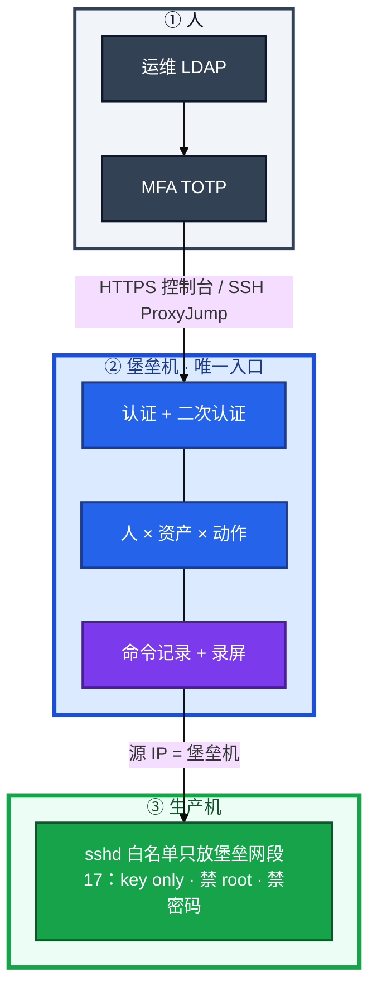
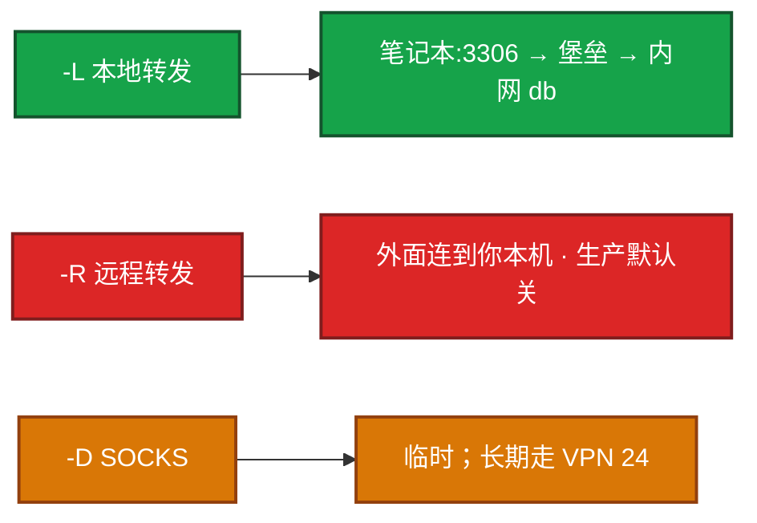
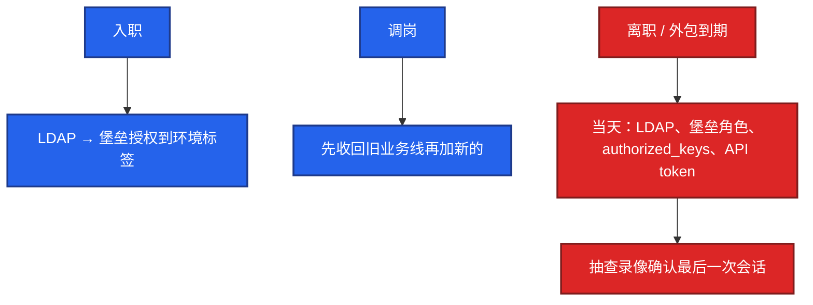
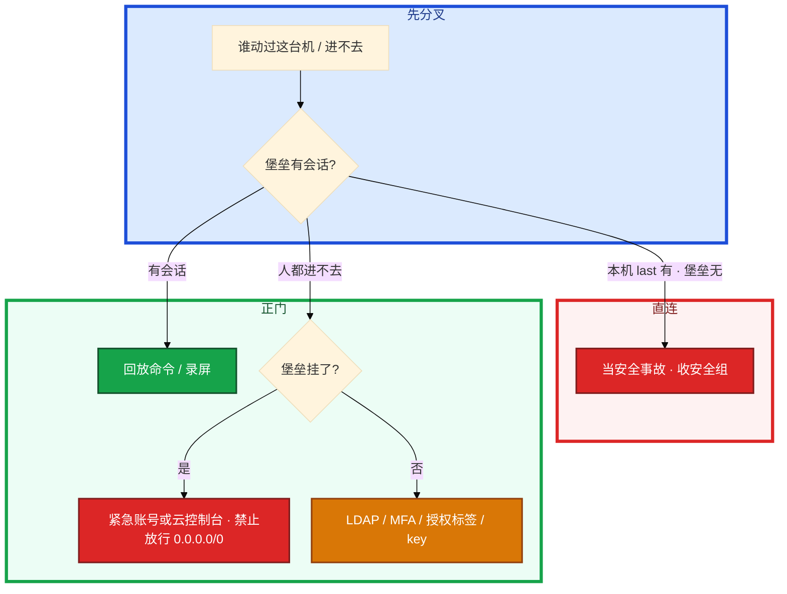

# 堡垒机与跳板机


开发在安全组给自己笔记本加了 22，「就改一行配置」。支付库随后出现一条对不上人的 DROP。另一次堡垒机升级挂了，群里有人要改安全组对世界开放 22。本机 `last` 有登录，堡垒会话列表没有——先别动手。

**本章主线（排障就按这三步想）：**

1. **唯一入口**：生产 SSH 白名单只放堡垒网段。
2. **审计三件套**：命令 + 录屏 + 文件传输留痕。
3. **堡垒挂了走紧急通道**，禁止 `0.0.0.0/0` 开放 22。

**读完你能：** 画出人只经堡垒进生产；讲清审计 / 二次认证 / 最小权限；`-L` 连库、`-R` 默认关；没有防火墙白名单等于没做堡垒；直连当事故。

## 本章目录

- [1. 基本概念](#1-基本概念)
- [2. 架构图](#2-架构图)
- [3. 原理](#3-原理)
- [4. 落地](#4-落地)
- [5. 核心配置](#5-核心配置)
- [6. 命令与操作](#6-命令与操作)
- [7. 生产排障](#7-生产排障)
- [8. 必会 · 常考](#8-必会--常考)
- [合上书](#合上书问自己)

**本章不讲：** sshd_config 逐项、SUID、auditd、AIDE、sudo 白名单 → [17 Linux 安全加固](../17-Linux安全加固/)；正向代理、WireGuard → [24](../24-HAProxy与Keepalived/)；云 IAM、安全组、控制台 → [07](../../07-云平台/)；K8s RBAC、exec 审计 → [04-13](../../04-Kubernetes/13-RBAC与安全/)。

---

## 1. 基本概念

跳板机是一台能 SSH 中转的机器。堡垒机是 **认证 + 授权 + 录像 + 命令审计** 的控制系统。合规（等保 / SOC2 / ISO27001）要的是后者。小团队可以先跳板，但大厂默认：没有堡垒机日志的操作，等于没发生过——出事无法追责。

**值班里怎么认现象**（先听安全/审计怎么说，再对表）：

| 现场说的 | 技术含义 | 你的第一刀 |
|----------|----------|------------|
| 「支付库有 DROP 对不上人」 | 可能直连绕过堡垒 | 堡垒会话 vs 本机 `last` |
| 「堡垒升级进不去生产」 | 控制面挂了 | 紧急通道，不是开放 22 |
| 「离职同事还能登录」 | LDAP/key 没当天关 | 当天关账号 |
| 「本机有 SSH、堡垒没有」 | 直连事故 | 收安全组白名单 |

开口先说 **唯一入口 + 禁直连**。sshd 硬化（禁 root/密码、算法、MaxAuthTries）在 **17**。本章假设已经 key only。人侧用跳转，不要每台公网 22。

| | 跳板机 | 堡垒机 |
|--|--------|--------|
| 本质 | SSH 中转 | 访问控制产品 |
| 权限 | 有账号就能进后面 | 人↔资产 细粒度 |
| 审计 | 基本无 | 命令 + 录屏 |
| 账号 | 各机 authorized_keys 手维护 | LDAP/AD |
| 合规 | 通常不够 | 等保等 |
| 成本 | 低 | 中高 |
| 适用 | 很小的团队 | 中大厂默认 |

生产禁止（和 17 硬化叠在一起，不是二选一）：

| 禁止 | 为什么 |
|------|--------|
| root 直连 | 对不上人（17） |
| 密码登录 | 撞库 |
| 绕过堡垒 | 无录像，合规失败 |
| 共用 `ops` | 无法追责 |
| 私钥无 passphrase / 丢网盘 | 等于把门复制走 |
| 生产机对公网 22 | 扫描面 |

安全组 / iptables 只放行堡垒机到 22（或改过的端口）。人从家里直连成功 = 入口事故，不是「方便」。

K8s exec 是绕过主机 SSH 的另一条门，要走 04-13 的 RBAC 和审计。主机白名单管的是 sshd，不是 apiserver。两条入口都要收。

> **记住**：产品再全，生产机 SSH 不白名单，人仍能直连，审计是空的。本机有登录、堡垒没有 = 直连事故。

**面试怎么说**：「生产唯一入口是堡垒；安全组只放堡垒网段到 22。装了 JumpServer 不收 22 等于没做。直连当安全事故，不是方便。」

---

## 2. 架构图

后面审计、MFA、最小权限都对着这张图。



**读图三句话：**

1. **没有从笔记本直达生产 22 的箭头。** 办公网进堡垒，堡垒进生产，两段分开。
2. **Web 终端和 SSH 客户端都要审计。** 只录像 Web、SSH 协议开个口，等于半套。
3. **源 IP 必须是堡垒。** `authorized_keys` 可 `from="堡垒网段"`；安全组只放该网段。

开源常见 **JumpServer**；商业 CyberArk、BeyondTrust、云厂商堡垒机。功能要会讲：资产、用户对接 LDAP、授权、会话审计、批量命令、Web 终端。

没有「SSH 白名单只放堡垒」时，JumpServer 只是多了一道密码，人仍能直连，**审计是空的**。产品和防火墙必须一起做。

---

## 3. 原理

### 3.1 审计：命令、录屏、文件

**一句话：** 没有堡垒机录像的操作，等于没发生过。

**打个比方**：堡垒机像银行柜台——每笔操作有监控、有流水单；跳板机只是多了一扇门，没有柜台记录，出事说不清是谁拿的。

**现场走一遍**（支付库出现 DROP，安全要查是谁干的）：

1. 先在堡垒控制台查会话列表：时间窗口内 **无** 对应操作记录。

2. 登录支付库本机：

```bash
last -20
grep 'Accepted' /var/log/secure | tail -10
```

3. 屏幕出现：

```text
ops     pts/0    203.0.113.88    Fri Aug 28 13:42   still logged in
Accepted publickey for ops from 203.0.113.88 port 52134 ssh2
```

4. **说明什么**：源 IP `203.0.113.88` 是某开发笔记本公网 IP，**不是堡垒机网段** → 直连事故，不是「同事图方便」。

5. 立刻：收安全组 22 白名单、禁用该 key、查 `authorized_keys` / crontab 是否被改、补安全事故单。

**输出解读**：

| 能力 | 现场怎么用 |
|------|------------|
| 命令回放 | 事故查「谁在几点敲了 drop」 |
| 录屏 | 交互式 vim/mysql 客户端也有画面 |
| 文件传输 | 上传脚本、下载 dump 单独授权、单独留痕 |
| 会话列表 | 值班先问堡垒，再看本机 `last` / `w` / auditd（17） |
| 批量命令 | 类似 Ansible，仍要审计 |

| 对比项 | 有堡垒审计 | 只有跳板 |
|--------|-----------|----------|
| 谁操作的 | 实名 + MFA | 说不清 |
| 敲了什么 | 命令回放 | 无 |
| 交互操作 | 录屏 | 无 |
| 传文件 | SFTP 留痕 | 无 |
| 合规 | 等保/SOC2 | 通常不够 |

录屏按合规留 **180 天+**（常见等保口径，以法务为准）。不要和游戏热日志同一套 7 天删除（22）。录屏文件进独立盘或对象存储。

本机有 SSH 记录、堡垒没有 = 直连，当安全事故。共用 `ops` 账号 = 追不到人，立刻拆成实名。

**面试怎么说**：「出事我先查堡垒会话列表，再看本机 last。本机有、堡垒没有就是直连事故，要收白名单不是口头批评。」

### 3.2 二次认证：MFA 与高危提权

**一句话：** MFA 开在堡垒登录这一跳；失效时不能改直连。

**打个比方**：MFA 像进大楼先刷卡再按楼层——开在正门这一跳。后面到各房间仍走统一门禁系统，不能因为刷卡机坏了就把外墙拆了让人爬窗（改直连）。

**现场走一遍**（堡垒 TOTP 服务抖动，有人提议「先密码直连改配置」）：

1. 确认 MFA 故障范围：是全员还是个别客户端时钟漂移。

```bash
# 笔记本上检查时间
date; timedatectl status 2>/dev/null
```

2. 若时钟偏差 > 30s → 同步 NTP（19）后重试 MFA，**不要**开放生产 22。

3. 若堡垒控制面真挂 → 走预先审批的 **紧急账号** 或云 **VNC/串口控制台**（07）：

```bash
# 紧急通道示例：云控制台登录后
whoami; last -5
# 操作完立刻补审计说明
```

4. **说明什么**：紧急通道有审批、有期限、用完收回；对个人 IP 开放 22 = 第二扇没审计的门。

5. 高危资产（支付库、GM、生产 DROP）还应 **step-up**：再要一次审批或再一次 MFA，不要和普通测试机同一道门。

**输出解读**：

| MFA 类型 | 强度 | 备注 |
|----------|------|------|
| TOTP（Google Authenticator） | 强 | 推荐 |
| 硬件 U2F/FIDO | 更强 | 高敏资产 |
| 短信 | 弱 | 能上 TOTP 就别只靠 |
| 备份码 | 应急 | 进保险箱，离职作废 |

只 MFA 没有白名单：key 在笔记本上，人仍可直连生产，MFA 形同虚设。会话审计要覆盖：交互 shell、Web 终端、SFTP/scp、端口转发申请。只记命令行、不记传文件，dump 库会从旁边溜走。录像时钟用 NTP（19），否则和业务日志对不上时间线。

**面试怎么说**：「MFA 开在登录堡垒这一跳。挂了走紧急账号或云控制台，绝不改安全组对世界开放 22。支付库还要 step-up，不能和普通机同一权限。」

### 3.3 最小权限：人 × 资产 × 动作

**一句话：** 人×资产×动作；没有白名单的堡垒只是多一道密码。

**打个比方**：权限像酒店房卡——只能开你被分配的那几间房、只能做允许的事（能看不能拿、能 SSH 不能传文件）。入职给万能卡、离职不收回，等于大门常开。

**现场走一遍**（新人入职，HR 说「先给全部机器方便熟悉」）：

1. 在堡垒按 **环境标签** 授权，不是全部资产：

| 维度 | 正确做法 | 错误做法 |
|------|----------|----------|
| 人 | LDAP 实名账号 | 共用 ops |
| 资产 | 测试环境标签 | 全部生产+支付 |
| 动作 | SSH 只读 / 禁 SFTP | 全能+无期限 |
| 时间 | 活动值班 2 天过期 | 永久 |

2. 生产机 `authorized_keys` 加来源限制：

```
from="10.0.100.0/24" ssh-ed25519 AAAA... zhangsan@company.com
```

3. CI 机器人公钥再加：

```
from="10.0.100.0/24",no-pty,no-port-forwarding ssh-ed25519 AAAA... ci@jenkins
```

4. **说明什么**：即使 key 泄漏，不在堡垒网段也废；CI 不能 `-L` 扫内网。

5. 隧道政策：`-L` 连库排障 + 工单；`-R` 生产默认关；长期 `-fN` 不要当个人 VPN（24 WireGuard 才是正门）。

**输出解读**：

| 选项 | 干什么 |
|------|--------|
| `from="192.168.1.0/24"` | 即使 key 泄漏，不在网段也废 |
| `no-port-forwarding` | CI 不能开隧道扫内网 |
| `no-pty` | 不能交互 |
| passphrase | 防文件被拷 |

`AllowTcpForwarding no` 能防隧道绕过，但运维常用 `-L` 连库——**政策上：隧道只允许从堡垒机发起，生产机可关转发。** 全关会疼，全开等于堡垒白名单被隧道穿透到任意内网。按资产角色拆。

批量发公钥：Ansible `authorized_key`，或 **AuthorizedKeysCommand 从 LDAP 拉**，不要 200 台手拷。禁用某 key：从文件删除或加限制前缀。轮换和吊销流程要能说（17 的「key 被盗」）。

权限模型记三句：默认拒绝；时间盒（活动值班两天，过期自动没）；动作拆开（能看不能下、能 SSH 不能 SFTP）。「临时加一下」必须有到期，和 21 的 Silence 同一纪律。

**面试怎么说**：「最小权限是人×资产×动作。入职只授权到环境标签，支付库单独名单季度 review。没有 SSH 白名单只放堡垒，装了 JumpServer 也等于没做。」

> **记住**：跳板能进，堡垒能追责；没有白名单的堡垒只是多了一道密码。入职最小授权到标签；离职当天关 LDAP 和 key。

---

## 4. 落地

| 项 | 选 | 不选 |
|----|----|------|
| 入口 | 堡垒唯一；办公网只到堡垒 | 办公网段:22 直达生产 |
| 账号 | LDAP 实名 | 堡垒本地一套、Linux 又一套对不上；共用 ops |
| MFA | 堡垒登录必开 | MFA 挂了改回密码直连 |
| HA | 控制面多实例，PG/MySQL 主从，Redis 会话 | 单机堡垒当单点还关紧急通道 |
| 审计存储 | 独立盘 / OSS，180 天+ | 和 ES 热日志抢盘、7 天删 |
| 生产 sshd | 白名单 + 17 硬化 | 对公网 22；root/密码 |

笔记本只装堡垒客户端 / 配 ProxyJump。生产机永不加他的公网 IP。

JumpServer 一类落地时资产进清单：服务器 / 数据库 / K8s 分标签（环境、业务线、是否支付）。授权是人×资产×动作（SSH、SFTP、执行命令、拉桌面），不要「登录了就能 sudo 无密码」（sudo 白名单在 17，堡垒侧仍要关传文件、关剪贴板）。

资产发现：新机器入流水线必须先挂堡垒白名单和标签，再交业务。先上线后补堡垒 = 一段无审计窗口。K8s 节点同样：kubelet 所在机 22 也只放堡垒。

高危动作（生产 DROP、改 authorized_keys、关防火墙）走 **二次审批 / step-up MFA**，会话里打标。批量命令当 Ansible 用也要同一套审计，不要 SSH 循环裸跑。

网络分段：办公网 → 堡垒区 → 生产区。堡垒网卡可双臂，生产机默认路由不必指向办公网。跳板机历史遗留要收到与堡垒同一白名单，不能两套入口并存。

HA：控制面至少两台；会话在 Redis；库主从；录屏卷独立、能扛活动期多人同时操作。升级前打开紧急通道演练，不是升级当晚才找串口密码。

验收：从办公网直连生产 22 失败；经堡垒成功且有录像；Web 与 SSH 协议都有会话；SFTP 上传有单独日志；测试离职账号当天进不去；支付资产无「全员可进」角色。

---

## 5. 核心配置

人侧 `~/.ssh/config`（本章加的是跳转，不是 17 的 sshd 表）：

```bash
ssh -J jumphost target-server

# ~/.ssh/config
Host production-*
    ProxyJump jumphost.example.com
    User ops
    IdentityFile ~/.ssh/id_ed25519
```

密钥：`ssh-keygen -t ed25519`。`authorized_keys` 限制来源：

```
from="192.168.1.0/24" ssh-ed25519 AAAA... ops@company.com
```

CI 公钥再加 `no-pty,no-port-forwarding`。

隧道 config：

```
Host db-tunnel
    HostName jumphost.example.com
    User ops
    LocalForward 3306 db-internal:3306
    LocalForward 6379 redis-internal:6379
    ServerAliveInterval 60
    ServerAliveCountMax 3
    ExitOnForwardFailure yes
```

多跳：`ssh -J bastion,jumphost2 target`。config 里 `ProxyJump` 链式写清。

| 政策 | 生产怎么用 | 改错会怎样 |
|------|------------|------------|
| SSH 白名单 | 只放堡垒网段 | 产品形同虚设 |
| MFA | 堡垒登录；高危可 step-up | 失效时改直连 = 事故门 |
| 隧道 | `-L` 排障 + 工单；`-R` 默认关 | `-R` 等于跳板开口子 |
| 长期 `-fN` | 工单，不要当个人 VPN | 每人一条常开隧道 |
| 录屏保留 | 180 天+ | 7 天删 = 合规失败 |
| 紧急账号 | 保险箱、审批、用完收回 | 长期 NOPASSWD = 第二扇门 |

> **记住**：人走 ProxyJump；生产机只认堡垒网段的 key。`-L` 连内网库是排障正道；`-R` 生产默认关。

文件传输默认关，需要时单独开 SFTP 并留痕。剪贴板/下载 dump 进支付机按高危资产走 step-up。堡垒时钟必须 NTP（19）。会话空闲超时与 17 的 sshd 空闲一致。

---

## 6. 命令与操作

人怎么连、现场怎么证明有没有直连。

```bash
ssh -J bastion ops@prod-db-01
ssh -L 3306:db-internal:3306 -N jumphost
mysql -h 127.0.0.1 -P 3306
ssh -fN db-tunnel
# 禁止默认：ssh -R 8080:localhost:8080 jumphost
# 临时 SOCKS：ssh -D 1080 jumphost   # 长期走 24 WireGuard
```

| 目的 | 命令 | 看什么 |
|------|------|--------|
| 跳转 | `-J` / ProxyJump | 第二跳源 IP 是堡垒 |
| 本地转发 | `-L` | 排障连内网库 |
| 动态转发 | `-D` | 临时；不是架构 |
| 谁在机上 | 堡垒会话列表；本机 `last` / `w` | 有 last 无堡垒 = 直连 |
| 吊销 | 删 authorized_keys / LDAP 禁用 | 离职当天 |

现场排查「谁在这台机上」：先问堡垒会话列表，再看本机 `last` / `w` / auditd（17）。

生产机上 `sshd` 日志对源 IP：不是堡垒网段的成功登录 = 白名单破了。堡垒自身也要被 21 盯：进程、证书、磁盘（录屏盘将满）。堡垒盘满导致无法录像时，策略应是 **拒绝新会话**，而不是静默放行无审计登录。

### 6.1 连接与隧道



`-L`：流量从你电脑发起，经堡垒到内网 db，堡垒会话留得下记录。`-R`：对端发起连到你，生产等于把内网服务暴露到跳板，默认禁止。`-D` 类似临时正向代理（24 的 Squid 才是出网正道）。

### 6.2 人员进出



权限关闭必须 **当天**。HR 流程接进出系统，不要等「下周迭代」。外包到期与离职同一条：账号带过期时间。季度 review 支付 / GM / 数据库资产。

账号被盗：立刻禁用、吊销 key、看录像和 `last`、评估有没有改 authorized_keys 和 crontab、轮换被碰过的密钥。已经变成入侵按 17 隔离取证。活动高峰被盗不降级处理：先关门再排故障。

### 6.3 应急通道

堡垒机升级挂了，大厅要紧急改配置。不能把安全组改成对世界开放 22。

1. 预先的 **紧急账号**（保险箱、审批才能取密），或云厂商 **VNC/串口控制台**（07）。
2. 用完立刻收回，**补审计说明**（谁、何时、为何、做了什么）。
3. 不能因为堡垒挂了就改安全组对世界开放 22。对个人 IP 开放 = 直连且无审计，只在文档写明的灾难级别、双人审批、限时自动收回才可能接受，默认否。

活动高峰改配置：仍然走堡垒；21 的红线不豁免审计。

---

## 7. 生产排障

三问：这条登录堡垒有没有会话？生产 sshd 是否只认堡垒？能不能在不开放 22 的情况下修？



| 现象 | 先做什么 | 不要做什么 |
|------|----------|------------|
| 本机有 last、堡垒没有 | 当直连事故；收 22 | 「图方便」放过 |
| 买了 JumpServer 仍办公网:22 | 安全组只放堡垒 | 以为产品已经合规 |
| 离职账号还能进 | 当天关 LDAP/key/token | 等 HR 下周 |
| 共用跳板账号 | 立刻拆实名 | 事后猜是谁 |
| 堡垒升级失败 | 云控制台 / 紧急账号 | `0.0.0.0/0` 开放 22 |
| CI key 被拿去 `-L` 扫内网 | from= + no-port-forwarding | 只靠 sudoers |
| `-D` 当长期翻墙进 Grafana | 改 VPN 或堡垒正门 | 每人一条 SOCKS |
| K8s exec 绕过 sshd | 04-13 RBAC/审计 | 只收主机 22 |
| 录屏盘满仍放行登录 | 拒绝新会话 | 无审计放行 |
| 堡垒证书过期控制台打不开 | 21 的 7 天线；走紧急通道 | 开放生产 22 |

活动高峰改配置：走堡垒；不要为了快把 22 打开。审计事后补不回来的是直连那几分钟。

---

## 8. 必会 · 常考

| 说法 | 对错 | 口径 |
|------|:----:|------|
| 有跳板就够等保 | 错 | 要人是谁、碰哪台、录像 |
| 装了 JumpServer 不必收 22 | 错 | 白名单不做等于没做 |
| 绕过堡垒直连只是方便 | 错 | 无录像，当事故 |
| 共用 ops 账号能追责 | 错 | 追不到人 |
| root / 密码登录可以开着 | 错 | 17 禁；本章禁直连 |
| MFA 挂了就改密码直连 | 错 | 紧急通道不是直连 |
| `-R` 和 `-L` 风险一样 | 错 | `-R` 生产默认关 |
| 200 台手拷公钥可维护 | 错 | LDAP / Ansible；漏吊销 |
| 只录像 Web 终端即可 | 错 | SSH 协议也要审计 |
| 录屏和游戏日志一起 7 天删 | 错 | 180 天+、独立存储 |
| 堡垒挂了就开放 22 | 错 | 紧急账号或云控制台 |
| 紧急账号长期 NOPASSWD | 错 | 第二扇门 |
| K8s exec 不算入口 | 错 | 另一条门，04-13 |
| `-D` 可当生产出网 / 进内网架构 | 错 | 临时；正门是 VPN/堡垒 |
| 入职授权到全部机器省事 | 错 | 标签 + 最小权限 |
| 离职明天再关 LDAP | 错 | 必须当天 |

数字：录屏常见 **180 天+**；审计日志合规常 **1 年+**（22）；证书/堡垒探活跟 21 的 **7 天**；ED25519；`ServerAliveInterval 60`；`ServerAliveCountMax 3`。

易混：跳板 vs 堡垒；`-L` vs `-R` vs `-D`；本章入口 vs 17 sshd 表；主机 22 vs K8s exec；MFA vs 安全组白名单；紧急通道 vs 临时开放 22；能 SSH vs 能 SFTP；登录 MFA vs 高危 step-up。

---

## 合上书，问自己

1. 生产唯一入口是什么？没有白名单的堡垒还算不算做了？
2. 审计要留下哪几样？本机有 last、堡垒没有说明什么？
3. MFA 开在哪一跳？高危资产要不要 step-up？失效时能不能改直连？
4. 最小权限落到人×资产×动作和密钥 `from=` / `no-port-forwarding` 怎么讲？
5. ProxyJump、`-L`、`-R`、`-D` 生产各允许到什么程度？
6. 离职当天关什么？堡垒挂了走哪条通道、绝不能做什么？

六题都能口述，这一章就过了。基础底座入口、日志、监控和人，到这里收口。
