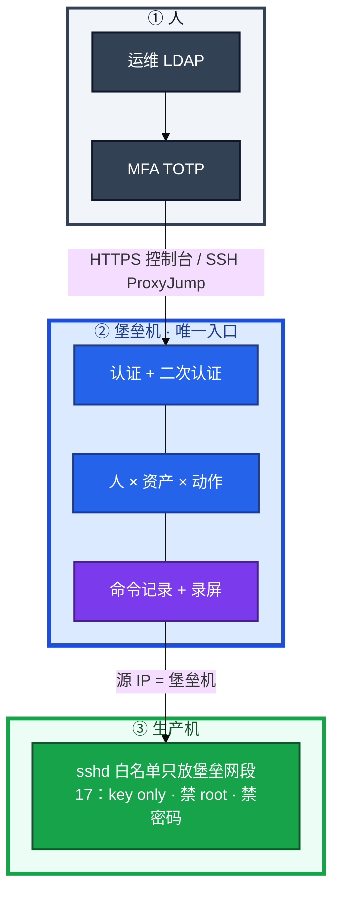
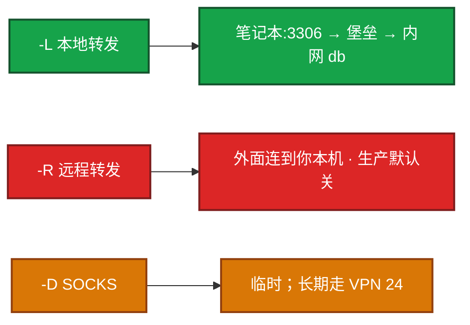
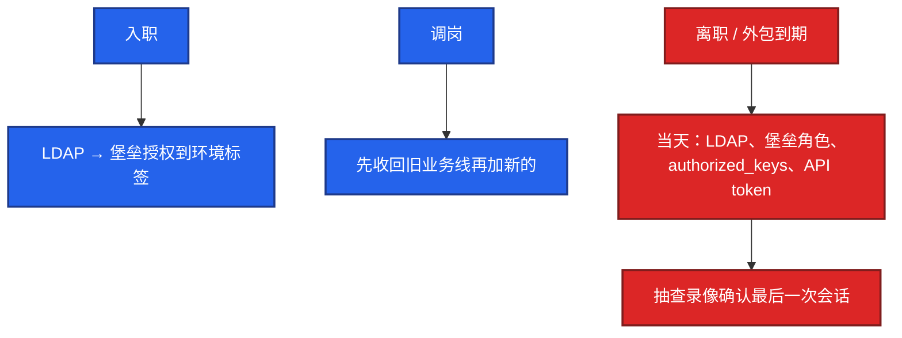
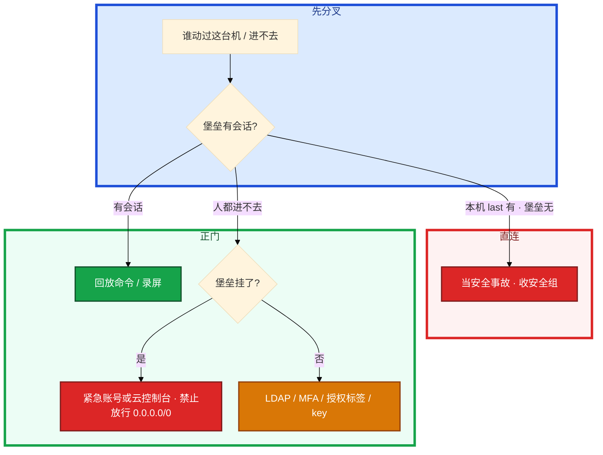

# 堡垒机与跳板机


开发在安全组给自己笔记本加了 22，「就改一行配置」。支付库随后出现一条对不上人的 DROP。另一次堡垒机升级挂了，群里有人要改安全组对世界开放 22。本机 `last` 有登录，堡垒会话列表没有。

先别动手。这一章后半全是你会动手的：**怎么白名单、怎么 ProxyJump、隧道哪种能开、离职当天关什么、堡垒挂了走哪条紧急通道。** 前面的审计和最小权限，是为了让你动手时不把跳板当成已经合规。

**读完你能：** 画出人只经堡垒进生产；讲清审计 / 二次认证 / 最小权限；`-L` 连库、`-R` 默认关；没有防火墙白名单等于没做堡垒；直连当事故。

## 本章目录

缩进 = 上下级。3 下面才是 3.1。

想钉在**正文左边**跟着滚：菜单 **查看 → 打开视图 → 大纲**。Markdown 预览做不到独立左栏，目录只能写在文章开头。

- [1. 基本概念](#1-基本概念)
- [2. 架构图](#2-架构图)
- [3. 原理](#3-原理)
  - [3.1 审计](#31-审计命令录屏文件)
  - [3.2 二次认证](#32-二次认证mfa-与高危提权)
  - [3.3 最小权限](#33-最小权限人--资产--动作)
- [4. 安装部署](#4-安装部署)
- [5. 核心配置](#5-核心配置)
- [6. 常用命令](#6-常用命令)
- [7. 常用操作](#7-常用操作)
  - [7.1 连接与隧道](#71-连接与隧道)
  - [7.2 人员进出](#72-人员进出)
  - [7.3 应急通道](#73-应急通道)
- [8. 生产排障](#8-生产排障)
- [9. 必会 · 常考](#9-必会--常考)
- [合上书](#合上书问自己)

**本章不讲：** sshd_config 逐项、SUID、auditd、AIDE、sudo 白名单 → [17 Linux 安全加固](../17-Linux安全加固/)；正向代理、WireGuard → [24](../24-HAProxy与Keepalived/)；云 IAM、安全组、控制台 → [07](../../07-云平台/)；K8s RBAC、exec 审计 → [04-13](../../04-Kubernetes/13-RBAC与安全/)。

---

## 1. 基本概念

跳板机是一台能 SSH 中转的机器。堡垒机是 **认证 + 授权 + 录像 + 命令审计** 的控制系统。合规（等保 / SOC2 / ISO27001）要的是后者。小团队可以先跳板，但大厂默认：没有堡垒机日志的操作，等于没发生过——出事无法追责。

开口先说 **唯一入口 + 禁直连**。sshd 硬化（禁 root/密码、算法、MaxAuthTries）在 **17**。本章假设已经 key only。人侧用跳转，不要每台公网 22。

| | 跳板机 | 堡垒机 |
|--|--------|--------|
| 本质 | SSH 中转 | 访问控制产品 |
| 权限 | 有账号就能进后面 | 人↔资产 细粒度 |
| 审计 | 基本无 | 命令 + 录屏 |
| 账号 | 各机 authorized_keys 手维护 | LDAP/AD |
| 合规 | 通常不够 | 等保等 |
| 成本 | 低 | 中高 |
| 适用 | 很小的团队 | 中大厂默认 |

生产禁止（和 17 硬化叠在一起，不是二选一）：

| 禁止 | 为什么 |
|------|--------|
| root 直连 | 对不上人（17） |
| 密码登录 | 撞库 |
| 绕过堡垒 | 无录像，合规失败 |
| 共用 `ops` | 无法追责 |
| 私钥无 passphrase / 丢网盘 | 等于把门复制走 |
| 生产机对公网 22 | 扫描面 |

安全组 / iptables 只放行堡垒机到 22（或改过的端口）。人从家里直连成功 = 入口事故，不是「方便」。

K8s exec 是绕过主机 SSH 的另一条门，要走 04-13 的 RBAC 和审计。主机白名单管的是 sshd，不是 apiserver。两条入口都要收。

> **记住**：产品再全，生产机 SSH 不白名单，人仍能直连，审计是空的。本机有登录、堡垒没有 = 直连事故。

---

## 2. 架构图

先把整张图钉住。后面安装、命令、排障都对着这张图说话。



图上三条线：

1. **没有从笔记本直达生产 22 的箭头。** 办公网进堡垒，堡垒进生产，两段分开。
2. **Web 终端和 SSH 客户端都要审计。** 只录像 Web、SSH 协议开个口，等于半套。
3. **源 IP 必须是堡垒。** `authorized_keys` 可 `from="堡垒网段"`；安全组只放该网段。

开源常见 **JumpServer**；商业 CyberArk、BeyondTrust、云厂商堡垒机。功能要会讲：资产、用户对接 LDAP、授权、会话审计、批量命令、Web 终端。

没有「SSH 白名单只放堡垒」时，JumpServer 只是多了一道密码，人仍能直连，**审计是空的**。产品和防火墙必须一起做。

---

## 3. 原理

原理只保留动手和面试会用到的：怎么追责、第二道门、权限为什么只能做减法。

**本节 3 块：** 3.1 审计 · 3.2 二次认证 · 3.3 最小权限

### 3.1 审计：命令、录屏、文件

出事要能回答：谁、何时、哪台、敲了什么、有没有传文件。跳板只解决网络路径，答不出这句。

| 能力 | 现场怎么用 |
|------|------------|
| 命令回放 | 事故查「谁在几点敲了 drop」 |
| 录屏 | 交互式 vim/mysql 客户端也有画面 |
| 文件传输 | 上传脚本、下载 dump 单独授权、单独留痕 |
| 会话列表 | 值班先问堡垒，再看本机 `last` / `w` / auditd（17） |
| 批量命令 | 类似 Ansible，仍要审计 |

录屏按合规留 **180 天+**（常见等保口径，以法务为准）。不要和游戏热日志同一套 7 天删除（22）。录屏文件进独立盘或对象存储。

本机有 SSH 记录、堡垒没有 = 直连，当安全事故，不是「同事图方便」。共用 `ops` 账号 = 追不到人。立刻拆成实名。

### 3.2 二次认证：MFA 与高危提权

MFA：密码/key 过了还要 TOTP 或短信。开在 **登录堡垒这一跳**。后面到生产机仍是堡垒用服务账号或用户证书去 SSH，**不要**让 MFA 失效时人人改回密码直连。

二次认证还可以 step-up：进支付库、GM、生产 DROP 类动作再要一次审批或再一次 MFA。只挡堡垒登录、高危资产与普通测试机同一道门，等于没有最小权限。短信 MFA 弱于 TOTP/硬件钥；能上 TOTP 就不要只靠短信。备份码进保险箱，份数按人，离职作废。

只 MFA 没有白名单：key 在笔记本上，人仍可直连生产，MFA 形同虚设。

会话审计要覆盖：交互 shell、Web 终端、SFTP/scp、端口转发申请。只记命令行、不记传文件，dump 库会从旁边溜走。录像时钟用 NTP（19），否则和业务日志对不上时间线。

### 3.3 最小权限：人 × 资产 × 动作

入职授权到 **环境标签**（测试 / 预发 / 某业务线），不是到全部机器。调岗先收回再加，不要只做加法。支付、GM、数据库资产单独名单，季度 review。外包账号设过期时间。曾经值班所以永远能进支付库 = 权限腐烂。

权限模型记三句：默认拒绝；时间盒（活动值班两天，过期自动没）；动作拆开（能看不能下、能 SSH 不能 SFTP）。「临时加一下」必须有到期，和 21 的 Silence 同一纪律。

落到密钥选项上，不只靠 sudoers（17）：

| 选项 | 干什么 |
|------|--------|
| `from="192.168.1.0/24"` | 即使 key 泄漏，不在网段也废 |
| `no-port-forwarding` | CI 不能开隧道扫内网 |
| `no-pty` | 不能交互 |
| passphrase | 防文件被拷 |

passphrase 和 from= 都要。堡垒侧再加 MFA。

`AllowTcpForwarding no` 能防隧道绕过，但运维常用 `-L` 连库——**政策上：隧道只允许从堡垒机发起，生产机可关转发。** 全关会疼，全开等于堡垒机白名单被隧道穿透到任意内网。按资产角色拆。

批量发公钥：Ansible `authorized_key`，或 **AuthorizedKeysCommand 从 LDAP 拉**，不要 200 台手拷。禁用某 key：从文件删除或加限制前缀。轮换和吊销流程要能说（17 的「key 被盗」）。

> **记住**：跳板能进，堡垒能追责；没有白名单的堡垒只是多了一道密码。入职最小授权到标签；离职当天关 LDAP 和 key。

---

## 4. 安装部署

生产部署：多实例 + 库高可用 + Redis；**所有服务器 SSH 只放堡垒机 IP**；开 MFA；离职当天关账号；录屏独立存储。升级窗口准备好第 7.3 节的紧急通道。

| 项 | 选 | 不选 |
|----|----|------|
| 入口 | 堡垒唯一；办公网只到堡垒 | 办公网段:22 直达生产 |
| 账号 | LDAP 实名 | 堡垒本地一套、Linux 又一套对不上；共用 ops |
| MFA | 堡垒登录必开 | MFA 挂了改回密码直连 |
| HA | 控制面多实例，PG/MySQL 主从，Redis 会话 | 单机堡垒当单点还关紧急通道 |
| 审计存储 | 独立盘 / OSS，180 天+ | 和 ES 热日志抢盘、7 天删 |
| 生产 sshd | 白名单 + 17 硬化 | 对公网 22；root/密码 |

笔记本只装堡垒客户端 / 配 ProxyJump。生产机永不加他的公网 IP。

JumpServer 一类落地时资产进清单：服务器 / 数据库 / K8s 分标签（环境、业务线、是否支付）。授权是人×资产×动作（SSH、SFTP、执行命令、拉桌面），不要「登录了就能 sudo 无密码」（sudo 白名单在 17，堡垒侧仍要关传文件、关剪贴板）。

资产发现：新机器入流水线必须先挂堡垒白名单和标签，再交业务。先上线后补堡垒 = 一段无审计窗口。K8s 节点同样：kubelet 所在机 22 也只放堡垒，不要「节点在 VPC 里就随便 SSH」。

高危动作（生产 DROP、改 authorized_keys、关防火墙）走 **二次审批 / step-up MFA**，会话里打标。批量命令当 Ansible 用也要同一套审计，不要 SSH 循环裸跑。

网络分段：办公网 → 堡垒区 → 生产区。堡垒网卡可双臂，生产机默认路由不必指向办公网。跳板机历史遗留要收到与堡垒同一白名单，不能两套入口并存。

HA：控制面至少两台；会话在 Redis；库主从；录屏卷独立、能扛活动期多人同时操作（高峰改配置也走堡垒，21 活动红线不豁免审计）。升级前打开紧急通道演练，不是升级当晚才找串口密码。

验收：从办公网直连生产 22 失败；经堡垒成功且有录像；Web 与 SSH 协议都有会话；SFTP 上传有单独日志；测试离职账号当天进不去；支付资产无「全员可进」角色。

---

## 5. 核心配置

人侧 `~/.ssh/config`（本章加的是跳转，不是 17 的 sshd 表）：

```bash
ssh -J jumphost target-server

# ~/.ssh/config
Host production-*
    ProxyJump jumphost.example.com
    User ops
    IdentityFile ~/.ssh/id_ed25519
```

密钥：`ssh-keygen -t ed25519`。`authorized_keys` 限制来源：

```
from="192.168.1.0/24" ssh-ed25519 AAAA... ops@company.com
```

CI 公钥再加 `no-pty,no-port-forwarding`。

隧道 config：

```
Host db-tunnel
    HostName jumphost.example.com
    User ops
    LocalForward 3306 db-internal:3306
    LocalForward 6379 redis-internal:6379
    ServerAliveInterval 60
    ServerAliveCountMax 3
    ExitOnForwardFailure yes
```

多跳：`ssh -J bastion,jumphost2 target`。config 里 `ProxyJump` 链式写清。

| 政策 | 生产怎么用 | 改错会怎样 |
|------|------------|------------|
| SSH 白名单 | 只放堡垒网段 | 产品形同虚设 |
| MFA | 堡垒登录；高危可 step-up | 失效时改直连 = 事故门 |
| 隧道 | `-L` 排障 + 工单；`-R` 默认关 | `-R` 等于跳板开口子 |
| 长期 `-fN` | 工单，不要当个人 VPN | 每人一条常开隧道 |
| 录屏保留 | 180 天+ | 7 天删 = 合规失败 |
| 紧急账号 | 保险箱、审批、用完收回 | 长期 NOPASSWD = 第二扇门 |

> **记住**：人走 ProxyJump；生产机只认堡垒网段的 key，不要 200 台手拷公钥。`-L` 连内网库是排障正道；`-R` 生产默认关。

文件传输默认关，需要时单独开 SFTP 并留痕。剪贴板/下载 dump 进支付机按高危资产走 step-up。堡垒时钟必须 NTP（19），否则录像和业务日志对不上。会话空闲超时与 17 的 sshd 空闲一致，避免「人走了会话还挂着」。

---

## 6. 常用命令

人怎么连、现场怎么证明有没有直连。

```bash
ssh -J bastion ops@prod-db-01
ssh -L 3306:db-internal:3306 -N jumphost
mysql -h 127.0.0.1 -P 3306
ssh -fN db-tunnel
# 禁止默认：ssh -R 8080:localhost:8080 jumphost
# 临时 SOCKS：ssh -D 1080 jumphost   # 长期走 24 WireGuard
```

| 目的 | 命令 | 看什么 |
|------|------|--------|
| 跳转 | `-J` / ProxyJump | 第二跳源 IP 是堡垒 |
| 本地转发 | `-L` | 排障连内网库 |
| 动态转发 | `-D` | 临时；不是架构 |
| 谁在机上 | 堡垒会话列表；本机 `last` / `w` | 有 last 无堡垒 = 直连 |
| 吊销 | 删 authorized_keys / LDAP 禁用 | 离职当天 |

现场排查「谁在这台机上」：先问堡垒会话列表，再看本机 `last` / `w` / auditd（17）。

生产机上也可以 `sshd` 日志对源 IP：不是堡垒网段的成功登录 = 白名单破了。`from=` 限制的公钥在别的网段会直接失败，这是预期。CI 机器人账号单独资产标签，禁止登录支付机。

堡垒自身也要被 21 盯：进程、证书、磁盘（录屏盘将满）、blackbox 探控制台 URL。堡垒盘满导致无法录像时，策略应是 **拒绝新会话**，而不是静默放行无审计登录。

---

## 7. 常用操作

### 7.1 连接与隧道

生产库不应对外暴露。本地转发把笔记本的 3306 经堡垒转到 `db-internal:3306`，堡垒会话里留得下记录。`-N` 不打开 shell。



`-L`：流量从你电脑发起。`-R`：对端发起连到你。方向反了，风险完全不同。远程转发在生产等于把内网服务暴露到跳板，默认禁止，要开必须审批。动态转发类似临时正向代理（24 的 Squid 才是出网正道）。长期应用进内网管理面用 VPN 或堡垒端口转发，不要每人一条 SOCKS。生产机 `AllowTcpForwarding no` 时 `-D` 会失败——那是在逼你走正门。

### 7.2 人员进出



权限关闭必须 **当天**。HR 流程接进出系统，不要等「下周迭代」。HR 晚一天都可能被旧 key 登入。外包到期与离职同一条：账号带过期时间，到期自动没，不要靠项目经理提醒。

季度 review 支付 / GM / 数据库资产：对一下「还在这个组的人是不是还干这个活」。曾经值班所以永远能进 = 权限腐烂，和 21 从未处理的告警规则一样该砍。

账号被盗：立刻禁用、吊销 key、看录像和 `last`、评估有没有改 authorized_keys 和 crontab、轮换被碰过的密钥。已经变成入侵按 17 隔离取证。活动高峰被盗不降级处理：先关门再排故障，不要「活动过了再关」。

### 7.3 应急通道

堡垒机升级挂了，大厅要紧急改配置。不能把安全组改成对世界开放 22。

1. 预先的 **紧急账号**（保险箱、审批才能取密），或云厂商 **VNC/串口控制台**（07）。
2. 用完立刻收回，**补审计说明**（谁、何时、为何、做了什么）。
3. 不能因为堡垒挂了就改安全组对世界开放 22。对个人 IP 开放 = 直连且无审计，只在文档写明的灾难级别、双人审批、限时自动收回才可能接受，默认否。升完堡垒立刻收回并补日志。

活动高峰改配置：仍然走堡垒；21 的红线不豁免审计。录像时钟用 NTP（19）。多人同时操作时 Redis 会话和录屏盘要扛得住，不要因为卡就改直连。

---

## 8. 生产排障

三问：这条登录堡垒有没有会话？生产 sshd 是否只认堡垒？能不能在不开放 22 的情况下修？



| 现象 | 先做什么 | 不要做什么 |
|------|----------|------------|
| 本机有 last、堡垒没有 | 当直连事故；收 22 | 「图方便」放过 |
| 买了 JumpServer 仍办公网:22 | 安全组只放堡垒 | 以为产品已经合规 |
| 离职账号还能进 | 当天关 LDAP/key/token | 等 HR 下周 |
| 共用跳板账号 | 立刻拆实名 | 事后猜是谁 |
| 堡垒升级失败 | 云控制台 / 紧急账号 | `0.0.0.0/0` 开放 22 |
| CI key 被拿去 `-L` 扫内网 | from= + no-port-forwarding | 只靠 sudoers |
| `-D` 当长期翻墙进 Grafana | 改 VPN 或堡垒正门 | 每人一条 SOCKS |
| K8s exec 绕过 sshd | 04-13 RBAC/审计 | 只收主机 22 |
| 录屏盘满仍放行登录 | 拒绝新会话 | 无审计放行 |
| 堡垒证书过期控制台打不开 | 21 的 7 天线；走紧急通道 | 开放生产 22 |

活动高峰改配置：走堡垒；不要为了快把 22 打开。审计事后补不回来的是直连那几分钟。

---

## 9. 必会 · 常考

白板和追问高频，能一口回：

| 说法 | 对错 | 口径 |
|------|:----:|------|
| 有跳板就够等保 | 错 | 要人是谁、碰哪台、录像 |
| 装了 JumpServer 不必收 22 | 错 | 白名单不做等于没做 |
| 绕过堡垒直连只是方便 | 错 | 无录像，当事故 |
| 共用 ops 账号能追责 | 错 | 追不到人 |
| root / 密码登录可以开着 | 错 | 17 禁；本章禁直连 |
| MFA 挂了就改密码直连 | 错 | 紧急通道不是直连 |
| `-R` 和 `-L` 风险一样 | 错 | `-R` 生产默认关 |
| 200 台手拷公钥可维护 | 错 | LDAP / Ansible；漏吊销 |
| 只录像 Web 终端即可 | 错 | SSH 协议也要审计 |
| 录屏和游戏日志一起 7 天删 | 错 | 180 天+、独立存储 |
| 堡垒挂了就开放 22 | 错 | 紧急账号或云控制台 |
| 紧急账号长期 NOPASSWD | 错 | 第二扇门 |
| K8s exec 不算入口 | 错 | 另一条门，04-13 |
| `-D` 可当生产出网 / 进内网架构 | 错 | 临时；正门是 VPN/堡垒 |
| 入职授权到全部机器省事 | 错 | 标签 + 最小权限 |
| 离职明天再关 LDAP | 错 | 必须当天 |

数字：录屏常见 **180 天+**；审计日志合规常 **1 年+**（22）；证书/堡垒探活跟 21 的 **7 天**；ED25519；`ServerAliveInterval 60`；`ServerAliveCountMax 3`。

易混：跳板 vs 堡垒；`-L` vs `-R` vs `-D`；本章入口 vs 17 sshd 表；主机 22 vs K8s exec；MFA vs 安全组白名单；紧急通道 vs 临时开放 22；能 SSH vs 能 SFTP；登录 MFA vs 高危 step-up。

活动期改配置也走堡垒。
录屏盘满拒绝新会话，不开放 22。

---

## 合上书，问自己

1. 生产唯一入口是什么？没有白名单的堡垒还算不算做了？
2. 审计要留下哪几样？本机有 last、堡垒没有说明什么？
3. MFA 开在哪一跳？高危资产要不要 step-up？失效时能不能改直连？
4. 最小权限落到人×资产×动作和密钥 `from=` / `no-port-forwarding` 怎么讲？
5. ProxyJump、`-L`、`-R`、`-D` 生产各允许到什么程度？
6. 离职当天关什么？堡垒挂了走哪条通道、绝不能做什么？

六题都能口述，这一章就过了。基础底座入口、日志、监控和人，到这里收口。
