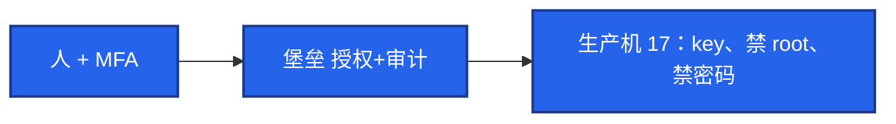

# 25｜堡垒机与跳板机 · 练习题

先自己画图或口述，再对照解答。每题标了覆盖范围：

| 标记 | 含义 |
|------|------|
| **核心** | 不懂整章就没建立起来 |
| **必会** | 值班和面试都要能讲 |
| **常用** | 线上会反复碰到 |
| **常考** | 白板和追问的高频口径 |

## 本题目录

- [Q1 唯一入口](#q1)
- [Q2 跳板 vs 堡垒 / 禁直连](#q2)
- [Q3 隧道](#q3)
- [Q4 和 17 怎么分工](#q4)
- [Q5 离职与被盗](#q5)
- [Q6 没有白名单](#q6)
- [Q7 密钥选项](#q7)
- [Q8 紧急通道](#q8)
- [Q9 SOCKS](#q9)
- [Q10 审计 / MFA / 最小权限](#q10)
- [合上书](#合上书)

---

## Q1

**★★★★★｜生产怎么管服务器访问？没有堡垒机行不行？**

**覆盖**：核心 · 必会 · 常考

### 场景

「我们有跳板机，大家都 ssh 上去再跳。」安全问有没有录像、能不能证明谁 DROP 了表。

### 完整解答

跳板只解决网络路径。堡垒机还要：**人是谁（LDAP+MFA）、能碰哪台、命令和录屏、离职能一键关。** 机器侧 SSH **只允许堡垒机 IP**，否则产品形同虚设。



小作坊可以先跳板；中大厂、等保、出事追责，必须堡垒。开源 JumpServer 或云厂商产品都可以，关键是白名单 + 审计闭环。

### 再追问

堡垒机挂了怎么办？——预置紧急账号（保险箱+审批）或云 VNC/串口。禁止临时对 `0.0.0.0/0` 开放 22。事后补操作说明。

---

## Q2

**★★★★★｜跳板机和堡垒机差在哪？为什么禁止直连？**

**覆盖**：核心 · 必会 · 常考

### 场景

开发在安全组给自己笔记本加了 22，「就改一行配置」。

### 完整解答

直连 = 绕过审计。密钥在笔记本上，离职、丢失、投毒都对不上堡垒录像。生产机防火墙必须 **deny 除堡垒外的 SSH**，包括运维自己的家宽 IP。

跳板：中转。堡垒：中转 + 权限 + 录像。共用跳板账号等于没人。

### 再追问

K8s exec 算不算直连？——绕过主机 SSH 的另一条门，要走 04-13 的 RBAC 和审计。主机白名单管的是 sshd，不是 apiserver。两条入口都要收。

---

## Q3

**★★★★☆｜ProxyJump 和三种隧道各干什么？生产允许哪种？**

**覆盖**：必会 · 常用 · 常考

### 场景

DB 不暴露公网。有人 `-R` 把生产 3306 转到自己电脑还开着 `-f`。

### 完整解答

| 方式 | 干什么 | 生产 |
|------|--------|------|
| `-J` / ProxyJump | 人先到堡垒再 SSH 目标 | 默认路径 |
| `-L` 本地转发 | 本机端口经堡垒到内网服务 | 排障可用，要审计 |
| `-R` 远程转发 | 让外面连到你本机 | **默认禁止** |
| `-D` SOCKS | 浏览器走 SSH | 临时，不是出网方案（24） |

```bash
ssh -J bastion ops@prod-db-01
ssh -L 3306:db-internal:3306 -N bastion
```

`-R` 等于在跳板上开洞。`AllowTcpForwarding` 可在生产机关掉，只留堡垒能转。长期 `-fN` 隧道要工单，不要当个人 VPN。`-L` 流量从你电脑发起；`-R` 对端发起连到你。

### 再追问

本地转发和远程转发谁发起？——方向反了，风险完全不同。`-R` 生产等于开口子。

---

## Q4

**★★★★☆｜SSH 生产禁止什么？和 17 怎么分工？**

**覆盖**：必会 · 常考

### 场景

被问「SSH 怎么加固」时把 17 的 sshd 表背完，没提堡垒。

### 完整解答

开口先说 **唯一入口 + 禁直连**。再引用 17：`PermitRootLogin no`、`PasswordAuthentication no`、`AllowUsers`、key+passphrase、改端口只减噪音。ED25519。空闲超时。

本章加的：`from=` 限制公钥来源、ProxyJump、隧道政策、离职清 key。不要两章重复背同一份 sshd_config。

### 再追问

批量发公钥？——Ansible `authorized_key`，或 LDAP `AuthorizedKeysCommand`。200 台手拷一定漏吊销。

---

## Q5

**★★★★☆｜发现账号被盗、离职当天来不及，怎么办？**

**覆盖**：必会 · 常用

### 场景

员工已走，LDAP 明天才关。旧笔记本还能 ProxyJump 进支付机。

### 完整解答

权限关闭必须 **当天**：LDAP、堡垒授权、所有 `authorized_keys`、可能的 API token。HR 流程接进出系统，不要等「下周迭代」。

被盗：禁用、吊销 key、看录像和 last、查是否加了新公钥和 crontab、轮换被碰过的密钥。按 17 隔离取证如果已经变成入侵。

### 再追问

共用跳板机账号怎么追？——追不到人。这就是禁共享账号的原因。立刻拆成实名 + 堡垒。

---

## Q6

**★★★★☆｜JumpServer 部署了但机器仍对办公网开放 22，有用吗？**

**覆盖**：核心 · 必会 · 常考

### 场景

买了产品，安全组还是 `办公网段:22`。有人从不点 Web 终端，直接 ssh。

### 完整解答

没有用。审计只覆盖「乖的人」。必须 **sshd + 安全组只放堡垒网段**，直连失败。办公网进堡垒，堡垒进生产，两段分开。

MFA 开在堡垒登录上。录屏存储与保留策略写进合规（180 天+），别和游戏日志同一套 7 天删除（22）。Web 终端和 SSH 客户端都要审计。

### 再追问

Web 终端和 SSH 客户端哪个要审计？——都要。只录像 Web、SSH 协议开个口，等于半套。

---

## Q7

**★★★★☆｜authorized_keys 里 from= 和 no-port-forwarding 干什么？**

**覆盖**：必会 · 常用

### 场景

CI 公钥能登录，还被拿去 `-L` 扫内网。

### 完整解答

`from="堡垒网段"`：即使 key 泄漏，不在网段也废。`no-port-forwarding` / `no-pty`：CI 只跑命令，不能开隧道、不能交互。最小权限落到密钥选项上，不只靠 sudoers（17）。

### 再追问

passphrase 和 from= 哪个重要？——都要。passphrase 防文件被拷；from= 防拷到别的网还能用。堡垒侧再加 MFA。

---

## Q8

**★★★★☆｜紧急通道和「临时开 22」怎么选？**

**覆盖**：必会 · 常用 · 常考

### 场景

堡垒机升级失败。群里有人要改安全组放行自己 IP。

### 完整解答

走 **云控制台串口/VNC** 或预埋紧急用户（密在保险箱）。改安全组对个人 IP 开放 = 直连且无审计，只在文档写明的灾难级别、双人审批、限时自动收回才可能接受，默认否。升完堡垒立刻收回并补日志。禁止 `0.0.0.0/0`。

### 再追问

紧急账号长期 NOPASSWD 放在机器上？——等于第二扇门。紧急账号应关登录、需要时再启用，或只许控制台。

---

## Q9

**★★★★☆｜运维用 -D 当 SOCKS 翻到内网管理界面，行不行？**

**覆盖**：常用 · 常考

### 场景

内网 Grafana 不暴露。有人 `ssh -D` 再把浏览器指到 1080。

### 完整解答

临时排障可以，且必须经堡垒，会话能记到「开了动态转发」。长期应用该走 VPN（24 WireGuard）或内网 SSO，不要每人一条 SOCKS。生产机 `AllowTcpForwarding no` 时这条会失败——那是在逼你走正门。

### 再追问

这和正向代理有什么关系？——都是「我当客户端去连别人」。公司出网用 Squid（24）；进内网管理面用 VPN 或堡垒端口转发。SSH -D 是方便工具，不是架构。

---

## Q10

**★★★★☆｜审计、二次认证、最小权限，白板怎么一口回？**

**覆盖**：核心 · 必会 · 常考

### 场景

面试官：「你们堡垒机除了能登录，还解决什么？」有人开始背 JumpServer 菜单。

### 完整解答

三件事：

1. **审计**：命令 + 录屏 + 传文件；出事能回答谁/何时/哪台/敲了什么。本机 last 有、堡垒无 = 直连事故。
2. **二次认证**：MFA 开在登录堡垒；支付库/GM 可 step-up。不要 MFA 失效就改密码直连。
3. **最小权限**：人 × 资产 × 动作；入职到环境标签；调岗先收回；离职当天关；密钥 `from=` / `no-pty` / `no-port-forwarding`。

防火墙白名单不做，上面三件都是空的。

### 再追问

只开 MFA、22 仍对办公网开放？——key 在笔记本上仍可直连，MFA 形同虚设。产品和防火墙必须一起做。

---

## 合上书

- [ ] 能画出人 + MFA → 堡垒 → 生产机白名单，并对比跳板
- [ ] 能说明没有 SSH 白名单的产品等于没做；直连是事故
- [ ] 能区分 ProxyJump / -L / -R / -D 的生产政策
- [ ] 能把本章入口和 17 的 sshd 表分开讲
- [ ] 能默写离职当天关 LDAP / 堡垒 / key / token
- [ ] 能处理堡垒故障：紧急账号或云控制台，绝不开放 22
- [ ] 能一口回审计、二次认证、最小权限，并落到 from= 与 MFA
