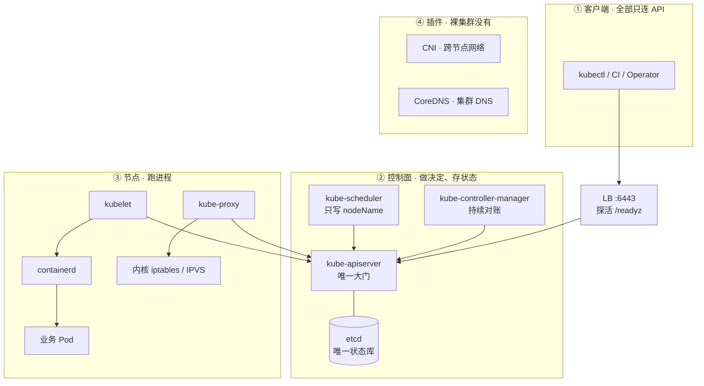
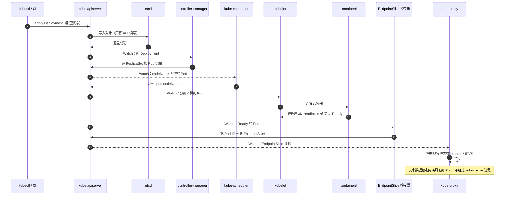
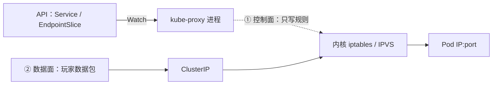
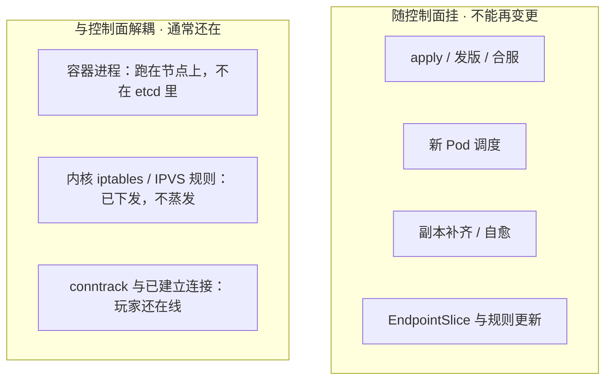
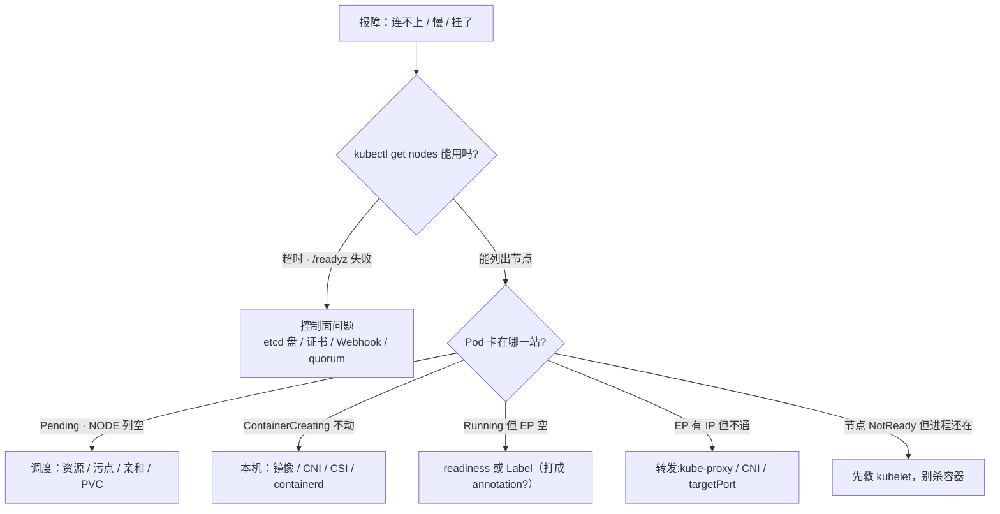

# 集群架构

> 活动高峰，`kubectl` 全面超时，监控红了一片「集群异常」——玩家却还在打本。群里有人在数「1、2、3 重启全部逻辑服」，手就放在批量执行键上。
> **本章回答**：一次 `kubectl apply` 从回车到玩家流量进新 Pod 走过哪几站；任一格挂掉时，什么还在、什么停了。
> **不讲**：etcd Raft / quorum / 备份 → [02](../02-etcd/)；认证鉴权准入 / Watch Cache / APF 细节 → [03](../03-API-Server/)；三探针与优雅退出 → [04](../04-Pod生命周期/)；滚动与 PDB → [05](../05-工作负载控制器/)；Service 类型与转发细节 → [08](../08-Service与kube-proxy/)。

**标记**：🎯重点 · 🔥难点 · ⭐常考 · 🔧实操

---

## 一、一张图：一次发版的一生 ⭐

> 🎯 **一句话**：集群分三层——控制面做决定、节点跑进程、插件补网络与 DNS；一次发版要过八站。



- 📖 **读图**
  - 🔐 全图只有 API ↔ etcd 那条双向线：**只有 kube-apiserver 读写 etcd**；其余一律只连 API（练习题 Q1）
  - 🚪 `kubectl` 超时：沿客户端 → LB → API 查；常见 LB 没探 `/readyz`、etcd 盘慢、Webhook 超时——很少是 API CPU 不够
  - 📦 Pod 卡住：NODE 列空 → scheduler；ContainerCreating → kubelet/CNI/CSI；Running 无流量 → readiness / Label（第八节决策树）

三层各管什么：

- **控制面**：存期望、推动现状追上去——**不跑你的游戏进程**
- **节点**：kubelet + 运行时起容器；kube-proxy 改内核转发
- **插件**：kubeadm 刚装完是「裸」的——CNI / CoreDNS 另装，否则跨节点不通、域名解析不了（第六节）

空间图看完，换**时间**：一次发版先后发生什么？



- 📖 **读图**
  - 📝 **1～6 步全在写记录**，kubelet 那步才真正起进程——催多少遍也不会多一个玩家进程
  - ⚖️ 两个「不等于」：**调度成功 ≠ 容器起来**，**Ready ≠ 玩家已能连进来**（练习题 Q2）
  - 📡 **Watch** = 订阅推送，不是轮询；第四节控制循环还要用

节与时间线：**二**①② 写期望 · **三**落库 · **四**③④ 对账 · **五**⑤⑥ 派工起容器 · **六**⑦⑧ 通流。

---

## 二、提交：声明式 API

> 🎯 **一句话**：你提交的是「要什么」，不是「怎么做」——控制器负责把现状追成期望。

- **声明式（declarative）**：`spec` 里写「几个副本、什么镜像」，不指挥「先建 A 再建 B」
- **命令式（imperative）**：`kubectl run` / `scale` / `edit`——直接下手做一步

> 💡 **打个比方**：点外卖写「两杯奶茶」，不指挥骑手路线；「催单」= 再 `apply` 一次确认订单，不是替骑手跑。

生产以声明式为主——留下的是**可反复对账的期望**：

- 🔥 **幂等**：同一 YAML 多 apply，不会多出几倍 Pod——脚本重试、流水线重跑才敢放手
- **自愈**：Pod 没了会补——期望还在，控制器盯着补（第四节）

> 🔍 **现场**：活动期大厅 8 → 20。

```bash
kubectl scale deploy hall --replicas=20 -n game
kubectl get deploy hall -n game -o jsonpath='{.spec.replicas}'
# 20   ← 改的是 etcd 里 Deployment 的 spec.replicas，期望已落盘
```

- 发生了什么：`scale` **不起容器**，只把期望从 8 改成 20；ReplicaSet 控制器再对账补 Pod
- 别让人和机器同时改同一份期望：

  - **Git 管配置（GitOps，如 Argo CD → [23](../23-GitOps-ArgoCD与Tekton/)）**：仓库仍是 `replicas: 8` 时，下次同步会打回 8——应急 scale 当天要把 Git 也改成 20
  - **开了 HPA（→ [07](../07-弹性伸缩/)）**：HPA 写 `spec.replicas`，CI YAML 又写死副本数 → 两边轮流覆盖。谁管弹性，就别在 YAML 写死 `replicas`

> ⚠️ **别混**：「scale 成功」≠「扩容完成」。要看 `get po` 是否 20 个 Ready，不是看 scale 退没退出。

> 📝 **面试**：生产用声明式——幂等、自愈、期望可落 Git；应急 scale 可以，Git 同步集群要当天补回仓库。⭐（练习题 Q4）

Workload 选型（同一份 `spec`，换控制器装期望）：可互换副本 → Deployment；固定名/独立盘/区服身份 → StatefulSet；每节点一份 → DaemonSet；一次性 → Job（→ [05](../05-工作负载控制器/)）。**房间绑内存的战斗服不要当 Deployment 默认滚**——滚动等于杀对局。

---

## 三、落库：etcd 是唯一状态库 ⭐🔥

> 🎯 **一句话**：etcd 里存的是对象，不是进程和流量；且只有 kube-apiserver 能碰它。

期望进 API 后落进 **etcd**——强一致分布式 KV（「刚写进去，下一秒谁读都是新值」；实现 → [02](../02-etcd/)），控制面**唯一状态库**。

- **在 etcd**：对象的 spec / status——Pod、Deployment、Service、Node、Secret、CR、Event
- **键路径**：`/registry/` + 资源类型 + 命名空间 + 对象名
- **不在 etcd**：容器进程、可写层、已下发的 iptables/IPVS、玩家长连接、业务库、镜像、日志

> 💡 **打个比方**：etcd 像连锁店台账——记「应有 20 家大厅」，门店服务员（进程）和客流（连接）都不在台账。台账烧了店还营业；只是不能开新店、改规划。第八节还用这个比方。

> ⚠️ **别混**：「对象写进去了」≠「容器起来了」。etcd 多一行 Pod 记录 ≠ 进程已起（第五节）。

#### ❓ 为什么只有 API 能碰 etcd？

- ❌ 若人人直连：绕过认证、鉴权、准入、审计；**写坏的对象会被控制器当期望执行**——比绕权限更危险
- ✅ 统一走大门：kubectl / CI / scheduler / controller-manager / kubelet **一律只连 API**
- 🔧 值班 `etcdctl` 只做 health / member / snapshot，**绝不要手改 `/registry`**

> 🔍 **现场**：`kubectl` 全超时，先问大门愿不愿接客。

```bash
kubectl get --raw /readyz?verbose
# 第一个不 ok 的检查项就是死因；etcd / poststarthook 最常见
```

- `/readyz` = API 体检：etcd 通不通、启动钩子完没完——全过才 ok；LB 探活也要用它
- 控制面一慢，九成是 **etcd 磁盘 fsync** 或 **准入 Webhook 超时**，不是 API CPU——**别上来给 API 加核**
- LB 必须探 HTTPS `/readyz`；只探 TCP 6443 会把「进程在、etcd 不通」留在池里

写请求进 etcd 前过五道关（细节 → [03](../03-API-Server/)），本章只记「坏了长什么样」：

- **认证**失败 → **401**（查证书 / token / kubeconfig，不是 RBAC）
- **鉴权**失败 → **403**（查 RoleBinding，不是证书过期）
- **准入**：Mutating 先改、Validating 再拒；Webhook 挂且 `failurePolicy=Fail` → **apply 全超时**
- **Watch Cache**：多数读走内存；**写仍过 etcd**
- **APF** 队列满 → **429**

⭐ 口诀：**401 = 我不认识你，403 = 我认识你但不能这么干**。

> 🔍 **现场**：控制器刷 429 → `kubectl get flowschema`；`kubectl get --raw /metrics` + `grep apiserver_flowcontrol_rejected_requests_total`（命令见 [03](../03-API-Server/)）。

本节对应练习题 Q3、Q9。

---

## 四、对账：控制循环 🔥

> 🎯 **一句话**：每个控制器都在转同一圈——看现状、比期望、不一致就动手；这圈叫控制循环。

kube-controller-manager 里几十个**控制器**，姿势一样——**控制循环（control loop）**：

1. **Observe**：Watch / List 自己管的对象
2. **Diff**：现状和 `spec` 一致吗？
3. **Act / reconcile**：不一致就写回 API

例：期望 20、现状 18 → ReplicaSet 控制器再建 2 个 Pod **记录**（不是人手动补）。

> 💡 **打个比方**：保安巡逻——看一眼、和台账比、少补多清——不是「跑一次的脚本」，是一直转的圈。

常见控制器：

- **Deployment**：管 ReplicaSet 新旧更替
- **ReplicaSet**：少建多删——你删一个 Pod，几秒后长回来
- **Node**：心跳丢了标 NotReady，超时打污点、驱逐
- **EndpointSlice**：命中 selector 且 Ready 的 Pod IP 进后端名单（第六节）

#### ❓ 为什么自愈不靠「听事件」？

很多人以为「Pod 被删发了通知才补」——**错了**。

- **状态触发（level-triggered）**：盯「现在应该是多少」，不依赖「刚才有没有那条消息」
- **事件触发（edge-triggered）**：缺一条通知就可能漏动作

> 💡 **打个比方**：事件触发像「打电话订水」——电话没打通水永远不来；状态触发像「送水工每小时巡楼」——桶空了就补，电话通不通无所谓。

- Watch 丢几条、断线重连、控制器重启 → 下次 List 到手照样收敛
- Informer：**先全量 List、再增量 Watch**，断线后重新 List 补齐
- ⭐ 面试把自愈答成「对事件反应快」= 答反——自愈靠的是**不依赖单条事件**（练习题 Q5）

> 🔍 **现场**：删 Pod，亲眼看补回。

```bash
kubectl delete po hall-abc123 -n game
kubectl get po -n game -l app=hall -w
# hall-abc123   1/1     Running   0       3d
# hall-xyz789   0/1     Pending   0       2s     ← ReplicaSet 对账新建
# hall-xyz789   1/1     Running   0       18s    ← 副本数重新对齐
```

`describe deploy` Events 里 `Scaled up replica set ...` = 持续 Watch + 对账，不是一次性脚本。

#### ❓ 为什么多副本还要选主？

controller-manager / scheduler 多副本 HA 必须 **leader 选举**（`--leader-elect=true`）：

- ❌ 两个都 Observe → Diff → Act，都看到「少 2」→ 建出 4；或一个要删一个要留 → 双写打架
- ✅ **多副本是「挂了有人接班」，不是「大家一起干」**

```bash
kubectl get lease -n kube-system kube-controller-manager -o yaml
# holderIdentity: m1_3f9c...     ← 当前持锁；重启前先看锁在谁手里
```

> ⚠️ **别混**：Running ≠ Ready。⭐ **Running** = 进程活着；**Ready** = readiness 过、能接流量。滚动 / PDB 按 Ready 计——无探针时账面满足、流量已 502（→ [04](../04-Pod生命周期/)）。

> 📝 **面试**：自愈 = Observe → Diff → Act；level-triggered；多副本要 leader；边界——**自愈前提是控制面活着**（第八节）。

---

## 五、派工：所有人都只跟 API 说话 ⭐

> 🎯 **一句话**：组件之间没有直连电话——scheduler 只写一个字段，kubelet 是唯一起容器的人。

etcd 里有了 Pod **记录**，记录不会自己变进程。第⑤⑥步：先派机器，再起容器——scheduler / kubelet **只连 API，彼此不直连**。

- 为什么不直连？每多一条专线就多一套认证 / 升级 / 故障点
- 做法：scheduler 写「派你去 worker-2」，kubelet Watch 领活——大门统一、组件可独立升级
- ⭐「组件有没有直连」→ **全走 API，无一幸免**（Q1 追问）

### 🧭 scheduler：只写 `spec.nodeName`

Watch `nodeName` 空的 Pod → 过滤（资源 / 污点 / 亲和）→ 打分（→ [06](../06-调度机制/)）→ **只写 `spec.nodeName`**。

- 🔥 三个「不」：**不起容器、不通知 kubelet、不碰节点**

> 🔍 **现场**：盯 Pending → Running。

```bash
kubectl get po test -n default -w
# NAME   READY   STATUS              NODE
# test   0/1     Pending                       ← NODE 空：还没写 nodeName
# test   0/1     Pending             worker-2  ← 调度完成，容器还没起
# test   0/1     ContainerCreating   worker-2  ← 拉镜像 / CNI / 挂卷
# test   1/1     Running             worker-2  ← 进程起来了
```

#### ❓ 调度成功为什么不等于容器起来？

> ⚠️ **别混**：Pending vs ContainerCreating——看 **NODE 列**切两段：

- **Pending 且 NODE 空**：还没调度 → 查资源 / 污点 / 亲和 / PVC
- **NODE 有值 + ContainerCreating**：调度完了、本机没起成功 → 查镜像 / CNI / CSI / containerd
- 别把第二段甩给 scheduler（练习题 Q11）

```bash
kubectl get po test -n default -o jsonpath='{.spec.nodeName}'
# worker-2     ← scheduler 全部成果；为空 = 还没调度，查它不查镜像
```

### 🏗️ kubelet：唯一起容器的人

Watch 本机 Pod → 经 **CRI** 调 **containerd** 起容器；挂卷、跑探针、上报状态。

- CRI = 标准接口，换运行时 kubelet 不用改
- 探针 / 生命周期钩子由 kubelet **本机执行**（→ [04](../04-Pod生命周期/)）

> 📝 **面试**：scheduler 只写 `nodeName`；kubelet 经 CRI 调 containerd；中间还有拉镜像 / CNI / 挂卷 / 探针。⭐

**cloud-controller-manager（CCM）**：对齐云资源（节点注册、LB Service、云路由）。不接云 API 通常不装——LoadBalancer 不会自动建云 LB。

---

## 六、通流：玩家的包怎么进 Pod ⭐🔥

> 🎯 **一句话**：玩家的包走内核规则，不经过 kube-proxy 进程；没有插件，集群是裸的。

Pod Ready 了还不能直接当玩家入口——玩家连的是 Service ClusterIP（稳定门口），不是会变的 Pod IP。第⑦⑧步：

1. **EndpointSlice 控制器**按 `selector` 收 **Ready** Pod IP → 后端名单
2. 各节点 **kube-proxy** Watch EndpointSlice → 写本机内核规则
3. 玩家包打到任意节点 ClusterIP → **内核 iptables / IPVS** 转到 Pod IP

> ⚠️ **别混**：EndpointSlice **不是** Deployment 写的——是 EndpointSlice 控制器按 selector + Ready。selector 不对或没 Ready → 名单空，有 VIP 也没后端。⭐

```bash
kubectl get endpointslice -n game -l kubernetes.io/service-name=hall-svc -o yaml
# - addresses:
#   - 10.244.3.17        ← 有 Ready Pod IP 才算有后端
#   conditions:
#     ready: true        ← 空列表先查 readiness / selector
```

#### ❓ 玩家的包为什么不经过 kube-proxy？

先分清 **控制面路径 vs 数据面路径**：



- 📖 **读图**
  - ① kube-proxy Watch API、写规则；② 玩家包走 ClusterIP → 内核 → Pod
  - **永远不经过 kube-proxy 进程**——别被 proxy 名字骗了

> 💡 **打个比方**：协管员改红绿灯配时表；汽车过路口走的是灯指挥的路，不从协管员身上碾过去。

```bash
iptables-save | grep hall-svc
# -A KUBE-SERVICES -d 10.96.88.10/32 -j KUBE-SVC-HALL    ← 规则在内核，不在进程里
```

- kube-proxy 挂了：**已下发规则还在**；存量长连接（含 conntrack）往往通；**新连接 / 新后端**规则停更 → 打空
- 口诀：**「旧通新不通」**——老玩家没事、新登录全失败 → 想 kube-proxy
- 部分 CNI（Cilium kube-proxy-replacement）可不跑 kube-proxy，但须有等价规则（→ [25](../25-eBPF与Cilium/)）；Service 细节 → [08](../08-Service与kube-proxy/)

### 🔌 裸集群缺什么

kubeadm 刚装完缺 **跨节点网络** 和 **集群 DNS**——另装 **CNI**（→ [10](../10-CNI与网络策略/)）和 **CoreDNS**（→ [09](../09-CoreDNS/)），自己以 Pod 跑在 `kube-system`：

```bash
kubectl get po -n kube-system
# calico-node-x7k2p   1/1   Running   ...   ← CNI 一般 DaemonSet
# coredns-7d8f9b-k2x  1/1   Running   ...   ← 缺了就是裸集群
```

### 🏷️ 旁支：Namespace · Label · Terminating

> ⚠️ **别混**：Namespace **不是墙**——默认跨 NS 网络通；它是逻辑分组 + RBAC / Quota 作用域（→ [13](../13-RBAC与安全/)）。真隔离叠 **NetworkPolicy**。

- **Label** = 货架标签，被 selector 检索；**Annotation** = 便利贴，不参与选择
- 把 `app=hall` 打进 annotations → Service 选不到 → EP 空、进程却 Running——先改 Label，别先疑 kube-proxy

🔥 **Terminating 卡住**：`delete` 先打 **deletionTimestamp**，等 **finalizer** 清单逐项摘完才真删——外部资源（云盘 / LB）清完才摘。卡住先查 CSI / Operator，**别第一时间手抠 finalizer**（孤儿资源持续计费；→ [11](../11-存储/)）。

```bash
kubectl get ns battle -o yaml | grep -A3 finalizers
# finalizers:
# - kubernetes       ← 等 finalizer 摘完才真删
```

> 📝 **面试**：Service 无后端——`get endpointslice` → 查 Ready / selector（别打进 annotation）→ 名单有再查 kube-proxy / CNI / targetPort。⭐（练习题 Q6、Q7）

---

## 七、形态：Stacked、External 与托管 ⭐

> 🎯 **一句话**：生产最小 HA = 3 台 Stacked + LB 探 /readyz；Stacked 和 External 差在故障域，不差在「谁才算 HA」。

- **单控制面**：只给开发机；一台挂 = 不能变更，且状态全丢
- **Stacked HA**（kubeadm 默认）：每台控制面跑 API + 一个 etcd 成员；3 台 + LB = 生产最小 HA；挂一台 = API + etcd 成员一起掉，剩两台仍够 quorum
- **External etcd**：API 一组、etcd 一组（3 或 5）；故障域干净，代价是多套机器 / 盘 / 证书；2379 只对 API 放行
- **托管（ACK / EKS / GKE）**：ssh 不进控制面；**影响面、Webhook、节点、CNI、备份 RPO 仍是你的**

#### ❓ 为什么 etcd 要奇数台？

🔥 **quorum** = 过半数成员确认才算数：

- 3 台要 2 确认 → 容挂 1；4 台要 3 确认 → **仍只能挂 1**——机器多了抗挂没涨
- 所以 **3 或 5，不要偶数**（推导 → [02](../02-etcd/)）。⭐ 面试几乎必问

> ⚠️ **别混**：Stacked ≠ 没做 HA。3 台 Stacked + LB 探 `/readyz` = kubeadm 生产最小 HA；和 External **差的只是故障域**（API 与 etcd 同生共死 vs 拆开）。

| 对比 | Stacked（kubeadm 默认） | External etcd |
|------|------------------------|---------------|
| 故障域 | API 与 etcd 同生共死 | 分开 |
| 挂一台 | 一个 API + 一个 etcd 成员 | API 挂不丢 etcd 多数派 |
| 额外运维 | 无 | 多一套盘 / 证书 / 2379 |
| 适用 | 默认选择 | etcd 要单独调优或隔离 |

生产底线（数字见第九节墙）：

- 控制面 **≥3** 跨 AZ；etcd **3 或 5**；独立 SSD，不和游戏日志混盘
- API 走 VIP/LB，探 `/readyz`；`--control-plane-endpoint` 写 VIP，写死单机 IP → 那台挂 `kubectl` 全死
- `--anonymous-auth=false`；Stacked → External 是项目，**别活动期做**
- Stacked 里 API 连 `127.0.0.1:2379` 是同命运设计；External 才写满 3 个 etcd 地址

#### ❓ 控制面为什么不能用 Deployment 管？

Deployment 靠 controller-manager / scheduler / API——可这些就是控制面自己。让控制面管控制面 = 拎自己头发上天。

→ **静态 Pod**：本机 kubelet 盯 `/etc/kubernetes/manifests/`，有 YAML 就保活进程，不经 API 对账：

```bash
ls /etc/kubernetes/manifests/
# etcd.yaml  kube-apiserver.yaml  kube-controller-manager.yaml  kube-scheduler.yaml
#   ↑ 改这里 = 改控制面，kubelet 按新配置重建静态 Pod
```

```bash
crictl ps --name kube-apiserver
# kube-apiserver   ...   kube-apiserver-m1    ← 没有 Deployment 管它
```

- 证书 `/etc/kubernetes/pki/`——**续完必须重启对应静态 Pod**；告警对齐 [02](../02-etcd/) 14 天（→ [14](../14-证书与kubeconfig/)）
- `admin.conf` 别当全集群共享管理员 kubeconfig
- Worker：systemd 拉 kubelet；kube-proxy 常 DaemonSet；CNI / CoreDNS 另装

升级：etcd 快照 → 滚动升控制面（一次一台，LB 留健康实例）→ 再滚 kubelet。**kubelet 最多比 API 低一个次版本**；控制面刚升完别同一秒全员重启 kubelet（→ [17](../17-节点运行时与升级/)，练习题 Q12）。

---

## 八、挂了：定责 ⭐🔥

> 🎯 **一句话**：别回答「集群挂了」——拆成三问：进程还在吗？还能变更吗？流量还通吗？

1. 已在跑的游戏进程还在不在？
2. 还能不能变更——发版 / 扩容 / 自愈？
3. 已有流量还通不通？

> 💡 **打个比方**：控制面像连锁总部订货系统——总部宕机，门店照常营业；只是接不了新指令、开不了新店。**总部宕机时把还在营业的门店烧了** = 开头「重启全部逻辑服」。

| 挂谁 | 已运行 Pod 与已有流量 | 变更与自愈 |
|------|----------------------|-----------|
| etcd / kube-apiserver | 在；已有流量一般还通 | **全停** |
| kube-scheduler | 在 | 新 Pod 永远 Pending |
| kube-controller-manager | 在 | 掉了不补、滚动停、驱逐无人决策 |
| kubelet（单机） | **进程往往还在** | 本机不探针、不上报；先别杀容器 |
| kube-proxy（单机） | 存量长连接往往还在 | 规则停更；新连接 / 新后端打空 |
| cloud-controller-manager | 在 | 云 LB / 路由变更停；已有入口通常不受影响 |

⭐ 练习题 Q3、Q10 从这张表出。

### 收束：控制面挂了，凭什么游戏服还在



- 📖 **读图**
  - 左 =「未来时」决策全过控制面 → 停；右 =「现在完成时」已落在节点 / 内核 → 控制面碰不到

三句话：

1. **状态与进程分离**：etcd 存对象不是进程
2. **规则与进程分离**：转发在内核，kube-proxy 挂了旧连接照走
3. **决策与流量分离**：调度 / 对账管将来，已有流量不经控制面

> ⚠️ **别混**：「通常还在」≠「没影响」。不能发版 / 扩容 / 自愈 → 再挂节点没人补——控制面挂越久越脆。

> 📝 **面试**：「API 挂了玩家还在吗」按三问答；点名组件影响；收住：**所以不要重启逻辑服**。⭐

### 决策树：现象直接对到人 🔧



- 📖 **读图**：第一刀 `kubectl get nodes` 能不能用；能则按发版链站位定责——**站名即责任方**。别每个分支都重启节点（剧本 → [18](../18-典型故障剧本/)）。

| 现象 | 先做 | 别做 |
|------|------|------|
| kubectl 超时、/readyz 失败 | etcd 盘、证书、Webhook、quorum | 重启全部游戏服 |
| 控制面慢，CPU 不忙 | etcd fsync / Webhook，再看 APF 429 | 先给 API 加核 |
| Pending，NODE 空 | 资源、污点、亲和、PVC | 查镜像、重启业务 |
| ContainerCreating 不动 | CNI / CSI / 镜像 / containerd | 当 scheduler 坏了 |
| Running 但 Service 没 EP | readiness、Label（查 annotation） | 重装 kube-proxy |
| EP 有 IP，ClusterIP 不通 | kube-proxy、CNI、targetPort | 重启逻辑服 |
| 节点 NotReady，进程还在 | 救 kubelet | 立刻杀容器「重建试试」 |
| drain 卡住 | 查 PDB（→ [05](../05-工作负载控制器/)） | 上来删 PDB 赶战斗服 |

```bash
kubectl describe node worker-3 | grep -A2 'Ready'
# Ready   False   KubeletNotReady     ← 先想本机 kubelet
ssh worker-3 'crictl ps | grep logic'
# logic-0  Up  3d  ...                ← 进程往往还在：救 kubelet（→17）
```

NotReady → 污点 → 驱逐是**分钟级**——先救 kubelet，别人工抢跑杀容器（练习题 Q10）。

60 秒剧本 🔧：

```text
① 0–10s   大门通不通   kubectl get --raw /readyz?verbose   ← 不通：控制面，决策树左边
② 10–25s  节点都好吗   kubectl get nodes -o wide           ← 数 NotReady / SchedulingDisabled
③ 25–40s  插件都好吗   kubectl get po -n kube-system       ← apiserver / etcd / CNI / CoreDNS
④ 40–60s  对象卡在哪   kubectl describe po + get events    ← 按站定型再动手
```

**回到开头现场**：etcd 与游戏日志同盘 → fsync 打到几百 ms → `kubectl` 全卡。正确：确认进程还在 → 冻结发版 / 重启 → 救盘 / quorum / 摘超时 Webhook → 恢复后 `get nodes`，让控制器自己对齐。拦住「重启全部逻辑服」。

对应练习题 Q3、Q10、Q11、Q13。

---

## 九、收口

### 命令速查 🔧

```bash
# 控制面愿不愿接客
kubectl get --raw /readyz?verbose       # 第一个不 ok = 死因；etcd / webhook 最常见
kubectl cluster-info                    # 连的是哪个 API（写死单机 IP 在这现形）
# 节点与控制面 Pod
kubectl get nodes -o wide               # NotReady / SchedulingDisabled
kubectl get po -n kube-system           # apiserver / etcd / scheduler / CNI / CoreDNS
# 对象卡在哪一站
kubectl describe po POD_NAME -n NS       # Events：FailedScheduling / 拉镜像 / CNI
kubectl get events -n NS --sort-by='.lastTimestamp'
# 流量名单
kubectl get endpointslice -n NS       # 空 = readiness 或 selector / Label
# 权限 403
kubectl auth can-i delete pods --as=system:serviceaccount:game:deployer
# 节点本机
crictl ps                               # 业务进程还在不在
systemctl status kubelet                # NotReady 第一嫌疑人
```

### 面试锚点

遮住右列自问自答，卡壳的行回去重读：

| 问 | 30 秒答 |
|----|---------|
| 画一下集群架构 | 三层：控制面决策、节点跑进程、插件补网络 DNS；只有 API 读写 etcd，其余只连 API。 |
| apply 之后发生了什么 | API 写 etcd → 控制器建 RS/Pod → scheduler 写 nodeName → kubelet 经 CRI 起容器 → Ready 进 EndpointSlice → kube-proxy 更新内核规则 → ClusterIP 通。 |
| 什么是声明式 | 只写 spec，控制器持续对账；幂等、可自愈、Git 真相源。应急 scale 当天补回 Git。 |
| 控制循环 / 自愈 | Observe → Diff → Act；level-triggered；多副本要 leader。 |
| API/etcd 挂了游戏服会挂吗 | 三问：进程在、变更停、存量流量通常在——不重启逻辑服。 |
| scheduler 干什么 | 过滤打分后只写 `spec.nodeName`；不起容器。 |
| 谁把容器跑起来 | kubelet 经 CRI 调 containerd；调度成功 ≠ 容器起来。 |
| 玩家的包过 kube-proxy 吗 | 不。它只写内核规则；数据面走 iptables/IPVS。 |
| kube-proxy 挂了流量呢 | 存量与旧规则往往在；新连接 / 新后端会打空。 |
| EndpointSlice 谁写的 | EndpointSlice 控制器按 selector + Ready。 |
| Running 和 Ready | Running = 进程在；Ready = 探针过，才进 EndpointSlice。 |
| Stacked 算 HA 吗 | 算。3 台 + LB 探 /readyz = 生产最小 HA；和 External 差故障域。 |
| etcd 几台 | 3 或 5 不要偶数——4 台容错仍是 1。 |
| 托管了还要懂控制面吗 | 要。影响面、Webhook、节点、CNI、备份仍是你的。 |
| Namespace 隔离吗 | 默认网络互通；隔离要叠 NetworkPolicy。 |
| Service 没后端查什么 | selector 对 Label（别打进 annotation）、Pod Ready。 |
| Terminating 卡住 | 等 finalizer；先查 CSI / Operator，别先手抠。 |
| 控制面慢先查什么 | etcd fsync、Webhook，再看 APF 429；不要先给 API 加核。 |
| LB 探什么 | HTTPS /readyz；只探 TCP 6443 会留坏实例。 |
| kubelet 和 API 版本差 | kubelet 最多低一个次版本；先控制面后节点。 |
| 静态 Pod 是什么 | manifests 目录由本机 kubelet 保活；改它 = 改控制面。 |
| CCM 挂了呢 | 已有云 LB 照常；停的是云资源变更。自建往往没装。 |

### 易错一句话对照

- API 挂了，游戏服进程立刻没了 → 进程还在，只是不能再变更
- 调度成功 = 容器起来了 → scheduler 只写 `nodeName`，kubelet + CRI 才起进程
- 玩家的包经过 kube-proxy 进程 → 走内核 iptables/IPVS，kube-proxy 只写规则
- Stacked 不是高可用 → 3 台 + LB 探 /readyz 就是生产最小 HA
- 4 台 etcd 比 3 台更抗挂 → 4 台容错仍是 1
- kubelet 直连 etcd 拉 spec → 只连 API
- EndpointSlice 是 Deployment 控制器写的 → EndpointSlice 控制器按 selector + Ready
- Namespace 默认隔离子网 → 逻辑分组；隔离叠 NetworkPolicy
- Label 和 Annotation 都能被选择器选中 → 选择器只认 Label
- Terminating 立刻手抠 finalizer → 先查 CSI / Operator
- LB 探 TCP 6443 就够了 → 必须探 /readyz
- 托管了就不用懂控制面 → 影响面、Webhook、节点仍是你的
- 有状态战斗服可以当 Deployment 默认滚 → 滚动等于杀对局
- controller-manager 多副本可以不开 leader 选举 → 不开会双写打架
- Pod Running 就能接流量 → Ready 才进 EndpointSlice
- 控制面慢先给 API 加核 → 先查 etcd 盘和 Webhook
- 自愈靠「对事件反应快」 → 靠 level-triggered 持续对账
- 自建集群 LoadBalancer 类型自动有云 LB → 自建通常没有 CCM
- 图省事把 --anonymous-auth 开着 → 必须 false

### 数字墙

> 控制面 **≥3 台**、跨 AZ · etcd **3 或 5** 台（偶数不行，4 台容错仍是 1）· kubelet 最多比 kube-apiserver 低 **1 个次版本** · 准入 Webhook 超时 **小于 3 秒** · API 入口 **:6443** · etcd 客户端 **:2379** / Raft **:2380** · 静态 Pod 目录 `/etc/kubernetes/manifests/` · 证书到期告警对齐 [02](../02-etcd/) 的 **14 天**

---

## 合上书

- [ ] **默画第一节主图**：三层 + 谁唯一读写 etcd；口述 apply → 玩家流量八站。（Q1、Q2）
- [ ] **口述提交**：声明式 vs 命令式；应急 scale 后补什么；HPA 与 YAML 抢哪个字段。（Q4）
- [ ] **口述落库**：etcd 有什么 / 没什么；为什么不能直连；LB 为何探 `/readyz`。（Q3、Q9）
- [ ] **口述对账**：Observe → Diff → Act；为何事件丢了也收敛；为何要 leader；Running vs Ready；谁写 EndpointSlice。（Q5）
- [ ] **口述派工**：scheduler 写了什么；谁起容器；Pending vs ContainerCreating 各查什么。（Q1、Q11）
- [ ] **口述通流**：包过不过 kube-proxy；kube-proxy 挂了存量 / 新连接；裸集群缺什么；Namespace / Label。（Q6、Q7）
- [ ] **口述形态**：Stacked / External / 托管；静态 Pod；生产底线数字。（Q8、Q12）
- [ ] **默画第八节决策树**：超时 / Pending / ContainerCreating / 无 EP / EP 不通 / NotReady；三问；为何不重启逻辑服。（Q3、Q10、Q11、Q13）
- [ ] **口述数字**：控制面台数、etcd 台数、版本 skew、Webhook 超时。（Q8、Q12）

下一章把 etcd 剖开：盘一慢，为什么整张图的 `kubectl` 一起卡 → [02](../02-etcd/)。
