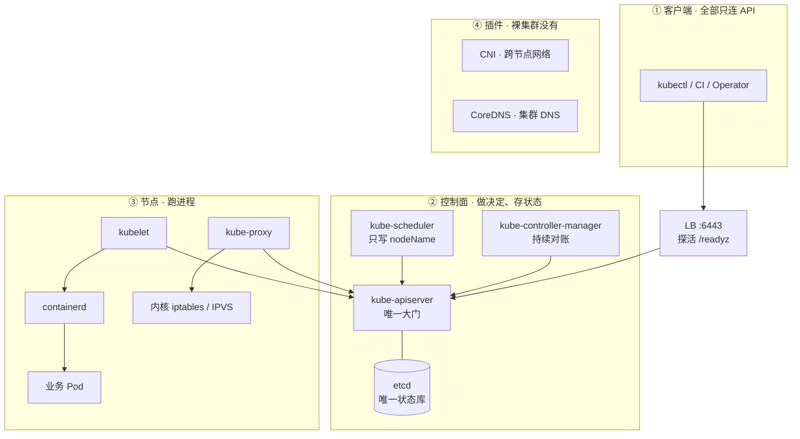
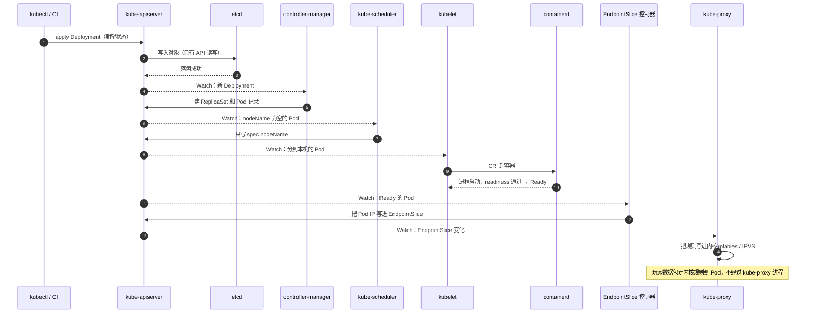
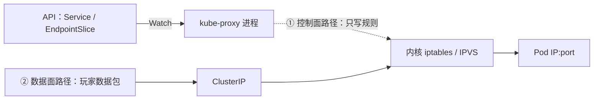
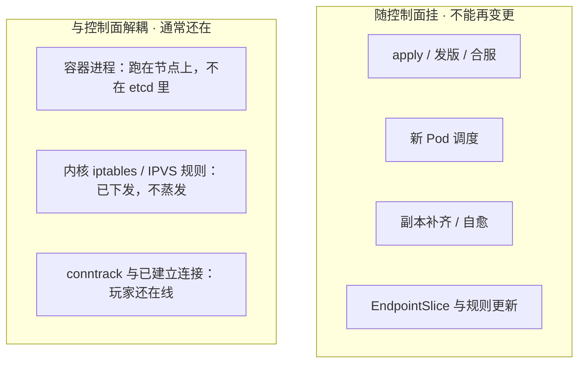
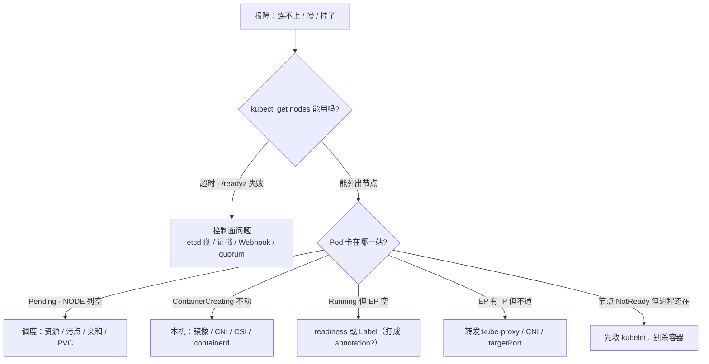

# 集群架构

> 活动高峰 `kubectl` 全面超时，监控大屏红了一片「集群异常」——可玩家还在打本。群里已经有人在数「1、2、3 重启全部逻辑服」，手就放在批量执行键上。
> **本章回答**：一次 `kubectl apply` 从敲下到玩家流量进新 Pod 走过哪几站，每一站谁在干活；任何一格挂掉时，什么还在、什么停了。
> **不讲**：etcd 的 Raft、quorum 与备份恢复 → [02](../02-etcd/)；认证、鉴权、准入、Watch Cache、APF 的内部细节 → [03](../03-API-Server/)；三探针与优雅退出 → [04](../04-Pod生命周期/)；滚动更新与 PDB → [05](../05-工作负载控制器/)；Service 四种类型与转发细节 → [08](../08-Service与kube-proxy/)。

**标记**：🎯重点 · 🔥难点 · ⭐常考 · 🔧实操

---

## 一、一张图：一次发版的一生 ⭐

> 🎯 **一句话**：集群分三层——控制面做决定、节点跑进程、插件补网络与 DNS；一次发版要过八站。



**读图**：

- 全图只有一条双向线连着 etcd——**只有 kube-apiserver 读写 etcd**，scheduler、controller-manager、kubelet、kube-proxy、kubectl 一律只连 API。从「谁挂了」进图，先问这一句。
- 从 `kubectl` 超时进图：先看 LB 和 `/readyz`，etcd 盘慢、Webhook 超时常在这里露馅，不是 API CPU 不够。
- 从 Pod 卡住进图：NODE 列空 → scheduler；ContainerCreating → kubelet/CNI/CSI；Running 无流量 → readiness/Label（八节的决策树就是这张图的查坏版）。
- 监控照的也是这三层：etcd fsync、API 延迟是控制面；NotReady、Pod Ready 率是节点层；业务 5xx 未必是集群问题——按层定责，再叫人。

三层职责先钉死，后面每节都挂在这三层上：

- **控制面（control plane）**：把期望存住、推动现状追上去。它**不跑你的游戏进程**。
- **节点（node）**：kubelet + 容器运行时真正起容器；kube-proxy 改内核转发规则。
- **插件（addons）**：kubeadm 刚装完的集群是「裸」的，跨节点网络（CNI）和集群 DNS（CoreDNS）都要另装（六节）。

这次发版在时间上是这样走的——**先有全局，后面每节讲一站**：



**读图**：前六步全是「写记录」，从 kubelet 那一步起才真正「起进程」——所以**调度成功 ≠ 容器起来**。任何一步卡住都有对应的 `kubectl` 现象，八节的决策树就是按这张图的站位分诊的。

---

## 二、提交：声明式 API

> 🎯 **一句话**：你提交的是「要什么」，不是「怎么做」——控制器负责把现状追成期望。

**声明式（declarative）**：你只写 `spec` 里的期望状态（`replicas: 20`），系统自己对账补齐。**命令式（imperative）**：`kubectl run` / `scale` / `edit` 这种「直接下手做一步」。生产以声明式为主，不是因为命令式被禁，而是因为声明式留下的是**可以反复对账的期望**：

> 💡 **打个比方**：像点外卖——你写「两杯奶茶」，不用指挥骑手走哪条路、哪家店做；平台自己对账补齐。你催单的方式不是替骑手跑，而是把订单再确认一遍（再 `apply` 一次）。

- 失败了再 `apply` 一次就行（**幂等**）；
- Pod 没了会被补上（**自愈**，四节讲它凭什么）;
- Git 里那份 YAML 能成为唯一真相源（GitOps → [23](../23-GitOps-ArgoCD与Tekton/)）。

> 🔍 **现场**：活动要紧急把大厅从 8 扩到 20。

```bash
kubectl scale deploy hall --replicas=20 -n game
kubectl get deploy hall -n game -o jsonpath='{.spec.replicas}'
# 20   ← 改的是 etcd 里 Deployment 对象的 spec.replicas，期望已落盘
```

**但**：如果 Git 仓库里还是 `replicas: 8`，下一次 Argo CD 同步会拿仓库版本把你打回去。应急 `scale` 是止血，**当天必须把 `replicas: 20` 补回 Git**。另外 **HPA 和 YAML/CI 抢的是同一个 `spec.replicas` 字段**——HPA 管副本时，流水线不要再写死它，否则两边互相打架（弹性伸缩 → [07](../07-弹性伸缩/)）。

> ⚠️ **别混**：「scale 成功」≠「扩容完成」。scale 只改期望副本数，新 Pod 还要走调度、拉镜像、探针这一整条链（一节图）——扩完要看 `get po` 里是不是 20 个 Ready，不是看 scale 命令退没退出。

> 📝 **面试**：「生产为什么用声明式」答三点：幂等（失败重 apply）、自愈（控制器持续对账）、Git 可做唯一真相源；再补一句「应急 scale 可以，当天补回 Git，否则 GitOps 打回原值」。

工作负载选型一句带过（滚动细节在 [05](../05-工作负载控制器/)）：可互换的大厅 → Deployment；固定名字 / 独立盘 / 区服身份 → StatefulSet；每节点一份（日志采集、CNI）→ DaemonSet；合服备份这种一次性任务 → Job。**房间绑在内存里的战斗服不要当 Deployment 默认滚**——滚动等于杀对局。

---

## 三、落库：etcd 是唯一状态库 ⭐🔥

> 🎯 **一句话**：etcd 里存的是对象，不是进程和流量；且只有 kube-apiserver 能碰它。

**etcd** 是强一致的分布式 KV（key-value）存储，是整个控制面**唯一的状态库**。它里面有什么、没有什么，直接决定「控制面挂了游戏还在不在」（八节）：

- **在 etcd 里**：所有对象的 spec 和 status——Pod、Deployment、Service、Node、Secret、CR，外加 Event。
- **etcd 键路径**：前缀 `/registry/`，后面依次是资源类型、命名空间、对象名三段（详见 [02](../02-etcd/) 章）。
- **不在 etcd 里**：容器进程、容器可写层、节点上已下发的 iptables/IPVS 规则、已打上的玩家长连接、业务数据库、镜像、日志文件。

> 💡 **打个比方**：etcd 像连锁店的台账——记着「应有 20 家大厅门店」，但门店里营业的服务员（进程）、门口的客流（连接）都不在台账里。烧了台账，店还在营业；只是不能再开店、不能再改规划。

> ⚠️ **别混**：「对象写进去了」≠「容器起来了」。etcd 里多出一条 Pod 记录，只是账本多了一行；进程要等 kubelet 在节点上拉起（五节）。面试说「Pod 创建成功」时，先想清楚你说的是哪一层。

**为什么只有 kube-apiserver 读写 etcd？** scheduler、controller-manager、kubelet、kubectl、CI 全部只连 API，因为认证、鉴权、准入、审计这四道门都装在大门上。谁直连 etcd，谁就绕过全部四道门；而**写坏的对象会被控制器当成期望去执行**——比绕过权限更危险。值班动 `etcdctl` 只做 health / member / snapshot，**不要手改 `/registry`**（备份、恢复与 Raft → [02](../02-etcd/)）。

> 🔍 **现场**：`kubectl` 全超时，先问大门愿不愿接客。

```bash
kubectl get --raw /readyz?verbose
# 第一个不 ok 的检查项就是死因；etcd / poststarthook 最常见
```

生产里「控制面慢」，十次九次是 **etcd 磁盘**（fsync 延迟）或**准入 Webhook 超时**，不是 API CPU 不够——**不要上来给 API 加核**。LB 探活必须探 HTTPS `/readyz`，只探 TCP 6443 会把「进程在、etcd 不通」的实例留在池里，`kubectl` 全被送到坏实例上。

大门里面还有三块，本章只钉位置，细节在 [03](../03-API-Server/)：

- **认证 / 鉴权 / 准入**：写 etcd 之前的三道门，对应症状 401、403、apply 报 webhook timeout。
- **准入 Webhook**：先 Mutating 改、再 Validating 拒；Webhook 服务挂了且 failurePolicy 为 Fail 时，写路径会焊死。
- **Watch Cache**：API 用内存挡掉大部分 List/Watch/Get；写仍然过 etcd。
- **APF**：按 FlowSchema 分队列，队列满返回 429（细节 → [03](../03-API-Server/)）。

> 🔍 **现场**：控制器日志刷 429，先认是哪条队列满的。命令见 [03](../03-API-Server/) 章命令速查：`kubectl get flowschema`；`kubectl get --raw /metrics` 配合 `grep apiserver_flowcontrol_rejected_requests_total` 看哪条 FlowSchema 在拒。

---

## 四、对账：控制循环 🔥

> 🎯 **一句话**：每个控制器都在转同一圈——看现状、比期望、不一致就动手；这圈叫控制循环。

**控制循环（control loop）**：控制器（controller）持续 Watch 自己管的对象，发现现状和 `spec` 期望不一致，就采取行动把现状推回去。这一圈就是 **Observe → Diff → Act**，把现状对齐期望的这个动作，官方叫 **reconcile（调和）**。

> 💡 **打个比方**：像保安巡逻——看一眼（Observe）、拿在场人数和台账比（Diff）、少了补、多了清（Act），然后继续下一轮。它不是「跑一次的脚本」，而是一直转的圈。

一圈一圈转的控制器，每个只管一摊：

- **Deployment 控制器**：管 ReplicaSet 的新旧更替；
- **ReplicaSet 控制器**：副本少了就建、多了就删——你删它一个 Pod，几秒后长回来就是它干的；
- **Node 控制器**：心跳丢了标 NotReady，超时后打污点、安排驱逐；
- **EndpointSlice 控制器**：把命中 selector 且 Ready 的 Pod IP 写进 Service 后端名单（六节）。

🔥 **为什么事件丢了也能收敛：level-triggered**。这是「自愈」二字的真正底气：控制器是**状态触发（level-triggered）**的，不是**事件触发（edge-triggered）**的——它不依赖「收到那一条变更事件」，而是每次拿到**当前全量状态**重新对账。Watch 事件丢了几条、网络断了又连上、控制器重启了一遍，只要下一次 List 到手，照样收敛。所以 Informer 的实现是「先全量 List、再增量 Watch」，断线重连后重新 List 一遍就补齐了。**面试把「自愈」答成「它对事件反应很快」是答反了**——自愈靠的恰恰是不依赖单条事件。

> 🔍 **现场**：删一个 Pod，看控制器自己补。

```bash
kubectl delete po hall-abc123 -n game
kubectl get po -n game -l app=hall -w
# hall-abc123   1/1     Running   0       3d
# hall-xyz789   0/1     Pending   0       2s     ← 几秒后新 Pod 出现：ReplicaSet 控制器在对账
# hall-xyz789   1/1     Running   0       18s    ← 新副本 Ready，副本数重新对齐
```

`kubectl describe deploy hall` 的 Events 里会看到 `Scaled up replica set ... to 3`——控制器在**持续 Watch + 对账**，不是一次性脚本。

kube-controller-manager 是几十个控制器打包成的**一个进程**；多副本部署时必须开 **leader 选举（leader election）**——静态 Pod 参数里的 `--leader-elect=true`，否则两个副本同时写、互相打架。kube-scheduler 的高可用同理。

> 🔍 **现场**：现在是谁在持 leader。

```bash
kubectl get lease -n kube-system kube-controller-manager -o yaml
# holderIdentity: m1_3f9c...     ← 当前持锁的副本；值班重启它之前，先看锁在谁手里
```

> ⚠️ **别混**：Running ≠ Ready。**Running** 只说明容器进程活着；**Ready** 是 readiness 探针通过、能接流量。滚动更新和 PDB 都按 Ready 计数：没有 readiness 探针时，Deployment 以为新 Pod 已服役、PDB 也按 Running 放行——账面满足、流量已 502（探针 → [04](../04-Pod生命周期/)）。

> 📝 **面试**：「K8s 怎么实现自愈」——控制循环：控制器各自 Observe → Diff → Act 持续 reconcile；机制是 level-triggered，事件丢失不影响收敛；多副本控制器必须 leader 选举；最后补一句边界：**自愈的前提是控制面活着**，控制面挂了自愈跟着停（八节）。

---

## 五、派工：所有人都只跟 API 说话 ⭐

> 🎯 **一句话**：组件之间没有直连电话——scheduler 只写一个字段，kubelet 是唯一起容器的人。

所有组件都是 kube-apiserver 的客户端，互相之间**没有直连 RPC**：scheduler 不打电话通知 kubelet，而是在对象上写一行「派你去 worker-2」；kubelet 自己 Watch 领走分给自己的活。好处不是省电话费：**认证、鉴权、准入、审计统一走大门**；每个组件可以独立升级、独立重启；挂一个不会拉着别人一起死。

**kube-scheduler 干什么**：Watch `nodeName` 为空的 Pod，过滤（资源够不够、污点、亲和性）再打分（细节 → [06](../06-调度机制/)），最后**只写一个字段 `spec.nodeName`**。它不起容器、不通知 kubelet、不碰节点。

> 🔍 **现场**：看一个 Pod 从 Pending 到 Running，NODE 列怎么变。

```bash
kubectl get po test -n default -w
# NAME   READY   STATUS              NODE
# test   0/1     Pending                       ← NODE 空：还没写 nodeName，调度没完成
# test   0/1     Pending             worker-2  ← nodeName 写上了：调度完成，容器还没起
# test   0/1     ContainerCreating   worker-2  ← worker-2 上的 kubelet 在拉镜像 / 配 CNI / 挂卷
# test   1/1     Running             worker-2  ← containerd 把进程拉起来了
```

> ⚠️ **别混**：Pending vs ContainerCreating。**Pending 且 NODE 空 = 还没调度**，查资源 / 污点 / 亲和 / PVC，是 scheduler 这一段的事；**ContainerCreating = 调度已完成、本机没起成功**，查镜像、CNI、CSI、containerd——别把锅甩给 scheduler。「调度成功」和「容器起来」之间隔着整条 kubelet 链路。

> 🔍 **现场**：调度结果到底落在哪个字段。

```bash
kubectl get po test -n default -o jsonpath='{.spec.nodeName}'
# worker-2     ← scheduler 的全部成果就这一个字段；为空 = 还没调度，查它，不查镜像
```

**kubelet 干什么**：每台节点的「店长」。Watch API 拿到分到本机的 Pod spec，通过 **CRI（Container Runtime Interface，容器运行时接口）** 调 **containerd** 真正起容器，挂卷、执行三种探针、上报 Node 和 Pod 状态。探针（startup / liveness / readiness）和生命周期钩子都是 kubelet **在本机执行**的，不是哪个控制器远程杀进程（[04](../04-Pod生命周期/)）。

> 📝 **面试**：「Scheduler 和 kubelet 谁负责容器跑起来」——scheduler 只写 `spec.nodeName`，kubelet Watch 到本机 Pod 后经 CRI 调 containerd 起进程；追问「调度成功容器就起来了吗」，答「没有，中间还有拉镜像、CNI、挂卷、探针，任何一步卡住就是 ContainerCreating」。

控制面还有一个和云绑定的成员：**cloud-controller-manager（CCM）**——对接云厂商 API 的那部分：节点生命周期同步、LoadBalancer 类型 Service 对应的云上负载均衡、云路由。托管集群里厂商替你跑，你看不见；**自建 IDC 通常不装它**，LoadBalancer 类型也就不会自动创出云 LB，入口得自己接外部负载均衡。

---

## 六、通流：玩家的包怎么进 Pod ⭐🔥

> 🎯 **一句话**：玩家的包走内核规则，不经过 kube-proxy 进程；没有插件，集群是裸的。

新 Pod Ready 之后的接力：

1. **EndpointSlice 控制器**按 Service 的 `selector` + Pod 的 Ready，把 Pod IP 写进后端名单；
2. 每个节点的 **kube-proxy** Watch 到 EndpointSlice 变化，把 ClusterIP 翻译成本机内核规则；
3. 玩家包打到任意节点的 ClusterIP，**内核 iptables / IPVS** 直接转发到 Pod IP。

> ⚠️ **别混**：EndpointSlice 不是 Deployment 控制器写的。是 **EndpointSlice 控制器**按 `selector` + **Ready** 填名单——所以 selector 匹配不到、或 Pod 没 Ready，名单就是空的，Service 有 VIP 也没有后端。

> 🔍 **现场**：Service 后面到底挂没挂人。

```bash
kubectl get endpointslice -n game -l kubernetes.io/service-name=hall-svc -o yaml
# - addresses:
#   - 10.244.3.17        ← 有 Ready Pod 的 IP 才算有后端
#   conditions:
#     ready: true        ← 空列表先查 readiness 和 selector，别先动网络
```

kube-proxy 的两条路径是**全章最容易被问倒**的地方：



**读图**：kube-proxy 只出现在路径①——它 Watch、翻译、写规则，然后就让位了；路径②上全是内核，**一个字节都不经过 kube-proxy 用户态**。所以「玩家的包经过 kube-proxy 吗」的答案永远是**不经过**。

> 🔍 **现场**：规则在内核里长这样——在节点上，不在任何进程里。

```bash
iptables-save | grep hall-svc
# -A KUBE-SERVICES -d 10.96.88.10/32 -j KUBE-SVC-HALL    ← ClusterIP 的翻译规则，kube-proxy 写的就是它
```

由此推出 kube-proxy 挂掉的影响面：规则停更，但**已下发的规则还在内核里**——已建立的长连接（连同 conntrack 表项）往往继续通；**新连接**和滚动后的新后端没人更新规则，会打空或打到已死的 Pod。部分 CNI（如 Cilium 的 kube-proxy-replacement 模式）可以不跑 kube-proxy，但必须有等价的规则实现（[25](../25-eBPF与Cilium/)）。iptables 与 IPVS 的差异、四种 Service → [08](../08-Service与kube-proxy/)。

**插件：裸集群缺什么。** kubeadm 装完，控制面和本机容器有了，但**跨节点不通、没有集群 DNS**——必须另装 **CNI**（Calico / Flannel / Cilium，Pod IP 从哪来 → [10](../10-CNI与网络策略/)）和 **CoreDNS**（`svc.cluster.local` 解析 → [09](../09-CoreDNS/)）。它们自己就以 Pod 形式跑在 `kube-system` 里：

> 🔍 **现场**：新集群 Pod 之间 ping 不通，先查插件装没装。

```bash
kubectl get po -n kube-system
# calico-node-x7k2p   1/1   Running   ...   ← CNI 一般是 DaemonSet，每节点一个
# coredns-7d8f9b-k2x  1/1   Running   ...   ← 集群 DNS；这两类缺了就是裸集群
```

> ⚠️ **别混**：Namespace 不是墙。默认**跨 Namespace 网络是通的**——它只是逻辑分组，是 RBAC、ResourceQuota 的作用域（[13](../13-RBAC与安全/)）。要网络隔离必须自己叠 **NetworkPolicy**（默认拒绝起步）；合规硬墙直接拆集群或独立节点池。

选择器只认 **Label**，**Annotation** 是给人和工具看的元数据备注、不参与选择。`app=hall` 打进了 annotations，Service 的 selector 就选不到它——EndpointSlice 为空，进程明明 Running，流量就是不来。先改 Label，不要先怀疑 kube-proxy。

> 🔍 **现场**：对象一直 Terminating。

```bash
kubectl get ns battle -o yaml | grep -A3 finalizers
# finalizers:
# - kubernetes       ← delete 只是先打 deletionTimestamp，要等 finalizer 一个个被摘掉才真删
```

`kubectl delete` 不会立刻从 etcd 抹掉对象：先打 **deletionTimestamp**，等 **finalizer** 清单里每一项的负责控制器清理完外部资源、摘掉自己那一项，对象才真正消失。卡 Terminating 就去查对应控制器（常是 CSI / Operator 还没清完云盘、LB），**不要第一时间手抠 finalizer**；抠掉是快了，外部资源可能从此成了无主孤儿（存储 → [11](../11-存储/)）。

> 📝 **面试**：「Service 后面没有后端，怎么查」——三步：先 `get endpointslice` 看名单空不空；空 → 查 Pod Ready 没有（探针）、`selector` 对没对上 Label（别打进 annotation）；名单有但不通 → 才轮到 kube-proxy / CNI / targetPort。

---

## 七、形态：Stacked、External 与托管 ⭐

> 🎯 **一句话**：生产最小 HA = 3 台 Stacked + LB 探 /readyz；Stacked 和 External 差在故障域，不差在「谁才算 HA」。

四种形态，先认全：

- **单控制面**：只给开发机。一台挂 = 不能变更，且状态全丢。
- **Stacked HA**：kubeadm 默认——每台控制面机器同时跑 kube-apiserver + 一个 etcd 成员。3 台 + LB 就是生产最小高可用。一台挂 = **一个 API 和一个 etcd 成员一起掉**，剩下两台仍够 quorum。
- **External etcd**：API 一组、etcd 一组（3 或 5 台）。故障域干净：API 挂不牵动 etcd 多数派；代价是多一套机器、盘、证书要人盯，2379 只对 API 放行。
- **托管（ACK / EKS / GKE）**：你 ssh 不进控制面，厂商修二进制、管升级；但**影响面、你装的 Webhook、节点、CNI、备份 RPO 仍然是你的**——「托管了就不用懂控制面」是错的。

> ⚠️ **别混**：Stacked ≠ 没做高可用。3 台 Stacked + LB 探 `/readyz`，就是 kubeadm 的生产最小 HA；说「我们准备上 External，现在还没做高可用」是把两件事混了——**它们差的只是故障域**。

| 对比 | Stacked（kubeadm 默认） | External etcd |
|------|------------------------|---------------|
| 故障域 | API 与 etcd 同生共死 | 分开，互不牵连 |
| 挂一台 | 一个 API + 一个 etcd 成员 | API 挂不丢 etcd 多数派 |
| 额外运维 | 无 | 多一套盘 / 证书 / 2379 放行要盯 |
| 适用 | 默认选择 | etcd 要单独调优或有隔离要求 |

**生产底线**（数字都在九节数字墙）：控制面 ≥3 台跨 AZ；etcd **3 或 5**，不要偶数——4 台的容错仍是 1（quorum → [02](../02-etcd/)）；etcd 独立 SSD，不和游戏日志混盘；API 入口走 VIP/LB，探活 `/readyz`；kube-apiserver `--anonymous-auth=false`，不许匿名请求摸到大门。`--control-plane-endpoint` 必须写 VIP 或 LB 地址，写死单机 IP，那台一挂 `kubectl` 全死。Stacked 改 External 是个项目（加机器、换证书、迁数据），**不要在活动期间做**。Stacked 里 API 连本机 `127.0.0.1:2379` 是**同命运设计**，不是配错；External 才把 3 个 etcd 地址写满，漏一个就是单点。

**静态 Pod（static Pod）**：kubeadm 把控制面组件跑成静态 Pod——kubelet 盯着 `/etc/kubernetes/manifests/` 目录，里面有 YAML 就保证对应进程在：

```bash
ls /etc/kubernetes/manifests/
# etcd.yaml  kube-apiserver.yaml  kube-controller-manager.yaml  kube-scheduler.yaml
#   ↑ 改这个目录里的 YAML = 改控制面，kubelet 会自动按新配置重建对应静态 Pod
```

> 🔍 **现场**：确认静态 Pod 确实是本机 kubelet 拉起来的。

```bash
crictl ps --name kube-apiserver
# CONTAINER        IMAGE        ...   POD
# kube-apiserver   registry...  ...   kube-apiserver-m1    ← 没有 Deployment 管它：本机 kubelet 盯目录保活
```

证书在 `/etc/kubernetes/pki/`，**续完证书必须重启对应静态 Pod 才生效**——证书过期当天是控制面 P0，告警思路对齐 [02](../02-etcd/) 的 14 天（证书体系 → [14](../14-证书与kubeconfig/)）。`/etc/kubernetes/admin.conf` 是本机 kubectl 凭证，不要拿它当全集群共享的管理员 kubeconfig。Worker 机器上：systemd 拉起 kubelet，kube-proxy 通常是 DaemonSet，CNI、CoreDNS 另装。

**升级的顺序**：先 etcd 快照（[02](../02-etcd/)）→ 滚动升控制面，一次一台，LB 里始终留健康实例 → 再滚 kubelet。**kubelet 最多比 kube-apiserver 低一个次版本**；不要控制面刚升完，同一秒全员重启 kubelet——那等于把节点层也一起打穿（节点操作与运行时 → [17](../17-节点运行时与升级/)）。

---

## 八、挂了：定责 ⭐🔥

> 🎯 **一句话**：别回答「集群挂了」——拆成三问：进程还在吗？还能变更吗？流量还通吗？

值班听到「集群挂了」，先把它拆成三问，三问的答案可以完全不同：

1. **已经在跑的游戏进程还在不在？**
2. **还能不能变更**——发版 / 扩容 / 自愈？
3. **已有流量还通不通？**

> 💡 **打个比方**：控制面像连锁总部的订货调度系统——系统宕机，各门店照常开门营业（进程在、存量流量通），只是接不了新指令、开不了新店、卖完的货补不上（变更与自愈全停）。**总部系统宕机时把还在营业的门店烧了**，就是本章最贵的误操作：重启还活着的逻辑服。

各组件挂掉的影响面，一格一格对：

| 挂谁 | 已运行 Pod 与已有流量 | 变更与自愈 |
|------|----------------------|-----------|
| etcd / kube-apiserver | 在；已有流量一般还通（规则在内核） | **全停**：apply、调度、对账、EP 更新 |
| kube-scheduler | 在 | 新 Pod 永远 Pending；已有的不受影响 |
| kube-controller-manager | 在 | 掉了不补、滚动停、节点驱逐没人决策 |
| kubelet（单机） | **进程往往还在** | 本机不探针、不上报；节点 NotReady，先别杀容器 |
| kube-proxy（单机） | 存量长连接往往还在 | 规则停更；新连接、新后端会打空 |
| cloud-controller-manager（云） | 在 | LoadBalancer / 云路由的变更停；已有入口通常不受影响 |

### 收束：控制面挂了，凭什么游戏服还在

把上表的机制收成三句话——**三个分离**，面试按这个骨架展开：



**读图**：左边是「未来时」——所有还没发生的决策都要过控制面，所以全停；右边是「现在完成时」——进程、规则、连接都已经落在节点和内核里，控制面碰不到它们，所以还在。

1. **状态与进程分离**：etcd 存的是对象，不是进程——API 挂了，战斗服进程一根毫毛不动。
2. **规则与进程分离**：转发规则写在内核，kube-proxy 挂了，旧连接照样按旧规则走。
3. **决策与流量分离**：调度和对账管的是「将来的事」，已有流量从头到尾不经过控制面。

> ⚠️ **别混**：「通常还在」≠「没影响」。不能发版、不能扩容、不能自愈，意味着这段时间里**再挂一个节点就没人补位**——控制面挂得越久，集群越脆。「游戏还在线」不是压着控制面告警不处理的理由。

> 📝 **面试**：「API 挂了，玩家还在吗」按三问回答：进程在、变更停、存量流量通常在；再按组件点名（调度挂 → 新 Pod Pending；controller-manager 挂 → 掉了不补；kubelet 挂 → 本机进程往往还在）。最后一句收住：**所以不要重启逻辑服**。

### 决策树：现象直接对到人 🔧



**读图**：第一刀切「`kubectl` 还能不能列出节点」——不能，走左边查控制面（三节那套 `/readyz`）；能，就按一节发版链的站位看卡在哪一站，站名即责任方。**不要每个分支都重启节点**。分支里每一类的完整剧本（CrashLoop / OOMKilled / Evicted）在 [18](../18-典型故障剧本/)，本章只钉到「是谁的责任」。

| 现象 | 先做 | 别做 |
|------|------|------|
| kubectl 超时、/readyz 失败 | etcd 盘、证书、Webhook、quorum | 重启全部游戏服 |
| 控制面慢，CPU 不忙 | etcd fsync / Webhook 超时，再看 APF 429 | 先给 API 加核 |
| Pending，NODE 空 | 资源、污点、亲和、PVC | 查镜像、重启业务 |
| ContainerCreating 不动 | CNI / CSI / 镜像 / containerd | 当 scheduler 坏了 |
| Running 但 Service 没 EP | readiness 探针、Label（查 annotation） | 重装 kube-proxy |
| EP 有 IP，ClusterIP 不通 | kube-proxy、CNI、targetPort | 重启逻辑服 |
| 节点 NotReady，业务进程还在 | 救 kubelet | 立刻杀容器「重建试试」 |
| drain 卡住 | 查 PDB（[05](../05-工作负载控制器/)） | 上来删 PDB 赶战斗服 |

> 🔍 **现场**：节点 NotReady 的正确打开方式。

```bash
kubectl describe node worker-3 | grep -A2 'Ready'
# Ready   False   KubeletNotReady     ← 节点失联先想到这台上的 kubelet，不是先想业务
ssh worker-3 'crictl ps | grep logic'
# logic-0  Up  3d  ...                ← 进程往往还在：救 kubelet，驱逐是分钟级之后的事（→17）
```

节点心跳超时后，Node 控制器才会标 NotReady、打污点、最终驱逐重建——那是**分钟级流程**，在那之前进程通常还活着。所以顺序是：先救 kubelet，驱逐交给控制器按流程走，**不要人工抢跑去杀容器**（驱逐与节点操作 → [17](../17-节点运行时与升级/)）。

**60 秒剧本** 🔧：接到「集群异常」，按这个顺序敲完再下结论：

```text
① 0–10s   集群大门通不通   kubectl get --raw /readyz?verbose   ← 不通：控制面问题，走决策树左边
② 10–25s  节点都好吗       kubectl get nodes -o wide           ← 数 NotReady / SchedulingDisabled
③ 25–40s  插件都好吗       kubectl get po -n kube-system       ← apiserver / etcd CrashLoop? CNI / CoreDNS?
④ 40–60s  对象卡在哪       kubectl describe po + get events    ← 按 Pending / ContainerCreating / 无 EP 分层，定型再动手
```

**活动高峰的典型剧本**：etcd 和游戏日志同盘，高峰写入把 fsync 打到几百毫秒 → `kubectl` 全卡、`/readyz` 超时。正确处理：先确认节点上进程还在 → 冻结一切发版和重启 → 救盘 / 救 quorum / 摘掉超时 Webhook → 恢复后先 `get nodes` 确认，再让控制器自己把账对齐。

---

## 九、收口

### 命令速查 🔧

```bash
# 控制面愿不愿接客
kubectl get --raw /readyz?verbose       # 第一个不 ok 的项是死因；etcd / webhook 最常见
kubectl cluster-info                    # 连的是哪个 API 地址（写死单机 IP 的坑在这现形）
# 节点与控制面 Pod
kubectl get nodes -o wide               # NotReady / SchedulingDisabled
kubectl get po -n kube-system           # apiserver / etcd / scheduler / CNI / CoreDNS 都在这
# 对象卡在哪一站
kubectl describe po POD_NAME -n NS       # Events：FailedScheduling / 拉镜像失败 / CNI 报错
kubectl get events -n NS --sort-by='.lastTimestamp'
# 流量名单
kubectl get endpointslice -n NS       # 空 = readiness 或 selector / Label 问题
# 权限 403 时
kubectl auth can-i delete pods --as=system:serviceaccount:game:deployer
# 节点本机
crictl ps                               # 业务进程到底还在不在
systemctl status kubelet                # NotReady 第一嫌疑人
```

### 面试锚点

| 问 | 30 秒答 |
|----|---------|
| 画一下集群架构 | 三层：控制面决策、节点跑进程、插件补网络 DNS；只有 kube-apiserver 读写 etcd，其他组件全只连 API。 |
| apply 之后发生了什么 | API 写 etcd → 控制器建 RS 和 Pod 记录 → scheduler 写 nodeName → kubelet 经 CRI 起容器 → Ready 进 EndpointSlice → kube-proxy 更新内核规则 → ClusterIP 通。 |
| 什么是声明式 | 只写 spec 期望，控制器持续对账把现状追上去；幂等、可自愈、Git 当真相源。应急 scale 当天补回 Git。 |
| 控制循环 / 自愈是什么 | 控制器 Observe → Diff → Act 持续 reconcile；level-triggered，事件丢了下次 List 照样收敛；多副本要 leader 选举。 |
| API/etcd 挂了游戏服会挂吗 | 三问：进程在、变更停、存量流量通常在——所以不重启逻辑服，去救盘 / 证书 / Webhook。 |
| scheduler 干什么 | 过滤打分后只写 `spec.nodeName`；不起容器、不通知 kubelet。 |
| 谁把容器跑起来 | kubelet Watch 到本机 Pod，经 CRI 调 containerd；调度成功 ≠ 容器起来。 |
| 玩家的包过 kube-proxy 吗 | 不。它只 Watch EndpointSlice 写内核规则；数据面走 iptables/IPVS。 |
| kube-proxy 挂了流量呢 | 存量连接和旧规则往往还在；新连接、新后端规则不更新会打空。 |
| EndpointSlice 谁写的 | EndpointSlice 控制器按 selector + Ready；不是 Deployment 控制器。 |
| Running 和 Ready | Running 是进程在；Ready 是探针过、才进 EndpointSlice 接流量。 |
| Stacked 算 HA 吗 | 算。3 台 + LB 探 /readyz 是生产最小 HA；和 External 差在故障域。 |
| etcd 几台 | 3 或 5 不要偶数——4 台容错仍是 1。 |
| 托管了还要懂控制面吗 | 要。影响面、你装的 Webhook、节点、CNI、备份仍是你的责任。 |
| Namespace 隔离吗 | 默认网络互通；它是分组 + RBAC/Quota 作用域，隔离要叠 NetworkPolicy。 |
| Service 没后端查什么 | selector 对没对上 Label（别打进 annotation）、Pod Ready 没有。 |
| Terminating 卡住 | deletionTimestamp 等 finalizer 摘完；先查 CSI / Operator，别先手抠。 |
| 控制面慢先查什么 | etcd 盘 fsync、Webhook 超时，再看 APF 429；不要先给 API 加核。 |
| LB 探什么 | HTTPS /readyz；只探 TCP 6443 会把坏实例留在池里。 |
| kubelet 和 API 版本差 | kubelet 最多低一个次版本；升级先控制面后节点，别同一秒全重启。 |
| 静态 Pod 是什么 | /etc/kubernetes/manifests 里的 YAML 由本机 kubelet 保证运行；改它 = 改控制面。 |
| cloud-controller-manager 挂了呢 | 已有云 LB 照常转发；停的是云资源变更：节点同步、LoadBalancer、云路由。自建往往没装它。 |

### 易错一句话对照

- API 挂了，游戏服进程立刻没了 → 进程还在，只是不能再变更
- 调度成功 = 容器起来了 → scheduler 只写 `nodeName`，kubelet + CRI 才起进程
- 玩家的包经过 kube-proxy 进程 → 走内核 iptables/IPVS，kube-proxy 只写规则
- Stacked 不是高可用 → 3 台 + LB 探 /readyz 就是生产最小 HA
- 4 台 etcd 比 3 台更抗挂 → 4 台容错仍是 1
- kubelet 直连 etcd 拉 spec → 只连 API；直连绕过认证、鉴权、准入、审计
- EndpointSlice 是 Deployment 控制器写的 → EndpointSlice 控制器按 selector + Ready
- Namespace 默认隔离子网 → 逻辑分组；隔离自己叠 NetworkPolicy
- Label 和 Annotation 都能被选择器选中 → 选择器只认 Label
- Terminating 立刻手抠 finalizer → 先查 CSI / Operator，抠了外部资源成孤儿
- LB 探 TCP 6443 就够了 → 必须探 /readyz
- 托管了就不用懂控制面 → 影响面、Webhook、节点仍是你的
- 有状态战斗服可以当 Deployment 默认滚 → 滚动等于杀对局；STS 也不解决内存状态
- controller-manager 多副本可以不开 leader 选举 → 不开会双写打架
- Pod Running 就能接流量 → Ready 才进 EndpointSlice
- 控制面慢先给 API 加核 → 先查 etcd 盘和 Webhook
- 自愈靠「对事件反应快」 → 靠 level-triggered 持续对账，事件丢了也收敛
- 自建集群 LoadBalancer 类型自动有云 LB → 自建通常没有 CCM，入口自己接外部负载均衡
- 图省事把 --anonymous-auth 开着 → 必须 false，匿名请求不该摸到大门

### 数字墙

> 控制面 **≥3 台**、跨 AZ · etcd **3 或 5** 台（偶数不行，4 台容错仍是 1）· kubelet 最多比 kube-apiserver 低 **1 个次版本** · 准入 Webhook 超时 **小于 3s** · API 入口 **:6443** · etcd 客户端 **:2379** / Raft **:2380** · 静态 Pod 目录 `/etc/kubernetes/manifests/` · 证书到期告警对齐 [02](../02-etcd/) 的 **14 天**

---

## 合上书

- [ ] **默画一节的主图**：三层 + 客户端 / LB / 插件，指出谁唯一读写 etcd；再按时间顺序口述 apply → 玩家流量进 Pod 的八站。
- [ ] **口述提交**：声明式和命令式差在哪、应急 `scale` 之后要补什么、HPA 和 YAML 抢的是哪个字段。
- [ ] **口述落库**：etcd 里有什么、没什么；为什么谁都不能直连 etcd；LB 为什么必须探 `/readyz`。
- [ ] **口述对账**：Observe → Diff → Act 三步；为什么事件丢了也会收敛（level-triggered）；多副本为什么要 leader 选举；Running 和 Ready 差在哪、谁写 EndpointSlice。
- [ ] **口述派工**：scheduler 到底写了什么；谁把容器跑起来；Pending 和 ContainerCreating 各查什么。
- [ ] **口述通流**：玩家的包过不过 kube-proxy；kube-proxy 挂了存量和新连接各怎样；裸集群缺什么；Namespace 是不是墙、选择器认谁。
- [ ] **口述形态**：Stacked / External / 托管差在哪；静态 Pod 是什么；生产底线数字。
- [ ] **默画八节的决策树**：`kubectl` 超时 / Pending / ContainerCreating / Running 无 EP / EP 有但不通 / NotReady 各走哪条；三问是什么、为什么不能重启逻辑服。
- [ ] **口述数字**：控制面台数、etcd 台数、版本 skew、Webhook 超时。

下一章把 etcd 剖开：盘一慢，为什么整张图的 `kubectl` 一起卡死 → [02](../02-etcd/)。
