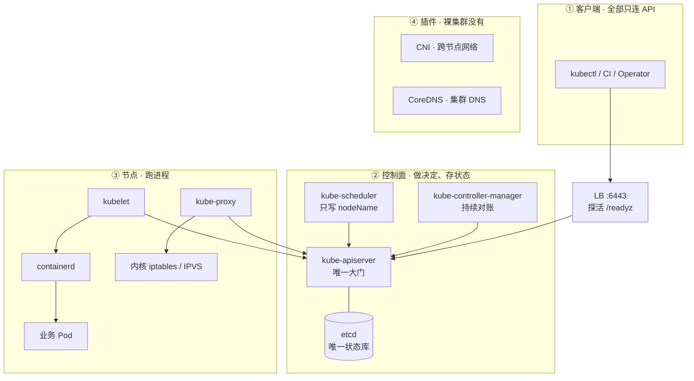
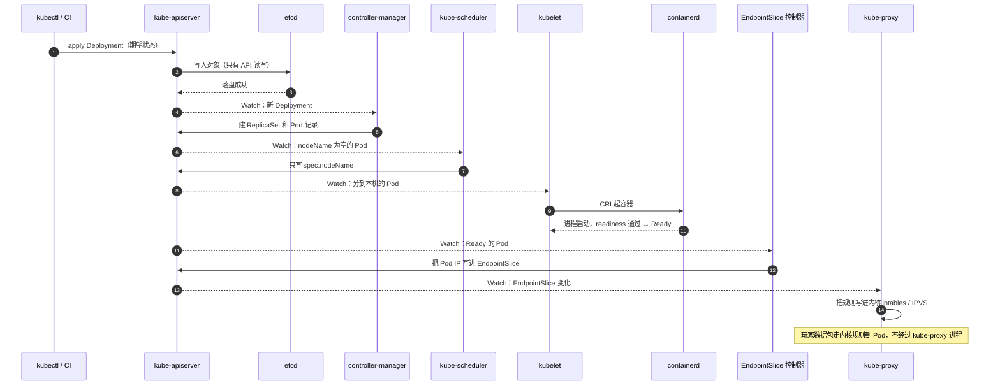
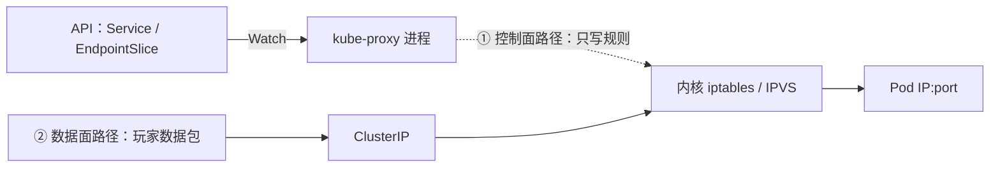
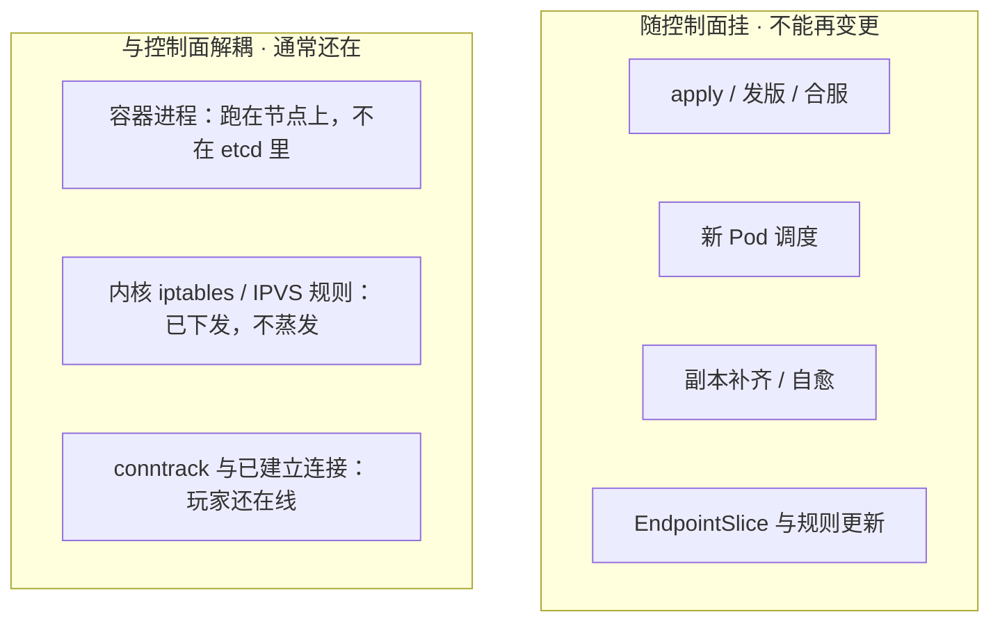
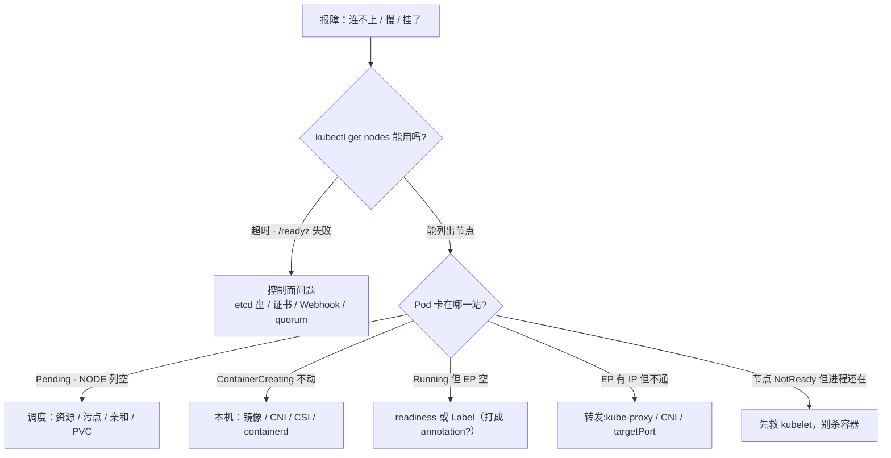

# 集群架构

> 大家好，欢迎来到这次分享。开讲之前，先带大家回到一个很多值班同学都经历过的现场：
> 活动高峰，`kubectl` 全面超时，监控大屏红了一片「集群异常」——可玩家还在打本，一个都没掉。群里已经有人在数「1、2、3 重启全部逻辑服」，手就放在批量执行键上。
> 这一章讲完，你会知道当时群里那个人错在哪，以及正确的做法是什么。
> **本章回答的问题**：一次 `kubectl apply`，从你敲下回车到玩家流量进新 Pod，中间一共走过哪几站、每一站谁在干活；以及任何一格挂掉时，什么还在、什么停了。
> **本章不讲**：etcd 的 Raft、quorum 与备份恢复 → [02](../02-etcd/)；认证、鉴权、准入、Watch Cache、APF 的内部细节 → [03](../03-API-Server/)；三探针与优雅退出 → [04](../04-Pod生命周期/)；滚动更新与 PDB → [05](../05-工作负载控制器/)；Service 四种类型与转发细节 → [08](../08-Service与kube-proxy/)。这些都有专门的章节，本章只在用到时点到为止——碰到了别慌，知道「这事有地方讲」就够了。

**标记**：🎯重点 · 🔥难点 · ⭐常考 · 🔧实操

**怎么听这场分享**：咱们先看两张图（第一节的三层图 + 八站时间线），把它们看熟，后面的内容全是这两张图的展开；第二到第六节，顺着一次发版的链路一站一站往下走，一站一节；第七节换个视角，看这些组件物理上怎么摆；第八节专门讲挂了怎么定责——也就是开头那个现场的正确解法。每一节讲完，都会提示你「这节对应练习题的哪几道题」，学完就去练，趁热打铁。

---

## 一、一张图：一次发版的一生 ⭐

> 🎯 **一句话**：集群分三层——控制面做决定、节点跑进程、插件补网络与 DNS；一次发版要过八站。

咱们先不急着背组件名。学架构最怕的就是上来背名词，背完还是不会用。先看图，把「谁在哪、谁跟谁说话」装进脑子里：



图看完了，咱们一起对着它问自己几个问题——带着问题看图，比背组件名有用得多：

- **先找 etcd 在哪儿**：你会发现全图只有一条双向线连着它——**只有 kube-apiserver 读写 etcd**，scheduler、controller-manager、kubelet、kube-proxy、kubectl，一律只连 API。这条线是全章最重要的一条线，也是 ⭐ 面试必考（练习题 Q1 就考它）。以后线上问「谁挂了」，你先要问的就是这一句。
- **`kubectl` 超时了往哪儿查**：沿客户端 → LB → API 这条线走。常见原因是 LB 没探 `/readyz`、etcd 盘慢、Webhook 超时——注意，很少是 API CPU 不够，别上来就想着加机器。
- **Pod 卡住了往哪儿查**：对照下面的时间线，看它卡在哪一站——NODE 列空 → 找 scheduler；ContainerCreating → 找 kubelet/CNI/CSI；Running 了却没流量 → 找 readiness 和 Label（第八节的决策树，就是这张图的「查坏版」）。
- **告警来了怎么分层**：etcd fsync、API 延迟，这是控制面的事；NotReady、Pod Ready 率，这是节点的事；业务 5xx 未必是集群的问题。先按层定责，再叫人——别一个告警拉起全组人。

这三层到底各管什么？后面每一节都会回到这三层，先有个印象：

- **控制面（control plane）**：负责把期望存住、推动现状追上去。记住一句——它**不跑你的游戏进程**。「控制面」这个词第一次出现时容易误解成「控制中心在遥控一切进程」，其实不是：它只管「做决定、记账」，干活的是节点。
- **节点（node）**：kubelet + 容器运行时在这里真正起容器；kube-proxy 在这里改内核转发规则。
- **插件（addons）**：这点很多新人会踩坑——kubeadm 刚装完的集群是「裸」的，跨节点网络（CNI）和集群 DNS（CoreDNS）都要另外装，否则 Pod 之间不通、域名也解析不了（第六节展开讲）。

刚才那张图是「空间图」，告诉你谁在哪。接下来咱们换一个维度——**时间**：一次发版从敲下命令到玩家连进来，先后发生了哪些事？



🔥 这张时序图是全章的「主干」，咱们放慢一点，顺着序号捋一遍。你会发现一个有意思的事：**1～6 步全在「写记录」**，直到 kubelet 那一步才真正「起进程」。换句话说，前六步无论你催多少遍，玩家机器上一个进程都不会多——它们只是在 etcd 这本账上不断添行。所以请记住两个「不等于」——**调度成功 ≠ 容器起来**，**Ready 了 ≠ 玩家已经能连进来**。这两句话是后面所有排障的地基，也是 ⭐ 面试里区分「背过」和「干过」的分水岭（练习题 Q2 专门考这条链）。

这张图上还反复出现一个词——**Watch**。先简单理解：组件不用一遍遍问 API「有没有新活儿」，而是像订阅公众号一样，有新消息 API 主动推给它。第四节讲控制循环时还会用到它。

后面几节和这条时间线的对应关系：**第二节**讲①②写期望 · **第三节**讲落库 · **第四节**讲③④对账 · **第五节**讲⑤⑥派工与起容器 · **第六节**讲⑦⑧通流。好，咱们正式出发。

---

## 二、提交：声明式 API

> 🎯 **一句话**：你提交的是「要什么」，不是「怎么做」——控制器负责把现状追成期望。

发版链的第①步：你把 YAML 或命令交给 API。这里咱们先建立一个最重要的认知：**你改的是集群里的期望状态，不是集群本身**。这句话有点抽象，咱们用一整节把它讲透。

在 K8s 里描述这份期望，你会经常听到两个词——别被术语吓到，它们的差别只在「你下指令的方式」：

- **声明式（declarative）**：你只在 `spec` 里写「要几个副本、要什么镜像」，不指挥「先建 Pod A 再建 Pod B」；
- **命令式（imperative）**：`kubectl run` / `scale` / `edit` 这种「直接下手做一步」的方式。

> 💡 **打个比方**：这就像点外卖——你下单写「两杯奶茶」，不需要指挥骑手走哪条路、去哪家店取；平台自己对账补齐。你「催单」的方式也不是替骑手跑，而是把订单再确认一遍（再 `apply` 一次）。

生产环境以声明式为主。注意，不是因为命令式被禁用了，而是因为声明式留下的是一份**可以反复对账的期望**——你写清楚「要 20 个」，后面第四节要讲的控制器就会盯着这份期望一直补，直到真的变成 20 个。

声明式在生产里到底好在哪？就两条，但条条值钱：

- 失败了再 `apply` 一次就行（**幂等**）。🔥「幂等」这个词第一次见可能有点懵，意思是：**同一个操作执行一次和执行十次，最终结果一样**。同一份 YAML 多 apply 几次，集群不会因此多出几倍的 Pod——这对「脚本重试」「流水线失败重跑」太重要了，你敢放心地重试。
- Pod 没了会被自动补上（**自愈**，第四节讲它凭什么）——期望还在，控制器会补。

> 🔍 **现场感受一下**：活动期间要紧急把大厅从 8 扩到 20。

```bash
kubectl scale deploy hall --replicas=20 -n game
kubectl get deploy hall -n game -o jsonpath='{.spec.replicas}'
# 20   ← 改的是 etcd 里 Deployment 对象的 spec.replicas，期望已落盘
```

敲完这条 `scale`，集群里发生了什么？咱们来拆一下：它**没有**替你起任何容器，只是把**期望副本数**从 8 改成 20 写了进去（第三节会讲它落在 etcd 哪儿）。还是用外卖的比方：相当于「订单改成 20 杯」——接下来 ReplicaSet 控制器会对账，慢慢把 Pod 补到 20 个（就是第一节图的步骤③④）。所以记住：**这一步只改期望，不改进程**。

应急 scale 之后，还有两个坑，都和「谁管副本数」有关。不懂 CI/CD 的同学也能听懂，记住一句话就行：**别让人和机器同时改同一份期望**。

**第一种情况：你们用 Git 管配置**。很多团队把 `hall` 的 YAML 放在仓库里，发版时由流水线或同步工具 `apply` 到集群——要求集群里的状态和 Git 里的保持一致，这套玩法叫 **GitOps**，常用工具是 Argo CD（专章 → [23](../23-GitOps-ArgoCD与Tekton/)）。

- 如果仓库里还是 `replicas: 8`，同步工具**下一次 apply** 会把集群改回 8——你刚 scale 的 20 会被「打回去」。
- 所以应急 `scale` 只能止血，**当天**记得把 Git 里的 `replicas: 20` 也改掉，否则半夜同步又缩回去了。

**第二种情况：大厅还开了 HPA**（按 CPU 等指标自动调副本，→ [07](../07-弹性伸缩/)）。HPA 会根据负载去写 `spec.replicas`；如果 CI 发版的 YAML 里又**写死**了副本数，两边就会轮流改同一个字段、互相覆盖。简单记：**谁管弹性，就别在 YAML 里写死 `replicas`**——HPA、Git 同步、人工 scale，三个同时抢同一个字段，必乱。

> ⚠️ **别混**：「scale 成功」≠「扩容完成」。scale 只改了期望副本数，新 Pod 还要走调度、拉镜像、探针这一整条链（第一节的图）——扩完容要看 `get po` 里是不是 20 个 Ready，而不是看 scale 命令退没退出。

> 📝 **面试怎么说**：⭐「生产为什么用声明式」是高频题，答三点——幂等（失败重 apply）、自愈（控制器持续对账）、期望可落在 Git 做版本管理；再补一句「应急 scale 可以，但如果用 Git 同步集群，要当天补回仓库，否则会被同步打回原值」。这句补出来，面试官就知道你实操过。练习题 Q4 有完整的场景演练。

最后顺带提一句 Workload 选型（和 scale 改的是同一份 `spec`，只是换了控制器来装期望）：大厅这种可互换副本用 Deployment；固定名字 / 独立盘 / 区服身份用 StatefulSet；每节点一份（日志采集、CNI）用 DaemonSet；合服备份这种一次性任务用 Job（滚动细节 → [05](../05-工作负载控制器/)）。特别提醒做游戏的同学：**房间绑在内存里的战斗服不要当 Deployment 默认滚**——滚动等于杀对局。

---

## 三、落库：etcd 是唯一状态库 ⭐🔥

> 🎯 **一句话**：etcd 里存的是对象，不是进程和流量；且只有 kube-apiserver 能碰它。

期望写进 API 之后，发版链来到第②步：对象落进 **etcd**。etcd 是什么？一个强一致的分布式 KV（key-value）存储。拆开解释：「KV 存储」就是它只存「键 → 值」对，像一本大字典；「强一致」先记住效果就行——你刚写进去的值，下一秒谁去读都是新值，不会出现「这台查到 20、那台查到 8」的分歧（背后靠什么实现 → [02](../02-etcd/)）。它是整个控制面**唯一的状态库**。

它里面有什么、没有什么，直接决定了第八节那个问题的答案——「控制面挂了，游戏还在不在」。咱们一条条看：

- **在 etcd 里**：所有对象的 spec 和 status——Pod、Deployment、Service、Node、Secret、CR，外加 Event。
- **etcd 键路径**：前缀 `/registry/`，后面依次是资源类型、命名空间、对象名三段（Raft、备份、换节点 → [02](../02-etcd/)）。
- **不在 etcd 里**（这半更要记住）：容器进程、容器可写层、节点上已下发的 iptables/IPVS 规则、已建立的玩家长连接、业务数据库、镜像、日志文件。

> 💡 **打个比方**：etcd 像连锁店的台账——台账上记着「应有 20 家大厅门店」，但门店里正在营业的服务员（进程）、门口的客流（连接），都不在台账里。所以就算台账烧了，店还在营业；只是不能再开新店、不能再改规划。这个比方请记住，第八节还会用到。

> ⚠️ **别混**：「对象写进去了」≠「容器起来了」。etcd 里多出一条 Pod 记录，只是账本多了一行；进程要等 kubelet 在节点上拉起（第五节）。面试说「Pod 创建成功」的时候，先想清楚你说的是哪一层。

接下来一个问题：为什么只有 kube-apiserver 能碰 etcd？第二节说过，kubectl、CI、scheduler、controller-manager、kubelet 都只连 API。大家想想，如果 etcd 对所有人开放会怎样？等于所有人都能绕过大门上的**认证、鉴权、准入、审计**；更糟的是，**写坏的对象会被控制器当成期望去执行**——这可比单纯绕过权限危险多了。所以值班时用 `etcdctl` 只做 health / member / snapshot 三件事，**绝不要手改 `/registry`**。

> 🔍 **现场感受一下**：`kubectl` 全超时了，第一步做什么？先问大门愿不愿接客。

```bash
kubectl get --raw /readyz?verbose
# 第一个不 ok 的检查项就是死因；etcd / poststarthook 最常见
```

`/readyz` 是 API 自带的一个「体检接口」：它内部列了几十项自检（etcd 通不通、启动钩子跑完没……），全部通过才返回 ok。它返回什么，就是在告诉你 API 愿不愿意接客——etcd 不通、启动钩子没跑完，API 会把自己标成 not ready，LB 就不该再把 `kubectl` 的请求转过来了。这个接口后面还会反复出现：LB 探活用它能把它，值班排障第一步也是它。

这里分享一个值班经验：控制面一慢，十次有九次是 **etcd 磁盘**（fsync 延迟）或者**准入 Webhook 超时**，而不是 API CPU 不够——**别上来就给 API 加核**。「fsync 延迟」是什么？etcd 每次写账都要等磁盘真正落盘（fsync）才算数，盘一慢，所有写请求排队，整张集群的 `kubectl` 就跟着一起卡——开头那个活动高峰现场，根因就是它。另外 LB 探活一定要探 HTTPS `/readyz`；只探 TCP 6443 的话，会把「进程在、但 etcd 不通」的实例留在池里，请求全被送到坏实例上。

🔥 下面这五道关是全章的概念密集区，咱们放慢。写请求进 etcd 之前，还要在大门里过几道关。实现细节在 [03](../03-API-Server/)，本章只要记住「每道关叫什么、坏了长什么样」。可以想象成访客进大楼：先到前台验身份，再查你有没有权限进这层，最后你填的登记表还要被审核一遍——任何一关不过，都到不了 etcd：

- **认证**：确认你是谁——失败返回 **401**（这时查证书、token、kubeconfig，而不是 RBAC）。
- **鉴权**：确认你能不能干这件事——失败返回 **403**（这时查 RoleBinding，而不是证书过期）。
- **准入**：改对象前再拦一道——Mutating 先改、Validating 再拒；Webhook 服务挂了且 failurePolicy 为 Fail 时，**所有 apply 都会超时或失败**。
- **Watch Cache**：大部分读（List/Watch/Get）走内存，减轻 etcd 压力；但**写仍然过 etcd**。
- **APF**：请求太多时按队列限流——队列满了返回 **429**。

⭐ 头两道关的错误码是面试常客，记一个口诀：**401 是「我不认识你」，403 是「我认识你，但你不能这么干」**。所以看到 401 先查凭证，看到 403 先查权限，方向不要反。

后三道关只记「坏了长什么样」：准入 Webhook 挂 → apply 全超时；Watch Cache 是省力的，不用你管；APF 满了 → 客户端收到 429。够了，细节去 [03](../03-API-Server/) 章再补。

> 🔍 **现场感受一下**：控制器日志在刷 429，先认是哪条队列满的。命令见 [03](../03-API-Server/) 章的命令速查：`kubectl get flowschema`；`kubectl get --raw /metrics` 配合 `grep apiserver_flowcontrol_rejected_requests_total` 看哪条 FlowSchema 在拒。

这一节对应练习题 Q3 和 Q9，学完可以直接去试试。

---

## 四、对账：控制循环 🔥

> 🎯 **一句话**：每个控制器都在转同一圈——看现状、比期望、不一致就动手；这圈叫控制循环。

好，到这儿咱们已经把期望写进 etcd 了。接下来自然会问一个问题：**谁盯着这份期望，看集群有没有跟上？** 总不能让运维同学 24 小时盯着吧。

发版链第③④步登场：kube-controller-manager。它里面打包了几十个**控制器（controller）**，每个只管一类对象，但它们干活的姿势一模一样，都在转同一圈——**控制循环（control loop）**：

1. **Observe（看）**：Watch 或 List 自己管的对象；
2. **Diff（比）**：现状和 `spec` 期望一致吗？
3. **Act（动）**：不一致就写回 API，把现状推回去。

官方把第 3 步叫 **reconcile（调和）**。举个具体的例子：Deployment 期望 20 个副本、现在只有 18 个怎么办？ReplicaSet 控制器会自己再建 2 个 Pod 记录——注意，不是人手动补的，是控制器看到差额自己补的。

> 💡 **打个比方**：控制循环像保安巡逻——看一眼（Observe）、拿在场人数和台账比一比（Diff）、少了补、多了清（Act），然后继续下一轮。关键要理解：它不是「跑一次的脚本」，而是一个一直在转的圈。

各控制器各管一摊，举几个后面会碰到的，大家先混个脸熟：

- **Deployment 控制器**：管 ReplicaSet 的新旧更替；
- **ReplicaSet 控制器**：副本少了就建、多了就删——你删它一个 Pod，几秒后长回来，就是它干的；
- **Node 控制器**：心跳丢了标 NotReady，超时后打污点、安排驱逐；
- **EndpointSlice 控制器**：把命中 selector 且 Ready 的 Pod IP 写进 Service 的后端名单（第六节）。

🔥 下面是本节最难、也最容易答反的点，咱们多花两分钟。第二节说「Pod 没了会被补上」——凭什么？很多人的第一反应是：「因为控制器收到了『Pod 被删』这条事件通知呗。」**错了。** 控制器不是「听到一声响才动一下」，而是**隔一阵就重新看一遍全场**，这个机制叫 **level-triggered（状态触发）**：

- **状态触发（level-triggered）**：盯住「现在应该是多少」，不关心「刚才有没有收到那条消息」；
- 对比 **事件触发（edge-triggered）**：缺一条通知就可能漏掉一次动作。

> 💡 **打个比方**：小区送水。事件触发像「打电话订水」——电话没打通，这桶水就永远不会来；状态触发像「送水工每小时巡一遍楼」——你电话打没打通无所谓，他巡到你家看到桶空了就会补。K8s 选的就是后者。

这么设计的好处是什么？Watch 事件丢几条、网络断过又连上、控制器重启过——都没关系，只要下一次 List 到手，照样收敛。Informer（组件订阅 API 用的客户端机制）的实现也因此是「先全量 List、再增量 Watch」，断线重连后重新 List 一遍就补齐了。⭐ **面试时把「自愈」答成「它对事件反应很快」，正好答反了**——自愈靠的恰恰是不依赖任何单条事件。这是练习题 Q5 的核心考点。

> 🔍 **现场感受一下**：删一个 Pod，亲眼看控制器自己补回来。

```bash
kubectl delete po hall-abc123 -n game
kubectl get po -n game -l app=hall -w
# hall-abc123   1/1     Running   0       3d
# hall-xyz789   0/1     Pending   0       2s     ← 几秒后新 Pod 出现：ReplicaSet 控制器在对账
# hall-xyz789   1/1     Running   0       18s    ← 新副本 Ready，副本数重新对齐
```

这时你再看 `kubectl describe deploy hall`，Events 里会有 `Scaled up replica set ... to 3`——这就是控制器在**持续 Watch + 对账**的证据，它不是一次性脚本。

生产环境里，controller-manager 常部署多个副本做高可用。但这里有个必须的配套：一定要开 **leader 选举（leader election）**——同一时刻只有一个副本持锁干活，参数是 `--leader-elect=true`。

🔥 为什么必须选主？大家顺着控制循环想一步就明白了：两个副本都在 Observe → Diff → Act，都看到「少 2 个 Pod」，都去补——结果建出 4 个；或者一个要删、一个要留，同一份对象被两套逻辑来回改。**多副本是为了「挂了有人接班」，不是为了「大家一起干」**。kube-scheduler 的高可用也是同样的道理。

> 🔍 **现场感受一下**：想知道现在是谁在持 leader？

```bash
kubectl get lease -n kube-system kube-controller-manager -o yaml
# holderIdentity: m1_3f9c...     ← 当前持锁的副本；值班重启它之前，先看锁在谁手里
```

> ⚠️ **别混**：Running ≠ Ready，这对概念后面会反复用到，⭐ 也是面试高频。**Running** 只说明容器进程活着；**Ready** 是 readiness 探针通过、能接流量了。打个比方：Running 是「店员到店了」，Ready 是「店员换好工服、可以接单了」。滚动更新和 PDB 都按 Ready 计数：没有 readiness 探针时，Deployment 以为新 Pod 已经服役、PDB 也按 Running 放行——账面满足、流量已 502（探针的细节 → [04](../04-Pod生命周期/)）。

> 📝 **面试怎么说**：「K8s 怎么实现自愈」——控制循环：控制器各自 Observe → Diff → Act 持续 reconcile；机制是 level-triggered，事件丢失不影响收敛；多副本要 leader 选举；最后补一句边界——**自愈的前提是控制面活着**，控制面挂了自愈跟着停（第八节会展开）。

---

## 五、派工：所有人都只跟 API 说话 ⭐

> 🎯 **一句话**：组件之间没有直连电话——scheduler 只写一个字段，kubelet 是唯一起容器的人。

第四节结束时，我们在 etcd 里有了 Pod **记录**。但大家想想：记录不会自己变成进程——台账上多了一行「应有此店」，店里还得有人去开门营业。谁来开门？

发版链第⑤⑥步：先**派到哪台机器**，再**在那台机器上起容器**。这两件事分别由 scheduler 和 kubelet 来做。它们和其他组件一样，**只连 API，彼此不直连**。

这里值得停下来问一句：组件之间为什么不肯直接「打电话」？大家想想，每多一条 scheduler → kubelet 的专线，就多一套认证、升级、故障点要维护。现在的做法很优雅：scheduler 只在 Pod 上写一行「派你去 worker-2」，kubelet 自己 Watch，看到写给自己的就领活。这样认证、鉴权、准入、审计统一走大门；各组件可以独立升级、独立重启；挂一个也不会拉着别人一起死。⭐「组件之间有没有直连」是面试常用来检验架构理解的问题，答案就这一句：**全走 API，无一幸免**（练习题 Q1 的追问就埋在这）。

先看 **scheduler**。它的工作就一件事：给 Pod 找一台合适的机器——Watch `nodeName` 为空的 Pod，过滤（资源够不够、污点、亲和性）再打分（细节 → [06](../06-调度机制/)），最后**只写一个字段 `spec.nodeName`**。

🔥「只写一个字段」值得展开一下，因为它浓缩了整个调度器的职责边界。调度器做的事可以理解为「相亲」：先看硬性条件（这台机器 CPU 够不够？有没有不允许的污点？亲和性要求满不满足？）——不满足的直接淘汰，这叫**过滤**；剩下的候选再按偏好排个序（哪台更空闲？哪台能让副本更分散？）——这叫**打分**。最后胜出者的名字写进 `spec.nodeName`，scheduler 的任务就结束了。请注意三个「不」：它不起容器、不通知 kubelet、不碰节点。

> 🔍 **现场感受一下**：盯着一个 Pod 从 Pending 到 Running，看 NODE 列怎么变。

```bash
kubectl get po test -n default -w
# NAME   READY   STATUS              NODE
# test   0/1     Pending                       ← NODE 空：还没写 nodeName，调度没完成
# test   0/1     Pending             worker-2  ← nodeName 写上了：调度完成，容器还没起
# test   0/1     ContainerCreating   worker-2  ← worker-2 上的 kubelet 在拉镜像 / 配 CNI / 挂卷
# test   1/1     Running             worker-2  ← containerd 把进程拉起来了
```

> ⚠️ **别混**：Pending vs ContainerCreating，这对状态值班时天天见，⭐ 面试也爱考。看 NODE 列就能把问题切成两段——**Pending 且 NODE 空**：还没调度，查资源 / 污点 / 亲和 / PVC；**NODE 已有值、状态 ContainerCreating**：调度已完成、本机没起成功，查镜像、CNI、CSI、containerd。千万别把第二段的锅甩给 scheduler——「调度成功」和「容器起来」之间，还隔着整条 kubelet 链路。练习题 Q11 会带你把这类分诊练熟。

> 🔍 **现场感受一下**：调度结果到底落在哪个字段？看一眼就知道。

```bash
kubectl get po test -n default -o jsonpath='{.spec.nodeName}'
# worker-2     ← scheduler 的全部成果就这一个字段；为空 = 还没调度，查它，不查镜像
```

机器派好了，接下来 **kubelet** 才是唯一起容器的人——可以把它理解成每台节点上的「店长」。它 Watch API 拿到分到本机的 Pod spec，通过 **CRI（Container Runtime Interface，容器运行时接口）** 调 **containerd** 起容器，还负责挂卷、跑三种探针、上报 Node 和 Pod 状态。

CRI 这里补一句背景，帮助理解为什么多这一层：kubelet 并不直接懂怎么起容器，它只认一套标准接口（CRI）；containerd 实现了这套接口，就归它调。好处是哪天换成别的运行时，kubelet 一行代码都不用改。有个细节值得记住：探针（startup / liveness / readiness）和生命周期钩子，都是 kubelet **在本机执行**的，不是哪个控制器在远程杀进程（[04](../04-Pod生命周期/)）。

> 📝 **面试怎么说**：⭐「Scheduler 和 kubelet 谁负责容器跑起来」——scheduler 只写 `spec.nodeName`，kubelet Watch 到本机 Pod 后经 CRI 调 containerd 起进程；如果追问「调度成功容器就起来了吗」，答「没有，中间还有拉镜像、CNI、挂卷、探针，任何一步卡住就是 ContainerCreating」。

云上还有一个角色，自建 IDC 的同学可以先跳过：公有云托管集群、或接了云 API 的自建集群里，会有一个 **cloud-controller-manager（CCM）**。它不参与上面说的对账和派工，只管一件事——**把 K8s 对象和云资源对齐**：云节点注册/注销、LoadBalancer 类型 Service 对应的云 LB、云路由表。不接云 API 的集群**通常不装它**，这时 LoadBalancer 类型 Service 也不会自动创建云 LB，入口要自己接外部负载均衡。

---

## 六、通流：玩家的包怎么进 Pod ⭐🔥

> 🎯 **一句话**：玩家的包走内核规则，不经过 kube-proxy 进程；没有插件，集群是裸的。

到第五节，容器起来了，readiness 探针通过，Pod 标记为 **Ready**。是不是玩家就能连进来了？还不能。大家想想：玩家连的是 Service 的 ClusterIP，不是 Pod IP——为什么要绕这一层？因为 Pod 会重建、IP 会变，而玩家需要一个稳定入口；Service 就是那个「永远不变的门口」。进程在了，还得把它登记进「可访问名单」，并在各节点写好转发规则。

发版链的第⑦⑧步，咱们顺着想三步：

1. **EndpointSlice 控制器**（第四节提过，专管 Service 后端）按 Service 的 `selector` 找 Pod，只收 **Ready** 的，把 Pod IP 写进 EndpointSlice——可以理解成它在维护一份「当前可接单门店名单」；
2. 每个节点的 **kube-proxy** Watch 到 EndpointSlice 变化，把 ClusterIP 翻译成本机内核规则；
3. 玩家包打到任意节点的 ClusterIP，**内核 iptables / IPVS** 直接转发到 Pod IP。

> ⚠️ **别混**：EndpointSlice 不是 Deployment 控制器写的——这是 ⭐ 高频错答。是 **EndpointSlice 控制器**按 `selector` + **Ready** 填名单。所以 selector 匹配不到、或 Pod 没 Ready，名单就是空的，Service 有 VIP 也没有后端。

> 🔍 **现场感受一下**：Service 后面到底挂没挂人？看名单。

```bash
kubectl get endpointslice -n game -l kubernetes.io/service-name=hall-svc -o yaml
# - addresses:
#   - 10.244.3.17        ← 有 Ready Pod 的 IP 才算有后端
#   conditions:
#     ready: true        ← 空列表先查 readiness 和 selector，别先动网络
```

🔥 接下来是全章最容易被问倒的点（练习题 Q6 就是这道题），咱们慢慢说清楚。先建立一对贯穿 K8s 网络的概念——**控制面路径 vs 数据面路径**：控制面路径是「制定规则的路」，数据面路径是「真实流量走的路」。kube-proxy 身上这两条路都有，但角色完全不同：



路径①：kube-proxy Watch API、写规则；路径②：玩家数据包走 ClusterIP → 内核 → Pod。

> 💡 **打个比方**：kube-proxy 像路口的交通协管员——他负责更新红绿灯的配时表（写规则），但汽车（玩家的包）过路口时走的是红绿灯指挥的路，并不从协管员身上碾过去。

所以「玩家的包经过 kube-proxy 吗？」——**答案永远是不经过**。别被 proxy 这个名字骗了。

> 🔍 **现场感受一下**：规则在内核里长这样——注意，它在节点上，不在任何进程里。

```bash
iptables-save | grep hall-svc
# -A KUBE-SERVICES -d 10.96.88.10/32 -j KUBE-SVC-HALL    ← ClusterIP 的翻译规则，kube-proxy 写的就是它
```

顺着这个思路，大家就能自己推出「kube-proxy 挂了会怎样」：规则停更，但**已下发的规则还在内核里**——已建立的长连接（连同 conntrack 表项）往往继续通。「conntrack 表项」是什么？内核会记住每条已建立连接的来龙去脉，后续的包不用重新查规则直接放行——所以老连接格外顽强。而**新连接**和滚动后的新后端没人更新规则，会打空或打到已死的 Pod。

这个现象总结成一句口诀：**「旧通新不通」**。值班时看到「老玩家没事、新登录全失败」，就要想到 kube-proxy 这条线。

另外提一句：部分 CNI（如 Cilium 的 kube-proxy-replacement 模式）可以不跑 kube-proxy，但必须有等价的规则实现（[25](../25-eBPF与Cilium/)）。iptables 与 IPVS 的差异、四种 Service 类型 → [08](../08-Service与kube-proxy/)。

上面三步有个隐藏前提：Pod 之间能 ping 通、能解析 `svc.cluster.local`。但 kubeadm 刚装完的集群其实还缺这两样——**跨节点网络**和**集群 DNS**。必须另装 **CNI**（Calico / Flannel / Cilium，Pod IP 从哪来 → [10](../10-CNI与网络策略/)）和 **CoreDNS**（[09](../09-CoreDNS/)）。有意思的是，它们自己就以 Pod 形式跑在 `kube-system` 里：

> 🔍 **现场感受一下**：新集群 Pod 之间 ping 不通，先别怀疑业务，查插件装没装。

```bash
kubectl get po -n kube-system
# calico-node-x7k2p   1/1   Running   ...   ← CNI 一般是 DaemonSet，每节点一个
# coredns-7d8f9b-k2x  1/1   Running   ...   ← 集群 DNS；这两类缺了就是裸集群
```

通流三步讲完了。下面还有两段，是排障时经常和「Service 无后端」一起出现的旁支——它们和 kube-proxy 本身无关，但很容易混在一起查，咱们一并说掉。

> ⚠️ **别混**：Namespace 不是墙。很多同学想当然地以为换个 Namespace 网络就隔离了——**默认跨 Namespace 网络是通的**，它只是逻辑分组，是 RBAC、ResourceQuota 的作用域（[13](../13-RBAC与安全/)）。打个比方：Namespace 像写字楼里的楼层门牌，方便管理，但楼层之间的电梯是通的；真要隔断，得自己加门禁——也就是 **NetworkPolicy**（默认拒绝起步）；合规要求的硬墙，直接拆集群或用独立节点池。

第二个旁支：EndpointSlice 靠 **Label** 找 Pod；而 **Annotation** 是给人和工具看的元数据，不参与选择。⭐ 这对区别考试和值班都爱考。记法：Label 是「货架标签」，用来被检索；Annotation 是「贴在盒子上的便利贴」，写给人看的。如果把 `app=hall` 打进了 annotations，Service 的 selector 就选不到它——EndpointSlice 为空，进程明明 Running，流量就是不来。遇到这种情况，先改 Label，别先怀疑 kube-proxy。

**Terminating 卡住**是另一条线（和流量名单无关，但值班时常常和 Service 无后端一起报出来）。🔥 这里涉及一个很多人没搞懂过的机制，咱们展开：`kubectl delete` 不会立刻从 etcd 抹掉对象，而是先打一个 **deletionTimestamp** 标记——相当于在对象上贴了张「待删除」的条子；然后看对象身上的 **finalizer** 清单，清单里每一项都有一个负责的控制器，负责清理对应的外部资源（比如云盘、LB），清理完摘掉自己那一项；清单清空了，对象才真正消失。

为什么要这么绕？因为有些资源不在集群里——你删了记录，云盘还挂着、LB 还在转发，就成「无主孤儿」了，还会持续计费。finalizer 就是「删除前的交接清单」。所以卡 Terminating 就去查对应的控制器（常是 CSI / Operator 还没清完云盘、LB），**别第一时间手抠 finalizer**——抠掉是快了，但交接清单被你撕了，外部资源从此没人管（存储 → [11](../11-存储/)）。

> 🔍 **现场感受一下**：对象一直 Terminating，看看它还在等谁。

```bash
kubectl get ns battle -o yaml | grep -A3 finalizers
# finalizers:
# - kubernetes       ← delete 只是先打 deletionTimestamp，要等 finalizer 一个个被摘掉才真删
```

> 📝 **面试怎么说**：⭐「Service 后面没有后端，怎么查」——三步：先 `get endpointslice` 看名单空不空；空 → 查 Pod Ready 没有（探针）、`selector` 对没对上 Label（别打进 annotation）；名单有但不通 → 才轮到 kube-proxy / CNI / targetPort。练习题 Q7 把本节的三个旁支（Namespace、Label、Terminating）合成了一道题。

---

## 七、形态：Stacked、External 与托管 ⭐

> 🎯 **一句话**：生产最小 HA = 3 台 Stacked + LB 探 /readyz；Stacked 和 External 差在故障域，不差在「谁才算 HA」。

前六节咱们顺着发版链走完了八站。这一节换个视角：这些组件**物理上怎么摆、几台才算高可用**。

部署形态有四种，咱们从「能不能上生产」的角度挨个看：

- **单控制面**：只给开发机用。一台挂 = 不能变更，且状态全丢。
- **Stacked HA**：kubeadm 的默认方案——每台控制面机器同时跑 kube-apiserver + 一个 etcd 成员。3 台 + LB 就是生产最小高可用。挂一台 = **一个 API 和一个 etcd 成员一起掉**，剩下两台仍够 quorum。
- **External etcd**：API 一组机器、etcd 一组机器（3 或 5 台）。好处是故障域干净：API 挂不牵动 etcd 多数派；代价是多一套机器、盘、证书要人盯，2379 只对 API 放行。
- **托管（ACK / EKS / GKE）**：你 ssh 不进控制面，厂商修二进制、管升级。但请注意——**影响面、你装的 Webhook、节点、CNI、备份 RPO 仍然是你的**。以为「托管了就不用懂控制面」，是要吃亏的。

🔥 上面提到一个新词 **quorum（法定人数）**，这里第一次正式见它，展开一下：etcd 是多台一起记账的，任何一笔账要「过半数成员确认」才算数，这个「过半数」就是 quorum。3 台里要 2 台确认，所以能容忍挂 1 台；4 台里要 3 台确认，**还是只能容忍挂 1 台**——机器多了，抗挂能力却没涨，反而多了一台要凑数的。这就是「etcd 要 3 或 5 台、不要偶数」的原因（完整推导 → [02](../02-etcd/)）。⭐ 这个数字面试几乎必问。

> ⚠️ **别混**：Stacked ≠ 没做高可用。这是面试和选型时都常见的误解。3 台 Stacked + LB 探 `/readyz`，就是 kubeadm 的生产最小 HA；如果有人说「我们准备上 External，现在还没做高可用」，那是把两件事混了——**它们差的只是故障域**。「故障域」这个词也值得记住：一台机器挂了会**一起带走**哪些组件，这些组件就在同一个故障域里。Stacked 把 API 和 etcd 捆在同一故障域，External 把它俩拆开——仅此而已。

| 对比 | Stacked（kubeadm 默认） | External etcd |
|------|------------------------|---------------|
| 故障域 | API 与 etcd 同生共死 | 分开，互不牵连 |
| 挂一台 | 一个 API + 一个 etcd 成员 | API 挂不丢 etcd 多数派 |
| 额外运维 | 无 | 多一套盘 / 证书 / 2379 放行要盯 |
| 适用 | 默认选择 | etcd 要单独调优或有隔离要求 |

形态认完了，接下来是生产底线（数字汇总在第九节数字墙）——下面每一条都是硬要求，不是建议：

- 控制面 **≥3 台**，跨 AZ
- etcd **3 或 5 台**，不要偶数——4 台容错仍是 1
- etcd 独立 SSD，不和游戏日志混盘（还记得开头的现场吗？根因就是混盘）
- API 入口走 VIP/LB，探活 `/readyz`；`--control-plane-endpoint` 写 VIP 或 LB，写死单机 IP 的话那台一挂 `kubectl` 全死
- kube-apiserver `--anonymous-auth=false`，不许匿名请求摸到大门
- Stacked 改 External 是个项目（加机器、换证书、迁数据），**别在活动期间做**
- Stacked 里 API 连本机 `127.0.0.1:2379` 是**同命运设计**，不是配错；External 才把 3 个 etcd 地址写满，漏一个就是单点

还有个有趣的细节：kubeadm 的控制面组件不是 Deployment 管的，而是跑成 **静态 Pod（static Pod）**。

🔥 为什么控制面不能用 Deployment 管？大家想想：Deployment 由 controller-manager 对账、scheduler 派工、API 存储——可这些都是控制面自己。让控制面管控制面，等于让一个人提着自己的头发把自己拎起来，集群还没起来时谁来管它们？所以答案是：本机 kubelet 直接盯着一个目录，目录里有 YAML 就保证对应进程活着，不经过 API 那一套：

```bash
ls /etc/kubernetes/manifests/
# etcd.yaml  kube-apiserver.yaml  kube-controller-manager.yaml  kube-scheduler.yaml
#   ↑ 改这个目录里的 YAML = 改控制面，kubelet 会自动按新配置重建对应静态 Pod
```

> 🔍 **现场感受一下**：确认静态 Pod 确实是本机 kubelet 拉起来的。

```bash
crictl ps --name kube-apiserver
# CONTAINER        IMAGE        ...   POD
# kube-apiserver   registry...  ...   kube-apiserver-m1    ← 没有 Deployment 管它：本机 kubelet 盯目录保活
```

证书放在 `/etc/kubernetes/pki/`，注意**续完必须重启对应静态 Pod 才生效**——证书过期当天就是控制面 P0，告警思路对齐 [02](../02-etcd/) 的 14 天（证书体系 → [14](../14-证书与kubeconfig/)）。`/etc/kubernetes/admin.conf` 是本机 kubectl 凭证，别拿它当全集群共享的管理员 kubeconfig。Worker 节点上呢？systemd 拉起 kubelet，kube-proxy 通常是 DaemonSet，CNI、CoreDNS 另装。

最后说升级顺序，记三步：先 etcd 快照（[02](../02-etcd/)）→ 滚动升控制面，一次一台，LB 里始终留健康实例 → 再滚 kubelet。版本约束记住一条：**kubelet 最多比 kube-apiserver 低一个次版本**——比如 API 是 1.30，kubelet 可以是 1.30 或 1.29，但 1.28 就越界了，这套规则叫「版本偏差（skew）政策」。另外控制面刚升完，别同一秒全员重启 kubelet——那等于把节点层也一起打穿了（节点操作与运行时 → [17](../17-节点运行时与升级/)，练习题 Q12 专门练这个）。

---

## 八、挂了：定责 ⭐🔥

> 🎯 **一句话**：别回答「集群挂了」——拆成三问：进程还在吗？还能变更吗？流量还通吗？

好，回到本章开头那个现场。值班时听到「集群挂了」，千万别笼统地回答——先把它拆成三问，你会发现三问的答案可以完全不同：

1. **已经在跑的游戏进程还在不在？**
2. **还能不能变更**——发版 / 扩容 / 自愈？
3. **已有流量还通不通？**

> 💡 **打个比方**：控制面像连锁总部的订货调度系统——总部系统宕机，各门店照常开门营业（进程在、存量流量通），只是接不了新指令、开不了新店、卖完的货补不上（变更与自愈全停）。而**总部系统宕机时，把还在营业的门店烧了**，就是本章最贵的误操作——也就是开头现场里那句「重启全部逻辑服」。

三问有了，再看「谁挂了」分别意味着什么——这张表建议大家截图存手机里，左列是**已经在跑的**，右列是**以后还能不能动**：

| 挂谁 | 已运行 Pod 与已有流量 | 变更与自愈 |
|------|----------------------|-----------|
| etcd / kube-apiserver | 在；已有流量一般还通（规则在内核） | **全停**：apply、调度、对账、EP 更新 |
| kube-scheduler | 在 | 新 Pod 永远 Pending；已有的不受影响 |
| kube-controller-manager | 在 | 掉了不补、滚动停、节点驱逐没人决策 |
| kubelet（单机） | **进程往往还在** | 本机不探针、不上报；节点 NotReady，先别杀容器 |
| kube-proxy（单机） | 存量长连接往往还在 | 规则停更；新连接、新后端会打空 |
| cloud-controller-manager（云） | 在 | LoadBalancer / 云路由的变更停；已有入口通常不受影响 |

⭐ 这张表几乎每一行都是一道面试题（练习题 Q3、Q10 都从这张表出）。但它不用背——面试时经常被追问「控制面挂了，凭什么游戏服还在？」咱们把整张表收拢成三句话，理解了这三句，表自然就记住了：

### 收束：控制面挂了，凭什么游戏服还在



看这张图有个心法：左边是「未来时」——还没发生的决策都要过控制面，所以全停；右边是「现在完成时」——进程、规则、连接已经落在节点和内核里了，控制面碰不到，所以还在。

把图再压成三句话：

1. **状态与进程分离**：etcd 存的是对象，不是进程——API 挂了，战斗服进程一根毫毛不动。
2. **规则与进程分离**：转发规则写在内核，kube-proxy 挂了，旧连接照样按旧规则走。
3. **决策与流量分离**：调度和对账管的是「将来的事」，已有流量从头到尾不经过控制面。

> ⚠️ **别混**：「通常还在」≠「没影响」。不能发版、不能扩容、不能自愈，意味着这段时间里**再挂一个节点就没人补位**——控制面挂得越久，集群越脆。所以「游戏还在线」不是压着控制面告警不处理的理由。

> 📝 **面试怎么说**：⭐「API 挂了，玩家还在吗」按三问回答：进程在、变更停、存量流量通常在；再按组件点名（调度挂 → 新 Pod Pending；controller-manager 挂 → 掉了不补；kubelet 挂 → 本机进程往往还在）。最后一句收住：**所以不要重启逻辑服**。

知道了「挂了谁影响什么」，下一个问题自然来了：线上现象来了，怎么落到具体责任方？把第一节的时间线**倒过来用**——先看大门通不通，再看卡在第几站：

### 决策树：现象直接对到人 🔧



这棵决策树的第一刀切在「`kubectl get nodes` 还能不能用」——不能，走左边查控制面（就是第三节 `/readyz` 那套）；能，就按发版链的站位看卡在哪一站，**站名即责任方**。大家可以发现：右边每一个分支，其实就是第一节时间线上的一站——这就是为什么一开始要花时间看那两张图。还有一句纪律：**别每个分支都重启节点**。CrashLoop / OOMKilled / Evicted 的完整剧本在 [18](../18-典型故障剧本/)，本章只负责钉到「是谁的责任」。

| 现象 | 先做 | 别做 |
|------|------|------|
| kubectl 超时、/readyz 失败 | etcd 盘、证书、Webhook、quorum | 重启全部游戏服 |
| 控制面慢，CPU 不忙 | etcd fsync / Webhook 超时，再看 APF 429 | 先给 API 加核 |
| Pending，NODE 空 | 资源、污点、亲和、PVC | 查镜像、重启业务 |
| ContainerCreating 不动 | CNI / CSI / 镜像 / containerd | 当 scheduler 坏了 |
| Running 但 Service 没 EP | readiness 探针、Label（查 annotation） | 重装 kube-proxy |
| EP 有 IP，ClusterIP 不通 | kube-proxy、CNI、targetPort | 重启逻辑服 |
| 节点 NotReady，业务进程还在 | 救 kubelet | 立刻杀容器「重建试试」 |
| drain 卡住 | 查 PDB（[05](../05-工作负载控制器/)） | 上来删 PDB 赶战斗服 |

> 🔍 **现场感受一下**：节点 NotReady 的正确打开方式。

```bash
kubectl describe node worker-3 | grep -A2 'Ready'
# Ready   False   KubeletNotReady     ← 节点失联先想到这台上的 kubelet，不是先想业务
ssh worker-3 'crictl ps | grep logic'
# logic-0  Up  3d  ...                ← 进程往往还在：救 kubelet，驱逐是分钟级之后的事（→17）
```

为什么敢这么淡定？因为 Node 控制器标 NotReady、打污点、最终驱逐重建，是一个**分钟级流程**——在那之前进程通常还在。所以先救 kubelet，驱逐交给控制器按流程走，**别人工抢跑去杀容器**（驱逐与节点操作 → [17](../17-节点运行时与升级/)，练习题 Q10 就是这道场景）。

最后给大家一个值班利器：接到「集群异常」，60 秒内按这个顺序敲完再下结论 🔧：

```text
① 0–10s   集群大门通不通   kubectl get --raw /readyz?verbose   ← 不通：控制面问题，走决策树左边
② 10–25s  节点都好吗       kubectl get nodes -o wide           ← 数 NotReady / SchedulingDisabled
③ 25–40s  插件都好吗       kubectl get po -n kube-system       ← apiserver / etcd CrashLoop? CNI / CoreDNS?
④ 40–60s  对象卡在哪       kubectl describe po + get events    ← 按 Pending / ContainerCreating / 无 EP 分层，定型再动手
```

**回到开头的活动高峰现场**，完整剧本是这样的：etcd 和游戏日志同盘，高峰写入把 fsync 打到几百毫秒 → `kubectl` 全卡、`/readyz` 超时。正确处理：先确认节点上进程还在 → 冻结一切发版和重启 → 救盘 / 救 quorum / 摘掉超时的 Webhook → 恢复后先 `get nodes` 确认，再让控制器自己把账对齐。现在再看群里那句「重启全部逻辑服」，你知道该怎么拦住他了。

这一节对应练习题 Q3、Q10、Q11、Q13——本章最值钱的几道题都在这，务必练熟。

---

## 九、收口

到这里，本章的主要内容就讲完了。最后一部分是三张「小抄」：命令速查留着值班用，面试锚点留着面试前过一遍，易错对照留着自查——每条都是别人踩过的坑。

### 命令速查 🔧

```bash
# 控制面愿不愿接客
kubectl get --raw /readyz?verbose       # 第一个不 ok 的项是死因；etcd / webhook 最常见
kubectl cluster-info                    # 连的是哪个 API 地址（写死单机 IP 的坑在这现形）
# 节点与控制面 Pod
kubectl get nodes -o wide               # NotReady / SchedulingDisabled
kubectl get po -n kube-system           # apiserver / etcd / scheduler / CNI / CoreDNS 都在这
# 对象卡在哪一站
kubectl describe po POD_NAME -n NS       # Events：FailedScheduling / 拉镜像失败 / CNI 报错
kubectl get events -n NS --sort-by='.lastTimestamp'
# 流量名单
kubectl get endpointslice -n NS       # 空 = readiness 或 selector / Label 问题
# 权限 403 时
kubectl auth can-i delete pods --as=system:serviceaccount:game:deployer
# 节点本机
crictl ps                               # 业务进程到底还在不在
systemctl status kubelet                # NotReady 第一嫌疑人
```

### 面试锚点

⭐ 这 22 问基本覆盖了本章所有考点，建议大家遮住右列，自问自答一遍——卡壳的行，回去对应那一节重读：

| 问 | 30 秒答 |
|----|---------|
| 画一下集群架构 | 三层：控制面决策、节点跑进程、插件补网络 DNS；只有 kube-apiserver 读写 etcd，其他组件全只连 API。 |
| apply 之后发生了什么 | API 写 etcd → 控制器建 RS 和 Pod 记录 → scheduler 写 nodeName → kubelet 经 CRI 起容器 → Ready 进 EndpointSlice → kube-proxy 更新内核规则 → ClusterIP 通。 |
| 什么是声明式 | 只写 spec 期望，控制器持续对账把现状追上去；幂等、可自愈、Git 当真相源。应急 scale 当天补回 Git。 |
| 控制循环 / 自愈是什么 | 控制器 Observe → Diff → Act 持续 reconcile；level-triggered，事件丢了下次 List 照样收敛；多副本要 leader 选举。 |
| API/etcd 挂了游戏服会挂吗 | 三问：进程在、变更停、存量流量通常在——所以不重启逻辑服，去救盘 / 证书 / Webhook。 |
| scheduler 干什么 | 过滤打分后只写 `spec.nodeName`；不起容器、不通知 kubelet。 |
| 谁把容器跑起来 | kubelet Watch 到本机 Pod，经 CRI 调 containerd；调度成功 ≠ 容器起来。 |
| 玩家的包过 kube-proxy 吗 | 不。它只 Watch EndpointSlice 写内核规则；数据面走 iptables/IPVS。 |
| kube-proxy 挂了流量呢 | 存量连接和旧规则往往还在；新连接、新后端规则不更新会打空。 |
| EndpointSlice 谁写的 | EndpointSlice 控制器按 selector + Ready；不是 Deployment 控制器。 |
| Running 和 Ready | Running 是进程在；Ready 是探针过、才进 EndpointSlice 接流量。 |
| Stacked 算 HA 吗 | 算。3 台 + LB 探 /readyz 是生产最小 HA；和 External 差在故障域。 |
| etcd 几台 | 3 或 5 不要偶数——4 台容错仍是 1。 |
| 托管了还要懂控制面吗 | 要。影响面、你装的 Webhook、节点、CNI、备份仍是你的责任。 |
| Namespace 隔离吗 | 默认网络互通；它是分组 + RBAC/Quota 作用域，隔离要叠 NetworkPolicy。 |
| Service 没后端查什么 | selector 对没对上 Label（别打进 annotation）、Pod Ready 没有。 |
| Terminating 卡住 | deletionTimestamp 等 finalizer 摘完；先查 CSI / Operator，别先手抠。 |
| 控制面慢先查什么 | etcd 盘 fsync、Webhook 超时，再看 APF 429；不要先给 API 加核。 |
| LB 探什么 | HTTPS /readyz；只探 TCP 6443 会把坏实例留在池里。 |
| kubelet 和 API 版本差 | kubelet 最多低一个次版本；升级先控制面后节点，别同一秒全重启。 |
| 静态 Pod 是什么 | /etc/kubernetes/manifests 里的 YAML 由本机 kubelet 保证运行；改它 = 改控制面。 |
| cloud-controller-manager 挂了呢 | 已有云 LB 照常转发；停的是云资源变更：节点同步、LoadBalancer、云路由。自建往往没装它。 |

### 易错一句话对照

每一条都是真实出现过的错误答案，左边是错的说法，右边是对的——看完如果能说出「为什么错」，才算真的消化了：

- API 挂了，游戏服进程立刻没了 → 进程还在，只是不能再变更
- 调度成功 = 容器起来了 → scheduler 只写 `nodeName`，kubelet + CRI 才起进程
- 玩家的包经过 kube-proxy 进程 → 走内核 iptables/IPVS，kube-proxy 只写规则
- Stacked 不是高可用 → 3 台 + LB 探 /readyz 就是生产最小 HA
- 4 台 etcd 比 3 台更抗挂 → 4 台容错仍是 1
- kubelet 直连 etcd 拉 spec → 只连 API；直连绕过认证、鉴权、准入、审计
- EndpointSlice 是 Deployment 控制器写的 → EndpointSlice 控制器按 selector + Ready
- Namespace 默认隔离子网 → 逻辑分组；隔离自己叠 NetworkPolicy
- Label 和 Annotation 都能被选择器选中 → 选择器只认 Label
- Terminating 立刻手抠 finalizer → 先查 CSI / Operator，抠了外部资源成孤儿
- LB 探 TCP 6443 就够了 → 必须探 /readyz
- 托管了就不用懂控制面 → 影响面、Webhook、节点仍是你的
- 有状态战斗服可以当 Deployment 默认滚 → 滚动等于杀对局；STS 也不解决内存状态
- controller-manager 多副本可以不开 leader 选举 → 不开会双写打架
- Pod Running 就能接流量 → Ready 才进 EndpointSlice
- 控制面慢先给 API 加核 → 先查 etcd 盘和 Webhook
- 自愈靠「对事件反应快」 → 靠 level-triggered 持续对账，事件丢了也收敛
- 自建集群 LoadBalancer 类型自动有云 LB → 自建通常没有 CCM，入口自己接外部负载均衡
- 图省事把 --anonymous-auth 开着 → 必须 false，匿名请求不该摸到大门

### 数字墙

> 控制面 **≥3 台**、跨 AZ · etcd **3 或 5** 台（偶数不行，4 台容错仍是 1）· kubelet 最多比 kube-apiserver 低 **1 个次版本** · 准入 Webhook 超时 **小于 3 秒** · API 入口 **:6443** · etcd 客户端 **:2379** / Raft **:2380** · 静态 Pod 目录 `/etc/kubernetes/manifests/` · 证书到期告警对齐 [02](../02-etcd/) 的 **14 天**

---

## 合上书

学到这里，先别急着翻下一章。合上书，试试下面这几件事能不能做到——能做到，这章才算真的听懂了。卡住的那一条，就回到对应的小节再听一遍：

- [ ] **默画第一节的主图**：三层 + 客户端 / LB / 插件，指出谁唯一读写 etcd；再按时间顺序口述 apply → 玩家流量进 Pod 的八站。（对应练习题 Q1、Q2）
- [ ] **口述提交**：声明式和命令式差在哪、应急 `scale` 之后要补什么、HPA 和 YAML 抢的是哪个字段。（Q4）
- [ ] **口述落库**：etcd 里有什么、没什么；为什么谁都不能直连 etcd；LB 为什么必须探 `/readyz`。（Q3、Q9）
- [ ] **口述对账**：Observe → Diff → Act 三步；为什么事件丢了也会收敛（level-triggered）；多副本为什么要 leader 选举；Running 和 Ready 差在哪、谁写 EndpointSlice。（Q5）
- [ ] **口述派工**：scheduler 到底写了什么；谁把容器跑起来；Pending 和 ContainerCreating 各查什么。（Q1、Q11）
- [ ] **口述通流**：玩家的包过不过 kube-proxy；kube-proxy 挂了存量和新连接各怎样；裸集群缺什么；Namespace 是不是墙、选择器认谁。（Q6、Q7）
- [ ] **口述形态**：Stacked / External / 托管差在哪；静态 Pod 是什么；生产底线数字。（Q8、Q12）
- [ ] **默画第八节的决策树**：`kubectl` 超时 / Pending / ContainerCreating / Running 无 EP / EP 有但不通 / NotReady 各走哪条；三问是什么、为什么不能重启逻辑服。（Q3、Q10、Q11、Q13）
- [ ] **口述数字**：控制面台数、etcd 台数、版本 skew、Webhook 超时。（Q8、Q12）

下一章咱们把 etcd 剖开看：盘一慢，为什么整张图的 `kubectl` 会一起卡死 → [02](../02-etcd/)。
