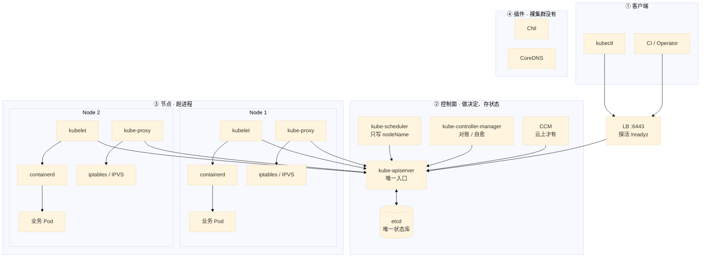
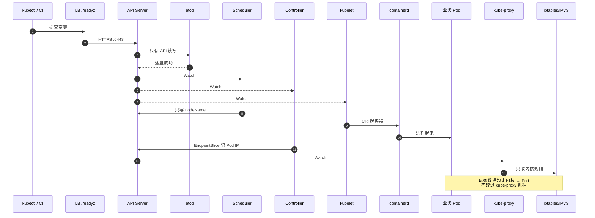
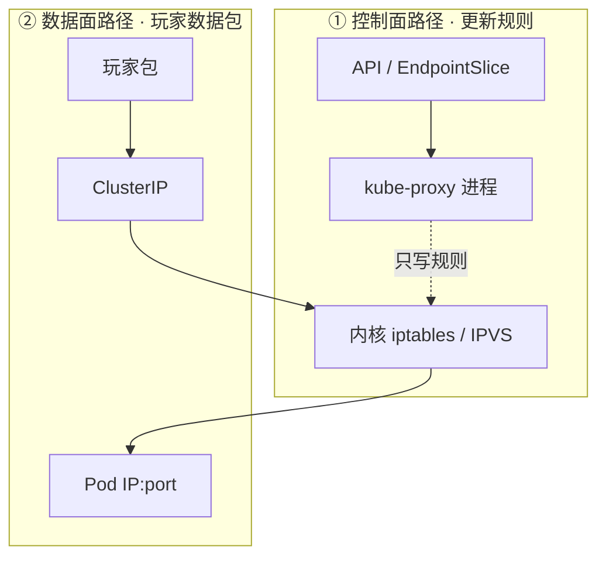
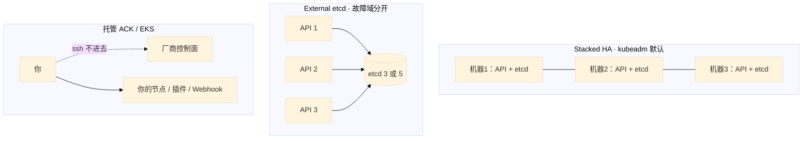
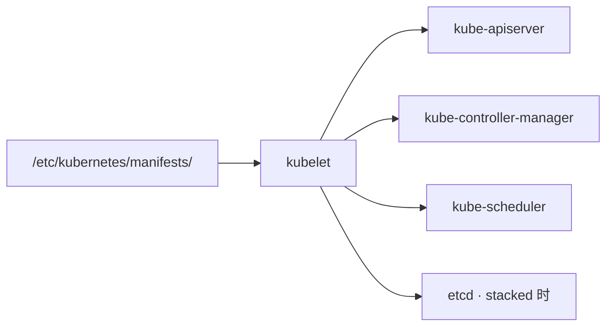
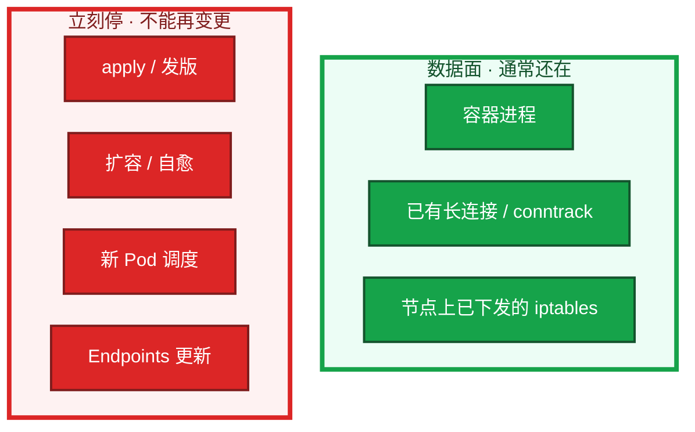

# 集群架构


活动高峰，`kubectl` 全部超时。群里有人说：集群挂了，重启逻辑服吧。先别动手。这一章要在你脑子里留下一张图——**哪些还在转，哪些已经停了**。看完再开口，答案会完全不一样。后面安装、命令、排障都对着这张图说话。

**本章主线（排障就按这三步想）：**

1. **分层**：控制面决策 / 节点跑进程 / 插件补网络与 DNS——谁唯一碰 etcd。
2. **归类**：Pending → ContainerCreating → Running 无 EP → 有 EP 仍不通，各进不同章。
3. **留证**：`/readyz` → `get nodes` → `kube-system` Pod → `describe` 卡住的对象。

**读完你能：** 白板上画出集群；把一次发版讲成一条链；Stacked / External / 托管差在哪；回答「API 挂了，玩家还在不在」。

## 本章目录

- [1. 基本概念](#1-基本概念)
- [2. 架构图](#2-架构图)
- [3. 原理](#3-原理)
  - [3.1 声明式](#31-你提交的是要什么)
  - [3.2 控制循环](#32-每个控制器都在转同一圈)
  - [3.3 只跟 API 说话](#33-组件之间不互相打电话)
  - [3.4 控制面职责](#34-控制面谁在做决定)
  - [3.5 节点职责](#35-节点谁在跑进程)
  - [3.6 插件](#36-插件没有它们集群是裸的)
- [4. 安装部署](#4-安装部署)
  - [4.1 三种拓扑](#41-三种拓扑stacked--external--托管)
  - [4.2 kubeadm 落地](#42-kubeadm-落地你实际看到什么)
- [5. 核心配置](#5-核心配置)
- [6. 命令与操作](#6-命令与操作)
- [7. 生产排障](#7-生产排障)
- [8. 必会 · 常考](#8-必会--常考)
- [合上书](#合上书问自己)

**本章不讲：** Raft 和备份 → [02 etcd](../02-etcd/)；认证准入、Watch Cache、APF → [03 API Server](../03-API-Server/)；三探针与优雅退出 → [04 Pod 生命周期](../04-Pod生命周期/)；Deploy / STS / PDB → [05 工作负载控制器](../05-工作负载控制器/)；过滤打分、污点 → [06 调度机制](../06-调度机制/)；CNI 实现 → [10 CNI](../10-CNI与网络策略/)；Service 摘流 → [08](../08-Service与kube-proxy/)。

---

## 1. 基本概念

**值班里什么时候碰到**：`kubectl` 全超时、新 Pod 一直 Pending、Running 但 Service 没流量、有人喊「集群挂了要不要重启游戏服」、Namespace 删不掉 Terminating。

Kubernetes 不是「一台大机器跑很多容器」。先把三层钉住：

| 层 | 干什么 | 挂了什么还在 |
|----|--------|-------------|
| **控制面** | 把期望存住，推动现状追上去。不跑你的游戏进程 | 已在跑的容器进程 |
| **节点** | kubelet + 运行时真正起容器；kube-proxy 改内核规则 | 进程 + 已有 conntrack |
| **插件** | 跨节点网络（CNI）、集群 DNS（CoreDNS）。裸集群没有 | 取决于插件类型 |

三个角色不要混：

| 角色 | 干什么 |
|------|--------|
| **etcd** | 把写成功的那份对象存住，多副本之间一致 |
| **API Server** | 唯一入口：认证、鉴权、准入之后才读写 etcd；读路径上有 Watch Cache |
| **其它组件** | Scheduler、Controller、kubelet、kubectl、CI，**全部只连 API** |

etcd 里有什么、没有什么：

| 在 etcd 里 | 不在 etcd 里 |
|------------|--------------|
| Pod / Deployment / Service / Node / Secret / CR | 容器进程、容器可写层 |
| spec、status、Event、Completed Job | 节点上的 iptables、已打上的长连接 |
| 路径形如 `/registry/<resource>/<namespace>/<name>` | 业务库、镜像、日志文件 |

> **记住**：etcd 里是对象。etcd 里没有容器进程，也没有已经打上的玩家长连接。谁直连 etcd，谁就绕过认证、鉴权、准入、审计。`etcdctl` 只做 health / member / snapshot，不要手改 `/registry`。

生产形态先认这三档（装的时候选，挂的时候故障域不一样）：

| 形态 | 一句话 |
|------|--------|
| **单控制面** | 开发机。一台挂 = 不能变更 |
| **Stacked HA** | kubeadm 默认。每台控制面 = API + etcd 成员。**这就是 HA**，不是「没做高可用」 |
| **External etcd** | API 一组、etcd 一组。故障域干净，要人看盘和证书 |
| **托管 ACK / EKS** | ssh 不进控制面。厂商修二进制；影响面、Webhook、节点仍是你的 |

Stacked ≠ 非 HA。3 台 Stacked + LB `:6443` 探 `/readyz`，就是生产最小 HA。External 只是把 etcd 拆出去，不是「只有 External 才叫 HA」。

---

## 2. 架构图

先把整张图钉住。后面安装、命令、排障都对着这张图说话。



**读图三句话：**

1. **从 kubectl 超时进图**：先 `/readyz`——etcd 盘慢 / Webhook 超时常在这里露馅，不是 API CPU 不够。
2. **从 Pod 卡住进图**：NODE 空 → Scheduler；ContainerCreating → kubelet/CNI/CSI；Running 无 EP → readiness/Label。
3. **从「集群挂了」进图**：先问进程还在不在、还能不能变更、流量还通不通——所有人只跟 API 说话，只有它读写 etcd；调度成功 ≠ 容器起来。

数据在这张图上怎么流：



API 大门里面还有三块，本章只钉位置，细节在 03：

| 块 | 在图上干什么 | 挂了你看到什么 |
|----|--------------|----------------|
| **认证 / 鉴权 / 准入 Webhook** | 写 etcd 之前的三道门 | 401 / 403 / apply 报 webhook timeout |
| **Watch Cache** | API 内存挡大部分 List/Watch/Get | 写仍过 etcd；cache miss 才打盘 |
| **APF** | 按 FlowSchema 排队 | 429；leader-election 不该和狂 List 挤一条道 |

生产里慢，十次里九次是 **etcd 磁盘** 或 **Webhook 超时**，不是 API CPU 不够。LB 必须探 `/readyz`，只探 TCP 6443 会把「进程在、etcd 不通」的实例留在池里。

---

## 3. 原理

原理只保留动手和面试会用到的：为什么是声明式、控制器在转什么圈、谁跟谁说话、每个盒子坏了图还转不转。

**本节 6 块：** 3.1 声明式 · 3.2 控制循环 · 3.3 只跟 API · 3.4 控制面 · 3.5 节点 · 3.6 插件

### 3.1 你提交的是「要什么」

**一句话：** 声明式就是只写期望，控制器负责把现状追上去。

**打个比方**：像点外卖写「我要两杯奶茶」——你不用管骑手走哪条路、哪家店做，平台（控制器）自己对账补齐。

**现场走一遍**（活动要紧急把大厅从 8 扩到 20）：

1. 现场 scale：

```bash
kubectl scale deploy hall --replicas=20 -n game
kubectl get po -n game -l app=hall -w
```

2. 屏幕出现：Pod 数从 8 涨到 20，Deployment 控制器自动补 Pod。

3. **但**如果 Git 里仍是 `replicas: 8`，下次 Argo CD 同步会打回去：

```bash
kubectl get deploy hall -n game -o jsonpath='{.spec.replicas}'
# 若 GitOps 同步后变回 8 → 被仓库覆盖了
```

4. 应急 scale 可以，**当天必须把 `replicas: 20` 补回 Git**。

**输出解读**：

```yaml
spec:
  replicas: 2   # 期望：始终 2 个可互换的大厅
```

你没有说「现在去那台机器上 docker run」。你留下一份期望。系统自己去对账。失败了再 apply 一次就行；Pod 没了会再被补上；Git 里那份 YAML 才是真相。

工作负载怎么选（只钉选型，滚动细节在 05）：可互换大厅 → Deployment；固定名字 / 独立盘 / 区服身份 → StatefulSet；每节点日志 / CNI → DaemonSet；合服备份 → Job。**房间绑在内存里的战斗服，不要当 Deployment 默认滚**——滚动等于杀对局。

**面试怎么说**：「声明式只写 spec 期望，控制器 Observe-Diff-Act 对账。应急 scale 可以，当天补 Git，否则 GitOps 会打回去。HPA 管副本时流水线不要再写死 replicas。」

> **记住**：Git 里 YAML 是真相；应急 scale 当天补回 Git。

### 3.2 每个控制器都在转同一圈

**一句话：** 每个控制器都在 Observe → Diff → Act 同一圈上转。

**打个比方**：像保安巡逻——看一眼（Observe）、数和台账比（Diff）、少了就补、多了就清（Act），然后继续下一轮。

**现场走一遍**（Deployment 期望 3 副本，有一个 Pod 被误删）：

1. 删一个 Pod：

```bash
kubectl delete po hall-abc123 -n game
kubectl get po -n game -l app=hall -w
```

2. 屏幕出现：几秒后新 Pod 被自动创建——ReplicaSet 控制器在对账。

3. `describe deploy` Events 出现 `Scaled up replica set ... to 3 from 2`——控制器持续 Watch + 对账，不是一次性脚本。

多副本 controller-manager 必须开 **leader-elect**，否则会双写。

滚动和 PDB 都依赖 **Ready**，不是 Running。没有 readiness，Deployment 以为新 Pod 已服役，PDB 也按 Running 计数——账面满足、流量已 502（04、05）。

**面试怎么说**：「Deployment、EndpointSlice、Node 控制器都在 Observe-Diff-Act 循环上转。controller-manager 多副本必须 leader-elect。Ready 才进 Service，不是 Running。」

> **记住**：控制器持续对账 = 自愈；Ready ≠ Running。

### 3.3 组件之间不互相打电话

**一句话：** 所有组件只 Watch 和改 API，Scheduler 不会给 kubelet 打电话。

**打个比方**：像公司只用 OA 系统流转——Scheduler 在 OA 上写「派你去 B 节点」，kubelet 自己刷 OA 看任务，不接电话。

**现场走一遍**（验证 Scheduler 只写 nodeName）：

1. 创建一个 Pod，观察调度过程：

```bash
kubectl run test --image=nginx -n default --dry-run=client -o yaml | kubectl apply -f -
kubectl get po test -n default -w
kubectl get po test -n default -o yaml | grep nodeName
```

2. 屏幕变化：

```text
NAME   READY   STATUS    RESTARTS   AGE
test   0/1     Pending   0          2s    # NODE 列空
test   0/1     Pending   0          5s    # NODE 列出现 worker-2
test   0/1     ContainerCreating   0      6s
test   1/1     Running   0          15s
```

3. **说明什么**：Pending 且 NODE 空 = Scheduler 还没写 nodeName；NODE 出现但 ContainerCreating = kubelet 在拉镜像/CNI/挂卷——**不是 Scheduler 的锅**。组件之间没有 RPC，只通过 API Watch 协作。

**面试怎么说**：「Scheduler 只写 spec.nodeName，不给 kubelet 打电话。kubelet Watch API 拿到本机 Pod 才起容器。谁直连 etcd 就绕过认证鉴权准入。」

> **记住**：谁直连 etcd，谁就绕过了三道门。写坏的对象会被控制器当成期望去执行。

### 3.4 控制面：谁在做决定

**一句话：** 控制面只存期望和做决策，不跑你的游戏进程。

**打个比方**：控制面像交通指挥中心——只管红绿灯和路线（调度、对账），不替你开车（不起容器）。

**现场走一遍**（`kubectl` 全超时，群里喊重启游戏服）：

1. 先探控制面愿不愿接流量：

```bash
kubectl get --raw /readyz?verbose
```

2. 屏幕出现（异常例）：

```text
[+]etcd failed: reason withheld
healthz check failed
```

3. **说明什么**：API 进程在，但 etcd 健康检查失败——根因常在盘，不是游戏服。

4. 同时确认数据面：

```bash
kubectl get po -n game -l app=logic
# 若还能列出且 STATUS=Running → 进程还在
```

5. **结论**：控制面挂 = 不能变更（apply/scale/自愈），**不等于**游戏进程立刻没了。不要重启逻辑服。

**输出解读** — 控制面各组件：

| 组件 | 职责 | 挂了什么还在 |
|------|------|-------------|
| **kube-apiserver** | 唯一大门；认证→鉴权→准入→写 etcd | 已在跑的容器 |
| **etcd** | 强一致 KV；写要 WAL fsync + 多数派 | 已在跑的容器 |
| **kube-scheduler** | 只写 nodeName | 已调度 Pod；新 Pod Pending |
| **kube-controller-manager** | Deployment/RS/EP/Node 等对账 | 已运行 Pod；掉了不补 |
| **CCM** | 云 LB、云盘、Node 生命周期（云上） | 取决于云资源 |

EndpointSlice **不是** Deployment 控制器写的。是 EndpointSlice 控制器按 `selector` + **Ready** 去填后端名单。

Webhook 配成 `failurePolicy=Fail` 且 Webhook 挂了，**写路径会一起死**（03）。`failurePolicy=Ignore` 是紧急窗口，不是长期方案。

**面试怎么说**：「API 挂了进程还在，不能变更。EndpointSlice 是 EP 控制器按 Ready 写的，不是 Deployment 写的。LB 探 /readyz 不探 TCP 6443。」

> **记住**：控制面不跑游戏进程；EndpointSlice 不是 Deployment 写的。

### 3.5 节点：谁在跑进程

**一句话：** 节点上 kubelet + 运行时才是真正起容器的地方。

**打个比方**：kubelet 像各门店店长——总部（控制面）只下发任务单（Pod spec），真正开门营业（起容器）是店长 + 后厨（containerd）。

**现场走一遍**（节点 NotReady，但业务还在跑）：

1. 看节点状态：

```bash
kubectl get nodes
kubectl describe node worker-3
```

2. 屏幕出现：

```text
NAME       STATUS     ROLES    AGE   VERSION
worker-3   NotReady   <none>   30d   v1.28.4

Conditions:
  Type             Status    Reason
  Ready            False     KubeletNotReady
```

3. SSH 到 worker-3，确认进程还在：

```bash
crictl ps | grep logic
systemctl status kubelet
```

4. **说明什么**：kubelet 挂了，**进程往往还在**。节点变 NotReady，先救 kubelet，不要立刻杀业务容器。驱逐是分钟级的事（16）。

**kube-proxy 两条路径**（整章最容易答错）：



数据包 **不经过** kube-proxy 用户态。它 Watch Service / EndpointSlice，把 ClusterIP 翻译成本机规则。kube-proxy 挂了，**已经打上的长连接往往还在**；新连接、滚动后的新后端，会打空。

探针（startup / liveness / readiness）和生命周期钩子都是 kubelet 在本机执行的，**不是控制器远程杀进程**（04）。

**面试怎么说**：「Scheduler 只写 nodeName，kubelet + containerd 才起容器。kube-proxy 只改 iptables/IPVS 规则，玩家包不经过 kube-proxy 进程。NotReady 先救 kubelet，别立刻杀容器。」

> **记住**：kube-proxy 改规则 ≠ 过包；NotReady 进程往往还在。

### 3.6 插件：没有它们，集群是裸的

**一句话：** kubeadm 刚装完只有本机容器，跨节点和 DNS 要靠插件。

**打个比方**：kubeadm 像盖好毛坯房——墙（API/etcd）有了，但水电网（CNI/DNS）还得另装，否则房间之间不通、地址簿（DNS）也没有。

**现场走一遍**（新集群 Pod 之间 ping 不通）：

1. 看插件是否装了：

```bash
kubectl get po -n kube-system | grep -E 'coredns|calico|flannel|cilium'
kubectl get ds -n kube-system
```

2. 若 kube-system 只有 apiserver/etcd/controller，没有 CNI DS → **裸集群**，跨节点不通。装 CNI 后再用跨 Pod ping 验收。

Namespace **不是墙**。默认跨 Namespace 网络能通。它是逻辑分组，是 RBAC、Quota 的作用域。要隔离必须自己叠 NetworkPolicy。

Label 给选择器，Annotation 不参与。Service、Deployment 只认 Label。`app=logic` 打在 annotation 上，Endpoints 就是空的——进程明明 Running，流量就是不来。

`kubectl delete` 不会立刻从 etcd 抹掉对象。先打上 `deletionTimestamp`，等 finalizer 摘完。卡着，是 CSI / Operator 还没清理完。先查对应控制器，**不要第一时间手抠**。

**面试怎么说**：「kubeadm 装完要另装 CNI 和 CoreDNS。Namespace 默认不隔离网络。Label 进 Service selector，Annotation 不进。Terminating 先查 finalizer 对应控制器。」

> **记住**：裸集群没有跨节点网络和 DNS；Namespace 不是网络墙。

---

## 4. 安装部署

### 4.1 三种拓扑：Stacked / External / 托管



| 形态 | 你要盯什么 | 一台挂掉什么 |
|------|------------|--------------|
| 单控制面 | 仅开发 | API + etcd 一起没，不能变更 |
| **Stacked HA** | kubeadm 默认；`--control-plane-endpoint` 必须是 VIP/LB | 一台挂 = **一个 API + 一个 etcd 成员**一起掉。3 台仍够 quorum |
| **External etcd** | 盘、证书、2379 只放行 API | API 挂不影响 etcd 多数派；etcd 盘仍是写路径瓶颈 |
| 托管 | 影响面、Webhook、节点、CNI、备份 RPO | 厂商修二进制；**停变更的仍是你的业务** |

生产底线：控制面 ≥ 3，etcd **3 或 5**（不要偶数），跨 AZ；etcd 独立 SSD，不和游戏日志混盘；API 入口用 LB，探活 `/readyz`。

Stacked 改 External 是项目，活动中不要做。Stacked 的 API 连本机 `127.0.0.1:2379` 是同命运，不是配错。

### 4.2 kubeadm 落地你实际看到什么

kubeadm 把控制面做成 **静态 Pod**：kubelet 盯着一个目录，里面有 YAML 就保证对应 Pod 在。



| 路径 | 内容 |
|------|------|
| `/etc/kubernetes/manifests/` | API / scheduler / controller-manager；（Stacked 时）etcd |
| `/etc/kubernetes/pki/` | 控制面证书；etcd 子目录在 02 |
| `/etc/kubernetes/admin.conf` | 本机 kubectl；不要当全集群共享管理员 kubeconfig |

Worker 上：systemd 的 kubelet，外加通常是 DaemonSet 的 kube-proxy。CNI、CoreDNS 另装。

改 manifests 目录里的 YAML，等于改控制面。验收：必须 `kubectl get --raw /readyz` 通过，且 `kubectl get nodes` 能列出。不要只探 TCP 6443。

---

## 5. 核心配置

只动有证据的项。改 manifests 后等 kubelet 重建该静态 Pod。证书续 pem 后必须重启静态 Pod。

| 参数 / 约定 | 生产怎么用 | 改错会怎样 |
|-------------|------------|------------|
| `--control-plane-endpoint` | VIP 或 LB，kubeadm join 和 kubeconfig 都写它 | 写死单机 IP → 那台挂了 kubectl 全死 |
| LB 探针 | HTTPS `/readyz` | 只探 TCP 6443 → 坏实例留在池里 |
| `--etcd-servers` | Stacked 连本机 127.0.0.1:2379 是同命运；External 每个 API 写满 3 个地址 | 漏地址 = 单点 |
| `--leader-elect` | controller-manager / scheduler **必须开** | 多副本否则双写 |
| kubelet 版本 | 最多比 API **低一个次版本** | 控制面刚升完同一秒全员重启 kubelet = 雪崩 |
| `--anonymous-auth` | `false` | 匿名扩大攻击面 |
| Webhook | 超时 **<3s**，多副本 + PDB；`failurePolicy` 想清楚 | 单副本 Fail 管所有 CREATE = 写路径焊死 |

> **记住**：Stacked 的 API 连本机 etcd 是设计，不是配错。证书过期当天是控制面 P0；续完必须重启静态 Pod。

---

## 6. 命令与操作

值班先跑这几条：

```bash
kubectl cluster-info
kubectl get --raw /readyz?verbose
kubectl get nodes -o wide
kubectl -n kube-system get pods
kubectl get deploy,po,svc,endpointslice -n <ns>
kubectl describe po <pod> -n <ns>
kubectl get events -n <ns> --sort-by='.lastTimestamp'
```

| 目的 | 命令 | 正常 | 异常 |
|------|------|------|------|
| 控制面愿不愿接流量 | `get --raw /readyz?verbose` | 每一项 ok | etcd / webhook 先挂 |
| 节点 | `get nodes -o wide` | Ready | NotReady / SchedulingDisabled |
| 控制面静态 Pod | `get pods -n kube-system` | apiserver/etcd Running | CrashLoop |
| 卡住的对象 | `describe po` | Running + Ready | Pending / ContainerCreating |
| 流量名单 | `get endpointslice -n <ns>` | 有 Ready Pod IP | 空 = readiness 或 Label 错 |
| 权限 | `auth can-i delete pods --as=...` | yes/no 明确 | 403 时确认 RBAC |

### 一次发版到有流量

大厅：`Deployment` `replicas: 2`，再配一个 `Service` `selector: app=hall`。

卡在哪一层，对照这张表。**先定位层，再动手。**

| 你看到的 | 卡在图上的哪一格 | 先看 |
|----------|------------------|------|
| Deployment 有了，`get po` 空 | 控制器还没建出 Pod | Events、controller-manager |
| Pending，NODE 列是空的 | Scheduler 还没写 nodeName | 资源、污点、亲和、PVC |
| ContainerCreating | 调度完了，本机没起成功 | 镜像、CSI、CNI、containerd |
| Running，Endpoints 为空 | 进程在，Service 不认 | readiness；Label 是否打成了 annotation |
| Endpoints 有 IP，ClusterIP 仍不通 | 名单有了，转发坏了 | kube-proxy、CNI、targetPort |

一句话串起来：

**Pending = 调度；ContainerCreating = 本机起进程；Running 但没流量 = 探针或标签；有 Endpoints 仍不通 = 转发。**

Running 只说明进程在。Ready 才说明可以进 Service。

### 升级

先 etcd 快照（02）→ 滚动升控制面（一次一台 API，LB 里始终留健康实例）→ 再滚 kubelet。kubelet 最多比 API **低一个次版本**。不要控制面刚升完，同一秒全员重启 kubelet。

### 紧急扩容

活动要紧急把大厅从 8 扩到 20。现场可以 `kubectl scale`，但必须当天把 `replicas: 20` 补回 Git。HPA 和 YAML 抢的是同一个字段。战斗服不要靠 HPA 缩容——会杀正在打仗的进程（05、07）。

---

## 7. 生产排障

不要答「集群挂了」。固定问三句：

1. 已经在跑的进程还在不在？
2. 还能不能变更（发版 / 扩容 / 自愈）？
3. 已有流量还通不通？



**控制面挂 = 不能决策。数据面进程不立刻死。** 内核规则不会瞬间蒸发，变的是再也更新不了。

| 挂谁 | 已运行 Pod | 发版 / 扩容 / 自愈 | 已有 Service 流量 |
|------|:----------:|:------------------:|:-----------------:|
| etcd / API Server | 在 | **停** | 规则在内核，一般还在 |
| Scheduler | 在 | 新 Pod 一直 Pending | 在 |
| Controller Manager | 在 | 掉了不补、滚不动 | 在 |
| kubelet | **在** | 本节点不探针、不上报 | 先别杀进程 |
| kube-proxy | 在 | 规则不更新 | 存量可能还在；**新连接会出问题** |

现场顺序：`/readyz` → `get nodes` → `kube-system` 的 Pod → `describe` 卡住的对象。  
不要做的事：为了「做点什么」去重启还活着的逻辑服。

活动高峰 etcd 和日志同盘，fsync 打到几百毫秒。正确处理：确认进程还在 → 停止发版和重启战斗服 → 救盘 / quorum / Webhook → 恢复后先 `get nodes`，再补自愈。

| 现象 | 先做什么 | 不要做什么 |
|------|----------|------------|
| `kubectl` 超时，`/readyz` 失败 | etcd 盘、证书、Webhook | 重启全部游戏服 |
| 新 Pod Pending，NODE 空 | 资源、污点、亲和、PVC | 查镜像、重启业务 |
| 已经 Scheduled，一直 ContainerCreating | CNI、CSI、镜像、containerd | 当 Scheduler 坏了 |
| Running，Service 没有 Endpoints | Ready / Label（是否打成 annotation） | 重装 kube-proxy |
| Endpoints 有 IP，ClusterIP 不通 | kube-proxy、CNI、targetPort | 重启逻辑服 |
| 节点 NotReady，`crictl ps` 里业务还在 | 救 kubelet | 立刻杀容器「重建试试」 |
| drain 卡住 | PDB（05） | 上来删 PDB 赶战斗服 |
| 控制面慢，CPU 不忙 | etcd 盘 / Webhook，再看 APF | 先给 API 加核 |

---

## 8. 必会 · 常考

白板和追问高频，能一口回：

| 说法 | 对错 | 口径 |
|------|:----:|------|
| kubelet 可以直连 etcd 拉 Pod spec | 错 | 只连 API Server |
| API 挂了，游戏服进程立刻没了 | 错 | 进程还在；不能变更 |
| 调度成功就是容器起来了 | 错 | Scheduler 只写 `nodeName`；kubelet + CRI 才起进程 |
| 玩家的包经过 kube-proxy 进程 | 错 | 走内核 iptables/IPVS；kube-proxy 只改规则 |
| Stacked 不是高可用 | 错 | 3 台 Stacked + LB 就是生产最小 HA；一台挂 = API 和一个 etcd 成员一起掉 |
| 4 台 etcd 比 3 台更能抗 2 台故障 | 错 | 4 台容错仍是 1（02） |
| Namespace 默认隔离子网 | 错 | 逻辑分组；要隔离自己叠 NetworkPolicy |
| Label 和 Annotation 都能被 Service 选中 | 错 | 选择器只认 Label |
| EndpointSlice 是 Deployment 控制器写的 | 错 | EndpointSlice 控制器按 selector + Ready |
| Terminating 就该立刻手抠 finalizer | 错 | 先查 CSI / Operator |
| LB 探 TCP 6443 就够了 | 错 | 必须 `/readyz` |
| 托管了不用懂控制面 | 错 | 影响面、Webhook、节点仍是你的 |
| 有状态战斗服可以当 Deployment 默认滚 | 错 | 滚动等于杀对局；STS 也不解决内存状态（05） |
| controller-manager 多副本可以不开 leader-elect | 错 | 否则双写 |

数字：控制面 ≥ 3；etcd **3 或 5**；kubelet 最多比 API 低 **一个次版本**；Webhook 超时 **<3s**；证书告警思路对齐 02 的 **14 天**。

易混：Stacked vs External（故障域，不是「谁才叫 HA」）；进程还在 vs 还能变更 vs 流量还通；Pending vs ContainerCreating vs Running 无 EP；kube-proxy 控制面路径 vs 数据面路径；Label vs Annotation；Webhook 超时 vs etcd 盘慢 vs APF 429。

---

## 合上书，问自己

1. 能画出第 2 节那张图，并指出谁唯一碰 etcd 吗？
2. Scheduler 和 kubelet，谁负责「容器跑起来」？过滤失败和打分失败哪个会 Pending？
3. 玩家的包会经过 kube-proxy 进程吗？
4. apply 之后，从 etcd 到 ClusterIP 通，中间经过哪些控制器？EndpointSlice 是谁写的？
5. API 挂了，已经在打的长连接还在吗？该不该重启逻辑服？
6. Stacked 和 External 故障域差在哪？Namespace 默认隔离子网吗？Label 和 Annotation 谁进 Service？

六题都能口述，这一章就过了。细节分别进 02（etcd）、03（API）、04（探针）、05（控制器）、06（调度）、08（Service）。下一章把 etcd 剖开：盘一慢，为什么整张图上的 `kubectl` 一起卡死。
