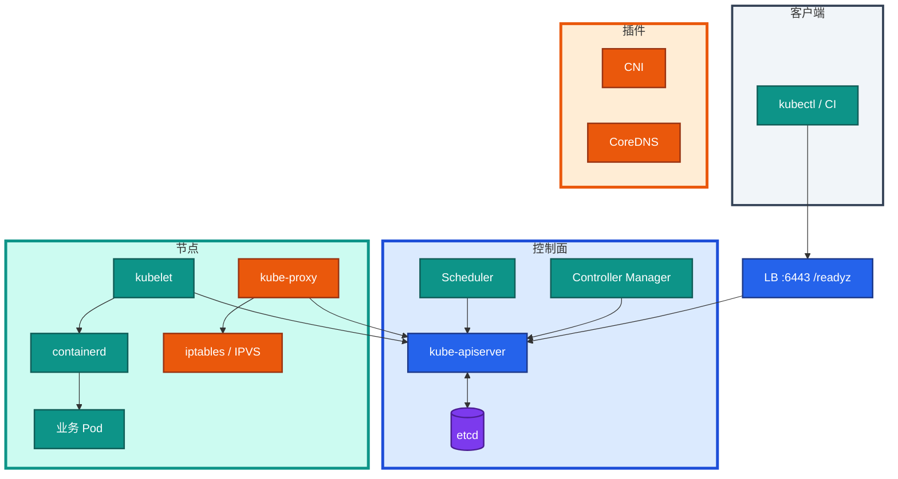
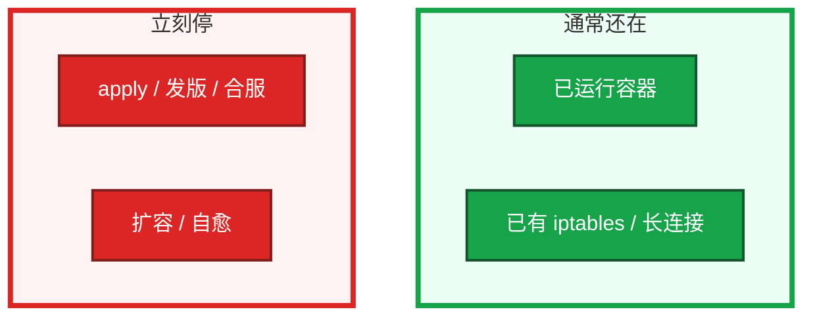
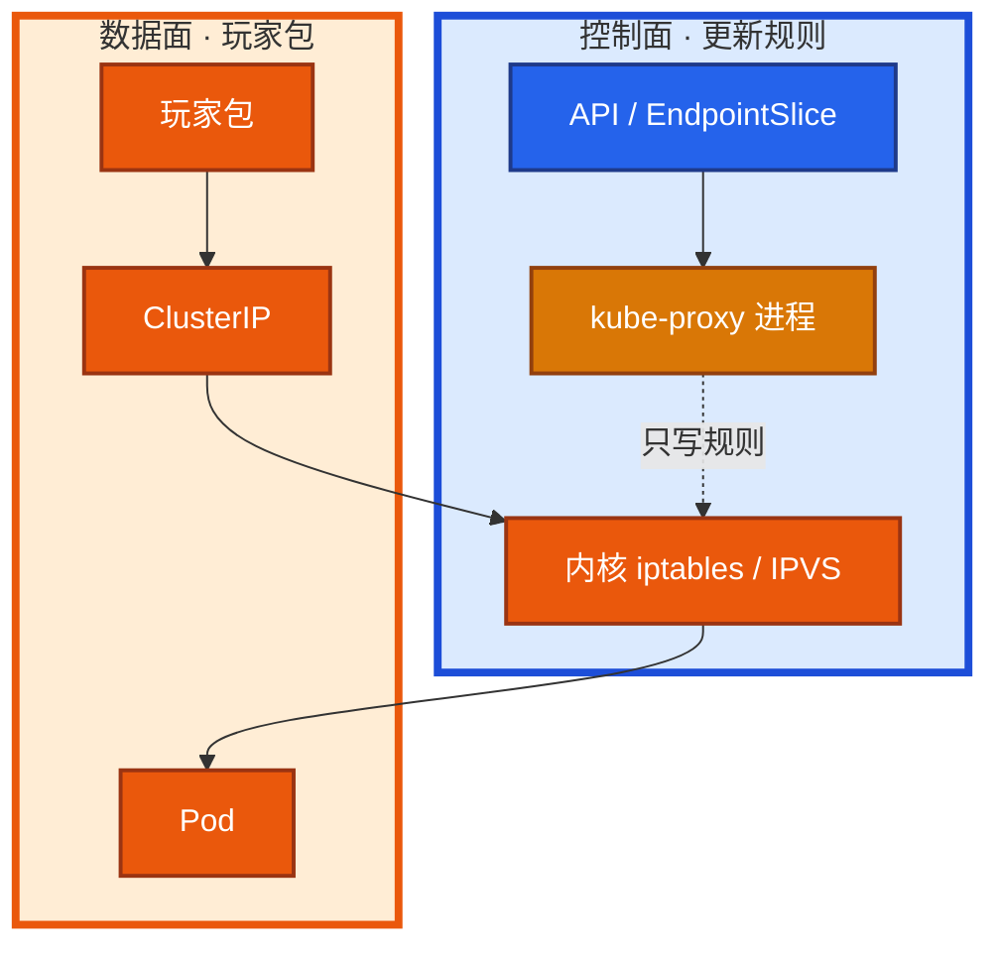
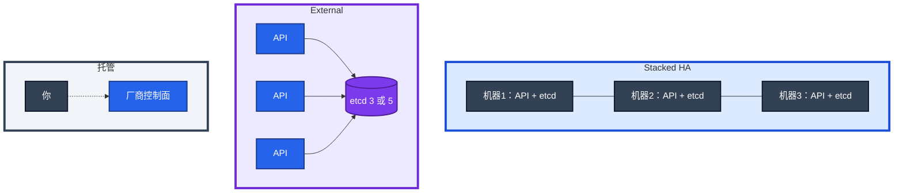
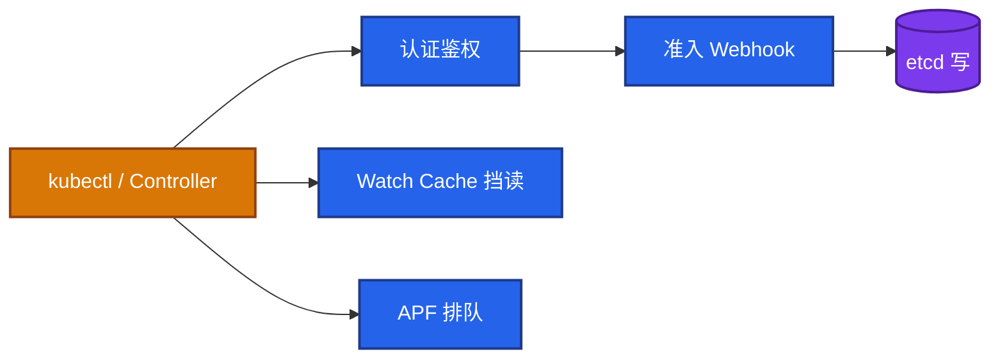

# 01｜集群架构 · 练习题

先对照 [知识点](知识点.md) **本章主线** 自己口述，再对答案。每题标了覆盖范围：

| 标记 | 含义 |
|------|------|
| **核心** | 不懂整章就没建立起来 |
| **必会** | 值班和面试都要能讲 |
| **常用** | 线上会反复碰到 |
| **常考** | 白板和追问的高频口径 |

## 本题目录

- [Q1 画出集群、每个组件干什么](#q1)
- [Q2 apply 到 Service 流量](#q2)
- [Q3 API 挂了，游戏服还在吗](#q3)
- [Q4 声明式 / 现场 scale](#q4)
- [Q5 kube-proxy 过不过包](#q5)
- [Q6 Namespace / Label](#q6)
- [Q7 Stacked vs HA / 托管](#q7)
- [Q8 现象分层](#q8)
- [Q9 Watch Cache / Webhook / APF 钉在哪](#q9)
- [合上书](#合上书)

---

## Q1

**★★★★★｜请画出集群架构，并说明每个核心组件干什么**

**覆盖**：核心 · 必会 · 常考
**对应**：知识点 §2 架构图 · §3.4

### 场景

面试官递给你一支笔：「画一下 Kubernetes 集群，边画边说每个框的职责。」不要从 Pod 开始画。

### 完整解答

**一句话**：控制面决策、节点跑进程、插件补网络，只有 API Server 读写 etcd。

先分三层：**控制面**做决定，**节点**跑进程，**插件**补网络和 DNS。API Server 画在正中间。



| 组件 | 一句话 |
|------|--------|
| API Server | 唯一入口；认证鉴权准入之后才读写 etcd |
| etcd | 唯一状态库；不存容器进程，不存已有长连接 |
| Scheduler | 给未绑定 Pod 写 `nodeName`，不起容器；过滤失败才 Pending |
| Controller Manager | 多组控制循环，让现状追期望；要 leader-elect |
| CCM | 对接云主机 / 云盘 / 云 LB；自建往往没有 |
| kubelet | 本机按 spec 调 CRI、挂卷、探针、上报 |
| containerd | 真正创建容器 |
| kube-proxy | 把 Service 规则写下内核，自己不过包 |
| CNI / CoreDNS | 跨节点网络和集群 DNS；裸集群没有 |

两个边界必须主动说出来：

1. 除 API Server 外，谁都不许直连 etcd。
2. 控制面短暂不可用时，已运行进程通常还在，但发版、扩容、自愈会停。

### 再追问

- kubelet 为什么不能直连 etcd？——会绕过认证、鉴权、准入、审计；写坏的对象会被控制器当成期望执行。
- 装完 kubeadm 为什么还不能跨节点通信？——还要装 CNI；集群 DNS 还要 CoreDNS。
- EndpointSlice 是谁写的？——不是 Deployment 控制器。是 EndpointSlice 控制器按 selector + Ready。

---

## Q2

**★★★★★｜一个 Pod 从 apply 到接上 Service 流量，经过哪些步骤？**

**覆盖**：核心 · 必会 · 常考
**对应**：知识点 §6 命令与操作

### 场景

大厅 `Deployment` `replicas: 2`，另有 `Service` `selector: app=hall`。请按时间顺序讲，并说明每一步失败时 `kubectl` 会看到什么。

### 完整解答

**一句话**：Pending = 调度；ContainerCreating = 本机；Running 无 EP = 探针或标签；有 EP 仍不通 = 转发。


此时 `get po` 有行，还没有容器——卡在 d→e。Pending 且 NODE 为空 = 还没调度。ContainerCreating = 本机没起成功。

| 现象 | 卡在哪 | 先看 |
|------|--------|------|
| Deployment 有，`get po` 空 | 控制器没建出 Pod | Events、controller-manager |
| Pending，NODE 空 | 还没调度 | 资源、污点、亲和、PVC |
| ContainerCreating | 本机没起成功 | 镜像、CSI、CNI、containerd |
| Running，Endpoints 空 | Service 不认 | readiness；Label 是否打在 annotation |
| 有 Endpoints 仍不通 | 转发坏了 | kube-proxy、CNI、targetPort |

**Pending 是调度；ContainerCreating 是本机；Running 没流量是探针或标签；有 EP 仍不通才是转发。**

### 再追问

- Running 和 Ready 有什么区别？——Running 是进程在；Ready 才进 EndpointSlice，才能接 Service 流量。
- 谁把 Pod IP 写进 EndpointSlice？——EndpointSlice 控制器，按 selector + Ready。不是 Deployment 控制器。

---

## Q3

**★★★★★｜etcd 或 API Server 挂了，已经在线的游戏服会立刻断吗？**

**覆盖**：核心 · 必会 · 常考
**对应**：知识点 §7 生产排障

### 场景

活动高峰，所有 `kubectl` 超时。群里有人要重启逻辑服。你怎么判断、怎么回？

### 完整解答

**一句话**：控制面挂 = 不能变更；已运行进程和已有流量通常还在，不要重启逻辑服。

不要说「集群挂了」。拆成三问：进程？变更？流量？



口径：

- **进程还在。** etcd 里没有容器进程本身。
- **变更全停。** apply、调度、补副本、滚动，都要写 API。
- **已有流量往往还在。** 节点上已经下发的 iptables/IPVS 和 conntrack 不会瞬间蒸发。长连接玩家通常还在。

正确动作：确认节点上进程还在 → 停止发版和重启 → 救 `/readyz`、etcd 盘、证书、Webhook → 恢复后再补自愈。  
错误动作：为了「做点什么」把还活着的战斗服重启一遍。

### 再追问

把「挂谁」再拆开：

| 挂谁 | 已运行 Pod | 变更 | 已有流量 |
|------|:----------:|:----:|:--------:|
| Scheduler | 在 | 新 Pod 一直 Pending | 在 |
| Controller Manager | 在 | 掉了不补、滚不动 | 在 |
| kubelet | **在** | 本节点不上报，会 NotReady | 先别杀进程 |
| kube-proxy | 在 | 规则不更新 | 存量可能在；**新连接会出问题** |

---

## Q4

**★★★★☆｜为什么生产用声明式？现场 scale 之后呢？**

**覆盖**：必会 · 常用 · 常考
**对应**：知识点 §3.1 声明式

### 场景

活动要紧急把大厅从 8 扩到 20。有人直接 `kubectl scale`，有人说必须改 Git。怎么选？

### 完整解答

**一句话**：声明式只写期望，控制器持续对账；应急 scale 当天必须补回 Git。

声明式存的是**最终期望**，控制器持续 Observe → Diff → Act。所以：

- 失败了再 apply 一次即可（幂等）
- Pod 没了会自愈
- Git / GitOps 能成为唯一真相源

命令式（`scale` / `edit`）适合**止血**。现场可以 scale 到 20，但必须当天把 `replicas: 20` 补回 Git。否则下一次流水线或 Argo CD 同步会拿仓库里的 `replicas: 8` 把你打回去。

HPA 和 YAML 抢的是同一个字段。HPA 管副本时，流水线不要再写死 `replicas`。

### 再追问

- 控制器在干什么？——看现状、和期望比、不一致就动手，不是一次性脚本。
- 组件之间为什么不直连？——都只跟 API Server 说话，才能统一做认证准入，并独立升级。
- 战斗服能靠 HPA 缩吗？——不能。缩容会杀正在打仗的进程（05、07）。

---

## Q5

**★★★★☆｜kube-proxy 挂了，玩家的包还会经过它吗？流量呢？**

**覆盖**：核心 · 常考
**对应**：知识点 §3.5 节点

### 场景

白板题：「画一下访问 ClusterIP 时，数据包走哪。kube-proxy 在这条路上吗？」

### 完整解答

**一句话**：kube-proxy 只写内核规则，玩家数据包不经过 proxy 用户态进程。



数据包 **不经过** kube-proxy 用户态。它 Watch Service / EndpointSlice，把规则写下内核。

kube-proxy 挂了：

- 已经打上的长连接、已有 conntrack，往往还在
- 新连接、滚动后的新后端，规则更新不了，会打空或打到已经没了的 Pod

部分 CNI（Cilium kube-proxy-replacement）可以不跑 kube-proxy，但必须有等价实现，否则 Service 不完整。

### 再追问

- 有 Endpoints 仍然不通，先查谁？——kube-proxy / CNI / targetPort，不要先重启业务。
- Service 没后端，先查谁？——selector 是否匹配 Label；Pod 是否 Ready。

---

## Q6

**★★★★☆｜Namespace 是安全边界吗？Label 打错会怎样？**

**覆盖**：必会 · 常考
**对应**：知识点 §3.6 插件

### 场景

安全同学说：「支付和战斗服已经分了 Namespace，可以当隔离。」对不对？另外，大厅 Service 选不到 Pod，describe 发现 `app=hall` 写在 annotation 里。

### 完整解答

**一句话**：Namespace 不是安全墙；选择器只认 Label，annotation 不会进 Endpoints。

**Namespace 不是墙。** 它是逻辑分组，是 RBAC、Quota 的作用域。默认跨 Namespace 网络能通：


要隔离：NetworkPolicy 默认拒绝、最小 RBAC、ResourceQuota；合规硬墙就拆集群或独立节点池。

**Label 给选择器，Annotation 不参与选择。** `app=hall` 打在 annotation 上，Service 看不见，EndpointSlice 为空。进程可以 Running，流量就是不来。改 Label，不要先怀疑 kube-proxy。

### 再追问

- 对象一直 Terminating 怎么办？——看 `finalizers`，找 CSI / Operator。确认外部资源清干净前，不要手抠 finalizer。Namespace 删不掉，先列 NS 里还带着 finalizer 的对象。

---

## Q7

**★★★★☆｜三种生产拓扑怎么选？Stacked 算不算 HA？托管了还要懂控制面吗？**

**覆盖**：必会 · 常用 · 常考
**对应**：知识点 §4.1 三种拓扑

### 场景

新集群：自建 kubeadm 还是上 ACK？若自建，etcd 跟 API 同机还是拆开？有人说「Stacked 不是高可用」。老板说「托管了，控制面不用管」。

### 完整解答

**一句话**：Stacked 就是 HA；3 台 + LB 探 `/readyz` 是 kubeadm 生产最小高可用。



**Stacked 就是 HA。** 3 台 Stacked + LB `:6443` 探 `/readyz`，是 kubeadm 生产最小高可用。不要把 Stacked 说成「没做 HA」。差别是故障域：一台挂 = API **和一个 etcd 成员**一起掉，3 台仍够 quorum。External 把盘和证书拆出去，不是「只有 External 才叫 HA」。

底线：控制面 ≥ 3；etcd **3 或 5**，不要偶数；跨 AZ；etcd 独立 SSD；API 用 LB，探活 `/readyz`，不要写死单机 IP。单控制面只给开发。

**托管仍然要懂控制面。** 厂商管机器和部分升级。你还要会：API 不可用时的影响面（Q3）、自己装的 Webhook 把写路径卡死、节点 / CNI / 工作负载故障、创建链和排障分层（Q2）。

kubeadm 控制面是静态 Pod，清单在 `/etc/kubernetes/manifests/`。kubelet 盯这个目录。Worker 上是 systemd 的 kubelet。Stacked 改 External 是项目，活动中不要做。

### 再追问

- LB 为什么不能只探 TCP 6443？——端口开着不等于 `/readyz` 通过；etcd 或 Webhook 坏了仍可能在听。
- kubelet 版本相对 API 有什么限制？——最多低一个次版本；不要控制面升完同一秒全员重启 kubelet。
- controller-manager 为什么要 leader-elect？——多副本否则双写。
- `--etcd-servers` Stacked 写 `127.0.0.1:2379` 是配错吗？——不是，同命运是设计；External 才写满 3 个地址。

---

## Q8

**★★★☆☆｜看到这些现象，你先怀疑图上的哪一格？**

**覆盖**：必会 · 常用
**对应**：知识点 §7 生产排障

### 场景

值班：六个工单同时进来。请快速分层，不要每个都重启节点。

1. 新 Pod 一直 Pending，NODE 列为空
2. 已经 Scheduled，一直 ContainerCreating
3. Pod Running，Service 没有 Endpoints
4. Endpoints 里有 IP，ClusterIP 连不上
5. 节点 NotReady，但 `crictl ps` 里业务还在
6. `kubectl` 超时，`/readyz` 失败

### 完整解答

**一句话**：先按 Pending / ContainerCreating / 无 EP / 有 EP 不通分层，不要每个工单都重启节点。

| # | 先怀疑 | 不要先做 |
|---|--------|----------|
| 1 | Scheduler：资源、污点、亲和、PVC | 查镜像、重启业务 |
| 2 | kubelet 本机：CNI、CSI、镜像、containerd | 当 Scheduler 坏了 |
| 3 | Ready / Label（是否打成 annotation） | 重装 kube-proxy |
| 4 | kube-proxy、CNI、targetPort | 重启逻辑服 |
| 5 | 救 kubelet | 立刻杀容器「重建试试」 |
| 6 | etcd 盘、证书、Webhook、APF | 重启全部游戏服 |

现场命令顺序：

```bash
kubectl get --raw /readyz?verbose
kubectl get nodes -o wide
kubectl -n kube-system get pods
kubectl describe po <pod>
kubectl get endpointslice -n <ns>
```

### 再追问

- 控制面慢，先给 API 加 CPU 对不对？——十次里九次是 etcd 磁盘或 Webhook 超时。
- 紧急 scale 之后还要做什么？——把期望补回 Git，避免 GitOps 打回。
- drain 卡住先查什么？——PDB（05），不要上来删。

---

## Q9

**★★★★☆｜Watch Cache、Webhook、APF 分别钉在架构哪一格？慢了先怀疑谁？**

**覆盖**：必会 · 常考
**对应**：知识点 §2 架构图

### 场景

API P99 从 20ms 到 2s。有人要给 API 加核，有人要重启 etcd，有人说「Informer 把 etcd 打爆了」。刚装了个单副本 Validating Webhook。

### 完整解答

**一句话**：Watch Cache / Webhook / APF 都在 API Server 里；慢了先查 etcd 盘和 Webhook，不要先给 API 加核。

三块都在 **API Server 里**，不在 etcd 里，也不在 kubelet 里。本章钉位置，细节在 03。



| 块 | 干什么 | 挂了 / 慢了 |
|----|--------|-------------|
| Watch Cache | API 内存挡 List/Watch/Get | 写仍过 etcd；`too old revision` 是 compact 后正常重 List |
| 准入 Webhook | Mutating 先改、Validating 再拒 | `failurePolicy=Fail` + 服务挂 = **写路径焊死** |
| APF | FlowSchema → PriorityLevel 队列 | 队列满 **429**；只加 API 副本会一起锤 etcd |

先看 `/readyz?verbose`，再分：etcd 盘 fsync、Webhook 超时、429 肇事客户端。不要先给 API 加核。

### 再追问

- Controller 为什么不直连 etcd 拉 Watch？——Cache、RBAC、限流、审计都在 API。直连绕过三道门（02、03）。
- 有状态战斗服能当 Deployment 默认滚吗？——不能。滚动等于杀对局；换 STS 仍会按序杀进程（05）。

---

## 合上书

- [ ] 不看资料，1 分钟画出第 1 题那张图
- [ ] 能把 apply → ClusterIP 通讲成一条链，并指出 EndpointSlice 是谁写的
- [ ] 能用「进程 / 变更 / 流量」三问回答控制面故障
- [ ] 能说明 kube-proxy 不过包、Namespace 不是墙、Label ≠ Annotation
- [ ] 能说出 Stacked 就是 HA，和 External 差在故障域；托管仍要懂影响面
- [ ] 能把 Watch Cache / Webhook / APF 钉在 API 上，慢了不先给 API 加核
- [ ] 能按 Pending / ContainerCreating / 无 EP / 有 EP 不通分层
