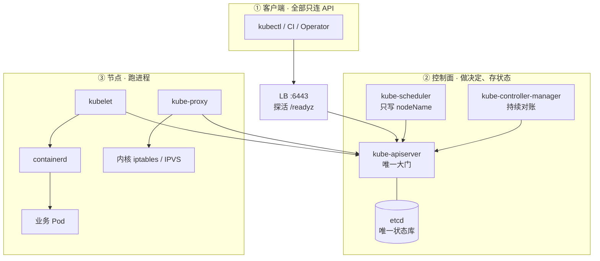
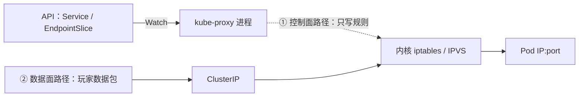
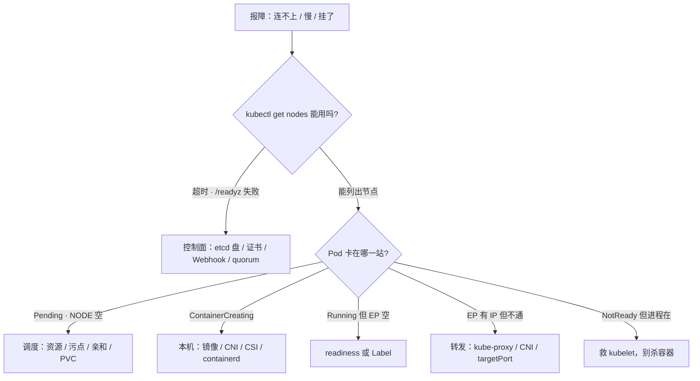
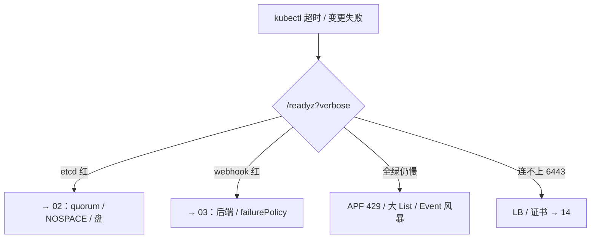

# 01｜集群架构 · 练习题

先合上知识点，对着 **一节的主图** 把「一次发版的一生」从 `kubectl apply` 到玩家流量进 Pod 口述一遍，再来做题。

| 标记 | 含义 |
|------|------|
| **核心** | 不懂整章就没建立起来 |
| **必会** | 值班和面试都要能讲 |
| **常用** | 线上会反复碰到 |
| **常考** | 白板和追问的高频口径 |

## 本题目录

- [Q1 画架构图：三层与组件职责](#q1)
- [Q2 一次 apply 到玩家流量的全链](#q2)
- [Q3 API/etcd 挂了，玩家会断吗](#q3)
- [Q4 声明式、紧急 scale 与 Git](#q4)
- [Q5 控制循环凭什么自愈](#q5)
- [Q6 玩家的包过不过 kube-proxy](#q6)
- [Q7 Namespace、Label 与 Terminating](#q7)
- [Q8 Stacked、External、托管与静态 Pod](#q8)
- [Q9 Watch Cache、准入 Webhook 与 429](#q9)
- [Q10 节点 NotReady，但进程还在](#q10)
- [Q11 六个现象，各归哪一层](#q11)
- [Q12 升级顺序与版本偏差](#q12)
- [Q13 60 秒控制面定责](#q13)
- [Q14 托管集群与多租户边界](#q14)
- [合上书](#合上书)

---

## Q1

**★★★★★｜「在白板上画一下 K8s 集群架构，说说每个组件是干什么的。」**

**覆盖**：核心 · 必会 · 常考 ｜ **对应**：知识点 [一、一张图：一次发版的一生](知识点.md)、[五、派工：所有人都只跟 API 说话](知识点.md)

### 场景

面试官递来白板笔。有人只画了四个框（API、etcd、kubelet、scheduler）就开讲，漏了 controller-manager 和节点上的 kube-proxy；被追问「谁连 etcd」时答「组件都连」。

### 完整解答

> 🎯 **一句话**：三层 + 一扇门——只有 kube-apiserver 读写 etcd，其余全部只连 API。



画完先钉结构，再逐个点职责，每个一句话：

- **三层**：控制面做决定、存状态；节点跑进程；插件（CNI、CoreDNS）补跨节点网络与 DNS——kubeadm 刚装完的集群是裸的，插件要另装。
- **kube-apiserver**：唯一大门，唯一读写 etcd 的组件；认证、鉴权、准入、审计都在这道门上。
- **etcd**：唯一状态库，存所有对象的 `spec`/`status`；不存进程、不存连接。
- **kube-scheduler**：Watch 未调度的 Pod，过滤打分，**只写 `spec.nodeName`**，不起容器。
- **kube-controller-manager**：几十个控制循环打包成一个进程，持续 Observe → Diff → Act 对账。
- **kubelet**：节点上的执行者，经 CRI 调 containerd 起容器、跑探针、上报状态。
- **kube-proxy**：Watch EndpointSlice，把 ClusterIP 翻译成内核规则——**只写规则，不过包**。

> 📝 **面试**：先三层、后大门（只有 API 读写 etcd）、再逐个一句话点职责；最后主动补一句「组件之间没有直连，全走 API，所以挂一个不会拉着别人死」——这句是给追问铺路。

### 再追问

1. **「图上没有 cloud-controller-manager，要不要补？」**——云上要：它对接云厂商 API（节点同步、LoadBalancer 类型对应的云 LB、云路由）；托管集群里厂商替你跑，自建 IDC 通常不装它，LoadBalancer 类型就不会自动创出云 LB。**不要**在自建集群里指望 LoadBalancer 自动出入口，入口要自己接外部负载均衡。
2. **「kubeadm 装完集群，跨节点 Pod ping 不通，为什么？」**——裸集群：CNI 没装（或没跑起来），跨节点网络不存在；顺带查 CoreDNS。**不要**先怀疑业务配置，先 `kubectl get po -n kube-system` 看 calico/cilium/coredns 在不在。

---

## Q2

**★★★★★｜「从 kubectl apply 到玩家流量打进来，中间发生了什么？」**

**覆盖**：核心 · 常考 ｜ **对应**：知识点 [一、一张图：一次发版的一生](知识点.md)、[六、通流：玩家的包怎么进 Pod](知识点.md)

### 场景

面试官要一条完整链路。有人从「apiserver 写 etcd」直接跳到「Pod 起来了」，中间五站全省略；被追问「谁写的 EndpointSlice」答成 Deployment 控制器。

### 完整解答

> 🎯 **一句话**：八站——写库、建记录、调度、起容器、进名单、写规则，前六站全是写记录。

按时间顺序口述（对应一节的时序图）：

1. `kubectl apply` → LB :6443 → **kube-apiserver**，过认证、鉴权、准入三道门；
2. API 把 Deployment 写进 **etcd**（全集群只有它能写）；
3. **controller-manager** Watch 到新对象，建出 ReplicaSet 和 Pod 记录（此刻只是账本多了几行）；
4. **scheduler** Watch 到 `nodeName` 为空的 Pod，过滤打分后只写 `spec.nodeName`；
5. 目标节点的 **kubelet** Watch 到本机 Pod，经 CRI 调 **containerd** 起容器：拉镜像 → 配 CNI → 挂卷 → 起进程；
6. readiness 探针通过 → Pod **Ready**；
7. **EndpointSlice 控制器**按 Service 的 `selector` + Ready，把 Pod IP 写进后端名单；
8. 每个节点的 **kube-proxy** Watch 到名单变化，把 ClusterIP 翻译进内核 **iptables / IPVS**；玩家的包从任意节点进来，**由内核直接转发**到 Pod。

> ⚠️ **别混**：第 4 步（调度完成）和第 5 步（容器起来）之间隔着拉镜像、CNI、挂卷、探针一整条链——调度成功 ≠ 容器起来；第 7 步写名单的是 EndpointSlice 控制器，不是 Deployment 控制器。

> 📝 **面试**：报站名时把「谁只写记录、谁真起进程」的分界说在第 4/5 步之间，面试官听到这句基本不再追细节。

### 再追问

1. **「战斗服要上新版本，能当 Deployment 默认滚动吗？」**——不能。房间状态绑在进程内存里，滚动等于杀对局；StatefulSet 也只是按序杀重建，同样不解决内存状态。有状态战斗服要走游戏自己的迁移/合服流程（工作负载选型 → [05](../05-工作负载控制器/)）。**不要**把「换个控制器」当成有状态问题的解法。
2. **「卡在第 5 步不动了，`kubectl` 里长什么样？」**——`ContainerCreating`：调度已完成（NODE 列有值），查镜像、CNI、CSI、containerd。**不要**当 scheduler 坏了去查资源。

---

## Q3

**★★★★★｜「kube-apiserver（或 etcd）挂了，正在打游戏的玩家会掉线吗？」**

**覆盖**：核心 · 必会 · 常考 ｜ **对应**：知识点 [八、挂了：定责](知识点.md)、[三、落库：etcd 是唯一状态库](知识点.md)

### 场景

活动高峰 `kubectl` 全超时，监控大屏红了一片「集群异常」——可玩家还在打本。群里有人开始数「1、2、3 重启全部逻辑服」，手就放在批量执行键上。

### 完整解答

> 🎯 **一句话**：三问拆开答——进程在、变更停、存量流量通常在；所以不重启逻辑服。

先拆三问，三问的答案可以完全不同：

1. **已经在跑的游戏进程还在不在？**——在。etcd 里存的是对象，不是进程；容器跑在节点上，控制面碰不到它。
2. **还能不能变更？**——不能。apply、调度、副本对账、EndpointSlice 更新全停，**自愈跟着停**。
3. **已有流量还通不通？**——通常通。转发规则早已写进内核，玩家长连接（连同 conntrack 表项）不经过控制面。

三个分离撑起这个结论：**状态与进程分离**（etcd 存对象，不存进程）、**规则与进程分离**（转发规则在内核）、**决策与流量分离**（已有流量从头到尾不走控制面）。所以控制面挂了，像总部订货系统宕机——门店照常营业，只是接不了新指令、补不了货。

> ⚠️ **别混**：「通常还在」≠「没影响」。这段时间里再挂一个节点就没人补位，集群越拖越脆。「游戏还在线」不是压着告警不处理的理由；但处理方式去救控制面（etcd 盘、证书、Webhook），**不是**去碰还活着的业务。

> 📝 **面试**：直接按三问回答，再按组件点名：调度挂 → 新 Pod Pending；controller-manager 挂 → 掉了不补；kubelet 挂 → 本机进程往往还在。最后一句收住：**所以不要重启逻辑服**。

### 再追问

1. **「值班能用 etcdctl 直接改个值应急吗？」**——不能。直连 etcd 绕过认证、鉴权、准入、审计四道门，写坏的对象还会被控制器当期望执行。`etcdctl` 值班只做 health / member / snapshot。**不要**手改 `/registry` 下任何东西。
2. **「那这段时间最该防什么？」**——再挂一个节点/一台控制面机器。先冻结发版和一切重启动作，保住剩余控制面实例，再修根因。

---

## Q4

**★★★★☆｜「生产上为什么用声明式？活动要紧急扩容，kubectl scale 可以吗？」**

**覆盖**：必会 · 常考 ｜ **对应**：知识点 [二、提交：声明式 API](知识点.md)

### 场景

活动高峰大厅要立刻从 8 扩到 20。有人 scale 完就下班，第二天 GitOps 同步把副本打回 8，又扩容又写 Git 来回折腾。

### 完整解答

> 🎯 **一句话**：声明式提交的是「要什么」，控制器负责追；应急 scale 可以，当天补回 Git。

**声明式（declarative）** 只写 `spec` 期望（`replicas: 20`），系统自己对账补齐；**命令式（imperative）** 是 `kubectl run / scale / edit` 这种直接下手做一步。生产以声明式为主，因为它留下的是可反复对账的期望，换来三点：**幂等**（失败再 apply 一次就行）、**自愈**（控制器持续对账，Pod 没了补上）、**Git 可做唯一真相源**（GitOps，→ [23](../23-GitOps-ArgoCD与Tekton/)）。

紧急扩容：`kubectl scale deploy hall --replicas=20` 改的就是 etcd 里对象的 `spec.replicas`，期望立刻落盘，完全可以作为应急手段。**但**如果 Git 里还是 8，下一次同步会被打回去——**当天必须把 `replicas: 20` 补回 Git**。另外 HPA 和 YAML/CI 抢的是同一个 `spec.replicas` 字段：HPA 管副本时，流水线不要再写死它，否则互相打架（→ [07](../07-弹性伸缩/)）。

> ⚠️ **别混**：「scale 成功」≠「扩容完成」。scale 只改期望，新 Pod 还要走调度、拉镜像、探针一整条链——扩完要看 `get po` 是不是 20 个 Ready，不是看命令退没退出。

### 再追问

1. **「为什么不直接 kubectl edit？」**——edit 不落 Git，改完没人知道、下次同步还会被覆盖；应急可以，但必须当天进 Git。**不要**把 edit 当常规发版手段。
2. **「声明式是不是意味着不能手动干预？」**——不是，声明式照样允许命令式应急，差别只在「期望有没有留痕、会不会被对账追回去」。

---

## Q5

**★★★★☆｜「K8s 是怎么实现自愈的？删了 Pod 为什么会长回来？」**

**覆盖**：必会 · 常考 ｜ **对应**：知识点 [四、对账：控制循环](知识点.md)

### 场景

面试官顺着架构图问机制。有人答「控制器对事件反应很快，收到删除事件就新建一个」——把自愈讲成了事件驱动，正好讲反。

### 完整解答

> 🎯 **一句话**：控制器转控制循环持续对账；靠 level-triggered，事件丢了也收敛。

**控制循环（control loop）**：每个控制器持续 Watch 自己管的对象，发现现状与 `spec` 期望不一致就动手推回去——**Observe → Diff → Act**，这一圈官方叫 **reconcile**。删你的是 ReplicaSet 控制器：它看到实际副本比期望少 1，就建一个新 Pod 记录，后面的调度和启动再走一遍发版链（Q2）。

关键在于它为什么可靠：控制器是**状态触发（level-triggered）**的，不是**事件触发（edge-triggered）**的——它不依赖「收到那一条删除事件」，而是每次拿当前全量状态重新对账。Watch 事件丢几条、网络断又连、控制器重启过，只要下一次 List 到手，照样收敛。Informer 的实现因此是「先全量 List、再增量 Watch」。**自愈靠的恰恰是不依赖单条事件**，答成「反应快」就反了。

两个配套考点：

- kube-controller-manager 是几十个控制器打包成的一个进程，多副本部署必须开 **leader 选举**（`--leader-elect=true`），否则双写打架；`kubectl get lease -n kube-system` 能看当前谁持锁。
- **Running ≠ Ready**：Running 只是进程活着；Ready 是 readiness 探针通过、才进 EndpointSlice 接流量。没有 readiness 探针时，滚动更新和 PDB 都按 Running 放行——账面满足、流量已 502。

> 📝 **面试**：先说 Observe → Diff → Act，再说 level-triggered 保证事件丢失也收敛，最后补边界：**自愈的前提是控制面活着**——控制面挂了，自愈跟着停（这正是 Q3 的结论）。

### 再追问

1. **「两个 controller-manager 副本同时开会怎样？」**——双写打架：同一份对象被两套逻辑同时改，互相覆盖。必须 `--leader-elect=true`，非 leader 副本待命。**不要**靠「副本分工管不同资源」来绕，官方设计就是选主。
2. **「Pod Running 了但一直没流量，和这套机制什么关系？」**——readiness 没过就不进 EndpointSlice；先查探针和 Label，**不要**先动网络。

---

## Q6

**★★★★☆｜「玩家的数据包会经过 kube-proxy 吗？」**

**覆盖**：必会 · 常考 ｜ **对应**：知识点 [六、通流：玩家的包怎么进 Pod](知识点.md)

### 场景

经典钓鱼题。有人望文生义：「叫 proxy，当然过它」——一句话暴露没分过控制面和数据面。

### 完整解答

> 🎯 **一句话**：不经过。kube-proxy 只写内核规则，数据包走 iptables/IPVS。

kube-proxy 有两条路径，必须分开说：



- **路径①（控制面）**：kube-proxy Watch Service / EndpointSlice，把 ClusterIP 翻译成本机的内核规则（iptables 或 IPVS），写完就让位。
- **路径②（数据面）**：玩家包打到任意节点的 ClusterIP，由**内核**按规则直接转发到 Pod IP:port——一个字节都不经过 kube-proxy 用户态进程。

由此推出它挂掉的影响面：规则停更，但**已下发的规则还在内核里**——已建立的长连接（连同 conntrack 表项）往往继续通；**新连接**和滚动后的新后端没人更新规则，会打空或打到已死的 Pod。所以「kube-proxy 挂了」的现象是**新的不通、旧的还在**，不是全断。

> 📝 **面试**：先答「不经过」，再主动画两条路径；最后把影响面说出来（存量在、新增空），这道题就满分了。

### 再追问

1. **「不跑 kube-proxy 行不行？」**——行，但必须有等价的规则实现：Cilium 的 kube-proxy-replacement 模式用 eBPF 顶掉它（→ [25](../25-eBPF与Cilium/)）。**不要**只删进程不找替代——ClusterIP 会整个失效。
2. **「iptables 和 IPVS 模式怎么选？」**——规则量大的集群（Service 上万）用 IPVS，哈希查找比 iptables 线性匹配快；差异细节在 [08](../08-Service与kube-proxy/)。

---

## Q7

**★★★★☆｜「Namespace 能隔离网络吗？Service 选不到 Pod 怎么查？对象一直 Terminating 怎么办？」**

**覆盖**：必会 ｜ **对应**：知识点 [六、通流：玩家的包怎么进 Pod](知识点.md)

### 场景

有人把业务 Namespace 当成安全边界汇报「已经隔离」；有人把 `app=hall` 打进 annotations 然后查了一晚上网络；有人对卡住的 Namespace 直接手抠 finalizer。

### 完整解答

> 🎯 **一句话**：Namespace 不是墙；selector 只认 Label；Terminating 先查 finalizer 的负责人。

**Namespace 不是墙**：默认跨 Namespace 网络是通的，它只是逻辑分组，是 RBAC、ResourceQuota 的作用域（→ [13](../13-RBAC与安全/)）。真隔离要三件套叠起来：**NetworkPolicy 默认拒绝起步**、**最小化 RBAC**、**ResourceQuota 限额度**；合规要求的硬墙直接拆集群或独立节点池——**不要**拿 Namespace 当合规答案。

**Service 选不到 Pod**：selector 只认 **Label**；**Annotation** 是给人和工具看的元数据，不参与选择。`app=hall` 打进了 annotations，EndpointSlice 就是空的——进程明明 Running，流量就是不来。查法三步：`get endpointslice` 看名单空不空 → 空就查 Pod Ready 没有（探针）、`selector` 对没对上 Label → 名单有但不通才轮到 kube-proxy / CNI / targetPort。**不要**一上来就怀疑网络组件。

**Terminating 卡住**：`kubectl delete` 不会立刻从 etcd 抹掉对象——先打 **deletionTimestamp**，等 **finalizer** 清单里每一项的负责控制器清理完外部资源、摘掉自己，对象才真正消失。卡住就去查对应控制器（常是 CSI / Operator 还没清完云盘、LB）。Namespace 删不掉同理：先列出这个 NS 里带 finalizer 的对象，逐个处理。**不要**第一时间手抠 finalizer——抠掉是快了，云盘、LB 这些外部资源可能从此成了无主孤儿。

> ⚠️ **别混**：Label 进选择器，Annotation 不进——这是「Service 没后端」和「滚动打错目标」两类事故的同一个根。

### 再追问

1. **「网络隔离的最小起步是什么？」**——NetworkPolicy 默认拒绝（入站），再按需放行；配合最小化 RBAC。**不要**只写允许规则不做默认拒绝，漏一条就是全通。
2. **「手抠过 finalizer 之后要做什么？」**——立刻人工核对它原本负责清理的外部资源（盘、LB、DNS 记录）并手动清掉，别留孤儿。

---

## Q8

**★★★★☆｜「说说 Stacked 和 External etcd 的区别？托管集群还要不要懂控制面？控制面组件是怎么跑起来的？」**

**覆盖**：必会 · 常考 ｜ **对应**：知识点 [七、形态：Stacked、External 与托管](知识点.md)

### 场景

面试聊部署形态。有人把「Stacked」理解成「单机没做高可用」；有人上了托管就说「控制面不用管了」；问到控制面进程，答不上静态 Pod。

### 完整解答

> 🎯 **一句话**：差在故障域不差在是否 HA；托管也得懂影响面；控制面是 kubelet 盯出来的静态 Pod。

四种形态：**单控制面**（只给开发机）；**Stacked HA**（kubeadm 默认，每台机器同时跑 API + 一个 etcd 成员）；**External etcd**（API 一组、etcd 一组）；**托管**（ACK / EKS / GKE）。

| 对比 | Stacked（kubeadm 默认） | External etcd |
|------|------------------------|---------------|
| 故障域 | API 与 etcd 同生共死 | 分开，互不牵连 |
| 挂一台 | 一个 API + 一个 etcd 成员 | API 挂不丢 etcd 多数派 |
| 额外运维 | 无 | 多一套盘 / 证书 / 2379 放行要盯 |
| 适用 | 默认选择 | etcd 要单独调优或有隔离要求 |

**3 台 Stacked + LB 就是生产最小高可用**——说「准备上 External，现在还没做高可用」是把两件事混了。托管集群你 ssh 不进控制面，但**影响面、你装的 Webhook、节点、CNI、备份 RPO 仍然是你的**；厂商修二进制，不替你背业务的账。

**静态 Pod（static Pod）**：kubeadm 把控制面组件跑成静态 Pod——本机 kubelet 盯着 `/etc/kubernetes/manifests/`，里面有 YAML 就保证对应进程在（`crictl ps` 能看到，但没有 Deployment 管它）。改这个目录 = 改控制面；证书在 `/etc/kubernetes/pki/`，**续完必须重启对应静态 Pod 才生效**。

> ⚠️ **别混**：Stacked ≠ 没做高可用。它和 External 差的只是故障域；生产底线数字两者一样：控制面 ≥3 跨 AZ、etcd 3 或 5 不要偶数（4 台容错仍是 1）、etcd 独立 SSD、LB 探 `/readyz`。

### 再追问

1. **「Stacked 的 API 连 127.0.0.1:2379，是不是配错了？」**——不是，是同命运设计：本机 API + 本机 etcd 一起生死，入口统一走前面的 LB。External 才需要把 3 个 etcd 地址写满，漏一个就是单点。
2. **「kubeadm 的 --control-plane-endpoint 该写什么？」**——必须写 VIP / LB 地址；写死单机 IP，那台一挂 `kubectl` 全死。同理 **LB 探活必须探 HTTPS `/readyz`**，只探 TCP 6443 会把「进程在、etcd 不通」的实例留在池里。**不要**在活动期间做 Stacked → External 迁移。

---

## Q9

**★★★★☆｜「kubectl 全超时，控制面 CPU 却不忙，可能是什么？Watch Cache 和 APF 是什么？」**

**覆盖**：常考 ｜ **对应**：知识点 [三、落库：etcd 是唯一状态库](知识点.md)

### 场景

大促后 `kubectl` 卡、发版全失败，有人看 API CPU 不高就申请加核；有人把 Informer 报的 `too old resource version` 当故障重启了一堆组件。

### 完整解答

> 🎯 **一句话**：十次九次是 etcd 盘慢或准入 Webhook 超时，不是 API CPU；先 /readyz 再动手。

大门里的三块（细节在 [03](../03-API-Server/)）：

- **Watch Cache**：API 用内存挡掉大部分 List / Watch / Get，**但写仍然过 etcd**，cache miss 才打盘。Informer 断线重连要重新 List，如果要求的资源版本已被 etcd compact，会报 `too old resource version ... retry`——这是**正常重 List**，不是故障，客户端自己会重试；**不要**因为它去重启控制器。
- **准入 Webhook**：写 etcd 前的 Mutating / Validating 钩子。若配 `failurePolicy=Fail` 而 Webhook 服务挂了，**写路径一起焊死**——所有 apply 全失败。超时设 小于 3 秒、多副本 + PDB；`failurePolicy=Ignore` 只作紧急窗口。
- **APF（API Priority and Fairness）**：按 FlowSchema 分队列限流，队列满返回 **429**。看到 429 先 `get flowschemas` 认是哪条队列，去治那个狂 List 的客户端。

所以「控制面慢、CPU 不忙」的排查顺序：**etcd 磁盘（fsync 延迟）→ 准入 Webhook 超时 → APF 429**。对应错误答案「给 API 加核」不仅没用——如果瓶颈在 etcd，**加 API 副本只会让更多的请求一起锤 etcd**，越加越慢。

> 📝 **面试**：报顺序（盘 → Webhook → APF），各给一个特征现象（/readyz 里 etcd 失败 / apply 报 webhook timeout / 客户端 429），最后补「不要先加核」。

### 再追问

1. **「怎么快速确认大门通不通？」**——`kubectl get --raw /readyz?verbose`，第一个不 ok 的检查项就是死因；LB 探活也用它。**不要**用 `get cs`（componentstatuses 已废弃）或只探 TCP 6443。
2. **「Webhook 挂了把写路径焊死，应急怎么办？」**——临时把关键 Webhook 的 `failurePolicy` 改成 Ignore 或缩小其 `objectSelector` 范围，恢复后改回；**不要**长期裸奔，等价于把准入防线拆了。

---

## Q10

**★★★☆☆｜「节点 NotReady 了，上面的游戏服要不要立刻重建？」**

**覆盖**：常用 · 常考 ｜ **对应**：知识点 [八、挂了：定责](知识点.md)

### 场景

监控报某节点 NotReady，节点上跑着战斗服。有人第一反应是「赶紧在别的节点重建一份」，kubectl delete 已经敲下去了。

### 完整解答

> 🎯 **一句话**：先救 kubelet——进程往往还在，杀容器才是把故障放大。

节点失联的第一嫌疑人是这台机器上的 **kubelet**，不是业务。处理顺序：

```bash
kubectl describe node worker-3 | grep -A2 'Ready'
# Ready   False   KubeletNotReady     ← 先看 condition：大概率 kubelet 自身或其依赖
ssh worker-3 'crictl ps | grep logic'
# logic-0  Up  3d  ...                ← 进程往往还在：容器归 containerd 管，不依赖 kubelet 活着
```

进程还在，就**先救 kubelet**（`systemctl status kubelet`、看盘满没满、证书过没过期），救回来节点自己 Ready、账自己对齐。节点心跳超时后，Node 控制器才会标 NotReady、打污点、**分钟级之后**才驱逐重建（→ [17](../17-节点运行时与升级/)）——驱逐是控制器的流程，人工抢跑杀容器只会把还活着的对局直接打死。

> ⚠️ **别混**：NotReady 是「汇报断了」，不是「容器死了」。先确认进程在不在，再决定救还是迁。

### 再追问

1. **「确认进程真没了 / 机器真废了，怎么办？」**——走驱逐：让控制器把 Pod 迁走重建，或对该节点做节点操作；有状态战斗服的迁移要走游戏自己的流程。**不要**对还活着的机器直接删 Pod 抢迁。
2. **「驱逐会不会被挡？」**——会，PDB 可能挡住驱逐（先 `get pdb` 查），有状态服务的 PDB 要提前设计好；**不要**为了赶驱逐现场删 PDB。

---

## Q11

**★★★★★｜「给你六个现象，各属于哪一层、先做什么、别做什么？」**

**覆盖**：核心 · 常考 ｜ **对应**：知识点 [八、挂了：定责](知识点.md)

### 场景

值班接手六个报警：① `kubectl` 全超时；② 新 Pod 一直 Pending；③ Pod 卡 ContainerCreating；④ Pod Running 但 Service 没有后端；⑤ EndpointSlice 有 IP 但 ClusterIP 不通；⑥ 节点 NotReady 但业务进程还在。有人六条全部「重启试试」。

### 完整解答

> 🎯 **一句话**：第一刀切 kubectl 还能不能列出节点——不能查控制面，能就按发版链的站位分层。



逐条对：

| 现象 | 先做 | 别做 |
|------|------|------|
| ① kubectl 超时 | `/readyz?verbose`：etcd 盘、证书、Webhook、quorum | 重启全部游戏服 |
| ② Pending，NODE 空 | 资源、污点、亲和、PVC | 查镜像、重启业务 |
| ③ ContainerCreating | CNI / CSI / 镜像 / containerd | 当 scheduler 坏了 |
| ④ Running 但 EP 空 | readiness 探针、Label（查是不是打进 annotation） | 重装 kube-proxy |
| ⑤ EP 有但不通 | kube-proxy、CNI、targetPort | 重启逻辑服 |
| ⑥ NotReady 进程还在 | 救 kubelet（systemctl / 盘 / 证书） | 立刻杀容器「重建试试」 |

> 📝 **面试**：口述时先报「第一刀」，再按站名说责任方——站名就是分诊依据，因为每一站对应发版链上的一个组件。最后补两条通用纪律：**控制面慢不要先给 API 加核**（先查 etcd 盘和 Webhook）；**drain 卡住先查 PDB**，不要上来删 PDB 赶战斗服（[05](../05-工作负载控制器/)）。

### 再追问

1. **「①②③ 同时出现，先查哪个？」**——先①：`kubectl` 都超时说明控制面本身出问题了，②③ 可能只是它的连带现象；`/readyz` 恢复了再回头看对象卡在哪。**不要**并行兵分三路，先恢复观测能力。
2. **「④ 里最常见的根因到底是什么？」**——两类：readiness 探针没过（新 Pod 其实没就绪），或 `app=xxx` 被打进了 annotations 而 selector 只认 Label。**不要**跳过名单直接查内核转发。

---

## Q12

**★★★☆☆｜「集群升级的顺序是什么？版本能差多少？」**

**覆盖**：常用 ｜ **对应**：知识点 [七、形态：Stacked、External 与托管](知识点.md)

### 场景

季度升级窗口，有人想「控制面和节点一把全滚完省事」；也有人担心「kubelet 比 API 低两个版本了，会不会出事」。

### 完整解答

> 🎯 **一句话**：先快照，再滚控制面（一次一台），最后滚 kubelet；版本差最多一个次版本。

顺序三步：

1. **先给 etcd 打快照**（→ [02](../02-etcd/)）——升级失败时唯一的后悔药；
2. **滚动升控制面**：一次一台，LB 里始终留健康实例，每台升完确认 `/readyz` 全绿再动下一台；
3. **再滚 kubelet**：按节点批量，注意 PDB 和节点上的有状态服务。

版本约束：**kubelet 最多比 kube-apiserver 低一个次版本**（skew 政策）。所以是控制面先升、节点跟着滚，而不是反过来。

> ⚠️ **别混**：升级不是「改完配置全员重启」——控制面刚升完同一秒全量重启 kubelet，等于把节点层也一起打穿；滚动期间任何一格都要有回退路径（快照 + 旧版本镜像）。

### 再追问

1. **「托管集群升级还要我做这些吗？」**——控制面二进制厂商管，但**升级窗口选择、节点滚动节奏、业务影响面仍是你的**；节点侧的 drain / PDB 一个不少。**不要**把升级窗口排在活动高峰。
2. **「升级失败了怎么退？」**——控制面回到快照 + 旧版本，节点 kubelet 回旧二进制；这就是第 1 步必须先快照的原因。**不要**在没有快照的情况下继续往前滚。

---

## Q13

**★★★★★｜全集群 kubectl 超时，60 秒你怎么定责？**

**覆盖**：核心 · 必会 · 常用 ｜ **对应**：知识点 [八、挂了：定责](知识点.md)

### 场景

公会战当晚，值班手机同时收到 `kubectl` 超时、HPA 不扩、Ingress 502。有人已经在群里敲 `kubeadm reset`。

### 完整解答

> 🎯 **一句话**：先 `/readyz` 分叉——etcd / Webhook / APF 各走各的树；全程不 reset、不重启战斗服。



```text
0–10s   openssl s_client VIP:6443 或 curl -k https://VIP:6443/readyz?verbose
10–30s  看 verbose 哪一项 fail：etcd / webhook / poststarthook
30–45s  定型：etcd → endpoint health；429 → FlowSchema；502 且 API 正常 → 15
45–60s  按树动手；恢复后 kubectl get nodes 再放业务自愈
```

> ⚠️ **别混**：玩家进程不依赖 6443——控制面挂 ≠ 立刻踢玩家下线；**不要**先 `rollout restart` 战斗服。

### 再追问

托管集群 ssh 不进控制面怎么办？——仍要会读厂商控制台的健康项、快照 RPO、升级窗口；**不要**把「看不见」当成「不用懂」。

---

## Q14

**★★★★☆｜托管集群和多租户 Namespace，运维边界在哪？**

**覆盖**：必会 · 常考 ｜ **对应**：知识点 [七、形态：Stacked、External 与托管](知识点.md)

### 场景

新上 EKS：开发想在 `prod` NS 里 `kubectl edit` 救急；安全要求租户 A 不能读租户 B 的 Secret。

### 完整解答

> 🎯 **一句话**：托管 = 控制面二进制厂商管；**节点滚动、PDB、RBAC、NP、配额**仍是你的；NS 不是安全墙。

| 谁管 | 厂商 | 你 |
|------|------|-----|
| API/etcd 升级 | ✓ | 选窗口、验收 |
| 节点 kubelet 滚 | 部分协助 | drain / PDB / 镜像 |
| 租户隔离 | 提供 RBAC/PSA 能力 | 配 RoleBinding + NP + Quota |
| 业务发版 | — | GitOps / 灰度（16） |

```bash
kubectl auth can-i get secrets --as=system:serviceaccount:tenant-a:default -n tenant-b
# no   ← NS 默认不隔离，必须 RBAC + NP
```

> 📝 **面试**：托管三句话——控制面免运维、数据面和责任面还在、合规靠 RBAC/NP/审计而不是「换个云就安全」。

### 再追问

多租户共用集群，战斗服和支付服能放一个 NS 吗？——技术上能，治理上**不要**；至少按业务线拆 NS + NetworkPolicy 默认拒绝（10、13）。

---

## 合上书

- [ ] **默画一节的主图**：三层 + 客户端 / LB / 插件，指出谁唯一读写 etcd；按时间顺序口述 apply → 玩家流量进 Pod 的八站。（Q1、Q2）
- [ ] **口述提交**：声明式和命令式差在哪、应急 `scale` 之后要补什么、HPA 和 YAML 抢的是哪个字段。（Q4）
- [ ] **口述落库**：etcd 里有什么、没什么；为什么谁都不能直连 etcd；控制面慢先查哪三样。（Q3、Q9）
- [ ] **口述对账**：Observe → Diff → Act 三步；为什么事件丢了也会收敛（level-triggered）；多副本为什么要 leader 选举；Running 和 Ready 差在哪。（Q5）
- [ ] **口述派工**：scheduler 到底写了什么；谁把容器跑起来；Pending 和 ContainerCreating 各查什么。（Q1、Q11）
- [ ] **口述通流**：玩家的包过不过 kube-proxy；kube-proxy 挂了存量和新连接各怎样；裸集群缺什么；Namespace 是不是墙、选择器认谁。（Q6、Q7）
- [ ] **口述形态**：Stacked / External / 托管差在哪；静态 Pod 是什么；生产底线数字。（Q8）
- [ ] **默画八节的决策树**：`kubectl` 超时 / Pending / ContainerCreating / Running 无 EP / EP 有但不通 / NotReady 各走哪条；三问是什么、为什么不能重启逻辑服。（Q3、Q10、Q11）
- [ ] **口述数字**：控制面台数、etcd 台数、版本 skew、Webhook 超时。（Q8、Q12）
