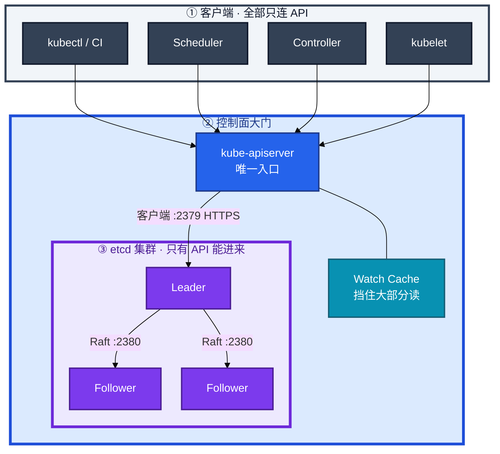
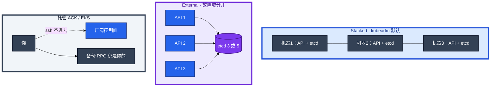
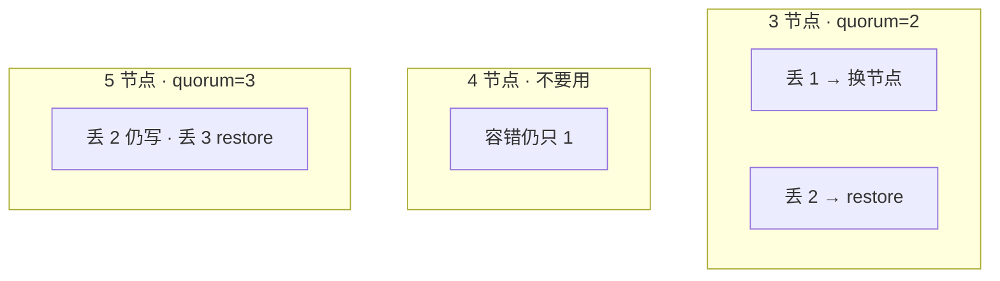
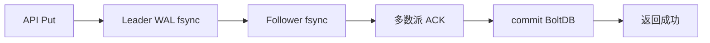
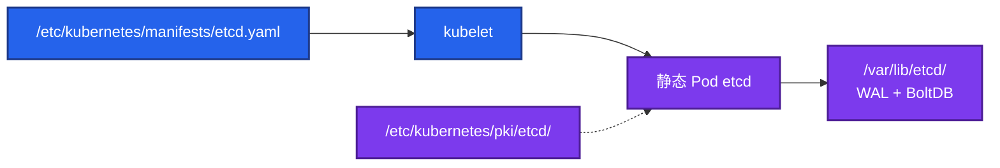
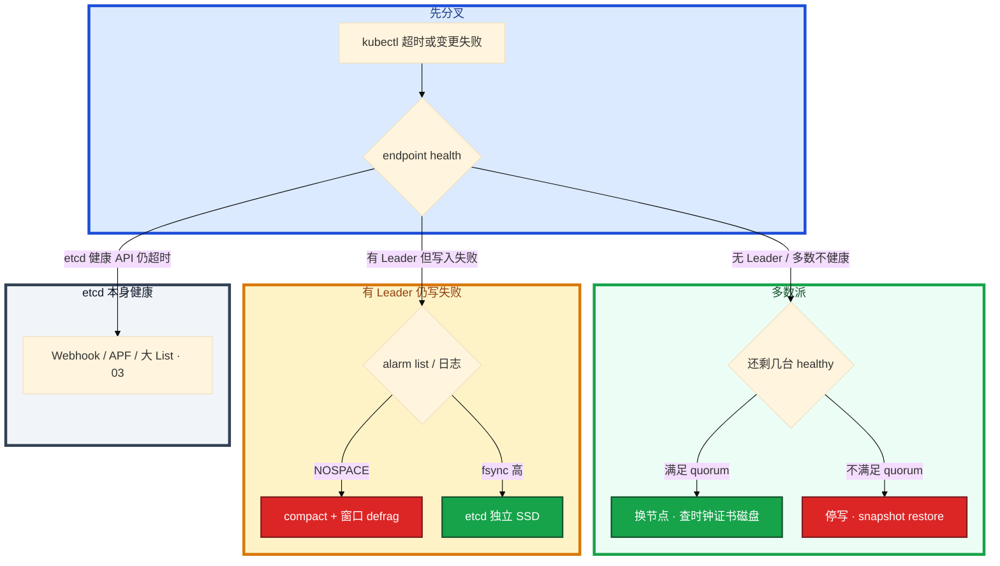

# etcd


活动高峰，`kubectl` 全部超时。API CPU 并不忙。群里有人已经在重启战斗服，另有人要格式化 etcd 数据盘——其实这一章只做一件事：**先判 etcd 还是 API，再选换节点还是 restore**。

**本章主线（排障就按这三步想）：**

1. **认角色**：业务只连 API；只有 API 连 2379；etcd 坏了 ≠ 逻辑服坏了。
2. **判 quorum**：多数派还在 → 换坏节点；多数派没了 → snapshot restore。
3. **留证再动**：`etcdctl endpoint health` + 备份 snapshot，禁止无备份 restore。

**读完你能：** 白板上画出谁连 2379；etcd 坏了能判断换节点还是 restore；会备份、滚动升级、失败回滚、换机器/换盘。

## 本章目录

- [1. 基本概念](#1-基本概念)
- [2. 架构图](#2-架构图)
- [3. 原理](#3-原理)
- [4. 安装部署](#4-安装部署)
- [5. 核心配置](#5-核心配置)
- [6. 命令与操作](#6-命令与操作)
- [7. 生产排障](#7-生产排障)
- [8. 必会 · 常考](#8-必会--常考)
- [合上书](#合上书问自己)

**本章不讲：** 认证准入、Watch Cache、APF → [03 API Server](../03-API-Server/)；控制面挂了的总影响面 → [01 集群架构](../01-集群架构/)。

---

## 1. 基本概念

etcd 是一个 **分布式、强一致的 KV**。用 Raft 做共识，用 MVCC（revision）做多版本，并提供 Watch。

在 Kubernetes 里，它不是 Redis，也不是消息队列。它是控制面的 **唯一状态库**。

**值班里怎么认现象**：

| 监控/工单说的 | 技术含义 | 第一刀 |
|---------------|----------|--------|
| `kubectl` 全面超时 | 可能是 etcd 写慢或没 Leader | `endpoint health --cluster` |
| API CPU 不高但变更失败 | 常是 etcd fsync 慢 | etcd 盘 iostat；WAL 日志 |
| 游戏服还在、不能扩缩 | etcd 不可用 ≠ 进程没了 | **不要重启战斗服** |
| `too old revision` | compact 后正常 | Informer 重新 List，不是 restore |
| `NOSPACE` | quota 满 | compact + 窗口 defrag |

| 在 etcd 里 | 不在 etcd 里 |
|------------|--------------|
| Pod / Deployment / Service / Node / Secret / CR | 容器进程、容器可写层 |
| spec、status、Event、Completed Job | 节点 iptables、已打上的长连接 |
| 路径 `/registry/<resource>/<ns>/<name>` | 业务库、镜像、日志文件 |

三个角色不要混：

| 角色 | 干什么 |
|------|--------|
| **etcd** | 把写成功的那份对象存住，多副本一致 |
| **API Server** | 唯一入口：认证、鉴权、准入后读写 etcd |
| **其它组件** | Scheduler、Controller、kubelet、kubectl、CI，**全部只连 API** |

etcd 能力与 K8s 用法：

| etcd 能力 | Kubernetes 怎么用 |
|-----------|-------------------|
| 强一致 Put/Get | 每个对象持久化 |
| revision / compact | List-Watch 资源版本；过旧 `too old revision` |
| Watch | Informer、控制器增量通知（**经 API，不直连**） |
| 租约 Lease | 部分内部对象；业务不要把 etcd 当锁服务打满 |

**打个比方**：etcd 像游戏服的「账号数据库」——只有登录网关（API Server）能改；战斗进程（kubelet）不能直接连库改装备，否则 RBAC 和审计全 bypass。

> **记住**：业务、kubelet、Controller **禁止直连 etcd**。`etcdctl` 只做 health / member / snapshot，不要手改 `/registry`。Secret 进 etcd **默认明文 JSON**，静止加密在 API Server（12）。

---

## 2. 架构图

后面安装、命令、排障都对着这张图。



**读图三句话：**

1. **没有箭头从 kubelet / Controller / 业务指向 etcd**——2379 生产只放行 API。
2. **2380** 是成员 Raft；**2379** 是客户端口。写打 Leader。
3. Stacked / External / 托管三种形态，故障域不同——装的时候选，挂的时候别混。

三种生产形态：



Stacked：一台控制面挂 = API 和一个 etcd 成员一起掉。External：盘和证书要有人盯。托管：你看不见进程，停变更的仍是你的业务。

---

## 3. 原理

### 3.1 Raft：选主、复制、提交

**一句话：** 同一 term 多数派投票出 Leader，写必须多数派 fsync 才 commit。

**打个比方**：像三人写账本——只有拿到笔的人（Leader）能记新账，另两人抄完并签字（fsync ACK），两人签字账才算数（quorum=2）。

**现场走一遍**（怀疑丢 Leader，先别重启全部 etcd）：

1. SSH 到任意控制面节点，设证书变量：

```bash
export ETCDCTL_API=3
export ETCDCTL_ENDPOINTS=https://127.0.0.1:2379
export ETCDCTL_CACERT=/etc/kubernetes/pki/etcd/ca.crt
export ETCDCTL_CERT=/etc/kubernetes/pki/etcd/server.crt
export ETCDCTL_KEY=/etc/kubernetes/pki/etcd/server.key
```

2. 查集群健康和 Leader：

```bash
etcdctl endpoint health --cluster
etcdctl endpoint status --cluster -w table
```

3. 屏幕 `status` 典型输出：

```text
+---------------------------+--------+---------+---------+-----------+------------+-----------+------------+--------------------+--------+
|         ENDPOINT          |   ID   | VERSION | DB SIZE | IS LEADER | IS LEARNER | RAFT TERM | RAFT INDEX | RAFT APPLIED INDEX | ERRORS |
+---------------------------+--------+---------+---------+-----------+------------+-----------+------------+--------------------+--------+
| https://10.0.1.11:2379    | 8e9... | 3.5.10  | 1.2 GB  | true      | false      |         7 |    892341  |             892341 |        |
| https://10.0.1.12:2379    | cf2... | 3.5.10  | 1.2 GB  | false     | false      |         7 |    892341  |             892341 |        |
| https://10.0.1.13:2379    | 1ab... | 3.5.10  | 1.2 GB  | false     | false      |         7 |    892341  |             892341 |        |
+---------------------------+--------+---------+---------+-----------+------------+-----------+------------+--------------------+--------+
```

4. **读数**：恰好 **一个** `IS LEADER=true`；三台 `RAFT TERM` 相同；`RAFT INDEX` 接近——集群健康。若两台 Leader 或全 false → 选举或网络问题，查 NTP、2380、磁盘。

5. 日志里 `lost leader` → 查 election-timeout、RTT、盘慢——**不要三台同时重启**。

**输出解读：**

| 列 | 正常 | 异常 |
|----|------|------|
| IS LEADER | 恰好 1 个 true | 0 或 2+ → 选举问题 |
| RAFT TERM | 成员一致 | 某台 term 落后很多 → 分区或挂过 |
| RAFT INDEX | 差距小 | 某台 INDEX 长期落后 → 盘/网 |
| ERRORS | 空 | 证书、连接失败 |

Raft 三阶段：选主 → 日志复制 → 多数派提交。`election-timeout` 必须大于心跳，且 **> 成员 RTT**（默认心跳 100ms、选举 1s）。控制面 etcd **不要跨地域**（02-19 NTP）。

**面试怎么说**：「写必须过 Leader，commit 要多数派 fsync。值班先看 endpoint status 有没有唯一 Leader 和 INDEX 是否对齐，丢 Leader 先查盘和网络，不要三台一起重启。」

> **记住**：最多一个 Leader。写打 Leader；Follower 收到写转给 Leader。

### 3.2 多数派：3 / 4 / 5 怎么选

**一句话：** quorum = floor(N/2)+1；3 丢 1 换节点，3 丢 2 restore。

**打个比方**：三人投票，至少两人同意才算数——4 个人也还是至少 3 人同意，容错没比 3 人多，所以 **4 节点是浪费**。

**现场走一遍**（3 节点集群一台盘坏了）：

1. health 可能显示：

```text
https://10.0.1.11:2379 is healthy: successfully committed proposal: took = 2.1ms
https://10.0.1.12:2379 is healthy: successfully committed proposal: took = 2.3ms
https://10.0.1.13:2379 is unhealthy: context deadline exceeded
```

2. **2/3 healthy** → quorum 还在（quorum=2）→ **换坏节点**，不要 restore。

3. 若只剩 1 台 healthy → **不能写** → 停 API，snapshot restore，不要对残存节点乱 `member add`。

4. 手算表：

| N | Quorum | 能同时挂 | 结论 |
|:--:|:------:|:--------:|------|
| 1 | 1 | 0 | 仅开发 |
| **3** | 2 | **1** | **生产最小** |
| 4 | 3 | 1 | 浪费 |
| **5** | 3 | **2** | 要抗 2 故障域才上 |

**输出解读：**



3 扩到 5 **写不会更快**——写仍过 Leader。5 只为多抗一台。

**面试怎么说**：「生产最小 3 节点 quorum 2，丢 1 换节点，丢 2 restore。4 节点比 3 没多容错。偶数没有收益。」

> **记住**：3 丢 1 换节点；3 丢 2 restore。不要对残存一台乱 member add。

### 3.3 一次写入：最贵的是 fsync

**一句话：** 每次 apply 都要 Leader + Follower WAL fsync，盘慢全集群卡写。

**打个比方**：像每笔转账都要三人各自锁保险柜（fsync）——柜门卡一个人，全队转账排队。

**现场走一遍**（API 不忙但 `kubectl` 全超时）：

1. 先看 API readyz 和 etcd health：

```bash
kubectl get --raw /readyz?verbose
etcdctl endpoint health --cluster
```

2. readyz 可能 `etcd failed` 或超时；health 仍 true 但慢。

3. 查 etcd 盘：

```bash
df -h /var/lib/etcd
iostat -x 1 3 /dev/nvme0n1
kubectl -n kube-system logs etcd-ctrl1 --tail=50 | grep -i "took too long\|wal"
```

4. 日志常见：

```text
{"level":"warn","msg":"apply request took too long","took":"892ms","expected-duration":"100ms"}
{"level":"warn","msg":"wal: sync duration","duration":"450ms"}
```

5. **892ms >> 25ms 红线** → 根因在 etcd 盘（和游戏日志同盘、云盘突发），不是给 API 加 CPU。

**输出解读：**



| 信号 | 阈值 | 含义 |
|------|------|------|
| WAL fsync P99 | **> 25ms** | 磁盘不合格 |
| `took too long` | 持续出现 | 同盘竞争或云盘限流 |
| API CPU 低 + 写超时 | — | 先 etcd 盘，不是 API |

读：Watch Cache 挡大部分 List/Watch。`too old revision` = compact 后正常，客户端重新 List（03），不是损坏。

**面试怎么说**：「一次写入最贵是 fsync。官方 WAL fsync P99 超 25ms 磁盘就不合格。API CPU 不高但 kubectl 超时，我先查 etcd 盘 iostat 和 took too long，不会先给 API 加核。」

> **记住**：fsync 是最贵一步。看起来像 API 挂，根因常在 etcd 盘。

### 3.4 compact / defrag / quota

**一句话：** compact 删旧 revision；defrag 才缩小文件；quota 满停写 NOSPACE。

**打个比方**：compact 像删旧版存档只留最新档；defrag 像整理硬盘碎片——文件逻辑小了，物理文件还可能很大，得 defrag 才瘦。

**现场走一遍**（告警 `mvcc: database space exceeded`）：

1. 查告警和体积：

```bash
etcdctl alarm list
etcdctl endpoint status --cluster -w table
du -sh /var/lib/etcd
```

2. 屏幕：

```text
memberID:8e9..., alarm:NOSPACE
DB SIZE: 2.1 GB   （接近 quota 2GB）
```

3. 先 **compact**（kubeadm 常见 auto-compaction 5m，手动时）再 **窗口逐台 defrag**——高峰 `--cluster defrag` 等于主动摘一台。

4. defrag 后 `alarm disarm`，不要只加 quota 不治理。

5. 回头查 Event 风暴、Completed Job 无 TTL、超大 CR。

**输出解读：**

| 操作 | 做什么 | 副作用 |
|------|--------|--------|
| **compact** | 删 compact revision 前历史 | 旧 Watch `too old revision` |
| **defrag** | 整理 BoltDB，**物理变小** | **阻塞该成员**，高峰逐台 |
| **quota** | 默认 **2GB**，大集群 **8GB** | 满 → NOSPACE 停写 |

只 compact 不 defrag，`du` 下不来。单次写入上限 `--max-request-bytes` **1.5MiB**。

etcd 不是水平扩展写存储——容量靠 **少写、快盘、按时 compact**，不是加节点。

**面试怎么说**：「NOSPACE 先 compact 再窗口 defrag，然后 alarm disarm。compact 后 du 不一定降，要 defrag。quota 默认 2GB，大集群 8GB，根治是少写 Event 和给 Job 加 TTL。」

> **记住**：compact ≠ defrag。quota 从 2GB 提到 8GB 是容量措施，根治是少写。

---

## 4. 安装部署

### 4.1 生产怎么选

| 项 | 选 | 不选 |
|----|----|------|
| 节点数 | 3 或 5 | 2、4、跨地域一套 |
| 磁盘 | 本地 NVMe/SSD，独立盘 | 机械盘、和游戏日志/容器盘混用 |
| 网络 | 同城多 AZ，RTT ≪ election-timeout | 跨 region |
| 形态 | kubeadm 静态 Pod，或托管 | 业务 Worker 上跑 etcd |
| 证书 | 独立 CA，peer/client 分开，双向认证 | 2379 对整个 VPC 裸奔 |

托管（ACK / EKS）：上线前问清备份 RPO、谁 restore、升级是否滚动 etcd、磁盘是否独立。

### 4.2 kubeadm 落地你实际看到什么

etcd 是 **静态 Pod**，kubelet 盯 manifests 目录。



| 路径 | 内容 |
|------|------|
| `/etc/kubernetes/manifests/etcd.yaml` | kubelet 保证这个 Pod 在 |
| `/etc/kubernetes/pki/etcd/` | CA、server、peer、healthcheck |
| `/var/lib/etcd/` | **这就是数据** |
| `127.0.0.1:2379` | 本机 API 常用 localhost 连本机 etcd |

| 端口 | 谁连 |
|------|------|
| **2379** | 仅 API Server，HTTPS + 客户端证书 |
| **2380** | 仅 etcd 成员互访 |

清单里必须有的监听与认证（示意）：

```yaml
- --advertise-client-urls=https://10.0.1.11:2379
- --listen-client-urls=https://127.0.0.1:2379,https://10.0.1.11:2379
- --listen-peer-urls=https://10.0.1.11:2380
- --initial-cluster=ctrl1=https://10.0.1.11:2380,ctrl2=https://10.0.1.12:2380,ctrl3=https://10.0.1.13:2380
- --data-dir=/var/lib/etcd
- --client-cert-auth=true
- --peer-client-cert-auth=true
```

验收：进程在不算数。必须 `etcdctl endpoint health --cluster` 全 healthy，且 `kubectl get --raw /readyz` 通过。不要只探 TCP 2379。

Kubernetes RBAC **管不到** etcd。证书合法就能读写 `/registry`。2379 只放行 API 网段，2380 只放行成员。

证书：peer 过期 = 成员拆伙；client 过期 = API 连不上 etcd。`kubeadm certs check-expiration`，剩余 **< 14 天** 当 P1。续 pem 后必须重启静态 Pod。

独立 systemd 部署：要求和上面相同，3/5、2379/2380、HTTPS 双向认证、独立数据盘。

---

## 5. 核心配置

只动有证据的项。改 `etcd.yaml` 后等 kubelet 重建静态 Pod。`election-timeout` 三台必须一致。

| 参数 | 默认 | 生产怎么用 | 改错会怎样 |
|------|------|------------|------------|
| `--heartbeat-interval` | 100ms | 同城保持默认 | 过大检测慢；过小心跳打满网 |
| `--election-timeout` | 1000ms | 心跳 5～10 倍，**> RTT** | 过小频繁丢 Leader |
| `--snapshot-count` | 10000 | 默认即可 | 过小频繁快照；过大恢复重放长 |
| `--auto-compaction-retention` | kubeadm `5m` | **必须开** | 关闭 db 只涨 |
| `--quota-backend-bytes` | 2GiB | 大集群 **8GiB** | 只加不治理会再满 |
| `--max-request-bytes` | 1.5MiB | 一般不动 | 盲目加大灌肥库 |
| `--enable-v2` | 3.4+ 关 | 保持关闭 | 打开无收益 |

> **记住**：`election-timeout` 覆盖 **同城 RTT**，不是扛跨地域。quota 提到 8GB 是容量措施，根治少写 Event、Job 加 TTL。

---

## 6. 命令与操作

### 6.1 命令速查

证书写成变量，避免每条重复路径。

```bash
export ETCDCTL_API=3
export ETCDCTL_ENDPOINTS=https://127.0.0.1:2379
export ETCDCTL_CACERT=/etc/kubernetes/pki/etcd/ca.crt
export ETCDCTL_CERT=/etc/kubernetes/pki/etcd/server.crt
export ETCDCTL_KEY=/etc/kubernetes/pki/etcd/server.key
```

| 目的 | 命令 | 看什么 |
|------|------|--------|
| 集群健康 | `etcdctl endpoint health --cluster` | 每成员 healthy，不要只有本机 true |
| 成员与 Leader | `etcdctl endpoint status --cluster -w table` | IS LEADER、DB SIZE、RAFT INDEX |
| 成员列表 | `etcdctl member list -w table` | ID、peer URL |
| 告警 | `etcdctl alarm list` | `NOSPACE` = quota 满 |
| 打快照 | `etcdctl snapshot save /backup/etcd-$(date +%Y%m%d-%H%M).db` | 成功且非空 |
| 检查快照 | `etcdctl snapshot status <file> -w table` | hash、revision |
| 压缩 | `etcdctl compact <revision>` | 通常交给 auto-compaction |
| 整理碎片 | `etcdctl defrag`（单成员） | **窗口逐节点** |
| 只读探活 | `etcdctl get / --prefix --keys-only --limit=1` | API 已死时确认 etcd 还能答 |

值班先跑这四条：

```bash
etcdctl endpoint health --cluster
etcdctl endpoint status --cluster -w table
etcdctl member list -w table
etcdctl alarm list
```

`get /registry/...` 只在 API 不可用、且只读确认时用。`etcdctl put` 改 `/registry` 等于事故。

指标（Prometheus）：

| 指标 | 阈值 | 级别 |
|------|------|------|
| `etcd_server_has_leader` | `== 0` | **P0** |
| WAL fsync P99 | **> 25ms** | P0/P1 |
| DB SIZE / quota | **> 0.8** | P1；1.0 = NOSPACE |
| 证书剩余天数 | **< 14 天** | P1 |

日志：`took too long` / `wal: sync duration` = 盘；`database space exceeded` = quota；`lost leader` = 选举或网络。

---

### 6.2 备份

至少每 **6 小时**；发版、扩容控制面、合服前加打一份。异地 **7～30 天**。本机 cron 不算备份。

```bash
etcdctl snapshot save /backup/etcd-$(date +%Y%m%d-%H%M).db
etcdctl snapshot status /backup/etcd-xxx.db -w table
```

**季度做一次 restore 演练**，记下 RTO。没有演练 = 没有备份。

### 6.3 多数派还在：换坏节点

3 丢 1、5 丢 1 或 2（仍满足 quorum）。**不要 restore。**


1. `endpoint health --cluster` 确认还有 Leader。
2. `member list` 记下坏节点 ID，`member remove <id>`。
3. 新机器配好数据盘、证书、peer URL。
4. `member add <name> --peer-urls=https://<new-ip>:2380`。
5. 用返回的 `initial-cluster` 启动，`--initial-cluster-state=existing`。
6. health 三（或五）台都 true。

restore 会生成 **新成员身份**。多数派还在时 restore，容易组不成群。

### 6.4 多数派没了：snapshot restore

3 丢 2、5 丢 3，或数据目录整体损坏。停写窗口，广播「控制面不能变更」。


```bash
etcdctl snapshot restore /backup/etcd-xxx.db \
  --name=ctrl1 \
  --initial-cluster=ctrl1=https://10.0.1.11:2380,ctrl2=https://10.0.1.12:2380,ctrl3=https://10.0.1.13:2380 \
  --initial-cluster-token=etcd-restore-$(date +%Y%m%d) \
  --initial-advertise-peer-urls=https://10.0.1.11:2380 \
  --data-dir=/var/lib/etcd
```

卡住：health 通 API 仍超时 → `--etcd-servers` 和客户端证书。组不成群 → 先对 token / peer URL，不要反复 `member add`。

### 6.5 NOSPACE：compact + 窗口 defrag

先把体积压下去再 `alarm disarm`，不要只加 quota。维护窗口 **逐台** `defrag`，追上 Leader 再做下一台。回头查 Event、Completed Job、大 CR。

### 6.6 证书轮转

`kubeadm certs renew` 后重启 control plane 静态 Pod。只改 pem 不重启，进程还拿着旧证。

### 6.7 升级

先对 Kubernetes 支持的 etcd 版本，不能凭「最新 etcd」硬上。

1. **先 snapshot**，异地留一份。
2. **滚动**：先升 Follower；Leader 放到最后（或先 `move-leader`）。始终保 quorum。
3. 不要三台同时换镜像；不要跳大版本。
4. 数据目录升级后默认 **不能靠换回二进制降级**，回退靠快照 restore。

kubeadm：`kubeadm upgrade apply` 会带 etcd，不要在它之外抢改静态 Pod 镜像。

### 6.8 回滚

数据目录升级后，默认 **不能靠换回旧二进制降级**。回退 = 用升级前的快照做 restore。

1. 停全部 API Server 和 etcd。
2. 用升级前那一份快照，按 6.4：同一份文件 + 同一个新 token。
3. 先 etcd health，再拉 API。

没有升级前快照 = 没有回滚。

### 6.9 迁移

- **换机器** = 6.3 换节点（member remove / add）。
- **只换盘：** 先 snapshot → 停该成员 → 拷 `/var/lib/etcd` → 拉起。
- **只改 IP：** `member update`，yaml 里 advertise/listen 一起改。

Stacked 改 External 是项目，活动中不要做。

---

## 7. 生产排障

和 01 同一套三问：进程还在不在？还能不能变更？已有流量还通不通？

**etcd 不可用 = 不能变更，不是立刻踢玩家。** 已运行容器、已有 iptables、已有 conntrack 通常还在。



现场顺序：

```bash
kubectl get --raw /readyz?verbose
etcdctl endpoint health --cluster
etcdctl endpoint status --cluster -w table
etcdctl alarm list
df -h /var/lib/etcd && iostat -x 1
kubectl -n kube-system logs etcd-<node> --tail=200
```

| 现象 | 先做什么 | 不要做什么 |
|------|----------|------------|
| `has_leader==0` | health/status；磁盘、NTP、证书 | 重启全部业务 Pod |
| `NOSPACE` | compact + 窗口 defrag；清 Event/Job | 格式化数据盘 |
| API 慢，仍有 Leader | etcd 盘 fsync；再查 Webhook | 先给 API 加核 |
| 单节点 unhealthy，另外两台 true | member 替换 | restore |
| 只剩一台 healthy | 停写，restore | 对残存节点 `member add` |
| `too old revision` | Informer 重新 List | 当数据丢失去 restore |
| 升级后一台 INDEX 落后 | 该节点盘和网；必要时摘掉重加 | 三台一起回滚二进制 |

活动高峰 etcd 和日志同盘，fsync 打到几百毫秒。正确处理：确认进程还在 → 停止发版和重启战斗服 → 救盘 / quorum / quota → 恢复后先 `get nodes`，再补自愈。

---

## 8. 必会 · 常考

| 说法 | 对错 | 口径 |
|------|:----:|------|
| kubelet 可以直连 etcd 拉 Pod spec | 错 | 只连 API Server |
| etcd 挂了，游戏服进程立刻没了 | 错 | 进程还在；不能变更 |
| 4 台比 3 台更能抗 2 台故障 | 错 | 4 台容错仍是 1 |
| 控制面 etcd 可以跨两个 region | 错 | RTT 拖垮选举 |
| 3 丢 1 应该马上 snapshot restore | 错 | 换节点 |
| WAL fsync 慢先给 API 加 CPU | 错 | 先换/独立 etcd 盘 |
| 3 扩到 5，写入会变快 | 错 | 写仍过 Leader |
| compact 之后 `du` 一定下降 | 错 | 物理文件要 defrag |
| `too old revision` 表示损坏 | 错 | compact 后正常，重新 List |
| Secret 进 etcd 默认加密 | 错 | 静止加密在 API Server |
| 托管不用关心备份 | 错 | 停变更的是你的业务 |
| 三台一起换镜像缩短窗口 | 错 | 必须滚动，保 quorum |

数字：quorum 3→2、5→3；fsync P99 **25ms**；quota 默认 **2GB** / 大集群 **8GB**；心跳 100ms、选举 1s；备份 6h + 异地 7～30 天；证书告警 **14 天**；auto-compaction 常见 **5m**；`--max-request-bytes` **1.5MiB**。

易混：无 Leader vs NOSPACE（后者可能仍有 Leader）；compact vs defrag；member 替换 vs restore；Watch Cache 慢 vs etcd 写慢；扩成员 vs 扩容量；etcd TLS vs K8s 静止加密。

---

## 合上书，问自己

1. 谁唯一碰 etcd？对象在哪条路径下？
2. 生产 3 还是 5？Stacked 和 External 故障域差在哪？
3. 一次写入哪一步最贵？25ms 红线是什么？
4. 值班四条 `etcdctl` 是哪四条？`NOSPACE` 看哪条命令？
5. 3 丢 1 和 3 丢 2 分别做什么？备份怎样才算有？
6. etcd 挂了该不该重启逻辑服？证书 peer / client 过期各是什么表现？

六题都能口述，这一章就过了。下一章把 API Server 剖开：认证准入、Watch Cache、Webhook 怎样把这条写路径焊死。
