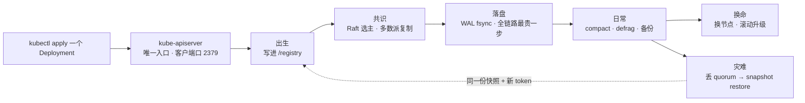
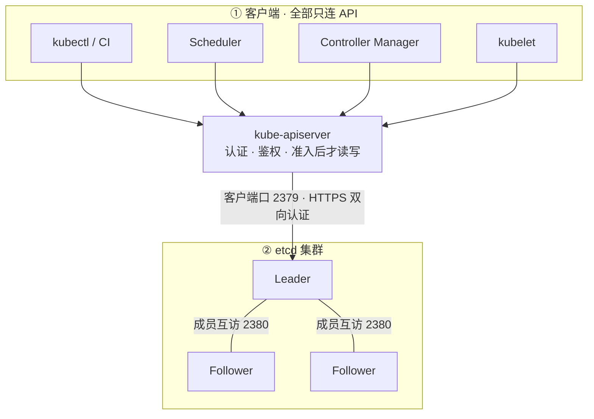
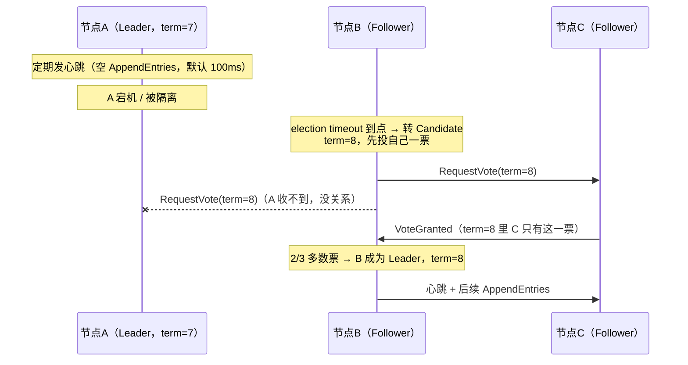
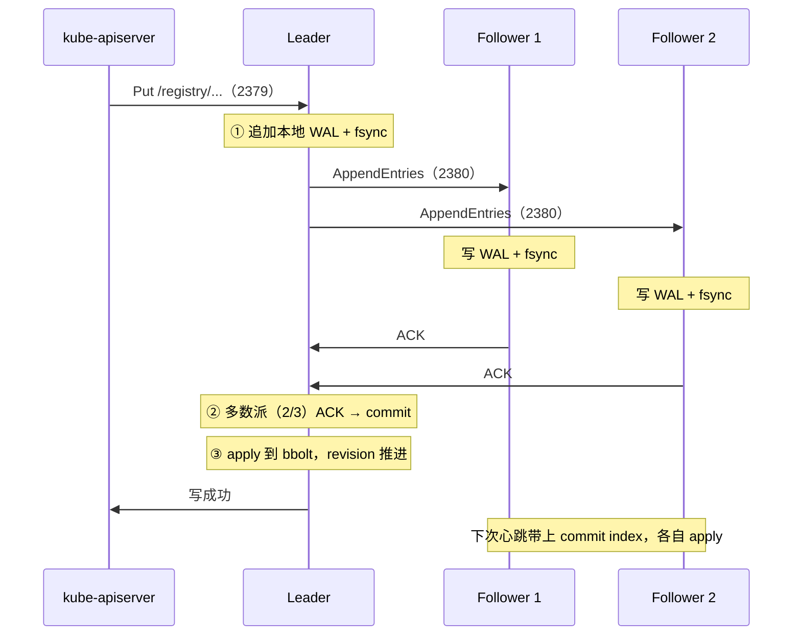
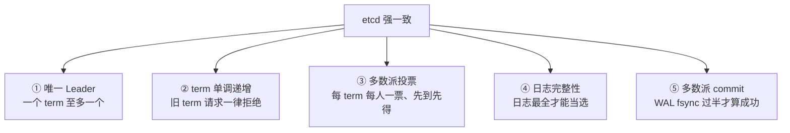
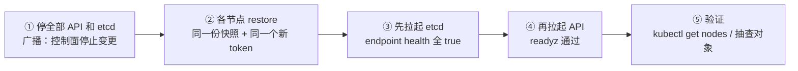
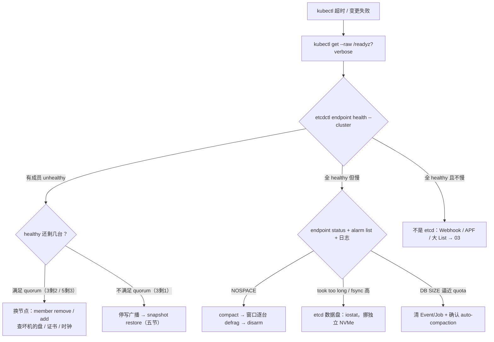

# etcd

> 活动高峰 `kubectl` 全面超时：API CPU 不忙，群里已有人重启战斗服，另一个要「格式化 etcd 数据盘」。
> **本章回答**：一份集群状态从写入到灾难恢复的一生——Raft 共识、fsync 落盘、备份 restore、换节点，以及卡在哪一段怎么定责。
> **不讲**：认证准入、Watch Cache、APF → [03](../03-API-Server/)；控制面组件挂了的总影响面 → [01](../01-集群架构/)；证书体系 → [14](../14-证书与kubeconfig/)；Secret 静止加密 → [12](../12-配置与密钥/)。

**标记**：🎯重点 · 🔥难点 · ⭐常考 · 🔧实操

---

## 一、一张图：一份状态数据的一生

> 🎯 **一句话**：每个对象都要过「出生 → 共识 → 落盘 → 日常 → 换命 / 灾难」，定责先问卡在哪一段。



- 📖 **读图**
  - 🛤️ 主线：挤过 API → Leader 用 Raft 复制到多数派 → fsync 落盘才 commit
  - 🔀 「日常」后分叉：多数派还在 → 换节点；多数派没了 → restore。排查先问卡在哪段：共识看 Leader，落盘看 fsync，日常看 alarm

本节对应练习题 Q1。

---

## 二、出生：唯一入口与它的家

> 🎯 **一句话**：只有 API Server 读写 etcd；kubelet、控制器、业务全部只连 API。

etcd 是**分布式、强一致的 KV 存储**：共识靠 **Raft（选一个 Leader 协调写入，多数派同意才提交）**，多版本靠 MVCC，另提供 Watch 与 Lease。在 Kubernetes 里它是控制面的**唯一状态库**——不是 Redis，也不是消息队列。

> 💡 **打个比方**：etcd 像游戏服「账号库」——只有登录网关（API Server）能改；战斗进程（kubelet）直连库改装备，RBAC 和审计全被绕过。

### 📮 分工：谁连 2379 ⭐



- 📖 **读图**
  - 🚫 关键在**没有的箭头**：kubelet / Controller / 业务都不直连 etcd
  - 🔌 **2379** 客户端口（生产只放行 API 网段）；**2380** 成员口（Raft 心跳与日志复制，只放行成员）。业务连 2379 也算直连

#### ❓ 为什么组件不能直连 etcd？

- 🛡️ 直连 = 绕过认证、鉴权、准入、审计——RBAC **管不到** etcd，证书合法就能读写 `/registry`
- ✅ 访问控制靠网络层：2379 只放行 API 网段，2380 只放行成员
- 🔍 值班动 etcd 只有四类：health / status / member / snapshot（外加 alarm）。`etcdctl get /registry/...` 仅 API 已死时只读确认；`etcdctl put` 手改 `/registry` = 事故

- 📂 **对象路径**：`/registry/{resource}/{namespace}/{name}`——Pod、Deployment、Service、Node、Secret、CR 的 spec/status，以及 Event、Completed Job **都在**
- ❌ **不在**的：容器进程、容器可写层、节点 iptables、已建立长连接、业务库、镜像
- 🧩 **能力怎么用**：强一致 Put/Get 持久化对象；**revision（全局递增版本号）** = K8s `resourceVersion`，List-Watch 靠它对齐；Watch 经 API 变 Informer 增量（控制器不直连 Watch）；**Lease（带有效期的活 KV）** 承载节点心跳（kube-node-lease），别把 etcd 当锁服务打满

> ⚠️ **别混**：Secret 进 etcd **默认明文 JSON**——保护它的是 2379 的 TLS 和网络隔离；静止加密是 API Server 的 EncryptionConfiguration。「etcd 走了 HTTPS 所以 Secret 安全」= 把传输加密和存储加密混为一谈 → [12](../12-配置与密钥/)。

### 🏠 家：静态 Pod、三个路径、验收 🔧

kubeadm 下 etcd 是**静态 Pod（kubelet 盯 manifests 直接拉起，不经调度器）**：

```text
/etc/kubernetes/manifests/etcd.yaml   ← kubelet 保证这个 Pod 在；改参数 = 自动重建
/etc/kubernetes/pki/etcd/             ← CA、server、peer、healthcheck 证书
/var/lib/etcd/                        ← 数据：WAL + bbolt；备份备的就是它
```

- 🏗️ **三种生产形态**（装时选，挂时别混）
  - **Stacked**（kubeadm 默认）：每台控制面 = API + 一个 etcd 成员；一台挂 = 两个一起掉。3 台 Stacked + LB = 生产最小 HA
  - **External**：API 一组、etcd 一组，故障域干净
  - **托管**（ACK / EKS）：ssh 不进控制面；上线前问清备份 RPO、谁 restore、升级是否滚动 etcd、磁盘是否独立——停变更停的是你的业务

- 📐 **选型五项**：节点 **3 或 5**（三节）；本地 NVMe/SSD **独立盘**（不机械盘、不和游戏日志/容器混用）；同城多 AZ、RTT ≪ election-timeout，**不跨地域**；静态 Pod 或托管，**不在业务 Worker 上顺手跑**；证书独立 CA、peer/client 分开、双向认证，**2379 不对整个 VPC 裸奔**

```yaml
- --advertise-client-urls=https://10.0.1.11:2379
- --listen-client-urls=https://127.0.0.1:2379,https://10.0.1.11:2379   # ← Stacked 的 API 走 127.0.0.1
- --listen-peer-urls=https://10.0.1.11:2380
- --initial-cluster=ctrl1=https://10.0.1.11:2380,ctrl2=https://10.0.1.12:2380,ctrl3=https://10.0.1.13:2380
- --data-dir=/var/lib/etcd
- --client-cert-auth=true        # ← 2379 双向认证
- --peer-client-cert-auth=true   # ← 2380 双向认证
```

External 形态每个 API 的 `--etcd-servers` 写满 3 个地址。验收不是「进程起来了」：

```bash
etcdctl endpoint health --cluster   # ← 每个成员都 healthy，不是只有本机 true
kubectl get --raw /readyz           # ← API 自检包含 etcd 链路
# 只探 TCP 2379 不算验收：端口活着 ≠ 能提交写入
```

本节对应练习题 Q1、Q12。

---

## 三、共识：Raft 选主与日志复制

> 🎯 **一句话**：同一 term 多数派投票出 Leader，写要多数派 fsync 才 commit——所以最多一个 Leader，不会脑裂。

### 🗳️ 选举：term、投票、超时 🔥⭐

**term（任期号）** = Raft 全局单调递增的轮次；每发起选举开新 term，带着旧 term 的请求一律拒绝。选举由超时触发：



- 📖 **读图**
  - 🎲 选举超时**带随机抖动** → 不会同一时刻集体参选互相分票
  - ☝️ **同一 term 每人一票、先到先得**；票数过半（3 节点要 2）——A 失联不妨碍 B、C 选主
  - 📜 **只有日志最全的节点才能当选**（对比候选人最后一条日志的 term/index）→ 同一 term 至多一个 Leader

> 💡 **打个比方**：三人记账小组选「执笔人」——笔（term）要多数票才能换手；一人被锁在会议室（隔离）不影响另外两人换笔；他出来发现自己手里的笔编号小了，乖乖当 Follower。

#### ❓ 为什么 2+1 分裂不会双 Leader？

- ❌ **不会出现双主双写**：少数派凑不出多数票 → 选不出 Leader、也提交不了写；多数派照常工作
- ⚠️ **别混**：这和 MySQL 旧主还自认为在位的脑裂不同——Raft 分裂里**至多一边可写**
- 🚨 日志反复 `lost leader` → 查 election-timeout、成员 RTT、磁盘；**千万别三台一起重启**

### 📝 复制：一次写入的三步 🔥



- 📖 **读图**
  - ✍️ 写永远打 Leader；Follower 收到写请求会转给 Leader
  - ✅ 对客户端「成功」= **多数派已把这条日志写进 WAL**——此后 Leader 立刻挂，新 Leader 日志也必然包含它（日志完整性规则）

- 🧱 **WAL（Write-Ahead Log）**：改状态前先追加落盘；**fsync** = 强制等磁盘真正写完再返回（不是扔进页缓存）
- 🗄️ **bbolt**：嵌入式 B+ 树状态机，commit 的日志最终 apply 到它——`/var/lib/etcd` 里的库文件就是它

```text
--heartbeat-interval=100ms   ← Leader 心跳；同城保持默认
--election-timeout=1000ms    ← 多久没心跳就参选；取心跳 5~10 倍，且必须 > 成员间 RTT
```

三台参数必须一致。election-timeout 过小 → 抖一下就重选；过大 → 宕机检测慢。按**同城 RTT** 设，不是拿来扛跨地域——跨地域选举抖动无解。

### 🧮 quorum：为什么必须奇数 ⭐🔥

**quorum（多数派）** = `floor(N/2) + 1`，提交和选举都要凑够这么多台。

#### ❓ 为什么 4 台反而亏？

```text
N=1   quorum=1   能同时挂 0 台   仅开发
N=3   quorum=2   能同时挂 1 台   生产最小
N=4   quorum=3   能同时挂 1 台   容错和 3 一样，纯浪费
N=5   quorum=3   能同时挂 2 台   要抗 2 个故障域才上
N=7   quorum=4   复制更重、写更慢，K8s 生产只用 3 或 5
```

- 💡 **比方**：三人投票至少两票——加到四人还是要三票，容错没多，反而多一张要复制的嘴
- 🔑 **两条推论**：**3 丢 1 → 换节点**（quorum 还在，六节）；**3 丢 2 → restore**（quorum 没了，五节）；3 扩到 5 **写不会更快**——写仍过 Leader，5 只是多抗一台

> 📝 **面试**：「为什么奇数」→ quorum = floor(N/2)+1，偶数容错和少一台相同（4 节点要 3 票，容错仍是 1）。追问「上 7 台？」→ commit 要 4 台 ACK，写更慢，复制更重。

### 🔧 现场：集群健康怎么看 🔧

> 🔍 **现场**：怀疑丢 Leader，先别重启——两条命令看完再说话。

```bash
export ETCDCTL_API=3
export ETCDCTL_ENDPOINTS=https://127.0.0.1:2379
export ETCDCTL_CACERT=/etc/kubernetes/pki/etcd/ca.crt
export ETCDCTL_CERT=/etc/kubernetes/pki/etcd/server.crt
export ETCDCTL_KEY=/etc/kubernetes/pki/etcd/server.key

etcdctl endpoint health --cluster
etcdctl endpoint status --cluster -w table
```

```text
+------------------------+--------+---------+---------+-----------+------------+-----------+------------+--------------------+--------+
|        ENDPOINT        |   ID   | VERSION | DB SIZE | IS LEADER | IS LEARNER | RAFT TERM | RAFT INDEX | RAFT APPLIED INDEX | ERRORS |
+------------------------+--------+---------+---------+-----------+------------+-----------+------------+--------------------+--------+
| https://10.0.1.11:2379 | 8e9... | 3.5.10  | 1.2 GB  | true      | false      |         7 |    892341  |             892341 |        |
| https://10.0.1.12:2379 | cf2... | 3.5.10  | 1.2 GB  | false     | false      |         7 |    892341  |             892341 |        |
| https://10.0.1.13:2379 | 1ab... | 3.5.10  | 1.2 GB  | false     | false      |         7 |    892341  |             892341 |        |
+------------------------+--------+---------+---------+-----------+------------+-----------+------------+--------------------+--------+
IS LEADER          ← 恰好一个 true；0 个 = 没选出主，查盘 / NTP / 证书 / 2380
RAFT TERM          ← 三台一致；某台落后很多 = 被分区过或刚恢复
RAFT INDEX         ← 日志进度，差距小才健康
RAFT APPLIED INDEX ← 已 apply 进度，与 INDEX 差太多 = apply 慢
DB SIZE            ← 逼近 quota（默认 2GiB）→ compact/defrag（四节）
IS LEARNER         ← 学习者（六节）为 true，不占 quorum
ERRORS             ← 非空先看它
```

加上 `etcdctl member list -w table` 和 `etcdctl alarm list`，这四条是**值班先跑的四条**。判读：恰好一个 `IS LEADER=true`、三台 term 一致、INDEX 接近 = 健康。

### 收束：etcd 凭什么「强一致」 🎯⭐



- 📖 **读图**
  - ①②③ 保证「谁说了算」；④ 保证「算数的人手里数据最全」；⑤ 保证「说过的话收不回」
  - 多数派已 fsync 的写入，换 Leader 也不会丢

> ⚠️ **别混**：强一致 **≠ 高可用**——quorum 一丢立刻停写（宁可停服，也不给错数据）；也 **≠ 无限容量**（四节）。

> 📝 **面试**：五件套按「谁能写（①③）→ 写什么（④）→ 写了不能赖（②⑤）」分组记，补一句「2+1 分裂不会脑裂：少数派永远选不出 Leader」。

本节对应练习题 Q3、Q4、Q6。

---

## 四、落盘：WAL、fsync 与容量

> 🎯 **一句话**：每次写都要 Leader + Follower 各自 WAL fsync，盘慢全集群卡写；容量靠 compact、defrag、quota 三道关。

### 💾 最贵一步是 fsync 🔥⭐

一次写要 **Leader 本地 WAL fsync + 多数派 Follower 各自 fsync**——任何一块盘卡，全集群写排队。

> 💡 **打个比方**：每笔转账要三个人各自锁自己的保险柜（fsync）——一个人的柜门卡住，全队转账排队。

#### ❓ 为什么 API CPU 不忙却写超时，不能给 API 加核？

- 🔥 红线：**WAL fsync P99 > 25ms，磁盘不合格**（生产必须本地 NVMe/SSD 独立盘）
- ❌ 「写慢 = API CPU 不够」是高频错答——矛头在 etcd 盘，不在 API 核
- 🎮 游戏侧最常见：etcd 和游戏日志/容器同盘，高峰 IO 被抢；其次云盘突发限流 → 治法是挪独立 NVMe

> 🔍 **现场**：API CPU 不忙但 `kubectl` 全超时——先别给 API 加核，先看 etcd 的盘。

```bash
kubectl get --raw /readyz?verbose          # ← etcd 项 failed 或超时
df -h /var/lib/etcd
iostat -x 1 3 /dev/nvme0n1                 # ← await / %util 高 = 盘卡
kubectl -n kube-system logs etcd-ctrl1 --tail=50 | grep -iE "took too long|wal"
```

```text
{"level":"warn","msg":"apply request took too long","took":"892ms","expected-duration":"100ms"}
# ← apply 892ms，超 25ms 红线三十多倍
{"level":"warn","msg":"wal: sync duration","duration":"450ms"}
# ← WAL fsync 450ms，盘在拖全集群
```

- 📖 **读路径另说**：大部分 List/Watch 被 API 的 Watch Cache 挡掉；etcd 默认是**线性一致读（经 Leader 保证最新）**，`serializable` 可读本地 Follower（快但可能旧），控制面不靠这条分担。很多「读慢」其实夹着 Event、status 的写。

### 📚 MVCC 与 revision：Watch 为什么能用

etcd 用 **MVCC（多版本并发控制）**：每次修改追加新版本，**revision** 随事务推进。K8s 的 `resourceVersion` 就是 revision——List 拿「哪个版本的快照」，Watch 从某版本订阅增量。

| 对比 | **compact** | **defrag** |
|------|-------------|------------|
| 做什么 | 删指定 revision 之前的历史版本 | 整理 bbolt，**物理回收空间** |
| 效果 | 文件**不缩小**，`du` 不降 | 该成员文件真正变小 |
| 副作用 | 旧 revision 的 Watch 报 `too old revision` | **阻塞该成员**，窗口逐台做 |
| 顺序 | 先 | 后 |

#### ❓ compact 之后为什么 du 不降？

- 🧹 compact 只删**逻辑上**的旧版本，bbolt 文件原样大——必须 **defrag** 才瘦
- ⚠️ **`too old revision` 不是数据损坏**：Informer 的 Watch 起点已被 compact，客户端会自动重新 List 追上，别看见就想 restore
- ⚠️ **两个 snapshot 别混**：`--snapshot-count`（默认 10000，3.4+ 默认 100000）是 **Raft 内部快照**（截断 WAL、方便慢 Follower 追赶）；`etcdctl snapshot save` 是**集群级备份文件**（五节）

### 🚨 NOSPACE：quota 三道关 ⭐🔧

`--quota-backend-bytes` 默认 **2GiB**（大集群建议 **8GiB**），超了触发 **NOSPACE**，**写入被拒（读仍可用）**。处理顺序固定：

```bash
etcdctl alarm list
# memberID:8e9... alarm:NOSPACE        # ← quota 满，写已停
etcdctl compact {revision}             # ← 通常 auto-compaction 在跑，手动补一刀
etcdctl defrag                         # ← 窗口内逐台；高峰 --cluster 一把 = 主动摘节点
etcdctl alarm disarm                   # ← 体积下来之后才能解除
```

然后查体积根因：**Event 风暴**、**Completed Job 没设 TTL**、**超大 CR**。紧急可先把 quota 提到 8GB 止血，只加不治理会再满。

- `--max-request-bytes`（默认 **1.5MiB**）是单次写入上限
- `--auto-compaction-retention`（常见 5m）**必须开**，关了 db 只涨不缩
- etcd **不是水平扩展的写存储**——容量靠少写、快盘、按时 compact；内存按工作集约 **2 倍**预留

本节对应练习题 Q5、Q7。

---

## 五、保险：备份与 restore

> 🎯 **一句话**：备份 = 异地快照 + restore 演练；quorum 没了才 restore，没备份就没得 restore。

### 💾 怎样才算有备份 🔧

```bash
etcdctl snapshot save /backup/etcd-$(date +%Y%m%d-%H%M).db
# {"level":"info","msg":"Snapshot saved at /backup/etcd-20260901-0300.db"}
etcdctl snapshot status /backup/etcd-20260901-0300.db -w table
```

```text
+----------+----------+------------+------------+
|   HASH   | REVISION | TOTAL KEYS | TOTAL SIZE |
+----------+----------+------------+------------+
| 2a1c...  |   892341 |      18432 |     1.2 GB |
+----------+----------+------------+------------+
# ← REVISION 是快照那一刻的版本号；文件非空、读得出这张表，才算保存成功
```

- 📋 **四条纪律**
  - 至少每 **6 小时**一份；发版 / 扩控制面 / 合服前加打一份
  - **异地**保留 7~30 天——本机 cron 不算备份（机器死了产物跟着死）
  - 每季度做一次 restore 演练并记下 RTO——**没有演练 = 没有备份**
  - **RPO** ≈ 距上次成功快照的间隔（不是 0）；**RTO** 只有演练过才知道

### 🆘 什么时候 restore：quorum 没了 ⭐

#### ❓ 为什么 3 丢 1 不能拿昨天快照 restore？

- ❌ 多数派还活着时 restore = 丢掉还在呼吸的日志另起炉灶，往往组不成群
- ✅ **3 丢 2 / 5 丢 3 / 数据目录整体损坏** 才轮到 restore；quorum 还在 → 换节点（六节）

> 💡 **打个比方**：三人记账还有两人在记账，你却翻出上月旧账本叫两个新人另组一队——活着那两位的账往哪放？正解是换个新搭档进来。



- 📖 **读图**
  - 🔑 两个「同一」是命门：**同一份快照 + 同一个新 `--initial-cluster-token`**（必须新 token，防旧成员串进来）
  - 📂 各节点各自 `--name` / `--data-dir`（建议新目录，验证通过前别覆盖旧数据）；顺序：先停写 → etcd 先起 → API 后起

```bash
etcdctl snapshot restore /backup/etcd-xxx.db \
  --name=ctrl1 \
  --initial-cluster=ctrl1=https://10.0.1.11:2380,ctrl2=https://10.0.1.12:2380,ctrl3=https://10.0.1.13:2380 \
  --initial-cluster-token=etcd-restore-20260901 \
  --initial-advertise-peer-urls=https://10.0.1.11:2380 \
  --data-dir=/var/lib/etcd-new
```

- 🩺 health 通了但 API 仍超时 → 查 API 的 `--etcd-servers` 和客户端证书
- 🧩 etcd 组不成群 → 先对 token 和 peer URL，**不要反复 `member add`**

> ⚠️ **别混**：**没有备份的 restore 不叫 restore**——只剩重建集群（重新 init、YAML 重刷）；「有 cron、没演练」和没备份一个待遇。口诀：**quorum 在 → 换节点；quorum 没了 → restore**。

本节对应练习题 Q8、Q9。

---

## 六、换命：成员变更与滚动升级

> 🎯 **一句话**：quorum 在就换节点，别 restore；升级滚动一台台，回滚靠升级前快照。

### 🔄 换坏节点：member remove / add 🔧⭐

3 丢 1、5 丢 1~2（quorum 仍满足）：

```bash
etcdctl member list -w table                 # ← 记下坏节点 ID
etcdctl member remove 1ab2c3                 # ← 集群变 2 成员；3 的 quorum=2 仍满足，动作别拖
# 新机器：挂独立盘、放好证书、配好 peer URL
etcdctl member add ctrl3-new --peer-urls=https://10.0.1.14:2380
# ← 输出新的 ETCD_INITIAL_CLUSTER，抄给新节点
# 新节点：--initial-cluster=<上面那份> --initial-cluster-state=existing
etcdctl endpoint health --cluster            # ← 全部 healthy 才算完
```

- 🆕 新节点必须 `--initial-cluster-state=existing`（加入现有集群，不是新建）
- 🎓 数据量大或跨 AZ：先以 **Learner（3.4+ 非投票成员）** 加入——不占 quorum、先后台追日志，追上再 `member promote`

| 对比 | **member 替换** | **snapshot restore** |
|------|-----------------|----------------------|
| 条件 | quorum 还在（3 丢 1 / 5 丢 1~2） | quorum 没了（3 丢 2 / 5 丢 3） |
| 身份 | 集群身份不变，换一个人 | 全员新身份（新 member ID / 新 token） |
| 数据 | 不丢（活着的成员有完整日志） | 回退到快照时刻（丢 RPO） |
| 业务 | 短暂抖动，无需停写 | 停写窗口，全员广播 |

- 🔀 **迁移三岔**：换机器 = remove/add；只换盘 = 先 snapshot → 停该成员 → 拷 `/var/lib/etcd` → 拉起；只改 IP = `etcdctl member update <id> --peer-urls=...`（yaml 里 advertise/listen 一起改）

#### ❓ 为什么加成员写不会更快？

- ❌ **成员变更 ≠ 扩容**——写仍过 Leader，加成员只多一个读端点和一份容错
- 🚫 「etcd 扛不住了加两台」是错方子——容量靠少写 / 快盘 / compact（四节）

### ⬆️ 滚动升级：Follower 先，Leader 后 ⭐

1. **先 snapshot**，异地留一份——回滚唯一出路
2. **滚动**：逐台升 Follower（停 → 换镜像 → 起 → health 且 INDEX 追上），**Leader 放最后**（或先 `etcdctl move-leader`）；全程保 quorum
3. 不要三台同时换镜像、不要跳大版本；先对 **Kubernetes 支持的 etcd 版本**
4. kubeadm 的 `kubeadm upgrade apply` 会带着 etcd 升，别在它之外抢改静态 Pod 镜像 → [17](../17-节点运行时与升级/)

- 🔙 **回滚只有一条路**：数据目录升级后**不能换回旧二进制**（新版格式旧版不认）= 用升级前快照按五节 restore。没有升级前快照 = 没有回滚
- 📜 **证书轮转一句**：`kubeadm certs check-expiration`，**< 14 天按 P1**；`renew` 后**必须重启控制面静态 Pod**。peer 证过期 = 成员拆伙；client 证过期 = API 连不上 etcd → [14](../14-证书与kubeconfig/)

本节对应练习题 Q10、Q11。

---

## 七、作战：定责

> 🎯 **一句话**：先问「etcd 挂了什么还活着」，再 health 看 quorum、alarm 看 quota、iostat 看盘。

### 📡 影响面：什么还在 ⭐

#### ❓ 为什么 etcd 挂了游戏服还在？

**etcd 不可用 = 不能变更，不是立刻踢玩家。** 和 [01](../01-集群架构/) 同一套三问——进程还在？还能变更？已有流量还通？答案：在、不能、通。

| 对比 | **通常还在** | **立刻停** |
|------|--------------|------------|
| 有什么 | 已运行容器进程、已有 iptables/conntrack、已建立长连接、业务库 | apply / 发版 / 合服 / 扩缩容、节点挂了之后的 Pod 重调度与自愈 |
| 为什么 | 规则和进程在节点内核与内存里，etcd 只存「期望状态」 | 所有写都要经 API 进 etcd |

所以**别去重启还活着的战斗服**——重启要从 API 拉 spec，拉不出来就是「不能变更」变「真的挂了」。

### 🌳 定责决策树



- 📖 **读图**
  - 🚪 入口永远是 `endpoint health --cluster`
  - 三个出口：不健康数 quorum（左）→ 健康但慢看 quota/盘（中）→ 健康且不慢别赖 etcd（右）。「有 Leader 的慢」≠「要 restore」

### 现象 · 先做 · 别做

| 现象 | 先做 | 别做 |
|------|------|------|
| `etcd_server_has_leader==0` / IS LEADER 全 false | health/status；查盘、NTP、证书、2380 | 三台一起重启；重启业务 Pod |
| NOSPACE | compact + 窗口逐台 defrag；清 Event/Job | 格式化数据盘；只 disarm 不治理 |
| API 慢、仍有 Leader | etcd 盘 fsync；再查 Webhook | 先给 API 加核 |
| 单台 unhealthy、另两台 true | member remove / add | restore |
| 只剩一台 healthy | 停写，snapshot restore | 对残存节点 member add |
| `too old revision` | Informer 自愈重新 List | 当数据丢失去 restore |
| 升级后一台 INDEX 落后 | 查这台盘和网，必要时摘掉重加 | 三台一起回滚二进制 |
| kubectl 超时但 etcd 全健康 | Webhook / APF / 大 List → [03](../03-API-Server/) | 当 etcd 坏去 restore |
| 活动高峰写超时 | 确认进程在 → 停发版停重启 → 救盘 / quorum / quota | 重启战斗服 |

告警线（→ [19](../19-监控与可观测性/)）：`etcd_server_has_leader == 0` 是 P0；WAL fsync P99 > 25ms 是 P0/P1；DB SIZE / quota > 0.8 是 P1；证书剩余 < 14 天是 P1。关键字：`took too long` / `wal: sync duration` = 盘；`database space exceeded` = quota；`lost leader` = 选举或网络。

### 60 秒剧本 🔧

> 🔍 **现场**：接到「kubectl 超时」告警，60 秒走完这条线再开口。

```text
① 0–10s   kubectl get --raw /readyz?verbose；etcdctl endpoint health --cluster
          → etcd 的事还是 API 的事，在这里分叉
② 10–30s  etcdctl endpoint status --cluster -w table；etcdctl alarm list
          → Leader 唯一吗 / INDEX 齐吗 / DB SIZE 满没满 / 有没有 NOSPACE
③ 30–45s  定型：不健康数 quorum（换节点 or restore）；慢看 iostat 和日志
④ 45–60s  按决策树动手并验证：换完 health 全 true；restore 先 etcd 后 API；
          fsync 高 → 挪独立盘并停变更。恢复后先 kubectl get nodes，再放控制器自愈
```

本节对应练习题 Q2、Q13、Q14。

---

## 八、收口

### 命令速查 🔧

```bash
# 证书环境变量见三节。值班四条：
etcdctl endpoint health --cluster
etcdctl endpoint status --cluster -w table
etcdctl member list -w table
etcdctl alarm list
# 备份与恢复：
etcdctl snapshot save /backup/etcd-$(date +%Y%m%d-%H%M).db
etcdctl snapshot status {file} -w table
etcdctl snapshot restore {file} --name=... --initial-cluster=... \
  --initial-cluster-token=<新token> --data-dir=<新目录>
# 容量治理：
etcdctl compact {revision}
etcdctl defrag
etcdctl alarm disarm
# 成员变更：
etcdctl member remove {id}
etcdctl member add {name} --peer-urls=...
etcdctl member update {id} --peer-urls=...
etcdctl move-leader {id}
# 只读探活（API 已死时）：
etcdctl get / --prefix --keys-only --limit=1
```

### 面试锚点

遮住右列自问自答，卡壳的行回去重读对应小节。

| 问 | 30 秒答 |
|----|---------|
| etcd 是什么？ | 分布式强一致 KV，控制面唯一状态库；只有 API Server 读写，其余禁止直连。 |
| 谁读写 etcd？ | 只有 API Server；直连绕过认证鉴权准入审计，2379 只放行 API 网段。 |
| Raft 怎么选主？ | Follower 选举超时 → Candidate，term+1 先投自己 → RequestVote，多数票当 Leader；每 term 一票先到先得，超时随机抖动。 |
| term 是什么？ | 全局单调递增的任期号；旧 term 请求被拒，保证一个 term 至多一个 Leader。 |
| 一次写怎么提交？ | 写打 Leader → 本地 WAL fsync → AppendEntries → 多数派 ACK → commit → apply 到 bbolt 才回成功。 |
| quorum 是什么？ | floor(N/2)+1；3→2、5→3；偶数没收益，4 节点容错仍是 1。 |
| 3 丢 1 / 3 丢 2？ | 丢 1 quorum 在，换节点；丢 2 quorum 没了，停写 snapshot restore。 |
| 2+1 分裂会双 Leader 吗？ | 不会；少数派凑不出多数票选不出主、写不了。 |
| 写入哪步最贵？ | WAL fsync；P99 > 25ms 盘不合格。API CPU 低但写超时，先查 etcd 盘。 |
| compact 和 defrag？ | compact 删历史版本不缩文件；defrag 物理回收但阻塞该成员，窗口逐台。 |
| NOSPACE 怎么处理？ | compact → 窗口逐台 defrag → alarm disarm，再查 Event/Job/大 CR；quota 默认 2GiB、大集群 8GiB。 |
| too old revision？ | Watch 起点被 compact 了，客户端重新 List，正常现象不是损坏。 |
| 怎样才算有备份？ | snapshot save + 异地 7~30 天 + 定期 restore 演练；本机 cron 不算，没演练 = 没备份。 |
| restore 的关键？ | 停全部 API 和 etcd；同一份快照 + 同一个新 token + 各自新 data-dir；先 etcd 再 API。 |
| 升级 etcd 怎么做？ | 先 snapshot；滚动 Follower 先 Leader 后（或 move-leader）；保 quorum，不同时换镜像。 |
| 升级失败怎么回滚？ | 不能换回二进制降级，用升级前快照 restore。 |
| etcd 挂了游戏服还在吗？ | 在；进程和已有规则都在节点上，只是不能变更，别重启战斗服。 |
| Secret 在 etcd 加密吗？ | 默认明文 JSON；TLS 只是传输层，静止加密是 API Server 的 EncryptionConfiguration。 |
| Lease 干什么用？ | 租约；节点心跳（kube-node-lease）用它，别拿 etcd 当锁服务打满。 |
| learner 有什么用？ | 非投票成员，不占 quorum 先追日志，追上再 promote。 |

### 易错一句话对照

- kubelet 可以直连 etcd 拉 spec → 所有组件只连 API，直连绕过认证和审计
- etcd 挂了游戏服进程立刻没了 → 进程还在，只是不能变更
- 4 台比 3 台稳 → 4 节点 quorum=3，容错仍是 1，浪费
- 控制面 etcd 可以跨 region → RTT 拖垮选举，频繁重选
- 3 丢 1 马上 snapshot restore → 换节点；restore 生成新身份，扔掉还活着的日志
- WAL fsync 慢，先给 API 加 CPU → 先给 etcd 挪独立 NVMe
- 3 扩到 5 写入变快 → 写仍过 Leader，5 只是多抗一台
- compact 之后 du 一定降 → 物理缩小要 defrag
- too old revision 是数据损坏 → compact 后正常，客户端重新 List
- Secret 进 etcd 是加密的 → 默认明文，静止加密在 API 层
- 托管就不用管备份 → 停变更的是你的业务，RPO 仍是你的
- 三台同时换镜像省窗口 → 必须滚动，保 quorum
- 升级失败换回旧二进制 → 数据目录不能降级，靠升级前快照 restore
- NOSPACE 只需 alarm disarm → 先 compact + defrag 把体积降下来
- etcd 扛不住就加成员 → 成员变更 ≠ 扩容，写吞吐不涨
- etcd 有 TLS 所以 Secret 安全 → 传输加密 ≠ 静止加密
- 无 Leader 和 NOSPACE 是一回事 → NOSPACE 可能仍有 Leader（写拒读还在）
- 2+1 分裂会双主双写 → 少数派选不出 Leader，至多一边可写
- 「API 慢」直接查 etcd → 先分 Watch Cache/大对象（API 层）还是 etcd 写慢（fsync）
- quorum 没了还能 member add 救 → quorum 没了只能 restore，乱 add 越加越乱

### 数字墙

> quorum：3→**2** · 5→**3** · 心跳 **100ms** · election-timeout **1000ms**（心跳 5~10 倍、> RTT、三台一致）· snapshot-count **10000**（3.4+ 默认 100000）· WAL fsync P99 红线 **25ms** · quota **2GiB** 默认 / **8GiB** 大集群 · max-request-bytes **1.5MiB** · 备份 **每 6h** + 异地 **7~30 天** · 证书告警 **14 天** · 端口 **2379** 客户端 / **2380** 成员 · auto-compaction 常见 **5m** · 内存 ≈ 工作集 **2 倍** · `--enable-v2` 保持关闭

---

## 合上书

- [ ] **默画一节的图**：kubectl → API → Leader → Raft 多数派复制 fsync → commit apply → 日常 compact/备份 → 灾难换节点或 restore。（Q1、Q5）
- [ ] **口述出生**：谁唯一碰 etcd、对象路径、2379/2380、为何禁止直连、Secret 静止加密在哪层。（Q1、Q12）
- [ ] **默画选举**：Follower 超时 → Candidate、term+1 → RequestVote → 多数票成 Leader；为何不会双 Leader、2+1 为何不脑裂。（Q4、Q3）
- [ ] **口述复制**：写路径三步；status 里 term 和 INDEX 各代表什么。（Q5、Q6）
- [ ] **口述 quorum**：floor(N/2)+1、为何奇数、4 节点浪费、3 丢 1/2 怎么做、3 扩 5 写不变快。（Q3）
- [ ] **默画收束五件套**：唯一 Leader / term 递增 / 多数派投票 / 日志完整性 / 多数派 commit，并说出强一致不保证什么。（Q6）
- [ ] **口述落盘**：最贵哪一步、25ms 红线、compact vs defrag、NOSPACE 顺序、too old revision。（Q5、Q7）
- [ ] **口述保险**：怎样才算有备份、restore 条件与步骤（同一份快照 + 新 token）、为何没备份不能 restore。（Q8、Q9）
- [ ] **口述换命**：member remove/add 与 learner、换机器/换盘/改 IP 三岔、升级为何滚动、回滚为何只能靠快照。（Q10、Q11）
- [ ] **定责**：决策树三个出口；etcd 挂了什么还在；60 秒剧本每步敲什么。（Q2、Q13）

下一章 [API Server](../03-API-Server/)：认证准入、Watch Cache、APF。地基：[01](../01-集群架构/) · 证书：[14](../14-证书与kubeconfig/)。
