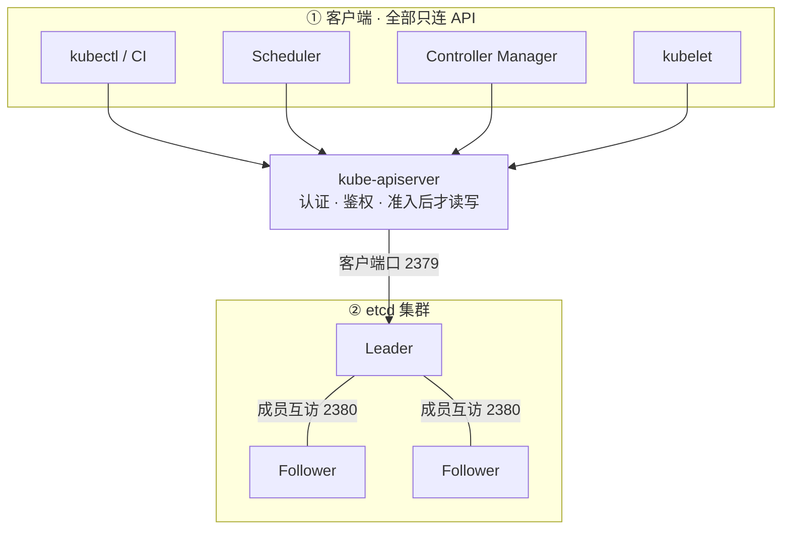
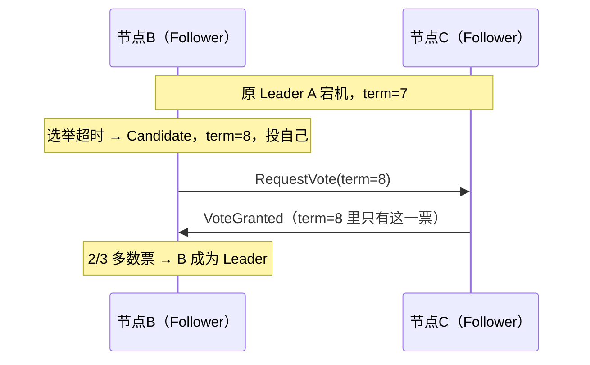
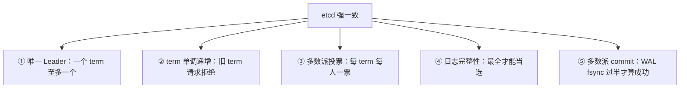
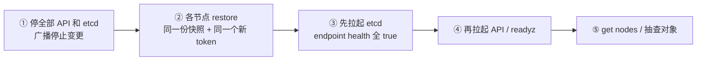
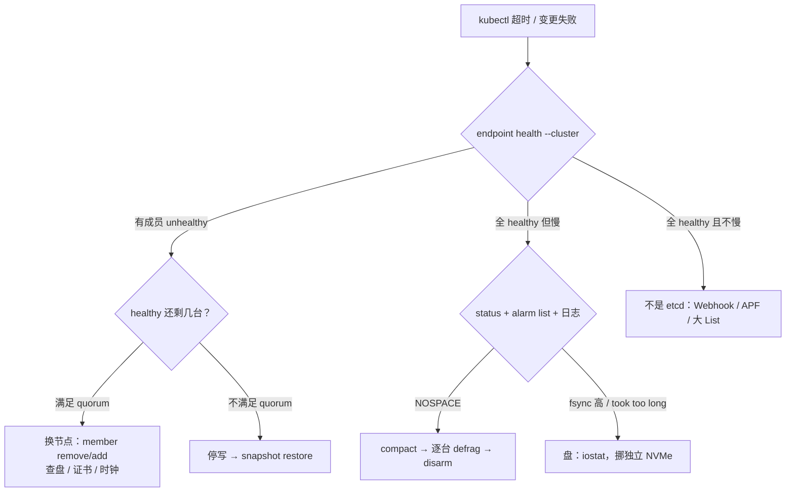

# 02｜etcd · 练习题

先合上知识点，对着 **一节的主图** 把「一份状态数据的一生」口述一遍：出生（API 唯一入口）→ 共识（Raft 选主与多数派复制）→ 落盘（WAL fsync）→ 日常（compact/备份）→ 换命（换节点/升级）→ 生病定责。讲得出来再做题。

| 标记 | 含义 |
|------|------|
| **核心** | 不懂整章就没建立起来 |
| **必会** | 值班和面试都要能讲 |
| **常用** | 线上会反复碰到 |
| **常考** | 白板和追问的高频口径 |

## 本题目录

- [Q1 etcd 是什么？谁在读写它？](#q1)
- [Q2 etcd 挂了，游戏服还在吗？](#q2)
- [Q3 为什么 etcd 要奇数台？3 台挂 1 台怎么办？](#q3)
- [Q4 Leader 是怎么选出来的？term 和投票是什么？](#q4)
- [Q5 一次写入哪一步最贵？fsync 慢怎么定责？](#q5)
- [Q6 etcd 凭什么保证强一致？](#q6)
- [Q7 值班怎么判断 etcd 健康？NOSPACE 怎么处理？](#q7)
- [Q8 怎样才算有备份？3 丢 1 要不要 restore？](#q8)
- [Q9 restore 怎么做？卡住了查什么？](#q9)
- [Q10 etcd 怎么滚动升级？升级失败怎么回滚？](#q10)
- [Q11 换机器、换盘、改 IP 分别怎么做？](#q11)
- [Q12 生产上 etcd 怎么部署？验收看什么？](#q12)
- [Q13 四张告警工单，分别是谁的问题？](#q13)
- [Q14 时钟漂移与 revision 陷阱](#q14)
- [合上书](#合上书)

---

## Q1

**★★★★★｜etcd 是什么？谁在读写它？把架构画一下。**

**覆盖**：核心 · 必会 · 常考 ｜ **对应**：知识点 [二、出生：唯一入口与它的家](知识点.md)

### 场景

新人值班看到 `kubectl` 慢，想「直连 etcd 查一下那个 Deployment 存的是什么」，已经在找 2379 的证书了。

### 完整解答

> 🎯 **一句话**：etcd 是控制面唯一的分布式强一致状态库，只有 API Server 读写它。

etcd 是分布式、强一致的 KV 存储：共识靠 Raft，多版本靠 MVCC（revision 全局递增），另外提供 Watch 与 Lease。K8s 的所有对象——Pod、Deployment、Service、Node、Secret、CR——都写在 ``/registry/{resource}/{namespace}/{name}`` 下。

架构上只有一个入口：



读图：重点看**没有的东西**——没有任何箭头从客户端直指 etcd。2379 是客户端口，生产只放行 API 网段；2380 是成员口，Raft 心跳和日志复制走这里。业务拿着合法证书连 2379 也算直连——绕过的是 API 层的认证、鉴权、准入和审计。

> 📝 **面试**：「etcd 是控制面唯一的强一致状态库，只有 API Server 读写；直连绕过认证准入审计，2379 只放行 API 网段，2380 只放行成员。」

### 再追问

- **大部分读不是被 Watch Cache 挡掉了吗？写还过 etcd 吗？** 读路径上大部分 List/Watch 确实被 API 的 Watch Cache 挡掉，但**写永远要过 etcd**（Leader + 多数派 fsync），cache miss 的读也会落到 etcd。不要讲成「读有缓存所以 etcd 不参与读写」。
- **Secret 在 etcd 里是加密的吗？** 不是，默认是明文 JSON；TLS 只保护传输。静止加密是 API Server 层配 EncryptionConfiguration 做的，别把传输加密和存储加密混在一起说。

---

## Q2

**★★★★★｜etcd 全挂了，线上游戏服还在吗？哪些功能会停？**

**覆盖**：核心 · 必会 · 常考 ｜ **对应**：知识点 [七、作战：定责](知识点.md)

### 场景

活动高峰三台 etcd 全不健康，群里已经有人开始重启战斗服「恢复服务」，另一人在问要不要马上重建集群。

### 完整解答

> 🎯 **一句话**：已运行的游戏服还在，停的是「变更」，别去重启还活着的服。

etcd 存的是**期望状态**（对象定义），不是运行现场。容器进程、节点上已下发的 iptables/conntrack 规则、已建立的长连接、业务库，都在节点的内核和内存里，etcd 挂了它们照常工作。

停的是所有**写路径**：apply / 发版 / 合服 / 扩缩容、节点挂了之后的 Pod 重调度与自愈——这些都要经 API 写 etcd，写路径断了就全停。

| 对比 | **通常还在** | **立刻停** |
|------|--------------|------------|
| 有什么 | 已运行的容器进程、已有 iptables/conntrack、长连接、业务库 | apply/发版/合服/扩缩容、Pod 重调度与自愈 |
| 为什么 | 规则和进程在节点内核与内存里 | 所有写都要经 API 进 etcd |

> ⚠️ **别混**：此时重启战斗服 = 把「不能变更」变成「真的挂了」——重启要从 API 拉 spec，拉不出来就起不来。已有规则不会因 etcd 挂而蒸发，只是不再更新。

处理顺序：确认进程还在 → 停发版、停重启 → 救 etcd（救盘 / 救 quorum / 救 quota）→ 恢复后先 `kubectl get nodes` 确认，再放控制器自愈。

> 📝 **面试**：「三问：进程还在不在？还能不能变更？已有流量通不通？答案是：在、不能、通。所以先保 etcd，别动业务。」

### 再追问

- **那玩家会立刻掉线吗？** 不会，已有连接和规则都还在。不要做的：不要因为「控制面异常」就去重启网关或战斗服，只会扩大故障面。

---

## Q3

**★★★★★｜为什么 etcd 要奇数台？3 台挂 1 台怎么办？**

**覆盖**：核心 · 必会 · 常考 ｜ **对应**：知识点 [三、共识：Raft 选主与日志复制](知识点.md)

### 场景

有人提议「3 台不够稳，加到 4 台吧」，还有人见 3 台挂了 1 台就要拿快照 restore。

### 完整解答

> 🎯 **一句话**：quorum = floor(N/2)+1，偶数容错没多、复制更重；3 丢 1 换节点，不 restore。

**quorum（多数派）** 是提交和选举都要凑够的票数：3→2、4→3、5→3。4 节点容错仍是 1（和 3 台一样），却多一张要复制的嘴，纯浪费——所以生产只有 3 或 5。

3 丢 1：quorum=2 仍满足，集群可正常读写，标准动作是**换节点**（member remove 坏的 → member add 新的），数据一点不丢。此时 restore 反而错：restore 生成全新成员身份，等于扔掉还活着的两份日志另起炉灶。

| 场景 | 动作 |
|------|------|
| 3 丢 1 / 5 丢 1~2（quorum 在） | member remove / add 换节点 |
| 3 丢 2 / 5 丢 3（quorum 没了） | 停写，同一份快照 + 新 token restore |

> ⚠️ **别混**：quorum 没了**不要**对残存节点乱 `member add`——集群配置每 add 一次变一次，越加越乱；quorum 没了只有 restore 一条路。

### 再追问

- **如果挂的那台是时钟不同步引起的选举抖动呢？** 先查 NTP 再动成员。时钟漂会表现为反复丢 Leader、`lost leader` 刷屏，别上来就摘节点。
- **7 台是不是更稳？** 不是。commit 要 4 台 ACK，写延迟更高、复制流量更大，K8s 生产不用 7。不要为了「看起来更稳」加机器。
- **2+1 网络分裂会不会双 Leader 双写？** 不会。少数派凑不出多数票，选不出 Leader、也提交不了写；多数派照常。这跟 MySQL 旧主自认为在位的脑裂不同——Raft 的分裂里至多一边可写。

---

## Q4

**★★★★☆｜Leader 是怎么选出来的？term 和投票是什么？**

**覆盖**：核心 · 必会 · 常考 ｜ **对应**：知识点 [三、共识：Raft 选主与日志复制](知识点.md)

### 场景

面试官听完「Raft 选主」四个字，追问：「具体点，term 是什么？会不会选出两个 Leader？」

### 完整解答

> 🎯 **一句话**：Follower 选举超时就转 Candidate、term+1 投自己，拿到多数票才当 Leader——一个 term 至多一个。

**term（任期号）** 全局单调递增，每发起一次选举 +1；所有请求带 term，**旧 term 的请求一律拒绝**。流程：

1. Leader 定期发心跳（空 AppendEntries，默认 100ms）；
2. Follower 超过 election-timeout（默认 1000ms，各节点带随机抖动）没收到心跳 → 转 **Candidate**，term+1，**先投自己一票**，向其他节点发 RequestVote；
3. **同一 term 每个节点只有一票、先到先得**；候选人拿到多数票（3 台要 2 票）→ 成为 Leader，开始发心跳压住别人的参选。



读图：三个细节保证不乱——超时随机抖动不会同时参选；每 term 一票选不出两个；票要过半，失联那台不影响剩下的人自己选。

为什么不会双 Leader：同一 term 一人一票 + 票要过半，数学上不可能两个候选人同时拿到多数票；再加**日志完整性**规则——投票时对比候选人最后一条日志（term、index），自己的更新就拒绝投票——保证不会选出落后分子。

> 📝 **面试**：「超时触发、term 递增、每 term 一票先到先得、多数票当选、日志最全才能当选——所以一个 term 至多一个 Leader，2+1 分裂少数派永远选不出主。」

### 再追问

- **选举超时设小了会怎样？** 网络抖一下就重选，日志里一片 `lost leader`。不要为了「故障检测快」把 election-timeout 压到小于成员间 RTT——它按同城 RTT 定，取心跳（默认 100ms）的 5~10 倍。
- `endpoint status` 里 **RAFT TERM 某台落后很多**说明什么？它被分区过或刚恢复，先看它的网络和盘，不要急着重启它。

---

## Q5

**★★★★★｜一次写入哪一步最贵？fsync 慢怎么定责？**

**覆盖**：核心 · 必会 · 常考 ｜ **对应**：知识点 [四、落盘：WAL、fsync 与容量](知识点.md)

### 场景

活动高峰 `kubectl` 全超时，API 的 CPU 一点不忙，有人提议给 API Server 扩容加核。

### 完整解答

> 🎯 **一句话**：最贵是 WAL fsync——Leader 和多数派 Follower 各自落盘，任何一块盘卡，全集群的写都排队。

写路径三步：写打 Leader → ① Leader 追加本地 **WAL（Write-Ahead Log，预写日志）** 并 **fsync（强制等磁盘真正写完）** → AppendEntries 复制给 Follower（各自写 WAL + fsync）→ ② 多数派 ACK 后 commit → ③ apply 到 bbolt（状态机）才回成功。一次写要 Leader + 多数派 Follower **各自 fsync 一次**，盘就是全链路的瓶颈。

红线：**WAL fsync P99 > 25ms，磁盘不合格**。定责命令：

```bash
kubectl get --raw /readyz?verbose          # ← etcd 项 failed / 超时，矛头指向 etcd
iostat -x 1 3 /dev/nvme0n1                 # ← await / %util 高 = 盘卡
kubectl -n kube-system logs etcd-ctrl1 --tail=50 | grep -iE "took too long|wal"
```

```text
{"level":"warn","msg":"apply request took too long","took":"892ms","expected-duration":"100ms"}
# ← apply 892ms，超 25ms 红线三十多倍
{"level":"warn","msg":"wal: sync duration","duration":"450ms"}
# ← WAL fsync 450ms，盘在拖全集群
```

游戏侧最常见根因：**etcd 和游戏日志/容器同盘**，高峰 IO 被抢；其次是云盘突发限流。

> ⚠️ **别混**：治法是给 etcd 挪独立 NVMe，**不是给 API 加核**——API CPU 不忙恰恰说明瓶颈不在 API。

### 再追问

- **只读的时候也会慢吗？** 大部分 List/Watch 被 API 的 Watch Cache 挡掉，热数据不进 etcd；cache miss 和写才真打。不要把「读慢」一律记到 etcd 头上。
- **读能打 Follower 分担吗？** etcd 默认读是线性一致读（linearizable，经 Leader 保证读到最新）；`serializable` 读可读本地 Follower、快但可能旧，控制面不靠它分担负载。不要拿 `serializable` 当扩容手段。

---

## Q6

**★★★★☆｜etcd 凭什么保证强一致？Raft 的日志是怎么提交的？**

**覆盖**：核心 · 常考 ｜ **对应**：知识点 [三、共识：Raft 选主与日志复制](知识点.md)

### 场景

白板题：「讲讲 etcd 的一致性是怎么来的，从选举讲到提交。」有人只答得出「多数派」。

### 完整解答

> 🎯 **一句话**：五件套——唯一 Leader、term 递增、多数派投票、日志完整性、多数派 commit，缺一不可。



读图：①②③ 决定「谁说了算」，④ 保证「算数的人数据最全」，⑤ 保证「说过的话收不回」。提交动作本身：Leader 把日志写进本地 WAL 并 fsync，AppendEntries 复制给 Follower，**多数派 ACK 才 commit**，然后 apply 到 bbolt、revision 推进，才给客户端回成功。此后哪怕 Leader 立刻挂，新 Leader 的日志必然包含这条（④ 保证），所以不丢。

> ⚠️ **别混**：强一致 **≠ 高可用**——quorum 一丢立刻停写，它是拿可用性换「宁可不服务，也不给错数据」；也 **≠ 无限容量**。

> 📝 **面试**：按「谁能写（①③）→ 写什么（④）→ 写了不能赖（②⑤）」分组背，结尾补一句「所以 2+1 分裂不会脑裂」。

### 再追问

- **3 扩到 5，写会不会更快？** 不会，写仍过 Leader、仍要多数派 fsync，5 只是多抗一台。不要拿加成员当写扩容。

---

## Q7

**★★★★☆｜值班怎么判断 etcd 健康？碰到 NOSPACE 怎么处理？**

**覆盖**：必会 · 常用 · 常考 ｜ **对应**：知识点 [四、落盘：WAL、fsync 与容量](知识点.md)

### 场景

半夜告警「etcd 异常」，有人上来就想重启三台 etcd「恢复一下」。

### 完整解答

> 🎯 **一句话**：值班先跑四条（health/status/member/alarm）；NOSPACE 的顺序是 compact → 逐台 defrag → disarm。

```bash
export ETCDCTL_API=3
export ETCDCTL_ENDPOINTS=https://127.0.0.1:2379
export ETCDCTL_CACERT=/etc/kubernetes/pki/etcd/ca.crt
export ETCDCTL_CERT=/etc/kubernetes/pki/etcd/server.crt
export ETCDCTL_KEY=/etc/kubernetes/pki/etcd/server.key

etcdctl endpoint health --cluster
etcdctl endpoint status --cluster -w table
```

```text
| IS LEADER | RAFT TERM | RAFT INDEX | DB SIZE | ERRORS |
| true      |         7 |    892341  | 1.2 GB  |        |
# ← 恰好一个 IS LEADER=true、三台 TERM 一致、INDEX 接近 = 健康
```

判读：恰好一个 `IS LEADER=true`；TERM 三台一致；RAFT INDEX 接近（某台长期落后查它的盘和网）。出现 `lost leader` 查盘/时钟/网络，**不要三台一起重启**。

NOSPACE（quota 默认 2GiB 被打满，写被拒、读仍可用）处理顺序固定：

```bash
etcdctl alarm list                    # ← memberID:8e9... alarm:NOSPACE
etcdctl compact {revision}            # ← 删历史版本（通常 auto-compaction 在跑）
etcdctl defrag                        # ← 窗口逐台：这台 health 追上再做下一台
etcdctl alarm disarm                  # ← 体积下来之后才能解除
```

> ⚠️ **别混**：**只 `alarm disarm` 不治理是不行的**——空间没降下来，告警会立刻回来；也**别指望 `compact` 之后 `du` 就降**，文件物理缩小必须靠 defrag。

然后回头查体积根因：Event 风暴、Completed Job 没设 TTL、超大 CR；紧急时可先把 quota 提到 8GB 止血，但只加不治理会再满。

### 再追问

- **`too old revision` 报错要去 restore 吗？** 不要。那是 Watch 起点被 compact 了，客户端（Informer）会自动重新 List 追上，正常自愈。
- **defrag 能不能 `--cluster` 一把梭？** 高峰不行——defrag 阻塞该成员，一把等于主动摘节点；必须窗口内逐台。

---

## Q8

**★★★★★｜怎样才算「有备份」？3 丢 1 需要 restore 吗？**

**覆盖**：核心 · 必会 · 常考 ｜ **对应**：知识点 [五、保险：备份与 restore](知识点.md)、[六、换命：成员变更与滚动升级](知识点.md)

### 场景

事故复盘，有人理直气壮：「我们有备份，本机有个 cron 每天打快照。」然后提议用这份快照 restore 救那台挂掉的节点。

### 完整解答

> 🎯 **一句话**：备份 = 异地快照 + 演练；3 丢 1 quorum 还在，换节点，绝不 restore。

「有备份」要过四道关：**至少每 6 小时一份**；**发版、扩控制面、合服前加打一份**；**异地保留 7~30 天——本机 cron 不算**（机器死了产物跟着死）；**每季度 restore 演练并记 RTO**。一句话：**没有演练 = 没有备份**。**RPO**（最多丢多少数据）≈ 距上次成功快照的间隔；**RTO**（多久恢复）只有演练过才知道。

3 丢 1 为什么不 restore：quorum=2 仍满足，集群活着，正确动作是换节点；**restore 会生成全新成员身份**（新 member ID、新集群），拿它救一台 = 扔掉两份还活着的日志另起炉灶，大概率组不成群。

| 对比 | **member 替换** | **snapshot restore** |
|------|-----------------|----------------------|
| 条件 | quorum 还在（3 丢 1 / 5 丢 1~2） | quorum 没了（3 丢 2 / 5 丢 3） |
| 身份 | 集群身份不变，换一个人 | 全员新身份（新 member ID / 新 token） |
| 数据 | 不丢 | 回退到快照时刻（丢 RPO） |

> ⚠️ **别混**：没有备份的「恢复」不叫 restore，叫重建集群（重新 init、YAML 重刷，集群对象全丢）。「有 cron、没演练」和没备份一个待遇。

### 再追问

- **peer 证书过期和 client 证书过期，表现有什么不同？** peer 过期 = 成员拆伙：组不成群、没 Leader；client 过期 = API 连不上 etcd：readyz 的 etcd 项失败。两种都别当「数据坏了」去 restore，先 `kubeadm certs check-expiration` 看剩余天数（< 14 天按 P1）。

---

## Q9

**★★★★☆｜quorum 没了要 restore，具体怎么做？卡住了查什么？**

**覆盖**：必会 · 常用 · 常考 ｜ **对应**：知识点 [五、保险：备份与 restore](知识点.md)

### 场景

3 台 etcd 只剩 1 台活着，值班拿着昨天的快照准备动手，问：「直接在原目录 restore 行不行？token 用原来那个省事。」

### 完整解答

> 🎯 **一句话**：停全部 API 和 etcd → 同一份快照 + 同一个新 token、各自新 data-dir → 先 etcd health 再 API。



读图：两个「同一」是命门——同一份快照文件、同一个新 `--initial-cluster-token`；顺序不能乱，etcd 先起、API 后起。

```bash
# 每台各跑一次；不要覆盖旧数据目录，验证通过前用新目录
etcdctl snapshot restore /backup/etcd-xxx.db \
  --name=ctrl1 \
  --initial-cluster=ctrl1=https://10.0.1.11:2380,ctrl2=https://10.0.1.12:2380,ctrl3=https://10.0.1.13:2380 \
  --initial-cluster-token=etcd-restore-20260901 \
  --initial-advertise-peer-urls=https://10.0.1.11:2380 \
  --data-dir=/var/lib/etcd-new
```

卡住分两种：**health 通了但 API 仍超时** → 查 API 的 `--etcd-servers` 和客户端证书；**etcd 组不成群** → 先核对每台是不是同一份快照、同一个新 token、peer URL 对不对，**不要反复 `member add`**——每 add 一次集群配置变一次，越加越乱。

> ⚠️ **别混**：必须用**新 token**，不能沿用旧的——防止旧集群的成员串进来把新旧两拨人搅在一起；`--data-dir` 建议新目录，别直接覆盖旧数据。

### 再追问

- **restore 能复用旧 token 吗？** 不能，理由如上。也不要三台各用各的快照文件——必须是同一份，否则三份数据三个版本，集群直接分裂。

---

## Q10

**★★★★☆｜etcd 怎么滚动升级？升级失败怎么回滚？**

**覆盖**：必会 · 常用 · 常考 ｜ **对应**：知识点 [六、换命：成员变更与滚动升级](知识点.md)

### 场景

K8s 要升级，顺带升 etcd。有人嫌慢：「三台镜像一起换，十分钟搞定。」

### 完整解答

> 🎯 **一句话**：先快照异地，再滚动（Follower 先、Leader 后），全程保 quorum；回滚只能靠升级前快照。

先对 **Kubernetes 支持的 etcd 版本**，别凭「最新 etcd」硬上。四步：

1. **先 snapshot、异地留一份**——这是回滚唯一的出路；
2. **滚动**：逐台升 Follower（停 → 换镜像 → 起 → health 且 INDEX 追上再做下一台），**Leader 放最后**，或先 `etcdctl move-leader <别的成员ID>` 让出去；
3. 不三台同时换（集群直接没 quorum），不跳大版本；
4. kubeadm 集群用 `kubeadm upgrade apply`（会带着 etcd 一起升），不要在它之外抢改静态 Pod 镜像。

**回滚只有一条路**：数据目录升级后**不能换回旧二进制降级**（新版数据格式旧版不认）。回滚 = 用升级前那份快照按 restore 流程重来（停全部 API 和 etcd，同一份快照 + 同一个新 token，先 etcd 后 API）。

> ⚠️ **别混**：升级后**一台** INDEX 落后，先查这台的盘和网，必要时摘掉重加；**不要三台一起把镜像改回去**——那等于把整个集群的升级和回滚搅在一起。

### 再追问

- **为什么不能三台同时换镜像省时间？** 三台同停 = quorum 归零 = 集群直接瘫，而且镜像有问题时没有健康成员可回退。不要为省十分钟赌整个控制面。

---

## Q11

**★★★★☆｜一台 etcd 的机器要换掉 / 换盘 / 改 IP，分别怎么做？**

**覆盖**：必会 · 常用 ｜ **对应**：知识点 [六、换命：成员变更与滚动升级](知识点.md)

### 场景

运维拿到三个需求：ctrl3 机器退役要换新机；ctrl2 数据盘要换更大的；ctrl1 换网段要改 IP。有人打算三种都用同一套「重装」流程。

### 完整解答

> 🎯 **一句话**：迁移三岔——换机器走 member remove/add，换盘拷数据目录，改 IP 用 member update。

**换机器**（成员替换）：

```bash
etcdctl member list -w table                 # ← 记下坏/旧节点 ID
etcdctl member remove {id}                   # ← 3 台变 2 台，quorum=2 仍满足，动作别拖
# 新机器：挂独立数据盘、放证书、配 peer URL
etcdctl member add ctrl3-new --peer-urls=https://10.0.1.14:2380
# ← 输出新的 ETCD_INITIAL_CLUSTER，抄给新节点
# 新节点启动带 --initial-cluster-state=existing（加入，不是新建）
etcdctl endpoint health --cluster            # ← 全部 healthy 才算完
```

数据量大或跨 AZ 的新节点，先以 **Learner（学习者，非投票成员）** 加入：不占 quorum、先后台追日志，追上再 `member promote`，避免新人复制慢拖垮全集群的写。

**只换盘**：先 snapshot → 停该成员 → 拷 `/var/lib/etcd` 到新盘 → 拉起，成员身份不变。

**只改 IP**：`etcdctl member update <id> --peer-urls=...`，yaml 里 advertise/listen 一起改，成员身份也不变。

> ⚠️ **别混**：**成员变更 ≠ 扩容**——加成员不提升写吞吐（写仍过 Leader），只多一个读端点和一份容错。「扛不住就加两台」是错方子。另外 Stacked 改 External 是个项目，活动期不要做。

### 再追问

- **member add 之后新节点一直追不上怎么办？** 先查新机的盘（追日志也要 fsync）和到成员的网络，别急着 promote；追不上就摘掉重来，不要带着落后成员硬抗。

---

## Q12

**★★★★☆｜生产上 etcd 怎么部署？验收看什么？**

**覆盖**：必会 · 常用 ｜ **对应**：知识点 [二、出生：唯一入口与它的家](知识点.md)

### 场景

新项目要上 K8s，有人问：「etcd 是不是随便找三台机器装一下就行？」另一人打算把 etcd 和日志采集混部省机器。

### 完整解答

> 🎯 **一句话**：3 或 5 台、本地 NVMe 独立盘、同城多 AZ、静态 Pod 或托管、证书独立——验收看 health 全绿 + readyz，不是进程起来。

选型五项：**节点 3 或 5**（奇数，quorum 决定）；**磁盘本地 NVMe/SSD 独立盘**，不机械盘、不和游戏日志/容器盘混；**同城多 AZ**，RTT ≪ election-timeout，**不跨地域**；**不在业务 Worker 上顺手跑 etcd**；**证书独立 CA、peer/client 分开**，2379 不对整个 VPC 裸奔。

kubeadm 里 etcd 是**静态 Pod**，三个路径要背：

```text
/etc/kubernetes/manifests/etcd.yaml   ← kubelet 盯着它拉起
/etc/kubernetes/pki/etcd/             ← 证书
/var/lib/etcd/                        ← 数据：WAL + bbolt，备份备的就是它
```

三种形态故障域不同：**Stacked**（kubeadm 默认）一台挂 = API + 一个 etcd 成员一起掉，3 台 + LB 就是生产最小 HA；**External** 故障域分开，盘和证书要有人盯；**托管** ssh 不进，上线前问清备份 RPO、谁 restore、升级是否滚动、磁盘是否独立——停变更的时候，停的是你的业务。

验收不是「进程起来了」：

```bash
etcdctl endpoint health --cluster   # ← 每个成员 healthy，不是只有本机
kubectl get --raw /readyz           # ← API 自检包含 etcd 链路
# 只探 TCP 2379 不算验收：端口活着 ≠ 能提交写入
```

> ⚠️ **别混**：Kubernetes 的 RBAC **管不到 etcd**——证书合法就能读写 `/registry`，所以 2379 网络层只放行 API 网段，那一道才是真正的访问控制。

### 再追问

- **API 的 `--etcd-servers` 两种形态怎么写？** Stacked 连 `127.0.0.1:2379`（同生共死，不是配错）；External 每台 API 写满 3 个地址，一台挂了其余还连得上。
- **内存按多少给？** 约工作集 2 倍（bbolt 索引树常驻）；quota 配 8GB、内存只给 4GB 会先 OOM。不要只盯磁盘不看内存。

---

## Q13

**★★★★☆｜四张告警工单，分别是谁的问题、怎么处理？**

**覆盖**：必会 · 常用 · 常考 ｜ **对应**：知识点 [七、作战：定责](知识点.md)

### 场景

早班交接，四张工单：① `etcd_server_has_leader == 0`；② `alarm:NOSPACE`；③ etcd 日志 `wal: sync duration 450ms`；④ etcd 全 healthy 但 kubectl 超时。新人准备全部按「重启 etcd」处理。

### 完整解答

> 🎯 **一句话**：入口都是 `endpoint health --cluster`，三个出口——数 quorum、看 quota 和盘、都不是就查 API 层。



读图：四张工单对号入座——① 无 Leader：查盘、NTP、证书、2380，再看剩几台决定换节点还是 restore；② NOSPACE：compact → 窗口逐台 defrag → disarm，回头清 Event/Job；③ fsync 450ms：etcd 数据盘问题，挪独立盘、停变更窗口，**不给 API 加核**；④ etcd 健康且不慢：不是 etcd——查 Webhook、APF 限流、大 List，去 [03](../03-API-Server/) 分流。

60 秒剧本：0–10s `readyz` + health 分叉；10–30s status + alarm 定型；30–45s 数 quorum 或查盘；45–60s 按树动手并验证，恢复后先 `kubectl get nodes` 再放自愈。

> ⚠️ **别混**：四张单没有一张的答案是「三台一起重启」——无 Leader 时三台重启 = 把刚选出的状态砸了重来。

### 再追问

- **托管集群是不是就能跳过这章？** 不能。ssh 不进 ≠ 不用懂：RPO 是多少、谁负责 restore、升级滚不滚、盘是不是独立——这些问题答不出来，托管故障时你只能干等。不要把自己的集群当黑盒。

---

## Q14

**★★★★☆｜etcd 健康但 kubectl 报 `too old resource version`，和时钟漂移怎么分？**

**覆盖**：必会 · 常考 ｜ **对应**：知识点 [七、作战：定责](知识点.md)

### 场景

凌晨 NTP 漂移后，控制器日志刷 `too old resource version`；同时有人报证书 expired。

### 完整解答

> 🎯 **一句话**：`too old` = watch 落后太多，informers 重 list；证书 expired = 先 `chronyc` 校时，别和 revision 混查。

```bash
# too old：控制器 / kubectl watch 断了太久
kubectl get --raw /metrics | grep apiserver_watch_events_total
journalctl -u kube-apiserver | grep -i "too old"

# 时钟：etcd 与 API 同时报 TLS 错
chronyc tracking
timedatectl status
```

| 症状 | 第一刀 | 别做什么 |
|------|--------|----------|
| too old revision | 等 informer 重同步；查 API 是否刚重启 | 不要 reset etcd |
| cert expired + 时钟快 | 校时 → 再 renew | 不要无视 NTP 只 renew |
| compact 后读旧 revision | 客户端重 list | 不要把 compact 当故障 |

> ⚠️ **别混**：etcd `status` 全绿时，`too old` **不是** Raft 问题——去 API watch cache / 控制器（03）。

### 再追问

compact 和 defrag 能在线随便跑吗？——compact 可滚动；defrag 要维护窗逐台，且先确认无 NOSPACE alarm（Q7）。

---

## 合上书

逐条对齐知识点的「合上书」，能全部口述再过：

- [ ] **1（主图）**：默画一份状态数据的一生——kubectl → API → Leader → Raft 多数派 fsync → commit → 日常 compact/备份 → 灾难换节点或 restore。（Q1、Q5）
- [ ] **2（出生）**：谁唯一碰 etcd、对象路径、2379/2380 各给谁、为什么禁直连、Secret 静止加密在哪层。（Q1）
- [ ] **3（选举）**：Follower 超时 → Candidate、term+1 投自己 → RequestVote → 多数票成 Leader；为什么无双 Leader、2+1 分裂为什么不脑裂。（Q4、Q3）
- [ ] **4（复制）**：写路径三步，status 输出里 term 和 INDEX 各代表什么。（Q5、Q6）
- [ ] **5（quorum）**：floor(N/2)+1、为什么奇数、4 节点浪费、3 丢 1 换节点 3 丢 2 restore、3 扩 5 写不变快。（Q3）
- [ ] **6（收束五件套）**：唯一 Leader / term 递增 / 多数派投票 / 日志完整性 / 多数派 commit，以及强一致不保证什么。（Q6）
- [ ] **7（落盘）**：最贵哪一步、25ms 红线、compact vs defrag、NOSPACE 顺序、too old revision 是什么。（Q5、Q7）
- [ ] **8（保险）**：怎样才算有备份、restore 的条件与步骤（同一份快照 + 新 token）、为什么没备份不能 restore。（Q8、Q9）
- [ ] **9（换命）**：member remove/add 与 learner、三岔（机器/盘/IP）、升级为什么滚动、回滚为什么只能靠快照。（Q10、Q11）
- [ ] **10（定责）**：决策树三个出口、etcd 挂了什么还在什么停、60 秒剧本每步敲什么。（Q2、Q13）
