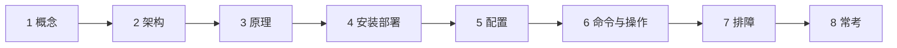
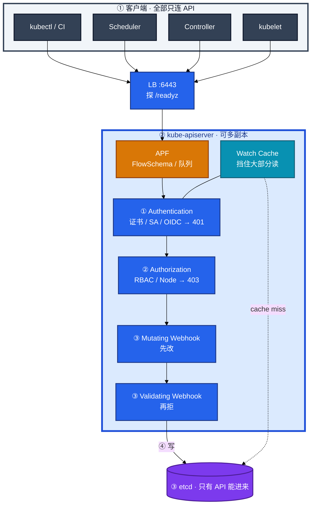
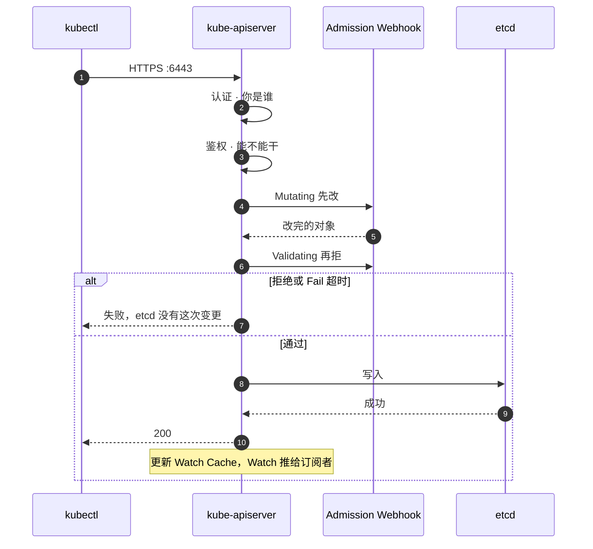
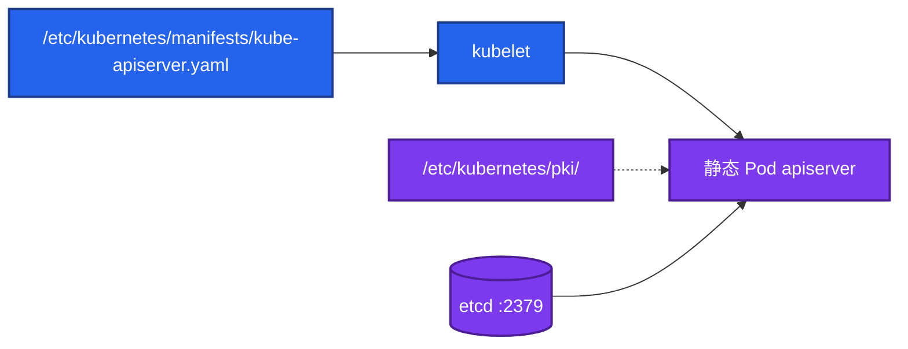
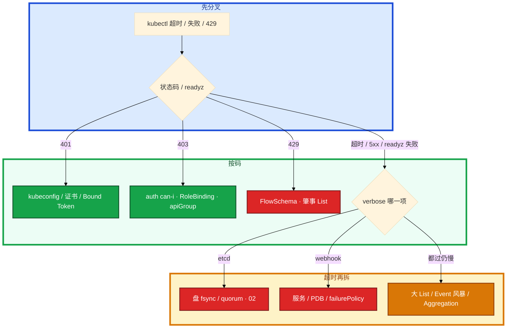

# API Server



活动发版窗口，大厅 YAML 一 apply 全集群卡住。群里有人要给 API 加核，另有人要重启 etcd——其实 Validating Webhook 单副本被驱逐，`failurePolicy: Fail` 把写路径焊死了。这一章只做一件事：**先看状态码和 readyz，再决定查证书、RBAC、Webhook 还是 etcd**。

**本章主线（写路径卡住就按这三步想）：**

1. **先看码**：401 / 403 / 429 还是超时 / readyz 失败——各走不同格子，不要一上来重启。
2. **写路径**：认证 → 鉴权 → Mutating → Validating → 写 etcd，串行一道都不能跳。
3. **慢查根因**：etcd 盘 / Webhook 超时 / APF 肇事 List，不要先给 API 加核。

**读完你能：** 把一次 apply 讲成三道门；Webhook Fail 会焊死写路径；Watch Cache 挡住什么、写仍过谁；429 找肇事者而不是加 inflight；LB 必须探 `/readyz`；exec 为什么 get 可以它不行。

## 本章目录

- [1. 基本概念](#1-基本概念)
- [2. 架构图](#2-架构图)
- [3. 原理](#3-原理)
  - [3.1 三道门](#31-三道门认证鉴权准入)
  - [3.2 Admission Webhook](#32-mutating-先改validating-再拒)
  - [3.3 Watch Cache](#33-list-watch-与-watch-cache)
  - [3.4 APF](#34-apf-与-429)
  - [3.5 exec / logs](#35-execlogsport-forward)
- [4. 安装部署](#4-安装部署)
- [5. 核心配置](#5-核心配置)
- [6. 命令与操作](#6-命令与操作)
- [7. 生产排障](#7-生产排障)
- [8. 必会 · 常考](#8-必会--常考)
- [合上书](#合上书问自己)

**本章不讲：** Raft、fsync、备份、defrag → [02 etcd](../02-etcd/)；组件挂了的总影响面 → [01 集群架构](../01-集群架构/)；RBAC 细则、PSS、配额 → [13](../13-RBAC与安全/)；HPA unknown、metrics-server → [07](../07-弹性伸缩/)；GitOps / SSA 工程化 → [05](../05-工作负载控制器/)、[22](../22-GitOps-ArgoCD与Tekton/)。

---

## 1. 基本概念

API Server 是控制面 **唯一入口**。kubectl、Scheduler、Controller、kubelet、Operator，全部只和它说话。它自己 **无状态**，数据在 etcd，所以可以多副本 + LB。它不调度、不起容器——那是 Scheduler 和 kubelet 的活。

**值班里怎么认现象**（先听监控/CI 怎么说，再对表）：

| 现象 / 状态码 | 技术含义 | 你的第一刀 |
|---------------|----------|------------|
| **401 Unauthorized** | 不知道你是谁 | kubeconfig / 证书 / Bound Token |
| **403 Forbidden** | 知道你是谁但没权限 | `auth can-i`、RoleBinding、apiGroup |
| **429 Too Many Requests** | APF 队列满 | FlowSchema、谁在狂 List |
| **创建被拒、报 webhook** | 过了鉴权，卡在准入 | Webhook 服务 / failurePolicy |
| **整体超时、readyz 失败** | 多半 etcd 不通或 Webhook 挂死 | `/readyz?verbose`，不是加 CPU |
| **get 可以、exec 不行** | 6443 通、10250 或 RBAC 不通 | API→kubelet 流、pods/exec |

你执行 `kubectl apply -f hall.yaml`，请求进 `:6443`。三道门 **串行**，任何一步停。鉴权不管 YAML 合不合规，合规是准入的事。没权限到不了准入；有权限但 YAML 违规，是准入拒。

| 在 API 管 | 不在 API 管 |
|-----------|-------------|
| 认证、鉴权、准入、审计、限流 | 容器进程、镜像拉取、探针 |
| List-Watch、写 etcd、SSA | 调度、节点资源记账 |
| exec/logs 升级到 kubelet | Pod 网络、Service 转发 |

CRD 注册新类型；Aggregation 反代 metrics-server；SSA 用 FieldManager 分字段归属。

**打个比方**：API Server 像游戏大厅的 **总服务台**——所有人排队办业务，台子后面才是档案室（etcd）。台子不亲自开房间，但每一张工单都要过身份核验、权限盖章、合规审查，才进档案室。

> **记住**：先看状态码是 401、403、429 还是超时，再决定查证书、RBAC、Webhook 还是 etcd。生产里慢，多半是 etcd 磁盘或 Webhook 超时，不是 API 自己缺 CPU。

**面试怎么说**：「API 是无状态入口，写路径串行过认证鉴权准入才写 etcd；401 查证、403 查 RBAC、429 找 APF 肇事者、超时先看 readyz 和 Webhook。」

---

## 2. 架构图

先把整张图钉住。后面配置、命令、排障都对着这张图说话。



**读图三句话：**

1. **没有箭头从 kubelet / Controller 指向 etcd**——读大多打 Watch Cache；写仍必须过 etcd。
2. **LB 必须探 `/readyz`**——只探 TCP `:6443` 会把「进程在、etcd 不通」的实例留在池里。
3. **Webhook 是同步调用**——`failurePolicy: Fail` 且服务挂了 = 写路径全堵。

生产形态：Stacked 连本机 2379；External 写满 etcd 列表；托管配 LB `/readyz` 路径。

---

## 3. 原理

原理只保留动手和面试会用到的：三道门谁先谁后、Webhook 怎么焊死、Cache 挡什么、429 找谁、exec 为什么 get 可以它不行。

**本节 5 块：** 3.1 三道门 · 3.2 Webhook · 3.3 Watch Cache · 3.4 APF · 3.5 exec

### 3.1 三道门：认证、鉴权、准入

**一句话：** 写路径串行过认证、鉴权、准入，任何一步停，etcd 里就没有这次变更。

**打个比方**：进公司大楼——先刷工牌（认证），再查你有没有进机房的权限（鉴权），最后过安检仪改包、查违禁品（准入）。工牌无效在门外；有工牌没权限在闸机；过了闸机 YAML 不合规在安检。

**现场走一遍**（大厅发版 apply 被拒，先分 401 / 403 / 准入）：

1. 跳板机带 CI 用的 kubeconfig 执行：

```bash
kubectl apply -f hall-deploy.yaml -v=6
```

2. 屏幕出现 403，末尾类似：

```text
Error from server (Forbidden): error when applying patch:
deployments.apps "hall" is forbidden: User "system:serviceaccount:ci:deploy-bot"
cannot patch resource "deployments" in API group "apps" in the namespace "prod"
```

3. 用同一身份验权限：

```bash
kubectl auth can-i patch deployments --as=system:serviceaccount:ci:deploy-bot -n prod
```

4. 屏幕出现：

```text
no
```

5. 查绑定关系：

```bash
kubectl get rolebinding,clusterrolebinding -A \
  | grep deploy-bot
```

6. 若改成 401，`-v=9` 里常见：

```text
Unable to connect to the server: x509: certificate has expired
```

**输出解读：**

```text
403 + cannot patch resource "deployments" in API group "apps"
```

| 片段 | 含义 |
|------|------|
| `403 Forbidden` | **鉴权**阶段拒——身份已知，RBAC 不允许 |
| `User "system:serviceaccount:ci:deploy-bot"` | 当前认证身份是 CI 的 SA |
| `cannot patch` | HTTP verb 是 patch，规则可能只给了 update/create |
| `API group "apps"` | Deployment 在 apps 组，不是 core 的 `""` |
| `auth can-i` 返回 `no` | 确认是 RBAC，不是 Webhook |

```text
401 + x509: certificate has expired
```

| 片段 | 含义 |
|------|------|
| `401` | **认证**失败——还没走到鉴权 |
| `certificate has expired` | 客户端证书过期，不是「API 挂了」 |

鉴权 **先**，准入 **后**。没权限到不了准入；有权限但 YAML 违规，是准入拒。认证常见来源：客户端证书、ServiceAccount Token、OIDC。生产应 `--anonymous-auth=false`。1.24+ Bound Token 会过期，过期就是 401。

**面试怎么说**：「apply 失败我先看码：401 查 kubeconfig 和证书，403 用 auth can-i 查 RBAC 和 apiGroup，过了鉴权才查 Webhook 和 etcd。」



> **记住**：鉴权管「能不能干」，准入管「合不合规」；401 和 403 不是一回事。

### 3.2 Mutating 先改，Validating 再拒

**一句话：** Mutating 先改对象，Validating 再拒；Webhook Fail + 服务挂 = 写路径焊死。

**打个比方**：安检先给你行李套保护套、贴标签（Mutating），再 X 光查违禁品（Validating）。X 光机坏了且规定「坏就全员不许进」（Fail），整个航站楼停办托运——不是多加两个柜台（加 CPU）能解决的。

**现场走一遍**（策略组 Webhook 单副本被驱逐，发版全失败）：

1. CI 执行 apply，屏幕出现：

```text
Error from server (InternalError): error when creating "hall.yaml":
Internal error occurred: failed calling webhook "validate-image.example.com":
Post "https://policy-webhook.policy.svc:443/validate?timeout=3s":
dial tcp 10.96.88.12:443: connect: connection refused
```

2. 列 Webhook 配置：

```bash
kubectl get validatingwebhookconfiguration \
  -o custom-columns=NAME:.metadata.name,FAIL:.webhooks[0].failurePolicy,TIMEOUT:.webhooks[0].timeoutSeconds
```

3. 屏幕出现：

```text
NAME                          FAIL    TIMEOUT
validate-image.example.com    Fail    3
```

4. 查 Webhook 后端 Pod：

```bash
kubectl get po -n policy -l app=policy-webhook -o wide
```

5. 屏幕出现：

```text
NAME                              READY   STATUS    RESTARTS   AGE
policy-webhook-7d8f9c-xk2m1       0/1     Pending   0          12m
```

6. 确认 etcd 里**没有**新对象：

```bash
kubectl get deploy hall -n prod 2>&1
# Error from server (NotFound): deployments.apps "hall" not found
```

**输出解读：**

```text
failed calling webhook ... connection refused
```

| 片段 | 含义 |
|------|------|
| `failed calling webhook` | 已过认证鉴权，卡在 **准入** |
| `connection refused` | Webhook Service 后端没有可用 Pod |
| `failurePolicy: Fail` | 调不到 = **整类写请求失败** |
| `NotFound` on deploy | etcd **没有**这次变更——不是「写进去了起不来」 |

Validating 在 Mutating 之后，才能看到「改完之后的对象」。Webhook 是同步调用。超时建议 **<3s**，服务要多副本 + PDB。单副本 Webhook 没有 PDB，是生产事故的经典形状。

`failurePolicy: Ignore`：当没这道门，放行。紧急窗口才改 Ignore 或临时删 Configuration。修完改回 Fail。改 Ignore 的代价：策略失效，特权 Pod、latest 镜像可能被放进来。

CRD conversion webhook 超时只影响那一类自定义资源；规则配太宽会误伤内置资源。metrics-server 挂了，`kubectl top` 失败、HPA 变 unknown（07），**API 本身仍可读写业务对象**。

**面试怎么说**：「写全失败我先查 Validating/Mutating Webhook；Fail + 服务挂等于写路径焊死，要修 Webhook 副本和 PDB，不是给 API 加核。」

> **记住**：Webhook Fail + 服务挂 = 写路径焊死；超时 <3s，多副本 + PDB。

### 3.3 List-Watch 与 Watch Cache

**一句话：** Watch Cache 在 API 内存挡大部分读，写仍必须过 etcd。

**打个比方**：大厅电子屏（Watch Cache）显示当前在线人数，大部分访客只看屏；但有人登记新账号（写）必须进档案室（etcd）落账，屏随后才刷新。

**现场走一遍**（Controller 日志刷 `too old revision`）：

1. 看 Deployment 控制器日志：

```bash
kubectl logs -n kube-system -l component=kube-controller-manager --tail=20 \
  | grep -i "too old"
```

2. 屏幕出现：

```text
watch of *v1.Pod ended with: too old resource version: 1234567 (1234890)
```

3. 对照 etcd compact 设置（控制面节点）：

```bash
grep auto-compaction /etc/kubernetes/manifests/etcd.yaml
```

4. 屏幕出现：

```text
- --auto-compaction-retention=5m
```

5. 手动 List 验证 API 仍可读：

```bash
kubectl get pods -A --limit=5
```

6. 屏幕正常列出 Pod，说明 **API 和 etcd 没坏**，只是 Watch 游标过期。

**输出解读：**

```text
too old resource version: 1234567 (1234890)
```

| 片段 | 含义 |
|------|------|
| `too old resource version` | 客户端 Watch 的 revision 已被 **compact** 删掉 |
| `1234567` vs `1234890` | 客户端落后约 323 个 revision |
| 随后一次大 List | Informer **正常行为**，不是数据丢失 |
| `get pods` 仍成功 | 读路径 OK；重新 List 后 Watch 恢复 |

Watch Cache 在 API Server **内存**里。compact 之后游标过期，客户端报 `too old revision`，重新 List 即可。规模化靠 Cache 把读从 etcd 卸下来，不是靠每个组件直连 etcd。默认线性一致读走 **Leader**。

**面试怎么说**：「too old revision 是 compact 后的正常重 List，Informer 会全量拉一次再 Watch，不是 etcd 损坏，不要去 restore。」

> **记住**：`too old revision` 是 compact 后的正常重 List，不是 etcd 坏了。

### 3.4 APF 与 429：先找肇事者，不要加 inflight

**一句话：** 429 是 APF 队列满，找肇事客户端而不是加 inflight。

**打个比方**：银行叫号——VIP 窗口、普通窗口、大宗业务窗口分开排队。某个大客户（CI 脚本）在普通窗口狂刷「查余额」（List 全集群），把号子占光，别人拿 429「请稍后再试」——开再多前台（加 API 副本）只会一起挤档案室。

**现场走一遍**（交互 kubectl 偶发 429）：

1. 重现或观察：

```bash
kubectl get pods -A 2>&1 | tail -3
```

2. 屏幕偶发：

```text
Error from server (TooManyRequests): the server has received too many requests and has asked us to try again later
```

3. 看 FlowSchema：

```bash
kubectl get flowschema -o wide
```

4. 看 APF 拒绝指标（有 Prometheus 时）或 API 日志：

```bash
kubectl logs -n kube-system -l component=kube-apiserver --tail=50 \
  | grep -i "flowcontrol\|429"
```

5. 查 CI Job 是否在狂 List：

```bash
kubectl get jobs -A | grep poll
kubectl logs job/ci-poll-xyz -n ci --tail=5
```

6. 屏幕 CI 日志类似：

```text
while true; do kubectl get pods -A; sleep 1; done
```

**输出解读：**

```text
TooManyRequests ... try again later
```

| 片段 | 含义 |
|------|------|
| `429` | **APF** 队列满，不是 Webhook 超时 |
| 偶发 | 说明还有空位，某类请求峰值挤满 |
| CI 每秒 `get pods -A` | 典型 **肇事者**——全集群 List 极贵 |

API Priority and Fairness 按 FlowSchema 分类，送进不同 PriorityLevel 队列。leader-election、kubectl 交互、疯狂 List 的 Controller **不应挤同一条道**。不要无脑加大 `--max-requests-inflight`（默认读 **400** / 写 **200**）——那只是推迟打爆 etcd。

429 和 Webhook 超时怎么区分：429 响应码就是 429；Webhook 超时是写路径等准入，码不一定是 429。

**面试怎么说**：「429 我先找谁在狂 List，给 leader-election 高优先级、给 CI 限速；不加 inflight，也不只加 API 副本——那会一起锤 etcd。」

> **记住**：429 找肇事客户端，不要加 inflight，也不要只加 API 副本。

### 3.5 exec / logs / port-forward：过 API，再到 kubelet

**一句话：** exec/logs 过 API 再升级到 kubelet :10250，不是直连 Pod IP。

**打个比方**：你要进游戏房间（容器）查日志——得先在大厅总服务台（API）登记身份、查你有没有进房权限，服务台再内线转接到房间管理员（kubelet），不是翻墙直连房间号。

**现场走一遍**（get 正常、exec 失败）：

1. 确认 Pod 在跑：

```bash
kubectl get po hall-7d8f9c-abc12 -n prod
```

2. 屏幕：

```text
NAME                    READY   STATUS    RESTARTS   AGE
hall-7d8f9c-abc12       1/1     Running   0          2h
```

3. 执行 exec：

```bash
kubectl exec -it hall-7d8f9c-abc12 -n prod -- /bin/sh
```

4. 屏幕出现：

```text
Error from server (Forbidden): pods "hall-7d8f9c-abc12" is forbidden:
User "dev-alice" cannot create resource "pods/exec" in API group "" in the namespace "prod"
```

5. 验 exec 权限：

```bash
kubectl auth can-i create pods/exec --as=dev-alice -n prod
```

6. 若 RBAC 通过仍失败，`-v=9` 可能见：

```text
dial tcp 10.0.1.15:10250: i/o timeout
```

**输出解读：**

```text
cannot create resource "pods/exec"
```

| 片段 | 含义 |
|------|------|
| `pods/exec` 子资源 | exec 走的是 **create pods/exec**，不是 get pods |
| `403` | RBAC 没给 exec 权限 |
| `10250 i/o timeout` | 鉴权过了，**API→kubelet** 流被墙或 kubelet 不可达 |

exec/logs/port-forward 仍过 API，再升级成到 kubelet `:10250` 的流。防火墙只放 6443 不放 10250，就会「get 可以、exec 不行」。exec 不走完整 Mutating/Validating，别把 exec 失败第一刀开在 Webhook 上。

**面试怎么说**：「get 可以 exec 不行，我先 auth can-i pods/exec，再查 API 到节点 10250 和 kubelet 证书；不是 Webhook，也不是 Pod 挂了。」

> **记住**：exec 不是直连 Pod IP，是 API 再转到 kubelet `:10250`。

---

## 4. 安装部署

### 4.1 生产怎么选

| 项 | 选 | 不选 |
|----|----|------|
| 副本 | ≥3 + LB，跨 AZ | 单副本控制面 |
| LB 探针 | HTTPS `/readyz` | 只探 6443 TCP |
| 鉴权 | `Node,RBAC`，关匿名 | 共享集群管理员 kubeconfig |
| Webhook | 超时 <3s，多副本+PDB；失败策略想清楚 | 单副本 + `failurePolicy: Fail` 管所有 CREATE |
| 审计 | 开，Secret 单独加严 | 完全无审计 |
| APF | 给 leader-election 高优先级 | 默认全挤一条队列还狂 List |
| Stacked `--etcd-servers` | 本机 `127.0.0.1:2379` | 误当成配错去改成外网 |
| External `--etcd-servers` | 写满 3 或 5 个 HTTPS 地址 | 漏地址变成单点 |

托管集群证书轮换跟厂商文档，不要套 kubeadm 命令。你配的是云 LB 健康检查路径，不要只填端口。

### 4.2 kubeadm 落地你实际看到什么

kube-apiserver 是 **静态 Pod**，kubelet 盯 manifests 目录。



| 路径 | 内容 |
|------|------|
| `/etc/kubernetes/manifests/kube-apiserver.yaml` | kubelet 保证这个 Pod 在 |
| `/etc/kubernetes/pki/` | API 服务证书、SA 密钥、front-proxy |
| `--etcd-servers` | Stacked 本机 2379；External 全列表 |
| `:6443` | 对外 HTTPS；LB 挂在这里 |

清单关键项：`--advertise-address`、`--etcd-servers`、`--authorization-mode=Node,RBAC`、`--anonymous-auth=false`、审计路径、`--enable-admission-plugins`。

**健康检查语义：**

| 路径 | 含义 | 谁用 |
|------|------|------|
| `/livez` | 进程活着 | kubelet 重启判断 |
| `/readyz` | 能否接流量（etcd 通等） | **LB 必须用这个** |
| `/readyz?verbose` | 哪一项失败 | 排障第一刀 |

etcd 磁盘抖时 TCP 6443 仍 accept，LB 只探端口会把坏实例留在池里。验收必须 `/readyz` 通过。

---

## 5. 核心配置

只动有证据的项。改 `kube-apiserver.yaml` 后等 kubelet 重建该静态 Pod。续 pem 后必须重启。

| 参数 | 默认 / 常见 | 生产怎么用 | 改错会怎样 |
|------|-------------|------------|------------|
| `--anonymous-auth` | 建议 `false` | 关掉 | 匿名落到 system:anonymous，排障绕弯 |
| `--authorization-mode` | `Node,RBAC` | 保持 | 乱加 AlwaysAllow = 没鉴权 |
| `--etcd-servers` | Stacked 本机；External 全列表 | 见 §4 | 漏地址单点 |
| `--max-requests-inflight` | 读 400 | 一般不动 | 加大只是推迟打爆 etcd |
| `--max-mutating-requests-inflight` | 写 200 | 一般不动 | 同上 |
| `--audit-log-path` + Policy | 关则无 | **必须开**；Secret 单独加严 | 出事只能猜；写满盘反噬 API |
| `--enable-admission-plugins` | kubeadm 已含 | 不要随便摘 NamespaceLifecycle | 摘掉等于少一道内置门 |
| `--encryption-provider-config` | 无 | Secret 静止加密在这里 | etcd 默认明文 JSON（02） |

> **记住**：证书续完要重启静态 Pod；审计尤其 Secret，写满盘会反噬 API，要轮转。

生产看 P99、429、etcd 延迟、Webhook 延迟、证书天数。指标：`apiserver_request_duration_seconds`、`apiserver_flowcontrol_rejected_requests_total`。Event 风暴、狂 List、慢 Webhook 是三大元凶。

---

## 6. 命令与操作

值班先跑这四条，不要先重启全部 API：

```bash
kubectl get --raw /readyz?verbose
kubectl get validatingwebhookconfiguration,mutatingwebhookconfiguration
kubectl get flowschema
kubectl logs -n kube-system -l component=kube-apiserver --tail=100
```

| 目的 | 命令 | 看什么 |
|------|------|--------|
| 愿不愿接流量 | `kubectl get --raw /readyz?verbose` | 哪一项 fail；etcd / webhook 常先挂 |
| 401 vs 403 | `kubectl auth can-i ... --as=...` | 403 时确认是 RBAC |
| 真实 verb / URL | `kubectl get pods -v=9` | apiGroup 写歪看起来像没权限 |
| 写路径焊死 | `get validatingwebhookconfiguration,mutatingwebhookconfiguration` | 规则范围、failurePolicy |
| 429 | `kubectl get flowschema` | 哪类请求挤满 |
| 证书 | `kubeadm certs check-expiration` | 剩余 **< 14 天** 当 P1 |

**证书 / 审计 / Webhook 放行：** `kubeadm certs renew` 后必须重启静态 Pod；审计必开、Secret 分级、日志要轮转；Webhook 紧急改 `Ignore` 要审批、修完改回 Fail。SSA 用 FieldManager 分 replicas 归属（05、07）。

---

## 7. 生产排障

写路径上有三处会把「看起来 API 慢」放大，先不要给 API Server 加 CPU：



| 现象 | 先做什么 | 不要做什么 |
|------|----------|------------|
| 401 | kubeconfig / 证书过期 / Token 无效（1.24+ Bound Token） | 当 API 挂了去重启 |
| 403 | `auth can-i --as=...`；查 RoleBinding 和 apiGroup | 「API 坏了」 |
| 429 | 查 FlowSchema、谁在狂 List；给肇事组件限速 | 加大 inflight；只加 API 副本 |
| 写全部失败 / 创建超时 | **先看 Validating/MutatingWebhookConfiguration** | 先给 API 加核 |
| API P99 高 | etcd fsync、Webhook 延迟、大 List、Event 风暴 | 先加 CPU |
| 证书过期 | 续期并重启 API；监控剩余天数 | 只续 pem 不重启 |
| get 可以、exec 不行 | API→kubelet :10250、kubelet 证书、RBAC pods/exec | 第一刀开 Webhook |
| `too old revision` | Informer 重新 List；compact 窗口（02） | 当数据丢失去 restore |
| `kubectl top` 失败 | Aggregation / metrics-server（07） | 说成「API 挂了」 |
| CRD webhook 连 Deployment 也建不了 | 规则配太宽 | 只查那个 CR |

活动高峰 etcd 和日志同盘时，对齐 01/02：确认进程还在 → 停发版 → 救盘 / Webhook / APF → 不要重启逻辑服。

---

## 8. 必会 · 常考

白板和追问高频，能一口回：

| 说法 | 对错 | 口径 |
|------|:----:|------|
| 鉴权管 YAML 合不合规 | 错 | 鉴权管「能不能干」；合规是准入 |
| Mutating 和 Validating 谁先都行 | 错 | 必须先改再校验 |
| Webhook Fail + 服务挂只影响那条策略 | 错 | 写路径可以全堵 |
| Watch Cache 把写也挡住了 | 错 | 写仍过 etcd |
| `too old revision` 表示 etcd 损坏 | 错 | compact 后正常，重新 List |
| 429 加 API 副本就能好 | 错 | 一起锤 etcd；找肇事客户端 |
| 加大 inflight 是正确容量手段 | 错 | 只是推迟打爆 etcd |
| LB 探 TCP 6443 就够了 | 错 | 必须 `/readyz` |
| exec 是 kubectl 直连 Pod IP | 错 | API 再转到 kubelet :10250 |
| 证书 renew 完立刻生效 | 错 | 必须重启静态 Pod |
| Secret 进 etcd 默认加密 | 错 | 静止加密是 API `EncryptionConfiguration` |
| metrics-server 挂了就是 API 挂了 | 错 | 业务对象仍可读写 |
| 托管不用关心 Webhook / 审计 | 错 | 自己装的准入、影响面仍是你的 |
| 匿名可以开着方便排障 | 错 | `--anonymous-auth=false` |

数字：Webhook 超时 **<3s**；inflight 默认读 **400** / 写 **200**；证书告警 **14 天**；Bound Token 1.24+ 会过期。

易混：401 vs 403 vs 429；Webhook 超时 vs etcd 盘慢 vs APF；`/livez` vs `/readyz`；Fail vs Ignore；Watch Cache 慢 vs etcd 写慢；conversion webhook 误伤内置资源 vs metrics-server 只影响 top。

---

## 合上书，问自己

1. 请求链：认证 401 → 鉴权 403 → Mutating 改 → Validating 拒 → 写 etcd；谁先谁后？
2. Webhook `failurePolicy: Fail` + 服务挂会发生什么？超时、副本、PDB 怎么配？Ignore 的代价？
3. Watch Cache 挡什么？写过不过 etcd？`too old revision` 是不是损坏？
4. 429 找谁？加 inflight、只加 API 副本为什么不够？
5. LB 为什么必须探 `/readyz`？exec 为什么 get 可以它不行？
6. 证书续完为什么还过期？审计为什么必开、尤其 Secret？

六题都能口述，这一章就过了。下一章把 Pod 剖开：探针配错会把逻辑服杀光。
