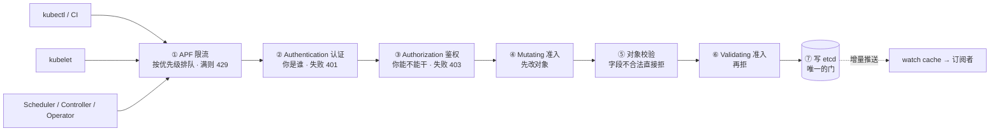
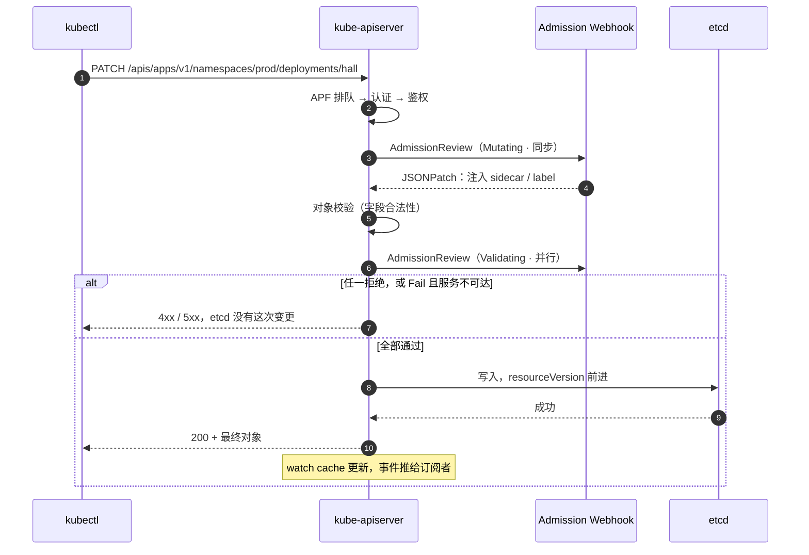
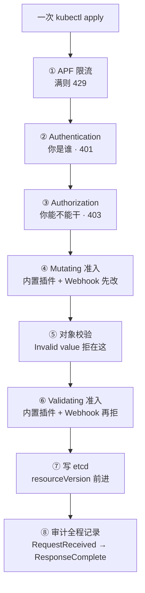
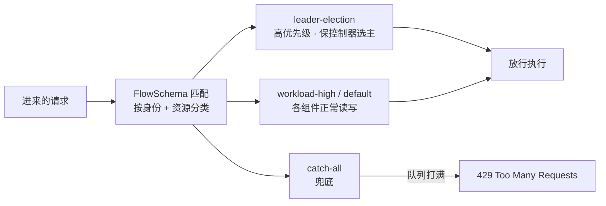
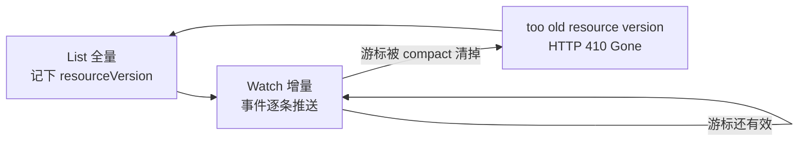
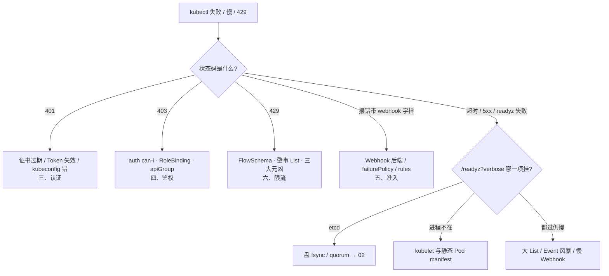

# API Server

> 大家好。开讲之前，先接上 [01](../01-集群架构/) 和 [02](../02-etcd/)：活动高峰 `kubectl` 超时，根因可能在 etcd 盘——但还有一类更「像 API 自己坏了」的现场，刀却砍错地方。
> 发版高峰，CI 一条 `kubectl apply` 把全集群写操作卡死：有人喊给 API 加核，有人已经把手伸向 etcd 重启——其实是一个单副本 ValidatingAdmissionWebhook 被驱逐，`failurePolicy: Fail` 把写路径焊死了；另一边值班同学的 kubectl 直报 401，那只是证书过期，不是「API 挂了」。
> 这一章讲完，你会知道：看到一个状态码，第一刀该砍认证、鉴权、准入还是限流——以及为什么「给 API 加核」常常是冤枉招。
> **本章回答的问题**：一次 API 请求的一生——APF 限流 → 认证 → 鉴权 → 准入 → 校验 → 写 etcd，每一段会坏成什么样、看到一个状态码怎么一刀定责。
> **本章不讲**：etcd 的 Raft / 备份恢复 / defrag → [02](../02-etcd/)；RBAC 细则 / PSS / 配额 → [13](../13-RBAC与安全/)；证书体系与 kubeconfig → [14](../14-证书与kubeconfig/)；各组件挂掉的总影响面 → [01](../01-集群架构/)。

**标记**：🎯重点 · 🔥难点 · ⭐常考 · 🔧实操

**怎么听这场分享**：第一节的七道关是全章主干；第二到五节顺着进门 → 认证 → 鉴权 → 准入往下走；六到九节补限流、读路、扩展、审计；第十节就是开头那个现场的定责树。每节对应练习题，学完就练。

---

## 一、一张图：一次请求的一生

> 🎯 **一句话**：不管谁发来的请求，都走同一条路——先排队，再验你是谁、你能不能干，然后改一遍、查一遍，才准进 etcd。



**读图**：咱们对着这七道关，先建立一个排障习惯——任何一道停下，etcd 里就没有这次变更。

- 主线是**写请求**的一生，七道关串行，任何一道停下，etcd 里就没有这次变更——排障先问「死在哪一关」，每关都有专属死法：429 / 401 / 403 / 准入拒绝。
- **读**（get / list / watch）只走左半段：过了认证鉴权后大多命中 watch cache（七节），不打 etcd。
- exec / logs 是特例：从同一扇门进，随后 API 反代升级成到 kubelet 的流（二节）。

七道关装进脑子了。咱们从「这扇门本身」讲起——谁能进、挂了什么还在。

本节对应练习题 Q1。

---

## 二、进门：唯一的门，唯一碰 etcd 的人

> 🎯 **一句话**：所有组件只跟 API 说话，也只有 API 碰 etcd——这扇门全倒，控制面停摆，但已跑的 Pod 还活着。

kube-apiserver 是控制面的**唯一入口**：kubectl、Scheduler、Controller Manager、kubelet、Operator，全部只和它说话，组件之间从不直连。它也是**唯一直接读写 etcd 的组件**——Scheduler 想绑定节点、Controller 想改副本数，都得提交给 API 走同一条写路径，谁也不许走后门。这正是它敢做成**无状态**的原因：会话和对象状态全在 etcd，进程本身不存东西，所以可以多副本 + LB 横向扩，挂一个实例请求切到别的实例继续；生产上一般 **≥3 副本跨可用区**部署。

生产三种形态：**Stacked**（etcd 与 API 同机，`--etcd-servers=https://127.0.0.1:2379`，kubeadm 默认，别误当配错去改）；**External**（独立 etcd 集群，`--etcd-servers` 必须写满 3 或 5 个地址，漏一个就是单点）；**托管**（云厂商管控制面，证书轮换跟厂商文档，不要套 kubeadm 命令，你唯一要配的是云 LB 的健康检查**路径**，不是端口）。

> 🔍 **现场**：kubeadm 集群里 API 是**静态 Pod**——参数和证书全在磁盘上，判断形态、查参数都先看这两个路径。

```bash
grep etcd-servers /etc/kubernetes/manifests/kube-apiserver.yaml
# - --etcd-servers=https://127.0.0.1:2379        # ← Stacked；External 形态这里应是 3/5 个地址
ls /etc/kubernetes/pki/ | head -4
# apiserver.crt  apiserver-etcd-client.crt  ca.crt  front-proxy-ca.crt
#               # ← 全部证书在这；三节续证书动的就是这个目录
```

| 在 API 管 | 不在 API 管 |
|-----------|-------------|
| 认证、鉴权、准入、校验、审计、限流 | 容器进程、镜像拉取、三探针 |
| List-Watch、写 etcd、SSA 合并 | 调度决策、节点资源记账 |
| exec / logs 升级到 kubelet | Pod 网络、Service 转发 |

它不调度、不起容器、不拉镜像——「API 挂了业务全挂」这种话先别喊，看下面的影响面。另一项写侧职责：**SSA（Server-Side Apply，服务端应用）** 合并写入——多个控制器写同一对象时按 FieldManager 跟踪字段归属，`kubectl apply` 的冲突报错就从这来（→ [23](../23-GitOps-ArgoCD与Tekton/)）。

### 健康探针：livez 和 readyz 不是一件事 ⭐

> 🔍 **现场**：etcd 磁盘抖动时，API 进程的 `:6443` 照样 accept 连接——LB 只探 TCP 端口，会把这个「进程在、写不进」的坏实例一直留在池里，用户请求随机打到它就超时。

```bash
kubectl get --raw /readyz?verbose
# [+]ping ok
# [+]etcd ok                 ← 这行变 failed：进程活着，但 etcd 不通
# [+]poststarthook ... ok
```

三个探针端点分工：`/livez` 问「进程活着吗」，是 kubelet 决定**要不要重启**这个静态 Pod 的依据；`/readyz` 问「现在敢接流量吗」（含 etcd 连通、启动钩子完成），是 **LB 必须探的这个**；`/readyz?verbose` 逐项列出哪一项挂了，是排障第一刀。

> ⚠️ **别混**：`/livez` 过了 ≠ 能服务。只探 `/livez` 或 TCP 端口，坏实例永远摘不掉；探 `/readyz` 才能让 LB 把它踢出池子。坏实例摘除后，挂在它上面的长 watch 连接会断，客户端自动重连到健康实例——所以摘慢了就反复重连。

### exec / logs / port-forward：进门之后转内线 🔧

> 🔍 **现场**：`kubectl get pod` 正常，`kubectl exec` 却超时或 403——有人第一刀开在 Webhook 上，方向就错了。

```bash
kubectl exec -it hall-7d8f9c-abc12 -n prod -- /bin/sh
# Error from server (Forbidden): pods "hall-7d8f9c-abc12" is forbidden:
# User "dev-alice" cannot create resource "pods/exec" in API group "" in the namespace "prod"
#                                                    # ← exec 的鉴权对象是子资源 pods/exec，动词是 create
```

exec / logs / port-forward 仍从 6443 这扇门进，先过认证和鉴权，然后 **API 反代升级成一条到目标节点 kubelet `:10250` 的流**，由 kubelet 调 CRI 进容器——**不是 kubectl 直连 Pod IP**。所以「get 可以、exec 不行」只有三种可能：① RBAC 没给 `pods/exec`（403）；② API → 节点的 10250 被防火墙 / NetworkPolicy 拦了（只放 6443 的经典坑）；③ kubelet 证书坏了。exec 连的是已存在的 Pod，**不走完整的 Mutating / Validating**，别把它的失败怪到准入头上。

### API 挂了：什么坏、什么不坏 ⭐

多副本 + LB 时，单实例挂掉几乎无感：请求和 watch 重连切到其余实例。真正要背的是**全部副本不可用**的影响面：

- **不坏**：节点上已运行的 Pod 继续跑（容器是 kubelet 和运行时管的，不依赖 API）；玩家不掉线，战斗照打。
- **坏**：一切**变更**停摆——新 Pod 建不了、调度器无法 bind、控制器无法纠错（副本少了没人补）、扩缩容失效、发版冻结；kubectl 全报错；所有 informer 断 watch，恢复瞬间重连风暴。
- 所以「API 挂了」的正确反应是救控制面，**不是去重启业务逻辑服**；已跑的 Pod 不受影响，乱重启反而真把玩家踢了。整体组件影响面见 [01](../01-集群架构/)。

> 📝 **面试**：影响面答三段——不坏的（已跑 Pod、玩家连接）；坏的（一切**变更**：创建、调度、纠错、扩缩容、发版）；反应（救控制面、不重启业务、防恢复瞬间的重连风暴）。

好，门的位置和影响面清楚了。进门第一关：你是谁？

本节对应练习题 Q1、Q2。

---

## 三、认证：你是谁

> 🎯 **一句话**：Authentication 只回答「你是谁」，失败是 401——跟有没有权限无关。

> 💡 **打个比方**：把 API 想成大楼前台。**认证**是刷工牌（先搞清你是哪位），**鉴权**是查你有没有进机房的授权（四节），**准入**是安检仪（五节）。工牌刷不出（401）就别谈权限；有工牌没授权被拦在闸机（403），那是另一码事。

**Authentication（认证）** 在请求进门后第一步执行，把 TLS 里的凭据解析成一个身份（用户名 / ServiceAccount + 所属组）。四种主流方式，值班要能按凭据认人：

- **X.509 客户端证书**：kubeconfig 里最常见，证书 CN 是用户、O 是组。证书一过期就是 `x509: certificate has expired` + 401，**不是 API 挂了**。
- **Bearer Token**：请求头带令牌。静态 token 文件是老玩法；现在主流是 **ServiceAccount Token**。
- **ServiceAccount（SA，服务账户）**：Pod 内程序的身份。1.24+ 默认挂载 **Bound Token**（绑定令牌）：有有效期（小时级，kubelet 自动轮换），且不再自动创建永不过期的旧式 secret——老脚本里抠出来缓存的旧 token 到期就 401。
- **OIDC（OpenID Connect）**：对接公司统一登录，kubectl 拿 ID Token 换访问；签发方配置在 `--oidc-issuer-url`，对接细节归 [14](../14-证书与kubeconfig/)。

此外聚合 API（八节）走 **front-proxy 客户端证书**认证；所有凭据都没带上时落到兜底身份 `system:anonymous`。

> ⚠️ **别混**：生产必须 `--anonymous-auth=false`。匿名开着时，没带证的请求不会 401 而是落到 `system:anonymous` 再被 RBAC 拒成 403——排障的人会以为是权限配错，绕一大圈才发现是凭据压根没带上。

> 🔍 **现场**：发版窗口，跳板机执行 apply 直接 401。

```bash
kubectl apply -f hall-deploy.yaml -v=6
# Unable to connect to the server: x509: certificate has expired   # ← 认证失败，请求没进门

kubectl get pods -v=9 2>&1 | grep -E 'GET|POST|Unauthorized'
# I0901 ... GET https://10.0.0.1:6443/api/v1/namespaces/prod/pods 401 Unauthorized in 3ms
#                                                                  # ← -v=9 能看到真实请求和状态码
```

kubeadm 集群的证书轮换有固定动作，且有一个最经典的坑：

```bash
kubeadm certs check-expiration
# CERTIFICATE  EXPIRES IN
# apiserver    12d                    # ← 剩 <14 天就该当 P1 排期

kubeadm certs renew all
# ← 续的只是磁盘上的 pem；进程还拿着内存里的旧证书
```

> ⚠️ **别混**：`certs renew` 之后**必须重启 kube-apiserver 静态 Pod**（kubelet 监控 `/etc/kubernetes/manifests/kube-apiserver.yaml`，删除该 Pod 让它重建即可），新证书才生效。「续完还报过期」十次有九次是漏了重启。监控证书剩余天数，过期当天就是控制面 P0。

> 📝 **面试**：问「认证有哪些方式」，答四种——客户端证书、Bearer Token、ServiceAccount（1.24+ Bound Token 会过期）、OIDC，再补一句「认证只定身份，权限是下一关鉴权的事，所以 401 查凭据、不查 RBAC」。

口诀先记下：⭐ **401 =「我不认识你」**。下一关才是「认识你，但你不能这么干」。

本节对应练习题 Q3。

---

## 四、鉴权：你能不能干

> 🎯 **一句话**：Authorization 只回答「这个身份能不能做这个动作」，失败是 403——身份已经认出来了。

> ⚠️ **别混**：**401 与 403 是两道门**：401 = 不知道你是谁（认证，查证书 / token / kubeconfig）；403 = 知道你是谁但不许干（鉴权，查 RBAC）。把 403 当「证书问题」去续期，是值班最常见的绕弯路。

生产用 `--authorization-mode=Node,RBAC`：两个授权器串联。**Node 授权器**专门服务 kubelet——只允许它读写自己节点上的对象（配合 NodeRestriction 准入，防一个被攻破的节点横着走）；其余一切身份走 **RBAC（Role-Based Access Control，基于角色的访问控制）**。

RBAC 就四个对象，两两配对：**Role**（命名空间内的权限集）配 **RoleBinding**（把权限集绑给身份）；**ClusterRole / ClusterRoleBinding** 是集群级版本。

| 对比 | Role / RoleBinding | ClusterRole / ClusterRoleBinding |
|------|--------------------|----------------------------------|
| 作用域 | 单个命名空间 | 整个集群（含节点等集群级资源） |
| 典型 | 「CI 只能动 prod 的 Deployment」 | 「监控 SA 全集群只读」 |

一条规则由 **apiGroup + 资源 + 动词** 三要素组成，动词是 `get / list / watch / create / update / patch / delete`——注意 `patch` 和 `update` 是两个动词，`kubectl apply` 走的是 **patch**，只给了 `update` 的 SA 照样被拒。子资源写法是斜杠：`pods/exec`、`pods/log`。RBAC 只增不减（没有 Deny 规则），全部授权器都不反对才放行。细则、最小化权限与多租户 → [13](../13-RBAC与安全/)。

> 🔍 **现场**：CI 发版失败，屏幕上是 403。

```bash
kubectl apply -f hall-deploy.yaml -v=6
# Error from server (Forbidden): error when applying patch:
# deployments.apps "hall" is forbidden: User "system:serviceaccount:ci:deploy-bot"
# cannot patch resource "deployments" in API group "apps" in the namespace "prod"
#               # ← 身份已知（认证过了），动词 patch、组 apps、资源 deployments 三要素都写明白了

kubectl auth can-i patch deployments --as=system:serviceaccount:ci:deploy-bot -n prod
# no                                                    # ← 一锤定音：是 RBAC，不是 Webhook

kubectl get rolebinding,clusterrolebinding -A | grep deploy-bot
# ← 看它到底绑了什么；常发现绑定在别的 namespace，或 apiGroup 写成 "" 而不是 apps
```

另一个高频坑是 **apiGroup 写歪**：Deployment 在 `apps` 组，规则里写成 core 组（`""`）等于没授权，现象看起来和「没绑定」一模一样。拿不准就用 `-v=9` 看真实请求打的是哪个 URL、哪个动词。

> 📝 **面试**：403 的排查口径是三步——`auth can-i --as=<身份>` 确认是 RBAC；再查绑定（绑没绑、绑在哪个命名空间）；最后对三要素（apiGroup / 资源 / 动词，含子资源写法）。补一句「RBAC 只管能不能干，对象合不合规是下一关准入的事」。

口诀补全：⭐ **401 是「我不认识你」，403 是「我认识你，但你不能这么干」**。身份和权限都过了，还要过「对象合不合规」——准入。

本节对应练习题 Q4。

---

## 五、准入：先改，再拒

> 🎯 **一句话**：准入管合规——Mutating 先改、Validating 再拒；`Fail` + 服务挂 = 写路径焊死。

**Admission（准入控制）** 是鉴权之后、写 etcd 之前的最后一串关卡，管的是「对象本身合不合规」。它分两类：

- **内置准入插件（admission plugins）**：编译进 API 的插件，用 `--enable-admission-plugins` 开关。常见的有 **NamespaceLifecycle**（禁止在不存在的命名空间建对象、保护系统命名空间不被删）、**ResourceQuota**（配额）、**LimitRanger**（默认 limit）、**PodSecurity**、**NodeRestriction**。kubeadm 已配好默认集——**不要随便摘**，摘掉 NamespaceLifecycle 等于少一道内置门。
- **准入 Webhook（Admission Webhook）**：把准入逻辑外挂成一个 HTTPS 服务，API 在写 etcd 前**同步**调用它。这是游戏团队自研策略（强制镜像仓库、禁特权容器、自动注入 sidecar）的标准落点，又分两种：

| 对比 | MutatingAdmissionWebhook | ValidatingAdmissionWebhook |
|------|--------------------------|----------------------------|
| 干什么 | **可以改对象**：注 sidecar、补 label、填默认值 | **只能放行或拒绝**，不许改 |
| 顺序 | 先跑（按配置顺序串行） | 后跑（并行，任一拒 = 整体拒） |
| 返回 | JSONPatch 补丁 | allowed: true/false |

顺序是铁律：**先改再校验**——Validating 必须看到「被 Mutating 改完之后的对象」，否则注入的 sidecar 字段没人审查。对象校验（字段合法性）夹在两者中间，所以拒绝信息要会认：`Invalid value` 是校验拒，`admission webhook "xxx" denied the request` 才是 Webhook 拒。

> 💡 **打个比方**：安检先给你的行李套保护套、贴标签（Mutating），再过 X 光查违禁品（Validating）。X 光机坏了且规定「机器坏就全员禁进」（`failurePolicy: Fail`），整个托运口停摆——这不是多开几个柜台（给 API 加核）能解决的。



**读图**：从第 3 步起全是**同步等待**——Webhook 的延迟直接加在每一次写的 P99 上，Webhook 挂死写路径就一起挂死。任何一格返回失败，最后一步就不会发生：etcd 里没有这次变更，`kubectl get` 会 NotFound，这不是「写进去了但起不来」。

### 焊死写路径：Fail 与 Ignore ⭐🔥

每个 Webhook 配置里有两样东西决定事故大小：`rules`（管哪些资源 / 哪些操作）和 `failurePolicy`（调不到它时怎么办）。

| 对比 | `failurePolicy: Fail` | `failurePolicy: Ignore` |
|------|----------------------|------------------------|
| Webhook 不可达时 | **请求直接失败** | 当没这道门，放行 |
| 适合 | 安全红线（特权、镜像源） | 非关键优化项 |
| 代价 | 服务挂 = 整类写请求全堵 | 策略静默失效 |

> 🔍 **现场**：策略组的 Webhook 单副本被驱逐，全集群创建失败。

```bash
kubectl apply -f hall.yaml
# Error from server (InternalError): ... failed calling webhook "validate-image.example.com":
# Post "https://policy-webhook.policy.svc:443/validate?timeout=3s":
# dial tcp 10.96.88.12:443: connect: connection refused
#               # ← 已过认证鉴权，卡在准入；refused = Webhook 后端没有可用 Pod

kubectl get validatingwebhookconfiguration -o custom-columns=\
NAME:.metadata.name,FAIL:.webhooks[0].failurePolicy,TIMEOUT:.webhooks[0].timeoutSeconds
# NAME                          FAIL    TIMEOUT
# validate-image.example.com    Fail    3          # ← Fail + 后端挂 = 写路径焊死

kubectl get po -n policy -l app=policy-webhook -o wide
# policy-webhook-7d8f9c-xk2m1   0/1   Pending   0   12m   # ← 单副本，被驱逐后无人顶班
```

止血顺序：① 修 Webhook 本身（副本拉起来）；② 紧急窗口内（要审批）临时把 `failurePolicy` 改 `Ignore` 或删掉这个 Configuration，**修完必须改回 Fail**；③ 别动 API，它没病。改 Ignore 的代价要写在审批单上：策略失效，特权 Pod、`latest` 镜像可能被放进来。

**部署纪律**（面试按这四条答）：`timeoutSeconds` 建议 小于 3 秒（默认 10s 太长，会把每次写都拖住）；多副本跨节点 + **PDB**；rules 精确到资源和操作，别写 `*`；用 `namespaceSelector` 把 `kube-system` 和 Webhook 自己的命名空间排除——否则 Webhook 的 Pod 重建时被自己拦住，形成「越挂越起不来」的死锁。单副本 + `Fail` + 管所有 CREATE，是生产事故的经典形状。

> ⚠️ **别混**：Webhook **拒绝**和 Webhook **超时**是两种现象——拒绝返回明确的 `denied the request`；超时 / 不可达在 `Fail` 下返回 `failed calling webhook ... context deadline exceeded / connection refused`，码是 5xx 不是 429（429 是 APF 的事，六节）。

**一种特殊的 Webhook：conversion webhook**。CRD 多版本共存时，API 调它做版本转换——它超时**只影响那一类自定义资源**；但若它的 `rules` 配太宽（匹配到 pods / deployments），就会误伤内置资源，现象是「连 Deployment 都建不了」。排障先列两个 Configuration 看规则范围。

### 收束：写路径一共几道关 🎯⭐

到这里，「一次 apply 到 etcd」的全部关卡都齐了。面试问「从 kubectl apply 到对象进 etcd 经历哪些步骤」，就是这张清单：



**读图**：前三道（①②③）管「请求有没有资格往下走」，中三道（④⑤⑥）管「对象本身合不合规」，⑦ 才真正落盘——⑧ 审计不是关卡，是全程旁路录像。记法：**限流、认人、授权、改、校、拒、落盘、录像**。

> ⚠️ **别混**：写进 etcd ≠ 对象生效。落盘只代表「合法地存下了」——Pod 能不能调度、能不能跑起来是调度器和 kubelet 的事（[04](../04-Pod生命周期/)、[06](../06-调度机制/)）。把 Pending 怪到准入头上是方向错误。

> 📝 **面试**：背这八步时用「资格 → 合规 → 落盘」三段分组，再补两句：「鉴权不管 YAML 合不合规，合规是准入的事」「任何一道失败，etcd 里就没有这次变更」。

开篇那个「Webhook Fail 焊死写路径」的现场，机制就在这一节。大家想想：写路径焊死了，读还会不会通？下一节限流和读路接着拆。

本节对应练习题 Q5、Q6。

---

## 六、限流：APF 与 429 🔥

大家想想：屏幕上跳出 429，第一反应是不是「API 挂了、该加副本」？——先别。429 的大白话是：**你的请求被优先级队列挤下来了**，门还在，只是这会儿不让你插队。

> 🎯 **一句话**：429 是 APF 队列满——先找肇事的客户端，不要加 inflight，更不要只加 API 副本。

> 💡 **打个比方**：银行叫号——VIP 窗口、普通窗口、大宗业务窗口分开排队。某个大客户（失控的 CI）在普通窗口每秒刷一次「查全行余额」（List 全集群），把号子占光，别人只能拿 429「请稍后再试」。此时多开几个前台（加 API 副本）只会让更多人同时挤档案室（etcd）。

**APF（API Priority and Fairness，API 优先级与公平性）** 是 API 内置的限流与公平排队机制，靠两类对象配合：**FlowSchema（流模式）** 负责分类——按调用者身份（用户 / SA / 组）和请求特征（资源 / 动词 / 命名空间）把每个请求匹配到某个优先级，并决定用「命名空间」还是「用户」做流区分；**PriorityLevelConfiguration（优先级配置）** 负责配额——每个优先级分到一定比例的并发额度，内部再分多条队列做公平调度，队列满就拒。



**读图**：从「先找肇事者」入手——429 说明某个优先级的队列被挤爆，用 `kubectl get flowschema` 和 APF 指标看是哪一类请求在灌；leader-election 有专属高优先级，就是为了让狂 List 的组件别把选主请求也拖死。

内置限流之外还有两个总闸：`--max-requests-inflight`（默认 **400**，读）和 `--max-mutating-requests-inflight`（默认 **200**，写）。**不要无脑加大**——那只是推迟把 etcd 打爆的时间；也**不要只加 API 副本**，副本越多并发锤 etcd 的越多。正确动作是给肇事者限速：修掉失控的 CI、把轮询改成 informer、给那一路单独配 FlowSchema 压优先级。

> 🔍 **现场**：交互 kubectl 偶发 429。

```bash
kubectl get pods -A
# Error from server (TooManyRequests): the server has received too many requests and has asked us to try again later
#               # ← 偶发 = 还有空位，某类请求峰值挤满了队列

kubectl get flowschema
kubectl get --raw /metrics | grep apiserver_flowcontrol_rejected_requests_total
# apiserver_flowcontrol_rejected_requests_total{flow_schema="catch-all",reason="queue-full"} 2741
#               # ← 哪个 FlowSchema 在拒、拒了多少，一目了然

kubectl logs -n kube-system -l component=kube-apiserver --tail=200 | grep -i flowcontrol
kubectl get jobs -A | grep poll
# ci-poll-xyz   ← 典型肇事者：while true; do kubectl get pods -A; sleep 1; done
```

**三大元凶**要背：失控组件狂 List 全集群（把 informer 写成轮询、监控每秒拉全量）、Event 风暴（大量 Pod 同时异常）、慢 Webhook 占用写并发（五节）。

> 📝 **面试**：「429 怎么办」答三步：① 认码——429 是 APF 拒，不是 Webhook 超时（那是 5xx / 变慢）；② 找肇事者——`get flowschema` + `apiserver_flowcontrol_rejected_requests_total` 看哪路在灌；③ 治肇事者——限速或修组件，给 leader-election 保高优先级。加 inflight 和只加副本都是减分项。

429 不是「API 挂了」，是「你被排队挤下来了」。接下来看读路径——大部分 List/Watch 其实打不进 etcd。

本节对应练习题 Q7。

---

## 七、读路：watch 与 watch cache 🔥

> 🎯 **一句话**：watch cache 挡掉大部分读，写仍必须过 etcd；`too old revision` 是重新 List，不是数据坏了。

控制面几十个组件都要「及时知道对象变了」，如果人人都去轮询，API 和 etcd 立刻被打死。K8s 的答案是 **List-Watch**：客户端先 **List** 一次拿全量并记下 **resourceVersion**（资源版本，本质是 etcd 的全局递增 revision），然后开一条长连接 **watch** 增量——之后只收变化的事件，不再重复拉全量。

client-go 里封装这套的就是 **informer（SharedInformer）**：本地维护一份缓存，watch 到的增量持续合入，业务代码注册回调处理事件，定期 resync 兜底。**控制器不直连 etcd**——安全（RBAC / 审计）、限流（APF）、一致性全在 API 这一层，直连等于把这些全部绕过，还会把 etcd 打爆（对齐 [02](../02-etcd/)）。

> 💡 **打个比方**：大厅电子屏（watch cache）实时显示当前在线人数，大部分访客抬头看屏就行；但有人要登记新账号（写），必须进档案室（etcd）落账，屏随后才刷新。

**watch cache** 就是 API Server **内存**里的这份「电子屏」：etcd 的变更先写进它，再推给所有订阅的 watch 连接；大多数读（尤其各组件的 watch 和常规 get / list）从这里服务，不打 etcd。规模化靠的是把读从 etcd 卸到 cache，不是让组件直连、也不是无限加 etcd 节点。写方向没有任何缓存：**每一次写都同步落 etcd**，拿到的新 resourceVersion 再推进 cache。读侧还有一个细节：API 读 etcd 默认是**线性一致读（linearizable）**——走 etcd Leader 保证写完立刻能读到，所以 etcd Leader 抖动时读也会跟着受影响（→ [02](../02-etcd/)）。



**读图**：watch 的游标就是 resourceVersion。etcd 为了控制体积会定期 **compact**（压缩历史版本，kubeadm 默认 `--auto-compaction-retention=5m`），游标落后到被压缩区间，这条 watch 就只能作废重来——客户端收到 `too old`，重新 List 一次再 watch，这是 informer 的**正常自愈**，不是数据丢失。

> 🔍 **现场**：Controller 日志刷 `too old`，有人准备重启 etcd。

```bash
kubectl logs -n kube-system -l component=kube-controller-manager --tail=50 | grep -i "too old"
# watch of *v1.Pod ended with: too old resource version: 1234567 (1234890)
#               # ← 括号里是当前版本：客户端落后约 323 个 revision，游标已被 compact

kubectl get pods -A --limit=5
#               # ← 正常列出：API 和 etcd 都没坏，只是那条 watch 的游标过期
```

> ⚠️ **别混**：`too old resource version` ≠ etcd 损坏，**不要**去 restore；informer 重 List 后自愈。反过来也别把「cache 读着慢」当 etcd 写慢——读慢看 watch cache 和大 List，写慢看 etcd fsync（十节、[02](../02-etcd/)）。还有一个连带坑：compact 太激进会让大批 informer **同时**重 List，瞬间打满 API 引发短暂 429——那是窗口配置问题，不是新故障。

全量 List 是最贵的读：对象多时一次 `get pods -A` 能吃掉几百 MB 内存。所以工程上：用 informer 不要轮询；必须 List 时用分页（`limit` + `continue`）并过滤命名空间 / label；监控里盯 `apiserver_request_duration_seconds` 的 list 分位。

写永远过 etcd，读大多停在 cache——02 章的盘问题和本章的「读慢」要分家。继续看扩展入口。

本节对应练习题 Q8。

---

## 八、扩展：聚合 API 与 CRD

> 🎯 **一句话**：CRD 往 API 里注册新类型，聚合把另一个 API 服务器反代进来——扩展挂了 ≠ API 挂了。

API 的能力边界可以向外扩，两条路：

- **CRD（CustomResourceDefinition）**：在 API 里注册一种新资源类型，对象仍存进同一个 etcd，配控制器就是 Operator 模式（→ [21](../21-Operator与CRD/)）。
- **Aggregated API（聚合 API）**：注册一个 **APIService**，把某个 API 组的请求**反向代理**到另一个独立服务器——最典型的就是 **metrics-server**（`metrics.k8s.io`），资源数据根本不进 etcd。

> 🔍 **现场**：`kubectl top` 失败、HPA 显示 unknown，群里喊「控制面挂了」。

```bash
kubectl get apiservices | grep -v True
# v1beta1.metrics.k8s.io   kube-system/metrics-server   False (FailedDiscoveryCheck)   20m
#               # ← 扩展 APIService 不可用：只影响 metrics 这一个组

kubectl get deploy hall -n prod
#               # ← 业务对象照常读写：API 本身没挂
```

**影响面要说死**：metrics-server 挂了，只影响 `kubectl top` 和依赖资源指标的 HPA（→ [07](../07-弹性伸缩/)），业务对象的读写一个都不少，用 `/readyz` 和一次普通 `get` 就能自证。反过来，扩展 API 的慢请求也会占 API 的并发额度——metrics-server 抖动可能拖慢访问它的客户端，但**不该**让核心写路径全死；核心路径死了，优先查 etcd 和管内置资源的 Webhook，别先怀疑扩展。

扩展讲完补一句审计——出事之后「谁删了 namespace」靠它。

本节对应练习题 Q9。

---

## 九、审计：谁删了 namespace

> 🎯 **一句话**：审计回答「谁在什么时候对什么做了什么」——生产必开，Secret 加严，日志要轮转。

**审计日志（audit log）** 是 API 的全程录像：请求进门（`RequestReceived`）和响应结束（`ResponseComplete`）各记一条，含身份、动词、资源、来源 IP。开启只需 `--audit-log-path` + 一份 **audit policy**（审计策略，用 `--audit-policy-file` 指定，kubeadm 集群的策略文件放在磁盘上）。策略按规则给每类请求定记录级别，共四档：

- **None**：不记。
- **Metadata**：只记元数据（谁、对什么、做了什么），**不记请求体**。
- **Request**：记元数据 + 请求体。
- **RequestResponse**：连响应体一起记。

**Secret 必须单独加严**——但不是调高级别，而是**压到 Metadata**：级别越高记录越全，Request 级会把 Secret 内容原样写进审计日志，等于二次泄漏。全量 RequestResponse 体积巨大，按资源分级配置，再配轮转（`--audit-log-maxage / maxsize`）。

> 🔍 **现场**：昨晚有人删了测试服 namespace，群里没人认。

```bash
grep '"verb":"delete"' /var/log/kubernetes/audit.log | grep '"resource":"namespaces"'
# {"verb":"delete","user":{"username":"dev-bob"},
#  "objectRef":{"resource":"namespaces","name":"staging"},
#  "stage":"ResponseComplete","requestReceivedTimestamp":"2026-08-31T23:41:07Z"}
#               # ← user.username 就是谁；没开审计，这种问题只能靠猜
```

> 📝 **面试**：审计的口径是四件事——必开（否则出事只能猜）；Secret 用 Metadata 防内容进日志；要轮转，审计和 etcd 同盘时写满会反噬控制面；顺带一提 etcd 里的 Secret 默认是**明文 JSON**，静止加密靠 API 的 `--encryption-provider-config`（EncryptionConfiguration），不是 etcd 的机制（→ [02](../02-etcd/)）。

该收网了：看到超时 / 401 / 403 / 429，60 秒怎么定责。

本节对应练习题 Q10。

---

## 十、作战：定责

> 🎯 **一句话**：先看码，再看 readyz，然后才轮到 Webhook 和 etcd——别加核，别上来就重启。



**读图**：第一刀永远按码分诊——401 / 403 / 429 各有各的门，互不重叠；没有码（超时 / 5xx）才看 `/readyz?verbose` 拆内部，先 etcd 再 Webhook。走到「都过仍慢」时，想三大元凶，不想加核。

| 现象 | 先做 | 别做 |
|------|------|------|
| 401 | 查证书过期 / Bound Token / kubeconfig | 当「API 挂了」去重启 |
| 403 | `auth can-i --as=`；绑定和 apiGroup | 续证书 |
| 429 | `get flowschema` + 拒绝指标，找肇事者限速 | 加 inflight；只加 API 副本 |
| 写全部失败 | 看两个 WebhookConfiguration 的 failurePolicy 与 rules | 先给 API 加核 |
| API P99 高 | etcd fsync、Webhook 延迟、大 List、Event 风暴 | 先加 CPU |
| 证书刚续还 401 | 重启静态 Pod 加载新证书 | 再续一遍 |
| get 可以 exec 不行 | `auth can-i pods/exec`；API→节点 10250 | 第一刀开 Webhook |
| `too old revision` | informer 重 List；compact 窗口 | 当数据丢失去 restore |
| `top` 失败 | 查 APIService / metrics-server | 说成「API 挂了」 |
| 一台实例偶发超时 | LB 探针改 `/readyz` | 只探 TCP 6443 |

**60 秒剧本** 🔧

```text
① 0–10s   kubectl get --raw /readyz?verbose —— 进程在不在、哪一项红
② 10–30s  按码分诊：401 查证书/token；403 跑 auth can-i；429 看 flowschema 和拒绝指标
③ 30–45s  写失败 → get validatingwebhookconfiguration,mutatingwebhookconfiguration 看
          failurePolicy 和 rules；慢 → etcd 指标、-v=9 看请求耗时
④ 45–60s  定责止血：拉 Webhook 副本 / 重启静态 Pod / 限流肇事者 —— 不盲目重启 API
```

活动高峰、审计与 etcd 同盘的集群：先确认 API 进程还在 → 停发版 → 按上面救盘 / Webhook / APF → **不要重启业务逻辑服**（二节影响面：已跑的 Pod 本不受影响）。监控大盘该有的指标：`apiserver_request_duration_seconds`（P99）、`apiserver_flowcontrol_rejected_requests_total`（429）、etcd 请求延迟、Webhook 延迟、证书剩余天数。

现在再看「给 API 加核」和「重启 etcd」，你知道该怎么拦住了。收口把口径和数字墙收齐。

本节对应练习题 Q11、Q12、Q13、Q14。

---

## 十一、收口

### 命令速查 🔧

```bash
kubectl get --raw /readyz?verbose                 # 哪一项挂了；LB 必须探这个
kubectl auth can-i patch deployments --as=<身份> -n {ns}   # 403 一锤定音
kubectl get pods -v=9                              # 真实 verb / URL / 状态码
kubectl get validatingwebhookconfiguration,mutatingwebhookconfiguration   # 写路径焊死先看这
kubectl get flowschema,prioritylevelconfiguration   # 429 找肇事路与它的配额
kubectl get --raw /metrics | grep apiserver_flowcontrol_rejected   # 哪路在拒
kubectl get apiservices | grep -v True             # 聚合扩展哪个不可用
kubeadm certs check-expiration                     # 剩余 <14 天当 P1
grep '"verb":"delete"' /var/log/kubernetes/audit.log   # 查「谁删的」
```

### 面试锚点

遮住右列自问自答，卡壳的行回去重读对应小节——能讲出来才算会，看着答案点头不算。

| 问 | 30 秒答 |
|----|---------|
| apply 到 etcd 走几步？ | APF → 认证 → 鉴权 → Mutating → 校验 → Validating → 写 etcd；审计全程。任一步失败就不落盘。 |
| 鉴权管 YAML 合规吗？ | 不管。鉴权管「能不能干」（403），合规是准入的事；没权限到不了准入。 |
| 认证有哪些方式？ | 客户端证书、Token、ServiceAccount（1.24+ Bound Token 会过期）、OIDC；401 查凭据不查权限。 |
| 401 和 403？ | 401 不知道你是谁，查证书 / token / kubeconfig；403 知道但不许干，`auth can-i` 查 RBAC。 |
| Mutating 与 Validating？ | 先改再拒：Validating 要看改完的对象；任一 Validating 拒 = 整体拒。 |
| Webhook 挂了写全失败？ | `failurePolicy: Fail` + 服务挂 = 焊死。修副本 + PDB，紧急才 Ignore，修完改回。 |
| 429 怎么办？ | APF 队列满：`get flowschema` + 拒绝指标找肇事者限速；不加 inflight、不只加副本。 |
| watch cache 挡什么？ | 挡大部分读；写仍必须过 etcd。etcd 变更先入 cache 再推订阅者。 |
| too old revision？ | compact 后游标过期，informer 重 List 自愈；不是损坏，不去 restore。 |
| exec 怎么进容器？ | API 认证 + 鉴权（pods/exec）后反代升级到 kubelet :10250，不是直连 Pod IP。 |
| LB 探什么？ | `/readyz`。只探 TCP 会把「进程在、etcd 不通」的实例留在池里。 |
| API 全挂业务会死吗？ | 已跑 Pod 继续；变更全停：建不了、调不了、纠错停。救控制面，别重启业务。 |
| top 失败是 API 挂了？ | 不是。聚合的 metrics-server 挂只影响 top 和资源 HPA，业务读写正常。 |
| 审计怎么配？ | 必开；Secret 压到 Metadata 防内容进日志；轮转防写满反噬。 |
| Secret 在 etcd 加密吗？ | 默认明文；靠 API 的 `--encryption-provider-config` 做静止加密。 |
| 证书续了还 401？ | renew 只换磁盘 pem，要重启静态 Pod 才加载；剩余天数 小于 14 天当 P1。 |
| Stacked 和 External etcd？ | Stacked 同机 `127.0.0.1:2379`（kubeadm 默认）；External 独立集群、地址写满；托管跟厂商。 |
| 控制器能直连 etcd 吗？ | 不能：RBAC / 审计 / APF 全在 API 这一层，直连全绕过还会把 etcd 打爆；读靠 watch cache 卸载。 |
| Webhook rules 配太宽？ | 匹配多宽堵多宽：误配到内置资源连 Deployment 都建不了；先列两个 Configuration 看范围。 |

### 易错一句话对照

- 鉴权管 YAML 合不合规 → 合规是准入的事
- Mutating 和 Validating 谁先都行 → 必须先改再校验
- Webhook Fail + 挂只影响那条策略 → 匹配多宽就堵多宽，可以全堵
- watch cache 把写也挡住了 → 写仍必须过 etcd
- `too old revision` 是 etcd 坏了 → compact 后正常重 List
- 429 加 API 副本就能好 → 一起锤 etcd；找肇事者
- 加大 inflight 是正确容量手段 → 只是推迟打爆 etcd
- LB 探 TCP 6443 就够 → 必须 `/readyz`
- exec 是 kubectl 直连 Pod IP → API 反代转 kubelet :10250
- 证书续完立刻生效 → 必须重启静态 Pod
- Secret 进 etcd 默认加密 → 默认明文，静止加密靠 EncryptionConfiguration
- metrics-server 挂了就是 API 挂了 → 业务对象仍可读写
- 匿名开着方便排障 → `--anonymous-auth=false`，否则 403 查半天
- API 挂了赶紧重启业务服 → 已跑 Pod 本不受影响，乱重启才真掉线
- 审计级别越高越安全 → Secret 记到 Request 级等于二次泄漏

### 数字墙

> `:6443` 对外 · `:10250` kubelet · `:2379` etcd · inflight 默认读 **400** / 写 **200** · Webhook `timeoutSeconds` 默认 10、建议 **小于 3 秒** · Bound Token **小时级**过期（1.24+ 默认形态）· 证书告警 **小于 14 天** · compact 默认 **5m** · 审计 **4** 级 · 写路径 **7** 关（+审计旁路）· 401 认证 / 403 鉴权 / 429 APF / 410 Gone（too old）

---

## 合上书

合上书自检——卡住的那条回到对应小节；每条后面标了练习题号：

- [ ] **默画一节的主图**：一次请求的一生——APF → 认证 → 鉴权 → Mutating → 校验 → Validating → 写 etcd → watch 推送，并说出每关的死法（429 / 401 / 403 / 拒绝）。（Q1）
- [ ] **口述进门**：为什么是唯一入口、唯一碰 etcd、敢做无状态多副本；LB 为什么必须探 `/readyz`；API 全挂时什么坏什么不坏。（Q1、Q2）
- [ ] **口述认证**：四种方式各认什么凭据、401 查什么、匿名为什么必须关、证书续完为什么还要重启静态 Pod。（Q3）
- [ ] **口述鉴权**：RBAC 四对象、一条规则的三要素、`patch` 和 `update` 的区别、403 三步排查。（Q4）
- [ ] **口述准入**：内置插件与 Webhook 的分工、Mutating 与 Validating 的顺序和区别、`Fail` 焊死与 `Ignore` 代价、部署四条纪律。（Q5、Q6）
- [ ] **默画收束清单**：写路径八步，按「资格 → 合规 → 落盘（+ 录像）」分组背，并说清「写进 etcd ≠ 生效」。（Q1、Q6）
- [ ] **口述限流**：FlowSchema 与 PriorityLevelConfiguration 各管什么、429 三步处置、为什么不能加 inflight / 只加副本。（Q7）
- [ ] **口述读路**：list-watch 模式、watch cache 挡读写不挡写、informer 是什么、`too old revision` 怎么处理。（Q8）
- [ ] **口述扩展**：CRD 与聚合 API 两条路的区别、metrics-server 挂了的影响面。（Q9）
- [ ] **口述审计**：四级别怎么选、Secret 为什么用 Metadata、审计写满的反噬。（Q10）
- [ ] **定责**：401 / 403 / 429 / 超时四条分支各先做什么、别做什么；60 秒剧本走一遍。（Q11～Q14）

终极测试：复述开篇那个「Webhook Fail 焊死写路径」现场——第一刀为什么不是加核、不是重启 etcd。

下一章把 Pod 剖开：[04 Pod 生命周期](../04-Pod生命周期/)。底座：[01 集群架构](../01-集群架构/) · [02 etcd](../02-etcd/)。
