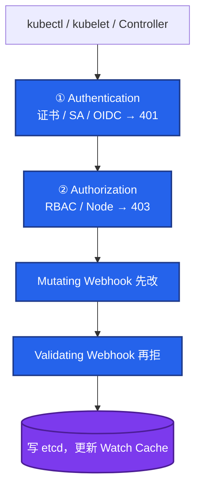
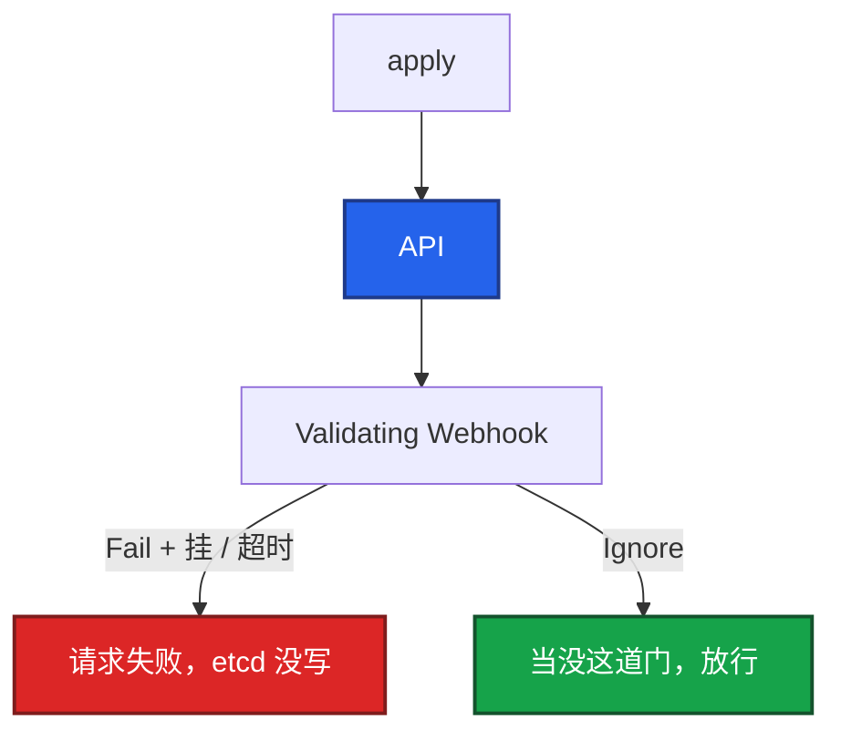
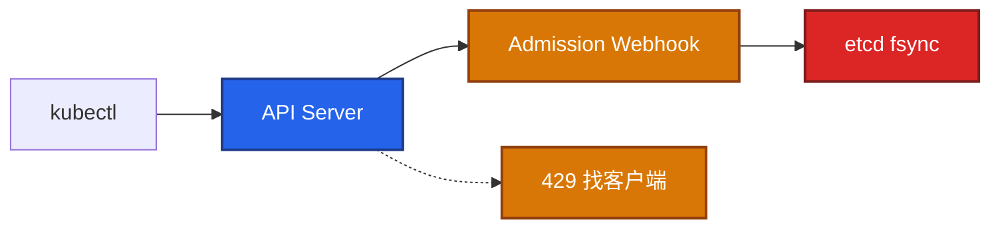
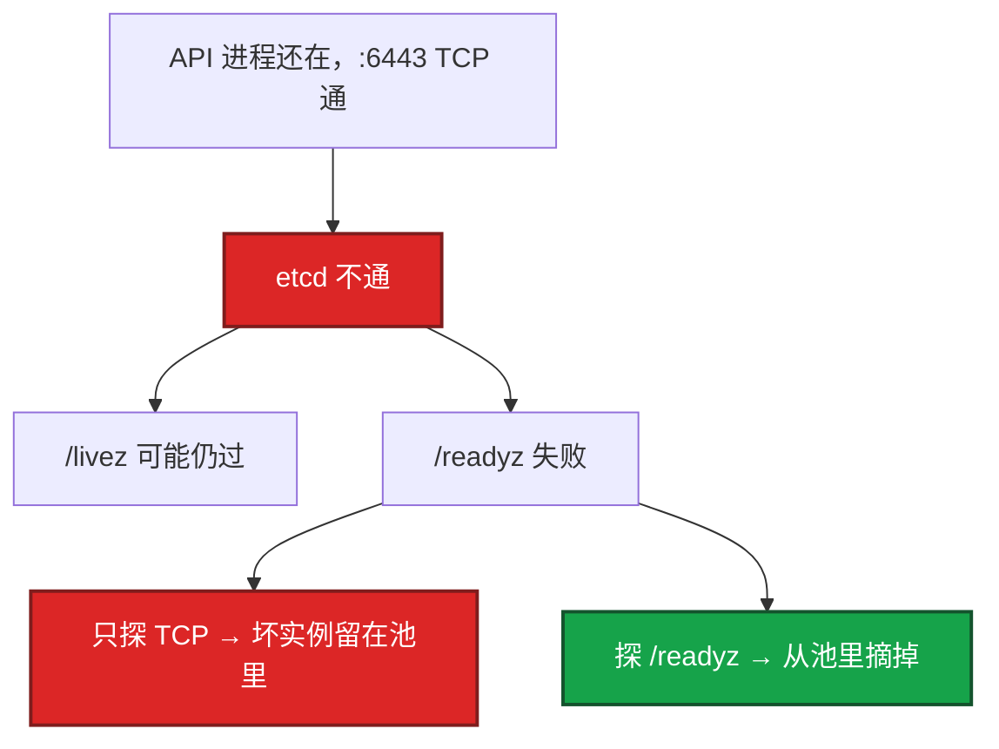
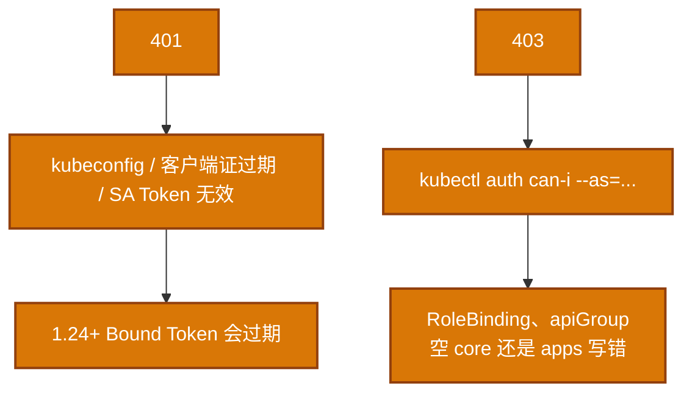
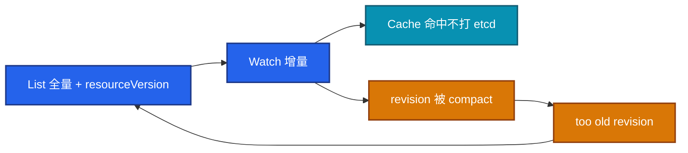
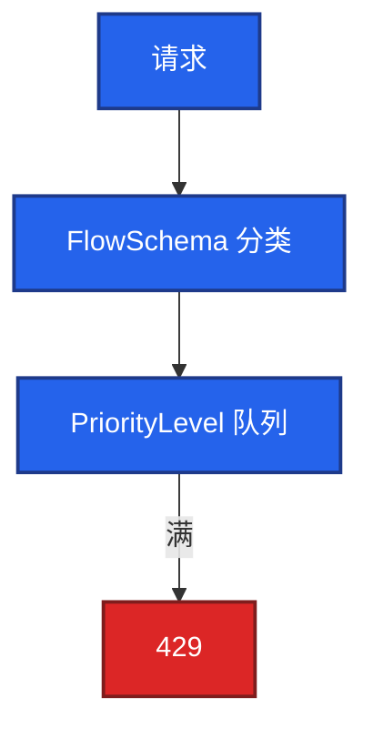
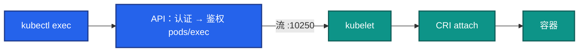

# 03｜API Server · 练习题

先对照 [知识点](知识点.md) **本章主线** 自己口述，再对答案。每题标了覆盖范围：

| 标记 | 含义 |
|------|------|
| **核心** | 不懂整章就没建立起来 |
| **必会** | 值班和面试都要能讲 |
| **常用** | 线上会反复碰到 |
| **常考** | 白板和追问的高频口径 |

## 本题目录

- [Q1 请求链路、鉴权和准入谁先](#q1)
- [Q2 Webhook 配错 / 紧急止血](#q2)
- [Q3 API 慢先怀疑谁](#q3)
- [Q4 LB 必须探 /readyz](#q4)
- [Q5 401 和 403](#q5)
- [Q6 Watch Cache / too old revision](#q6)
- [Q7 429 与 APF](#q7)
- [Q8 exec 怎么走到容器](#q8)
- [Q9 审计 / 证书续了还过期](#q9)
- [Q10 metrics-server / CRD webhook 误伤](#q10)
- [合上书](#合上书)

---

## Q1

**★★★★★｜一个请求经过 API Server 的完整链路？鉴权和准入谁先？**

**覆盖**：核心 · 必会 · 常考
**对应**：知识点 §3.1 三道门

### 场景

开场就问：「从 kubectl apply 到对象进 etcd，中间几道门？鉴权管不管 YAML 合不合规？」有人把 RBAC 和准入混成一件事。

### 完整解答

**一句话**：写路径串行：认证 → 鉴权 → Mutating → Validating → 写 etcd；鉴权不管 YAML 合规。

客户端是 kubectl、kubelet、Controller、Operator，都走同一扇门。API 无状态，数据在 etcd，所以可以多副本 + LB。

三道门串行。**鉴权先，准入后。** 没权限到不了准入。有权限但 YAML 违规，是准入拒。鉴权不管对象合不合规。

LB 必须探 `/readyz`，否则 etcd 断了 TCP 仍通，坏实例留在池里。

### 再追问

- Mutating 和 Validating 为什么这个顺序？——先改再校验，Validating 才能看到注入之后的对象。如果先拒再改，sidecar 字段没人管。

---

## Q2

**★★★★★｜Webhook 配错会怎样？怎么紧急止血？**

**覆盖**：核心 · 必会 · 常考
**对应**：知识点 §3.2 Admission Webhook

### 场景

刚装了一个 Validating Webhook，单副本、`failurePolicy: Fail`。Webhook 服务 OOM。全集群 `kubectl apply` 开始超时。

### 完整解答

**一句话**：`failurePolicy: Fail` 且 Webhook 挂或超时 = 写路径全堵，比业务先焊死集群。

写路径过 Admission。`failurePolicy: Fail` 且 Webhook 超时/挂掉，**创建/更新会被全拒**。比业务还先把集群焊死。

止血：先修 Webhook 服务。紧急窗口（要审批）：临时改 `Ignore`，或删 Configuration。修完改回 Fail。超时建议 <3s，多副本跨节点 + PDB。

PSS、策略引擎、往 Pod 里塞代理，都走这条。规则配太宽会误伤内置资源。

### 再追问

- 改 Ignore 的代价？——策略失效，特权 Pod、latest 镜像可能被放进来。窗口要短，修完改回 Fail。这不是长期方案。

---

## Q3

**★★★★★｜API 慢，你怎么拆？先怀疑谁？**

**覆盖**：核心 · 必会 · 常用
**对应**：知识点 §7 生产排障

### 场景

API P99 从 20ms 跳到 2s。CPU 看起来不忙。刚装了 Webhook，etcd 和业务日志同盘。

### 完整解答

**一句话**：API 慢十次里九次是 etcd 盘 fsync 或 Webhook 超时，不是 API CPU 不够。

写路径上有三处会把「看起来 API 慢」放大，先不要给 API Server 加 CPU（对齐 01、02）：

1. **etcd 磁盘 fsync 慢**（和业务 IO 同盘、云盘突发用尽）
2. **准入 Webhook 超时**（Fail 时 Webhook 挂了写路径一起死）
3. 有人 List 全量、高基数 watch，打满 APF，返回 429

指标：`apiserver_request_duration_seconds`、`etcd_request_duration_seconds`、`apiserver_flowcontrol_rejected_requests_total`、Webhook 延迟。查 `/readyz?verbose`。Event 风暴、无 Watch Cache 的狂 List、慢 Webhook 是三大元凶。

### 再追问

- APF 429 加 API 副本有用吗？——先找到打爆的客户端（坏掉的 CI、错误的 Informer）。只加 API 副本会一起打 etcd。不要无脑加大 inflight。

---

## Q4

**★★★★★｜LB 为什么必须探 /readyz？只探 6443 TCP 会怎样？**

**覆盖**：核心 · 必会 · 常考
**对应**：知识点 §4 安装部署 · §5 核心配置

### 场景

三副本 API，其中一台 etcd 连不上。负载均衡只探 TCP :6443。一部分 kubectl 偶发超时，另一部分正常。

### 完整解答

**一句话**：LB 必须探 `/readyz`；只探 TCP 6443 会把 etcd 不通的坏实例留在池里。

进程在、端口开，不等于这个实例能写。etcd 不通时 TCP 仍通。

- `/livez`：该不该重启进程。
- `/readyz`：能不能进 LB。**生产探这个。**
- `?verbose`：哪一项失败。

托管集群同样：你配的是云 LB 健康检查路径，不要只填端口。

### 再追问

- `/readyz` 失败时已有 Watch 连接怎样？——这台实例上的长 Watch 会断，客户端重连到健康实例。所以坏实例必须从池里摘掉，否则重连可能又打回来。

---

## Q5

**★★★★☆｜401 和 403 怎么查？**

**覆盖**：必会 · 常用
**对应**：知识点 §3.1 三道门 · §7 排障

### 场景

CI 报 `Unauthorized`，另一条流水线报 `Forbidden`。有人说「API 坏了」。

### 完整解答

**一句话**：401 是不知道你是谁；403 是知道你是谁但没权限——不是 API 挂了。

401：不知道你是谁。403：知道你是谁但没权限。不是 API 挂了。

现场 `kubectl get pods -v=9` 能看到真实 HTTP verb 和 URL，确认打的是哪个 apiGroup。规则写歪看起来像「没权限」。

### 再追问

- 匿名请求呢？——生产应 `--anonymous-auth=false`。匿名开着时，没带证的请求可能落到 system:anonymous，再被 RBAC 拒成 403，排障会绕弯。

---

## Q6

**★★★★☆｜Watch 和 Watch Cache 解决什么？too old revision 是故障吗？**

**覆盖**：必会 · 常考
**对应**：知识点 §3.3 Watch Cache

### 场景

Controller 日志里一堆 `too old resource version`。有人要重启 etcd。

### 完整解答

**一句话**：Watch Cache 挡大部分读，写仍必须过 etcd；`too old revision` 是 compact 后正常重 List。

避免每个组件轮询 etcd。List 一次 + Watch 增量；热数据在 API 内存。

`too old revision` 是 compact 后游标过期，重新 List。这不是故障。规模化靠 Cache，不是靠加 etcd 节点。写仍必须过 etcd。

compact 过于激进会让所有 Informer 同时 List，短暂 429。那是窗口问题，见 02。

### 再追问

- 为什么 Controller 不直连 etcd？——安全、一致、限流、审计都在 API。直连会打爆 etcd，也绕过 RBAC。对齐 02。

---

## Q7

**★★★★☆｜429 是什么？加副本够不够？**

**覆盖**：必会 · 常用
**对应**：知识点 §3.4 APF

### 场景

监控组件每 10 秒 List 全集群 Pod。API 开始 429。有人准备把 `--max-requests-inflight` 加倍，再加两台 API。

### 完整解答

**一句话**：429 是 APF 队列满，找肇事客户端限速，不要无脑加 inflight 或只加 API 副本。

APF 或 max-inflight 拒了。先找谁在打，给那路单独限流。

leader-election 应走高优先级，不要和狂 List 挤一条道。只加 API 副本会一起锤 etcd。不要无脑加大 inflight，那只是推迟打爆。默认读 400 / 写 200。

肇事者常见：坏 CI、Informer 写成轮询、监控 List 全集群、Event 风暴。

### 再追问

- 429 和 Webhook 超时怎么区分？——429 是进 API 之前/公平队列被拒，响应码就是 429。Webhook 超时是已经在处理，写路径等准入，表现是请求变慢或失败，码不一定是 429。先看响应码和 FlowSchema 指标。

---

## Q8

**★★★★☆｜kubectl exec 怎么走到容器？为什么 get 可以 exec 不行？**

**覆盖**：必会 · 常用
**对应**：知识点 §3.5 exec / logs

### 场景

`kubectl get pod` 正常，`kubectl exec` 超时。防火墙只放了 6443。

### 完整解答

**一句话**：exec/logs 走 API 再升级到 kubelet :10250，不是 kubectl 直连 Pod IP。

仍先过 API 认证鉴权，再由 API 建到 kubelet 的流，kubelet 调 CRI attach。**不是 kubectl 直连 Pod IP。**

所以：NetworkPolicy 拦 API→kubelet、只放 6443 不放 10250、kubelet 证书坏了，exec 会失败，即使 Pod 是 Running。logs / port-forward 同一条路。

### 再追问

- exec 要不要过准入 Webhook？——exec 是连到已有 Pod 的子资源，主要卡在鉴权（pods/exec）和到 kubelet 的流。创建 Pod 才走完整 Mutating/Validating。别把「exec 失败」第一刀开在 Webhook 上。

---

## Q9

**★★★☆☆｜审计日志为什么生产必开？证书续了为什么还是过期？**

**覆盖**：必会 · 常用 · 常考
**对应**：知识点 §5 核心配置 · §6 命令

### 场景

Secret 被读走过，要追是谁。审计没开。另一边 `kubeadm certs renew` 之后 API 还是报证过期。

### 完整解答

**一句话**：审计必开尤其 Secret；`kubeadm certs renew` 后必须重启静态 Pod 才加载新证。

出事要回答谁在何时对 Secret/RBAC 做了什么。没有审计只能猜。Secret 单独提高 level（RequestResponse 或至少 Metadata）。全量 RequestResponse 会很大，按资源分级。审计写满盘会反噬 API，要轮转。

证书：`kubeadm certs renew` 续的是磁盘上的 pem，**必须重启静态 Pod** 才会加载。托管集群跟厂商文档，不要套 kubeadm。监控剩余天数，过期当天是控制面 P0。

### 再追问

- 匿名、共享 admin kubeconfig、无审计，为什么一起被追？——这三件说明没人把控制面当生产系统管。共享 admin 无法追责；匿名扩大攻击面；无审计出事只能猜。

---

## Q10

**★★★☆☆｜metrics-server 挂了，是 API 挂了吗？CRD webhook 会误伤吗？**

**覆盖**：常用 · 常考
**对应**：知识点 §3.2 · §7 排障

### 场景

`kubectl top` 失败，HPA 显示 unknown。群里有人说控制面挂了。另一边某个 CRD 的 conversion webhook 超时，连内置 Deployment 也创建失败。

### 完整解答

**一句话**：metrics-server 挂了只影响 `top` 和资源 HPA；Webhook 规则配太宽会误伤内置资源。

metrics-server 走 Aggregation（APIService），挂了只影响 `top` 和资源指标 HPA（07）。**业务对象仍可读写。** 别把「top 不行」说成「API 挂了」。用 `/readyz` 和 `kubectl get deploy` 自证。

CRD 注册失败或 conversion webhook 超时，本来只影响那一类自定义资源。但 webhook 的 `rules` 配太宽（比如匹配了所有 pods/deployments），会误伤内置资源创建。排障先 `get validatingwebhookconfiguration,mutatingwebhookconfiguration`，看规则范围和 failurePolicy。

### 再追问

- Aggregation 挂了 429 会怎样？——扩展 API 的超时会占 inflight。metrics-server 抖，可能拖慢带 `top` 的客户端，但不应该让核心资源写路径全死。核心写路径死，优先查 etcd 和管内置资源的 Webhook。

---

## 合上书

- [ ] 能画出认证 → 鉴权 → Mutating → Validating → etcd，并说明鉴权不管 YAML 合规
- [ ] 能说出 Webhook Fail + 服务挂 = 写路径焊死；Ignore 是窗口不是长期方案
- [ ] 能把 API 慢拆成 etcd 盘 / Webhook / APF 429，不先给 API 加核
- [ ] 能说明 LB 必须探 `/readyz`；exec 走 API→kubelet :10250
- [ ] 能区分 401/403/429；Watch Cache 挡读、写仍过 etcd；too old revision 重新 List
- [ ] 能说证书续完要重启静态 Pod；审计尤其 Secret；top 失败不是 API 挂了
