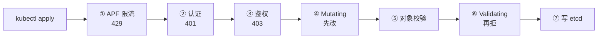
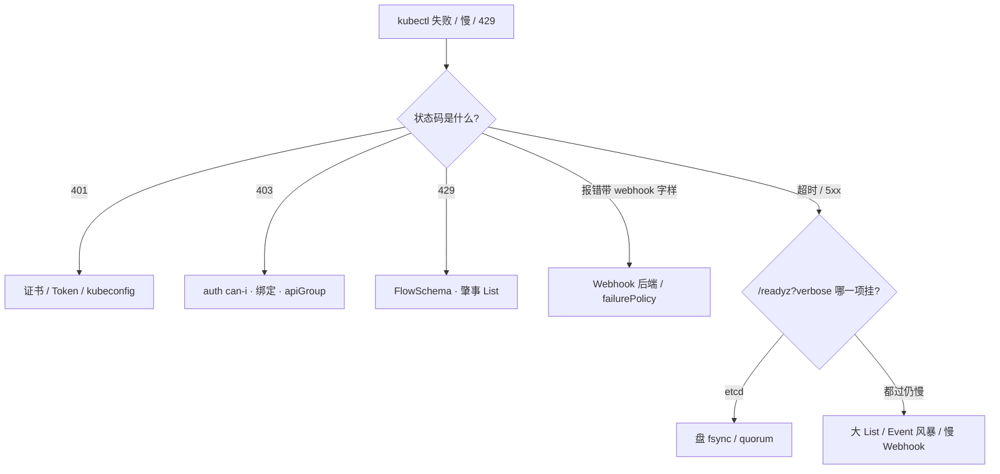
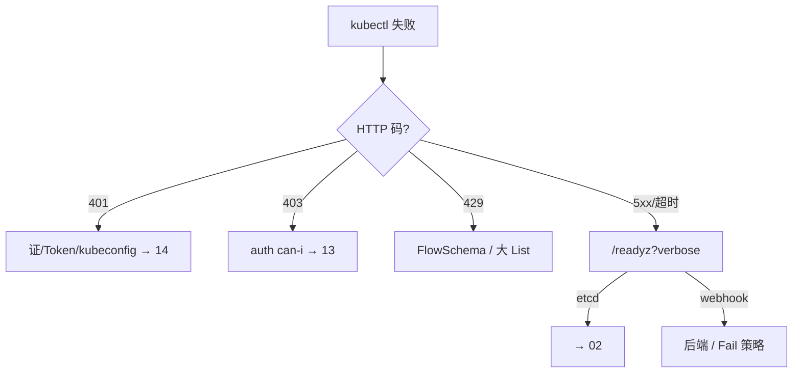

# 03｜API Server · 练习题

先合上知识点，对着 **一节的主图** 把「一次 API 请求的一生」口述一遍，再来做题。

| 标记 | 含义 |
|------|------|
| **核心** | 不懂整章就没建立起来 |
| **必会** | 值班和面试都要能讲 |
| **常用** | 线上会反复碰到 |
| **常考** | 白板和追问的高频口径 |

## 本题目录

- [Q1 一次 apply 到 etcd 走几步](#q1)
- [Q2 认证方式与 401](#q2)
- [Q3 403 与 RBAC 排查](#q3)
- [Q4 Mutating 与 Validating 的顺序](#q4)
- [Q5 Webhook Fail 焊死写路径](#q5)
- [Q6 429 与 APF](#q6)
- [Q7 API 慢了先怀疑谁](#q7)
- [Q8 watch 与 too old resource version](#q8)
- [Q9 exec 是怎么进容器的](#q9)
- [Q10 LB 该探什么](#q10)
- [Q11 API 挂了业务会死吗](#q11)
- [Q12 谁删了 namespace](#q12)
- [Q13 top 失败与 CRD webhook 误伤](#q13)
- [Q14 60 秒 API 定责剧本](#q14)
- [合上书](#合上书)

---

## Q1

**★★★★★｜「从 kubectl apply 到对象进 etcd，一共经历哪些步骤？」**

**覆盖**：核心 · 常考 ｜ **对应**：知识点 [一、一张图：一次请求的一生](知识点.md)、[五、准入：先改，再拒](知识点.md)

### 场景

面试官从最基础的一刀切入，考的是整章的骨架。很多人只答出「认证鉴权准入」三个词，说不清顺序，也不知道每步失败会是什么状态码——还有人把对象校验、审计和 APF 全漏了。

### 完整解答

> 🎯 **一句话**：先排队，再认人、授权，然后改一遍、查一遍，才准落 etcd。

写请求的完整链路七道关串行：**① APF 限流**（按优先级排队，队列满则 429）→ **② Authentication 认证**（你是谁，失败 401）→ **③ Authorization 鉴权**（能不能干，失败 403）→ **④ Mutating 准入**（内置插件 + Webhook，先改对象）→ **⑤ 对象校验**（字段合法性，`Invalid value` 拒在这）→ **⑥ Validating 准入**（再拒，任一拒 = 整体拒）→ **⑦ 写 etcd**，resourceVersion 前进，watch cache 更新并推给订阅者。旁路还有**审计**，`RequestReceived` 和 `ResponseComplete` 各记一条。



记忆分组：前三道管「请求有没有资格往下走」（限流、认人、授权），中三道管「对象本身合不合规」（改、校、拒），最后一道才落盘，审计是全程旁路录像。

> 📝 **面试**：背完八步再补两句——「鉴权只管能不能干，不管 YAML 合不合规」「任何一道失败，etcd 里就没有这次变更」，这两句是区分背过和真懂的分水岭。

### 再追问

**追问一：鉴权管不管 YAML 写得合不合规？**

不管。鉴权只回答「这个身份能不能做这个动作」，对象合不合规是准入和校验的事——没权限的请求根本到不了准入。所以 403 去查 RBAC，`Invalid value` 去查对象字段，别互相开错药。

**追问二：读请求（get / list / watch）也走全七道关吗？**

不走。读请求只走左半段：APF → 认证 → 鉴权，过了之后大多命中 watch cache 直接返回，不打 etcd；写才必须一路走到落盘。

---

## Q2

**★★★★｜「API 的认证方式有哪些？发版窗口 kubectl 突然全 401，你怎么查？」**

**覆盖**：必会 · 常用 ｜ **对应**：知识点 [三、认证：你是谁](知识点.md)

### 场景

发版高峰，跳板机上所有 kubectl 报 401，群里喊「API 挂了」，有人已经准备重启 API——其实 401 只是「不知道你是谁」，请求连门都没进，跟有没有权限无关。

### 完整解答

> 🎯 **一句话**：四种认证方式看凭据；401 先查证书和 Token，别碰 API。

四种主流方式，值班要能按凭据认人：

- **X.509 客户端证书**：kubeconfig 里最常见，CN 是用户、O 是组；过期就是 `x509: certificate has expired` + 401。
- **Bearer Token**：请求头带令牌；静态文件方式是老玩法。
- **ServiceAccount Token**：Pod 内程序的身份。1.24+ 默认是 **Bound Token**，小时级过期、kubelet 自动轮换，且不再自动创建永不过期的旧式 secret——老脚本抠出来缓存的旧 token 到期就 401。
- **OIDC（OpenID Connect）**：对接统一登录，签发方配置在 `--oidc-issuer-url`。

401 的排查动作：

```bash
kubectl get pods -v=9 2>&1 | grep -E 'GET|POST|Unauthorized'
# I0901 ... GET https://10.0.0.1:6443/api/v1/namespaces/prod/pods 401 Unauthorized in 3ms
#               # ← 认证失败，请求没进门；先定位是谁的凭据

kubeadm certs check-expiration
# CERTIFICATE  EXPIRES IN
# apiserver    12d                    # ← 剩 <14 天就该当 P1 排期
```

> ⚠️ **别混**：生产必须 `--anonymous-auth=false`。匿名开着，没带凭据的请求不会 401，而是落到 `system:anonymous` 再被 RBAC 拒成 403——排障的人会绕到权限上去，查半天才发现是凭据压根没带上。

### 再追问

**追问一：`kubeadm certs renew all` 之后为什么还报 401？**

renew 只换了磁盘上的 pem，API 进程内存里还是旧证书——**必须重启静态 Pod**（kubelet 监控 `/etc/kubernetes/manifests/kube-apiserver.yaml`，删 Pod 让它重建）新证书才生效。不要反复 renew 碰运气，也不要因此去重启 etcd。

**追问二：401 和 403 怎么一刀分清？**

401 = 不知道你是谁（认证，查证书 / token / kubeconfig）；403 = 知道你是谁但不许干（鉴权，`auth can-i` 查 RBAC）。把 403 当证书问题去续期，是最常见的绕弯路。

---

## Q3

**★★★★｜「CI 发版报 403，cannot patch resource "deployments" in API group "apps"，你怎么排查？」**

**覆盖**：必会 · 常考 ｜ **对应**：知识点 [四、鉴权：你能不能干](知识点.md)

### 场景

CI 账号昨天还能发版，今天 403。有人第一反应是「账号被删了」准备重建，也有人去查网络——报错信息里其实已经把身份、动词、资源、组全写出来了，照着查就行。

### 完整解答

> 🎯 **一句话**：403 说明认证已过，按「can-i → 绑定 → 三要素」三步查。

```bash
kubectl auth can-i patch deployments --as=system:serviceaccount:ci:deploy-bot -n prod
# no                                                    # ← 一锤定音：是 RBAC，不是 Webhook

kubectl get rolebinding,clusterrolebinding -A | grep deploy-bot
# ← 看绑了什么：常见是没绑定、绑错 namespace、或 apiGroup 写成 "" 而不是 apps
```

RBAC 四个对象：Role（命名空间内权限集）配 RoleBinding；ClusterRole / ClusterRoleBinding 是集群级。一条规则三要素：**apiGroup + 资源 + 动词**。两个高频坑：① `kubectl apply` 走的是 **patch**，只给了 `update` 的 SA 照样被拒；② Deployment 在 `apps` 组，规则写成 core 组（`""`）等于没授权。拿不准就 `-v=9` 看真实请求打的 URL 和动词。

> 📝 **面试**：403 三步口径——`auth can-i --as=<身份>` 确认是 RBAC；查绑定（绑没绑、绑在哪个命名空间）；对三要素（apiGroup / 资源 / 动词，含 `pods/exec` 这种子资源写法）。补一句「RBAC 只增不减，所有授权器都不反对才放行」。

### 再追问

**追问一：给了 get 却没给 pods/exec，现象是什么？**

`kubectl get pod` 正常，`kubectl exec` 报 403，信息里写着 `cannot create resource "pods/exec"`——exec 的鉴权对象是子资源，动词是 **create**。不要第一刀开在 Webhook 上。

**追问二：怎么验证一个授权「生效了」而不是「看起来配对了」？**

就用 `kubectl auth can-i --as=...` 以目标身份实测，不要只读 YAML。不要为了「快速解决」给 SA 绑 cluster-admin——那是把问题从权限变成安全事故。

---

## Q4

**★★★★｜「Mutating 和 Validating 的区别？为什么必须先改再拒？内置准入插件呢？」**

**覆盖**：必会 · 常考 ｜ **对应**：知识点 [五、准入：先改，再拒](知识点.md)

### 场景

面试官顺着写路径往下问。常见答法是「一个改一个拒」就完了，说不清顺序的原因，更不知道内置插件和 Webhook 是两套东西。

### 完整解答

> 🎯 **一句话**：Mutating 改对象、Validating 只放行或拒绝；先改再拒是因为后者要审查改完的对象。

| 对比 | MutatingAdmissionWebhook | ValidatingAdmissionWebhook |
|------|--------------------------|----------------------------|
| 干什么 | **可以改对象**：注 sidecar、补 label、填默认值 | **只能放行或拒绝**，不许改 |
| 顺序 | 先跑（串行） | 后跑（并行，任一拒 = 整体拒） |
| 返回 | JSONPatch 补丁 | allowed: true/false |

顺序是铁律：Validating 必须看到「被 Mutating 改完之后的对象」，否则注入的 sidecar 字段没人审查。对象校验（字段合法性）夹在两者中间，所以拒绝信息要会认：`Invalid value` 是校验拒，`admission webhook "xxx" denied the request` 才是 Webhook 拒。

除了 Webhook 还有**内置准入插件**：`--enable-admission-plugins` 开关，编译进 API。典型如 **NamespaceLifecycle**（禁止在不存在的命名空间建对象、保护系统命名空间不被删）、ResourceQuota、LimitRanger、PodSecurity、NodeRestriction。

> ⚠️ **别混**：不要随便摘内置插件——摘掉 NamespaceLifecycle 等于少一道内置门，误删系统命名空间的事故就是这么来的。

### 再追问

**追问一：一个请求过了鉴权，说明它一定能写进 etcd 吗？**

不一定。鉴权只管资格，后面还有准入和校验；对象不合规照样被拒。反过来，没权限到不了准入，所以「鉴权不管合规」和「合规不归鉴权管」要一起说。

**追问二：要不要把公司所有安全策略都做成 Webhook？**

不要。能用内置插件和 PSS / 配额解决的就不要上 Webhook——每个 Webhook 都是写路径上的同步依赖，多一个就多一个焊死写路径的机会。

---

## Q5

**★★★★★｜「全集群创建全失败，报 failed calling webhook，怎么止血？」**

**覆盖**：核心 · 必会 · 常考 ｜ **对应**：知识点 [五、准入：先改，再拒](知识点.md)

### 场景

发版高峰，策略组 Webhook 单副本被驱逐，全集群写操作失败。有人喊给 API 加核，有人准备重启 etcd——方向全错：这是 `failurePolicy: Fail` 把写路径焊死了，API 本身没病。

### 完整解答

> 🎯 **一句话**：先修 Webhook 副本，救不回来才临时 Ignore，修完必须改回。

```bash
kubectl apply -f hall.yaml
# Error from server (InternalError): ... failed calling webhook "validate-image.example.com":
# Post "https://policy-webhook.policy.svc:443/validate?timeout=3s":
# dial tcp 10.96.88.12:443: connect: connection refused
#               # ← 已过认证鉴权，卡在准入；refused = 后端没有可用 Pod

kubectl get validatingwebhookconfiguration -o custom-columns=\
NAME:.metadata.name,FAIL:.webhooks[0].failurePolicy,TIMEOUT:.webhooks[0].timeoutSeconds
# NAME                          FAIL    TIMEOUT
# validate-image.example.com    Fail    3          # ← Fail + 后端挂 = 写路径焊死
```

`failurePolicy: Fail` = Webhook 不可达时请求直接失败（适合安全红线）；`Ignore` = 当没这道门放行（策略静默失效）。止血顺序：① 拉 Webhook 副本；② 紧急窗口内（要审批）临时改 Ignore 或删掉 Configuration，**修完必须改回 Fail**；③ 别动 API。

**部署纪律四条**：`timeoutSeconds` 建议 小于 3 秒（默认 10s 太长）；多副本 + PDB；rules 精确，别写 `*`；用 namespaceSelector 排除 kube-system 和 Webhook 自己的命名空间——否则 Webhook 自己重建时被自己拦住，形成「越挂越起不来」的死锁。

> ⚠️ **别混**：改 Ignore 的代价要写在审批单上——策略失效期间，特权 Pod、`latest` 镜像可能被放进来。Ignore 是止血不是方案。

### 再追问

**追问一：为什么不直接给 API 加核或加副本？**

因为瓶颈不在 API——写请求是同步等 Webhook 返回的，API 再多也是排队等一个不接电话的人。不要重启 API，更不要动 etcd。

**追问二：CRD 的 conversion webhook 超时会炸多大范围？**

只影响**那一类**自定义资源。但如果它的 `rules` 配太宽匹配到 pods / deployments，就会误伤内置资源——排障先列两个 Configuration 看规则范围，再下结论。

---

## Q6

**★★★★｜「交互 kubectl 偶发 429，怎么办？给 API 加副本行吗？」**

**覆盖**：必会 · 常考 ｜ **对应**：知识点 [六、限流：APF 与 429](知识点.md)

### 场景

发版期间值班同学的 kubectl 时好时坏，429 偶发。有人提议加大 `--max-requests-inflight`，有人说多扩两个 API 副本——两个都会把问题搞大。

### 完整解答

> 🎯 **一句话**：429 是 APF 队列满——找肇事者限速，不加 inflight、不只加副本。

**APF（API Priority and Fairness）** 靠两类对象配合：**FlowSchema** 负责分类（按身份 + 资源把请求匹配到某个优先级），**PriorityLevelConfiguration** 负责配额（每个优先级分到并发额度，内部公平排队，队列满就拒）。

```bash
kubectl get flowschema
kubectl get --raw /metrics | grep apiserver_flowcontrol_rejected_requests_total
# apiserver_flowcontrol_rejected_requests_total{flow_schema="catch-all",reason="queue-full"} 2741
#               # ← 哪个 FlowSchema 在拒、拒了多少
```

三大元凶：失控组件狂 List 全集群（把 informer 写成轮询）、Event 风暴（大量 Pod 同时异常）、慢 Webhook 占用写并发。**不要加大 inflight**（默认读 400 / 写 200，加大只是推迟打爆 etcd），也**不要只加 API 副本**（副本越多并发锤 etcd 越多）——正确动作是给肇事者限速：修组件、改 informer、单独配 FlowSchema 压优先级。leader-election 有专属高优先级，就是为了让狂 List 的组件别把选主也拖死。

> 📝 **面试**：三步口径——① 认码，429 是 APF 拒，不是 Webhook 超时（那是 5xx / 变慢）；② 找肇事，`get flowschema` + 拒绝指标；③ 治肇事，限速或修，不硬加资源。

### 再追问

**追问一：429 和 Webhook 拖慢怎么区分？**

429 有明确状态码，来自 APF；Webhook 拖慢是写请求整体延迟上升或 `failed calling webhook ... context deadline exceeded`，码是 5xx。一个查限流路，一个查两个 WebhookConfiguration，方向不同。

**追问二：为什么不能干脆把限流关了？**

不要动限流配置去「保发版」——限流是保护 etcd 的最后一道闸，关了等于让失控客户端直接锤 etcd，故障从「有人 429」升级成「全集群写挂」。

---

## Q7

**★★★★｜「API 很慢，你先怀疑谁？」**

**覆盖**：必会 · 常用 ｜ **对应**：知识点 [十、作战：定责](知识点.md)

### 场景

凌晨告警：API P99 飙升，发版全部超时。有人开始给 API 加 CPU，有人准备重启——「先加核」和「先重启」都是错的第一步，慢的根因大概率不在 API 自己。

### 完整解答

> 🎯 **一句话**：先分诊再动手——看码、看 readyz，然后才轮到 Webhook 和 etcd。



按码分诊是第一刀：401 查凭据、403 查 RBAC、429 查 APF、带 webhook 字样查准入。没有码（超时 / 5xx）才看 `/readyz?verbose`：etcd 项红就去查盘和 quorum；都过仍慢，想三大元凶（狂 List、Event 风暴、慢 Webhook），用 `-v=9` 看慢在哪一段、用 `apiserver_request_duration_seconds` 看分位。**不要先加 CPU**——加核治不了慢 Webhook 和满队列。

### 再追问

**追问一：活动高峰、审计和 etcd 同盘的集群，这套流程有什么变化？**

先确认 API 进程还在 → 停发版 → 按分支救盘 / Webhook / APF。同盘集群要想到审计写满盘反噬 etcd 这条暗线。**不要重启业务逻辑服**——已跑的 Pod 本不受影响，乱重启才真掉线。

**追问二：为什么不直接重启 API 试试？**

重启是有损操作：所有长 watch 断开重连，恢复瞬间重连风暴可能直接打出 429。多副本集群先摘坏实例（靠 `/readyz` 探针），单副本也先定责再重启——「重启大法」在这章是最后手段，不是第一手段。

---

## Q8

**★★★★｜「什么是 watch cache？控制器报 too old resource version 是不是 etcd 坏了？」**

**覆盖**：必会 · 常考 ｜ **对应**：知识点 [七、读路：watch 与 watch cache](知识点.md)

### 场景

Controller 日志刷 `too old resource version`，有人准备重启 etcd、有人要去 restore 备份——这是把正常的自愈机制当成了数据事故。

### 完整解答

> 🎯 **一句话**：watch cache 挡大部分读，写仍过 etcd；too old 是重新 List，不是损坏。

**List-Watch** 模式：客户端先 List 拿全量并记下 **resourceVersion**（本质是 etcd 的全局递增 revision），再开长连接 watch 增量，只收变化不再拉全量。client-go 里封装这套的就是 **informer**：本地维护缓存，增量持续合入，业务代码注册回调。

**watch cache** 在 API Server **内存**里：etcd 变更先写进它，再推给订阅者；大多数读从这里服务，不打 etcd。写方向没有任何缓存——每次写都同步落 etcd。

etcd 定期 **compact**（kubeadm 默认 `--auto-compaction-retention=5m`）压缩历史，游标落后到被压缩区间，这条 watch 只能作废：

```bash
kubectl logs -n kube-system -l component=kube-controller-manager --tail=50 | grep -i "too old"
# watch of *v1.Pod ended with: too old resource version: 1234567 (1234890)
#               # ← 客户端落后约 323 个 revision，游标已被 compact；informer 重 List 自愈
```

> ⚠️ **别混**：`too old` ≠ etcd 损坏，不要去 restore；也别把「读着慢」当 etcd 写慢——读慢看 cache 和大 List，写慢看 etcd fsync。还有一个连带坑：compact 太激进会让大批 informer 同时重 List，瞬间打满 API 打出短暂 429——那是窗口配置问题，不是新故障。

### 再追问

**追问一：为什么控制器不直连 etcd？**

不要直连：安全（RBAC / 审计）、限流（APF）、一致性都只在 API 这一层，直连等于全部绕过，还会把 etcd 打爆。规模化的方向是把读从 etcd 卸到 watch cache，不是给组件开后门。

**追问二：全量 List 有什么风险？怎么省？**

对象多时一次 `get pods -A` 能吃几百 MB 内存，还可能把 API 打出延迟尖峰。工程上用 informer 不要轮询；必须 List 用分页（`limit` + `continue`）并过滤命名空间 / label。

---

## Q9

**★★★｜「kubectl exec 的请求是怎么进容器的？get 可以 exec 不行，为什么？」**

**覆盖**：常用 ｜ **对应**：知识点 [二、进门：唯一的门，唯一碰 etcd 的人](知识点.md)

### 场景

开发同学反馈：能看 Pod，进不去容器。有人第一刀开在 Webhook 上，有人让他直连 Pod IP——方向都不对。

### 完整解答

> 🎯 **一句话**：exec 从 6443 进门，认证鉴权后由 API 反代升级到 kubelet :10250，不是直连。

```bash
kubectl exec -it hall-7d8f9c-abc12 -n prod -- /bin/sh
# Error from server (Forbidden): pods "hall-7d8f9c-abc12" is forbidden:
# User "dev-alice" cannot create resource "pods/exec" in API group "" in the namespace "prod"
#                                                    # ← 鉴权对象是子资源 pods/exec，动词是 create
```

链路：kubectl → API（认证 + 鉴权 `create pods/exec`）→ **API 反代升级成到目标节点 kubelet `:10250` 的流** → kubelet 调 CRI attach 进容器。「get 可以、exec 不行」只有三种可能：① RBAC 没给 `pods/exec`（403）；② API → 节点的 10250 被防火墙拦了（只放 6443 的经典坑）；③ kubelet 证书坏了。

### 再追问

**追问一：exec 会不会触发 Mutating / Validating？**

不会。exec 连的是已存在的 Pod，不走完整的准入链——把它的失败怪到 Webhook 头上是方向错误。它走的只有认证、鉴权，然后是代理升级。

**追问二：为什么不设计成 kubectl 直连 Pod IP？**

不要绕过控制面：直连就没有认证鉴权、没有审计、跨网络平面还要打通客户端到 Pod 网段的路由。走 API 这一跳，安全账和排障账才都算得清。

---

## Q10

**★★★★｜「负载均衡该怎么配健康检查？探端口行不行？」**

**覆盖**：必会 · 常用 ｜ **对应**：知识点 [二、进门：唯一的门，唯一碰 etcd 的人](知识点.md)

### 场景

一台 API 实例背后的 etcd 连接断了，进程还活着，用户请求随机打到它就超时。运维一看「端口通着呢」，排了一晚上没找到方向——问题就在 LB 只探了 TCP 端口。

### 完整解答

> 🎯 **一句话**：LB 必须探 `/readyz`；只探端口会把坏实例留在池里。

三个探针端点分工：`/livez` 问「进程活着吗」，是 kubelet 决定要不要重启静态 Pod 的依据；`/readyz` 问「现在敢接流量吗」（含 etcd 连通、启动钩子完成），**是 LB 该探的这个**；`/readyz?verbose` 逐项列出哪一项挂了。

```bash
kubectl get --raw /readyz?verbose
# [+]ping ok
# [+]etcd ok                 ← 这行变 failed：进程活着，但 etcd 不通
```

etcd 抖动时 `:6443` 照样 accept 连接，TCP 探针永远绿灯——坏实例一直留在池里，用户随机打到就超时。探 `/readyz` 才会把它踢出去；挂在它上面的长 watch 断开后，客户端自动重连到健康实例。

> ⚠️ **别混**：`/livez` 过了 ≠ 能服务。只探 `/livez` 或 TCP，坏实例永远摘不掉。

### 再追问

**追问一：实例被摘除后，原来的 watch 连接会怎样？**

会断。客户端（informer）自动重连到健康实例继续——所以摘慢了就反复重连。这也解释了为什么不要手动重启健康实例：重启瞬间所有长连接断掉重连，反而制造重连风暴。

**追问二：托管集群里这些端点还归你管吗？**

控制面实例归厂商，但云 LB 的健康检查**路径**经常要你自己配——配成 TCP 端口就是同一个坑。不要套用 kubeadm 的命令去动托管控制面。

---

## Q11

**★★★★｜「API Server 全挂了，业务会死吗？哪些坏哪些不坏？」**

**覆盖**：必会 · 常考 ｜ **对应**：知识点 [二、进门：唯一的门，唯一碰 etcd 的人](知识点.md)

### 场景

控制面告警全红，群里喊「业务全挂了，赶紧重启业务服」——这句话本身就是误操作：已运行的 Pod 根本不依赖 API。

### 完整解答

> 🎯 **一句话**：已跑的 Pod 继续跑；一切「变更」停摆——救控制面，别动业务。

先分清范围：多副本 + LB 时，单实例挂掉几乎无感，请求和 watch 切到其余实例；真正要背的是**全部副本不可用**。

- **不坏**：节点上已运行的 Pod 继续跑——容器由 kubelet 和运行时管，不依赖 API；玩家不掉线，战斗照打。
- **坏**：一切变更停摆——新 Pod 建不了、调度器无法 bind、控制器无法纠错（副本少了没人补）、扩缩容失效、发版冻结、kubectl 全报错；所有 informer 断 watch，恢复瞬间重连风暴。

所以正确反应是救控制面：查进程、查 LB 摘除、查静态 Pod，**不是去重启业务逻辑服**——乱重启反而把本不受影响的玩家真踢了。

### 再追问

**追问一：为什么 API 敢做成无状态、多副本？**

会话和对象状态全在 etcd，进程本身不存东西，所以挂一个实例请求切走即可。也正因为唯一碰 etcd 的是它，其他组件才都必须只跟它说话——「唯一入口」和「无状态」是一体两面。

**追问二：恢复之后要小心什么？**

不要一次性把所有客户端放回来：所有 informer 同时重连 + 重 List 会打出请求风暴。恢复后先观察 429 和 API 延迟，必要时分批恢复发版——不要因为「好了」立刻恢复全量变更。

---

## Q12

**★★★★｜「昨晚有人删了测试服 namespace，没人认，你怎么查？」**

**覆盖**：必会 · 常用 ｜ **对应**：知识点 [九、审计：谁删了 namespace](知识点.md)

### 场景

测试服被删，群里没人认领。没开审计的集群只能靠猜和互相指认——这题考的是审计的价值和配置细节。

### 完整解答

> 🎯 **一句话**：查审计日志的 delete 记录；没开审计，这种问题只能靠猜。

**审计日志**是 API 的全程录像：`RequestReceived` 和 `ResponseComplete` 各记一条，含身份、动词、资源、来源 IP。

```bash
grep '"verb":"delete"' /var/log/kubernetes/audit.log | grep '"resource":"namespaces"'
# {"verb":"delete","user":{"username":"dev-bob"},
#  "objectRef":{"resource":"namespaces","name":"staging"},
#  "stage":"ResponseComplete","requestReceivedTimestamp":"2026-08-31T23:41:07Z"}
#               # ← user.username 就是谁
```

策略四级：**None**（不记）/ **Metadata**（只记元数据）/ **Request**（加请求体）/ **RequestResponse**（连响应体）。**Secret 必须单独压到 Metadata**——级别越高记录越全，Request 级会把 Secret 内容原样写进审计日志，等于二次泄漏。还要配轮转（`--audit-log-maxage / maxsize`），审计和 etcd 同盘时写满会反噬控制面。

> 📝 **面试**：口径四件事——必开（否则出事只能猜）；Secret 用 Metadata；轮转防写满；顺带一提 etcd 里 Secret 默认明文，静止加密靠 API 的 `--encryption-provider-config`，不是 etcd 的机制。

### 再追问

**追问一：共享 admin 账号 + 没开审计，事故调查会是什么下场？**

查不出人。不要多人共用一个高权限账号——用各自的 SA / 用户身份，审计才追得到人；没有审计就把「事后定责」变成「集体背锅」。

**追问二：全量开 RequestResponse 行不行？**

不要。体积巨大、敏感内容全落盘，还占盘。按资源分级：核心变更类开到 Request，Secret 压 Metadata，高频只读保持 Metadata 或 None。

---

## Q13

**★★★｜「kubectl top 全挂了，是 API 挂了吗？CRD 的 webhook 超时影响多大？」**

**覆盖**：常用 ｜ **对应**：知识点 [八、扩展：聚合 API 与 CRD](知识点.md)

### 场景

HPA 显示 unknown、`kubectl top` 报错，群里喊控制面挂了——其实只是聚合进来的 metrics-server 挂了，业务对象读写一个不少。

### 完整解答

> 🎯 **一句话**：top 失败 ≠ API 挂了；聚合扩展挂只影响那一个 API 组。

两条扩展路：**CRD** 在 API 里注册新资源类型，对象仍存同一个 etcd；**Aggregated API** 注册一个 **APIService**，把某个 API 组的请求反向代理到独立服务器——最典型就是 metrics-server（`metrics.k8s.io`），数据不进 etcd。

```bash
kubectl get apiservices | grep -v True
# v1beta1.metrics.k8s.io   kube-system/metrics-server   False (FailedDiscoveryCheck)   20m
#               # ← 扩展不可用：只影响 metrics 这一个组

kubectl get deploy hall -n prod
#               # ← 业务对象照常读写：API 本身没挂
```

**影响面说死**：metrics-server 挂了只影响 `kubectl top` 和依赖资源指标的 HPA；核心写路径死了，优先查 etcd 和管内置资源的 Webhook，别先怀疑扩展——但扩展的慢请求也会占 API 并发，可能拖慢访问它的客户端。

### 再追问

**追问一：conversion webhook 超时和它是一回事吗？**

不是。conversion webhook 是 CRD 多版本转换，超时**只影响那一类自定义资源**；但若它的 `rules` 配太宽匹配到内置资源，就会误伤——判断影响面先看规则范围。不要把「top 挂了」和「CRD 挂了」混成「API 挂了」。

**追问二：要不要把自建业务接口也接成聚合 API？**

不要。聚合意味着另一个常驻服务器的可用性直接并进控制面的可用性账——大多数场景用 CRD + 控制器就够，不要为了「看起来原生」引入新的单点。

---

## Q14

**★★★★★｜60 秒：从状态码到根因，API 故障你怎么分流？**

**覆盖**：核心 · 必会 · 常用 ｜ **对应**：知识点 [十、作战：定责](知识点.md)

### 场景

四张单同时来：401、403、429、5xx 超时。新人准备「重启 apiserver 三件套」。

### 完整解答

> 🎯 **一句话**：先看码再 readyz：401→认证；403→RBAC；429→APF；5xx→etcd/Webhook；**不加核、不盲重启**。



```bash
kubectl get --raw '/readyz?verbose' | grep -v ok
kubectl get flowschema,prioritylevelconfiguration
kubectl auth can-i create deployments --as=system:serviceaccount:ci:bot -n prod
```

> 📝 **面试**：两个不要——**不要**给 API 加核救 etcd 盘慢；**不要**把 403 当 renew 证。

### 再追问

metrics-server 挂了算 API 挂吗？——`metrics.k8s.io` APIService False 只影响 `kubectl top`/HPA 指标路，6443 核心读写仍在（八节）。

---

## 合上书

- [ ] **默画主图**：一次请求的一生——APF → 认证 → 鉴权 → Mutating → 校验 → Validating → 写 etcd → watch 推送，并说出每关的死法（429 / 401 / 403 / 拒绝）。
- [ ] **口述进门**：为什么是唯一入口、唯一碰 etcd、敢做无状态多副本；LB 为什么必须探 `/readyz`；API 全挂时什么坏什么不坏。
- [ ] **口述认证**：四种方式各认什么凭据、401 查什么、匿名为什么必须关、证书续完为什么还要重启静态 Pod。
- [ ] **口述鉴权**：RBAC 四对象、一条规则的三要素、`patch` 和 `update` 的区别、403 三步排查。
- [ ] **口述准入**：内置插件与 Webhook 的分工、Mutating 与 Validating 的顺序和区别、`Fail` 焊死与 `Ignore` 代价、部署四条纪律。
- [ ] **默画收束清单**：写路径八步，按「资格 → 合规 → 落盘（+ 录像）」分组背，并说清「写进 etcd ≠ 生效」。
- [ ] **口述限流**：FlowSchema 与 PriorityLevelConfiguration 各管什么、429 三步处置、为什么不能加 inflight / 只加副本。
- [ ] **口述读路**：list-watch 模式、watch cache 挡读写不挡写、informer 是什么、`too old revision` 怎么处理。
- [ ] **口述扩展**：CRD 与聚合 API 两条路的区别、metrics-server 挂了的影响面。
- [ ] **口述审计**：四级别怎么选、Secret 为什么用 Metadata、审计写满的反噬。
- [ ] **定责**：401 / 403 / 429 / 超时四条分支各先做什么、别做什么；60 秒剧本走一遍。
