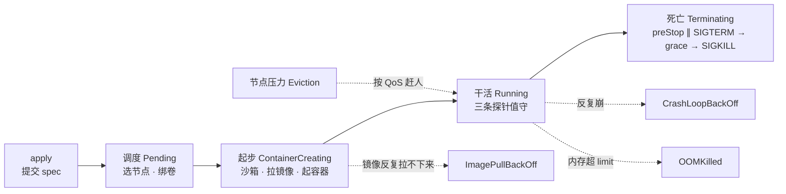
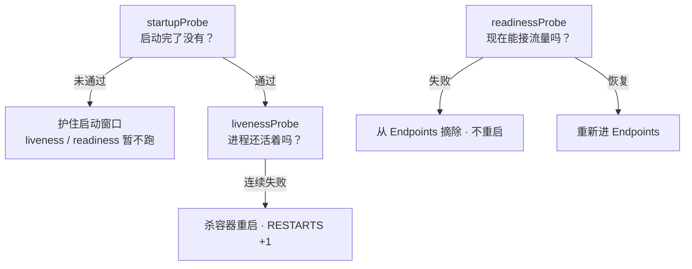
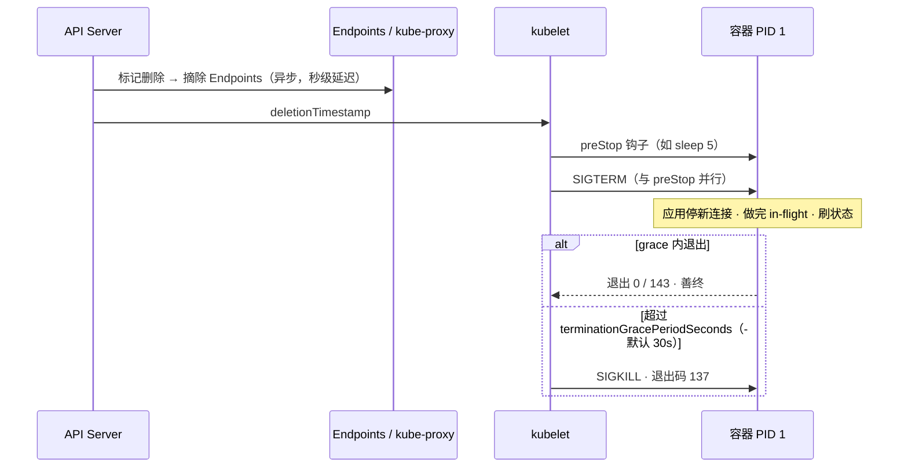
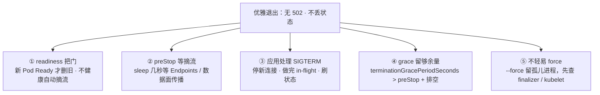
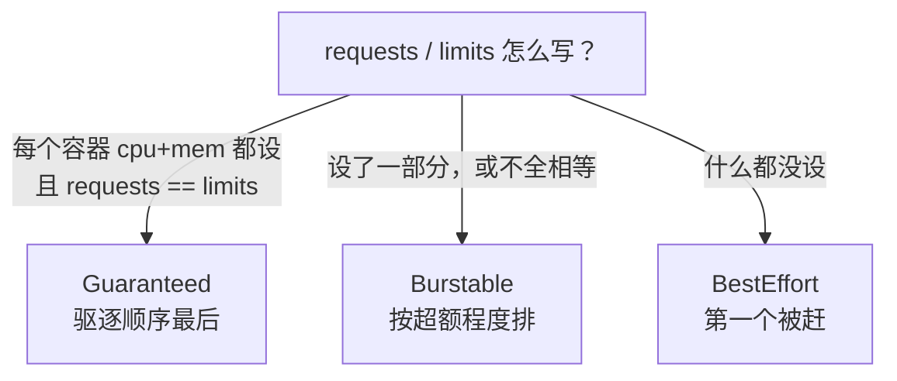
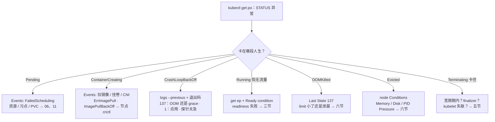

# Pod 生命周期

> 大厅刚发版，CrashLoopBackOff 排成一排；有人要把 liveness 的 `initialDelaySeconds` 拉到 120s，另一人给战斗服也抄了同一个 `/health`——滚动还没结束，Service 上一片 502，结论却是「镜像坏了」。
> **本章回答**：一个 Pod 的一生——怎么出生、三条探针怎么值守、崩了怎么认、按什么顺序死、节点塌方时 QoS 凭什么决定谁先死。
> **不讲**：滚动公式、PDB、STS → [05](../05-工作负载控制器/)；Pending 调度细节 → [06](../06-调度机制/)；HPA 缩容 → [07](../07-弹性伸缩/)；Endpoints 数据面 → [08](../08-Service与kube-proxy/)；drain → [17](../17-节点运行时与升级/)；排障串讲 → [18](../18-典型故障剧本/)。

**标记**：🎯重点 · 🔥难点 · ⭐常考 · 🔧实操

---

## 一、一张图：一个 Pod 的一生

> 🎯 **一句话**：Pod 和人一样有生老病死——出了问题先问「它卡在哪一段人生」。



- 📖 **读图**
  - 🛤️ 主线：提交 → 调度 → 拉镜像起容器 → 运行（探针）→ 优雅退出；二到六节各讲一段
  - ⚔️ 四条虚线是岔路：ImagePull / CrashLoop / OOM 从「运行」岔出；Eviction 是节点级赶人——刀在 kubelet，不是 Pod 自己病死
  - 🔦 `get po` 的 STATUS 告诉你**在哪段**，`describe` 的 Events 告诉你**为什么卡**——定责先看这两样，别先重启

- 📐 **STATUS 怎么读**
  - `status.phase` 五种骨架：Pending / Running / Succeeded / Failed / Unknown
  - CrashLoopBackOff、OOMKilled 等名字来自 **containerStatuses.reason**——phase 是骨架，reason 是病灶
  - `status.conditions` 四个布尔量：`PodScheduled` → `Initialized` → `ContainersReady` → `Ready`（能进 Endpoints）

人生地图有了。先看怎么出生——卡在 Pending 还是 ContainerCreating，方向完全不同。

本节对应练习题 Q1。

---

## 二、出生：从 apply 到容器跑起来

> 🎯 **一句话**：出生要过三道关——调度、沙箱、拉镜像，卡哪关 STATUS 会告诉你。

你 `kubectl apply` 之后顺序固定：apiserver 校验写入 etcd → scheduler 选出节点写回 `spec.nodeName` → 该节点 **kubelet** 接手：建**沙箱（sandbox）**（pause + CNI 配网）→ 挂卷 → 拉镜像 → 起容器。

- 🔑 **两件定责事实**
  - Pod 是调度与探针的最小单位；探针和钩子全由**本节点 kubelet 就地执行**，不是控制器远程杀进程
  - **Pending 查控制面，ContainerCreating 查节点**——方向反了白忙

- 🌐 **同 Pod 容器怎么通信**：共享沙箱网络命名空间——一个 Pod 一个 IP，容器间 localhost 直通，绑同端口会打架；sidecar 能直接探主容器端口，根因就在这

### 🪪 五个脸 + Init / Sidecar ⭐

- **Pending**：已接受，未调度成功或卷没绑上。Events 签名 `FailedScheduling` → [06](../06-调度机制/)、[11](../11-存储/)
- **ContainerCreating**：已绑节点，在建沙箱 / 挂卷 / 拉镜像 / 配网
- **Running**：进程起来了——**只说明进程在**，能不能接流量看 readiness（三节）
- **PodInitializing**：Init 还在跑，主容器在等（STATUS 常见 `Init:0/2`）
- **Completed**：退出码 0、phase **Succeeded**——**不是故障**，别去「救活」

- 🧩 **Init 容器**：按序跑完才起主容器；任一失败按 restartPolicy 重试，主容器永远 Waiting/`PodInitializing`
  - ✅ 适合等依赖、拉密钥这类短任务
  - ❌ **小时级迁移别塞 Init**——每次重建都重跑，滚动拖死；用 Job
- 🚗 **Sidecar（1.28+）**：在 **initContainers 里写 `restartPolicy: Always`**——先于主容器起、晚于主容器退，且不阻塞 Ready；日志采集 / 网格代理的标准位置
- 🪝 **postStart**：容器创建后立刻跑一次，与主进程**异步**——不保证 listen 之前；失败会直接杀容器。严格先后用 Init，别用 postStart 顶

### 📦 镜像拉不下来：两个阶段一张脸 🔧

- **ErrImagePull** = 这一次失败（名/tag 错、`imagePullSecrets`、registry 不通）
- **ImagePullBackOff** = 失败后进入退避，重试间隔越拉越长——同一问题的两个阶段，根因看 Events message
- **imagePullPolicy**：`Always` / `IfNotPresent` / `Never`；不写时 `latest`→Always、其他标签→IfNotPresent
  - 🕳️ 生产用 `latest`：每次重启重拉，且看不出跑哪版
  - 🕳️ tag 不变重打包 + IfNotPresent：节点吃缓存旧镜像，新版永不生效 → 发版必换标签或锁 digest

> 🔍 **现场**：出生段卡住，第一刀永远是 `describe` 看 Events 停在哪一行。

```bash
kubectl describe pod -n hall hall-7d8f9-abc12 | tail -20
```

```text
Events:
  Normal   Scheduled   ...  Successfully assigned hall/hall-7d8f9-abc12 to node-07   # ← 调度完成，问题在这行之后
  Normal   Pulling     ...  Pulling image "reg.example.com/hall:v2.3.1"
  Warning  Failed      ...  Failed to pull image ... not found                       # ← 镜像名或 tag 写错
  Warning  Failed      ...  Error: ErrImagePull
  Normal   BackOff     ...  Back-off pulling image "reg.example.com/hall:v2.3.1"     # ← 进入 ImagePullBackOff
```

节点侧再验：`crictl images` / `crictl ps -a`。调度门签名：

```bash
kubectl describe pod -n game battle-new-xyz | grep -A4 Events
```

```text
Warning  FailedScheduling  ...  0/48 nodes are available: 40 Insufficient cpu, 5 node(s) had untolerated taint {dedicated: battle}, ...   # ← 资源 / 污点 / 拓扑，三选一
```

#### ❓ 为什么 Pending 和 ContainerCreating 不能当一类「起不来」？

- 🧭 **Pending**：还没绑上节点——查调度器 / 资源 / 污点 / PVC（控制面）
- 🧱 **ContainerCreating**：已经绑上了——查镜像 / 卷 / CNI（节点）
- ❌ 混成一类 → 在节点上查 FailedScheduling，或在控制面查 ImagePull，白忙一整晚

> ⚠️ **别混**：**Pending（选不上）和 ContainerCreating（选上了起不来）**——前者查调度，后者查节点，方向反了白忙。

出生三道关讲完。进程起来了只说明 Running——能不能接流量，听三条探针。

本节对应练习题 Q1、Q2。

---

## 三、体检：三条探针问的不是一件事

> 🎯 **一句话**：startup 护启动，liveness 失败重启，readiness 失败只摘流。⭐🔥

先猜：liveness 失败和 readiness 失败，哪个让 RESTARTS +1？答完再往下。

**探针（Probe）** = kubelet 周期性对容器的健康检查，三条问三件不同的事：

- **startupProbe（启动探针）**：问「启动完了没有」。没成功前，liveness / readiness **都不启动**
- **livenessProbe（存活探针）**：问「进程还活着吗」——抓死锁、假死。失败 → **杀容器并按 restartPolicy 重启**
- **readinessProbe（就绪探针）**：问「现在能接流量吗」。失败 → 从 **Endpoints / EndpointSlice** 摘掉，**不重启**

> 💡 **打个比方**：餐厅——startup 问「厨房开好了没」；liveness 问「厨师还醒着吗，死了就换人」；readiness 问「现在能不能接新客，忙就把门口牌翻成 CLOSED」。



- 📖 **读图**
  - 🚪 startup 是闸门：没过之前另外两条冻结
  - ⚔️ 过了之后：liveness 管「死没死」（失败重启），readiness 管「忙不忙」（失败摘流）——互不替代

- ⚙️ **共用参数**：`initialDelaySeconds`（默认 0）· `periodSeconds`（10）· `timeoutSeconds`（1）· `failureThreshold`（3）· `successThreshold`（1；liveness/startup 只允许 1）
- 🔧 **检测方式**：`httpGet` / `tcpSocket` / `exec` / `grpc`
- ⏱️ startup 最长窗口 ≈ `failureThreshold × periodSeconds`

大厅服（最坏启动 180s）可直接抄：

```yaml
startupProbe:                 # ← 护启动：通过前下面两条不跑
  tcpSocket: { port: 7001 }
  periodSeconds: 10
  failureThreshold: 18        # ← 10 × 18 = 180s
livenessProbe:                # ← 抓死锁：浅、快、失败重启
  tcpSocket: { port: 7001 }
  periodSeconds: 10
  timeoutSeconds: 3
  failureThreshold: 3
readinessProbe:               # ← 管流量：可以探依赖，失败只摘流
  httpGet: { path: /ready, port: 8080 }   # ← /ready 里查配置表、Redis
  periodSeconds: 5
  failureThreshold: 2
```

- 📖 **读法**：startup 只算启动账；liveness 探得浅（端口活就行）；readiness 才敢探深。三条写成同一个深检 = 把「忙」和「死」混成一件事

#### ❓ 为什么慢启动不该拉 liveness 的 delay？

- ❌ **没有 startup、`initialDelaySeconds: 120`**：30s 就能起来的服务中间 90s 是盲区；真超过 120s 还是被杀——假保护
- ✅ **startup 覆盖最坏启动**（如 10×18=180s），通过后 liveness 保持短周期专抓死锁
- 🎯 口诀：慢启动用 **startup**，别拉 liveness delay

> 📝 **面试**：「三条探针失败动作不同：startup 护启动窗口、通过前另外两条不跑；liveness 失败重启；readiness 失败只摘 Endpoints。慢启动用 startup，不要把 liveness delay 拉到两分钟，更不要把 liveness 和 readiness 写成同一个 `/health`。」

> 🔍 **现场**：大厅发版即 CrashLoop——JVM 加载 90s，liveness delay 5，没有 startup。

```bash
kubectl get po -n hall hall-7d8f9-abc12 -o wide
kubectl describe pod -n hall hall-7d8f9-abc12 | tail -12
```

```text
NAME              READY   STATUS             RESTARTS   AGE
hall-7d8f9-abc12  0/1     CrashLoopBackOff   5          3m      # ← 0/1：readiness 也没过；重启 5 次

Warning  Unhealthy  ...  Liveness probe failed: ... connection refused   # ← 90s 才 listen，5s 就被判死
Warning  BackOff    ...  Back-off restarting failed container
```

修法：加 startupProbe 护 180s，liveness 恢复短周期。**不要**把 `failureThreshold` 调到 50——等于把「抓死锁」灵敏度一起调没。

#### ❓ 为什么 liveness 和 readiness 绝不能共用同一个 `/health`？

- 💥 同一条「业务健康」URL：请求一慢 / 依赖抖 → **被当成死进程重启**
- ✅ 拆开后：依赖抖写成 readiness → 只摘流，进程还在，恢复自动回 Endpoints
- 🎮 战斗服把 Redis 写进 liveness = 依赖一抖全区重启（七节）——这是开篇第二个错操作的全部理由

**四种见过最多的错配**（值班对号）：

1. liveness / readiness 共用业务健康 URL——请求一慢就重启
2. 没有 startup，liveness delay 120s——盲区 + 假保护
3. liveness 打 Redis / MySQL——依赖抖一下逻辑服集体重启（七节）
4. readiness 永远成功——没就绪就进 Endpoints，滚动一片 502（五节）

> ⚠️ **别混**：**liveness 失败是重启（RESTARTS 涨），readiness 失败是摘流（不涨）**。「活着但卡死、只能重启救」才配 liveness；「太忙接不了新客」配 readiness。

readiness 失败怎么验：

```bash
kubectl get ep -n hall hall-svc                                   # ← addresses 里没有这个 Pod IP
kubectl get po -n hall hall-7d8f9-abc12 -o jsonpath='{.status.conditions[?(@.type=="Ready")].status}{"\n"}'
# False ← 不在 Endpoints，新流量进不来，进程还活着
```

- 📊 **READY 列**：`1/1` = 1 个容器且 Ready；`0/2` = 2 个容器、0 个 Ready——分子是就绪数。Running 但 READY=0 =「人活着、没上岗」

探针 vs 钩子（长得像，不是一回事）：

| | 探针 Probe | 生命周期钩子 Lifecycle Hook |
|--|------------|------------------------------|
| 谁在跑 | kubelet **周期**问 | 启动/停止时**各跑一次** |
| 种类 | startup / liveness / readiness | postStart（二节）/ preStop（五节） |
| 失败 | 重启或摘流 | 影响启停流程，不是周期检查 |
| 和 SIGTERM | 无关 | preStop 与 SIGTERM **并行**（五节） |

> ⚠️ **别混**：钩子是**一次性动作**，探针是**周期提问**——postStart 替代不了 startupProbe。

口诀：⭐ **startup 护启动，liveness 失败重启，readiness 失败只摘流**。

本节对应练习题 Q3、Q4、Q5、Q6。

---

## 四、生病：崩溃、重启与退避

> 🎯 **一句话**：崩不可怕，看不清「怎么死的」才可怕——先看退出码，再看上辈子日志。⭐🔥

⭐ 高频错答：第一刀 `kubectl delete pod`「重建一下」——RESTARTS 清零，上辈子日志也没了，证据被你亲手灭了。

### 🔁 restartPolicy 三个值

- **Always**：任何退出码都重启——Deployment / STS / DaemonSet 默认且**只接受这个值**（写 `Never` 会被拒）
- **OnFailure**：非 0 才重启——Job 常用；退出 0 就停
- **Never**：跑完就散。Job 写 `Always` 会连成功容器也再拉，`completions` 永远对不上

### 📉 CrashLoopBackOff：退避，不是探针 🔥

不是独立状态机——是 `restartPolicy: Always` **反复崩后的退避**：间隔 10s 起指数翻倍，封顶 **5 分钟**。Events 签名：`Back-off restarting failed container`。


- 📖 **读图**
  - 「重启 5 次」和「重启 20 次」墙钟差很多——RESTARTS 涨得慢 ≠ 问题轻，可能只是退避拉长了节奏
  - 刚崩完那一小段是抓 `logs --previous` 的黄金窗口

#### ❓ 为什么看到 BackOff 不能当「新故障」去治？

- ❌ 删 Pod「重新开始」→ 退避计时清零、重来一遍，病灶证据还丢了
- ✅ BackOff 是**重启节流**；真要查的是「为什么每次都崩」——退出码 + `--previous` 日志

> ⚠️ **别混**：**退避是节流，不是新故障**——把 BackOff 本身当病因去治只会清零计时、重来一遍。

### 🔢 退出码先看再猜

容器被信号杀死时：退出码 = **128 + 信号编号**：

- **137** = 128+9，**SIGKILL**——容器 OOM **或** grace 超时强杀（⚠️ 见下）
- **143** = 128+15，**SIGTERM** 后退出
- **139** = 128+11，段错误；**1** 应用带错退出；**0** 正常结束

#### ❓ 为什么「137 一定是 OOM」是错答？

- 💀 grace 超时被 SIGKILL **也是 137**
- 🔎 分辨看 Last State：`Reason: OOMKilled` → 超 limit（六节）；`Reason: Error` + 正在 Terminating → 退出太慢被强杀（五节）

> ⚠️ **别混**：**137 ≠ 一定 OOM**——grace 超时 SIGKILL 也是 137。看 Last State 的 reason。

> 🔍 **现场**：CrashLoop 没日志是常态——第一刀永远这两条。

```bash
kubectl logs -n hall hall-7d8f9-abc12 --previous
# ← 上辈子（上次崩溃前）日志在这里
kubectl get po -n hall hall-7d8f9-abc12 -o jsonpath='{.status.containerStatuses[0].lastState.terminated}{"\n"}'
# {"exitCode":137,"reason":"OOMKilled",...}   # ← reason + exitCode 定生死
```

- 🕳️ **另一种空日志**：根本没跑到主进程——command 写错、缺环境变量、挂载失败。看 Events 里 `Created` / `Started` 断在哪，别对着空日志加内存

> ⚠️ **别混**：**Init 失败 vs 主容器崩**——Init 显示 `Init:Error` / `PodInitializing`，主容器**从未启动**；主容器崩才是 CrashLoop + RESTARTS 狂涨。别把 Init 的锅扣给应用。

本节对应练习题 Q7。

---

## 五、死亡：优雅退出链

> 🎯 **一句话**：滚动 502 多半不是镜像坏了，是流量还在路上、进程已经关门。⭐🔥🔧

触发者可以是：手动 delete、控制器滚动（[05](../05-工作负载控制器/)）、HPA 缩容（[07](../07-弹性伸缩/)）、drain（[17](../17-节点运行时与升级/)）——四条路汇进**同一条优雅退出链**。修好这条链，四个场景一起受益。

五步固定：

1. apiserver 打上 `deletionTimestamp`，STATUS → **Terminating**
2. 控制面从 Endpoints / EndpointSlice **异步**摘除——数据面（kube-proxy / IPVS / 云 LB）还要再等几秒
3. kubelet 触发 **preStop**，并向 PID 1 发 **SIGTERM**——官方口径：**并行**
4. 等 **terminationGracePeriodSeconds**，默认 **30s**
5. 到期还活着 → **SIGKILL**，退出码 **137**

> 💡 **打个比方**：公交换班——旧司机还没下车（Endpoints 没摘干净），新乘客还在上车，旧车突然熄火 → 502。优雅退出 = 先关车门、再下完乘客、最后熄火。



- 📖 **读图**
  - 🚪 顶上两条并行线：左边摘流量，右边停进程——**互不等待**
  - 💥 502 窗口 = 两条时间线没对齐；preStop sleep 给左线争取排空，SIGTERM 处理是应用自己的作业

#### ❓ 为什么不是「先跑完 preStop 再发 SIGTERM」？

- ❌ 串行幻想：很多人以为 sleep 跑完才 TERM
- ✅ **并行**：`preStop: sleep 5` 只给数据面几秒排空（kube-proxy 刷规则、云 LB 摘后端）
- 🛑 **不能替代应用处理 SIGTERM**——收到后停新连接 → 做完 in-flight → 状态落盘 → 再退出
- 🕳️ PID 1 经典坑：`sh -c "java ..."`——shell 当 PID 1 默认不转发信号，Java 永远收不到 TERM，30s 后喜提 137。用 exec 形式或 `tini` / `dumb-init`（信号基础 → [01-05](../../01-基础底座/05-进程与信号/)）

> 🔍 **现场**：摘流到底生效没有，两个地方对：

```bash
kubectl get endpointslice -n hall -l kubernetes.io/service-name=hall-svc -o yaml | grep -A3 addresses
# addresses 里已经没有旧 Pod IP   # ← 控制面摘干净了
# 网关侧还在打到它 → 数据面传播延迟，加长 preStop sleep
```

- ⏱️ **grace ≥ preStop + 应用排空**。默认 30s 对游戏服常不够——生产常 **60s**；有状态服按最坏存盘耗时算
- preStop 失败/超时会记事件，但**不会阻止删除**——grace 一到 SIGKILL 照样来

```yaml
terminationGracePeriodSeconds: 60            # ← > preStop + 排空，默认 30 常不够
lifecycle:
  preStop:
    exec:
      command: ["/bin/sh", "-c", "sleep 5"]  # ← 只等数据面摘流，不替代处理 SIGTERM
```

- 🔒 **Terminating 卡很久**：宽限期内 → 没处理 TERM / preStop 太慢；超时对象还在 → 查 **finalizer**（CSI/Operator 没摘完）或节点 NotReady、kubelet 失联
- ⚠️ `kubectl delete --force --grace-period=0` 只抹 API 对象——**节点上进程可能还在跑变孤儿**；战斗服等于拔电源不存盘，慎用

**滚动 502 定责**（四种现象）：

- Endpoints 已没这 IP 仍 502 → 数据面传播延迟，加长 preStop sleep
- 新 Pod 刚 Running 就 502 → 没配 readiness（三节）
- 旧 Pod Exit 137 + Terminating → grace 不够或没处理 TERM
- `maxUnavailable=0` 仍 502 → 问题在探针/grace/摘流，不在滚动公式 → [05](../05-工作负载控制器/)

### 收束：Pod 凭什么「死得体面」⭐

面试问「滚动更新怎么不掉连接」，要的就是这张清单——**五件套，一件不落**：



- 📖 **读图**
  - ① 挡「新的没好、旧的先死」；②③ 分别堵 502 两源头——流量还在路上、进程已关门
  - ④ 是 ②③ 的安全垫；⑤ 是最后关头纪律。按「**摘流侧（①②）· 进程侧（③④）· 纪律（⑤）**」分组背

> ⚠️ **别混**：五件套只保证「流量不打空、状态来得及落盘」，**不保证有状态会话零损失**——对局、内存长连接 K8s 不会替你迁移（七节、[05](../05-工作负载控制器/)）。

> 📝 **面试**：「滚动 502 的根因是**摘流异步和进程退出抢跑**：readiness 挡新 Pod 入口，preStop 等摘流，应用处理 SIGTERM，grace 留余量。只改 `maxUnavailable` 是改杀的速度，不改抢跑本身。」

本节对应练习题 Q8。

---

## 六、体质：QoS 三档与节点驱逐

> 🎯 **一句话**：调度看 request，容器 OOM 看 limit，节点塌方谁先死看 QoS。⭐🔥

**QoS（Quality of Service）**在创建时烙上，由各容器 `requests` / `limits` 写法决定——**不是你声明的字段，是算出来的**：

- **Guaranteed**：每个容器都设 cpu+memory，且 **requests == limits**——驱逐顺序最后
- **Burstable**：设了一部分，够不上 Guaranteed——生产最常见
- **BestEffort**：全没设——资源紧张第一个祭天

> 💡 **打个比方**：request 是订座人数，limit 是包厢上限；Eviction 是饭店满了请最低优先级客人离开——不是你一个人吃超了（那是 OOMKilled），是整个店挤了。



- 📖 **读图**
  - 从「YAML 怎么写」进，直接定档——QoS 不是声明字段，是算出来的
  - 验证：`kubectl get po -o jsonpath='{.status.qosClass}'`

节点出现 MemoryPressure / DiskPressure / PIDPressure（kubelet 盯 `memory.available`、`nodefs.available` 等，如 `<100Mi` / `<10%`）→ **Eviction**：BestEffort 先 → Burstable 按「用量/request」超额从高到低 → Guaranteed 最后。

- 🧬 同序写在内核：**OOMScoreAdj**——Guaranteed **-997**、BestEffort **1000**、Burstable 按 `1000 − 1000 × 内存request / 节点总内存`
- 🔑 **kubelet 驱逐和内核 OOM 是两套机制，方向一致**；阈值可用 `--eviction-hard` 调

#### ❓ 为什么 OOMKilled 和 Evicted 不能混着加内存？

| | OOMKilled | Evicted |
|--|-----------|---------|
| 谁动手 | **本容器**超自己的 memory limit（cgroup） | **节点**有压力，kubelet 按 QoS 赶人 |
| 怎么认 | Last State：`Reason: OOMKilled, Exit Code: 137` | `Reason: Evicted`，message `node was low on resource` |
| 处理 | limit 小了还是泄漏？看 RSS | 看节点 Conditions；清镜像/日志/emptyDir，扩容 |

- Evicted Pod 留 Failed 当取证；控制器补的是新 Pod——别把残骸当「没恢复」，查完按 `status.phase=Failed` 清掉
- **CPU vs 内存不对称**：内存超 limit → OOMKilled；**CPU 超 limit 只 throttle**，不杀——现象是卡顿，不是崩溃
- 不写 request：调度按 0 记账易超卖；HPA 算不出利用率（[07](../07-弹性伸缩/)）；压力一来最先被赶

> 🔍 **现场**：战斗服死了，先分「自己吃超」还是「节点连坐」。

```bash
kubectl describe pod -n game battle-xyz | grep -A6 "Last State"
# Reason: OOMKilled  Exit Code: 137   # ← 本容器超了自己的 limit
kubectl describe node worker-03 | grep -A6 Conditions
# MemoryPressure   True   ...  KubeletHasInsufficientMemory   # ← 节点级，是驱逐
kubectl get po -n game battle-xyz -o jsonpath='{.status.qosClass}{"\n"}'
# Burstable
```

- 🎮 **游戏落地**：核心战斗/支付一律 Guaranteed（request=limit）；limit 按 **cgroup 总量**给，不是按 JVM/Go 堆——堆外缓冲、direct memory 都算，通常留 **30–50%**。调度记账用节点 **Allocatable**（Capacity 减系统与 kubelet 预留），别按机器总内存写 request

```bash
kubectl get events -A --field-selector reason=Evicted | tail -3
# The node was low on resource: memory; container xxx was using 1.2Gi ...
```

本节对应练习题 Q9。

---

## 七、游戏有状态：战斗服能不能杀

> 🎯 **一句话**：有状态进程的内存就是对局，杀进程等于踢光本服玩家。⭐

> 💡 **打个比方**：无状态大厅像连锁快餐——关一家客人去另一家；战斗服像单机棋牌室——玩家在桌上，你把店砸了，局就没了。

战斗服照抄 Web 模板、liveness 探「业务健康」（含 Redis），Redis 抖 3 秒 → kubelet「自愈」→ 全区重启、对局丢失。**不是 K8s bug——是你把「依赖抖」配成了「该重启」。**

#### ❓ 为什么战斗服慎配 liveness，readiness 却必须配？

- ❌ liveness 打依赖 / 业务忙 → 依赖一抖就杀进程 = 踢光本服玩家
- ✅ liveness **只探进程/死锁**（浅）；依赖抖写成 readiness → **只摘流，进程还在**，恢复自动回流量
- 🚪 readiness **必配**：配置表没加载完、端口没 listen 之前绝不能进 Endpoints——开服滚动否则把玩家放进半成品

> 🔍 **现场**：`kubectl get po -l app=battle` RESTARTS 集体涨，Events 里 `Liveness probe failed: ... Redis connection refused`。**第一刀止血**：把 liveness 改成只探进程，或临时去掉依赖检查；去查 Redis——**不要重启节点，更不要再杀一轮**。

```yaml
livenessProbe:
  exec:
    command: ["/bin/sh", "-c", "pgrep -x battle >/dev/null"]   # ← 只问进程在不在
  periodSeconds: 15
  failureThreshold: 3
readinessProbe:
  tcpSocket: { port: 9001 }     # ← 端口在听、配置表加载完才放玩家
  periodSeconds: 5
```

| 操作 | 无状态 API | 有状态逻辑服 |
|------|------------|--------------|
| liveness 失败重启 | 通常可接受 | **踢光本服玩家，对局可能丢** |
| 滚动更新 | readiness + 多副本直接滚 | 先摘流，等对局结束或热迁移 |
| HPA 缩容 | 杀副本，Service 移流量 | 杀正在打仗的进程（[07](../07-弹性伸缩/)） |
| drain + PDB | 保最低副本 | 单副本可能就是一个区服 |

- 🧭 **真要杀的顺序**：停匹配 → 等进行中对局结束（或热迁移）→ 摘流 → 再删
- 选型：大厅/网关 = Deployment + 三探针 + grace 60s + preStop；战斗/房间 = StatefulSet 或自研调度（[05](../05-工作负载控制器/)）

> 📝 **面试**：「HPA 和 liveness 都不区分你是不是游戏服。有状态战斗服慎配 liveness——只探进程死锁，不把依赖和业务忙写成重启条件；禁止默认滚动和 HPA 自动缩容，杀之前先摘流、等对局。readiness 必配：摘流不等于杀进程，它是安全的。」

本节对应练习题 Q10、Q11。

---

## 八、作战：定责

> 🎯 **一句话**：STATUS 告诉你在哪段，Events 告诉你为什么，退出码告诉你怎么死——按序问，别先重启。🔧



- 📖 **读图**
  - 从 STATUS 进，先定人生阶段再看证据：出生段看 Events，运行段看日志/Endpoints，死亡段看 grace/finalizer
  - Evicted 去看节点；分支互斥，先定型再动手

| 现象 | 先做 | 别做 |
|------|------|------|
| 大批 Pod 同时 Pending | FailedScheduling message 找共性 | 逐个重启节点 |
| ContainerCreating 卡很久 | Events 看 CNI/挂卷，`crictl ps -a` | 重启 Deployment「刷新」 |
| CrashLoopBackOff | `logs --previous` + 退出码 | 先重启节点、无脑加内存 |
| 刚起来就重启 | 看 startup / liveness 是不是太急 | 把 delay 拉到 120s 了事 |
| Running 但 Service 没它 | `get ep` 对 readiness | 重装 kube-proxy |
| 滚动 502 | 五件套：readiness + preStop + grace + TERM | 只改滚动公式 |
| 战斗服被探针杀光 | 先改/关 liveness 止血 | 重启节点、再杀一轮 |
| OOMKilled | Last State；判 limit 过小还是泄漏 | 只说「加内存」 |
| Evicted | 节点 Conditions，清盘/扩容 | 当 OOM 加 limit |
| Terminating 卡很久 | 分 grace / finalizer / kubelet | 第一时间 `--force` |

**60 秒剧本** 🔧

```text
① 0–10s   kubectl get po -o wide：STATUS / RESTARTS / READY —— 先定在哪段人生
② 10–30s  kubectl describe pod：Events（出生段）· Last State 与退出码（死亡段）
③ 30–45s  kubectl logs --previous；Running 无流量则 kubectl get ep 对
④ 45–60s  定型：探针 → 三节 · 退出 → 五节 · QoS → 六节 · 滚动公式 → 05
```

本节对应练习题 Q12、Q13、Q14。

---

## 九、收口

### 命令速查 🔧

```bash
kubectl get po -n {ns} -o wide                        # STATUS / RESTARTS / READY，第一刀
kubectl describe pod {pod} -n {ns}                    # Events · Last State · 探针失败 · QoS
kubectl logs {pod} -n {ns} --previous                 # 上辈子日志；多容器加 -c <名>
kubectl get po {pod} -n {ns} -o jsonpath='{.metadata.finalizers}'   # Terminating 卡住看锁
kubectl get ep,endpointslice -n {ns}                  # Pod 在不在流量里
kubectl get po {pod} -n {ns} -o jsonpath='{.status.containerStatuses[0].lastState.terminated.exitCode}{"\n"}'
kubectl get po {pod} -n {ns} -o jsonpath='{.status.qosClass}{"\n"}'
kubectl get po {pod} -n {ns} -o jsonpath='{.status.phase}{"\n"}'
kubectl describe node <node> | grep -A6 Conditions    # Evicted 看节点压力
kubectl get po -A --field-selector=status.phase=Failed | grep Evicted
crictl images && crictl ps -a                         # 节点侧：镜像 / 容器
```

### 面试锚点

| 问 | 30 秒答 |
|----|---------|
| 三条探针区别？ | startup 护启动（通过前另两条不跑）；liveness 失败重启；readiness 失败只摘 Endpoints。不共用 `/health`。 |
| CrashLoopBackOff？ | 不是探针，是 Always 反复崩后的退避：10s 起翻倍、封顶 5min。第一刀 `logs --previous` + 退出码。 |
| 退出码 137？ | 128+9 SIGKILL：容器 OOM、grace 超时强杀都是它，看 Last State reason 分辨。 |
| preStop 和 SIGTERM 谁先？ | 并行，不是「跑完再发」。sleep 只等摘流，替代不了应用处理 SIGTERM。 |
| 滚动怎么防 502？ | 五件套：readiness 挡入口、preStop 等摘流、处理 SIGTERM、grace > preStop+排空、不轻易 force。 |
| terminationGracePeriodSeconds？ | 终止宽限期，默认 30s，到期 SIGKILL（137）；生产常 60s，必须盖住 preStop+排空。 |
| QoS 三档怎么定？ | Guaranteed（全设且 requests==limits）→ Burstable → BestEffort；是算出来的，不是声明的。 |
| 节点驱逐顺序？ | BestEffort 先，Burstable 按超额，Guaranteed 最后；OOMScoreAdj 让内核 OOM 同序。 |
| OOMKilled vs Evicted？ | OOM 是本容器超 limit（cgroup）；Evicted 是节点压力、kubelet 按 QoS 赶人。 |
| 调度看什么，OOM 看什么？ | 调度看 request / Allocatable；容器 OOM 看 limit；节点塌方看 QoS。 |
| CPU 超 limit？ | 只 throttle，不杀；内存超 limit 才 OOMKilled。 |
| 战斗服能随便杀吗？ | 内存里是对局。liveness 只探死锁；杀前停匹配、等对局；禁默认滚与 HPA 自动缩；readiness 必配。 |
| Init 失败？ | 整 Pod 按 restartPolicy 重试，主容器一直 PodInitializing；长任务用 Job。 |
| 原生 sidecar？ | 1.28+：initContainers + `restartPolicy: Always`——先起晚退，不阻塞 Ready。 |
| phase 和 STATUS 列？ | phase 五种；STATUS 还叠加容器 reason（CrashLoopBackOff、OOMKilled）。 |
| 发版后还是旧镜像？ | tag 不变 + IfNotPresent 吃缓存；发版换标签或锁 digest，生产别用 `latest`。 |
| 同 Pod 容器通信？ | 共享沙箱网络：一个 Pod 一个 IP，localhost 直通，端口不能撞。 |
| Terminating 删不掉？ | 宽限期内看 TERM；超时看 finalizer / kubelet；`--force` 留孤儿，有状态服慎用。 |

### 易错一句话对照

- liveness / readiness 共用 `/health` → 请求一慢变重启：liveness 浅、readiness 深
- preStop 跑完才发 SIGTERM → 并行；sleep 只等摘流
- Running 就能接流量 → Ready 才能；Running 只说明进程在
- startup 没过 liveness 也会跑 → 启动窗口内另外两条冻结
- CrashLoopBackOff 是一种探针 → 是 Always 下反复崩的退避
- Deployment 写 `restartPolicy: Never` → 会被拒；只能 Always
- 137 一定是 OOM → grace 超时 SIGKILL 也是 137
- Evicted 是容器超了 limit → 是节点压力按 QoS 赶人
- Guaranteed 永不被杀 → 只是驱逐顺序最后
- 调度看瞬时 top → 看 request / Allocatable
- 战斗服照抄 Web liveness → 依赖一抖全区被杀
- 战斗服不用 readiness → 没就绪不该进 Endpoints，仍要配
- preStop sleep 能替代处理 TERM → 不处理 TERM 照样 137
- Terminating 卡住先 `--force` → 先分 grace / finalizer / kubelet
- Evicted 加内存 limit 就行 → 先救节点压力
- 换了 StatefulSet 就能无脑滚战斗服 → 仍会按序杀进程（[05](../05-工作负载控制器/)）
- Completed 的 Pod 挂了要去救 → 退出码 0 的正常结束
- 生产用 `latest`、发版不换标签 → IfNotPresent 吃缓存；锁版本或 digest
- 删 Pod 清 RESTARTS 问题翻篇 → 清零的是新对象，先留日志和 Events
- sidecar 再起一个 Deployment → 1.28+：initContainers + `restartPolicy: Always`
- PDB 能挡住节点驱逐 → 只保护自愿中断，Eviction 照赶
- postStart 失败不影响容器 → 失败直接杀容器并触发重启

### 数字墙

> grace 默认 **30s**、生产常 **60s** · 退出码 **137**=SIGKILL · **143**=SIGTERM · **139**=段错误 · CrashLoop 退避 **10s** 起翻倍、封顶 **5min** · startup 窗口 ≈ **failureThreshold × periodSeconds** · 探针默认 period **10s** / timeout **1s** / failureThreshold **3** · Endpoints 摘除传播 **秒级** · Java/Go limit 留 **30–50%** 堆外 · OOMScoreAdj：Guaranteed **-997** / BestEffort **1000** · 驱逐默认阈值 `memory.available<`**100Mi**、`nodefs.available<`**10%** · QoS **3** 档 · 优雅退出 **5** 件套

---

## 合上书

- [ ] **默画一节主图**：提交 → Pending → ContainerCreating → Running（三探针）→ Terminating；四条岔路 ImagePullBackOff / CrashLoopBackOff / OOMKilled / Evicted。（Q1）
- [ ] **口述出生**：调度/沙箱/拉镜像三道关；Pending 查哪、ContainerCreating 查哪；ErrImagePull vs ImagePullBackOff；Init 失败主容器起不来。（Q1、Q2）
- [ ] **口述体检**：三条探针各问什么、失败各发生什么；为什么不能共用 `/health`；startup 没过另外两条不跑；四种错配。（Q3～Q6）
- [ ] **口述探针 vs 钩子**：探针周期问、钩子各跑一次；postStart 异步、替代不了 startupProbe。（Q3）
- [ ] **口述生病**：restartPolicy 三值；CrashLoopBackOff 是什么；退出码 137/143/139；`logs --previous` 第一刀。（Q7）
- [ ] **默画死亡时序**：摘流异步 ∥ preStop ∥ SIGTERM → grace → SIGKILL 137，指出 502 窗口。（Q8）
- [ ] **口述优雅退出五件套**：按「摘流侧 · 进程侧 · 纪律」分组。（Q8）
- [ ] **默画 QoS**：三档判定；驱逐顺序与 OOMScoreAdj；OOMKilled vs Evicted 谁动手。（Q9）
- [ ] **口述游戏有状态**：战斗服为什么不能照抄 Web liveness；正确杀序；为什么 readiness 仍要配。（Q10、Q11）
- [ ] **定责**：STATUS → 人生阶段 → 证据，60 秒剧本走一遍。（Q12～Q14）

终极测试：复述开篇现场——为什么不该拉 liveness delay、为什么不能共用 `/health`。

下一章：[05 工作负载控制器](../05-工作负载控制器/)——大厅和战斗服不该用同一种滚动。地基：[01-05 进程与信号](../../01-基础底座/05-进程与信号/) · 数据面：[08](../08-Service与kube-proxy/)。
