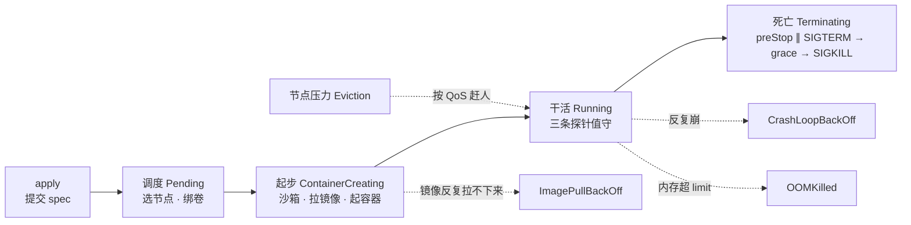
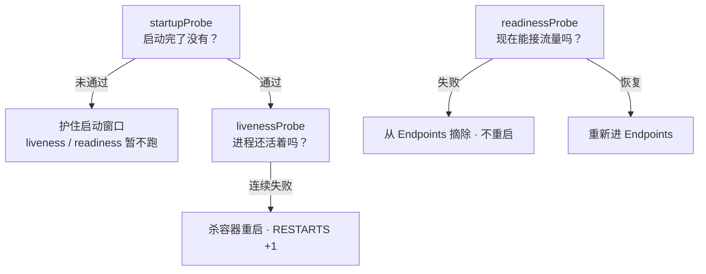
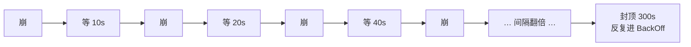
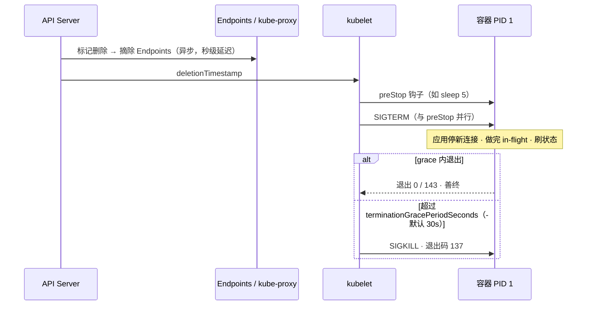
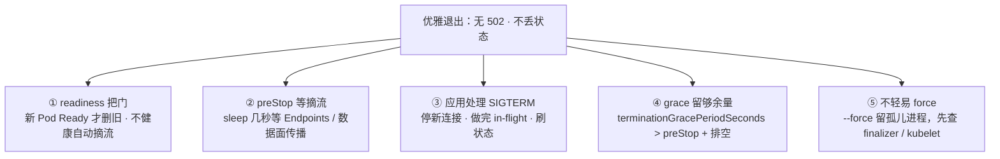
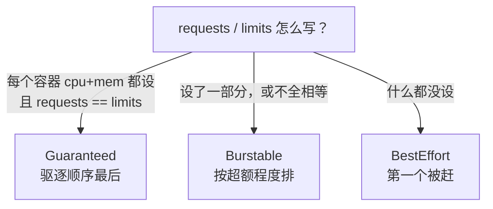
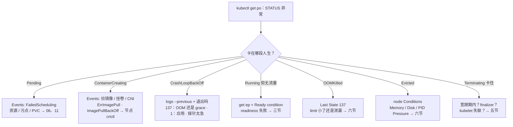

# Pod 生命周期

> 大家好。前面几章把控制面的门和账本讲清了；从这一章起，咱们把镜头对准**真正跑玩家流量的那个进程容器**——一个 Pod 的一生。
> 开讲之前，先回到活动高峰现场：大厅刚发版，监控里 CrashLoopBackOff 排成一排；群里有人要把 liveness 的 `initialDelaySeconds` 拉到 120s，另一人给战斗服也抄了同一个 `/health`——滚动还没结束，Service 上一片 502，结论却是「镜像坏了」。
> 这一章讲完，你会知道当时那两个人各自错在哪：慢启动该护的是哪条探针，以及「活着」和「能接客」为什么绝不能写成同一个检查。
> **本章回答的问题**：一个 Pod 的一生——怎么出生（调度 → 拉镜像 → 起容器）、运行中三条探针怎么值守、病了（崩溃重启）怎么认、按什么顺序死去，以及节点塌方时 QoS 凭什么决定谁先死。
> **本章不讲**：滚动公式、PDB、STS 顺序升级 → [05](../05-工作负载控制器/)；Pending 的调度、污点、request 记账 → [06](../06-调度机制/)；HPA 缩容杀进程 → [07](../07-弹性伸缩/)；Endpoints 数据面细节 → [08](../08-Service与kube-proxy/)；drain 与节点升级驱逐 → [17](../17-节点运行时与升级/)；排障串讲 → [18](../18-典型故障剧本/)。

**标记**：🎯重点 · 🔥难点 · ⭐常考 · 🔧实操

**怎么听这场分享**：第一节主图是「人生地图」；二到六节按生 → 体检 → 病 → 死 → 体质走；第七节专门讲游戏有状态；第八节定责。每节对应练习题。

---

## 一、一张图：一个 Pod 的一生

> 🎯 **一句话**：Pod 和人一样有生老病死——出了问题先问「它卡在哪一段人生」。



**读图**：出了问题先问「它卡在哪一段人生」——这张图就是咱们后面所有定责的地图。

- 主线是一条命：提交 → 调度 → 拉镜像起容器 → 运行（探针值守）→ 优雅退出，二到六节各讲一段。
- 四条虚线是岔路出口：三条从「运行」段岔出去，一条（Eviction）是节点级赶人——刀在 kubelet 手里，不是 Pod 自己病死的。
- `kubectl get po` 的 STATUS 告诉你**在哪段**，`describe` 的 Events 告诉你**为什么卡**——定责先看这两样，别先重启。STATUS 是 `status.phase`（Pending / Running / Succeeded / Failed / Unknown 五种）和容器状态原因的综合展示——CrashLoopBackOff、OOMKilled 这些名字来自 containerStatuses 的 reason：phase 是骨架，reason 是病灶。

人生地图有了。先看怎么出生——卡在 Pending 还是 ContainerCreating，方向完全不同。

本节对应练习题 Q1。

---

## 二、出生：从 apply 到容器跑起来

> 🎯 **一句话**：出生要过三道关——调度、沙箱、拉镜像，卡哪关 STATUS 会告诉你。

你 `kubectl apply` 一份 Deployment 之后，发生的事是有固定顺序的：apiserver 校验准入、把对象写进 etcd → scheduler 按资源/亲和/污点选出节点，写回 `spec.nodeName` → 该节点上的 **kubelet** 接手：先建**沙箱（sandbox）**——一个承载 Pod 共享网络命名空间的 pause 容器，CNI 在它上面配网络 → 挂载卷 → 拉镜像 → 按顺序起容器。

这决定了两件事：**Pod 是调度与探针的最小单位**；探针和生命周期钩子全部由节点上的 kubelet 就地执行，**不是控制器远程杀进程**。所以排障方向天然是：**Pending 查控制面，ContainerCreating 查节点**。

Pod 内容器共享沙箱的网络命名空间：**一个 Pod 一个 IP，容器间 localhost 直通，两个容器绑同一个端口会互相打架**——这是「同 Pod 容器怎么通信」的完整答案，也是为什么 sidecar 能直接探测主容器的端口。

五个状态先认脸：

- **Pending**：apiserver 已接受，但还没调度成功或卷没绑上。Events 里是 `FailedScheduling`：资源不足、污点不容忍、PVC 没绑 → [06](../06-调度机制/)、[11](../11-存储/)。
- **ContainerCreating**：节点已绑定，正在建沙箱 / 挂卷 / 拉镜像 / 配网络。卡在这里久了，看 Events 和节点运行时。
- **Running**：容器进程起来了——**只说明进程在**，能不能接流量看 readiness（三节）。
- **PodInitializing**：Init 容器还在跑，主容器在等。
- **Completed**：Job / 一次性 Pod 正常跑完（退出码 0，对应 phase 为 **Succeeded**）——**不是故障**，别当成挂了去「救活」它。

`status.conditions` 四个布尔量也在记录这条命走到哪：**PodScheduled**（调度完成）、**Initialized**（Init 容器全过）、**ContainersReady**（容器都就绪）、**Ready**（readiness 通过、能进 Endpoints）。ContainerCreating 卡住时看前两个定位卡哪关；Running 但 Ready 为 False，回三节查 readiness。STATUS 里 `Init:0/2` 这类前缀同理——告诉你「2 个 Init 容器跑到第几个了」。

**Init 容器**按顺序跑，全部成功才起主容器；任何一个失败，整个 Pod 按 restartPolicy 重试（四节），主容器永远停在 Waiting、Reason 是 `PodInitializing`。Init 适合等依赖就绪、拉密钥这类短任务；**小时级的迁移不要塞 Init**——Pod 每次重建都重跑一遍，滚动能被拖死，用 Job。

**Sidecar（边车容器）**：1.28 之前靠「普通容器先起、永不退出」硬凑，退出顺序还没法保证；1.28+ 有了原生写法——在 **initContainers 里写 `restartPolicy: Always`**，它先于主容器启动、晚于主容器退出，且不阻塞 Pod 的 Ready 判定。日志采集、网格代理这类「陪跑进程」从此有了标准位置。

**postStart** 是生命周期钩子（三节有对比表），在容器创建后立刻执行一次，但它和主进程入口**异步**——不保证跑在主进程 listen 之前，失败会直接杀掉容器。需要严格先后的动作用 Init 容器，别在 postStart 里做「必须先于主进程」的事。

**镜像拉不下来**分两个脸：**ErrImagePull** = 这一次拉失败（镜像名/tag 写错、`imagePullSecrets` 没权限、registry 不通）；**ImagePullBackOff** = 失败之后 kubelet 进入**退避（backoff）**，重试间隔越拉越长。两个是同一个问题的两个阶段，根因看 Events 的 message；大镜像多节点同时拉还会打满 registry 带宽，靠镜像预热 / P2P 分发解决，不是改 Pod。

**imagePullPolicy** 决定每次起容器拉不拉镜像：`Always` 每次都拉，`IfNotPresent` 节点上有同名就用本地的，`Never` 只用本地；不写时 `latest` 标签按 Always、其他标签按 IfNotPresent。两个经典坑：生产用 `latest` 标签——每次重启都重拉大镜像，而且看不出到底跑的哪版；**tag 不变、重新打包发版** + IfNotPresent——节点一直用缓存的旧镜像，新版本永远不生效。修法：锁死版本号或 digest，发版必换标签。

> 🔍 **现场**：出生段卡住，第一刀永远是 `describe` 看 Events 停在哪一行。

```bash
kubectl describe pod -n hall hall-7d8f9-abc12 | tail -20
```

```text
Events:
  Normal   Scheduled   ...  Successfully assigned hall/hall-7d8f9-abc12 to node-07   # ← 调度完成，问题在这行之后
  Normal   Pulling     ...  Pulling image "reg.example.com/hall:v2.3.1"
  Warning  Failed      ...  Failed to pull image "reg.example.com/hall:v2.3.1": rpc error: ... not found   # ← 镜像名或 tag 写错
  Warning  Failed      ...  Error: ErrImagePull
  Normal   BackOff     ...  Back-off pulling image "reg.example.com/hall:v2.3.1"     # ← 进入 ImagePullBackOff，重试间隔越拉越长
```

节点侧还能再验一刀：`crictl images` 看镜像到底拉下来没有，`crictl ps -a` 看容器建没建起来。

卡在调度门的签名则是 `FailedScheduling`，message 直接说卡在哪：

```bash
kubectl describe pod -n game battle-new-xyz | grep -A4 Events
```

```text
Warning  FailedScheduling  ...  0/48 nodes are available: 40 Insufficient cpu, 5 node(s) had untolerated taint {dedicated: battle}, 3 node(s) didn't match topology spread constraints.   # ← 资源 / 污点 / 拓扑约束，三选一
```

三种各走各路：资源不足 → 扩容或降 request（[06](../06-调度机制/)）；污点 → 加 toleration；PVC 绑不上 → [11](../11-存储/)。

> ⚠️ **别混**：**Pending（选不上节点）和 ContainerCreating（选上了起不来）**——前者查调度器 / 资源 / 污点 / PVC，后者查节点上的镜像 / 卷 / CNI，方向反了白忙。

出生三道关讲完。进程起来了只说明 Running——能不能接流量，要听三条探针的。

本节对应练习题 Q1、Q2。

---

## 三、体检：三条探针问的不是一件事

> 🎯 **一句话**：startup 护启动，liveness 失败重启，readiness 失败只摘流。⭐🔥

三条探针是全章最容易混的地方。咱们放慢：大家先猜——liveness 失败和 readiness 失败，哪个会让 RESTARTS +1？答完再往下看，别急着翻口诀。

**探针（Probe）**是 kubelet 周期性对容器执行的健康检查，共三条，问的是三件不同的事：

- **startupProbe（启动探针）**：问「启动完了没有」。它没成功之前，liveness 和 readiness **都不启动**。
- **livenessProbe（存活探针）**：问「进程还活着吗」——抓死锁、假死。失败 → kubelet **杀掉容器并按 restartPolicy 重启**。
- **readinessProbe（就绪探针）**：问「现在能接流量吗」。失败 → 把 Pod 从 **Endpoints**（新版为 EndpointSlice 对象）里摘掉，新流量不再进来，**不重启**。

> 💡 **打个比方**：像餐厅——startup 问「厨房开好了没」；liveness 问「厨师还醒着吗，死了就换人」；readiness 问「现在能不能接新客，忙就把门口牌翻成 CLOSED」。三个问题失败后的动作完全不同。



**读图**：从最上面往下读——startup 是闸门，没过之前另外两条冻结；过了之后 liveness 管「死没死」（失败重启），readiness 管「忙不忙」（失败摘流），两条从此各管各的，互不替代。

三条探针共用一套参数，首次出现先认全：`initialDelaySeconds`（首次探测前等多久，默认 0）、`periodSeconds`(探测周期，默认 10)、`timeoutSeconds`（单次探测超时，默认 1）、`failureThreshold`（连续失败几次算失败，默认 3）、`successThreshold`（连续成功几次才算恢复，默认 1，且 liveness / startup 只允许是 1）。检测方式四种：`httpGet` / `tcpSocket` / `exec` / `grpc`。startup 能护住的最长启动时间 ≈ `failureThreshold × periodSeconds`。

一份能直接抄的三探针配置（大厅服，启动最坏 180s）：

```yaml
startupProbe:                 # ← 护启动：通过前下面两条不跑
  tcpSocket: { port: 7001 }
  periodSeconds: 10
  failureThreshold: 18        # ← 10 × 18 = 180s，盖住最坏启动
livenessProbe:                # ← 抓死锁：浅、快、失败重启
  tcpSocket: { port: 7001 }
  periodSeconds: 10
  timeoutSeconds: 3
  failureThreshold: 3
readinessProbe:               # ← 管流量：可以探依赖，失败只摘流
  httpGet: { path: /ready, port: 8080 }   # ← /ready 里查配置表、Redis
  periodSeconds: 5
  failureThreshold: 2
```

**读法**：三条探针各写各的——startup 只算启动时间账；liveness 探得浅（端口活就行），宁可漏报也别误杀；readiness 才敢探深（依赖没就绪先别接客）。把三条写成同一个深检，就是把「忙」和「死」混成一件事。

**慢启动用 startup，别拉 liveness 的 delay。** JVM 加载配置表要 90s 的服务，用 startup 把窗口开到覆盖最坏启动（如 `periodSeconds=10, failureThreshold=18` → 护 180s），期间 liveness 不跑；通过后 liveness 保持短周期专抓死锁。反面写法：没有 startup、把 liveness 的 `initialDelaySeconds` 拉到 120s——30s 就能起来的服务中间 90s 是盲区，真超过 120s 还是被杀。

> 📝 **面试**：「三条探针失败动作不同：startup 护启动窗口、通过前另外两条不跑；liveness 失败重启；readiness 失败只摘 Endpoints。慢启动用 startup，不要把 liveness delay 拉到两分钟，更不要把 liveness 和 readiness 写成同一个 `/health`。」

> 🔍 **现场**：走一遍「大厅发版即 CrashLoop」——JVM 加载配置表 90s，liveness `initialDelaySeconds: 5`，没有 startup。

```bash
kubectl get po -n hall hall-7d8f9-abc12 -o wide
kubectl describe pod -n hall hall-7d8f9-abc12 | tail -12
```

```text
NAME              READY   STATUS             RESTARTS   AGE
hall-7d8f9-abc12  0/1     CrashLoopBackOff   5          3m      # ← 0/1：readiness 也没过；重启 5 次

Warning  Unhealthy  ...  Liveness probe failed: Get "http://10.244.1.8:8080/health": dial tcp ... connection refused   # ← 容器 90s 才 listen，5s 就被判死
Warning  BackOff    ...  Back-off restarting failed container                                                          # ← 进入退避（四节）
```

修法：加 startupProbe 护住 180s，liveness 恢复短周期。**不要**把 `failureThreshold` 调到 50 碰运气——那等于把「抓死锁」的灵敏度也一起调没了。

**四种见过最多**的错配（值班对号入座）：

1. liveness 和 readiness 共用同一个「业务健康」URL——请求一慢就被重启；
2. 没有 startup，liveness delay 120s——盲区 + 假保护；
3. liveness 打 Redis / MySQL——依赖抖一下，逻辑服集体重启（七节）；
4. readiness 永远成功——没就绪就进 Endpoints，滚动一片 502（五节）。

> ⚠️ **别混**：**liveness 失败是重启（RESTARTS 会涨），readiness 失败是摘流（不涨 RESTARTS）**。「活着但卡死、只能重启救」才配 liveness；「太忙接不了新客」配 readiness。同一个依赖检查写成 liveness = 依赖一抖就杀进程，写成 readiness = 依赖一抖先不接客、恢复自动回来——这是两条探针必须拆开的全部理由。

readiness 失败怎么验证：

```bash
kubectl get ep -n hall hall-svc                                   # ← addresses 里没有这个 Pod IP
kubectl get po -n hall hall-7d8f9-abc12 -o jsonpath='{.status.conditions[?(@.type=="Ready")].status}{"\n"}'
# False ← Pod 不在 Endpoints，新流量进不来，但进程还活着
```

顺带把 `get po` 的 **READY 列**读懂：`1/1` 是「1 个容器、1 个 Ready」，`0/2` 是「2 个容器、0 个 Ready」——分子是就绪容器数，不是健康分。Running 但 READY 为 0，就是「人活着、没上岗」，流量不会来；排「为什么没流量」时先看这一列，再看 Endpoints。

最后把探针和钩子分开——它们长得像，干的不是一回事：

| | 探针 Probe | 生命周期钩子 Lifecycle Hook |
|--|------------|------------------------------|
| 谁在跑 | kubelet **周期**问容器 | kubelet 在容器启动/停止时**各跑一次** |
| 种类 | startup / liveness / readiness | postStart（二节）/ preStop（五节） |
| 失败 | 重启或摘流 | 影响启动/停止流程，不是周期健康检查 |
| 和 SIGTERM | 无关 | preStop 与 SIGTERM **并行**，不是「跑完再发」（五节） |

> ⚠️ **别混**：钩子是**一次性动作**，探针是**周期提问**——postStart 跑一次且与主进程异步，替代不了周期检查的 startupProbe。

口诀：⭐ **startup 护启动，liveness 失败重启，readiness 失败只摘流**。开篇那两个错操作——拉 delay、共用 `/health`——错在哪，现在清楚了。下一节看崩了怎么认。

本节对应练习题 Q3、Q4、Q5、Q6。

---

## 四、生病：崩溃、重启与退避

> 🎯 **一句话**：崩不可怕，看不清「怎么死的」才可怕——先看退出码，再看上辈子日志。⭐🔥

很多人第一刀 `kubectl delete pod` 想「重建一下」——⭐ 高频错答：删了 RESTARTS 清零，上辈子日志也没了，病灶证据被你亲手灭了。

**restartPolicy** 决定容器退出后 kubelet 要不要再拉起来，三个值：

- **Always**：任何退出码都重启——Deployment / StatefulSet / DaemonSet 的默认值，也只接受这个值（模板写 `Never` 会被 apiserver 直接拒）。
- **OnFailure**：只有**非 0 退出码**才重启——Job 常用，正常跑完（退出码 0）就停。
- **Never**：跑完就散，一次性和排障 Pod 用。Job 写 `Always` 会连成功的容器也再拉起来，`completions` 永远对不上。

**CrashLoopBackOff** 不是一种探针，也不是独立状态机：它是 `restartPolicy: Always` 的 Pod **反复崩溃后进入的退避状态**——重启间隔从 10s 开始指数翻倍，封顶 5 分钟。Events 里的签名是 `Back-off restarting failed container`。退避是保护机制，防止「崩—起—崩」把 CPU 和日志刷爆；对值班来说，退避等的那几分钟正好是给你查 `logs --previous` 的时间。



**读图**：每次崩溃后等待时间翻倍（10 → 20 → 40 → 80 → 160 → 300 封顶），所以「重启 5 次」和「重启 20 次」背后耗的墙钟时间差很多。两个推论：① 刚崩完那一小段是抓现场日志的黄金窗口，越往后等得越久；② 看到 RESTARTS 涨得慢，不代表问题轻，可能只是退避把节奏拉长了。

> ⚠️ **别混**：**退避（BackOff）是「重启的节流」，不是「新的故障」**——真正要查的还是「为什么每次都崩」（退出码 + 日志），把 BackOff 本身当病因去治（比如删 Pod 让它「重新开始」）只会把退避计时清零、重来一遍。

**退出码先看再猜**：容器退出码 = 128 + 信号编号（被信号杀死时），所以：

- **137** = 128+9，被 **SIGKILL** 杀——容器 OOM 或 grace 超时强杀都是它（⚠️ 见下）；
- **143** = 128+15，收到 **SIGTERM** 后退出——默认信号动作就是终止；
- **139** = 128+11，段错误；**1** 应用自己带错退出；**0** 正常结束。

> ⚠️ **别混**：**「137 一定是 OOM」是高频错答**——grace 超时被 SIGKILL 也是 137。分辨看 `describe` 的 Last State：`Reason: OOMKilled` 才是超 limit（六节）；`Reason: Error` + 正在 Terminating，是退出太慢被强杀（五节）。

> 🔍 **现场**：CrashLoop 没日志是常态——第一刀永远是这两条。

```bash
kubectl logs -n hall hall-7d8f9-abc12 --previous
# ← 当前容器可能还没打出东西，上辈子（上次崩溃前）的日志在这里
kubectl get po -n hall hall-7d8f9-abc12 -o jsonpath='{.status.containerStatuses[0].lastState.terminated}{"\n"}'
# {"exitCode":137,"reason":"OOMKilled","startedAt":...,"finishedAt":...}   # ← reason 和 exitCode 定生死
```

**容器没日志的另一种可能**：根本没跑到主进程——command 写错、环境变量缺、挂载失败，日志自然是空的。回去看 Events 里 `Created` / `Started` 到哪一步断了，别对着空日志加内存。

> ⚠️ **别混**：**Init 失败（二节）和主容器崩**长得很像：Init 失败显示 `Init:Error` / `PodInitializing`，主容器**从未启动**、RESTARTS 记的是 Init 的；主容器崩才是 CrashLoopBackOff 带 RESTARTS 狂涨。别把 Init 的锅扣给应用代码。

崩不可怕，看不清退出码才可怕。接下来是死亡顺序——乱杀会 502。

本节对应练习题 Q7。

---

## 五、死亡：优雅退出链

> 🎯 **一句话**：滚动 502 多半不是镜像坏了，是流量还在路上、进程已经关门。⭐🔥🔧

删 Pod 的命令发出后，这个 Pod 会走完一条固定五步的链。**先认清触发者**：手动 `kubectl delete`、控制器滚动（[05](../05-工作负载控制器/)）、HPA 缩容（[07](../07-弹性伸缩/)）、节点 drain（[17](../17-节点运行时与升级/)）——四条路最终汇进同一条优雅退出链：这条链修好了，四个场景一起受益；任何一个场景出 502，也先回这条链上找缺口。五个步骤：

1. apiserver 给 Pod 打上 `deletionTimestamp`，STATUS 变 **Terminating**；
2. 控制面把 Pod 从 Endpoints / EndpointSlice 里移除——**异步**，kube-proxy / IPVS / 云 LB 的数据面生效还要再等几秒；
3. kubelet 触发 **preStop** 钩子，并向容器 PID 1 发 **SIGTERM**——官方口径：两者**并行**处理；
4. 等 **terminationGracePeriodSeconds（终止宽限期）**，默认 **30s**；
5. 到期进程还没死，kubelet 发 **SIGKILL** 强杀——退出码 **137**。

> 💡 **打个比方**：像公交换班——旧司机还没下车（Endpoints 没摘干净），新乘客还在上车（流量仍打到旧 Pod），旧车突然熄火（进程退出）→ 502。优雅退出的全部机制，就是让「先关车门、再下完乘客、最后熄火」按顺序发生。



**读图**：从顶上两条并行线进入——左边摘流量，右边停进程，**两条线互不等待**；502 的窗口就是这两条时间线没对齐的地方。preStop 的 sleep 是给左线争取排空时间，SIGTERM 处理是应用自己的作业，谁也替不了谁。

**preStop 与 SIGTERM 并行**，不是「先跑完 preStop 再发 TERM」——这是本章最高频的误解。`preStop: sleep 5` 的全部作用是给数据面几秒排空（kube-proxy 刷规则、云 LB 摘后端都需要时间），**它不能替代应用处理 SIGTERM**。

**应用必须处理 SIGTERM**：收到后停接新连接 → 把手头的请求/对局处理完 → 状态落盘 → 再退出。信号要能送到容器里的 **PID 1**：经典坑是 `sh -c "java ..."` 这种写法，shell 当 PID 1 且默认不转发信号，Java 进程永远收不到 TERM，30s 后喜提 137。修法：用 exec 形式让主进程直接当 PID 1，或加 `tini` / `dumb-init` 转发信号。信号与进程的基础 → [01-05](../../01-基础底座/05-进程与信号/)。

> 🔍 **现场**：摘流到底生效没有，两个地方对：

```bash
kubectl get endpointslice -n hall -l kubernetes.io/service-name=hall-svc -o yaml | grep -A3 addresses
# addresses 里已经没有旧 Pod IP   # ← 控制面摘干净了
# 网关侧还在打到它 → 数据面传播延迟（kube-proxy / 云 LB 缓存），加长 preStop sleep
```

**terminationGracePeriodSeconds 必须 ≥ preStop 时间 + 应用排空时间。** 默认 30s 对游戏服常常不够——战斗状态落盘、存库、长连接收尾都要时间，生产常配 60s；有状态服按「最坏一次存盘耗时」算，宁长勿短。preStop 本身失败或超时会记事件，但**不会阻止删除**——grace 一到，SIGKILL 照样来，别把钩子当保险丝，它只是争取时间。

```yaml
terminationGracePeriodSeconds: 60            # ← > preStop + 排空时间，默认 30 常不够
lifecycle:
  preStop:
    exec:
      command: ["/bin/sh", "-c", "sleep 5"]  # ← 只等数据面摘流，不替代应用处理 SIGTERM
```

**Terminating 卡很久**，先分宽限期内还是超时后：还在宽限期内 → 应用没处理 TERM 或 preStop 太慢；超时了对象还在 → 看 **finalizer**——CSI / Operator 等资源清理标记没摘完，对象不能从 etcd 删除；或者节点 NotReady、kubelet 失联，没人执行终止。`kubectl delete --force --grace-period=0` 只是把对象从 API 里抹掉，**节点上的进程可能还在跑，变成孤儿**——对战斗服等于「拔电源且不存盘」，慎用。

**滚动 502 定责**（四种现象各归各位）：

- Endpoints 里已经没这个 IP 了，还是 502 → 数据面传播延迟（IPVS 表、云 LB 缓存），加长 preStop sleep；
- 新 Pod 刚 Running 就 502 → 没配 readiness，没就绪就进了 Service（三节）；
- 旧 Pod Exit 137 + Terminating → grace 不够或没处理 TERM；
- `maxUnavailable=0` 仍然 502 → 问题在探针 / grace / 摘流，不在滚动公式——公式归 [05](../05-工作负载控制器/)。

### 收束：Pod 凭什么「死得体面」⭐

到这里，「优雅退出」的全部零件齐了。面试问「滚动更新怎么不掉连接」，要的就是这张清单——**五件套，一件不落**：



**读图**：① 挡「新的没好、旧的先死」；② ③ 分别堵 502 的两个源头——流量还在路上、进程已关门；④ 是 ② ③ 的安全垫；⑤ 是最后关头的纪律。按「**摘流侧（①②）· 进程侧（③④）· 纪律（⑤）**」分组背。

> ⚠️ **别混**：五件套只保证「流量不打空、状态来得及落盘」，**不保证有状态会话零损失**——正在打的对局、挂在进程内存里的长连接，K8s 不会替你迁移，那是七节和 [05](../05-工作负载控制器/) 的事。

> 📝 **面试**：「滚动 502 的根因是**摘流异步和进程退出抢跑**：readiness 挡新 Pod 的入口，preStop 等摘流，应用处理 SIGTERM，grace 留余量。只改 `maxUnavailable` 是改杀的速度，不改抢跑本身。」

优雅退出五件套记下。节点压力来了，谁先被赶走？看 QoS。

本节对应练习题 Q8。

---

## 六、体质：QoS 三档与节点驱逐

> 🎯 **一句话**：调度看 request，容器 OOM 看 limit，节点塌方谁先死看 QoS。⭐🔥

**QoS（Quality of Service，服务质量等级）**在 Pod 创建时就烙上了，由每个容器 `requests` / `limits` 的写法决定，共三档：

- **Guaranteed**：每个容器都设置了 cpu 与 memory，且 **requests == limits**——资源锁死，驱逐顺序最后；
- **Burstable**：至少一个容器设置了 request 或 limit，但够不上 Guaranteed——生产里最常见；
- **BestEffort**：所有容器都没设任何 requests / limits——资源紧张时第一个祭天。

> 💡 **打个比方**：request 是订座人数，limit 是包厢上限；Eviction 是饭店满了请最低优先级的客人离开——不是说你一个人吃超了（那是 OOMKilled），是整个店挤了。



**读图**：从「YAML 怎么写」进入，直接定档——QoS 不是你声明的字段，是 kubelet 按资源配置**算出来的结果**。验证一行命令：`kubectl get po -o jsonpath='{.status.qosClass}'`。

节点出现**内存 / 磁盘 / PID 压力**（node Conditions 里的 MemoryPressure / DiskPressure / PIDPressure，kubelet 盯着 `memory.available`、`nodefs.available` 等指标跌破阈值，如 `memory.available < 100Mi`、`nodefs.available < 10%`）时，会启动 **Eviction（驱逐）**，按 QoS 顺序赶人：**BestEffort 先走 → Burstable 按「用量 / request」超标程度从高到低 → Guaranteed 最后**。同一套顺序还写在内核层：kubelet 给每个容器设置 **OOMScoreAdj（oom_score_adj）**——Guaranteed **-997**、BestEffort **1000**、Burstable 按 `1000 − 1000 × 内存request / 节点总内存` 算出中间值——所以就算节点内存被真打爆、轮到内核 OOM Killer 动手，也是 BestEffort 先死。**kubelet 驱逐和内核 OOM 是两套机制，方向一致。** 驱逐阈值可用 kubelet `--eviction-hard` 调，生产节点要留缓冲，别等默认的 100Mi 红线才动手。

| | OOMKilled | Evicted |
|--|-----------|---------|
| 谁动手 | **本容器**超了自己的 memory limit，cgroup 杀的 | **节点**有压力，kubelet 按 QoS 赶人 |
| 怎么认 | Pod Last State：`Reason: OOMKilled, Exit Code: 137` | `Reason: Evicted`，message `node was low on resource: ...` |
| 处理 | limit 给小了，还是内存泄漏？看 RSS 趋势 | 看节点 Conditions；清镜像/日志/emptyDir，扩容 |

被驱逐的 Pod 对象会留在 Failed 状态当取证记录，控制器补建的是新 Pod——现场别把 Evicted 残骸当「没恢复」，也别让它堆积，排查完按 `status.phase=Failed` 过滤清掉。

**CPU 和内存的不对称**：内存超 limit 会被杀（OOMKilled）；**CPU 超 limit 只会被限流**（CFS quota 切走时间片），不杀——所以「CPU limit 给小了」的现象是卡顿、延迟升高，不是崩溃。

**不写 request 的代价**：调度器按 0 记账，节点容易被超卖；HPA 算不出利用率（[07](../07-弹性伸缩/)）；节点一超卖一有压力，这些 Pod 最先被赶。

> 🔍 **现场**：战斗服死了，先分清是「自己吃超了」还是「被节点连坐了」。

```bash
kubectl describe pod -n game battle-xyz | grep -A6 "Last State"
# Reason: OOMKilled  Exit Code: 137   # ← 本容器超了自己的 limit
kubectl describe node worker-03 | grep -A6 Conditions
# MemoryPressure   True   ...  KubeletHasInsufficientMemory   # ← 节点级压力，是驱逐不是 OOM
kubectl get po -n game battle-xyz -o jsonpath='{.status.qosClass}{"\n"}'
# Burstable   # ← request/limit 的写法决定了它的死序
```

**游戏落地**：核心战斗 / 支付一律 Guaranteed（request = limit）；limit 按 **cgroup 总量**给，不是按 JVM 堆 / Go 堆给——堆外缓冲、direct memory、运行时自身都算在里面，通常留 **30–50%** 余量。`kubectl describe node` 里 Capacity 是机器原始容量，**Allocatable** 是减去系统与 kubelet 预留后的量——调度记账用的是后者，写 request 时别按机器总内存算。BestEffort 的进程（临时脚本、部分日志采集）别和核心业务混在同节点——压力一来它们先死是小事，它们超卖掉的资源连累别人才是大事。

驱逐发生时会留痕，查「谁被赶走了、为什么」：

```bash
kubectl get events -A --field-selector reason=Evicted | tail -3
# The node was low on resource: memory; container xxx was using 1.2Gi ...   # ← 被赶的 Pod 和理由都在这
```

QoS 讲的是「节点塌方时谁先死」。游戏战斗服还有更特殊的一刀——下一节。

本节对应练习题 Q9。

---

## 七、游戏有状态：战斗服能不能杀

> 🎯 **一句话**：有状态进程的内存就是对局，杀进程等于踢光本服玩家。⭐

> 💡 **打个比方**：无状态大厅像连锁快餐——关一家客人去另一家；战斗服像单机棋牌室——玩家在桌上，你把店砸了，局就没了。

战斗服照着 Web 模板抄 liveness、探的还是「业务健康」（含 Redis 连通性），结果 Redis 抖了 3 秒，kubelet 开始「自愈」：全区战斗服重启，玩家全部掉线、对局丢失。这不是 K8s 的 bug——**是你把「依赖抖」配成了「该重启」**。

> 🔍 **现场**：`kubectl get po -l app=battle` RESTARTS 集体上涨，Events 里 `Liveness probe failed: ... Redis connection refused`。**第一刀是止血**：把 liveness 改成只探进程 / 死锁，或临时去掉依赖检查，让还活着的进程别再被杀；然后去查 Redis，**不要重启节点**，更不要「为了做点什么」再杀一轮。

**readiness 打 Redis 是可以的**——失败只摘 Endpoints，进程还在，依赖恢复后自动回到流量里。这正是三节「两条探针必须拆开」在值班现场兑现的方式。战斗服的配置模板就一个原则——**liveness 浅、readiness 深**：

```yaml
livenessProbe:
  exec:
    command: ["/bin/sh", "-c", "pgrep -x battle >/dev/null"]   # ← 只问进程在不在，不问依赖
  periodSeconds: 15
  failureThreshold: 3
readinessProbe:
  tcpSocket: { port: 9001 }     # ← 战斗端口在监听、配置表加载完才放玩家进来
  periodSeconds: 5
```

两类负载的安装部署选型不能写反：大厅 / 网关 = Deployment + 三探针分工 + grace 60s + preStop；战斗 / 房间 = StatefulSet 或自研调度 + 上面的浅深探针 + 摘流脚本（[05](../05-工作负载控制器/)）。

| 操作 | 无状态 API | 有状态逻辑服 |
|------|------------|--------------|
| liveness 失败重启 | 通常可接受 | **踢光本服玩家，对局可能丢** |
| 滚动更新 | readiness + 多副本直接滚 | 先摘流，等对局结束或热迁移 |
| HPA 缩容 | 杀副本，Service 移流量 | 杀正在打仗的进程（[07](../07-弹性伸缩/)） |
| drain + PDB | 保最低副本 | 单副本可能就是一个区服 |

**真要杀，按顺序来**：停匹配、禁止新玩家进入 → 等进行中的对局结束（或把会话热迁移走）→ 摘流 → 再删。大厅 / 网关这类无状态可以照 Web 模板配三探针 + preStop；房间 / 战斗进程按有状态对待，常放 StatefulSet 或自研调度（[05](../05-工作负载控制器/)）。

**慎配 liveness ≠ 不配探针**——readiness 反而**必须配**：配置表没加载完、Redis 没连上之前，绝不能进 Endpoints，否则开服滚动会把玩家放进还没好的进程。

> 📝 **面试**：「HPA 和 liveness 都不区分你是不是游戏服。有状态战斗服慎配 liveness——只探进程死锁，不把依赖和业务忙写成重启条件；禁止默认滚动和 HPA 自动缩容，杀之前先摘流、等对局。readiness 必配：摘流不等于杀进程，它是安全的。」

战斗服不能照抄 Web 探针——下一章滚动和 PDB 会接着讲。先收作战定责。

本节对应练习题 Q10、Q11。

---

## 八、作战：定责

> 🎯 **一句话**：STATUS 告诉你在哪段，Events 告诉你为什么，退出码告诉你怎么死——按序问，别先重启。🔧



**读图**：从 STATUS 进，先定人生阶段，再看每支分支点名的证据——出生段（Pending / ContainerCreating）看 Events，运行段（CrashLoop / Running 无流量）看日志和 Endpoints，死亡段看 grace 和 finalizer，Evicted 是节点级、去看节点。分支互斥，先定型再动手。

| 现象 | 先做 | 别做 |
|------|------|------|
| 大批 Pod 同时 Pending | 看 FailedScheduling message 找共性（资源 / 配额 / 污点） | 逐个重启节点 |
| ContainerCreating 卡很久 | Events 看 CNI / 挂卷，节点侧 `crictl ps -a` | 重启 Deployment「刷新」 |
| CrashLoopBackOff | `logs --previous`，看退出码 | 先重启节点、无脑加内存 |
| 刚起来就重启 | 看 startup / liveness 是不是太急 | 把 initialDelay 拉到 120s 了事 |
| Running 但 Service 没它 | `get ep` 对 readiness | 重装 kube-proxy |
| 滚动 502 | 五件套：readiness + preStop + grace + TERM | 只改滚动公式 |
| 战斗服被探针杀光 | 先改/关 liveness 止血 | 重启节点、再杀一轮 |
| OOMKilled | Last State；判 limit 过小还是泄漏 | 只说「加内存」 |
| Evicted | 节点 Conditions，清盘 / 扩容 | 当 OOM 加 limit |
| Terminating 卡很久 | 分 grace / finalizer / kubelet | 第一时间 `--force` |

**60 秒剧本** 🔧

```text
① 0–10s   kubectl get po -o wide：STATUS / RESTARTS / READY —— 先定在哪段人生
② 10–30s  kubectl describe pod：Events（出生段）· Last State 与退出码（死亡段）
③ 30–45s  kubectl logs --previous 看上辈子日志；Running 无流量则 kubectl get ep 对
④ 45–60s  定型定责：探针 → 三节 · 退出 → 五节 · QoS → 六节 · 滚动公式 → 05
```

现在再看「镜像坏了」「把 delay 拉到 120s」，你知道该怎么拦。收口。

本节对应练习题 Q12、Q13、Q14。

---

## 九、收口

### 命令速查 🔧

```bash
kubectl get po -n {ns} -o wide                        # STATUS / RESTARTS / READY，第一刀
kubectl describe pod {pod} -n {ns}                    # Events · Last State · 探针失败 · QoS
kubectl logs {pod} -n {ns} --previous                 # 上一次崩溃前的日志；多容器 Pod 加 -c <容器名>
kubectl get po {pod} -n {ns} -o jsonpath='{.metadata.finalizers}'   # Terminating 卡住，看有没有锁没摘
kubectl get ep,endpointslice -n {ns}                  # Pod 在不在流量里
kubectl get po {pod} -n {ns} -o jsonpath='{.status.containerStatuses[0].lastState.terminated.exitCode}{"\n"}'   # 退出码
kubectl get po {pod} -n {ns} -o jsonpath='{.status.qosClass}{"\n"}'   # Guaranteed / Burstable / BestEffort
kubectl get po {pod} -n {ns} -o jsonpath='{.status.phase}{"\n"}'      # phase 五种：Pending/Running/Succeeded/Failed/Unknown
kubectl describe node <node> | grep -A6 Conditions    # Evicted 看节点压力
kubectl get po -A --field-selector=status.phase=Failed | grep Evicted   # 一批被驱逐的 Pod
crictl images && crictl ps -a                         # 节点侧：镜像拉没拉、容器起没起
```

### 面试锚点

遮住右列自问自答，卡壳的行回去重读对应小节——能讲出来才算会，看着答案点头不算。

| 问 | 30 秒答 |
|----|---------|
| 三条探针区别？ | startup 护启动（通过前另外两条不跑）；liveness 失败重启；readiness 失败只摘 Endpoints。不共用同一个 `/health`。 |
| CrashLoopBackOff 是什么？ | 不是探针，是 restartPolicy: Always 反复崩后的退避：10s 起翻倍、封顶 5 分钟。第一刀 `logs --previous` + 退出码。 |
| 退出码 137？ | 128+9 SIGKILL：容器 OOM、grace 超时强杀、节点 OOM 都是它，看 Last State 的 reason 分辨。 |
| preStop 和 SIGTERM 谁先？ | 并行，不是「跑完再发」。sleep 只等数据面摘流，替代不了应用处理 SIGTERM。 |
| 滚动怎么防 502？ | 五件套：readiness 挡入口、preStop 等摘流、应用处理 SIGTERM、grace > preStop + 排空、不轻易 force。 |
| terminationGracePeriodSeconds？ | 终止宽限期，默认 30s，到期发 SIGKILL（137）；生产常 60s，必须盖住 preStop + 排空。 |
| QoS 三档怎么定？ | Guaranteed（全设且 requests==limits）→ Burstable（设了一部分）→ BestEffort（全没设）；不是声明的，是算出来的。 |
| 节点驱逐顺序？ | kubelet Eviction 按 QoS：BestEffort 先，Burstable 按超额程度，Guaranteed 最后；OOMScoreAdj 让内核 OOM 与这个顺序一致。 |
| OOMKilled vs Evicted？ | OOMKilled 是本容器超自己的 limit（cgroup 杀的）；Evicted 是节点压力、kubelet 按 QoS 赶人。 |
| 调度看什么，OOM 看什么？ | 调度看 request 与节点 Allocatable（容量减去系统与 kubelet 预留），不看瞬时 top；容器 OOM 看 limit；节点塌方看 QoS。 |
| CPU 超 limit 会怎样？ | 只 throttle 限流，不杀；内存超 limit 才 OOMKilled。 |
| 战斗服能随便杀吗？ | 内存里是对局。liveness 只探死锁；杀前停匹配、等对局；禁默认滚与 HPA 自动缩；readiness 必配。 |
| Init 容器失败？ | 整个 Pod 按 restartPolicy 重试，主容器一直 PodInitializing；长任务用 Job，不塞 Init。 |
| 原生 sidecar 是什么？ | 1.28+：initContainers 里写 `restartPolicy: Always`——先于主容器起、晚于主容器退，不阻塞 Ready 判定。 |
| status.phase 和 STATUS 列？ | phase 五种（Pending/Running/Succeeded/Failed/Unknown）；STATUS 列还叠加容器 reason，如 CrashLoopBackOff、OOMKilled。 |
| 发版后跑的还是旧镜像？ | tag 不变 + `IfNotPresent`，节点用了缓存镜像；发版必换标签或锁 digest，生产别用 `latest`。 |
| 同 Pod 内容器怎么通信？ | 共享沙箱网络命名空间：一个 Pod 一个 IP，容器间 localhost 直通，端口不能撞。 |
| Terminating 删不掉？ | 宽限期内看 TERM 处理；超时看 finalizer / kubelet 失联；`--force` 留孤儿进程，有状态服慎用。 |

### 易错一句话对照

- liveness 和 readiness 共用一个 `/health` → 请求一慢就变重启，要拆开：liveness 浅、readiness 深
- preStop 跑完才发 SIGTERM → 并行；sleep 只等摘流
- Running 就能接流量 → Ready 才能；Running 只说明进程在
- startup 没过 liveness 也会跑 → 启动窗口内另外两条冻结
- CrashLoopBackOff 是一种探针 → 是 Always 下反复崩的退避状态
- Deployment 写 `restartPolicy: Never` → 会被拒；默认且只能 Always
- 137 一定是 OOM → grace 超时 SIGKILL 也是 137
- Evicted 是这个容器超了 limit → 是节点压力按 QoS 赶人
- Guaranteed 永不被杀 → 只是驱逐顺序最后
- 调度看瞬时 top → 看 request / Allocatable
- 战斗服照抄 Web liveness → 依赖一抖全区被杀
- 战斗服不用 readiness → 没就绪不该进 Endpoints，仍要配
- preStop sleep 能替代处理 TERM → sleep 只等摘流，不处理 TERM 照样 137
- Terminating 卡住先 `--force` → 先分 grace / finalizer / kubelet
- Evicted 加内存 limit 就行 → 先救节点压力
- 换了 StatefulSet 就能无脑滚战斗服 → 仍会按序杀进程（[05](../05-工作负载控制器/)）
- Completed 的 Pod 挂了要去救 → 是退出码 0 的正常结束，不是故障
- 生产镜像用 `latest`、发版不换标签 → IfNotPresent 吃缓存、跑的还是旧镜像；锁版本号或 digest
- 删了 Pod RESTARTS 就清零、问题翻篇 → 清零的是新对象，删之前先把日志和 Events 留证
- sidecar 再起一个 Deployment → 1.28+ 原生：initContainers + `restartPolicy: Always`
- PDB 能挡住节点驱逐 → 只保护 drain / 滚动这类自愿中断，Eviction 照赶不误
- postStart 失败不影响容器 → 失败直接杀容器并触发重启，不是无害钩子

### 数字墙

> grace 默认 **30s**、生产常 **60s** · 退出码 **137**=SIGKILL · **143**=SIGTERM · **139**=段错误 · CrashLoop 退避 **10s** 起翻倍、封顶 **5min** · startup 窗口 ≈ **failureThreshold × periodSeconds** · 探针默认 period **10s** / timeout **1s** / failureThreshold **3** · Endpoints 摘除传播 **秒级** · Java/Go limit 留 **30–50%** 堆外 · OOMScoreAdj：Guaranteed **-997** / BestEffort **1000** · 驱逐默认阈值 `memory.available<`**100Mi**、`nodefs.available<`**10%** · QoS **3** 档 · 优雅退出 **5** 件套

---

## 合上书

合上书自检（题号对齐练习题）：

- [ ] **默画一节的主图**：提交 → Pending → ContainerCreating → Running（三探针值守）→ Terminating；四条岔路 ImagePullBackOff / CrashLoopBackOff / OOMKilled / Evicted。（Q1）
- [ ] **口述出生**：调度 / 沙箱 / 拉镜像三道关；Pending 查哪、ContainerCreating 查哪；ErrImagePull 与 ImagePullBackOff 什么关系；Init 失败主容器起不来。（Q1、Q2）
- [ ] **口述体检**：三条探针各问什么、失败各发生什么；为什么不能共用 `/health`；startup 没过另外两条不跑；四种错配。（Q3～Q6）
- [ ] **口述探针 vs 钩子**：探针周期问、钩子各跑一次；postStart 与主进程异步、替代不了 startupProbe。（Q3）
- [ ] **口述生病**：restartPolicy 三个值谁用；CrashLoopBackOff 是什么；退出码 137 / 143 / 139 各是什么；`logs --previous` 第一刀。（Q7）
- [ ] **默画死亡时序**：摘流异步 ∥ preStop ∥ SIGTERM → grace → SIGKILL 137，指出 502 的窗口在哪。（Q8）
- [ ] **口述优雅退出五件套**：readiness / preStop / 处理 SIGTERM / grace / 不 force，按「摘流侧 · 进程侧 · 纪律」分组。（Q8）
- [ ] **默画 QoS**：Guaranteed / Burstable / BestEffort 怎么判定；驱逐顺序与 OOMScoreAdj；OOMKilled 与 Evicted 谁动手。（Q9）
- [ ] **口述游戏有状态**：战斗服为什么不能照抄 Web liveness；正确杀的顺序；为什么 readiness 仍要配。（Q10、Q11）
- [ ] **定责**：STATUS → 人生阶段 → 看什么证据（Events / logs / ep / node Conditions），60 秒剧本走一遍。（Q12～Q14）

终极测试：复述开篇现场——为什么不该拉 liveness delay、为什么不能共用 `/health`。

下一章：[05 工作负载控制器](../05-工作负载控制器/)——大厅和战斗服不该用同一种滚动。地基：[01-05 进程与信号](../../01-基础底座/05-进程与信号/) · 数据面：[08](../08-Service与kube-proxy/)。
