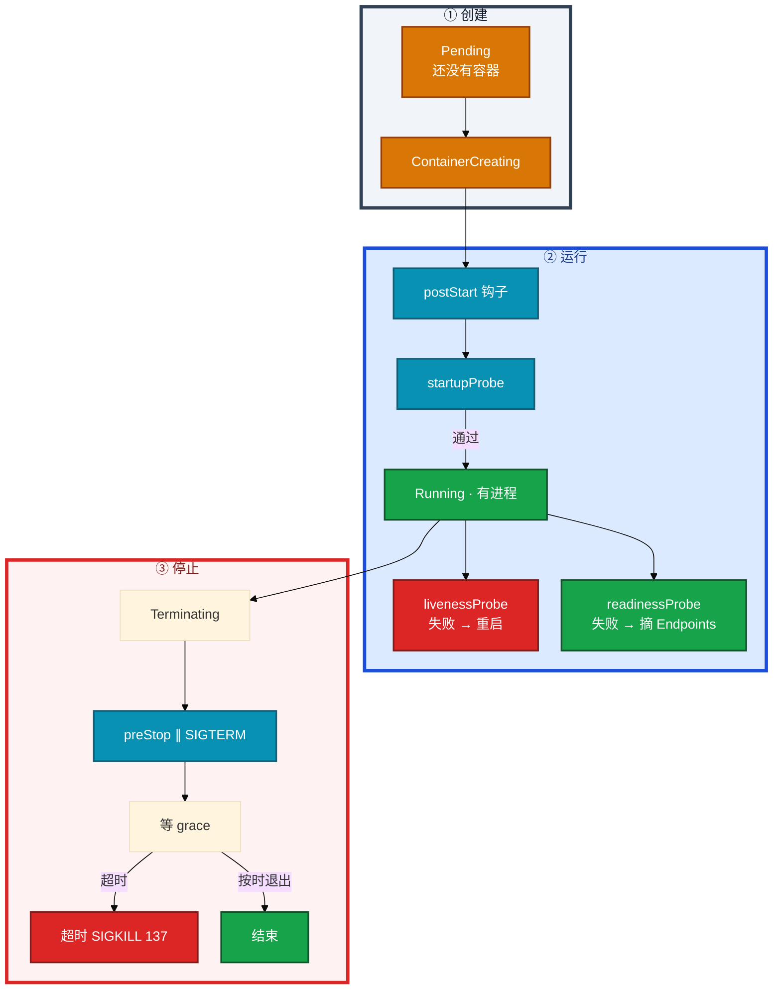
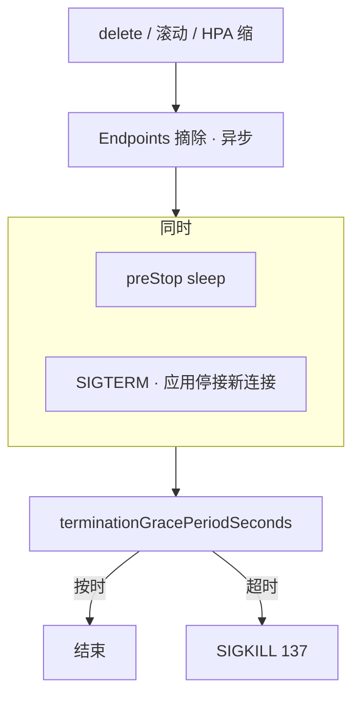
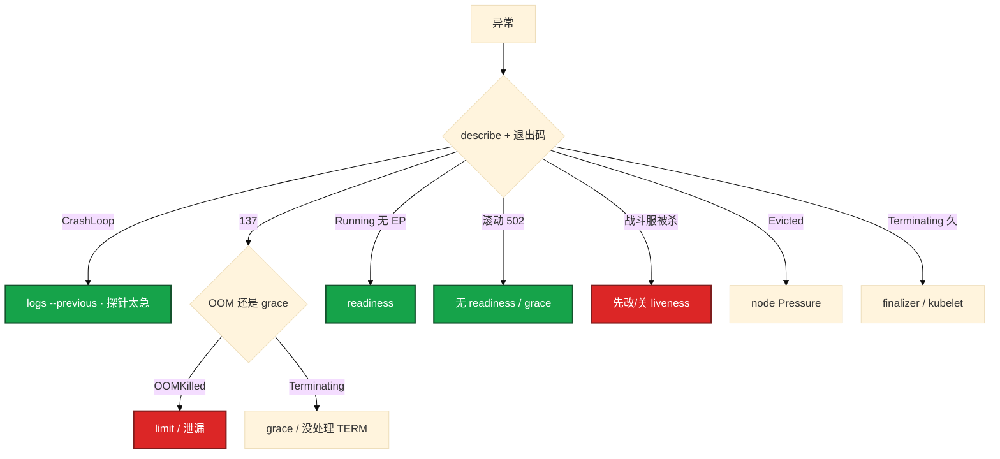

# Pod 生命周期


活动高峰，大厅刚发版，监控一片 CrashLoopBackOff。群里有人要把 liveness `initialDelay` 拉到 120s，另有人给战斗服也抄了同一套 `/health`。滚动还没结束，Service 上一堆 502——不是镜像坏了，是探针和退出链配错了。

**本章主线（探针与退出就按这三步想）：**

1. **三探针**：startup 护启动；liveness 失败重启；readiness 失败只摘流。
2. **退出链**：Endpoints 摘除异步；preStop 与 SIGTERM 并行；grace 不够 → 137。
3. **有状态**：慎 liveness；禁 Deployment 默认滚与 HPA 缩战斗服。

**读完你能：** 白板上画 Pod 从 Pending 到 Terminating；三条探针失败动作不同；滚动 502 能对上摘流和 SIGTERM；OOMKilled 和 Evicted 分责；有状态战斗服为什么不能随便杀。

## 本章目录

- [1. 基本概念](#1-基本概念)
- [2. 架构图](#2-架构图)
- [3. 原理](#3-原理)
- [4. 安装部署](#4-安装部署)
- [5. 核心配置](#5-核心配置)
- [6. 命令与操作](#6-命令与操作)
- [7. 生产排障](#7-生产排障)
- [8. 必会 · 常考](#8-必会--常考)
- [合上书](#合上书问自己)

**本章不讲：** Deploy/STS 滚动、PDB → [05 工作负载控制器](../05-工作负载控制器/)；Pending、污点、request 记账 → [06 调度机制](../06-调度机制/)；HPA 缩容杀进程 → [07 弹性伸缩](../07-弹性伸缩/)；Endpoints 为空、摘流细节 → [08 Service与kube-proxy](../08-Service与kube-proxy/)；节点 NotReady 驱逐 → [16 节点运行时与升级](../16-节点运行时与升级/)；CrashLoop/OOM 排障串题 → [17 排障实战](../17-排障实战/)。

---

## 1. 基本概念

你 apply 了一份大厅 Deployment。几秒后 `kubectl get po` 有行了。STATUS 从 Pending 变到 Running，**不代表玩家已经能打进来**——Running 只说明容器进程起来了，能不能接流量要看 readiness。

Pod 是调度和探针的最小单位。kubelet 在本机执行探针和钩子，**不是控制器远程杀进程**。

**值班里怎么认 STATUS**（先对表，再 `describe`）：

| 状态 | 值班里什么时候碰到 | 含义 | 第一刀 |
|------|-------------------|------|--------|
| Pending | 刚 apply，一直不 Running | 没绑上节点或卷 | Events：资源/污点/PVC（06、11） |
| ContainerCreating | 已调度，卡在起沙箱 | 拉镜像、挂卷、CNI | `describe` Events；节点 `crictl images` |
| Running | 进程在，但 Service 没它 | **不等于 Ready** | readiness 探针；`get ep` |
| CrashLoopBackOff | Restart Count 狂涨 | 反复崩，退避中 | `logs --previous` + 退出码 |
| OOMKilled | 刚起来就死，Last State 有 OOM | 超 memory **limit** | limit 过小还是泄漏 |
| Evicted | 节点压力，Pod 被赶 | 节点 Disk/Memory/PID Pressure | `describe node` Conditions |
| Terminating | delete 后卡很久 | preStop / grace / finalizer | grace 内还是 finalizer |

退出码先看再猜：**137** = 128+9 SIGKILL（OOM 或 grace 超时强杀）；**143** = 128+15 SIGTERM；**139** 段错误；**1** 自己退出。没有日志先看退出码，再 `--previous`。

两条不要混：

| | 探针 Probes | 生命周期钩子 Lifecycle hooks |
|--|-------------|------------------------------|
| 谁跑 | kubelet 周期问容器 | kubelet 在启动/停止时各跑一次 |
| 种类 | startup / liveness / readiness | postStart / preStop |
| 失败 | 重启或摘 Endpoints | 钩子失败影响启动/停止，**不是**周期健康检查 |
| 和 SIGTERM | 无关 | preStop **和** SIGTERM 并行，不是「跑完再发」 |

**打个比方**：探针像保安每隔几分钟敲门问「还活着吗 / 能接客吗」；钩子是开业前挂招牌（postStart）、打烊前拉卷帘门（preStop）——各干一次，不是保安的工作。

> **记住**：Pending 是调度；ContainerCreating 是本机起进程；Running 不等于能接流量。探针问健康；钩子是启动/退出的一次性动作。

---

## 2. 架构图

后面探针、退出、排障都对着这张图。



**读图三句话：**

1. **从 Pending 往下查**：Pending → 06 调度；ContainerCreating → 镜像/CNI/CSI；Running 无 EP → readiness。
2. **startup 没过，liveness / readiness 不跑**——慢启动用 startup，别把 liveness delay 拉到两分钟。
3. **删 Pod 从 Terminating 进**：Endpoints 摘除异步；preStop 和 SIGTERM 同时走；超时 137。

CrashLoopBackOff、OOMKilled、Evicted 都从 Running 岔出去，不是一种独立探针。CrashLoop 是 `restartPolicy: Always` 下反复崩的退避。

---

## 3. 原理

### 3.1 三探针：问的不是同一件事

**一句话：** startup 护启动，liveness 失败重启，readiness 失败只摘流。

**打个比方**：像餐厅——startup 问「厨房开好了没」；liveness 问「厨师还醒着吗，死了就换人」；readiness 问「现在能不能接新客，忙就关门口牌」。三条问的不是同一件事，失败动作完全不同。

**现场走一遍**（大厅 JVM 加载配置表 90s，刚发版就 CrashLoop）：

1. 先看 Pod 状态和重启次数：

```bash
kubectl get po -n hall hall-7d8f9-abc12 -o wide
kubectl describe pod -n hall hall-7d8f9-abc12
```

2. 屏幕 `get po` 出现：

```text
NAME              READY   STATUS             RESTARTS   AGE
hall-7d8f9-abc12  0/1     CrashLoopBackOff   5          3m
```

3. `describe` Events 末尾常见：

```text
Warning  Unhealthy  ...  Liveness probe failed: Get "http://10.244.1.8:8080/health": dial tcp ... connect: connection refused
Warning  BackOff    ...  Back-off restarting failed container
```

4. 对照 YAML：liveness `initialDelaySeconds: 5`，没有 startup——容器 90s 才 listen，5s 就被判死，重启，再判死，进入 CrashLoopBackOff。

5. 修法：加 startup（period=10, failureThreshold=18 → 最坏 180s），通过后 liveness 保持短周期专抓死锁。

6. 再查 Endpoints——readiness 失败时 Running 但不在 EP 里：

```bash
kubectl get ep -n hall hall-svc
kubectl get po -n hall hall-7d8f9-abc12 -o jsonpath='{.status.conditions[?(@.type=="Ready")].status}{"\n"}'
```

**输出解读：**

| 字段 / 现象 | 说明 | 下一步 |
|-------------|------|--------|
| `RESTARTS: 5` + CrashLoopBackOff | liveness/startup 过严或进程真崩 | `logs --previous`；看 Events 是 Unhealthy 还是 Exit |
| Events `Liveness probe failed` | kubelet 杀容器重启 | 查 startup 窗口够不够 |
| Events `Readiness probe failed` | 只摘流，**不**加 RESTARTS | `get ep` 确认没这个 Pod IP |
| Ready condition `False` | 不等于 CrashLoop | 区分 liveness 还是 readiness |
| 两条探针同一 URL + 慢请求 | liveness 把「忙」当「死」 | 拆开：liveness 浅，readiness 深 |

检测方式：httpGet / tcpSocket / exec / grpc。startup 最坏时间 ≈ `failureThreshold × periodSeconds`。

**错误配法（现场见过）：**

1. liveness 和 readiness 同一条「业务健康」：请求一慢就被重启。
2. 没有 startup，liveness delay 120s：30s 就能起来，中间 90s 盲区。
3. liveness 打 Redis/MySQL：依赖抖一下，逻辑服集体重启。
4. readiness 永远成功：未就绪就进 Endpoints，滚动 502。

**面试怎么说**：「三条探针失败动作不同：startup 护启动，liveness 重启，readiness 只摘 Endpoints。慢启动用 startup，不要把 liveness 和 readiness 写成同一个 /health。」

> **记住**：startup 护启动；liveness 失败重启；readiness 失败摘流不重启。

### 3.2 探针 vs 生命周期钩子

**一句话：** 钩子是启动/停止各跑一次；探针是周期健康检查。

**打个比方**：钩子是开业挂招牌、打烊拉卷帘门——各做一次；探针是保安每隔几分钟敲门——反复问。

**现场走一遍**（滚动 502，有人以为 preStop 跑完才发 SIGTERM）：

1. 看 Pod 终止过程：

```bash
kubectl delete pod -n hall hall-old-xyz --grace-period=60
kubectl get po -n hall hall-old-xyz -w
kubectl describe pod -n hall hall-old-xyz | tail -20
```

2. 屏幕 `get po -w`：

```text
hall-old-xyz   1/1   Terminating   0   10m
```

3. 同时查 Endpoints——IP 可能还在几秒：

```bash
kubectl get ep -n hall hall-svc -o yaml | grep -A2 addresses
```

4. 若 preStop 只有 `sleep 5`，但应用收到 SIGTERM 立刻 `os.Exit(0)`，kube-proxy 还没摘干净 → 502。

5. 正确：preStop sleep 等数据面；**应用必须**停接新连接、刷完再退出；grace > preStop + 刷盘。

**输出解读：**

| | postStart | preStop | 三探针 |
|--|-----------|---------|--------|
| 时机 | 容器创建后，**不保证**主进程已 listen | 收到停止时，**与 SIGTERM 并行** | 按 period 反复 |
| 失败 | 可能影响启动 | 占 grace，太慢 → 137 | 见 3.1 |
| 典型用法 | 写文件、注册（少用） | sleep 等摘流 | 健康与摘流 |

postStart 和主容器入口 **异步**。严格先后用 Init 容器，不要 postStart 里做「必须先于主进程」的事。

**面试怎么说**：「钩子和探针不是一回事。preStop 不是跑完再发 SIGTERM，是和 SIGTERM 并行。sleep 5 只等 kube-proxy 摘流，不能替代应用处理 SIGTERM。」

> **记住**：钩子一次性；探针周期问。preStop ∥ SIGTERM。

### 3.3 restartPolicy

**一句话：** restartPolicy 决定容器退出后 kubelet 要不要再来拉。

**打个比方**：Always 像 24 小时便利店——关门了自动再开；OnFailure 像 retry 脚本——只有报错才重跑；Never 像一次性任务——跑完就散。

**现场走一遍**（Init 失败，主容器永远起不来）：

1. 支付 Pod 加了 Init 等 MySQL：

```bash
kubectl describe pod -n pay pay-abc -n pay
kubectl logs -n pay pay-abc -c init-db
```

2. Events：

```text
Warning  Failed  ...  Init:Error
Warning  BackOff ...  Back-off restarting failed container init-db
```

3. 主容器 `State: Waiting`，Reason 常是 `PodInitializing`——Init 失败，**主容器不会启动**，整个 Pod 按 restartPolicy 重启。

4. 若把小时级 schema 迁移塞进 Init，每次重建都重跑，滚动被拖死 → 用 Job，不要塞 Init。

**输出解读：**

| 值 | 谁用 | 行为 |
|----|------|------|
| **Always** | Deploy/STS/DS **默认** | 任何退出都重启；CrashLoopBackOff 是退避 |
| **OnFailure** | Job 常用 | 非 0 才重启；0 就停 |
| **Never** | 一次性、排障 Pod | 不重启 |

Deploy template 写 `Never` 会被拒。Job 写 Always：成功也会被再拉，completions 对不上。

Init 容器失败 → 整个 Pod 重启，主容器起不来。1.28+ sidecar：`initContainers` + `restartPolicy: Always`，kubelet 先起 sidecar、等 Ready 再起主容器（见 05）。

**面试怎么说**：「CrashLoopBackOff 不是探针类型，是 Always 下反复崩的退避。Init 失败主容器起不来；长时间任务用 Job，不要塞 Init。」

> **记住**：CrashLoop = Always + 反复崩。Job 才 OnFailure/Never。

### 3.4 优雅退出：502 从这里来

**一句话：** 502 来自摘流异步与应用退出抢跑，不是镜像坏了。

**打个比方**：像公交换班——旧司机还没下车（Endpoints 还在），新乘客已经上车（流量仍打到旧 Pod），旧车突然熄火（进程退出）→ 502。

**现场走一遍**（滚动大厅一堆 502）：

1. 滚动时盯旧 Pod 和 EP：

```bash
kubectl rollout status deploy/hall -n hall
kubectl get ep -n hall hall-svc -w
kubectl describe pod -n hall <terminating-pod> | grep -A5 "State\|Exit"
```

2. 旧 Pod Terminating，EP 里 IP 可能还在 3～5s（kube-proxy/IPVS/云 LB 各不同）。

3. 容器 Exit Code **137** → grace 内没退出，被 SIGKILL（不一定是 OOM）。

4. 对照 YAML：`terminationGracePeriodSeconds: 30`，preStop sleep 5，但 Java 没处理 TERM，shell 当 PID 1 收不到信号 → 30s 后 137。

**输出解读：**



| 现象 | 说明 | 修法 |
|------|------|------|
| EP 已无 IP 仍 502 | 数据面延迟（IPVS 表） | 加长 preStop sleep；确认 readiness 先摘 |
| Exit 137 + Terminating | grace 不够或没处理 TERM | grace ≥ preStop + 刷盘；tini/dumb-init |
| 新 Pod Running 就 502 | 无 readiness，未就绪进 Service | 配 readiness |
| `maxUnavailable=0` 仍 502 | 问题在探针/grace，不是滚动公式 | 04 不是 05 alone |

生产套路：

```yaml
terminationGracePeriodSeconds: 60
lifecycle:
  preStop:
    exec:
      command: ["/bin/sh", "-c", "sleep 5"]
```

**面试怎么说**：「删 Pod 时 Endpoints 摘除异步，preStop 和 SIGTERM 并行。502 多是应用立刻退出而流量还在路上。grace 默认 30s 常不够，生产常 60s，且应用必须处理 SIGTERM。」

> **记住**：摘流异步；preStop ∥ SIGTERM；超时 137。sleep 不能替代处理 TERM。

### 3.5 QoS：节点 OOM 先杀谁

**一句话：** 调度看 request；容器 OOM 看 limit；节点压力赶人叫 Evicted。

**打个比方**：request 是订座人数，limit 是包厢上限；Evicted 是饭店满了请最低优先级客人离开——不是说你一个人吃超了（OOMKilled），是整个店挤了。

**现场走一遍**（战斗服 Evicted，有人当 OOM 加 limit）：

1. 分责：

```bash
kubectl describe pod -n game battle-xyz | grep -A10 "Last State\|Reason"
kubectl describe node worker-03 | grep -A5 Conditions
```

2. OOMKilled：`Last State: Terminated, Reason: OOMKilled, Exit Code: 137`——**本容器**超 memory limit。

3. Evicted：`Reason: Evicted, Message: ... node was low on resource: memory`——**节点** Pressure，kubelet 按 QoS 赶人。

4. QoS 判定：

```bash
kubectl get po -n game battle-xyz -o jsonpath='{.status.qosClass}{"\n"}'
```

**输出解读：**


| | OOMKilled | Evicted |
|--|-----------|---------|
| 谁动手 | 本容器超 **limit** | 节点 Pressure，kubelet 按 QoS |
| 先看 | Last State OOMKilled；RSS 趋势 | node Conditions Memory/Disk/PID |
| 处理 | limit 过小或泄漏 | 清镜像/日志/emptyDir，扩节点 |

CPU 超 limit：throttle，不杀。没写 request → HPA 算不了（07），调度当 0，易 Evict。核心战斗服 Guaranteed（request=limit），limit 按 **cgroup 总量**留 30–50% 堆外。

**面试怎么说**：「OOMKilled 是容器超自己的 limit；Evicted 是节点压力 kubelet 赶人，看 QoS。调度看 request，不是 top 瞬时。Guaranteed 只是最后被 Evict，不是永不杀。」

> **记住**：调度看 request；OOM 看 limit；Evicted 看节点 Pressure + QoS。

### 3.6 游戏有状态：能不能杀？

**一句话：** 有状态战斗服 liveness 失败等于踢光本服玩家。

**打个比方**：无状态大厅像连锁快餐——关一家换一家；战斗服像单机棋牌室——玩家在桌上，你把店砸了局就没了。

**现场走一遍**（Redis 抖一下，全区战斗服 Restart Count 狂涨）：

1. 告警：战斗服集体重启，玩家掉线。

```bash
kubectl get po -n game -l app=battle
kubectl describe pod -n game battle-shard-2 | grep -A3 "Liveness\|Unhealthy"
```

2. 屏幕：

```text
NAME              READY   STATUS    RESTARTS   AGE
battle-shard-0    1/1     Running   12         2d
battle-shard-1    0/1     Running   11         2d
```

3. Events：`Liveness probe failed: ... Redis connection refused`——liveness 打了 Redis，依赖抖 → kubelet 重启 → 踢光玩家。

4. **第一刀**：改浅 liveness 或临时去掉 Redis 检测，**不要先重启节点**。

5. readiness 打 Redis **可以**：失败只摘流，进程还在，依赖恢复再进 EP。

**输出解读：**

| 操作 | 无状态 API | 有状态逻辑服 |
|------|------------|--------------|
| liveness 失败 | 通常可接受 | **踢光玩家、战斗可能丢** |
| 滚动 | readiness + 多副本 | 先摘流、等对局或热迁移 |
| HPA 缩容 | 杀副本换人 | 杀正在打仗的进程（07） |
| drain + PDB | 保最低副本 | 单副本可能 = 一个区服 |

1. 慎配 liveness，或只探死锁、阈值拉宽。
2. 杀之前：停匹配、禁新进、等对局结束。
3. 大厅/网关可按 Web；房间进程按有状态，常 STS 或自研调度（05）。
4. **readiness 仍要配**——没加载完配置表不要进 Endpoints。

**面试怎么说**：「HPA 和 liveness 都不区分你是不是游戏服。有状态战斗服慎 liveness，禁止无脑滚和 HPA 自动缩。readiness 摘流不等于杀进程，仍要配。」

> **记住**：有状态慎 liveness、禁无脑滚/HPA 缩；readiness 仍要。

---

## 4. 安装部署

Pod 没有单独「安装」。生产落地是 YAML 约定和节点 kubelet。

| 项 | 选 | 不选 |
|----|----|------|
| 大厅 / 网关 | Deploy + 三探针拆开 + grace + preStop | liveness=readiness 同一 URL |
| 战斗服 | 浅 liveness 或慎配；readiness 必配；STS 或自研 | Web 模板抄业务健康 liveness |
| QoS | 核心 Guaranteed（request=limit） | 业务节点混 BestEffort |
| Init | 等依赖、短任务 | 小时级 schema 当 Init |
| sidecar | 1.28+ initContainers + restartPolicy: Always | 旧 Init hack 抢跑 |

探针和钩子都是节点 kubelet 执行。控制面静态 Pod 节点上也有 kubelet。

验收：慢启动服有 startup；滚动后无 502；`get ep` 只有 Ready Pod；战斗服无错误 liveness 杀进程。

---

## 5. 核心配置

改探针等于改自愈行为，活动中误改 liveness 能把全区杀光。

| 字段 | 生产怎么用 | 改错会怎样 |
|------|------------|------------|
| `startupProbe` | failureThreshold × period 覆盖最坏启动 | 无 startup + liveness 太急 → CrashLoop |
| `livenessProbe` | 浅，只问死锁；逻辑服慎配 | 打 Redis / 业务忙 → 集体重启 |
| `readinessProbe` | 问能否接流量；滚动必配 | 永远成功 → 502 |
| `timeoutSeconds` | 接口允许的慢 | 太短稍慢就算失败 |
| `terminationGracePeriodSeconds` | **> preStop + 刷盘**，常 60s | 默认 30s → 137 |
| `lifecycle.preStop` | sleep 等摘流 | 以为先跑完再 TERM |
| `restartPolicy` | Deploy Always；Job OnFailure/Never | Deploy Never 不符合语义 |
| `resources` | 核心 request=limit；limit 按 cgroup 总量 | 没 request 调度当 0 |

示例（大厅）：

```yaml
startupProbe:
  httpGet: { path: /health, port: 8080 }
  periodSeconds: 10
  failureThreshold: 18
livenessProbe:
  httpGet: { path: /live, port: 8080 }
  periodSeconds: 10
  failureThreshold: 3
readinessProbe:
  httpGet: { path: /ready, port: 8080 }
  periodSeconds: 5
  failureThreshold: 2
```

> **记住**：startup 窗口 = failureThreshold × period。grace > preStop + 刷盘。

---

## 6. 命令与操作

### 6.1 命令速查

```bash
kubectl describe pod <pod> -n <ns>
kubectl logs <pod> -n <ns> --previous
kubectl get po -o wide
kubectl get ep,endpointslice -n <ns>
kubectl get po <pod> -o jsonpath='{.status.containerStatuses[0].lastState.terminated.exitCode}{"\n"}'
```

| 目的 | 命令 | 看什么 |
|------|------|--------|
| 探针 / 退出码 | `describe pod` | Events、Last State、Ready |
| CrashLoop 没日志 | `logs --previous` | 上次死前输出 |
| 没进 Service | `get ep` / endpointslice | Ready 失败或 Label |
| OOM vs Evict | pod Last State；node Conditions | limit vs Pressure |
| QoS | `jsonpath qosClass` | Guaranteed / Burstable / BestEffort |

### 6.2 典型操作

**滚动大厅**：readiness 挡未就绪；preStop 等摘流；grace 够长；应用处理 SIGTERM。

**战斗服被 liveness 杀光**：先改/关 liveness 止血，再查 Redis，不要先重启节点。

**Terminating 卡很久**：

```bash
kubectl get po <pod> -n <ns> -o yaml | grep finalizers
kubectl describe pod <pod> -n <ns> | tail -30
```

grace 内 → 应用没处理 TERM 或 preStop 慢。超时后还卡 → finalizer（CSI/Operator）、kubelet 失联。`--force` 会在 etcd 删对象，节点进程可能变孤儿——游戏服等于断电。

---

## 7. 生产排障

三问：进程还在不在？还能不能接新流量？退出是 grace 还是强杀？



| 现象 | 先做什么 | 不要做什么 |
|------|----------|------------|
| CrashLoop | `logs --previous`；看 137/1/139 | 先重启节点 |
| 刚启动就重启 | startup/liveness 太急 | 加内存碰运气 |
| Running 但 Service 没有 | readiness 失败 | 重装 kube-proxy |
| 滚动 502 | readiness + grace + TERM | 只改滚动公式 |
| 游戏服被探针杀光 | **先改/关 liveness** | 重启节点或再杀一轮 |
| OOMKilled | Last State；limit 或泄漏 | 只说加内存 |
| Evicted | node Pressure | 当 OOM 加 limit |
| Terminating 很久 | grace / finalizer / kubelet | 第一时间 `--force` |

---

## 8. 必会 · 常考

| 说法 | 对错 | 口径 |
|------|:----:|------|
| liveness 和 readiness 可以用同一个 /health | 错 | 慢请求会变成重启 |
| preStop 跑完才发 SIGTERM | 错 | 并行 |
| Running 就能进 Service | 错 | 要 Ready |
| startup 没过也会跑 liveness | 错 | 通过前另外两条不跑 |
| 钩子就是探针 | 错 | 钩子一次性；探针周期 |
| CrashLoopBackOff 是一种探针 | 错 | Always 下反复崩的退避 |
| Deploy 应写 restartPolicy: Never | 错 | 默认 Always |
| 137 一定是 OOM | 错 | 也可能是 grace 超时 SIGKILL |
| Evicted 就是这个容器超了 limit | 错 | 节点 Pressure |
| 调度看瞬时 top | 错 | 看 request / Allocatable |
| 有状态战斗服按 Web 抄 liveness | 错 | 依赖一抖全区被杀 |
| 战斗服不用 readiness | 错 | 没就绪不应进 Endpoints |
| sleep 5 能替代处理 TERM | 错 | sleep 只等摘流 |
| Guaranteed 永不被杀 | 错 | 节点 OOM 顺序最后 |
| 换了 STS 就可以无脑滚战斗服 | 错 | 仍会按序杀进程（05） |

数字：grace 默认 **30s**，生产常 **60s**；startup 窗口 ≈ failureThreshold × period；Java/Go limit 留 **30–50%** 堆外。

易混：探针 vs 钩子；liveness vs readiness；OOMKilled vs Evicted；137 vs 143；摘流异步 vs 进程还在；Init 失败 vs 主容器 CrashLoop。

---

## 合上书，问自己

1. startup / liveness / readiness 失败分别发生什么？能不能用同一个 /health？
2. postStart / preStop 和探针差在哪？preStop 跑完才发 SIGTERM 吗？
3. restartPolicy Always / OnFailure / Never 谁用？CrashLoopBackOff 是什么？
4. 滚动 502 怎么配探针和退出？grace 和 137？
5. QoS 三级？OOMKilled 和 Evicted 谁动手？调度看什么？
6. 有状态逻辑服能不能随便配 liveness、随便杀？readiness 还要不要？

六题都能口述，这一章就过了。下一章把控制器剖开：大厅和战斗服不该用同一种滚动。
