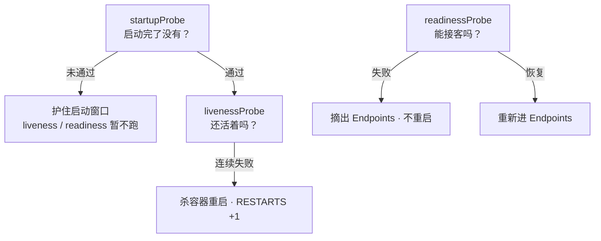
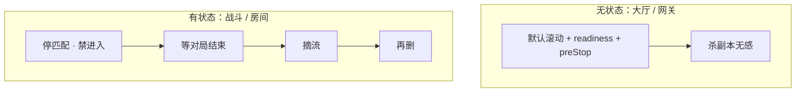
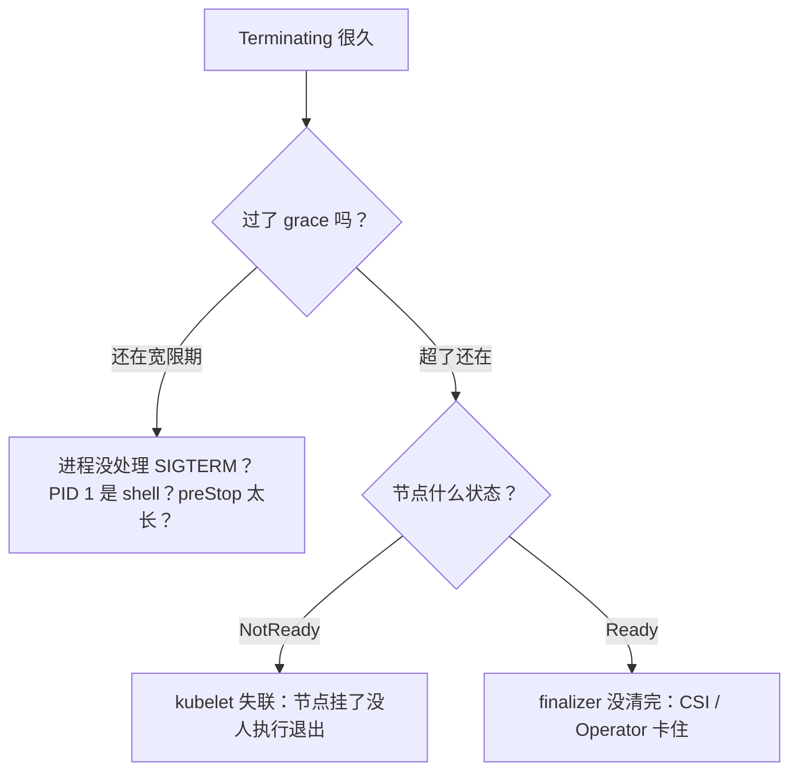
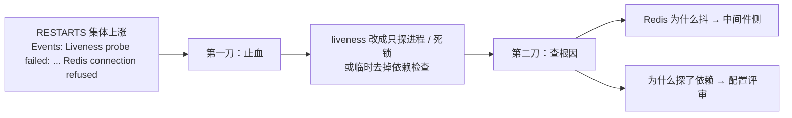

# 04｜Pod 生命周期 · 练习题

先合上知识点，对着 **一节的主图** 把「一个 Pod 的一生」口述一遍——出生三道关 → 三探针值守 → 生病退避 → 死亡五步 → QoS 驱逐顺序——再回来做题。

| 标记 | 含义 |
|------|------|
| **核心** | 不懂整章就没建立起来 |
| **必会** | 值班和面试都要能讲 |
| **常用** | 线上会反复碰到 |
| **常考** | 白板和追问的高频口径 |

## 本题目录

- [Q1 三条探针有什么区别？能写成同一个 /health 吗？](#q1)
- [Q2 删除 Pod 之后到底发生了什么？preStop 和 SIGTERM 谁先？](#q2)
- [Q3 Pod 一直 CrashLoopBackOff，你的排查思路？](#q3)
- [Q4 游戏的有状态逻辑服，能随便杀 Pod 吗？](#q4)
- [Q5 滚动更新期间大量 502，哪些环节出了问题？](#q5)
- [Q6 QoS 三档怎么判定？调度看什么，OOM 看什么？](#q6)
- [Q7 Evicted 和 OOMKilled 有什么区别？](#q7)
- [Q8 Init 容器失败会怎样？能塞长时间任务吗？](#q8)
- [Q9 Pod 一直卡在 Terminating，能直接 --force 吗？](#q9)
- [Q10 战斗服被探针杀光，第一刀做什么？](#q10)
- [Q11 探针和钩子什么区别？restartPolicy 三个值谁用？](#q11)
- [Q12 Pod 卡在出生：Pending、ContainerCreating、ImagePullBackOff 怎么分？](#q12)
- [Q13 graceful 下线与战斗服](#q13)
- [Q14 60 秒 Pod 定责](#q14)
- [合上书](#合上书)

---

## Q1

**★★★★★｜三条探针有什么区别？能写成同一个 /health 吗？**

**覆盖**：核心 · 必会 · 常考 ｜ **对应**：知识点 [三、体检：三条探针问的不是一件事](知识点.md)

### 场景

新同学抄了大厅的 YAML，把 liveness 和 readiness 都指到业务深检 `/health`（里面查 Redis、查配置表），又没加 startup——结果请求一抖容器就重启，慢启动的版本直接 CrashLoop。他准备把 liveness 的 `initialDelaySeconds` 拉到 120s「治一治」。

### 完整解答

> 🎯 **一句话**：三探针问三件事——护启动、判生死、管流量，失败动作完全不同。

**探针（Probe）**是 kubelet 周期性对容器执行的健康检查。**startupProbe（启动探针）**问「启动完了没有」，它没成功之前另外两条不跑；**livenessProbe（存活探针）**问「进程还活着吗」，失败 → 杀容器重启；**readinessProbe（就绪探针）**问「现在能接流量吗」，失败 → 从 Endpoints 摘除，**不重启**。



**读图**：从上往下——startup 是闸门，通过后 liveness 管「死没死」、readiness 管「忙不忙」，两条从此各管各的。共用一个深检 `/health`，等于把「忙」也判成「死」：请求一慢就重启。

共用参数：`initialDelaySeconds`（默认 0）、`periodSeconds`（默认 10）、`timeoutSeconds`（默认 1）、`failureThreshold`（默认 3）；检测方式 `httpGet` / `tcpSocket` / `exec` / `grpc`。startup 能护的最长窗口 ≈ `failureThreshold × periodSeconds`——慢启动用它，比如 `periodSeconds=10, failureThreshold=18` 护 180s，**不要**把 liveness delay 拉到 120s 代替：30s 就能起的服务中间是盲区，真超 120s 还是被杀。

> ⚠️ **别混**：liveness 失败是**重启**（RESTARTS 涨），readiness 失败是**摘流**（不涨）。「卡死只能重启救」才配 liveness；「太忙接不了客」配 readiness。把依赖检查写成 liveness = 依赖一抖就杀进程，写成 readiness = 依赖一抖先不接客、恢复自动回来。

> 📝 **面试**：「startup 护启动、通过前另外两条不跑；liveness 失败重启；readiness 失败只摘 Endpoints。慢启动用 startup，不共用同一个 /health，不把依赖探活写成 liveness。」

### 再追问

- **liveness 失败，Service 会不会也把它摘掉？** 两套独立系统：liveness 只触发 kubelet 重启，Service 流量由 readiness / Endpoints 决定。重启过程中 Pod 不健康，readiness 通常也失败、自然摘流——但机制上是两条线。**不要**以为配了 liveness 就等于「不健康自动没流量」。
- **四种最常见的错配？** ① liveness/readiness 共用业务深检；② 没 startup、delay 拉 120s；③ liveness 打 Redis/MySQL；④ readiness 永远成功（没就绪就进 Endpoints，滚动 502）。

---

## Q2

**★★★★★｜删除 Pod 之后到底发生了什么？preStop 和 SIGTERM 谁先？**

**覆盖**：核心 · 必会 · 常考 ｜ **对应**：知识点 [五、死亡：优雅退出链](知识点.md)

### 场景

滚动更新掉连接，有人加了 `preStop: sleep 10` 以为万事大吉——但应用没处理 SIGTERM，grace 到期照样 137；还有人坚持「preStop 跑完才发 TERM」，把 30 秒的落盘逻辑塞进 preStop，退出更慢了。

### 完整解答

> 🎯 **一句话**：摘流异步 ∥ preStop ∥ SIGTERM，grace 到期 SIGKILL——三条线在赛跑。

`kubectl delete`（滚动、HPA 缩容、drain 同一条链）之后：

1. apiserver 打 `deletionTimestamp`，STATUS 变 **Terminating**；
2. 控制面把 Pod 从 Endpoints / EndpointSlice 移除——**异步**，数据面生效还要几秒；
3. kubelet 触发 **preStop** 并向容器 PID 1 发 **SIGTERM**——官方口径：**并行**处理，不是「跑完 preStop 再发 TERM」；
4. 等 **terminationGracePeriodSeconds（终止宽限期）**，默认 30s；
5. 到期没死 → **SIGKILL** 强杀，退出码 **137**。

> ⚠️ **别混**：`preStop: sleep 5` 只给数据面争取排空时间，**不能替代应用处理 SIGTERM**。应用必须自己：停新连接 → 做完 in-flight → 状态落盘 → 退出。信号还要能到 PID 1：`sh -c "java ..."` 让 shell 当 PID 1 时默认不转发信号，用 exec 形式或 `tini` / `dumb-init`。

```yaml
terminationGracePeriodSeconds: 60            # ← 必须 > preStop + 排空，默认 30 常不够
lifecycle:
  preStop:
    exec:
      command: ["/bin/sh", "-c", "sleep 5"]  # ← 只等摘流
```

> 📝 **面试**：「502 的根因是摘流异步和进程退出抢跑。五件套：readiness 挡新 Pod 入口、preStop 等摘流、应用处理 SIGTERM、grace > preStop + 排空、不轻易 force。只改 maxUnavailable 是改杀的速度，不改抢跑。」

### 再追问

- **grace 默认多少？生产怎么定？** 默认 30s；游戏服要盖住「最坏一次存盘 + preStop」，常配 60s。宁长勿短，但也**不要**无限大——卡住的 Pod 会拖死滚动节奏。
- **怎么确认进程到底有没有收到 SIGTERM？** 退出码 143（128+15）说明收到并按默认动作退出；应用捕获后正常退是 0；什么都没有、直接 137，多半是信号没送到（PID 1 问题）或没处理。
- **preStop 没跑完或失败了，会阻止删除吗？** 不会：grace 一到 SIGKILL 照发，钩子只争取时间、不是保险丝。**不要**把落盘逻辑押在 preStop 里。

---

## Q3

**★★★★★｜Pod 一直 CrashLoopBackOff，你的排查思路？**

**覆盖**：核心 · 必会 · 常用 · 常考 ｜ **对应**：知识点 [四、生病：崩溃、重启与退避](知识点.md)

### 场景

大厅新版本上线后 CrashLoopBackOff，RESTARTS 一路涨。有人准备「先重启节点试试」，有人看着空日志说「应用没打日志，没法查」。

### 完整解答

> 🎯 **一句话**：先看退出码定类型，再 `logs --previous` 看上辈子，别先重启。

**CrashLoopBackOff** 不是探针也不是独立状态：它是 `restartPolicy: Always` 的 Pod 反复崩溃后的**退避**状态，重启间隔从 10s 翻倍、封顶 5 分钟——Events 签名 `Back-off restarting failed container`。退避期正好是留给排查的时间。

```bash
kubectl logs -n hall hall-7d8f9-abc12 --previous
# ← 当前容器可能还没打出东西，上辈子（崩溃前）的日志在这里
kubectl get po -n hall hall-7d8f9-abc12 -o jsonpath='{.status.containerStatuses[0].lastState.terminated}{"\n"}'
# {"exitCode":137,"reason":"OOMKilled",...}   # ← reason + exitCode 定生死
```

退出码先认：

- **137** = 128+9（SIGKILL）：容器 OOM **或** grace 超时强杀，看 Last State 的 reason 分辨；
- **143** = 128+15（SIGTERM）；**139** = 128+11 段错误；**1** 应用自己带错退出。

> ⚠️ **别混**：「137 一定是 OOM」是高频错答——Terminating 期间超时被 SIGKILL 也是 137。

**空日志不是没得查**：容器可能根本没跑到主进程——command 写错、环境变量缺、挂载失败。回 `describe` 看 Events 里 `Created` / `Started` 到哪一步断了，再看退出码和探针记录。

> 📝 **面试**：「CrashLoop 第一刀：退出码定类型，`logs --previous` 看崩溃前日志，Events 看探针和拉镜像记录。137 先分 OOM 还是被强杀，不要上来重启节点。」

### 再追问

- **137 到底是 OOM 还是 grace 超时？** `describe` 的 Last State：`Reason: OOMKilled` 是超 limit；`Reason: Error` 且时间点正卡在删除/滚动，是退出太慢被强杀。两者一个查内存，一个查退出链，**不要**都按「加内存」处理。
- **和 Init 失败怎么区分？** Init 失败显示 `Init:Error` / `PodInitializing`，主容器从未启动；主容器崩才是 CrashLoopBackOff 带 RESTARTS 上涨。

---

## Q4

**★★★★★｜游戏的有状态逻辑服，能随便杀 Pod 吗？**

**覆盖**：核心 · 必会 · 常考 ｜ **对应**：知识点 [七、游戏有状态：战斗服能不能杀](知识点.md)

### 场景

有人照 Web 模板给战斗服配了 liveness（探「业务健康」含 Redis）、挂了 Deployment 默认滚动、开了 HPA 自动缩容。值班问他：「这样配有什么问题？」

### 完整解答

> 🎯 **一句话**：战斗进程的内存就是对局，杀进程 = 踢光本服玩家。

无状态大厅像连锁快餐——关一家客人去另一家；战斗服像单机棋牌室——玩家在桌上，砸了店局就没了。三件事各归各位：

- **liveness**：慎配。只探进程 / 死锁这类「只能重启救」的问题；**不要**探依赖和业务繁忙，否则 Redis 抖 3 秒全区重启。
- **滚动**：禁止默认滚。要杀先**摘流**：停匹配、禁新玩家 → 等对局结束（或热迁移）→ 再删。滚动与 PDB 见 [05](../05-工作负载控制器/)。
- **HPA 缩容**：不能自动缩——缩掉的副本里可能正在打仗（[07](../07-弹性伸缩/)）。



**读图**：上半是 Web 模板能直接套用的世界，下半是游戏有状态的正确杀序——四步少一步就是踢人。慎配 liveness **不等于不配探针**：readiness 反而必须配，没就绪不能进 Endpoints。

> 📝 **面试**：「有状态战斗服慎配 liveness，只探死锁；杀之前停匹配、等对局；禁默认滚动和 HPA 自动缩。readiness 必配——摘流不等于杀进程。」

### 再追问

- **readiness 打 Redis 可以吗？** 可以——失败只摘流，进程还在，依赖恢复自动回 Endpoints。同一个检查写成 liveness 就不行：变成「依赖一抖杀进程」。
- **单副本区服遇到节点维护怎么办？** drain 前先确认有没有第二副本或停服窗口；**不要**默认 PDB 一挂就放心——单副本场景下「保最低 1 个」等于没得保。

---

## Q5

**★★★★☆｜滚动更新期间大量 502，哪些环节出了问题？**

**覆盖**：必会 · 常用 · 常考 ｜ **对应**：知识点 [五、死亡：优雅退出链](知识点.md)

### 场景

新版本滚动，旧副本下线瞬间网关 502 一片。有人把 `maxUnavailable` 改成 0、`maxSurge` 拉大，说「滚慢点就不会 502 了」。

### 完整解答

> 🎯 **一句话**：502 是摘流没完成就打到了正在关门的进程，不是滚动太快。

四个环节逐个查（五件套对号入座）：

1. **新副本没就绪就被删旧** → readiness 没配或太宽松；
2. **旧副本摘流未完成** → Endpoints 变更到 kube-proxy / IPVS / 云 LB 生效是异步的（秒级），preStop sleep 太短或没配；
3. **进程秒退** → 没处理 SIGTERM，grace 内直接退或超时被 137；
4. **长连接挂在旧副本** → 网关 / 客户端不重连，要应用层处理。

```bash
kubectl get ep -n hall hall-svc        # ← 旧 Pod IP 摘除要时间；摘了还 502 是数据面传播延迟
```

> ⚠️ **别混**：`maxUnavailable=0` 只保证「旧的不先死」，**不保证**新的就绪、摘流完成、进程善终——四件事一件没做，照样 502。滚动公式归 [05](../05-工作负载控制器/)，本章管的是每个副本死得体面。

### 再追问

- **startupProbe 和拉大 liveness 的 initialDelaySeconds 怎么选？** 慢启动用 startup 护窗口（`failureThreshold × periodSeconds` 盖住最坏启动），liveness 保持短周期抓死锁；拉 delay 是盲区换延迟发现。**不要**把 failureThreshold 调到 50 碰运气——灵敏度一起没了。
- **preStop sleep 几秒合适？** 按数据面实测：摘流传播通常秒级，5–15s 常见；配了还 502，先确认是「摘流延迟」还是「没处理 TERM」——**不要**一味加长。

---

## Q6

**★★★★☆｜QoS 三档怎么判定？调度看什么，容器 OOM 看什么？**

**覆盖**：核心 · 必会 · 常考 ｜ **对应**：知识点 [六、体质：QoS 三档与节点驱逐](知识点.md)

### 场景

有人问：「调度器分配资源看 limit 还是 request？容器被 OOM 杀又是看谁？」另一个同学抢答：「都看 limit，limit 就是上限嘛。」

### 完整解答

> 🎯 **一句话**：调度看 request，容器 OOM 看 limit，节点塌方谁先死看 QoS。

**QoS（Quality of Service）**在 Pod 创建时由资源配置**算出来**，三档：

- **Guaranteed**：每个容器都设了 cpu + memory，且 requests == limits；
- **Burstable**：设了一部分，够不上 Guaranteed；
- **BestEffort**：什么都没设。

三个动作三套账：

1. **调度**看 **request** 与节点 Allocatable——不看瞬时 top，所以 request 写小了会超卖；
2. **容器级 OOM** 看 **limit**——cgroup 上限，超了就 OOMKilled（137）。CPU 超 limit 只 throttle，不杀；
3. **节点级驱逐**看 **QoS**：压力来了按 BestEffort → Burstable（按超额程度）→ Guaranteed 的顺序赶。同一顺序写在内核 **OOMScoreAdj（oom_score_adj）**里：Guaranteed -997、BestEffort 1000——内核 OOM Killer 动手时方向一致。

```bash
kubectl get po -n game battle-xyz -o jsonpath='{.status.qosClass}{"\n"}'
# Burstable   # ← 不是声明的，是 request/limit 写法算出来的
```

> ⚠️ **别混**：**Guaranteed 不是「永不被杀」**——只是驱逐顺序最后；节点压力足够大照样轮到它。核心业务除了 Guaranteed，还要反亲和打散 + limit 留够堆外余量（30–50%）。

> 📝 **面试**：「三个动作三套账：调度看 request，容器 OOM 看 limit，节点塌方按 QoS 驱逐；OOMScoreAdj 让内核 OOM 和 kubelet 驱逐同序。」

### 再追问

- **战斗服不写 request 会怎样？** 调度器按 0 记账 → 节点超卖；HPA 算不出利用率；压力一来最先被赶。三头亏，**不要**为了「省资源」不写。
- **Burstable 和 BestEffort 谁先被赶？** BestEffort 无条件先走；Burstable 按「用量 / request」超标程度排——所以 request 写得越离谱，死得越早。

---

## Q7

**★★★★☆｜Evicted 和 OOMKilled 有什么区别？**

**覆盖**：必会 · 常用 · 常考 ｜ **对应**：知识点 [六、体质：QoS 三档与节点驱逐](知识点.md)

### 场景

监控报了一批 Pod 死亡，有人说「都是内存爆了，统一加 limit」，于是把 Evicted 的 Pod 也加了内存——第二天照样死。

### 完整解答

> 🎯 **一句话**：OOMKilled 是容器超自己的 limit，Evicted 是节点塌方按 QoS 赶人。

| | OOMKilled | Evicted |
|--|-----------|---------|
| 谁动手 | 本容器超 memory limit，cgroup 杀 | 节点有压力，kubelet 按 QoS 驱逐 |
| 怎么认 | Last State：`Reason: OOMKilled, Exit Code: 137` | `Reason: Evicted`，message `node was low on resource: ...` |
| 处理 | limit 过小还是泄漏？看 RSS 趋势 | 救节点：清镜像/日志/emptyDir、扩容 |

```bash
kubectl describe pod -n game battle-xyz | grep -A6 "Last State"
# Reason: OOMKilled  Exit Code: 137          # ← 自己吃超了
kubectl get po -A --field-selector=status.phase=Failed | grep Evicted
# node was low on resource: memory            # ← 被节点连坐
kubectl describe node worker-03 | grep -A6 Conditions
# MemoryPressure True / DiskPressure True     # ← 压力信号在这
```

> ⚠️ **别混**：给 Evicted 的 Pod 加 limit 是**药不对症**——它没超自己的额，是节点没余粮；该清的是节点（镜像、日志、emptyDir），或扩容 / 迁走低优负载。

### 再追问

- **磁盘压力也会赶人吗？** 会：`nodefs.available`（默认阈值 10%）、`imagefs.available`、PID 耗尽都是驱逐信号——Evicted 的 message 里写了 low on 什么，照着清。
- **PDB 能挡住驱逐吗？** 不能——Eviction 是非自愿中断，PDB 只保护 drain / 滚动这类自愿操作。**不要**以为挂了 PDB 节点压力时 Pod 就安全。
- **Evicted 的 Pod 对象会留在集群里吗？** 会：留在 Failed 状态当取证记录，控制器补建的是新 Pod。**不要**把残骸当「没恢复」，排查完按 `status.phase=Failed` 过滤清掉。

---

## Q8

**★★★☆☆｜Init 容器失败会怎样？长时间任务能塞 Init 吗？**

**覆盖**：必会 · 常用 ｜ **对应**：知识点 [二、出生：从 apply 到容器跑起来](知识点.md)

### 场景

开发把一段小时级的数据库迁移塞进 Init 容器，说「这样主容器起来时数据一定是新的」。某次节点故障重建，迁移从头重跑，滚动被拖死。

### 完整解答

> 🎯 **一句话**：Init 按顺序跑、失败整 Pod 重试；长任务用 Job，不塞 Init。

Init 容器**顺序执行**，全部成功才起主容器；任何一个失败，整个 Pod 按 restartPolicy 重试，主容器永远停在 Waiting、Reason 是 `PodInitializing`（Events 里 `Init:Error` / `Back-off restarting failed container init-xxx`）。

```bash
kubectl get po -n game game-abc12
# NAME          READY   STATUS            RESTARTS   AGE
# game-abc12    0/1     PodInitializing   0          12m   # ← 主容器从未启动，卡的是 Init
kubectl describe pod -n game game-abc12 | grep -B2 -A4 "init-db"
# ← 看失败的 Init 容器的退出码和日志
```

选型：**短任务**（等依赖就绪、拉密钥）放 Init；**小时级迁移**放 Job——Job 是一次性的，不随 Pod 重建重跑。

### 再追问

- **常驻进程想跟主容器同生共死怎么办？** 用 1.28+ 原生 sidecar：initContainers 里写 `restartPolicy: Always`，先于主容器起、晚于主容器退。**不要**塞进 postStart 或主容器启动脚本。
- **Init 失败和主容器崩怎么一眼区分？** Init 失败是 `Init:Error` / `PodInitializing`、主容器从未启动；主容器崩是 CrashLoopBackOff、RESTARTS 涨。**不要**对着 `PodInitializing` 去查应用代码。
- **为什么 sidecar 能直接探主容器的端口？** 同 Pod 容器共享网络命名空间：一个 Pod 一个 IP，容器间 localhost 直通，端口不能撞。**不要**让它们绕道 Service 互相访问。

---

## Q9

**★★★★☆｜Pod 一直卡在 Terminating，能直接 --force 吗？**

**覆盖**：必会 · 常用 · 常考 ｜ **对应**：知识点 [五、死亡：优雅退出链](知识点.md)

### 场景

战斗服副本删了 10 分钟还 Terminating，有人准备 `kubectl delete --force --grace-period=0`「清掉再说」。

### 完整解答

> 🎯 **一句话**：先分宽限期内、超时后、kubelet 失联——三种病三种药，--force 是最后的刀。



**读图**：先按时间分界，再按节点状态分界——宽限期内查应用和钩子，超时后查 finalizer（`kubectl get po -o jsonpath='{.metadata.finalizers}'`）或节点。**先查因，再动手。**

`--force --grace-period=0` 只从 API 删对象：**节点上的进程可能还在跑，变成孤儿**——占着端口和卷，对有状态服等于拔电源不存盘。

> ⚠️ **别混**：「删不掉 = 删得不够狠」是错的直觉。对象删不掉多半是 finalizer 在等资源清理；**不要**第一刀就 `--force`，先看 finalizers 和节点状态。

### 再追问

- **确认是 finalizer 卡住，怎么办？** 找出是哪个组件挂的（CSI？Operator？），优先让它自己清完；确实要摘，`kubectl patch` 掉 finalizer 前**先确认**对应资源（卷、外部实例）不会因此泄漏。战斗服尤其：确认进程真死了、数据真存了，再删。
- **节点 NotReady 上的战斗服怎么处理？** 先救节点（[17](../17-节点运行时与升级/)）；强删前确认区服已经不可服务并做了停服公告，**不要**在玩家还在打的时候清对象。

---

## Q10

**★★★★☆｜全区战斗服被探针「自愈」重启，玩家掉线，第一刀做什么？**

**覆盖**：必会 · 常用 · 常考 ｜ **对应**：知识点 [七、游戏有状态：战斗服能不能杀](知识点.md)

### 场景

Redis 抖了 3 秒，探「业务健康」的 liveness 集体失败，kubelet 把全区战斗服挨个重启，玩家掉线。有人喊「快重启节点」「再滚动一轮」。

### 完整解答

> 🎯 **一句话**：第一刀是止血——改/关 liveness，让还活着的进程别再被杀。



**读图**：两刀有严格顺序——先止血再查因。探针误杀是**配置病**，不是 K8s 故障；重启节点和再滚动只会扩大伤害。

> ⚠️ **别混**：**不要**在止血前「做点什么」——重启节点、再滚动一轮都会把伤害扩大。改配置时同步确认：新探针不再包含依赖检查，且 readiness（可以打 Redis）还在。

> 📝 **面试**：「liveness 打依赖 = 把依赖抖动配成集体重启。第一刀改/关探针止血，再查依赖根因。战斗服 liveness 只探死锁，依赖检查写进 readiness。」

### 再追问

- **readiness 打 Redis 可以吗？** 可以：失败只摘 Endpoints，进程还在，恢复自动回来。同一检查写 liveness 是灾难、写 readiness 是保护——这就是两条探针必须拆开的现场版答案。
- **止血之后要不要立刻恢复原来的探针？** 不要直接回滚配置——原配置就是病根。评审后改成「进程级存活检查」再上，并把这次误杀写进告警规则（RESTARTS 速率 + `Liveness probe failed` 事件）。

---

## Q11

**★★★☆☆｜探针和生命周期钩子什么区别？restartPolicy 三个值分别谁用？**

**覆盖**：必会 · 常考 ｜ **对应**：知识点 [三、体检：三条探针问的不是一件事](知识点.md)

### 场景

有人说：「我配了 postStart 检查依赖，就不用 startupProbe 了。」另一道题接着问：「那 Job 的 restartPolicy 能写 Always 吗？」

### 完整解答

> 🎯 **一句话**：探针是周期体检，钩子是一次性动作；restartPolicy 决定崩溃后拉不拉。

| | 探针 Probe | 生命周期钩子 Hook |
|--|------------|--------------------|
| 谁在跑 | kubelet **周期**问容器 | 启动/停止时**各跑一次** |
| 种类 | startup / liveness / readiness | postStart / preStop |
| 失败 | 重启或摘流 | 影响启动/停止，不做周期检查 |

**postStart 与主进程入口异步**，不保证先于 listen——依赖没就绪就放流量进来，它替代不了周期检查的 startupProbe。preStop 的细节（与 SIGTERM 并行）见 Q2。

**restartPolicy** 三个值：

- **Always**：任何退出码都重启——Deployment / StatefulSet / DaemonSet 默认且只接受这个（写 Never 会被 apiserver 拒）；
- **OnFailure**：非 0 退出码才重启——Job 常用；
- **Never**：跑完就散——一次性 / 排障 Pod。

### 再追问

- **Job 写 Always 会怎样？** 成功的容器（退出码 0）也会被再拉起来，`completions` 永远对不上。Job 用 **OnFailure**（失败重跑）或 Never（失败手动看）。
- **postStart 失败会怎样？** 直接杀掉容器。所以「必须成功才能营业」的逻辑放 Init 容器，别押在钩子上。

---

## Q12

**★★★★☆｜Pod 卡在出生：Pending、ContainerCreating、ImagePullBackOff 怎么分？**

**覆盖**：必会 · 常用 · 常考 ｜ **对应**：知识点 [二、出生：从 apply 到容器跑起来](知识点.md)

### 场景

发布后一批 Pod「起不来」。有人说「都是卡住了，重启 Deployment 试试」——重启完还是起不来，因为三种「起不来」的病根完全不同。

### 完整解答

> 🎯 **一句话**：Pending 查控制面，后两个查节点——先定卡在哪道关。

出生三道关：**调度 → 沙箱/卷/镜像 → 起容器**，各关有各关的脸：

- **Pending**：选不上节点。Events 里 `FailedScheduling`：资源不足、污点不容忍、PVC 没绑 → [06](../06-调度机制/)、[11](../11-存储/)；
- **ContainerCreating**：节点选上了，建沙箱 / 挂卷 / 拉镜像 / 配网络卡住——看 Events，再去节点查运行时和 CNI；
- **ErrImagePull → ImagePullBackOff**：拉镜像失败进入退避。根因三类：镜像名 / tag 写错、`imagePullSecrets` 没权限、registry 不通。

```bash
kubectl describe pod -n hall hall-7d8f9-abc12 | tail -12
```

```text
Events:
  Normal   Scheduled  ...  Successfully assigned hall/hall-7d8f9-abc12 to node-07   # ← 有这行：调度已完成，问题在节点侧
  Normal   Pulling    ...  Pulling image "reg.example.com/hall:v2.3.1"
  Warning  Failed     ...  Failed to pull image "...": rpc error: ... not found     # ← 镜像名 / tag 错
  Normal   BackOff    ...  Back-off pulling image "..."                             # ← ImagePullBackOff：重试间隔越拉越长
```

节点侧补刀：`crictl images` 看镜像拉没拉下来，`crictl ps -a` 看容器建没建。

> ⚠️ **别混**：**Pending 和 ContainerCreating 方向相反**——前者查调度器 / 资源 / 污点 / PVC（控制面），后者查节点上的镜像 / 卷 / CNI（数据面）。重启 Deployment 对三种都无效，**不要**用它当排查手段。

### 再追问

- **大镜像多节点同时拉、registry 被打满怎么办？** 镜像预热、P2P / mirror 分发，或错峰发布——**不要**在发布高峰期让几百节点同时冷拉同一个大镜像。
- **ErrImagePull 和 ImagePullBackOff 是两个问题吗？** 不是：前者是「这次拉失败」，后者是失败后进入退避重试的状态，根因看同一条 Events 的 message。
- **发版后部分节点跑的还是旧镜像？** tag 没变 + `imagePullPolicy: IfNotPresent`，节点用了缓存镜像。发版必换标签或锁 digest，生产别用 `latest`——**不要**指望重启 Pod「刷新」。

---

## Q13

**★★★★★｜战斗服滚动时 preStop、terminationGracePeriod 怎么配才不踢玩家？**

**覆盖**：核心 · 必会 ｜ **对应**：知识点 [二、删除：优雅退场](知识点.md)

### 场景

大厅滚动 30% 时匹配服大量 `connection reset`；YAML 里 `preStop: sleep 5`，`terminationGracePeriodSeconds: 30`。

### 完整解答

> 🎯 **一句话**：preStop 先摘流量再 SIGTERM；战斗服 grace 要覆盖「最长对局 + 存档」；readiness 先失败再杀进程。

```yaml
lifecycle:
  preStop:
    exec:
      command: ["/bin/sh", "-c", "curl -X POST localhost:8080/drain && sleep 15"]
terminationGracePeriodSeconds: 120   # ≥ 最长对局收尾
```

```text
删除 Pod → Endpoint 摘除（有延迟）→ preStop → SIGTERM → grace 到期 SIGKILL
```

> ⚠️ **别混**：`sleep 5` 不够等 Endpoint 传播；**不要** grace=0 赶发布（16）。

链 [08](../08-Service与kube-proxy/)：kube-proxy 摘掉 EP 有秒级延迟，preStop 要覆盖。

### 再追问

只有 liveness 没有 readiness 会怎样？——新 Pod 还没加载完就被接流量，滚动期 502（Q5）。

---

## Q14

**★★★★★｜Pending / CrashLoop / Terminating 卡住，60 秒怎么分？**

**覆盖**：核心 · 必会 · 常用 ｜ **对应**：知识点 [九、作战：定责](知识点.md)

### 场景

On-call 同时看到 Pending、CrashLoopBackOff、Terminating 三类 Pod，有人提议 `--force --grace-period=0` 全清。

### 完整解答

> 🎯 **一句话**：先看 `get -o wide` 的 NODE 列和 PHASE；Pending→06/11；Crash→日志/探针；Terminating→finalizer。

```text
0–10s   kubectl get po -A | grep -vE 'Running|Completed'
10–30s  Pending+NODE空 → describe FailedScheduling（06）
        CrashLoop → logs --previous
        Terminating → get po -o jsonpath='{.metadata.finalizers}'
30–60s  按型出手；战斗服 Terminating 先查对局，再考虑 force
```

> ⚠️ **别混**：`--force` 跳过 grace，**不能**当日常清理 Terminating 的第一刀。

### 再追问

Evicted 和 OOMKilled 先救谁？——Evicted 是节点压力赶人，先救节点资源（07）；OOM 是容器超限，调 limit 或修泄漏（Q7）。

---

## 合上书

与知识点的「合上书」逐条对齐，全部能口述再合上本题：

- [ ] **默画主图**：提交 → Pending → ContainerCreating → Running（三探针）→ Terminating；四条岔路 ImagePullBackOff / CrashLoopBackOff / OOMKilled / Evicted。
- [ ] **口述出生**：三道关；Pending 与 ContainerCreating 各查哪边；ErrImagePull → ImagePullBackOff；Init 失败主容器起不来。
- [ ] **口述体检**：三探针各问什么、失败各发生什么；为什么不能共用 `/health`；四种错配；startup 没过另外两条不跑。
- [ ] **口述探针 vs 钩子**：周期问 vs 各跑一次；postStart 异步、替代不了 startupProbe。
- [ ] **口述生病**：restartPolicy 三值；CrashLoopBackOff 是退避不是探针；退出码 137 / 143 / 139；`logs --previous` 第一刀。
- [ ] **默画死亡时序**：摘流异步 ∥ preStop ∥ SIGTERM → grace → SIGKILL 137，指出 502 窗口。
- [ ] **口述优雅退出五件套**：readiness / preStop / 处理 SIGTERM / grace / 不 force——摘流侧 · 进程侧 · 纪律。
- [ ] **默画 QoS**：三档判定；驱逐顺序与 OOMScoreAdj；OOMKilled vs Evicted 谁动手。
- [ ] **口述游戏有状态**：为什么不能照抄 Web liveness；正确杀序；readiness 仍要配。
- [ ] **定责**：STATUS → 人生阶段 → 证据（Events / logs / ep / node Conditions），60 秒剧本走一遍。
