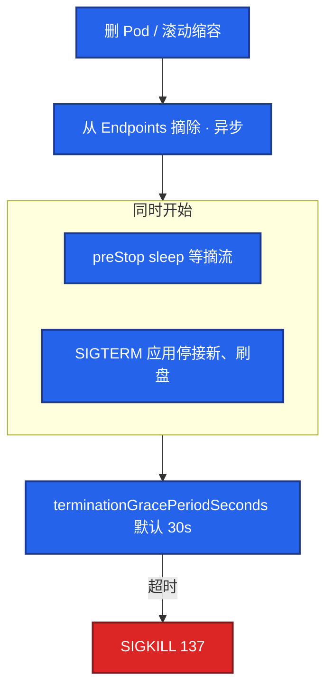
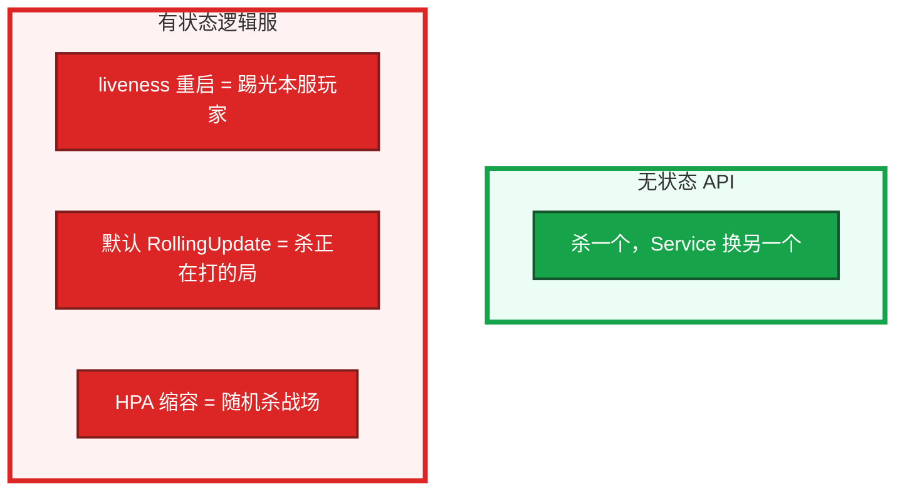
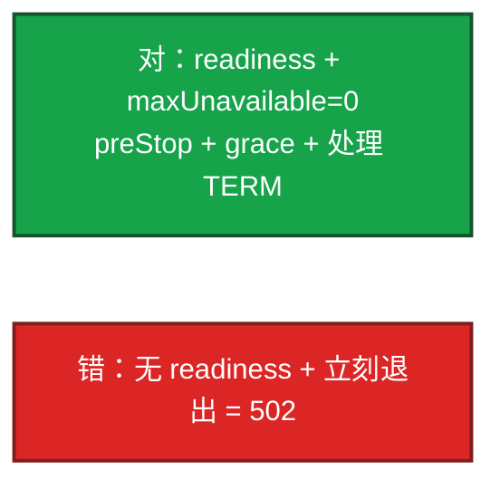
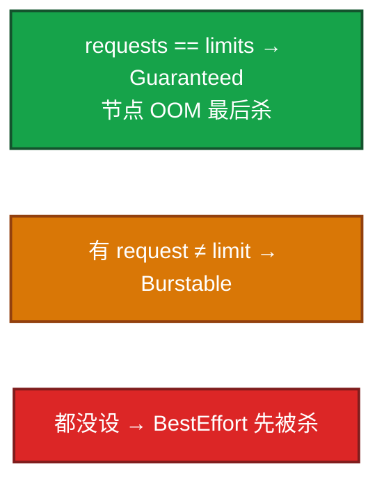
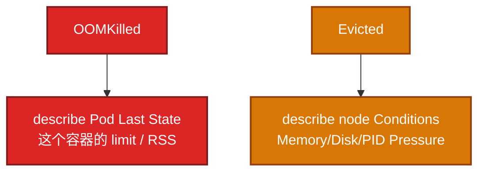
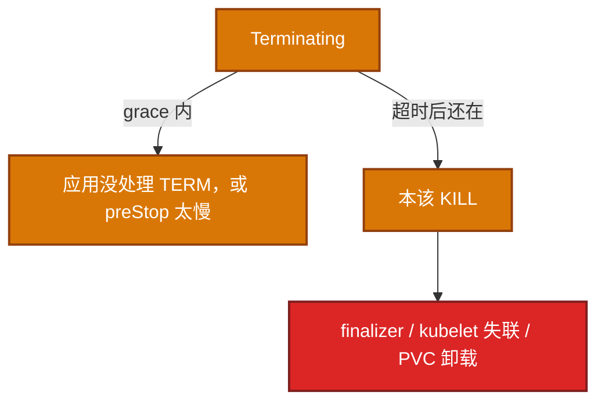
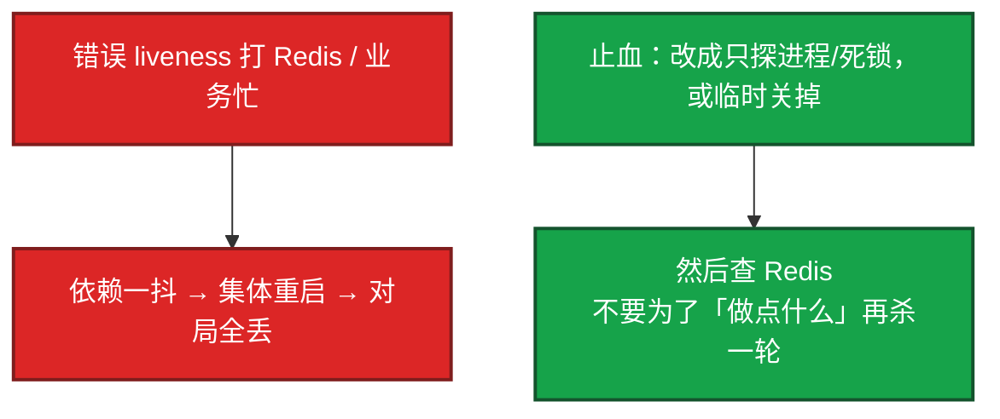
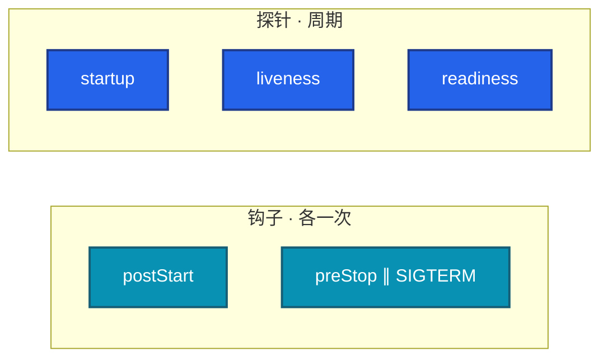

# 04｜Pod 生命周期 · 练习题

先对照 [知识点](知识点.md) **本章主线** 自己口述，再对答案。每题标了覆盖范围：

| 标记 | 含义 |
|------|------|
| **核心** | 不懂整章就没建立起来 |
| **必会** | 值班和面试都要能讲 |
| **常用** | 线上会反复碰到 |
| **常考** | 白板和追问的高频口径 |

## 本题目录

- [Q1 三探针 / 同一个 /health](#q1)
- [Q2 优雅退出 / preStop 与 SIGTERM](#q2)
- [Q3 CrashLoop / 137 / OOM](#q3)
- [Q4 有状态逻辑服能不能杀](#q4)
- [Q5 滚动 502](#q5)
- [Q6 QoS / request vs limit](#q6)
- [Q7 Evicted vs OOMKilled](#q7)
- [Q8 Init 失败](#q8)
- [Q9 Terminating / --force](#q9)
- [Q10 探针杀光现场第一刀](#q10)
- [Q11 探针 vs 钩子 / restartPolicy](#q11)
- [合上书](#合上书)

---

## Q1

**★★★★★｜三探针区别？失败分别发生什么？能不能用同一个 /health？**

**覆盖**：核心 · 必会 · 常考
**对应**：知识点 §3.1 三探针

### 场景

逻辑服 YAML 里 liveness 和 readiness 都打 `/health`，活动一卡全员重启。有人说「健康检查越严越好」。

### 完整解答

**一句话**：三条探针问的不是同一件事；liveness 重启、readiness 摘流，不能共用同一个 /health。

三条探针问的不是同一件事，失败动作也不同。

httpGet / tcp / exec / grpc 都能用。delay、period、failureThreshold 决定「多重试才动手」。startup 用来替代把 liveness delay 拉到两分钟。

**两条探针用同一个 /health 不行。** 业务一慢 liveness 会杀进程。正确是 readiness 摘流、liveness 只看死锁/进程。liveness 打 Redis：依赖抖一下，逻辑服被集体重启。

### 再追问

- liveness 失败会从 Service 摘吗？——会重启；摘流是 readiness 的职责。重启过程中也会短暂不在 Endpoints，但不要靠 liveness 当摘流开关。

---

## Q2

**★★★★★｜优雅退出顺序？为什么要 preStop sleep？preStop 跑完才发 SIGTERM 吗？**

**覆盖**：核心 · 必会 · 常考
**对应**：知识点 §3.4 优雅退出

### 场景

滚动更新一堆 502。应用日志显示「收到 SIGTERM 立刻退出」。有人加了 preStop sleep 5，以为会先睡完再发 TERM，结果还是 502。

### 完整解答

**一句话**：preStop 与 SIGTERM 并行，不是跑完 preStop 才发 TERM；sleep 只等摘流，不能替代处理 SIGTERM。

**preStop 不是「跑完再发 SIGTERM」，是并行。** 这是高频坑。sleep 是给 kube-proxy/LB 几秒摘干净，避免路上的包打空连接。

应用必须处理 SIGTERM。PID 不是 1 且没人转信号，只能等到被 KILL。`terminationGracePeriodSeconds` 要大于 preStop + 业务刷盘时间。

### 再追问

- sleep 5 能替代应用处理 TERM 吗？——不能。sleep 只等摘流。应用仍要停接新连接、刷脏状态。没处理 TERM，grace 一到就是 137。

---

## Q3

**★★★★★｜CrashLoopBackOff 第一刀？137 是什么？OOM 怎么判断是 limit 小还是泄漏？**

**覆盖**：核心 · 必会 · 常用
**对应**：知识点 §3.3 restartPolicy · §7 排障

### 场景

新版本一上就 CrashLoop。有人反复 `kubectl logs` 看不到输出。退出码 137。另一边群里在吵「是不是要加内存」。

### 完整解答

**一句话**：CrashLoop 第一刀是 `logs --previous` 和退出码；137 是 SIGKILL（OOM 或 grace 超时）。

第一刀：`kubectl logs --previous` 看上次死前输出；`describe` 看退出码和探针。

| 码 | 含义 |
|----|------|
| 137 | 128+9 SIGKILL · OOM 或 grace 超时强杀 |
| 143 | 128+15 SIGTERM |
| 139 | 段错误 |
| 1 | 自己退出 |

没日志：命令/环境变量/挂载错，容器没进主进程。探针过严也会看起来像 CrashLoop（刚起来就被 liveness 杀）。CrashLoopBackOff 是 `restartPolicy: Always` 下反复崩的退避，不是一种探针。

OOM：limit 按 **cgroup 总量**（堆外、缓冲、运行时都算）。RSS 持续涨是泄漏；启动就顶满是 limit 不够或启动峰值。Java/Go 通常要留 30–50%，别只填堆。不要只说「加内存」。

### 再追问

- Evicted 和 OOMKilled 差在哪？——OOMKilled：本容器超了自己的 memory limit。Evicted：节点 Memory/Disk/PID Pressure，kubelet 按 QoS 赶人。Evicted 看 `describe node` Conditions。DiskPressure 常是镜像/日志/emptyDir。先清节点或扩容，不要只重启 Pod。

---

## Q4

**★★★★★｜游戏有状态逻辑服能不能随便配 liveness、随便杀？**

**覆盖**：核心 · 必会 · 常考
**对应**：知识点 §3.6 游戏有状态

### 场景

战斗服按 Web 模板抄了 liveness 打业务健康。Redis 抖了 3 秒，整区逻辑服被重启，对局全丢。值班说「K8s 自愈」。

### 完整解答

**一句话**：内存里有 Session/对局的逻辑服不能当无状态 Web 乱配 liveness 或默认滚动。

不能当无状态 Web 乱杀。内存里是 Session/战斗帧，杀进程 = 踢玩家、可能丢对局。

liveness 只能探「进程死了 / 死锁」，不能把依赖或业务忙写成重启条件。大厅/网关无状态，可按 Web。绑定房间的逻辑服：滚动前停匹配、等对局或热迁。有断线重连和状态落库，才能谈「可重启」；没有就当有状态机。**不能当 Deployment 默认滚**（05）。

### 再追问

- 那用不用 readiness？——要。没准备好（加载配置表、连 Redis）不应进 Endpoints。readiness 摘流 ≠ 杀进程。滚动和 PDB 都靠 Ready（05、08）。

---

## Q5

**★★★★☆｜滚动更新时 502，探针和退出怎么配？**

**覆盖**：必会 · 常用
**对应**：知识点 §3.4 优雅退出 · §7 排障

### 场景

Deployment 滚动，监控一堆 502。新 Pod 已经 Running，旧的在 Terminating。没有 readiness。

### 完整解答

**一句话**：滚动 502 根因常是无 readiness 或 grace/preStop 不够，不是 maxUnavailable 公式 alone。

没有 readiness，新 Pod 一 Running 就进 Service，旧的已 TERM，中间空窗。IPVS 还可能把新连接打到正在退出的 Pod。

`maxUnavailable=0` 还 502，问题在探针/grace/摘流，不是滚动公式 alone。见 05、15。

### 再追问

- startupProbe 解决什么？只用 initialDelay 行不行？——启动时间方差大时，固定 delay 要么误杀要么空白太长。startup 成功前冻结 liveness。JVM 冷启动、游戏服加载配置表，用 startup 的 failureThreshold × period 覆盖最坏启动，liveness 保持短周期。

---

## Q6

**★★★★☆｜QoS 三级？生产怎么标？Scheduler 和 OOM 各看什么？**

**覆盖**：必会 · 常用 · 常考
**对应**：知识点 §3.5 QoS

### 场景

节点内存紧张，BestEffort 的日志 sidecar 和战斗服一起被杀。战斗服没写 request/limit。

### 完整解答

**一句话**：Scheduler 看 request 和 Allocatable；节点 OOM 按 QoS 顺序杀，Guaranteed 最后。

核心战斗/支付 Guaranteed。批处理 Burstable。生产不要 BestEffort 混在业务节点。

**Scheduler 看 request 和 Allocatable**（06），不看瞬时 `top`。**OOM 看 limit 和 QoS。** CPU 超 limit：throttle；内存超 limit：OOMKill。没写 request，HPA 算不了利用率，调度当 0，容易超卖后 Evict。

### 再追问

- Guaranteed 就一定不被杀吗？——节点压力极大时仍可能被 Evict，只是顺序最后。单副本战斗服还要 PDB 和别把节点打满（05、16）。QoS 不是「永不杀」。

---

## Q7

**★★★★☆｜Evicted 和 OOMKilled 差在哪？DiskPressure 先做什么？**

**覆盖**：必会 · 常用
**对应**：知识点 §3.5 QoS · §7 排障

### 场景

一批 Pod 变成 Evicted。有人按 OOM 去加 memory limit。节点 `df` 显示 overlay 盘满了。

### 完整解答

**一句话**：OOMKilled 是本容器超 limit；Evicted 是节点 Pressure 赶人——先救节点，不要只加 limit。

OOMKilled：本容器超了自己的 memory **limit**。Evicted：节点 Memory/Disk/PID Pressure，kubelet 按 QoS 赶人。

DiskPressure 常是镜像/日志/emptyDir。先清节点或扩容，不要只重启 Pod——重启还会再被赶。emptyDir 当盘用满也会触发。

### 再追问

- 被 Evict 的战斗服怎么办？——先看节点压力能不能马上消（清镜像、迁日志）。控制面会按驱逐超时迁走（16）。有状态服被 Evict 等于非自愿中断，PDB 挡不住。先救节点，再谈要不要把战斗服做成 Guaranteed + 独立池。

---

## Q8

**★★★★☆｜Init 容器失败会怎样？长时间任务能塞 Init 吗？**

**覆盖**：必会 · 常用
**对应**：知识点 §3.2 探针 vs 钩子

### 场景

Pod 一直起不来，主容器没日志。Init 在等一个会失败的迁移脚本，已经重试十几次。

### 完整解答

**一句话**：Init 按序跑完主容器才起；长时间任务用 Job，不要塞 Init。

Init 按序执行，一个失败整个 Pod 重启（看 restartPolicy）。**主容器不会启动。**

适合：等依赖就绪、拉密钥、短迁移。长时间/可失败重试的批处理用 Job，不要塞 Init。Init 失败看起来像 CrashLoop，`describe` 会写明是哪个 Init。

### 再追问

- 1.28 原生 sidecar 和 Init 什么关系？——`initContainers` 里加 `restartPolicy: Always` 就变成原生 sidecar：kubelet 等它 Ready 再起主容器，主容器退出时 sidecar 也能收尾。展开见 05。这里只要知道：普通 Init 跑完就退出，不能当常驻代理。

---

## Q9

**★★★☆☆｜Terminating 卡很久怎么看？能不能 --force？**

**覆盖**：必会 · 常用
**对应**：知识点 §7 生产排障

### 场景

战斗服删了十分钟还在 Terminating。有人准备 `kubectl delete --force --grace-period=0`。

### 完整解答

**一句话**：Terminating 先分 grace 内、finalizer 和 kubelet 失联；`--force` 可能留孤儿进程。

先分是 grace 内还是超时后。

节点已经 NotReady，控制面删不掉本机 Pod，要修 kubelet。`--force` 会在 etcd 里删掉对象，节点上进程可能还在，变成孤儿。游戏服强删等于断电。确认外部已无、业务允许，再补救，留变更记录（finalizer 对齐 01）。

### 再追问

- finalizer 和 grace 谁先？——kubelet 先按 grace 停容器；对象从 etcd 消失还要等 finalizer 摘完。PVC/Operator 卡住时，进程可能已经没了，对象还在 Terminating。

---

## Q10

**★★★☆☆｜游戏服被探针杀光，现场第一刀是什么？**

**覆盖**：必会 · 常考
**对应**：知识点 §7 生产排障 · §3.1

### 场景

Redis 抖动，所有逻辑服 liveness 失败，kubelet 重启容器。玩家全掉。有人要重启节点。

### 完整解答

**一句话**：探针杀光现场第一刀是改/关错误的 liveness，再查依赖，不要重启全部 Pod。

**先改/关有问题的 liveness**，让还活着的进程别再被杀。再查是不是依赖抖动，不是先重启节点或重启全部 Pod。

这和 01「etcd 挂了别重启战斗服」是同一类现场纪律：已经在跑的长连接优先保住，先停错误的自愈。

### 再追问

- readiness 打 Redis 可以吗？——可以，失败只摘流、不杀进程。依赖恢复后重新进 Endpoints。这正是 readiness 和 liveness 要拆开的原因。

---

## Q11

**★★★★☆｜探针和 lifecycle 钩子差在哪？restartPolicy 谁写 Always？**

**覆盖**：核心 · 必会 · 常考
**对应**：知识点 §3.2 探针 vs 钩子 · §3.3

### 场景

白板：「preStop 是不是一种探针？Deployment 要不要写 restartPolicy: Never 避免乱重启？」有人把 postStart 当 startupProbe 用。

### 完整解答

**一句话**：钩子是启动/停止各一次；探针是周期问——postStart 不能替代 startupProbe。

探针是周期问；钩子是启动/停止各一次。

postStart 和主进程异步，不能当「必须先于 listen」的 startup。需要严格先后用 Init。

`restartPolicy`：Always 是 Deploy/STS/DS 默认，崩了再拉，CrashLoop 是退避。OnFailure / Never 是 Job。Deploy 写 Never 不符合控制器语义。

### 再追问

- Job 写成 Always 会怎样？——成功也会被再拉，Job 完不成。completions 对不上。

---

## 合上书

- [ ] 能说出三条探针失败动作不同，且不能共用同一个 /health
- [ ] 能画出摘流异步、preStop ∥ SIGTERM、超时 137；sleep 不能替代处理 TERM
- [ ] 能区分探针 vs 钩子；Always / OnFailure / Never 谁用
- [ ] 能用 `--previous` 和退出码处理 CrashLoop；能分 OOMKilled vs Evicted
- [ ] 能说明有状态逻辑服慎 liveness、禁无脑滚；readiness 仍要
- [ ] 能配滚动防 502；Terminating 先分 grace / finalizer / kubelet，不先 --force
