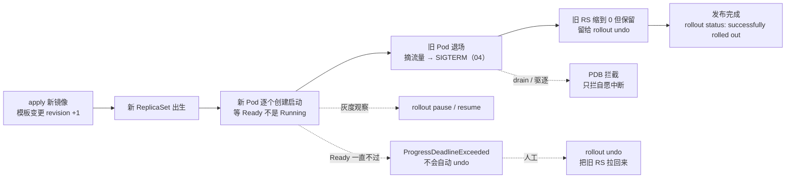
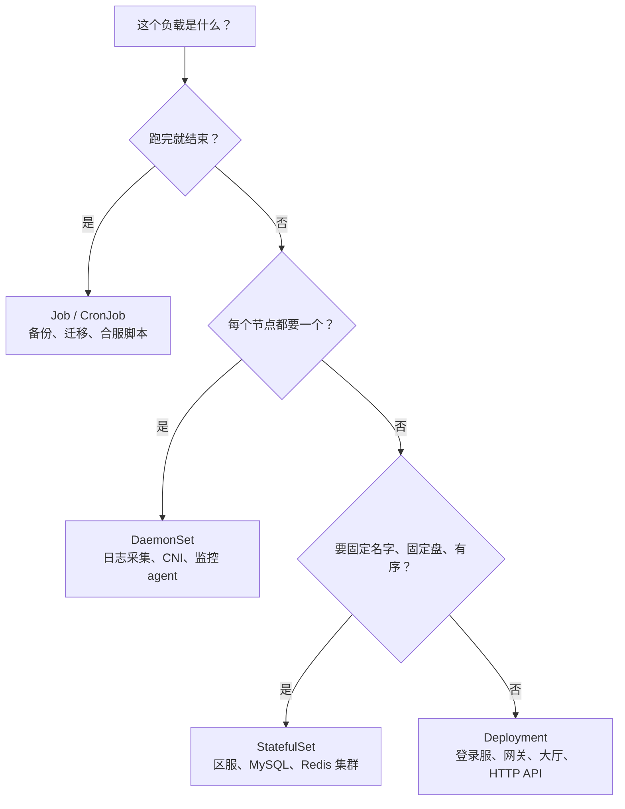
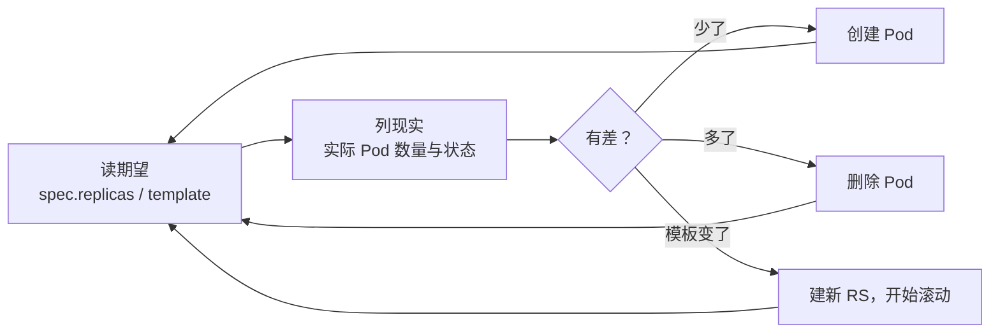
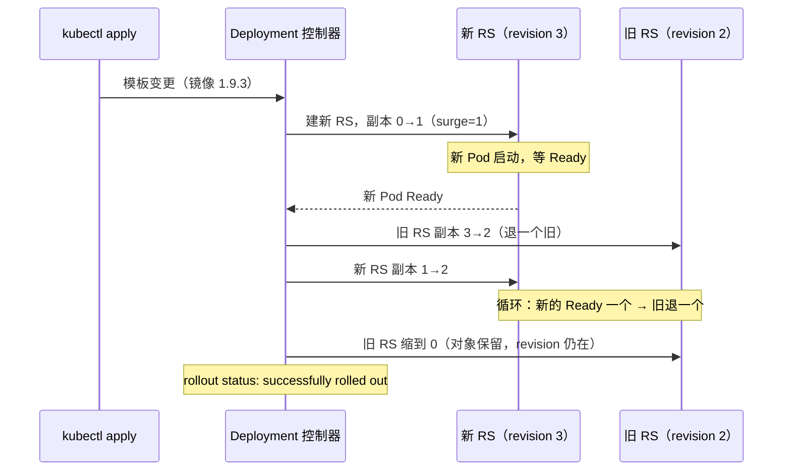
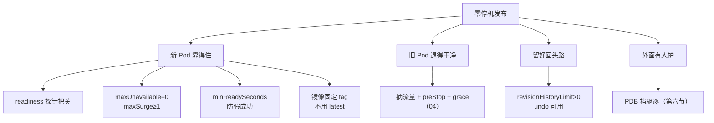
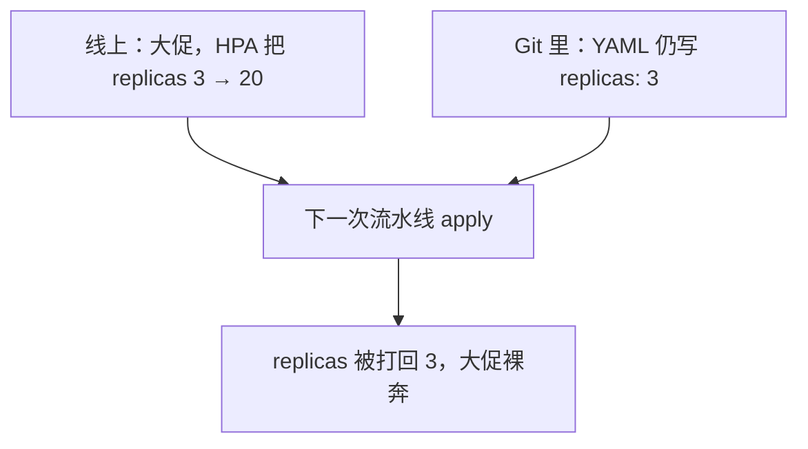
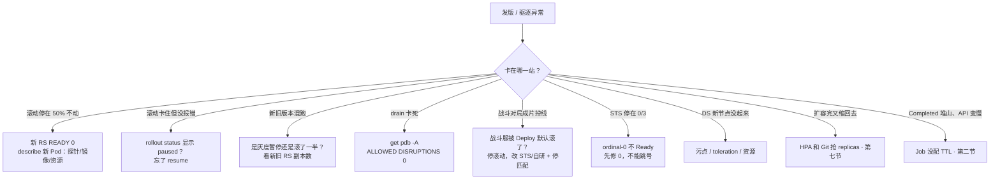

# 工作负载控制器

> 大家好。上一章讲完一个 Pod 怎么生老病死；这一章讲**谁在批量管这些 Pod**——以及一次发版怎么滚动、卡住了怎么办、PDB 到底拦什么。
> 开讲之前的现场：发版当天，网关滚动卡在 50%，有人 `kubectl delete pod` 想「让它重建一下」；战斗服写成了 Deployment 默认滚，三百个对局同时被 SIGTERM；另一头 drain 卡了四十分钟，有人上来就要删 PDB。
> 这一章讲完，你会知道这三个人各自错在哪——删 Pod 为什么没用、战斗服为什么不能默认滚、PDB 卡住时第一刀为什么不该是删 PDB。
> **本章回答的问题**：四类控制器怎么选，一次滚动发布从 apply 到新 Pod 全量顶替旧 Pod 会经历哪几站，卡住、暂停、回滚各走哪条路，PDB 拦的是什么。
> **本章不讲**：三探针、preStop、优雅退出 → [04](../04-Pod生命周期/)；HPA 指标与公式 → [07](../07-弹性伸缩/)；蓝绿/金丝雀策略 → [16](../16-灰度与回滚/)；Chart 结构与模板渲染 → [22](../22-Helm与Kustomize/)；GitOps 流水线 → [23](../23-GitOps-ArgoCD与Tekton/)；PVC Retain 与丢盘 → [11](../11-存储/)；污点打分与 Pending → [06](../06-调度机制/)。

**标记**：🎯重点 · 🔥难点 · ⭐常考 · 🔧实操

**怎么听这场分享**：第一节是一次发布的主图；第二节选型；三到六节顺着调和 → 滚动 → 停退 → PDB；第七节归属（Helm/HPA/Git）；第八节定责。每节对应练习题。

---

## 一、一张图：一次发布的一生

> 🎯 **一句话**：一次发布 = 新 RS 出生 → 新 Pod 逐个 Ready → 旧 Pod 退场 → 旧 RS 缩 0；排查先问卡在哪一站。



**读图**：发版卡住时，咱们先在这张图上定位「卡在哪一站」，再动手。

- 从 apply 进：变的只是 Deployment 里的 Pod 模板，控制器感知到期望与实际的差，先建新 RS 再动旧副本——所以「发版卡住」90% 卡在「新 Pod 一直不 Ready」这一站。
- 三条虚线是三种「偏离主线」：pause 是人为按下暂停（灰度），deadline 是被动卡死（要人工介入），PDB 拦的是旧 Pod 退场路上的驱逐，不是滚动本身。
- `rollout status / history / undo` 三个命令就挂在这条线上：看进度、查版本号、往回走。

发布主线清楚了。先选型——同一套滚动，打在战斗服上就是事故。

本节对应练习题 Q1。

---

## 二、选型：哪个控制器管这份负载

> 🎯 **一句话**：选型选的是「期望状态怎么写」：可互换、固定身份、每节点一个、还是跑完就停。

所有工作负载控制器干的是同一件事：**Reconcile（调和）**——读期望、看实际、补差，循环往复。注意控制器只 Reconcile **API 对象**，它不直接起容器；真正把容器进程拉起来的是节点上的 kubelet，调度位置由 Scheduler 决定（[01](../01-集群架构/)）。所以「控制器挂了业务会立刻死吗」不会——正在跑的 Pod 还在，只是没人再替你补差、没人再滚动了。这些控制器都跑在 **kube-controller-manager** 里，控制面多副本部署时必须 **leader-elect**，否则两个副本同时补差会打架（[01](../01-集群架构/)）。

> 💡 **打个比方**：Deployment 像一群**可互换的 NPC 大厅接待员**——谁在岗无所谓，人数够就行；StatefulSet 像**带工号和专属储物柜的房间 host**——`battle-0` 必须是原来那块盘、那个 DNS 名；DaemonSet 像**每层楼一个消防栓**——多一层楼就多一个；Job 像**一次性搬家队**——干完收工走人。



**读图**：三个问题按顺序问——跑完就走？每节点都有？身份要固定？三个都答「否」才落到 Deployment。Deployment 是默认答案，不是万能答案；战斗服这种「房间绑在进程内存里」的负载，三个问题里「身份要固定」必须答是。

四类控制器对比 ⭐：

| 对比项 | Deployment | StatefulSet | DaemonSet | Job / CronJob |
|--------|-----------|-------------|-----------|---------------|
| 期望状态 | replicas 个可互换副本 | 序号 0..N-1，身份固定 | 每节点恰好一个 | 跑满 completions 就停 |
| 网络 | Service 选一批 | Headless，`名字-序号` 固定 DNS | 通常不接业务流量 | 通常不接流量 |
| 盘 | 无盘或共享盘 | 每序号一块专属 PVC | 常见 hostPath | 可选 |
| 更新方式 | RollingUpdate / Recreate | 按序 RollingUpdate / OnDelete | RollingUpdate / OnDelete | 不滚动，重跑一次 |
| 游戏场景 | 登录服、网关、大厅 | 区服、战斗服、数据库 | 日志、CNI、监控 | 合服备份、数据迁移 |

> ⚠️ **别混**：**不要手工创建 ReplicaSet**。Deployment 的滚动和回滚全靠它替每个模板版本建一个 RS 并记 **revision**；手建的 RS 没有 Deployment 管，没有滚动策略、没有版本历史，`rollout undo` 用不了。RS 是 Deployment 的内部实现，平时把它当实现细节看。

### StatefulSet 保证什么、不保证什么 🔥

STS 保证四件事，都围绕**身份稳定**：

1. **固定名字**：Pod 名是 `名字-序号`（`mysql-0`、`mysql-1`），重建后名字不变；**序号叫 ordinal**。
2. **有序创建和删除**：创建按序号从小到大，`mysql-0` Ready 了才建 `mysql-1`；删除倒序，从最大序号往回删。
3. **稳定 DNS**：每个 Pod 有固定解析名，如 `mysql-0.mysql-headless.db.svc.cluster.local`——前面必须配 **Headless Service**（ClusterIP 设为 None 的 Service，不做负载均衡，只负责给每个 Pod 解析名字）。
4. **稳定磁盘**：`volumeClaimTemplates` 给每个序号建一块专属 PVC，`mysql-0` 重建后挂回同一块盘；**删掉 STS 默认不删 PVC**（Retain，防误删数据，不是泄漏，要删得人手工清，细节 → [11](../11-存储/)）。

但 STS **不保证**两件事：一是滚动时不杀进程——RollingUpdate 照样按序号倒着杀，只是杀得有秩序；二是**不解决内存里的状态**——对局数据在进程内存里，Pod 一死照样蒸发，换了 STS 也救不回那三百个对局。

> ⚠️ **别混**：STS 解决的是「身份和数据放哪」，不是「内存状态丢不丢」。战斗服上了 STS 照样不能无脑滚，发布流程得靠 OnDelete + 先停匹配/热迁移（见下）；「换了 STS 就能随便发版」是事故的开始。

更新策略两条路：**OnDelete** = 你不删 Pod 它就永远不动，适合区服发版（业务先停匹配，再人工或脚本逐个删）；**partition 金丝雀** = 只滚序号 ≥ partition 的（`partition: 2` 只动 `2` 及以上），灰度验证完记得改回 0，否则低序号永远不滚。

### DaemonSet：每节点一个 ⭐

每个节点恰好一个 Pod，节点加入自动补、节点移除自动收。日志采集、CNI、kube-proxy、监控 agent 都是它。两个考点：

- **某节点上没起来，先查污点**。节点有 `pool=battle:NoSchedule` 这种污点，DS 的 Pod 模板里就得写对应 **toleration（容忍）**，否则调度不上去（[06](../06-调度机制/)）。控制面节点同理——CNI、kube-proxy 要容忍 `node-role.kubernetes.io/control-plane` 污点才能在控制面节点跑。
- **不要用 Deployment 副本数=节点数模拟 DaemonSet**。Scheduler 随机放，结果就是同一节点挤两三个副本、新加的节点一个都没有，节点增减永远对不齐。
- **DS 的滚动也有代价**：DaemonSet 更新同样支持 RollingUpdate，也有自己的 maxUnavailable——kube-proxy、CNI 这类**网络平面**的 DS 一次放倒太多节点，集群网络会成批断，改小步、分批走（[08](../08-Service与kube-proxy/)）。

### Job / CronJob：跑完就停 ⭐

**Job**：跑满 `completions` 次成功就停；失败重试由 `backoffLimit` 管（默认 6），用尽后 Job 变 Failed——排查看它对应的 Pod 日志：`kubectl logs job/<name>`。`activeDeadlineSeconds` 防跑飞，到点杀掉。**CronJob**：cron 表达式定时建 Job；`concurrencyPolicy` 选 `Forbid`（上一次没跑完就不起新的，备份必用，防叠罗汉锁库）、`Allow`（默认，可叠加）、`Replace`（杀旧起新）。

> ⚠️ **别混**：跑完的 Job 对象不会自己消失，几百个 Completed Pod 堆着会**灌爆 etcd**（[02](../02-etcd/)）——`ttlSecondsAfterFinished` 必配，让完成的 Job 到期自删。也别把长时间、可能失败的迁移塞进 Init 容器：Init 失败整个 Pod 起不来，还跟着业务容器反复重启（[04](../04-Pod生命周期/)）。

### 原生 Sidecar（1.28+）

日志/代理这类「陪跑容器」的老写法（普通容器假装 sidecar）时序靠运气：主容器可能先启动、先 Ready，sidecar 还没 listen，流量进来 502；退出时 sidecar 又可能先死。1.28+ 的原生写法：把 sidecar 放进 **initContainers 并标 `restartPolicy: Always`**，kubelet 保证 sidecar Ready 之后才启动主容器，主容器退出时等 sidecar 收尾。

> 🔍 **现场**：一眼认出是不是原生 sidecar：

```bash
kubectl get po hall-xyz -n prod -o jsonpath='{range .spec.initContainers[*]}{.name}{"\t"}{.restartPolicy}{"\n"}{end}'
```

```text
envoy-proxy    Always        ← restartPolicy=Always 的 initContainer 就是原生 sidecar
```

### 游戏服选型落地 ⭐

```text
登录服        → Deployment：纯无状态，开服前先扩容，maxSurge 顶开服洪峰
网关          → Deployment + PDB：长连接但副本可互换，滚动要慢，ready + preStop 必备（04）
大厅 / 匹配    → Deployment：可互换，默认滚动即可
战斗服        → StatefulSet 或自研调度：房间绑内存，OnDelete + 先停匹配，禁止默认滚动
区服数据库     → StatefulSet + Headless Service
日志采集 / 监控 → DaemonSet：每节点一个，容忍节点池污点
合服备份 / 迁移 → CronJob Forbid + Job TTL
```

> 📝 **面试**：选型先答「期望状态四种写法」，再落到游戏负载：登录/网关/大厅是 Deployment，战斗服房间绑内存要么 STS + OnDelete 要么自研，日志每节点一个必须 DaemonSet，合服备份是 CronJob。最后补一句「不要手建 ReplicaSet，没有 revision 就回不了滚」。

选型口诀：⭐ **可互换用 Deployment，固定身份用 STS，每节点一份用 DS，跑完就停用 Job**。接下来看控制器到底怎么「补差」。

本节对应练习题 Q1、Q2。

---

## 三、调和：期望与现实一直在对账

> 🎯 **一句话**：控制器不是「执行命令」，是循环「看期望 → 看现实 → 补差」；所以删 Pod 没用，它会立刻重建。

开篇那位同学删 Pod「让它重建一下」——咱们带着问题看这一节：控制器看见的「删」到底是什么？它会不会知道你想换镜像？

> 💡 **打个比方**：Reconcile 像一个**巡场盘点员**——他不记得你喊过什么，只看「名单上要 3 个，货架上有 2 个」，差一个就补一个。他认的是名单（spec），不是你的口头指令。

这种写法叫 **level-triggered（面向状态）** 🔥：不关心「刚才发生了什么事件」，只关心「此刻期望和实际差多少」。事件丢了、控制器重启了都没关系，下一轮对账照样把差补上——这是声明式 API 的根（[01](../01-集群架构/)）。



**读图**：三条补差路径里只有「模板变了」会触发滚动，另外两条是静默的——这就是为什么直接删 Pod「没有反应」：不是控制器没看见，是它看见的方式就是「少了补上」，补完继续下一轮。

由此推出三个现场结论：

- **删 Pod 不是操作，是触发重建**。有人滚动卡住时删新 Pod「让它重建一下」——RS 立刻重建，同样的镜像同样的探针，照样卡住，纯浪费；删旧 Pod 更糟，容量直接跌破底线。
- **重建补不回内存状态**。战斗服 Pod 被删，控制器会重建一个「空壳」，里面的对局不会回来。对「让 K8s 自愈」的期待要停在无状态负载上。
- **手工改的都会被改回去**。`kubectl scale`、`kubectl edit` 改的是活状态，只要 Git 里的期望没变，下一次 apply 就会把你打回原形——完整故事在第七节。

> ⚠️ **别混**：**Ready ≠ Running**。Running 只说明容器进程在跑；**Ready** 是 readiness 探针通过、可以接流量（[04](../04-Pod生命周期/)）。滚动按 Ready 计数，PDB 也按 Ready 计数——没配 readiness，Deployment 会以为新 Pod 已服役、PDB 会按 Running 放行驱逐，账面全绿、流量 502。

> 🔍 **现场**：判断滚动卡在哪，先读 RS 的三列：

```bash
kubectl get rs -n prod -l app=gateway
```

```text
NAME              DESIRED   CURRENT   READY   AGE
gateway-6d9f8b    3         3         3       7d    ← 旧 RS，滚动期间还在维持期望
gateway-7f4c9d    3         3         1       2m    ← 新 RS，READY < DESIRED = 卡在这里
```

所以开篇那位「删 Pod 让它重建」——控制器的回答永远是：少了就补，补的还是坏的。真正改模板才会滚动。下一节把节奏参数拆开。

本节对应练习题 Q2。

---

## 四、滚动：maxSurge 与 maxUnavailable 写的节奏

> 🎯 **一句话**：滚动不是「先杀旧再起新」，是「起新的、等 Ready、再退旧的」，节奏由两个参数写死。

**RollingUpdate（滚动更新）** 是 Deployment 的默认策略，靠两个参数控制每一步：

- **maxSurge**：滚动期间最多允许超出期望副本数多少个（可写数字或百分比）——「能多来几个新人提前到岗」。
- **maxUnavailable**：滚动期间最多允许多少个副本处于非 Ready——「能先走几个老员工」。

两者**不能同时为 0**（新旧都不动，滚动原地踏步），也不能让副本数掉到 0 以下或超出约束。这两个参数怎么组合出「零停机」，是整章最容易被追问的细节 🔥。大家先别背表——问自己一句：新人还没 Ready，能不能让老人先走？答案是不能，那就是 `maxUnavailable=0`。

> 💡 **打个比方**：滚动是一次**换班**。maxSurge 是「允许几个新服务员提前到岗」，maxUnavailable 是「允许几个在岗的先下班」。零停机换班只有一种写法：**新人到岗并站好（Ready）之前，老员工一个都不许走**——即 `maxUnavailable=0, maxSurge=1`。反过来「老员工先走，新人慢慢来」就是拿停服时间换资源。

两种典型组合的对比：

| 对比项 | maxSurge=1, maxUnavailable=0 | maxSurge=0, maxUnavailable=1 |
|--------|------------------------------|------------------------------|
| 顺序 | 先起新，等 Ready 再杀旧 | 先杀一个旧，再补新 |
| 服务能力 | 不降，瞬间 +1 | 滚动期间始终少一个 |
| 资源要求 | 要多出 1 个 Pod 的余量 | 不需要余量 |
| 适用 | 登录服/网关的零停机发布 | 资源紧张、业务能容忍缺一 |



**读图**：每一步都以「新 Pod Ready」为离合器——新 Pod 一直不 Ready，这一步就停住，**旧 Pod 也不会被杀**，所以「滚动卡住」通常服务还没掉（掉的是发布进度，不是线上容量）。这也是为什么排查滚动卡住第一刀是 describe 新 Pod，而不是看旧的。

步与步之间还有两个参数：

- **minReadySeconds**：新 Pod Ready 后再稳定多少秒才算「可用」——防「Ready 两秒就崩」的半死版本被当成发布成功。
- 大副本数服务用百分比提速，如 `maxSurge: 25%, maxUnavailable: 25%`；但零停机的底线始终是 **maxUnavailable=0**，25% 只是让「一批」变大。

> ⚠️ **别混**：**maxUnavailable=0 也会 502**。滚动参数只管「几个算 Ready」，管不了摘流量是否同步、SIGTERM 后 grace 够不够——流量还在往正在退出的旧 Pod 打，照样 502。这类 502 去 [04](../04-Pod生命周期/) 查探针与退出链、去 [08](../08-Service与kube-proxy/) 查 Endpoints，别只拧滚动参数。

**progressDeadlineSeconds**：滚动多久没进展就把 Deployment 标记为 Failed，条件写成 **ProgressDeadlineExceeded**，默认 600 秒（约 10 分钟）。它**只标记、不自动回滚**——等它自愈等于白等，要人执行 `rollout undo`。开服窗口拉镜像慢，别把这个值设太短，否则正常发布也被判 Failed。另外发布期间处于 pause 状态，deadline 计时不走。

> 🔍 **现场**：滚动卡住时长什么样：

```bash
kubectl rollout status deploy/gateway -n prod --timeout=120s
```

```text
Waiting for deployment "gateway" rollout to finish: 1 out of 3 new replicas have been updated...
Waiting for deployment "gateway" rollout to finish: 1 out of 3 new replicas have been updated...
error: timed out waiting for the condition      ← 新 Pod 一直不 Ready，进度停在 1/3
```

三种更新策略的对比 ⭐：

| 策略 | 谁支持 | 行为 | 适用 |
|------|--------|------|------|
| RollingUpdate | Deploy / STS / DS | 逐步替换，新旧短暂共存 | 默认；新旧版本能并存 |
| Recreate | Deploy | 旧的全杀完，再起新的 | 协议不兼容、不能双版本并存，接受中断窗口 |
| OnDelete | STS / DS | 你删 Pod 它才重建 | 区服/战斗服，什么时候动由业务定 |

**Recreate** 会有全员中断的窗口，只用于新旧协议互不兼容、并跑就出错的场景；能并存又想零切换的，用蓝绿切流（[16](../16-灰度与回滚/)）。

### 收束：零停机发布凭什么



**读图**：四组零件各管一段——「新 Pod 靠得住」决定滚动能不能前进；「旧 Pod 退得干净」决定切换瞬间有没有 502；「回头路」决定出事多快止血；「外面有人护」决定维护操作不踩进来。面试背这四组，比背十个字段名稳。

> ⚠️ **别混**：零停机发布**不保证业务正确**。新版本逻辑有 bug，流量一路畅通、结果全错；readiness 只能证明「端口开了、探针过了」，证明不了「这个版本是对的」。灰度和监控（[16](../16-灰度与回滚/)）补的是这一段。

> 📝 **面试**：「零停机怎么配」按四组答：新 Pod 靠得住（readiness + maxUnavailable=0 + maxSurge≥1 + minReadySeconds + 固定 tag）、旧 Pod 退得干净（摘流量、preStop、grace）、留好回头路（revisionHistoryLimit>0，别用 latest）、外面有 PDB 挡驱逐。再补一句：它保证的是切换不丢流量，不保证新版本逻辑正确。

零停机口诀：⭐ **`maxUnavailable=0` + `maxSurge≥1`，且等 Ready 再退旧**。卡住了怎么办？pause、undo、deadline 下一节。

本节对应练习题 Q3、Q4、Q5、Q6。

---

## 五、停与退：pause、resume、rollback

> 🎯 **一句话**：pause 是人控节奏，undo 是止血——两者都靠「旧 RS 还在」才成立。

**什么时候按暂停**，两个场景：

- **金丝雀**：先让滚动走一批，`kubectl rollout pause` 停住，观察错误率、日志、对局成功率，没问题 `resume` 继续，有问题 `undo` 回滚——半自动的灰度（完整灰度体系 → [16](../16-灰度与回滚/)）。
- **合并多次变更**：一次发布要同时改镜像、资源、环境变量。先 pause，连着改，最后一次 resume 只滚一轮；不 pause 的话每次 apply 都触发一轮滚动，玩家被滚三次。

```bash
kubectl rollout pause deploy/gateway -n prod
# ...改镜像、改 resources、改 env...
kubectl rollout resume deploy/gateway -n prod
```

```text
deployment.apps/gateway paused
deployment.apps/gateway resumed     ← resume 时把暂停期间攒的变更一次滚出去
```

> ⚠️ **别混**：**pause ≠ 卡住**。pause 是人为按下的，`rollout status` 会明说是 paused，resume 就继续；ProgressDeadlineExceeded 是滚动自己走不动了。而且暂停期间 deadline 计时暂停——「暂停太久超时」不会发生。

**回滚靠的是 revision** 🔥。每次模板变更，Deployment 建新 RS 并在注解里记版本号（`deployment.kubernetes.io/revision`）；旧 RS 副本缩 0 但对象保留，这就是回滚的「存档」。

> 🔍 **现场**：看版本历史和当前版本号：

```bash
kubectl rollout history deploy/gateway -n prod
```

```text
REVISION  CHANGE-CAUSE
2         kubectl set image deploy/gateway gateway=gateway:1.9.2
3         kubectl set image deploy/gateway gateway=gateway:1.9.3   ← 当前，刚发坏了
```

CHANGE-CAUSE 一列为空很常见——它只在带 `--record` 的命令下才写，不影响回滚；认 REVISION 号就够了。

```bash
kubectl rollout undo deploy/gateway -n prod --to-revision=2
kubectl rollout status deploy/gateway -n prod
```

```text
deployment.apps/gateway rolled back
deployment "gateway" successfully rolled out     ← 旧模板的 RS 重新放大，新 RS 缩 0
```

**undo 的机制**：不是时间倒流，是把旧模板对应的 RS 拉大、新 RS 缩 0——所以 undo 本身又产生一个**新的 revision**，版本号只增不减（上面从 3 回滚后，下一个版本号是 4，内容等于 2）。

两个把路走死的方式：**镜像用 `latest`**——「回滚」滚回来的还是同一个 latest，每个节点拉到的镜像还可能不一样，等于没回；**`revisionHistoryLimit: 0`**——旧 RS 用完即删，没有存档，undo 无处可去。默认保留 10 个。

> ⚠️ **别混**：**只回滚 Deployment 不一定够**。这次发布如果连 ConfigMap/Secret 一起改了、新配置和旧镜像不兼容，光 `rollout undo` 只把镜像换回去，配置还是坏的——要一起回（[12](../12-配置与密钥/)；整包回滚的流程 → [16](../16-灰度与回滚/)）。

> 📝 **面试**：「回滚原理」一句话：每个模板版本一个 RS、一个 revision，undo 是把旧 revision 的 RS 重新放大，所以 revisionHistoryLimit=0 和 latest 镜像都会让回滚失效；undo 会产生新 revision，历史只增不减。

回滚路要提前留——`revisionHistoryLimit=0` 和 latest 标签会把路走死。旧 Pod 退场路上还有人拦：PDB。

本节对应练习题 Q7、Q8。

---

## 六、保护：PDB 拦的是自愿中断

> 🎯 **一句话**：PDB 只拦「有人主动发起的中断」；宕机它管不了，HPA 它也不拦。

**PodDisruptionBudget（PDB，Pod 干扰预算）**：给一组 Pod 挂一条底线——`minAvailable`（至少保几个可用）或 `maxUnavailable`（最多允许几个不可用），二选一。

**自愿中断（voluntary disruption）** = 人或系统**主动通过 API 发起**的中断：`kubectl drain`、驱逐 API、Descheduler 重平衡、节点缩容前的驱逐。这些动作会先来问 PDB：驱逐这一个，还满足底线吗？不满足就拒绝。

> 💡 **打个比方**：PDB 是「**值班不能少于两人**」的排班规定——它拦得住排班表上的主动调休（drain）；拦不住有人突发疾病（节点宕机），也拦不住老板直接缩编制（HPA 把 replicas 改小）。

| PDB 拦（自愿中断） | PDB 不拦 |
|--------------------|----------|
| kubectl drain 节点 | 节点宕机、断电、内核崩溃 |
| 驱逐 API、Descheduler 重平衡 | 容器 OOMKilled |
| 节点缩容前的驱逐 | HPA 改 replicas、apply 打回副本 |

看两个现场数字：**ALLOWED DISRUPTIONS** = 当前还能再干扰几个而不破底线，0 就是谁也不许动。

> 🔍 **现场**：drain 被 PDB 拦下时长什么样：

```bash
kubectl drain node-gw-01 --ignore-daemonsets --delete-emptydir-data
```

```text
evicting pod gateway-7f4c9d-abc12
error when evicting pods/"gateway-7f4c9d-abc12" (will retry after 5s):
Cannot evict pod as it would violate the pod's disruption budget.   ← PDB 生效，保护在工作
```

```bash
kubectl get pdb -n prod
```

```text
NAME          MIN AVAILABLE   MAX UNAVAILABLE   ALLOWED DISRUPTIONS   AGE
gateway-pdb   2               N/A               0                     30d   ← 再驱逐一个就破 2 的底线
```

三个容易判错的场景：

- **单副本 + minAvailable=1，drain 必然卡死**——这是保护在提醒你「先迁流量/玩家」，不是故障。正确动作是先扩容到 2 副本、或先摘掉这台的流量入口再迁，**不要删 PDB 硬赶**。
- **PDB 按 Ready 计数**：没配 readiness 时它按 Running 数，三个 Running 里一个其实接不了流量，驱逐照样放行——又一次「账面满足、流量 502」。
- **HPA 与 PDB 的关系**：如果 HPA 的 minReplicas 比 PDB 的 minAvailable 还小，HPA 缩容不走驱逐、不受 PDB 约束；而且 HPA 缩下去之后，ALLOWED DISRUPTIONS 永远凑不够，drain 会一直卡。配 PDB 时先核对这条（[07](../07-弹性伸缩/)）。

> ⚠️ **别混**：PDB 也有个 `maxUnavailable`，和 Deployment 滚动的 `maxUnavailable` **同名不同物**——前者管「自愿中断时最多允许几个不可用」，后者管「滚动期间允许几个不 Ready」。读到它先看属于哪个对象。

> 📝 **面试**：「PDB 拦什么」按三句答：只拦自愿中断（drain、驱逐、Descheduler），不拦宕机这类非自愿中断，也不拦 HPA 直接改 replicas；drain 卡住先 `get pdb` 看 ALLOWED DISRUPTIONS；单副本 minAvailable=1 卡死是保护不是故障。

口诀：⭐ **PDB 只拦自愿中断（drain/滚动/驱逐 API），不拦节点宕机，也不拦 HPA 直接改 replicas**。开篇那位要删 PDB 的——先查是不是单副本 minAvailable=1 的保护态。

本节对应练习题 Q9。

---

## 七、归属：这个对象归谁管

> 🎯 **一句话**：动手前先问「这对象归谁管」——Helm 管的对象被 kubectl 手改，下次 helm upgrade 就会连本带利还回来。

**Helm 管理的对象，真值在 release 里**。`helm install/upgrade` 时，Helm 把「上一次渲染出的清单、线上活状态、这一次的新清单」做**三方合并** 🔥，再把结果写回集群；每次操作记一个 revision，旧的标 `superseded`。这意味着：

- 你 `kubectl edit` 手改的字段，不在 Helm 的账本里——下次 `helm upgrade` 三方合并时要么被冲掉，要么引发 patch 冲突，release 卡在半路。
- Helm 管的对象上有标签 `app.kubernetes.io/managed-by: Helm`，看到它，改动入口就只能是 `helm upgrade -f values`，不是 kubectl。

```bash
helm history gateway -n prod
```

```text
REVISION  STATUS      CHART          APP VERSION
2         superseded  gateway-1.2.0  1.9.2        ← 旧版本还在账本里
3         deployed    gateway-1.3.0  1.9.3        ← 当前
```

```bash
helm rollback gateway 2 -n prod
```

```text
Rollback was a success! Have fun upgrading!      ← 回滚的是整个 release（chart + values），不是单个字段
```

> ⚠️ **别混**：**`rollout undo` 和 `helm rollback` 是两套账**。前者绕过 Helm 直接改 Deployment，Helm 账本毫不知情，下一次 `helm upgrade` 会把你的手动回滚再冲掉；Helm 管的对象，回滚入口只用 `helm rollback`。Chart 的结构与渲染 → [22](../22-Helm与Kustomize/)。

**HPA 和 Git 抢 replicas** 是同一个归属问题的另一面：



**读图**：HPA 改的是活状态，Git 里的期望没变，声明式的「对账」就会把 20 打回 3——PDB 挡不住这次打回（打回不是驱逐）。解法按场景三选一：replicas 交给 HPA 管，Git 里不再写死这个字段；或用 **SSA（server-side apply）的字段属主（fieldManager）** 机制，让 replicas 字段明确归 HPA，客户端 apply 不碰它；应急 `kubectl scale` 当然可以，但当天必须把声明补回 Git，否则下一次对账又出事。

GitOps 工具会更狠：ArgoCD 开着 self-heal 时，手改的对象会被直接改回 Git 状态——「改完就回滚」不是灵异事件，是同步策略（[23](../23-GitOps-ArgoCD与Tekton/)）。

> 📝 **面试**：「线上对象该从哪改」答归属链：Git → Helm/流水线 → 集群，改动入口永远在期望那一端；手改活状态只用于应急，当天必须回填声明，否则下次对账被冲回。追问 SSA 就答 fieldManager 按字段划归属，避免整对象覆盖。

Helm / GitOps / HPA 抢同一字段，是滚动之外另一类事故。收作战定责。

本节对应练习题 Q10、Q11。

---

## 八、作战：定责

> 🎯 **一句话**：按主图的站点分诊——新 Pod 起不来查新，旧 Pod 退不掉查 PDB，选错控制器先停手。



**读图**：从左到右就是主图的站点——先定位「卡在哪一站」，再看该站的责任人。「新旧混跑」要先分清是故意的（灰度暂停中）还是滚动僵在半路，两者的处理完全相反。

现象 · 先做 · 别做：

| 现象 | 先做 | 别做 |
|------|------|------|
| 滚动卡住 | describe 新 Pod 找 Ready 不过的原因；业务等不起先 `rollout undo` | 等它自动 undo；删 Pod「重建一下」 |
| 滚动卡住没报错 | `rollout status` 看是否 paused，是就 `resume` | 当成故障再发一版 |
| 新旧版本混跑 | 看新旧 RS 副本数，确认是灰度还是僵住 | 不确认就把另一个版本删光 |
| drain 卡死 | `get pdb -A`；先扩容或先迁流量 | 删 PDB 硬赶；强杀节点上 Pod |
| 战斗对局成片掉 | 立即停滚动，改 STS/自研 + 停匹配流程 | 「K8s 自愈」再滚一轮 |
| STS 停在 0/N | 修 ordinal-0（镜像/配置/盘），它 Ready 后面才动 | 跳号去修后面的序号 |
| DS 缺节点 | 查节点污点与 DS toleration、nodeSelector、资源 | 直接删 DS 重建 |
| 扩容完又缩回去 | 查 HPA 与 Git 的 replicas 归属（第七节） | 反复手动 scale 不管声明 |
| maxUnavailable=0 仍 502 | 查摘流量、preStop、grace（[04](../04-Pod生命周期/)） | 继续拧滚动参数 |
| 删 STS 后盘还在 | 确认是 Retain 预期，要删人手工清（[11](../11-存储/)） | 当泄漏直接格式化 |

60 秒剧本 🔧（滚动卡住）：

```text
0–10s   kubectl rollout status deploy/{name} —— 卡在哪一句：
        "x out of N updated" = 新 Pod 没起来；"Waiting..." = 起来了没 Ready
10–30s  kubectl get rs -l app={name} —— 新 RS 的 READY 就是战场；
        describe 新 Pod 看 Events：Readiness probe failed / 镜像拉不下来 / 资源不足
30–45s  决断：业务等不起 → kubectl rollout undo 先止血；
        等得起 → 修新 Pod 的根因（tag / 探针 / 配置），盯着它自己走下去
45–60s  undo 后用 rollout status 确认回到旧版全量；
        再复盘根因，同批改过的 ConfigMap/Secret 要不要一起回（第五节）
```

现在再看「删 Pod 重建」「默认滚战斗服」「删 PDB」，你知道怎么拦了。收口。

本节对应练习题 Q12、Q13、Q14。

---

## 九、收口

命令速查 🔧：

```bash
kubectl get deploy,rs,sts,ds,job,pdb -n {ns}   # 先看当前都是什么控制器
kubectl rollout status deploy/{name}            # 滚动进度 / 是否 paused
kubectl rollout history deploy/{name}           # revision 列表
kubectl rollout history deploy/{name} --revision=2   # 某版本的模板细节
kubectl rollout undo deploy/{name} [--to-revision=2] # 回滚（非 Helm 管的对象）
kubectl rollout pause / resume deploy/{name}    # 灰度暂停 / 合并变更
kubectl get pdb -A                              # drain 前先跑这条
kubectl describe sts {name}                     # 有序创建卡住看这里
kubectl logs job/{name}                         # Job 失败看对应 Pod 日志
helm history <release> && helm rollback <release> <rev>  # Helm 对象的回滚入口
```

面试锚点表：

遮住右列自问自答，卡壳的行回去重读对应小节——能讲出来才算会，看着答案点头不算。

| 问 | 30 秒答 |
|----|---------|
| 四类控制器怎么选？ | 看期望状态怎么写：可互换 Deployment、固定身份 STS、每节点 DaemonSet、跑完就停 Job/CronJob |
| 为什么不要手建 ReplicaSet？ | RS 是 Deployment 的内部实现，手建没有滚动策略、没有 revision，undo 用不了 |
| Deployment 滚动原理？ | 新模板建新 RS，按 maxSurge/maxUnavailable 步进，等新 Pod Ready 才退旧，等的是 Ready 不是 Running |
| 零停机发布怎么配？ | maxUnavailable=0 + maxSurge≥1 + readiness + minReadySeconds；旧 Pod 摘流量和 grace 归 04 章 |
| 滚动卡住先查什么？ | 新 RS 的 READY，describe 新 Pod 看探针/镜像/资源；业务等不起先 rollout undo |
| ProgressDeadlineExceeded 会自动回滚吗？ | 不会，只标记 Failed，要人工 undo；暂停期间不计时 |
| pause 有什么用？ | 金丝雀观察窗口；合并多次变更一次滚完 |
| 回滚原理？ | 每个模板版本一个 RS 一个 revision，undo 把旧 RS 放大；latest 镜像和 revisionHistoryLimit=0 让回滚失效 |
| STS 保证什么？ | 固定名、有序创建删除、Headless 固定 DNS、每序号一块 PVC；不保证内存状态 |
| 战斗服能无脑滚吗？ | 不能，房间在内存里；STS + OnDelete + 先停匹配，或自研调度 |
| 日志采集为什么用 DaemonSet？ | 每节点恰好一个，节点增减自动对齐；Deploy 副本数凑节点数对不齐还会同节点多副本 |
| DS 某节点没起来查什么？ | 节点污点与 toleration、nodeSelector、资源 |
| Job 失败怎么查？ | backoffLimit 用尽变 Failed，`kubectl logs job/<name>` 看日志 |
| Completed Job 堆着会怎样？ | 灌爆 etcd，ttlSecondsAfterFinished 必配 |
| CronJob 怎么防叠罗汉？ | concurrencyPolicy: Forbid，上次没跑完不起新的 |
| PDB 拦什么？ | 只拦自愿中断：drain、驱逐、Descheduler；不拦宕机、OOM、HPA 改 replicas |
| drain 卡死怎么办？ | get pdb 看 ALLOWED DISRUPTIONS；先扩容或迁流量，别删 PDB |
| 单副本 minAvailable=1 卡 drain 是 bug 吗？ | 不是，是保护，先迁玩家/流量 |
| Recreate 什么时候用？ | 新旧协议不兼容、不能双版本并存，接受中断；否则蓝绿（16） |
| Helm 管的对象能手改吗？ | 不能，下次 helm upgrade 三方合并会冲掉或冲突；回滚用 helm rollback |
| HPA 和 Git 抢 replicas 怎么办？ | Git 不写死 replicas，或 SSA fieldManager 划字段归属；应急 scale 当天回填声明 |

易错一句话对照：

- 手建 ReplicaSet 和 Deployment 建的没区别 → 手建的没有滚动策略和 revision 历史，undo 用不了。
- 滚动等 Running 就算成功 → 等的是 Ready（readiness 探针），再加 minReadySeconds 防假成功。
- ProgressDeadlineExceeded 等一等就自动回滚 → 只标记 Failed，必须人工 `rollout undo`。
- pause 久了会超时失败 → 暂停期间 deadline 不计时。
- STS 保证滚动不杀进程 → 照样按序号倒着杀，它保证的是身份和盘。
- 战斗服换了 STS 就能随便滚 → 内存里的对局照样丢，要先停匹配/热迁。
- PDB 能防节点宕机 → 只拦自愿中断，宕机这类非自愿中断管不了。
- PDB 能挡住 HPA 缩容 → HPA 直接改 replicas，不走驱逐、不经 PDB。
- PDB 的 maxUnavailable 和滚动的 maxUnavailable 是一个东西 → 同名不同物，一个管驱逐、一个管滚动节奏。
- Deployment 副本数=节点数就是 DaemonSet → 节点增减对不齐，同节点还会挤多个。
- 删 STS 后盘还在是泄漏 → PVC 默认 Retain，是防误删设计。
- Job 跑完堆着没关系 → Completed 对象灌 etcd，TTL 必配。
- 回滚只要 `rollout undo` 就够了 → 同批改坏的 ConfigMap/Secret 要一起回。
- 应急 `kubectl edit` Helm 对象改完就完事 → 下次 helm upgrade 三方合并连本带利还回来。
- 回滚是版本号往回退 → undo 产生新 revision，版本号只增不减。
- 镜像用 latest 方便 → 回滚等于没回，各节点镜像还可能不一致。

数字墙：

> 零停机：`maxUnavailable=0` + `maxSurge≥1` · progressDeadlineSeconds 默认 **600s** · revisionHistoryLimit 默认 **10** · Job backoffLimit 默认 **6** · 删 STS 默认**保留 PVC** · HPA minReplicas **≥** PDB minAvailable · DaemonSet 每节点恰好 **1** 个 · CronJob 备份用 **Forbid** · Job 必配 **TTL** · Recreate 有**中断窗口** · pause 期间 deadline **不计时** · undo 产生的 revision **只增不减** · 原生 sidecar 要 **1.28+**

---

## 合上书

合上书自检（题号对齐练习题）：

- [ ] **默画**一节的主图：一次发布的一生——apply → 新 RS → 新 Pod 逐个 Ready → 旧 Pod 退场 → 旧 RS 缩 0 保留，标出 pause、deadline、undo、PDB 四个岔口。（Q1）
- [ ] 口述选型：四类期望状态各对应哪个控制器；登录服/网关/战斗服/日志采集各选什么、为什么；为什么不能手建 ReplicaSet。（Q1、Q2）
- [ ] 口述调和：level-triggered 是什么意思；为什么删 Pod 没用；Ready 和 Running 差在哪，滚动和 PDB 各按哪个计数。（Q2）
- [ ] 口述滚动：maxSurge/maxUnavailable 两种组合的差别；为什么等 Ready；minReadySeconds 防什么；ProgressDeadlineExceeded 之后会发生什么、不会发生什么。（Q3～Q6）
- [ ] **默画**「零停机发布凭什么」四组清单：新 Pod 靠得住 / 旧 Pod 退得干净 / 留好回头路 / 外面有人护。（Q5）
- [ ] 口述停与退：pause 的两个用途；undo 的机制（放大旧 RS）；latest 和 `revisionHistoryLimit=0` 怎么把回滚路走死；只回滚 Deployment 什么时候不够。（Q7、Q8）
- [ ] 口述保护：PDB 拦哪三类、不拦哪三类；drain 卡死的处理；单副本 `minAvailable=1` 卡死为什么是保护；和 HPA 的 minReplicas 什么关系。（Q9）
- [ ] 口述归属：kubectl edit Helm 对象会发生什么；`helm rollback` 和 `rollout undo` 为什么不能混用；HPA 和 Git 抢 replicas 的三种解法。（Q10、Q11）
- [ ] 定责演练：滚动卡 50%、drain 卡死、战斗对局成片掉，各走决策树哪条分支、第一刀砍在哪。（Q12～Q14）

九条都能不看稿讲下来，这一章就过了。终极测试：拦住开篇那三个误操作。下一章拆调度：Pending 到底是资源、污点还是硬反亲和。
