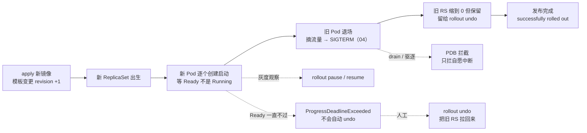
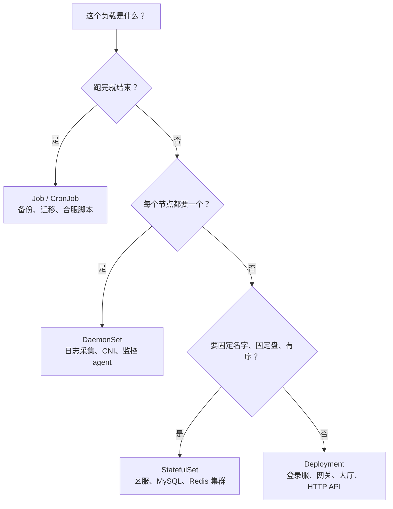
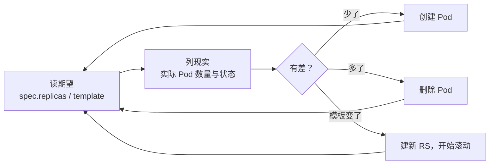
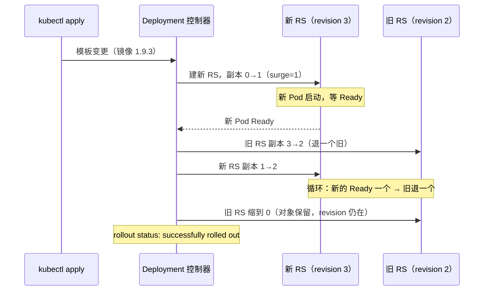
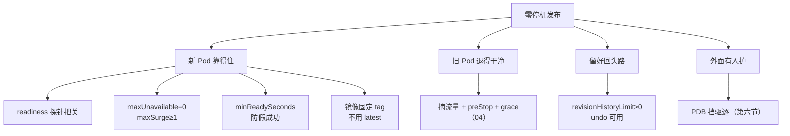
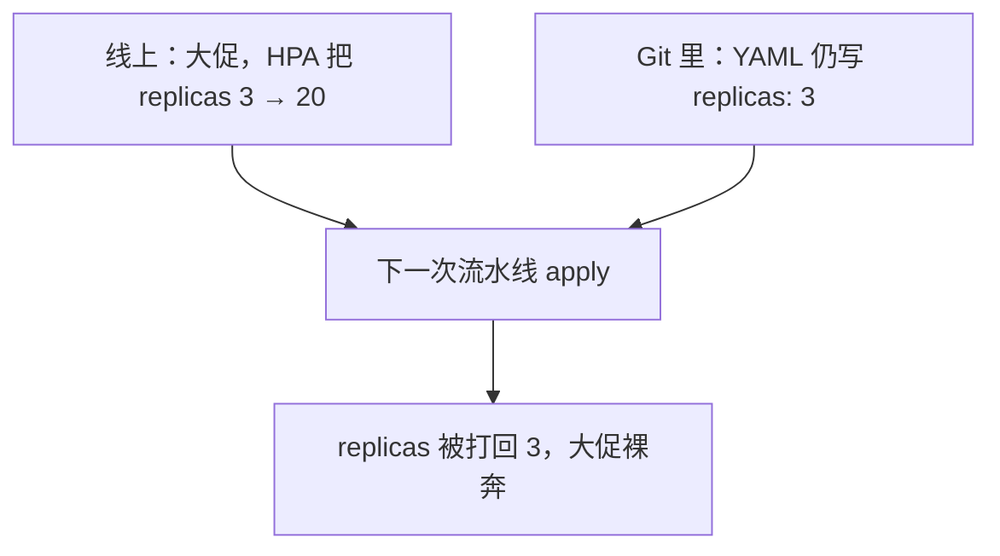
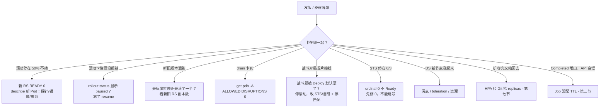

# 工作负载控制器

> 发版当天网关卡在 50%——有人 `kubectl delete pod`「让它重建」、战斗服被写成 Deployment 默认滚、drain 卡四十分钟有人要删 PDB；三刀叠在一起，发布进度、对局、维护窗口一起炸。
> **本章回答**：四类控制器怎么选；一次滚动从 apply 到新旧顶替卡在哪一站；pause / undo / PDB 各拦什么、第一刀砍哪。
> **不讲**：三探针、preStop、优雅退出 → [04](../04-Pod生命周期/)；HPA 指标与公式 → [07](../07-弹性伸缩/)；蓝绿/金丝雀策略 → [16](../16-灰度与回滚/)；Chart 结构 → [22](../22-Helm与Kustomize/)；GitOps 流水线 → [23](../23-GitOps-ArgoCD与Tekton/)；PVC Retain → [11](../11-存储/)；污点与 Pending → [06](../06-调度机制/)。

**标记**：🎯重点 · 🔥难点 · ⭐常考 · 🔧实操
---

## 一、一张图：一次发布的一生

> 🎯 **一句话**：一次发布 = 新 RS 出生 → 新 Pod 逐个 Ready → 旧 Pod 退场 → 旧 RS 缩 0；卡了先问「卡在哪一站」。



- 📖 **读图**
  - 🛤️ 主线「新 RS → 新 Pod Ready → 旧退场 → 旧 RS 缩 0」；发版卡住 90% 卡在「新 Pod 一直不 Ready」
  - 🔀 三条虚线：pause 是人控、deadline 是被动卡死（要人工 undo）、PDB 拦的是退场路上的驱逐不是滚动本身
  - ⚔️ 第一刀：`rollout status` / `get rs` 定站，再动手（Q1）

发布主线清楚了。先选型——同一套滚动，打在战斗服上就是事故。

本节对应练习题 Q1。

---

## 二、选型：哪个控制器管这份负载

> 🎯 **一句话**：选型选的是「期望状态怎么写」：可互换、固定身份、每节点一个、还是跑完就停。

所有工作负载控制器干同一件事：**Reconcile（调和）**——读期望、看实际、补差，循环往复。

- 🧠 **控制器只 Reconcile API 对象**，不直接起容器
  - 真正拉进程的是节点上的 **kubelet**；落点由 Scheduler 定（[01](../01-集群架构/)）
  - 「控制器挂了业务立刻死吗」→ **不会**：在跑的 Pod 还在，只是没人再补差、没人再滚动
  - 这些控制器跑在 **kube-controller-manager** 里；多副本必须 **leader-elect**，否则两个副本同时补差会打架

> 💡 **打个比方**：Deployment 像一群**可互换的大厅接待员**——人数够就行；StatefulSet 像**带工号和专属储物柜的房间 host**——`battle-0` 必须是原来那块盘、那个 DNS；DaemonSet 像**每层楼一个消防栓**；Job 像**一次性搬家队**——干完走人。



- 📖 **读图**
  - ❓ 三个问题按序问——跑完？每节点？身份固定？三个都「否」才落到 Deployment
  - 🎮 Deployment 是默认答案不是万能答案；战斗服「房间绑进程内存」→「身份要固定」必须答是

### 📊 四类期望怎么写 ⭐

| 对比项 | Deployment | StatefulSet | DaemonSet | Job / CronJob |
|--------|-----------|-------------|-----------|---------------|
| 期望状态 | replicas 个可互换副本 | 序号 0..N-1，身份固定 | 每节点恰好一个 | 跑满 completions 就停 |
| 网络 | Service 选一批 | Headless，`名字-序号` 固定 DNS | 通常不接业务流量 | 通常不接流量 |
| 盘 | 无盘或共享盘 | 每序号一块专属 PVC | 常见 hostPath | 可选 |
| 更新方式 | RollingUpdate / Recreate | 按序 RollingUpdate / OnDelete | RollingUpdate / OnDelete | 不滚动，重跑一次 |
| 游戏场景 | 登录服、网关、大厅 | 区服、战斗服、数据库 | 日志、CNI、监控 | 合服备份、数据迁移 |

> ⚠️ **别混**：**不要手工创建 ReplicaSet**。Deployment 的滚动和回滚全靠它替每个模板版本建一个 RS 并记 **revision**；手建的 RS 没有滚动策略、没有版本历史，`rollout undo` 用不了。RS 是内部实现，平时当细节看。

### 🏷️ StatefulSet：保证什么、不保证什么 🔥

STS 保证四件事，都围绕**身份稳定**：

1. **固定名字**：Pod 名是 `名字-序号`（`mysql-0`），重建后名字不变；**序号叫 ordinal**
2. **有序创建/删除**：创建从小到大（`0` Ready 才建 `1`）；删除从最大序号往回删
3. **稳定 DNS**：须配 **Headless Service**（`ClusterIP: None`，不做负载均衡，只给每个 Pod 解析名），如 `mysql-0.mysql-headless.db.svc.cluster.local`
4. **稳定磁盘**：`volumeClaimTemplates` 每序号一块 PVC；**删 STS 默认不删 PVC**（Retain，防误删，要删人手工清 → [11](../11-存储/)）

#### ❓ 为什么换了 STS 战斗服还不能无脑滚？

- ❌ **幻觉**：STS = 滚动不杀进程 / 内存状态不丢
- ✅ **真相**：RollingUpdate 照样按序号倒着杀，只是杀得有秩序；**对局在进程内存里，Pod 一死照样蒸发**
- 🛤️ 发布：`OnDelete`（不删不动）+ 业务先停匹配 / 热迁移；或 `partition` 金丝雀（`partition: 2` 只动序号 ≥2，验完改回 0）
- 👉 STS 解决「身份和数据放哪」，不解决「内存状态丢不丢」

### 🧯 DaemonSet：每节点一个 ⭐

- **节点加入自动补、移除自动收**——日志采集、CNI、kube-proxy、监控 agent
- 🔍 **某节点没起来，先查污点**：节点有 `pool=battle:NoSchedule`，DS 模板就要写对应 **toleration**（[06](../06-调度机制/)）；控制面节点同理要容忍 `node-role.kubernetes.io/control-plane`
- ⚠️ **别用 Deployment 副本数=节点数模拟 DS**：Scheduler 随机放 → 同节点挤多个、新节点一个没有
- 🕸️ **DS 滚动也有代价**：kube-proxy / CNI 一次放倒太多节点，网络平面成批断——改小步（[08](../08-Service与kube-proxy/)）

### 🧹 Job / CronJob：跑完就停 ⭐

- **Job**：跑满 `completions` 成功就停；失败重试 `backoffLimit`（默认 6），用尽 → Failed；`kubectl logs job/<name>`；`activeDeadlineSeconds` 防跑飞
- **CronJob**：定时建 Job；`concurrencyPolicy`：
  - `Forbid`：上次没完不起新的（备份必用，防叠罗汉锁库）
  - `Allow`：默认可叠加
  - `Replace`：杀旧起新

> ⚠️ **别混**：跑完的 Job 不会自删——几百个 Completed 会**灌爆 etcd**（[02](../02-etcd/)）→ `ttlSecondsAfterFinished` 必配。也别把长跑迁移塞 Init：Init 失败整个 Pod 起不来还跟着业务反复重启（[04](../04-Pod生命周期/)）。

### 🧩 原生 Sidecar（1.28+）

老写法时序靠运气：主容器先 Ready、sidecar 还没 listen → 502。原生写法：sidecar 放进 **initContainers** 并标 `restartPolicy: Always`——kubelet 等 sidecar Ready 再起主容器，主容器退出时等 sidecar 收尾。

> 🔍 **现场**：一眼认原生 sidecar

```bash
kubectl get po hall-xyz -n prod -o jsonpath='{range .spec.initContainers[*]}{.name}{"\t"}{.restartPolicy}{"\n"}{end}'
```

```text
envoy-proxy    Always        # ← restartPolicy=Always 的 initContainer = 原生 sidecar
```

### 🎮 游戏服选型落地 ⭐

```text
登录服        → Deployment：无状态，开服前先扩，maxSurge 顶洪峰
网关          → Deployment + PDB：长连接可互换，滚动要慢，ready + preStop（04）
大厅 / 匹配    → Deployment：可互换，默认滚动即可
战斗服        → StatefulSet 或自研：房间绑内存，OnDelete + 先停匹配，禁止默认滚
区服数据库     → StatefulSet + Headless Service
日志 / 监控    → DaemonSet：每节点一个，容忍节点池污点
合服备份 / 迁移 → CronJob Forbid + Job TTL
```

> 📝 **面试**：选型先答「期望状态四种写法」，再落到游戏负载；补一句「不要手建 ReplicaSet，没有 revision 就回不了滚」。⭐

口诀：⭐ **可互换 Deployment · 固定身份 STS · 每节点 DS · 跑完就停 Job**。接下来看控制器怎么「补差」。

本节对应练习题 Q1、Q2。

---

## 三、调和：期望与现实一直在对账

> 🎯 **一句话**：控制器不是「执行命令」，是循环「看期望 → 看现实 → 补差」；所以删 Pod 没用，它会立刻重建。

开篇那位删 Pod「让它重建一下」——控制器看见的「删」到底是什么？

> 💡 **打个比方**：Reconcile 像**巡场盘点员**——不记得你喊过什么，只看「名单要 3 个、货架有 2 个」，差一个就补一个。他认的是名单（spec），不是口头指令。

这种写法叫 **level-triggered（面向状态）** 🔥：不关心「刚才发生了什么事件」，只关心「此刻期望和实际差多少」。事件丢了、控制器重启了都没关系——声明式 API 的根（[01](../01-集群架构/)）。



- 📖 **读图**
  - 三条补差里只有「模板变了」触发滚动；少了/多了是静默补差
  - 所以「删 Pod 没反应」：不是没看见，是看见方式就是「少了补上」

#### ❓ 为什么删 Pod「重建一下」救不了滚动？

- ❌ **删新 Pod**：RS 立刻重建，同样镜像同样探针，照样卡——纯浪费
- ❌ **删旧 Pod**：容量直接跌破底线，更糟
- ✅ **要换镜像/配置**：改模板（apply / set image），让控制器走「模板变了」那条路
- 🧠 **重建补不回内存状态**：战斗服被删 → 空壳 Pod，对局里的对局不会回来
- 🔁 **手工改会被改回去**：`scale` / `edit` 改活状态；Git 期望没变，下次 apply 打回——完整故事在第七节

> ⚠️ **别混**：**Ready ≠ Running**。Running = 进程在跑；**Ready** = readiness 通过、可接流量（[04](../04-Pod生命周期/)）。滚动与 PDB 都按 Ready 计数——没配 readiness，账面全绿、流量 502。

> 🔍 **现场**：滚动卡在哪，先读 RS 三列

```bash
kubectl get rs -n prod -l app=gateway
```

```text
NAME              DESIRED   CURRENT   READY   AGE
gateway-6d9f8b    3         3         3       7d    # ← 旧 RS，滚动期间还在维持
gateway-7f4c9d    3         3         1       2m    # ← 新 RS，READY < DESIRED = 卡这里
```

本节对应练习题 Q2。

---

## 四、滚动：maxSurge 与 maxUnavailable 写的节奏

> 🎯 **一句话**：滚动不是「先杀旧再起新」，是「起新的、等 Ready、再退旧的」，节奏由两个参数写死。

**RollingUpdate** 是 Deployment 默认策略：

- **maxSurge**：滚动期间最多允许多几个超出期望（数字或百分比）——「能多来几个新人提前到岗」
- **maxUnavailable**：滚动期间最多允许多少个非 Ready——「能先走几个老员工」
- ⚠️ 两者**不能同时为 0**（原地踏步）；也不能让副本掉到 0 以下

> 💡 **打个比方**：滚动是一次**换班**。零停机只有一种写法：**新人到岗并站好（Ready）之前，老员工一个都不许走**——`maxUnavailable=0, maxSurge=1`。反过来「老人先走、新人慢慢来」就是拿停服换资源。

| 对比项 | maxSurge=1, maxUnavailable=0 | maxSurge=0, maxUnavailable=1 |
|--------|------------------------------|------------------------------|
| 顺序 | 先起新，等 Ready 再杀旧 | 先杀一个旧，再补新 |
| 服务能力 | 不降，瞬间 +1 | 滚动期间始终少一个 |
| 资源要求 | 要多出 1 个 Pod 余量 | 不需要余量 |
| 适用 | 登录服/网关零停机 | 资源紧张、能容忍缺一 |



- 📖 **读图**
  - 每一步离合器是「新 Pod Ready」——新的一直不 Ready，旧的也不会被杀
  - 「滚动卡住」通常掉的是**发布进度**，不是线上容量；第一刀 describe **新** Pod

步与步之间还有：

- **minReadySeconds**：Ready 后再稳定多少秒才算「可用」——防「Ready 两秒就崩」
- 大副本可用百分比（如 `25%/25%`）；零停机底线始终是 **maxUnavailable=0**

#### ❓ 为什么 maxUnavailable=0 还会 502？

- ❌ **拧滚动参数**：以为 0 不可用 = 切换瞬间零抖动
- ✅ **滚动只管几个算 Ready**，管不了摘流量是否同步、SIGTERM 后 grace 够不够
- 👉 流量还在往正在退出的旧 Pod 打 → 502；去 [04](../04-Pod生命周期/) 查探针/退出链、[08](../08-Service与kube-proxy/) 查 Endpoints

**progressDeadlineSeconds**：多久没进展标记 Failed（条件 **ProgressDeadlineExceeded**，默认 600s）。**只标记、不自动回滚**——要人 `rollout undo`。开服拉镜像慢别设太短；**pause 期间 deadline 不计时**。

> 🔍 **现场**：滚动卡住长什么样

```bash
kubectl rollout status deploy/gateway -n prod --timeout=120s
```

```text
Waiting for deployment "gateway" rollout to finish: 1 out of 3 new replicas have been updated...
error: timed out waiting for the condition      # ← 新 Pod 一直不 Ready，停在 1/3
```

三种更新策略 ⭐：

| 策略 | 谁支持 | 行为 | 适用 |
|------|--------|------|------|
| RollingUpdate | Deploy / STS / DS | 逐步替换，新旧短暂共存 | 默认；新旧能并存 |
| Recreate | Deploy | 旧的全杀完再起新 | 协议不兼容，接受中断窗口 |
| OnDelete | STS / DS | 你删才重建 | 区服/战斗服，业务定时机 |

**Recreate** 有全员中断窗口；能并存又想零切换 → 蓝绿（[16](../16-灰度与回滚/)）。

### 收束：零停机发布凭什么



- 📖 **读图**：四组零件——新靠得住 / 旧退干净 / 回头路 / 外面有人护；面试背这四组比背十个字段稳

> ⚠️ **别混**：零停机**不保证业务正确**。新版本逻辑有 bug，流量畅通结果全错；readiness 只证明「端口开了、探针过了」。灰度与监控（[16](../16-灰度与回滚/)）补这一段。

> 📝 **面试**：「零停机怎么配」按四组答；再补：保证的是切换不丢流量，不保证新版本逻辑正确。⭐

口诀：⭐ **`maxUnavailable=0` + `maxSurge≥1`，且等 Ready 再退旧**。

本节对应练习题 Q3、Q4、Q5、Q6。

---

## 五、停与退：pause、resume、rollback

> 🎯 **一句话**：pause 是人控节奏，undo 是止血——两者都靠「旧 RS 还在」才成立。

**什么时候按暂停**：

- **金丝雀**：走一批 → `rollout pause` → 观察错误率/对局成功率 → 没问题 `resume`，有问题 `undo`（完整灰度 → [16](../16-灰度与回滚/)）
- **合并多次变更**：先 pause，连着改镜像/资源/env，最后一次 resume 只滚一轮——不 pause 会滚三次

```bash
kubectl rollout pause deploy/gateway -n prod
# ...改镜像、改 resources、改 env...
kubectl rollout resume deploy/gateway -n prod
```

```text
deployment.apps/gateway paused
deployment.apps/gateway resumed     # ← resume 把暂停期间攒的变更一次滚出去
```

> ⚠️ **别混**：**pause ≠ 卡住**。pause 是人为的，`rollout status` 会明说 paused；ProgressDeadlineExceeded 是自己走不动。暂停期间 deadline **不计时**。

**回滚靠的是 revision** 🔥。每次模板变更，Deployment 建新 RS 并在注解记版本号（`deployment.kubernetes.io/revision`）；旧 RS 副本缩 0 但对象保留 = 回滚「存档」。

> 🔍 **现场**：看版本历史

```bash
kubectl rollout history deploy/gateway -n prod
```

```text
REVISION  CHANGE-CAUSE
2         kubectl set image deploy/gateway gateway=gateway:1.9.2
3         kubectl set image deploy/gateway gateway=gateway:1.9.3   # ← 当前，刚发坏了
```

CHANGE-CAUSE 为空很常见（要 `--record` 才写），不影响回滚——认 REVISION 号。

```bash
kubectl rollout undo deploy/gateway -n prod --to-revision=2
kubectl rollout status deploy/gateway -n prod
```

```text
deployment.apps/gateway rolled back
deployment "gateway" successfully rolled out     # ← 旧模板 RS 放大，新 RS 缩 0
```

#### ❓ 为什么 undo 之后版本号还在涨？

- ❌ **幻觉**：回滚 = 版本号往回退、时间倒流
- ✅ **机制**：把旧模板对应的 RS **拉大**、新 RS 缩 0——undo 本身又产生一个**新 revision**（从 3 回滚后下一个是 4，内容等于 2）
- ☠️ **两条死路**：
  - 镜像用 `latest`：「回滚」还是同一个 tag，各节点还可能拉到不同 digest
  - `revisionHistoryLimit: 0`：旧 RS 用完即删，undo 无处可去（默认保留 10）

> ⚠️ **别混**：**只回滚 Deployment 不一定够**。同批改过 ConfigMap/Secret 且与旧镜像不兼容 → 光 undo 只换镜像，配置还是坏的（[12](../12-配置与密钥/)；整包回滚 → [16](../16-灰度与回滚/)）。

> 📝 **面试**：每个模板版本一个 RS、一个 revision；undo 是放大旧 RS；`revisionHistoryLimit=0` 和 latest 都会让回滚失效；undo 产生新 revision，历史只增不减。⭐

本节对应练习题 Q7、Q8。

---

## 六、保护：PDB 拦的是自愿中断

> 🎯 **一句话**：PDB 只拦「有人主动发起的中断」；宕机它管不了，HPA 它也不拦。

**PodDisruptionBudget（PDB）**：给一组 Pod 挂底线——`minAvailable` 或 `maxUnavailable`，二选一。

- **自愿中断（voluntary disruption）** = 人/系统**主动经 API 发起**：`kubectl drain`、驱逐 API、Descheduler、节点缩容前驱逐
- 这些动作会先问 PDB：还满足底线吗？不满足就拒绝

> 💡 **打个比方**：PDB 是「**值班不能少于两人**」——拦得住主动调休（drain）；拦不住突发疾病（节点宕机），也拦不住老板直接缩编制（HPA 改 replicas）。

| PDB 拦（自愿中断） | PDB 不拦 |
|--------------------|----------|
| kubectl drain 节点 | 节点宕机、断电、内核崩溃 |
| 驱逐 API、Descheduler | 容器 OOMKilled |
| 节点缩容前的驱逐 | HPA 改 replicas、apply 打回副本 |

**ALLOWED DISRUPTIONS** = 当前还能再干扰几个而不破底线，**0 = 谁也不许动**。

> 🔍 **现场**：drain 被 PDB 拦下

```bash
kubectl drain node-gw-01 --ignore-daemonsets --delete-emptydir-data
```

```text
evicting pod gateway-7f4c9d-abc12
error when evicting pods/"gateway-7f4c9d-abc12" (will retry after 5s):
Cannot evict pod as it would violate the pod's disruption budget.   # ← PDB 生效，保护在工作
```

```bash
kubectl get pdb -n prod
```

```text
NAME          MIN AVAILABLE   MAX UNAVAILABLE   ALLOWED DISRUPTIONS   AGE
gateway-pdb   2               N/A               0                     30d   # ← 再驱逐一个就破底线
```

#### ❓ 为什么 drain 卡住第一刀不该是删 PDB？

- ❌ **删 PDB 硬赶**：保护被拆掉，整批驱逐一起倒
- ✅ **先读 ALLOWED DISRUPTIONS**：
  - 单副本 + `minAvailable=1` → drain **必然卡死**——这是保护在提醒「先迁流量/玩家」，先扩到 2 或先摘入口，**不是故障**
  - PDB 按 **Ready** 计数：没 readiness 时按 Running，账面满足、流量 502
  - HPA `minReplicas` < PDB `minAvailable` → HPA 缩容不走驱逐、不受 PDB 约束；缩完后 ALLOWED 永远凑不够，drain 一直卡（[07](../07-弹性伸缩/)）

> ⚠️ **别混**：PDB 的 `maxUnavailable` 和 Deployment 滚动的 `maxUnavailable` **同名不同物**——前者管自愿中断时最多几个不可用，后者管滚动期间几个不 Ready。

> 📝 **面试**：PDB 只拦自愿中断，不拦宕机/OOM/HPA 改 replicas；drain 卡住先 `get pdb`；单副本 minAvailable=1 卡死是保护不是 bug。⭐

口诀：⭐ **PDB 只拦自愿中断，不拦宕机，也不拦 HPA 直接改 replicas**。

本节对应练习题 Q9。

---

## 七、归属：这个对象归谁管

> 🎯 **一句话**：动手前先问「这对象归谁管」——Helm 管的对象被 kubectl 手改，下次 helm upgrade 会连本带利还回来。

**Helm 管理的对象，真值在 release 里**。`helm install/upgrade` 做**三方合并** 🔥（上次渲染清单 × 线上活状态 × 本次新清单），再写回集群；每次记一个 revision，旧的标 `superseded`。

- 你 `kubectl edit` 手改的字段不在 Helm 账本里 → 下次 upgrade 要么冲掉、要么 patch 冲突
- 标签 `app.kubernetes.io/managed-by: Helm` → 改动入口只能是 `helm upgrade -f values`

```bash
helm history gateway -n prod
```

```text
REVISION  STATUS      CHART          APP VERSION
2         superseded  gateway-1.2.0  1.9.2        # ← 旧版本还在账本里
3         deployed    gateway-1.3.0  1.9.3        # ← 当前
```

```bash
helm rollback gateway 2 -n prod
```

```text
Rollback was a success! Have fun upgrading!      # ← 回滚整个 release（chart + values），不是单个字段
```

#### ❓ 为什么不能用 `rollout undo` 回 Helm 管的对象？

- ❌ **`rollout undo`**：绕过 Helm 直接改 Deployment，Helm 账本毫不知情
- ✅ **下次 `helm upgrade`**：三方合并把你的手动回滚再冲掉
- 👉 Helm 管的对象，回滚入口只用 `helm rollback`（Chart → [22](../22-Helm与Kustomize/)）

**HPA 和 Git 抢 replicas** 是同一归属问题的另一面：



- 📖 **读图**
  - HPA 改的是活状态，Git 期望没变 → 声明式对账把 20 打回 3
  - PDB 挡不住这次打回（打回不是驱逐）
  - 解法三选一：Git 不写死 replicas 交给 HPA；或 **SSA fieldManager** 划字段归属；应急 `kubectl scale` 当天必须回填 Git

GitOps 更狠：Argo CD 开着 self-heal 时，手改会被直接改回 Git——「改完就回滚」是同步策略（[23](../23-GitOps-ArgoCD与Tekton/)）。

> 📝 **面试**：归属链 Git → Helm/流水线 → 集群；手改只应急、当天回填声明；追问 SSA 答 fieldManager 按字段划归属。⭐

本节对应练习题 Q10、Q11。

---

## 八、作战：定责

> 🎯 **一句话**：按主图的站点分诊——新 Pod 起不来查新，旧 Pod 退不掉查 PDB，选错控制器先停手。



- 📖 **读图**
  - 从左到右对主图站点；先定位「卡在哪一站」
  - 「新旧混跑」先分清故意灰度 vs 滚动僵住——处理完全相反

| 现象 | 先做 | 别做 |
|------|------|------|
| 滚动卡住 | describe 新 Pod；等不起先 `rollout undo` | 等自动 undo；删 Pod「重建」 |
| 滚动卡住没报错 | `rollout status` 看 paused → `resume` | 当成故障再发一版 |
| 新旧版本混跑 | 看新旧 RS 副本数，确认灰度还是僵住 | 不确认就把另一版删光 |
| drain 卡死 | `get pdb -A`；先扩容或迁流量 | 删 PDB 硬赶；强杀节点 Pod |
| 战斗对局成片掉 | 立即停滚动，改 STS/自研 + 停匹配 | 「K8s 自愈」再滚一轮 |
| STS 停在 0/N | 修 ordinal-0，它 Ready 后面才动 | 跳号修后面的 |
| DS 缺节点 | 污点 / toleration / nodeSelector / 资源 | 直接删 DS 重建 |
| 扩容完又缩回去 | 查 HPA 与 Git 的 replicas 归属 | 反复手动 scale 不管声明 |
| maxUnavailable=0 仍 502 | 查摘流量、preStop、grace（[04](../04-Pod生命周期/)） | 继续拧滚动参数 |
| 删 STS 后盘还在 | Retain 预期，要删人手工清（[11](../11-存储/)） | 当泄漏直接格式化 |

60 秒剧本 🔧（滚动卡住）：

```text
0–10s   kubectl rollout status deploy/{name} —— 卡在哪一句：
        "x out of N updated" = 新 Pod 没起来；"Waiting..." = 起来了没 Ready
10–30s  kubectl get rs -l app={name} —— 新 RS 的 READY 就是战场；
        describe 新 Pod 看 Events：Readiness probe failed / 镜像拉不下来 / 资源不足
30–45s  决断：业务等不起 → kubectl rollout undo 先止血；
        等得起 → 修新 Pod 根因（tag / 探针 / 配置），盯着它自己走下去
45–60s  undo 后用 rollout status 确认回到旧版全量；
        再复盘根因，同批改过的 ConfigMap/Secret 要不要一起回（第五节）
```

本节对应练习题 Q12、Q13、Q14。

---

## 九、收口

### 命令速查 🔧

```bash
kubectl get deploy,rs,sts,ds,job,pdb -n {ns}   # 先看当前都是什么控制器
kubectl rollout status deploy/{name}            # 滚动进度 / 是否 paused
kubectl rollout history deploy/{name}           # revision 列表
kubectl rollout history deploy/{name} --revision=2   # 某版本的模板细节
kubectl rollout undo deploy/{name} [--to-revision=2] # 回滚（非 Helm 管的对象）
kubectl rollout pause / resume deploy/{name}    # 灰度暂停 / 合并变更
kubectl get pdb -A                              # drain 前先跑这条
kubectl describe sts {name}                     # 有序创建卡住看这里
kubectl logs job/{name}                         # Job 失败看对应 Pod 日志
helm history <release> && helm rollback <release> <rev>  # Helm 对象的回滚入口
```

### 面试锚点

遮住右列自问自答，卡壳的行回去重读对应小节。

| 问 | 30 秒答 |
|----|---------|
| 四类控制器怎么选？ | 期望状态：可互换 Deploy、固定身份 STS、每节点 DS、跑完就停 Job/CronJob |
| 为什么不要手建 ReplicaSet？ | RS 是 Deploy 内部实现，手建无滚动策略、无 revision，undo 用不了 |
| Deployment 滚动原理？ | 新模板建新 RS，按 maxSurge/maxUnavailable 步进，等 Ready 才退旧 |
| 零停机发布怎么配？ | maxUnavailable=0 + maxSurge≥1 + readiness + minReadySeconds；旧 Pod 摘流量/grace 归 04 |
| 滚动卡住先查什么？ | 新 RS 的 READY，describe 新 Pod；等不起先 undo |
| ProgressDeadlineExceeded 会自动回滚吗？ | 不会，只标记 Failed，要人工 undo；暂停期间不计时 |
| pause 有什么用？ | 金丝雀观察窗口；合并多次变更一次滚完 |
| 回滚原理？ | 每模板一 RS 一 revision，undo 放大旧 RS；latest 与 revisionHistoryLimit=0 让回滚失效 |
| STS 保证什么？ | 固定名、有序、Headless DNS、每序号 PVC；不保证内存状态 |
| 战斗服能无脑滚吗？ | 不能；STS + OnDelete + 先停匹配，或自研调度 |
| 日志采集为什么用 DaemonSet？ | 每节点恰好一个，节点增减自动对齐 |
| DS 某节点没起来查什么？ | 污点与 toleration、nodeSelector、资源 |
| Job 失败怎么查？ | backoffLimit 用尽变 Failed，`kubectl logs job/<name>` |
| Completed Job 堆着会怎样？ | 灌爆 etcd，ttlSecondsAfterFinished 必配 |
| CronJob 怎么防叠罗汉？ | concurrencyPolicy: Forbid |
| PDB 拦什么？ | 只拦自愿中断；不拦宕机、OOM、HPA 改 replicas |
| drain 卡死怎么办？ | get pdb 看 ALLOWED DISRUPTIONS；先扩容或迁流量，别删 PDB |
| 单副本 minAvailable=1 卡 drain 是 bug 吗？ | 不是，是保护，先迁玩家/流量 |
| Recreate 什么时候用？ | 新旧协议不兼容、接受中断；否则蓝绿（16） |
| Helm 管的对象能手改吗？ | 不能；回滚用 helm rollback，别用 rollout undo |
| HPA 和 Git 抢 replicas 怎么办？ | Git 不写死，或 SSA fieldManager；应急 scale 当天回填 |

### 易错一句话对照

- 手建 ReplicaSet 和 Deployment 建的没区别 → 手建无滚动策略和 revision，undo 用不了
- 滚动等 Running 就算成功 → 等的是 Ready，再加 minReadySeconds 防假成功
- ProgressDeadlineExceeded 等一等就自动回滚 → 只标记 Failed，必须人工 undo
- pause 久了会超时失败 → 暂停期间 deadline 不计时
- STS 保证滚动不杀进程 → 照样按序号倒着杀，它保证身份和盘
- 战斗服换了 STS 就能随便滚 → 内存对局照样丢，要先停匹配/热迁
- PDB 能防节点宕机 → 只拦自愿中断
- PDB 能挡住 HPA 缩容 → HPA 直接改 replicas，不走驱逐
- 两个 maxUnavailable 是一个东西 → 同名不同物：一个管驱逐、一个管滚动节奏
- Deployment 副本数=节点数就是 DaemonSet → 节点增减对不齐，同节点还会挤多个
- 删 STS 后盘还在是泄漏 → PVC 默认 Retain，防误删设计
- Job 跑完堆着没关系 → Completed 灌 etcd，TTL 必配
- 回滚只要 rollout undo 就够 → 同批改坏的 ConfigMap/Secret 要一起回
- 应急 edit Helm 对象改完就完事 → 下次 helm upgrade 三方合并连本带利还回来
- 回滚是版本号往回退 → undo 产生新 revision，只增不减
- 镜像用 latest 方便 → 回滚等于没回，各节点还可能不一致

### 数字墙

> 零停机：`maxUnavailable=0` + `maxSurge≥1` · progressDeadlineSeconds 默认 **600s** · revisionHistoryLimit 默认 **10** · Job backoffLimit 默认 **6** · 删 STS 默认**保留 PVC** · HPA minReplicas **≥** PDB minAvailable · DaemonSet 每节点恰好 **1** · CronJob 备份用 **Forbid** · Job 必配 **TTL** · Recreate 有**中断窗口** · pause 期间 deadline **不计时** · undo 的 revision **只增不减** · 原生 sidecar 要 **1.28+**

---

## 合上书

- [ ] **默画**主图：apply → 新 RS → 新 Pod Ready → 旧退场 → 旧 RS 缩 0，标出 pause、deadline、undo、PDB 四个岔口。（Q1）
- [ ] 口述选型：四类期望状态；登录/网关/战斗服/日志各选什么；为什么不能手建 ReplicaSet。（Q1、Q2）
- [ ] 口述调和：level-triggered；为什么删 Pod 没用；Ready vs Running，滚动与 PDB 各按哪个计数。（Q2）
- [ ] 口述滚动：两种 maxSurge/maxUnavailable 组合；为什么等 Ready；minReadySeconds；ProgressDeadlineExceeded 之后会/不会发生什么。（Q3～Q6）
- [ ] **默画**「零停机凭什么」四组：新靠得住 / 旧退干净 / 回头路 / 外面有人护。（Q5）
- [ ] 口述停与退：pause 两用途；undo 放大旧 RS；latest 与 revisionHistoryLimit=0 怎么走死；只 undo Deploy 何时不够。（Q7、Q8）
- [ ] 口述保护：PDB 拦/不拦；drain 卡死处理；单副本 minAvailable=1；与 HPA minReplicas 关系。（Q9）
- [ ] 口述归属：edit Helm 对象会怎样；helm rollback vs rollout undo；HPA 与 Git 抢 replicas 三种解法。（Q10、Q11）
- [ ] 定责演练：滚动卡 50%、drain 卡死、战斗对局成片掉——各走决策树哪条、第一刀砍哪。（Q12～Q14）

九条都能不看稿讲下来，这一章就过了。终极测试：拦住开篇那三个误操作。下一章拆调度：Pending 到底是资源、污点还是硬反亲和。
