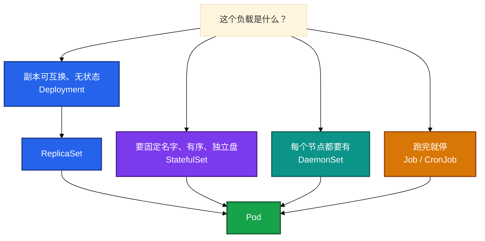
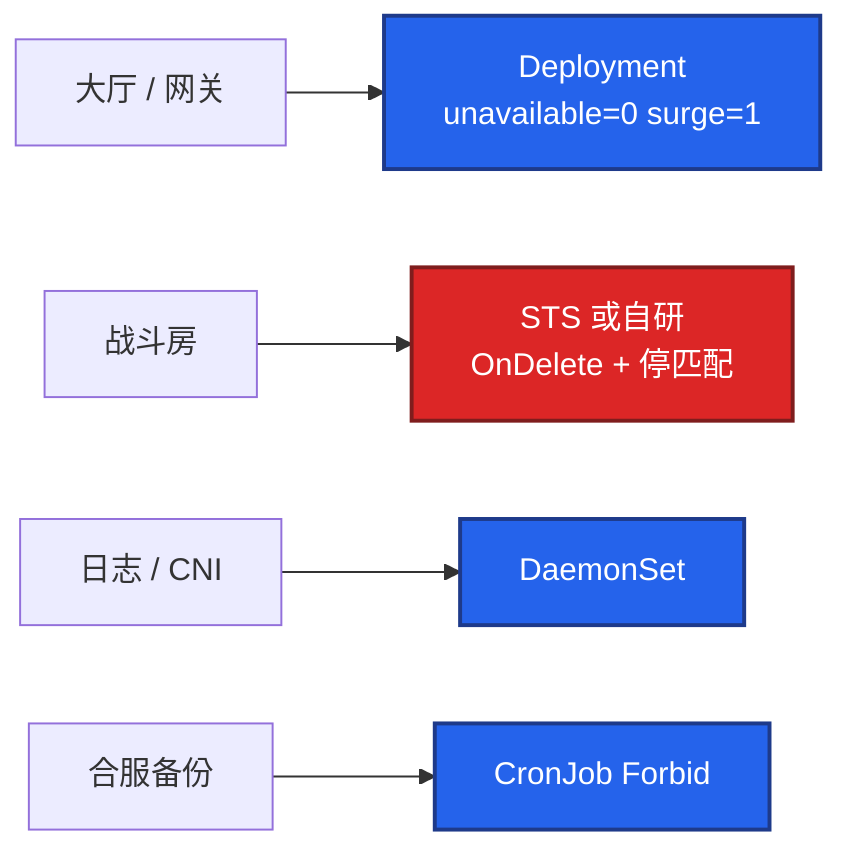
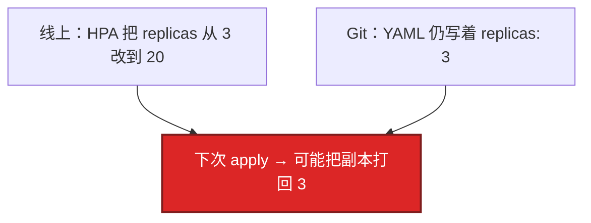
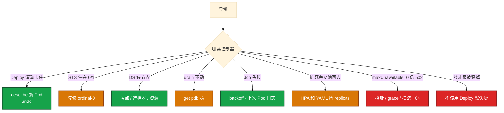

# 工作负载控制器


开服窗口，有人把战斗房间服写成 Deployment 默认滚——滚动一启动，三百个对局同时被 SIGTERM。另有人在 drain 网关节点时卡了四十分钟，上来就要删 PDB。这一章只做一件事：**先选对控制器，再谈 surge / unavailable；PDB 只拦自愿中断，不拦宕机也不拦 HPA**。

**本章主线（发版就按这三步想）：**

1. **选型**：可互换 Deploy / 固定身份 STS / 每节点 DS / 跑完 Job。
2. **滚动**：等 Ready 不是 Running；unavailable=0 + surge=1；deadline 到了要人 undo。
3. **保护**：PDB 只拦自愿中断；HPA 与 YAML 会抢 replicas。

**读完你能：** 四种控制器怎么选；零停机怎么配 surge / unavailable；STS 保证什么、不保证什么；PDB 只拦自愿中断；有状态游戏服不要当 Deployment 滚。

## 本章目录

- [1. 基本概念](#1-基本概念)
- [2. 架构图](#2-架构图)
- [3. 原理](#3-原理)
  - [3.1 四种差别](#31-deploy--sts--ds--job-差别)
  - [3.2 Deployment 滚动](#32-deployment-滚动与回滚)
  - [3.3 StatefulSet](#33-statefulset-身份和盘不是可以无脑滚)
  - [3.4 PDB](#34-pdb-只拦自愿中断)
  - [3.5 DaemonSet 与 Job](#35-daemonset-与-job)
  - [3.6 Sidecar](#36-原生-sidecar128)
- [4. 安装部署](#4-安装部署)
- [5. 核心配置](#5-核心配置)
- [6. 命令与操作](#6-命令与操作)
- [7. 生产排障](#7-生产排障)
- [8. 必会 · 常考](#8-必会--常考)
- [合上书](#合上书问自己)

**本章不讲：** 三探针、优雅退出、QoS → [04 Pod 生命周期](../04-Pod生命周期/)；HPA 公式、有状态不能缩 → [07](../07-弹性伸缩/)；灰度 / 蓝绿 / 回滚 RTO → [15](../15-灰度与回滚/)；GitOps 流水线 → [22](../22-GitOps-ArgoCD与Tekton/)；存储 PVC Retain → [11](../11-存储/)；过滤打分 → [06](../06-调度机制/)。

---

## 1. 基本概念

控制器只 Reconcile API 对象，**不直接起容器**。真正拉进程的是 kubelet。差别是「期望」怎么定义：可互换副本、固定身份、每节点一个、还是跑完就停。

**值班里怎么认现象**（先听业务/监控怎么说，再对表）：

| 玩家/运维说的 | 技术含义 | 你的第一刀 |
|---------------|----------|------------|
| 「发版玩家全掉线」 | 可能用了 Deploy 滚战斗服 | 查控制器类型和滚动策略 |
| 「滚动一直卡住」 | 新 Pod 没过 Ready 或 deadline | `rollout status` + describe 新 Pod |
| 「drain 不动」 | 多半是 PDB | `kubectl get pdb -A` |
| 「扩容完又缩回去」 | HPA 和 Git 抢 replicas | 查 HPA 和 YAML |
| 「删 STS 盘还在」 | Retain 是预期 | 确认是否还要数据再删 PVC |

| 控制器 | 身份 | 存储 | 场景 |
|--------|------|------|------|
| **Deployment** | 可互换 | 共享或无盘 | 大厅、网关、HTTP API |
| **StatefulSet** | 固定 ordinal + DNS | volumeClaimTemplates | MySQL/Redis、要稳定网络 ID 的服 |
| **DaemonSet** | 每节点 | 常 hostPath | 日志、监控、CNI |
| **Job/CronJob** | 跑完就停 | 可选 | 迁移、备份 |
| ReplicaSet | 只保副本数 | — | **不要直接用** |

同一套 Reconcile：读期望 → 看实际 → 创建/删除/更新 Pod。滚动和 PDB 都依赖 **Ready**。没有 readiness，Deployment 以为新 Pod 已服役，PDB 也按 Running 计数——账面满足、流量已 502（04）。

**打个比方**：Deployment 像 **可替换的 NPC 大厅服务员**——谁在岗无所谓，只要人数够；StatefulSet 像 **带工号和专属储物柜的房间 host**——`room-0` 必须是原来那块盘、那个 DNS 名。

> **记住**：可互换用 Deploy，固定身份和盘用 STS，每节点用 DS，跑完就停用 Job；不要手建 RS。游戏：可互换用 Deploy；**一室一进程用 STS 或自研，禁止当 Web 默认滚**。

**面试怎么说**：「控制器只 reconcile API 对象，真正起容器是 kubelet；战斗服进程不可互换，不能当 Deployment 默认 RollingUpdate。」

---

## 2. 架构图

先把选型钉住。后面滚动、PDB、排障都对着这张图说话。



**读图三句话：**

1. **你 apply 的是 Deployment，控制器先建 ReplicaSet，再建 Pod**——Scheduler 和 kubelet 后面才干活（01）。
2. **四种不要画成「都能滚」**——战斗服用 Deploy 默认滚等于杀对局。
3. **手建 RS 没有 revision 历史**——`rollout undo` 用不了。

四种对比：

| | Deployment | StatefulSet | DaemonSet | Job |
|--|------------|-------------|-----------|-----|
| 副本 | replicas，可互换 | ordinal 0..N-1 | 每节点一个 | completions |
| 滚动 | RollingUpdate / Recreate | 按序；OnDelete | RollingUpdate / OnDelete | 不滚 |
| 网络 | Service 选一批 | Headless `name-N` DNS | 通常不进普通 Service | 通常不接流量 |
| 盘 | 共享或无 | 每 N 一块 PVC | hostPath 常见 | 可选 |
| 游戏 | 大厅、网关 | 区服身份 | 日志 / CNI | 合服备份 |

---

## 3. 原理

原理只保留动手和面试会用到的：怎么选、怎么滚、STS 保证什么、PDB 拦什么、DS/Job 踩什么。

**本节 6 块：** 3.1 差别 · 3.2 Deploy 滚动 · 3.3 STS · 3.4 PDB · 3.5 DS/Job · 3.6 Sidecar

### 3.1 Deploy / STS / DS / Job 差别

**一句话：** 四种控制器的差别是期望怎么定义：可互换、固定身份、每节点、跑完就停。

**打个比方**：Deploy 像 **轮换制保安**——谁值班都行；STS 像 **固定柜号的更衣柜**——3 号柜永远是小明的；DS 像 **每层楼一个消防栓**——有几层楼就得有几个；Job 像 **一次性装修队**——干完就走。

**现场走一遍**（新人把日志采集写成 Deploy 副本数=节点数）：

1. 看当前部署：

```bash
kubectl get deploy,ds -n kube-system -l component=log-agent
```

2. 屏幕出现只有 Deploy、没有 DS：

```text
NAME          READY   UP-TO-DATE   AVAILABLE   AGE
log-agent     5/5     5            5           30d
```

3. 看 Pod 分布：

```bash
kubectl get po -n kube-system -l app=log-agent -o wide
```

4. 屏幕出现两台节点各 2～3 个 Pod，新加节点没有：

```text
log-agent-abc   1/1   Running   node-a
log-agent-def   1/1   Running   node-a
log-agent-ghi   1/1   Running   node-b
# 新 node-c 上没有 log-agent
```

5. 对比 DS 应有行为：

```bash
kubectl get ds -n kube-system -l k8s-app=fluentd  # 参考正确形态
```

**输出解读：**

| 观察 | 含义 |
|------|------|
| Deploy 5/5 但 node-c 没有 | Deploy **不保证**每节点一个 |
| 同一 node 多个副本 | Scheduler 随机放，不是 DS |
| 应改用 DaemonSet | 节点增减自动对齐 |

不要用 Deploy + 副本数=节点数模拟 DaemonSet。不要手建 ReplicaSet。房间绑内存的战斗服不能当 Web 用 Deploy 默认滚。Recreate 适合不能双版本并存——会中断。

**面试怎么说**：「每节点一个用 DaemonSet，不是 Deploy 副本数凑节点数；战斗服进程不可互换，用 STS 或自研，不能 Deploy 默认滚。」

> **记住**：四种控制器选错，后面滚动公式救不了。

### 3.2 Deployment 滚动与回滚

**一句话：** Deployment 滚动是新建 RS 步进，等 Ready 不是等 Running。

**打个比方**：换班不是原地换人——先叫新服务员到岗站好（Ready），再让老员工下班；不是只看人进了门（Running）就开始接客。

**现场走一遍**（大厅镜像从 hall:1.2 升到 hall:1.3，滚动卡住）：

1. 改镜像后 apply，看滚动状态：

```bash
kubectl rollout status deploy/hall -n prod --timeout=120s
```

2. 屏幕卡住：

```text
Waiting for deployment "hall" rollout to finish: 1 out of 3 new replicas have been updated...
error: timed out waiting for the condition
```

3. 看 ReplicaSet 和 Pod：

```bash
kubectl get rs,po -n prod -l app=hall
```

4. 屏幕出现：

```text
NAME              DESIRED   CURRENT   READY   AGE
hall-7d8f9c       2         2         2       2h    # 旧 RS
hall-9a2b1c       1         1         0       5m    # 新 RS，Ready 0

NAME                    READY   STATUS             RESTARTS
hall-9a2b1c-xk9m2       0/1     CrashLoopBackOff   4
```

4. 查 Events：

```bash
kubectl describe po hall-9a2b1c-xk9m2 -n prod | tail -15
```

5. 屏幕出现：

```text
Warning  Unhealthy  Readiness probe failed: HTTP probe failed with statuscode: 503
Warning  BackOff    Back-off restarting failed container
```

6. 业务止血：

```bash
kubectl rollout undo deploy/hall -n prod
kubectl rollout status deploy/hall -n prod
```

**输出解读：**

| 字段 | 含义 |
|------|------|
| 新 RS `READY 0` | 新 Pod **没过 readiness**，滚动停步 |
| `CrashLoopBackOff` | 容器起不来或探针一直失败 |
| `ProgressDeadlineExceeded` | 默认约 **10 分钟**，**不会自动 undo** |
| `rollout undo` 后旧 RS 恢复 | revision 历史还在才能回 |

零停机常用 **unavailable=0 + surge=1 + readiness**。`minReadySeconds` 避免 Ready 立刻又挂被当成成功。镜像不要 `latest`；`revisionHistoryLimit=0` 会没法 undo。

**面试怎么说**：「滚动卡住我先 describe 新 Pod 看 Ready 为什么不过；deadline 到了不会自动 undo，要 rollout undo 再查探针和镜像。」

> **记住**：滚动等 Ready 不是等 Running；deadline 到了要人 `rollout undo`。

### 3.3 StatefulSet：身份和盘，不是「可以无脑滚」

**一句话：** StatefulSet 保证名/序/盘/DNS，但不解决内存里的对局。

**打个比方**：STS 保证 **工号和小柜号不变**——`room-0` 还是那块盘；但不保证房间里的牌局能自动迁到 `room-1`，那是业务的事。

**现场走一遍**（MySQL STS，mysql-0 CrashLoop，后面序号没起来）：

1. 看 STS 和 Pod：

```bash
kubectl get sts,po -n db -l app=mysql
```

2. 屏幕出现：

```text
NAME     READY   AGE
mysql    0/3     1h

NAME       READY   STATUS             RESTARTS
mysql-0    0/1     CrashLoopBackOff   6
# mysql-1、mysql-2 不存在
```

3. describe STS：

```bash
kubectl describe sts mysql -n db | grep -A5 Events
```

4. 屏幕出现：

```text
Warning  FailedCreate  create Pod mysql-1: waiting for mysql-0 to be Ready
```

5. 查 PVC：

```bash
kubectl get pvc -n db
```

6. 屏幕：

```text
NAME           STATUS   VOLUME                                     CAPACITY
data-mysql-0   Bound    pvc-abc123                                 100Gi
```

**输出解读：**

| 观察 | 含义 |
|------|------|
| 只有 mysql-0 | STS **有序创建**，0 不 Ready 不建 1 |
| `waiting for mysql-0 to be Ready` | 不能跳号修 2 而 0 是坏的 |
| PVC 仍 Bound | 删 STS **默认不删 PVC**（Retain） |
| 游戏区服同理 | 换了 STS 仍会按序杀 Pod，**不解决内存对局** |

DNS：`mysql-0.mysql-headless.ns.svc.cluster.local`（必须 Headless）。区服常用 `OnDelete` 或 `partition` 金丝雀（15）。

**面试怎么说**：「STS 保证固定 ordinal、Headless DNS 和每序号一块盘；滚动仍会杀进程，游戏服要先停匹配再换，不能无脑滚。」

> **记住**：STS 保证名/序/盘/DNS；不解决内存对局。

### 3.4 PDB：只拦自愿中断

**一句话：** PDB 只拦自愿中断，不拦宕机也不拦 HPA 改 replicas。

**打个比方**：PDB 像 **「值班不能少于两人」的排班规定**——只拦你主动调休（drain）；拦不住有人突发疾病（节点宕机），也拦不住 HR 直接改编制（HPA 缩容）。

**现场走一遍**（维护 drain 网关，卡住不动）：

1. 执行 drain：

```bash
kubectl drain node-gw-01 --ignore-daemonsets --delete-emptydir-data
```

2. 屏幕卡住：

```text
evicting pod gateway-7d8f9c-abc12 ...
error when evicting pods/"gateway-7d8f9c-abc12" -n "prod" (will retry after 5s):
Cannot evict pod as it would violate the pod's disruption budget.
```

3. 查 PDB：

```bash
kubectl get pdb -n prod
```

4. 屏幕出现：

```text
NAME           MIN AVAILABLE   ALLOWED DISRUPTIONS   AGE
gateway-pdb    2               0                     30d
```

5. 看当前网关 Pod 数：

```bash
kubectl get po -n prod -l app=gateway
```

6. 屏幕：

```text
NAME                    READY   STATUS    NODE
gateway-7d8f9c-abc12    1/1     Running   node-gw-01
gateway-7d8f9c-def34    1/1     Running   node-gw-02
gateway-7d8f9c-ghi56    0/1     Running   node-gw-03   # 探针没过但 Running
```

**输出解读：**

| 字段 | 含义 |
|------|------|
| `ALLOWED DISRUPTIONS 0` | 再驱逐一个会低于 minAvailable |
| `Cannot evict ... PDB` | **自愿中断**被拦——保护生效 |
| 第三个 Pod READY 0 | 没 readiness 时 PDB 可能按 Running 计数，**账面满足、流量 502** |
| 单副本战斗服 minAvailable=1 | drain **直接卡死**——先迁玩家 |

PDB 管：drain、驱逐、Descheduler。不管：节点断电、OOM、**HPA 改 replicas**、apply 把副本打回去。

**面试怎么说**：「drain 卡住我先 get pdb；PDB 只拦自愿中断，不防宕机也不拦 HPA；单副本 minAvailable=1 卡死是保护，先迁玩家别删 PDB。」

> **记住**：PDB 只拦 drain 这类自愿中断，不拦宕机，也不拦 HPA。

### 3.5 DaemonSet 与 Job

**一句话：** DaemonSet 每节点一个；Job 跑完就停，Completed 要 TTL。

**打个比方**：DS 像 **每节车厢的乘务员**——加一节车厢就多一个；Job 像 **一次性搬家公司**——搬完发票（Completed）要 shredding，别堆满档案室（etcd）。

**现场走一遍 A**（新战斗节点没有日志 agent）：

1. 新节点加入后：

```bash
kubectl get po -n kube-system -l app=log-agent -o wide | grep node-battle-03
```

2. 空——查 DS：

```bash
kubectl describe ds log-agent -n kube-system | grep -A8 Tolerations
kubectl describe node node-battle-03 | grep Taint
```

3. 屏幕 node 有污点：

```text
Taints: pool=battle:NoSchedule
```

4. DS 没有对应 toleration → 新节点上不来。

**现场走一遍 B**（Job 完成后 API 变慢）：

1. 查 Completed Job：

```bash
kubectl get jobs -A --field-selector status.successful=1 | wc -l
```

2. 屏幕：`847`

3. 查 etcd 告警（02）或 API Event 风暴——Completed Pod 无 TTL 灌库。

**输出解读：**

| 场景 | 结论 |
|------|------|
| DS 缺节点 + 节点有污点 | 给 DS 加 toleration 或确认不该上 |
| 800+ Completed Job | 必须 `ttlSecondsAfterFinished` |
| CronJob 备份叠罗汉 | `concurrencyPolicy: Forbid` |

**面试怎么说**：「DS 缺节点先看污点和 toleration；Job Completed 要 TTL，CronJob 备份用 Forbid 防叠罗汉。」

> **记住**：DS 缺节点先看污点；Job Completed 要 TTL 别灌 etcd。

### 3.6 原生 Sidecar（1.28+）

**一句话：** 1.28+ 原生 sidecar 靠 initContainers + restartPolicy Always 保证时序。

**打个比方**：Sidecar 像 **先进场布置灯光的场务**——灯亮好了主演出场；旧写法像把场务塞在观众里，谁先谁后靠运气。

**现场走一遍**（大厅注入 Envoy，主容器先 Ready 代理还没 listen）：

1. 看 Pod 结构：

```bash
kubectl get po hall-xyz -n prod -o jsonpath='{range .spec.initContainers[*]}{.name}{"\t"}{.restartPolicy}{"\n"}{end}'
```

2. 旧写法屏幕：

```text
envoy-proxy
# restartPolicy 空 → 不是原生 sidecar
```

3. 1.28+ 正确写法应见：

```text
envoy-proxy    Always
```

4. 查就绪顺序：

```bash
kubectl describe po hall-xyz -n prod | grep -E "Ready|Started"
```

5. 若 game-server Ready 但 502，查 sidecar 端口：

```bash
kubectl exec hall-xyz -n prod -c envoy-proxy -- ss -lntp
```

**输出解读：**

| 观察 | 含义 |
|------|------|
| `restartPolicy: Always` in initContainers | **原生 sidecar**，kubelet 保证时序 |
| 主 Ready、代理未 listen | 旧写法或 sidecar 探针问题 |
| Init 栏 sidecar 一直 Running | 正常，不是 Completed |

**面试怎么说**：「1.28+ sidecar 用 initContainers + restartPolicy Always，kubelet 保证 sidecar Ready 后再起主容器。」

> **记住**：原生 sidecar 时序由 kubelet 保证，不是 Init 跑完就退出的 hack。

---

## 4. 安装部署

### 4.1 生产怎么选

控制器随 kube-controller-manager 跑，kubeadm 静态 Pod。多副本必须 **leader-elect**（01）。你 apply 的是工作负载 YAML，不是再装一套控制器。

| 负载 | 选 | 不选 |
|------|----|------|
| 大厅 / 匹配 / HTTP | Deploy + unavailable=0 + readiness + PDB | 手建 RS；无 readiness |
| 区服 / MySQL | STS + Headless；OnDelete 或先停匹配 | 当 Deploy 默认 RollingUpdate |
| 日志 / CNI / kube-proxy | DS + 容忍控制面污点 | Deploy 副本数=节点数 |
| 备份 / 迁移 | CronJob Forbid + Job TTL | 塞 Init；Allow 叠罗汉 |
| 战斗服 | STS 或自研；禁无脑滚 | Web 模板一套 YAML 打天下 |

### 4.2 游戏发版怎么拆



| 负载 | 控制器 | 滚动 | 备注 |
|------|--------|------|------|
| 大厅 / 网关 | Deployment | unavailable=0 + surge + Ready | PDB 必配 |
| 战斗房 | STS 或自研 | OnDelete 或先停匹配 | **禁止 Deploy 默认滚** |
| 日志 / CNI | DaemonSet | maxUnavailable 要小 | 容忍控制面污点 |
| 合服备份 | CronJob | 不滚 | Forbid + Job TTL |

协议不兼容、不能双版本并存：Recreate 或蓝绿切流（15），并接受中断窗口。

---

## 5. 核心配置

| 字段 | 生产怎么用 | 改错会怎样 |
|------|------------|------------|
| `strategy.maxUnavailable` | 零停机 = 0 | 1 则有缺口 |
| `strategy.maxSurge` | 零停机 = 1 | 0 且 unavailable=0 滚不动 |
| `minReadySeconds` | 避免 Ready 立刻又挂 | 半死版本被当成已服役 |
| `revisionHistoryLimit` | >0 才能 undo | 0 没法回滚 |
| `progressDeadlineSeconds` | 开服窗口别太短 | 到了 **不会自动 undo** |
| STS `updateStrategy` | 区服常用 OnDelete | RollingUpdate 会按序杀 xxx-0 |
| STS `partition` | 金丝雀只滚 ≥ N | 忘了改回 0 旧序号永远不滚 |
| PDB minAvailable | 多副本网关必配 | 单副本 =1 让 drain 卡死 |
| HPA minReplicas | ≥ PDB minAvailable | 永远赶不走 |
| Job `ttlSecondsAfterFinished` | **必须** | Completed 灌 etcd |
| CronJob `concurrencyPolicy` | 备份用 Forbid | 叠罗汉锁库 |

HPA 和 Git 抢 replicas：



> **记住**：HPA 改过的 replicas，下次 apply 可能打回去；PDB 挡不住这次打回。

---

## 6. 命令与操作

```bash
kubectl get deploy,rs,sts,ds,job,pdb -n <ns>
kubectl rollout status deploy/web
kubectl rollout history deploy/web
kubectl rollout undo deploy/web
kubectl get pdb -A
kubectl describe sts <name>
kubectl logs job/<name> -n <ns>
```

| 目的 | 命令 | 看什么 |
|------|------|--------|
| 滚动是否等 Ready | `rollout status` | 不要只看 Running |
| 回滚 | `rollout undo` | 旧 RS；limit=0 则没有 |
| drain 卡住 | `kubectl get pdb -A` | ALLOWED DISRUPTIONS=0 |
| STS 停在 0/1 | `describe sts` / ordinal-0 | 后面不会跳号 |
| DS 缺节点 | `get po -o wide` | 污点、选择器 |
| Job 失败 | 对应 Pod logs | backoff 耗尽 |

滚动卡住：`rollout status` + describe 新 Pod → `rollout undo` → 查探针/镜像/资源。

STS 区服发版：OnDelete 或先停匹配。drain：先 `get pdb -A`，别上来删 PDB。

---

## 7. 生产排障



| 现象 | 处理 | 不要做什么 |
|------|------|------------|
| 滚动卡住 | describe 新 Pod；超时 `rollout undo` | 等它自动 undo |
| STS 停在 0/1 | 先修 ordinal-0 | 以为换 STS 就能无脑发版 |
| DS 缺节点 | 污点、选择器、资源 | 先删 DS |
| drain 不动 | `get pdb -A`；扩容或临时放宽 | 上来删 PDB 赶战斗服 |
| Job 失败 | backoff；看上次 Pod 日志 | 当常驻服重启 |
| 删 STS 盘还在 | 预期；Retain 要人删 PVC | 当泄漏格式化 |
| 房间服 Deploy 一滚玩家全掉 | 停滚动；改 STS/自研 | 「K8s 自愈」再滚一轮 |

`maxUnavailable=0` 还 502：查探针/grace/摘流（04、08），不是只改滚动公式。

---

## 8. 必会 · 常考

| 说法 | 对错 | 口径 |
|------|:----:|------|
| 手建 ReplicaSet 和 Deploy 一样 | 错 | 无滚动策略、无 revision |
| 滚动等 Running 就算成功 | 错 | 等 Ready + minReadySeconds |
| ProgressDeadlineExceeded 会自动 undo | 错 | 要人 `rollout undo` |
| STS 保证滚动不杀进程 | 错 | 保证名/序/盘/DNS；仍会按序杀 |
| 游戏房间服用 Deploy 默认滚 | 错 | 进程不可互换 |
| 换了 STS 就可以无脑滚战斗服 | 错 | 不解决内存状态 |
| PDB 能防机器宕机 | 错 | 只拦自愿中断 |
| PDB 能挡住 HPA 缩容 | 错 | HPA 直接改 replicas |
| 用 Deploy 副本数=节点数当 DS | 错 | 节点增减对不齐 |
| 删 STS 盘还在是泄漏 | 错 | 默认留 PVC |
| Job Completed 堆着没关系 | 错 | 灌 etcd |
| 只 undo Deploy 一定够 | 错 | Config/Secret 坏了要一起回 |

数字：零停机 unavailable=**0** surge=**1**；deadline 默认约 **10 分钟**；HPA min ≥ PDB minAvailable。

易混：Deploy vs STS；RollingUpdate vs Recreate vs OnDelete；自愿中断 vs 宕机 vs HPA；Ready vs Running。

---

## 合上书，问自己

1. 可互换 / 固定身份 / 每节点 / 跑完就停，各用哪个？为什么不手建 RS？
2. 零停机 surge / unavailable 怎么配？滚动卡住第一件事？deadline 会自动 undo 吗？
3. STS 保证哪几条？游戏服上 STS 就能随便滚吗？
4. PDB 拦什么、不拦什么？drain 被挡住怎么办？
5. DS 上不了新节点？Job 会灌 etcd 吗？HPA 和 YAML 抢 replicas 怎么办？
6. 战斗服和大厅怎么拆开选控制器？

六题都能口述，这一章就过了。下一章把调度剖开：Pending 到底是资源、污点还是硬反亲和。
