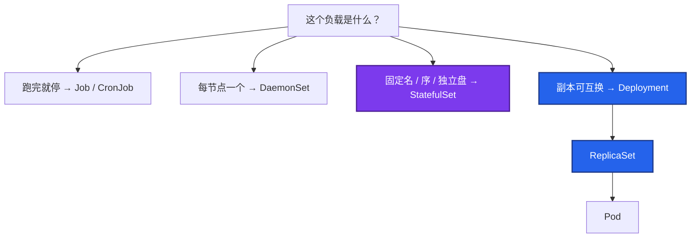
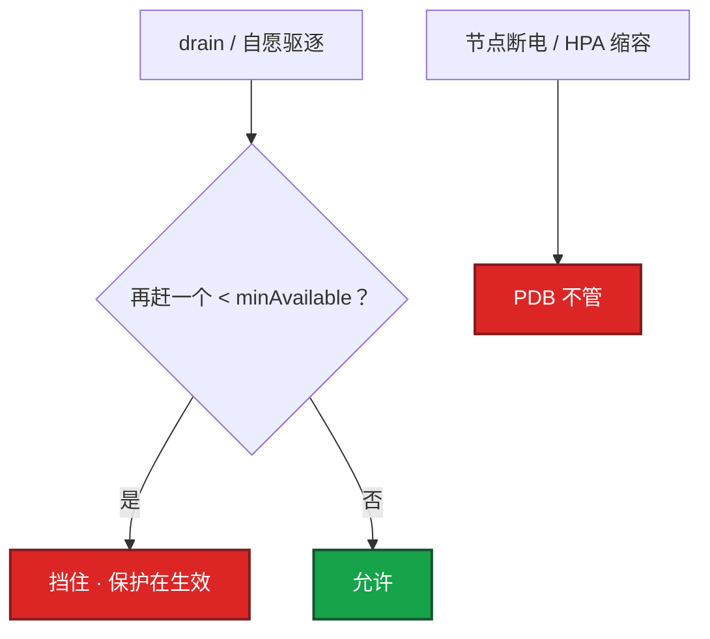
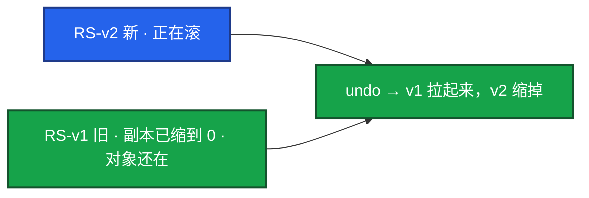
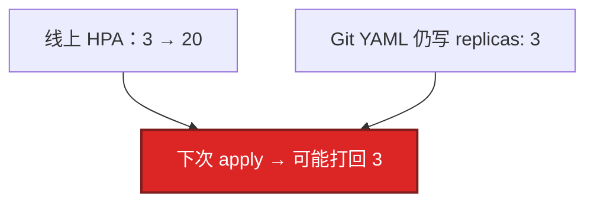

# 05｜工作负载控制器 · 练习题

先对照 [知识点](知识点.md) **本章主线** 自己口述，再对答案。每题标了覆盖范围：

| 标记 | 含义 |
|------|------|
| **核心** | 不懂整章就没建立起来 |
| **必会** | 值班和面试都要能讲 |
| **常用** | 线上会反复碰到 |
| **常考** | 白板和追问的高频口径 |

## 本题目录

- [Q1 Deploy / STS / DS / Job 怎么选](#q1)
- [Q2 maxSurge / maxUnavailable](#q2)
- [Q3 PDB / drain](#q3)
- [Q4 STS 身份和盘 / 游戏服乱滚](#q4)
- [Q5 回滚原理](#q5)
- [Q6 DaemonSet 污点](#q6)
- [Q7 Job / CronJob / etcd](#q7)
- [Q8 Recreate / 战斗服 Deploy](#q8)
- [Q9 HPA 和 YAML 抢 replicas](#q9)
- [Q10 Sidecar / 单副本 PDB](#q10)
- [合上书](#合上书)

---

## Q1

**★★★★★｜Deploy / STS / DS / Job 怎么选？为什么不直接用 ReplicaSet？**

**覆盖**：核心 · 必会 · 常考
**对应**：知识点 §3.1 Deploy / STS / DS / Job

### 场景

要上大厅、战斗区服、节点日志、夜间备份。有人全写成 Deployment。另一边有人手建 ReplicaSet。

### 完整解答

**一句话**：可互换用 Deployment，固定名/独立盘用 StatefulSet，每节点一个用 DaemonSet，跑完就停用 Job。

先画选择，再点名场景。控制器只 Reconcile，不起容器。

大厅、匹配、HTTP 用 Deploy。MySQL/Kafka、要 `xxx-0` DNS 的用 STS。日志/CNI 用 DS。备份用 CronJob。游戏房间服：身份固定用 STS，但滚动仍会杀进程，要业务配合。**禁止当 Web 默认滚。**

### 再追问

- 为什么不直接用 RS？——没有滚动策略和 revision 历史，回滚和发布都弱。Deploy 就是在 RS 上面加了这两样。

---

## Q2

**★★★★★｜maxSurge / maxUnavailable 怎么配才零停机？滚动卡住第一件事？**

**覆盖**：核心 · 必会 · 常用
**对应**：知识点 §3.2 Deployment 滚动

### 场景

要零停机发网关。节点资源紧，有人写成 surge=0, unavailable=1。上线后有缺口。另一边新版本探针不过，滚动停住。

### 完整解答

**一句话**：零停机：`maxUnavailable: 0` + `maxSurge` + readiness；卡住看新 Pod 探针，不会自动 undo。

每步都等 Ready（+ minReadySeconds）。必须有 readiness；镜像固定 tag。零停机：`maxUnavailable: 0` + `maxSurge: 1`（或百分比）+ readiness。大副本用 25%/25% 加速。`revisionHistoryLimit=0` 会没法 undo。

滚动卡住：`rollout status` + describe 新 Pod。业务止血用 `rollout undo`，再查探针/镜像/资源。`ProgressDeadlineExceeded` **不会自动 undo**。

### 再追问

- maxUnavailable=0 还 502？——探针/grace/摘流的问题，不是滚动公式 alone。没有 readiness，新 Pod 一 Running 就进 Service。见 04、15。

---

## Q3

**★★★★★｜PDB 是什么？drain 被挡住怎么办？能防机器宕机吗？**

**覆盖**：核心 · 必会 · 常考
**对应**：知识点 §3.4 PDB

### 场景

要腾空节点做硬件维护，`kubectl drain` 卡住。有人准备删 PDB。单副本战斗服配了 `minAvailable: 1`。

### 完整解答

**一句话**：PDB 只拦自愿中断（drain）；节点宕机、OOM、HPA 改副本都不在 PDB 管辖内。

自愿中断时保证最少可用副本。drain 会尊重它。节点宕机、OOM、HPA 改副本 **不管**。

挡住：先 `kubectl get pdb -A`，看是不是保护生效。扩容或等迁移，不要上来删 PDB。和 HPA：`minReplicas` ≥ `minAvailable`，否则永远赶不走。

单副本 + `minAvailable: 1` = 这个 Pod 赶不走——对单进程区服这是提醒你先迁玩家，不是坏了。

### 再追问

- PDB 能保证 2 个副本永远在？——不能保证宕机。两台节点一起挂，PDB 无能为力。也不挡 HPA 直接改 replicas（07）。

---

## Q4

**★★★★★｜StatefulSet 的身份和盘有什么保证？游戏服上 STS 就能随便滚吗？**

**覆盖**：核心 · 必会 · 常考
**对应**：知识点 §3.3 StatefulSet

### 场景

战斗区服用 STS，以为「有状态控制器」等于可以无脑滚动。发版时 `xxx-0` 被换掉，本服玩家全掉。

### 完整解答

**一句话**：STS 保证名/序/盘/DNS，但有序滚动仍会杀进程——不解决内存里的对局状态。

扩容慢是因为要等前一个 Ready。不能跳号修 2 而 0 是坏的。停在 0/1 先修 ordinal-0。

**游戏服上 STS 不能随便滚。** 有序替换仍然杀 `xxx-0` 进程。STS 解决身份和盘，不解决内存状态。滚动前停匹配、等对局或热迁。区服可用 OnDelete，避免控制器自己杀。

### 再追问

- 删了 STS 云盘还在？——预期。Retain 要人删 PVC/云盘。不要当成泄漏就去盘清，先确认是不是还要数据。

---

## Q5

**★★★★☆｜回滚原理是什么？只 undo Deploy 一定够吗？**

**覆盖**：必会 · 常用
**对应**：知识点 §3.2 回滚

### 场景

新镜像有 bug，`rollout undo`。配置是一起改过的 ConfigMap。回滚后还是坏的。`revisionHistoryLimit: 0`。

### 完整解答

**一句话**：undo 拉回旧 ReplicaSet；Config/Secret 若已改坏，只 undo Deploy 不够。

旧 RS 还在（靠 `revisionHistoryLimit`）。undo 把旧 template 的 RS 拉起来、新的缩掉。

`rollout history` 看版本。limit=0 无法回滚。Config/Secret 若已改成坏值，只 undo Deploy 不够，要一起回（12、15）。

### 再追问

- ProgressDeadlineExceeded 会自动回滚吗？——不会。deadline 内没达到就绪副本，滚动失败，要人 undo 或修新 Pod。默认约 10 分钟。镜像拉不下、探针永远失败最常见。开服窗口别把 deadline 设太短。

---

## Q6

**★★★★☆｜DaemonSet 上不了控制面节点？更新 DS 要注意什么？**

**覆盖**：必会 · 常用
**对应**：知识点 §3.5 DaemonSet

### 场景

CNI 的 DS 在 worker 有、control-plane 没有。kube-proxy 更新时 `maxUnavailable` 太大，一部分节点网络代理一起没了。

### 完整解答

**一句话**：控制面有污点，CNI/kube-proxy 的 DS 必须 toleration 才能上所有节点。

控制面有污点，DS 要 toleration（常 `operator: Exists`）。CNI、kube-proxy 必须能上所有节点。

更新 DS 一次 maxUnavailable 太大，会把网络代理集体踢掉——规则不更新，表现像 08 的 kube-proxy 挂了：存量连接可能还在，新连接和滚动后的新 Pod 会出问题。

缺节点：查污点、选择器、资源，不要先删 DS。

### 再追问

- DS 和 Deploy 都能「每节点一个」吗？——不要用 Deploy + 副本数=节点数模拟。节点增减不会自动对齐，调度也不保证一节点一个。每节点一个就是 DS。

---

## Q7

**★★★★☆｜Job 和 CronJob 失败怎么看？会灌满 etcd 吗？**

**覆盖**：必会 · 常用
**对应**：知识点 §3.5 Job

### 场景

夜间备份 Job Failed。Completed Pod 堆了几千个。etcd 开始报空间。

### 完整解答

**一句话**：Completed Pod 堆积会灌 etcd；备份 Job 用 Forbid + `ttlSecondsAfterFinished`。

`backoffLimit` 用尽就 Failed。看对应 Pod `logs`。CronJob 看 `lastScheduleTime` 和 `concurrencyPolicy`。

备份用 Forbid，不要叠罗汉。`activeDeadlineSeconds` 防跑飞。Completed Pod 堆积会灌 etcd（02），要 `ttlSecondsAfterFinished`。表现是 API 写失败，不像业务 OOM。

### 再追问

- 长时间迁移能塞 Init 容器吗？——不能。Init 失败整个 Pod 起不来。长时间/可失败重试用 Job（04）。

---

## Q8

**★★★★☆｜Recreate 和 RollingUpdate 何时用？战斗服用 Deploy 滚可以吗？**

**覆盖**：必会 · 常考
**对应**：知识点 §3.2 滚动策略

### 场景

协议不兼容，新旧逻辑服不能同时在线。有人仍用默认 RollingUpdate。另一边房间服直接 Deploy 滚。

### 完整解答

**一句话**：协议不兼容用 Recreate 或蓝绿；房间绑内存的战斗服不能当 Deploy 默认滚。

Rolling 默认，适合可互换、可双版本短暂并存。不能双版本并存（独占锁、不兼容协议）才 Recreate——会中断。游戏热更若新旧协议不能同时在线，Recreate 或蓝绿切流（15），并接受中断窗口。

房间绑内存的战斗服：进程不可互换，**不能当 Web 用 Deploy 默认滚**。身份固定用 STS 或自研；滚动仍要业务停匹配/热迁。换 STS 也不等于可以无脑滚。

### 再追问

- 副本可互换的大厅呢？——可以 Deploy + unavailable=0 + readiness + PDB。和战斗服拆开选控制器，不要一套 YAML 打天下。

---

## Q9

**★★★☆☆｜Deployment 的 replicas 被 HPA 改了，下次 apply 会怎样？**

**覆盖**：必会 · 常用
**对应**：知识点 §3.6 replicas 与 HPA

### 场景

HPA 已扩到 20。流水线再 apply 一份 `replicas: 3` 的 YAML。活动中途副本被打回 3。

### 完整解答

**一句话**：HPA 和 Git 抢同一个 `replicas` 字段；应急 scale 当天必须补回声明。

HPA 和 Git 抢同一个字段（对齐 01、07）：

YAML 里不要写死 replicas 当唯一真相，或用 SSA FieldManager 让 HPA 管这个字段。应急 scale 可以，当天补回声明。常见「扩容完又缩回去」。

### 再追问

- PDB 能挡住这次打回吗？——不能。apply / HPA 改 replicas 不是自愿中断那条路。要在 Git 和 HPA 的字段归属上解，不是加一个 PDB。

---

## Q10

**★★★☆☆｜1.28 原生 Sidecar 解决了什么？drain 单副本战斗服为什么卡死是好事？**

**覆盖**：常用 · 常考
**对应**：知识点 §3.6 Sidecar · §3.4 PDB

### 场景

代理容器比主容器先退出，主容器起来时代理还没 Ready。另一边 drain 战斗服节点完全不动。

### 完整解答

**一句话**：1.28+ 原生 sidecar 保证时序；单副本 PDB 卡 drain 是保护，不是故障。

1.28 之前 sidecar 靠 Init hack，可能抢跑或提前退出。1.28+ 在 `initContainers` 里加 `restartPolicy: Always`，kubelet 保证 sidecar Ready 后才起主容器，主容器退出时也等 sidecar 收尾。网格/日志 sidecar 都吃这套时序。

单副本 + PDB `minAvailable: 1` 让 drain 卡死：**这是保护**，提醒你先迁玩家再放行。删 PDB 把正在打的局赶走，才是事故。有状态单副本不要幻想 PDB 能防宕机，要热备或接受该服不可用。

### 再追问

- Descheduler 会不会被 PDB 拦住？——会，和拦 drain 一样，都是自愿中断。战斗服不要让再平衡器随便迁。见 06。

---

## 合上书

- [ ] 能按可互换 / 固定身份 / 每节点 / 跑完就停选出控制器，并说明不手建 RS
- [ ] 能配零停机 unavailable=0 + surge + readiness；卡住会 undo，deadline 不会自动回滚
- [ ] 能说出 STS 保证名/序/盘/DNS，滚动仍杀进程；房间服不能当 Deploy 默认滚
- [ ] 能说明 PDB 只拦自愿中断；单副本 minAvailable=1 卡 drain 是保护
- [ ] 能处理 DS 污点、Job TTL、HPA 和 YAML 抢 replicas
- [ ] 能说出原生 sidecar 时序；Descheduler 也被 PDB 拦
