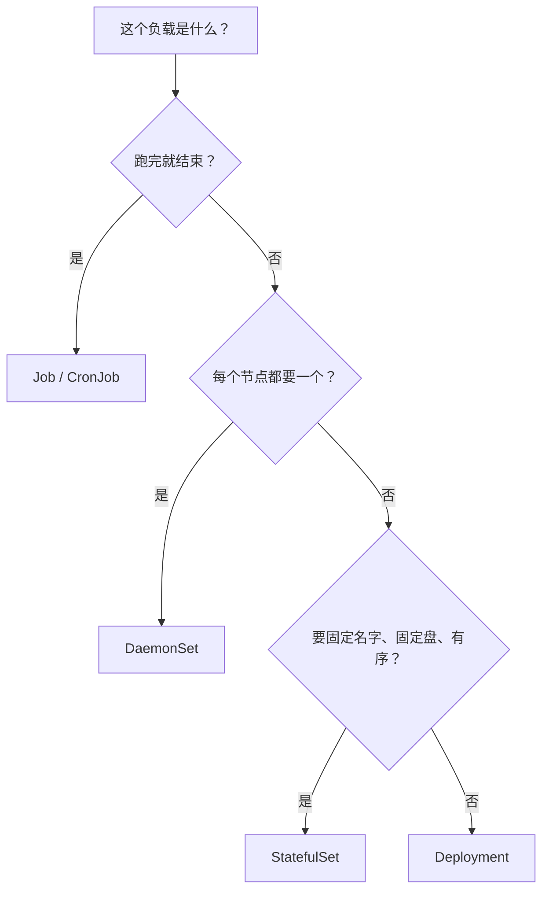
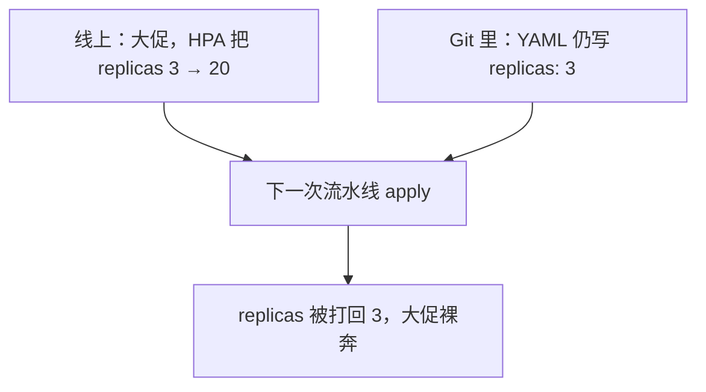

# 05｜工作负载控制器 · 练习题

先合上知识点，对着 **一节的主图** 把「一次发布的一生」口述一遍——apply → 新 RS 出生 → 新 Pod 逐个 Ready → 旧 Pod 退场 → 旧 RS 缩 0，再标出 pause、deadline、undo、PDB 四个岔口。讲得出来再做题。

| 标记 | 含义 |
|------|------|
| **核心** | 不懂整章就没建立起来 |
| **必会** | 值班和面试都要能讲 |
| **常用** | 线上会反复碰到 |
| **常考** | 白板和追问的高频口径 |

## 本题目录

- [Q1 登录服、网关、战斗服、日志采集，各选什么控制器](#q1)
- [Q2 零停机怎么配 maxSurge / maxUnavailable](#q2)
- [Q3 滚动卡在 50% 半小时，会自动回滚吗](#q3)
- [Q4 rollout pause 有什么用](#q4)
- [Q5 回滚的原理是什么，undo 一定够吗](#q5)
- [Q6 StatefulSet 保证什么，战斗服能随便滚吗](#q6)
- [Q7 PDB 到底拦什么，drain 卡死怎么办](#q7)
- [Q8 日志采集为什么是 DaemonSet，新节点没起来查什么](#q8)
- [Q9 Job 失败怎么查，Completed 堆着会怎样](#q9)
- [Q10 Recreate 和 RollingUpdate 怎么选](#q10)
- [Q11 HPA 把 replicas 扩到 20，下次 apply 会发生什么](#q11)
- [Q12 对象是 Helm 管的，我应急 kubectl edit 会怎样](#q12)
- [Q13 1.28 的原生 Sidecar 怎么保证时序](#q13)
- [Q14 60 秒发布卡死定责](#q14)
- [合上书](#合上书)

---

## Q1

**★★★★★｜「登录服、网关、战斗服、日志采集，这四样你都怎么部署？为什么不直接建 ReplicaSet？」**

**覆盖**：核心 · 必会 · 常考 ｜ **对应**：知识点 [二、选型：哪个控制器管这份负载](知识点.md)

### 场景

新项目立项，有人递来一份「全家桶 YAML」：所有服务都是 Deployment，战斗服也是；日志采集用 Deployment 副本数写死成节点数。你看出几处会出事，得在评审会上讲清楚。

### 完整解答

> 🎯 **一句话**：选型看「期望状态怎么写」——可互换、固定身份、每节点一个、跑完就停，四种写法对应四类控制器。

所有控制器干同一件事：**Reconcile（调和）**——读期望、看实际、补差。差别只在期望的定义：

- **登录服、网关、大厅、匹配** → Deployment：副本可互换，谁在岗无所谓。网关有长连接但副本仍可互换，配 PDB、慢速滚动。
- **战斗服** → StatefulSet 或自研调度：房间绑在进程内存里，副本**不可互换**，默认滚动一启动就杀对局。用 STS 也要 OnDelete + 先停匹配，或干脆自研。
- **日志采集/监控** → DaemonSet：每节点恰好一个，节点增减自动对齐。
- **合服备份、数据迁移** → CronJob（Forbid）+ Job（TTL）。

Deployment 内部为每个模板版本建一个 **ReplicaSet** 并记 **revision**，滚动 = 新 RS 放大、旧 RS 缩小，回滚 = 把旧 RS 拉回来。**手工建 RS** 没有这层管理：没有滚动策略、没有版本历史，`rollout undo` 用不了。



> 📝 **面试**：先答四种期望状态，再落到游戏负载，最后补一句「不手建 ReplicaSet，没有 revision 就回不了滚」。

### 再追问

1. 「控制器挂了，正在跑的 Pod 会死吗？」——不会。控制器只 Reconcile API 对象，容器是节点上的 kubelet 拉的；控制器（都在 kube-controller-manager 里，多副本靠 leader-elect）挂了只是没人补差、没人滚动。不要把「重启控制器」当成业务止血手段。
2. 「战斗服『不可互换』到底不可互换在哪？」——进程内存里有对局状态；名字、盘、连接都可以变，内存里的对局不能变。不要答成「因为要固定 IP」，Pod IP 本来就会变。

---

## Q2

**★★★★★｜「零停机发布怎么配？maxSurge 和 maxUnavailable 是什么关系？」**

**覆盖**：核心 · 必会 · 常考 ｜ **对应**：知识点 [四、滚动：maxSurge 与 maxUnavailable 写的节奏](知识点.md)

### 场景

网关要热更新，同事把 `maxSurge: 0, maxUnavailable: 1` 一交就说「这样省资源」。发版时玩家果然断了一批连接。

### 完整解答

> 🎯 **一句话**：零停机 = `maxUnavailable=0` + `maxSurge≥1` + readiness——先起新、等 Ready、再退旧。

- **maxSurge**：滚动期间最多超出期望副本数多少个——「允许几个新人提前到岗」。
- **maxUnavailable**：滚动期间最多允许几个副本非 Ready——「允许几个老员工先走」。
- 两者不能同时为 0：新旧都不动，滚动原地踏步。

零停机只有一种走法：`maxSurge=1, maxUnavailable=0`——新 Pod Ready 之前，旧的一个不退。代价是要多出 1 个 Pod 的资源余量。省资源的写法（`maxSurge=0, maxUnavailable=1`）是「先杀旧再补新」，滚动全程容量少一个，网关这种入口服务就是断连接。

> ⚠️ **别混**：滚动等的是 **Ready**（readiness 探针通过、能接流量），不是 **Running**（容器进程在跑）。没配 readiness，Running 就算数，新 Pod 端口开了但业务没初始化完就接流量——滚动参数再对也 502。

```bash
kubectl get rs -n prod -l app=gateway
```

```text
gateway-6d9f8b   3   3   3   7d   ← 旧 RS
gateway-7f4c9d   3   3   1   2m   ← 新 RS READY < DESIRED = 卡在新 Pod 没 Ready
```

> 📝 **面试**：「零停机三件套：maxUnavailable=0、maxSurge≥1、readiness 把关；再加 minReadySeconds 防 Ready 两秒就崩的假成功。」

### 再追问

1. 「`maxUnavailable=0` 为什么还会 502？」——滚动参数只管「几个算 Ready」，管不了旧 Pod 退出时摘流量是否同步、grace 够不够（04 章）。不要继续拧滚动参数，去查 preStop、摘流和探针（08 章看 Endpoints）。
2. 「100 副本的服务这么滚太慢怎么办？」——用百分比 `maxSurge: 25%, maxUnavailable: 25%` 加大批次，但入口服务的底线仍是 `maxUnavailable=0`。不要为了快把 unavailable 放开。

---

## Q3

**★★★★☆｜「发版滚动卡在 50% 半小时了，K8s 会自动回滚吗？你第一刀砍在哪？」**

**覆盖**：必会 · 常考 ｜ **对应**：知识点 [四、滚动：maxSurge 与 maxUnavailable 写的节奏](知识点.md)

### 场景

大厅 `hall:1.2 → 1.3`，`rollout status` 卡住。有人开始 `kubectl delete pod` 删新 Pod「让它重建一下」，删了三次，卡得一模一样。

### 完整解答

> 🎯 **一句话**：不会自动回滚——deadline 只把 Deployment 标记成 Failed，止血要人工 `rollout undo`。

第一刀砍新不砍旧：滚动卡住 = 新 Pod 一直不 Ready（此时旧 Pod 还没开始退，线上通常没掉）。删新 Pod 是无效操作——ReplicaSet 的调和循环立刻重建一个一模一样的，同样的镜像同样的探针，照样不过。

```bash
kubectl rollout status deploy/hall -n prod --timeout=120s
```

```text
Waiting for deployment "hall" rollout to finish: 1 out of 3 new replicas have been updated...
error: timed out waiting for the condition        ← 进度停在 1/3
```

```bash
kubectl get rs -n prod -l app=hall
kubectl describe po hall-9a2b1c-xk9m2 -n prod | tail -15
```

```text
hall-7d8f9c   2   2   2   2h    ← 旧 RS 还撑着，服务没全掉
hall-9a2b1c   1   1   0   5m    ← 新 RS READY 0 = 战场在这
Warning  Unhealthy  Readiness probe failed: HTTP probe failed with statuscode: 503
Warning  BackOff    Back-off restarting failed container    ← 新版本自己起不来
```

处理分两步：业务等不起 → `kubectl rollout undo deploy/hall` 先止血，事后再查根因（这例是新版本 503：配置、依赖、镜像）；等得起 → 修新 Pod 让它自己走下去。**progressDeadlineSeconds**（默认 600 秒）到了只写 `ProgressDeadlineExceeded` 状态，不会替你回滚；发布处于 pause 状态时这个计时还会暂停。

> 📝 **面试**：「先看新 RS 的 READY，describe 新 Pod 找探针/镜像/资源问题；超时不会自动回滚，要人工 undo。」

### 再追问

1. 「没人管的话它会一直卡着吗？」——会一直卡在新旧共存，但 Deployment 对象被标记 Failed；监控应按 `ProgressDeadlineExceeded` 告警。不要指望它自己恢复或自己回滚。
2. 「开服窗口镜像拉得慢，常被判 Failed 怎么办？」——调大 progressDeadlineSeconds 或提前预热镜像。不要为了「看起来快」把 deadline 调短，正常发布也会被误判。

---

## Q4

**★★★☆☆｜「rollout pause / resume 有什么用？生产上什么时候按暂停？」**

**覆盖**：常用 · 常考 ｜ **对应**：知识点 [五、停与退：pause、resume、rollback](知识点.md)

### 场景

一次网关发布要同时改镜像、改 resources、改环境变量，同事改一样 apply 一次，玩家一小时被滚了三轮。另一次新版本上线心里没底，想先看一批流量再放行。

### 完整解答

> 🎯 **一句话**：pause 是人控节奏——金丝雀观察用一次，合并多次变更用一次。

两个用途：

1. **金丝雀窗口**：滚动先走一批，`kubectl rollout pause deploy/gateway` 停住，盯错误率、日志、对局成功率；没问题 `resume` 走完，有问题 `undo` 回滚。这是不用额外工具的最简灰度（完整体系 → [16](../16-灰度与回滚/)）。
2. **合并变更**：先 pause，连续改镜像/资源/环境变量，最后一次 resume——暂停期间的变更攒在一起，只滚一轮。不 pause 的话，每次 apply 都触发一轮滚动。

```bash
kubectl rollout pause deploy/gateway -n prod
kubectl rollout resume deploy/gateway -n prod
```

```text
deployment.apps/gateway paused
deployment.apps/gateway resumed     ← 攒的变更一次滚出去
```

> ⚠️ **别混**：pause 是主动的，`rollout status` 会显示 paused，resume 就继续；`ProgressDeadlineExceeded` 是滚动自己走不动了。暂停期间 deadline 计时暂停——「暂停太久被超时」不会发生。不要把「忘了 resume」当成故障去查。

### 再追问

1. 「暂停状态下还能改配置吗？」——能，这正是「合并变更」的用法，改完一起滚。不要以为暂停了就冻结了、改不动。
2. 「灰度为什么不只用 pause，还要上 Argo Rollouts？」——pause 只能按批次粗粒度停，没有指标自动分析、没有自动回滚，按流量比例切分要靠 Service/Mesh（15、16 章）。不要在 pause 上堆自动化脚本造轮子。

---

## Q5

**★★★★☆｜「回滚的原理是什么？只回滚 Deployment 一定够吗？」**

**覆盖**：必会 · 常考 ｜ **对应**：知识点 [五、停与退：pause、resume、rollback](知识点.md)

### 场景

新版本发坏了，值班 `rollout undo` 之后业务还是报错——这次发布连 ConfigMap 一起改了，新配置和回滚后的旧镜像不兼容。

### 完整解答

> 🎯 **一句话**：每个模板版本一个 RS 一个 revision，undo 是把旧 RS 重新放大——不是时间倒流。

```bash
kubectl rollout history deploy/gateway -n prod
```

```text
REVISION  CHANGE-CAUSE
2         kubectl set image deploy/gateway gateway=gateway:1.9.2
3         kubectl set image deploy/gateway gateway=gateway:1.9.3   ← 发坏的
```

```bash
kubectl rollout undo deploy/gateway -n prod --to-revision=2
```

```text
deployment.apps/gateway rolled back     ← revision 2 的 RS 放大，revision 3 的缩 0
```

机制细节三条：

- undo 本身又产生**新的 revision**（回滚后下一个版本号是 4，内容等于 2）——历史只增不减。
- 两条路会把回滚走死：**镜像用 `latest`**（滚回来的还是 latest，各节点还可能拉到不一样的镜像）；**`revisionHistoryLimit: 0`**（旧 RS 用完即删，没有存档，默认保留 10 个）。
- **只回滚 Deployment 不一定够**：同批发布如果连 ConfigMap/Secret 一起改坏，光回镜像没用，要一起回（[12](../12-配置与密钥/)、[16](../16-灰度与回滚/)）。

> 📝 **面试**：「回滚 = 放大旧 revision 的 RS，所以 revisionHistoryLimit=0 和 latest 镜像都让回滚失效；undo 产生新 revision，历史只增不减；配置一起改坏的要一起回。」

### 再追问

1. 「ProgressDeadlineExceeded 了为什么不自己回滚？」——deadline 只是把 Deployment 标记 Failed 的观测信号，K8s 把决策留给人（也许你想前进而不是后退）。不要配「超时自动 undo」的土法脚本替代流程。
2. 「这个对象是 Helm 发的，还能用 rollout undo 吗？」——不建议。undo 绕过 Helm 账本，下次 `helm upgrade` 会把手动回滚冲掉；Helm 对象用 `helm rollback`（见 Q12）。不要两套回滚入口混着用。

---

## Q6

**★★★★★｜「StatefulSet 到底保证什么？战斗服上了 STS 就能随便滚了吗？」**

**覆盖**：核心 · 必会 · 常考 ｜ **对应**：知识点 [二、选型：哪个控制器管这份负载](知识点.md)

### 场景

团队把战斗服从 Deployment 迁到 StatefulSet，发版时直接默认滚动，三百个对局还是全掉了。有人说「都上 STS 了怎么还掉」。

### 完整解答

> 🎯 **一句话**：STS 保证身份和盘（名/序/盘/DNS），不保证进程不被杀，更不保证内存里的对局。

保证的四件，都围绕身份稳定：

1. **固定名字**：`battle-0..N-1`（序号叫 ordinal），重建后名字不变；
2. **有序创建删除**：0 Ready 才建 1；删除从最大序号倒着来；
3. **稳定 DNS**：`battle-0.headless-svc.ns.svc.cluster.local`，要配 **Headless Service**（ClusterIP=None，不做负载均衡，只给每个 Pod 解析名字）；
4. **稳定磁盘**：volumeClaimTemplates 每序号一块 PVC，重建挂回原盘；删 STS 默认**不删 PVC**（Retain，防误删，不是泄漏）。

不保证的两件：RollingUpdate **照样杀进程**（只是按序号倒着、有秩序地杀）；**内存状态**——对局在进程内存里，Pod 一死就蒸发，STS 救不回。

所以战斗服发版是流程问题不是控制器问题：`OnDelete` 策略 + 发版前停匹配（不再开新对局）→ 等存量对局打完或热迁 → 再逐个删 Pod；灰度用 `partition`（只滚序号 ≥ partition，验完改回 0，忘了改回低序号永远不滚）。

> ⚠️ **别混**：「有序」不等于「不杀」。把「换了 STS」当成「可以无脑滚」是事故的开始。

### 再追问

1. 「STS 滚动为什么从最大序号倒着删？」——为数据一致性设计（副本集先动 follower）；对游戏服这没有额外保护，别把它当安全垫。不要因此以为「序号小的永远最后死所以最安全」。
2. 「mysql-0 CrashLoop，STS 显示 0/3，能先修 mysql-2 吗？」——不能，也没得修：0 不 Ready，1 和 2 根本不会被创建。先修 ordinal-0（镜像/配置/盘），它起来后面才动。不要手动去建高序号 Pod、不要跳号。

---

## Q7

**★★★★★｜「PDB 到底拦什么？drain 卡死了怎么办？能防节点宕机吗？」**

**覆盖**：核心 · 必会 · 常考 ｜ **对应**：知识点 [六、保护：PDB 拦的是自愿中断](知识点.md)

### 场景

维护要 drain 网关节点，命令卡了四十分钟，值班急了要 `kubectl delete pdb` 硬赶。另一个同事问「配了 PDB 是不是机器挂了也不会掉副本」。

### 完整解答

> 🎯 **一句话**：PDB 只拦自愿中断（drain、驱逐、Descheduler）；宕机不拦，HPA 改 replicas 也不拦。

**PodDisruptionBudget（PDB）** 给一组 Pod 挂底线：`minAvailable`（至少保几个可用）或 `maxUnavailable`（最多允许几个不可用），二选一。**自愿中断** = 人或系统主动通过 API 发起的中断，这类动作会先来问 PDB「还能不能再少一个」，不能就拒绝：

```bash
kubectl drain node-gw-01 --ignore-daemonsets --delete-emptydir-data
```

```text
error when evicting pods/"gateway-7f4c9d-abc12" (will retry after 5s):
Cannot evict pod as it would violate the pod's disruption budget.   ← 保护生效
```

```bash
kubectl get pdb -n prod
```

```text
NAME          MIN AVAILABLE   MAX UNAVAILABLE   ALLOWED DISRUPTIONS   AGE
gateway-pdb   2               N/A               0                     30d   ← 0 = 谁也不许再动
```

drain 卡死的正确处理：看 `ALLOWED DISRUPTIONS` 为什么是 0——通常是可用副本只剩底线，先扩容或先迁流量，等余量出来再赶；**不要删 PDB**。

不拦的清单：节点宕机/断电/内核崩溃（非自愿，没有 API 来问）；容器 OOMKilled；**HPA 直接改 replicas**、apply 把副本打回——这些不走驱逐，不经 PDB。另外 PDB 按 **Ready** 计数：没配 readiness 时按 Running 数，三个 Running 里一个其实接不了流量，驱逐照样放行。

> 📝 **面试**：「PDB 只拦自愿中断；drain 卡住先 get pdb 看 ALLOWED DISRUPTIONS；它不防宕机，也不拦 HPA。」

### 再追问

1. 「单副本服务配了 `minAvailable=1`，drain 永远卡死，这是 bug 吗？」——不是，是保护在提醒「这台上有活，先迁玩家/流量」。先扩容到 2 或停掉这台的服务入口再迁。不要删 PDB、不要强杀。
2. 「Descheduler 重平衡、节点缩容会被 PDB 拦吗？」——会，两者都走自愿驱逐路径，遵守 PDB。真绕过 PDB 的是宕机这类非自愿中断，不是自动组件。
3. 「HPA 的 minReplicas 比 PDB 的 minAvailable 小会怎样？」——HPA 缩容不走驱逐、不受 PDB 约束，缩下去后余量永远不够，drain 一直卡。配 PDB 先核对这条（[07](../07-弹性伸缩/)）。

---

## Q8

**★★★★☆｜「日志采集为什么用 DaemonSet？新节点上没采集器怎么查？」**

**覆盖**：必会 · 常用 ｜ **对应**：知识点 [二、选型：哪个控制器管这份负载](知识点.md)

### 场景

新扩的战斗节点没日志，有人建议「把采集器 Deployment 副本数改成节点数」；另一套集群的 DaemonSet 在控制面节点上也没跑。

### 完整解答

> 🎯 **一句话**：每节点恰好一个只有 DaemonSet 做得到；缺节点先查污点与 toleration。

DaemonSet 的期望是「每个节点一个」，节点加入自动补、移除自动收。Deployment 副本数=节点数是伪方案：Scheduler 随机放，同节点可能挤两三个、新节点一个没有，节点增减永远对不齐——这正是「新节点没采集器」的根因之一。

某节点没起来，按序三查：

```bash
kubectl describe node node-battle-03 | grep Taints
kubectl describe ds log-agent -n kube-system | grep -A8 Tolerations
```

```text
Taints:  pool=battle:NoSchedule        ← 节点池打了污点
# DS 模板里没有对应 toleration → 调度不上去
```

1. **污点与容忍**：`pool=battle:NoSchedule` 要有对应 toleration；控制面节点同理——CNI、kube-proxy 要容忍 `node-role.kubernetes.io/control-plane` 污点。
2. **nodeSelector / 亲和** 是否排除了该节点。
3. **资源**是否放不下。

### 再追问

1. 「DS 滚动更新要注意什么？」——DS 的 RollingUpdate 也有 `maxUnavailable`；kube-proxy、CNI 这类网络平面的 DS 一次放倒太多节点，集群网络成批断（[08](../08-Service与kube-proxy/)）。不要对系统组件 DS 用大 maxUnavailable 赶进度。
2. 「日志采集用 DS 还是 sidecar？」——节点级采集（容器运行时日志）用 DS，一节点一份成本低；业务需要按应用切割、独立生命周期的才用 sidecar（[20](../20-日志管理/)）。不要给每个 Pod 塞采集 sidecar 替代节点级采集，成本翻几十倍。

---

## Q9

**★★★★☆｜「备份 Job 失败了怎么查？Completed 的 Job 堆着不管会怎样？」**

**覆盖**：必会 · 常用 ｜ **对应**：知识点 [二、选型：哪个控制器管这份负载](知识点.md)

### 场景

合服备份半夜失败没人知道；另一集群 API 越来越慢，一查八百多个 Completed 的 Job 对象，etcd 数据量告警。

### 完整解答

> 🎯 **一句话**：Job 失败看 backoffLimit 和对应 Pod 日志；Completed 必须配 `ttlSecondsAfterFinished`，不然灌爆 etcd。

Job 失败链路：容器失败 → 按 **backoffLimit**（默认 6）重试 → 用尽后 Job 变 **Failed**（不是无限重试）。排查入口是它的 Pod：

```bash
kubectl get jobs -n ops
kubectl logs job/merge-backup-28 -n ops
```

```text
NAME                COMPLETIONS   DURATION   AGE
merge-backup-28     0/1           42m        1h    ← 0/1 = 还没成功过一次，看日志找原因
```

**Completed 堆积**：跑完的 Job 对象不会自删，几百个 Completed Pod 挂在 etcd 里，API 每次 list 都拖一遍，越滚越慢（[02](../02-etcd/)）。`ttlSecondsAfterFinished` 让完成的 Job 到期自清，**必配**。

**CronJob** 两个参数：`concurrencyPolicy: Forbid`——上一次没跑完不起新的（备份必用，防两个备份同时跑锁库/叠罗汉）；`activeDeadlineSeconds` 防单次跑飞。

> ⚠️ **别混**：长时间、可能失败的迁移不要塞进业务 Pod 的 Init 容器——Init 失败整个 Pod 起不来，还跟着重启循环走（[04](../04-Pod生命周期/)）。迁移就是 Job。

### 再追问

1. 「Allow 和 Replace 什么时候用？」——Allow（默认）容忍叠加，适合幂等轻量任务；Replace 杀旧起新，适合「只要最新一次」的刷新任务。备份不要用 Allow。
2. 「Job 能当常驻服务用吗？」——不能，它跑成功就退出；当常驻用会不断重建退出循环。常驻回 Deployment/STS。不要把「重启次数多」当成 Job 失败来排。

---

## Q10

**★★★☆☆｜「Recreate 和 RollingUpdate 怎么选？战斗服能用 Deployment 滚吗？」**

**覆盖**：常考 ｜ **对应**：知识点 [四、滚动：maxSurge 与 maxUnavailable 写的节奏](知识点.md)

### 场景

协议升大版本，新旧客户端互不兼容。有人提议「反正都要发，用默认滚动慢慢来」；另一个项目里，战斗服就是 Deployment 默认滚，发版当天对局全掉。

### 完整解答

> 🎯 **一句话**：新旧能并存用 RollingUpdate，不能并存用 Recreate（接受中断）；战斗服两个都不行，用 OnDelete/自研。

- **RollingUpdate**：逐步替换，新旧短暂共存——前提是新旧版本能同时在线（协议兼容、数据格式兼容）。
- **Recreate**：旧的全杀完再起新的——用于新旧**互不兼容**（旧客户端连新服就崩），代价是全员中断窗口；能并存又想零切换的，用蓝绿切流（[16](../16-灰度与回滚/)）。
- **OnDelete**（STS/DS）：你删 Pod 它才重建，什么时候动由业务定。

战斗服的问题不在策略在负载：对局绑在进程内存，副本不可互换——Deployment 默认滚动会随机杀正在开房的进程，还会把新 Pod 漂到别的节点。正确做法：STS（或自研调度）+ 发版前停匹配 + 存量对局自然结束/热迁后再删 Pod。

> 📝 **面试**：「Recreate 只用于协议不兼容、并跑就错的场景，它有中断窗口；战斗服连 RollingUpdate 都不行，因为房间在内存里。」

### 再追问

1. 「Recreate 的中断窗口能缩短吗？」——不能缩到零，这是策略定义；要零切换只能换蓝绿/金丝雀（[16](../16-灰度与回滚/)）。不要在 Recreate 上纠结参数调优。
2. 「为什么不用 Deployment + 停匹配来发战斗服？」——Deployment 的滚动不按业务顺序控制（哪个房先空、哪个后删），也保不住身份；至少用 STS + OnDelete 把删除时机拿回手里。不要让控制器替你决定杀哪个对局。

---

## Q11

**★★★☆☆｜「HPA 把 replicas 扩到 20 扛大促，流水线把 Git 里 `replicas: 3` 的 YAML apply 下去，会发生什么？」**

**覆盖**：常用 · 常考 ｜ **对应**：知识点 [七、归属：这个对象归谁管](知识点.md)

### 场景

大促前 HPA 把网关扩到 20。第二天有人照常发版，apply 的 YAML 里写着 `replicas: 3`，副本瞬间掉回 3，入口打满。

### 完整解答

> 🎯 **一句话**：副本被打回 3——HPA 改的是活状态，Git 的期望没变，声明式对账按期望执行。

这正是声明式系统的「归属」问题：谁写 replicas，谁就是这个字段的属主。HPA 把 20 写进活对象，但 Git YAML 的期望仍是 3，下一次 apply 的客户端对账会把活状态拉回期望。**PDB 挡不住这次打回**——打回不是驱逐，是直接改 replicas。



三种解法：① replicas 交给 HPA 管，**Git 里不写死这个字段**（最常用）；② 用 **SSA（server-side apply）** 的字段属主机制，让 replicas 明确归 HPA 这个 fieldManager，客户端 apply 不碰它；③ 应急 `kubectl scale` 可以，但当天必须把声明补回 Git，否则下一次对账又出事。

### 再追问

1. 「客户端 apply 和 server-side apply 对这种冲突的处理差别？」——客户端 apply 按整对象合并，容易整字段覆盖；SSA 按字段记录属主，冲突时能明确报「这个字段归谁」，`--force-conflicts` 才能强抢。不要在生产脚本里随便加 `--force`。
2. 「PDB 为什么救不了这次？」——PDB 只拦驱逐类自愿中断；apply 改 replicas 是对账路径，不经驱逐。别把 PDB 当万能保险。

---

## Q12

**★★★★☆｜「这个 Deployment 是 Helm 发的，应急时我直接 kubectl edit 改一下，会怎样？回滚该用哪条命令？」**

**覆盖**：必会 · 常考 ｜ **对应**：知识点 [七、归属：这个对象归谁管](知识点.md)

### 场景

Helm 发的网关出了紧急问题，值班直接 `kubectl edit` 改了镜像和副本数。两天后正常 `helm upgrade`，手改的部分要么没了，要么报冲突，release 卡在半路。

### 完整解答

> 🎯 **一句话**：Helm 管的对象真值在 release 账本里——手改活状态，下次 helm upgrade 三方合并时会被冲掉或引发冲突。

`helm upgrade` 做的是「上次渲染的清单、线上活状态、新清单」的**三方合并**。你手改的字段不在 Helm 账本里，合并时要么被新清单覆盖（改动消失），要么与期望冲突导致 upgrade 失败。识别方法：对象上有 `app.kubernetes.io/managed-by: Helm` 标签。

正确入口：改配置就改 values 走 `helm upgrade`；应急回滚用 `helm rollback <release> <revision>`——它回的是整个 release（chart + values），不是单个字段：

```bash
helm history gateway -n prod
```

```text
REVISION  STATUS      CHART          APP VERSION
2         superseded  gateway-1.2.0  1.9.2        ← 旧版本还在账本里
3         deployed    gateway-1.3.0  1.9.3
```

```bash
helm rollback gateway 2 -n prod
```

```text
Rollback was a success! Have fun upgrading!
```

> ⚠️ **别混**：`kubectl rollout undo` 和 `helm rollback` 是两套账——undo 绕过 Helm 直接改 Deployment，Helm 毫不知情，下次 `helm upgrade` 照样把手动回滚冲掉。Helm 对象只用 `helm rollback`。

应急可以手改吗？可以，但把它当临时止血：改完立刻把同样的变更回填到 values 并走一次 `helm upgrade`，让账本追上活状态。不要让手改活过当天。

### 再追问

1. 「GitOps 下（ArgoCD）手改会怎样？」——更狠：self-heal 开着时手改会被直接同步回 Git 状态，「改完就回滚」不是灵异事件。应急要么临时关 sync，要么走 Git 快速通道（[23](../23-GitOps-ArgoCD与Tekton/)）。不要和同步器对改。
2. 「怎么确认这个对象是不是 Helm 管的？」——`kubectl get deploy <name> -o yaml` 看 `app.kubernetes.io/managed-by` 标签和 `meta.helm.sh/release-name` 注解，或 `helm list -A` 对名字。不要在不知道归属的情况下改生产对象。

---

## Q13

**★★★☆☆｜「1.28 的原生 Sidecar 和普通容器、老的 Init 写法有什么区别？时序谁保证？」**

**覆盖**：常用 ｜ **对应**：知识点 [二、选型：哪个控制器管这份负载](知识点.md)

### 场景

大厅给每个 Pod 注入 Envoy 做代理。老写法下偶发 502：主容器先 Ready 开始接流量，Envoy 还没 listen；退出时 Envoy 先死，主容器的收尾请求全丢。

### 完整解答

> 🎯 **一句话**：原生 sidecar = initContainers 里标 `restartPolicy: Always`，kubelet 保证它 Ready 后才启动主容器。

三种写法对比：

- **普通容器**：和主容器同时启动，谁先 Ready 看运气；退出顺序也不保证——就是题目里偶发 502 的原因。
- **老 Init 写法**：Init 容器跑完才轮到主容器，但 sidecar 是常驻进程，「跑完」语义对不上，只能 hack，退出时照样先死。
- **原生（1.28+）**：sidecar 放进 initContainers 并标 `restartPolicy: Always`——kubelet 按序启动，**等 sidecar Ready 再启动主容器**；主容器退出时，等它终止后才停 sidecar。时序由 kubelet 保证。

```bash
kubectl get po hall-xyz -n prod -o jsonpath='{range .spec.initContainers[*]}{.name}{"\t"}{.restartPolicy}{"\n"}{end}'
```

```text
envoy-proxy    Always        ← initContainer + restartPolicy=Always = 原生 sidecar
```

注意原生 sidecar 在 `kubectl get po` 里会一直显示 Running（它不退出），这是正常状态，不是卡住。

### 再追问

1. 「集群还在 1.27，能上原生 sidecar 吗？」——不能，这是 1.28 引入的特性；老集群继续普通容器方案，靠探针和启动脚本兜底。不要硬把新字段写进老集群的 YAML，API 会拒绝。
2. 「这个代理为什么不用 DaemonSet 跑？」——这里是按应用隔离配置和生命周期的 Pod 级陪跑；节点级一份的（如容器日志采集）才用 DS。反过来，节点级采集不要给每个 Pod 配 sidecar，成本完全不同（[20](../20-日志管理/)）。不要用一个模式套所有「陪跑」需求。

---

## Q14

**★★★★★｜滚动卡 50%、drain 卡死、revision 丢失，60 秒你怎么定责？**

**覆盖**：核心 · 必会 · 常用 ｜ **对应**：知识点 [八、作战：定责](知识点.md)

### 场景

发版夜三张单：Deployment 50% 半小时；`kubectl drain` 不动；`rollout undo` 报 revision 不存在。

### 完整解答

> 🎯 **一句话**：卡 50%→describe RS 看 ProgressDeadline + 新 Pod Ready；drain 卡→PDB；undo 无→history limit。

```bash
kubectl rollout status deploy/battle -n prod
kubectl describe deploy battle -n prod | tail -20
kubectl get pdb -n prod
kubectl rollout history deploy/battle -n prod
```

| 现象 | 第一刀 | 常见根因 |
|------|--------|----------|
| 卡 50% | 新 Pod Ready? | 探针/镜像/调度 |
| drain 卡 | describe pdb | minAvailable=1 单副本 |
| undo 无 revision | history | limit=0 或 Helm 所有权 |

> 📝 **面试**：ProgressDeadlineExceeded **不会**自动 undo——要人决定 pause/rollback（Q3）。

### 再追问

Helm 和 Deployment 同时管 replicas 会怎样？——HPA/Git/Helm 三方抢字段；以 GitOps 单一来源为准（Q11、12）。

---

## 合上书

逐条对齐知识点的「合上书」，都能不看稿讲出来再往下走：

- [ ] [ ] **默画**一次发布的一生：apply → 新 RS → 新 Pod 逐个 Ready → 旧 Pod 退场 → 旧 RS 缩 0 保留，标出 pause、deadline、undo、PDB 四个岔口。（Q2、Q3、Q4、Q5）
- [ ] [ ] 口述选型：四类期望状态对应四类控制器；登录服/网关/战斗服/日志采集各选什么、为什么；为什么不能手建 ReplicaSet。（Q1、Q10）
- [ ] [ ] 口述调和：level-triggered 是什么意思；为什么删 Pod 没用；Ready 和 Running 差在哪，滚动和 PDB 各按哪个计数。（Q3、Q7）
- [ ] [ ] 口述滚动：两种 surge/unavailable 组合的差别；minReadySeconds 防什么；ProgressDeadlineExceeded 之后会发生什么、不会发生什么。（Q2、Q3）
- [ ] [ ] **默画**「零停机发布凭什么」四组清单：新 Pod 靠得住 / 旧 Pod 退得干净 / 留好回头路 / 外面有人护。（Q2、Q5、Q7）
- [ ] [ ] 口述停与退：pause 的两个用途；undo 的机制；latest 和 `revisionHistoryLimit=0` 怎么把回滚路走死；只回滚 Deployment 什么时候不够。（Q4、Q5）
- [ ] [ ] 口述保护：PDB 拦哪三类、不拦哪三类；drain 卡死的处理；单副本 `minAvailable=1` 卡死为什么是保护；和 HPA minReplicas 的关系。（Q7）
- [ ] [ ] 口述归属：kubectl edit Helm 对象会发生什么；`helm rollback` 和 `rollout undo` 为什么不能混用；HPA 和 Git 抢 replicas 的三种解法。（Q11、Q12）
- [ ] [ ] 定责演练：滚动卡 50%、drain 卡死、战斗对局成片掉，各走决策树哪条分支、第一刀砍在哪。（Q3、Q6、Q7）
