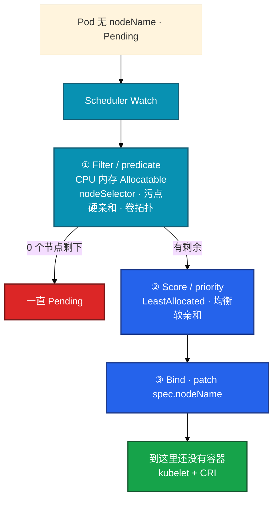
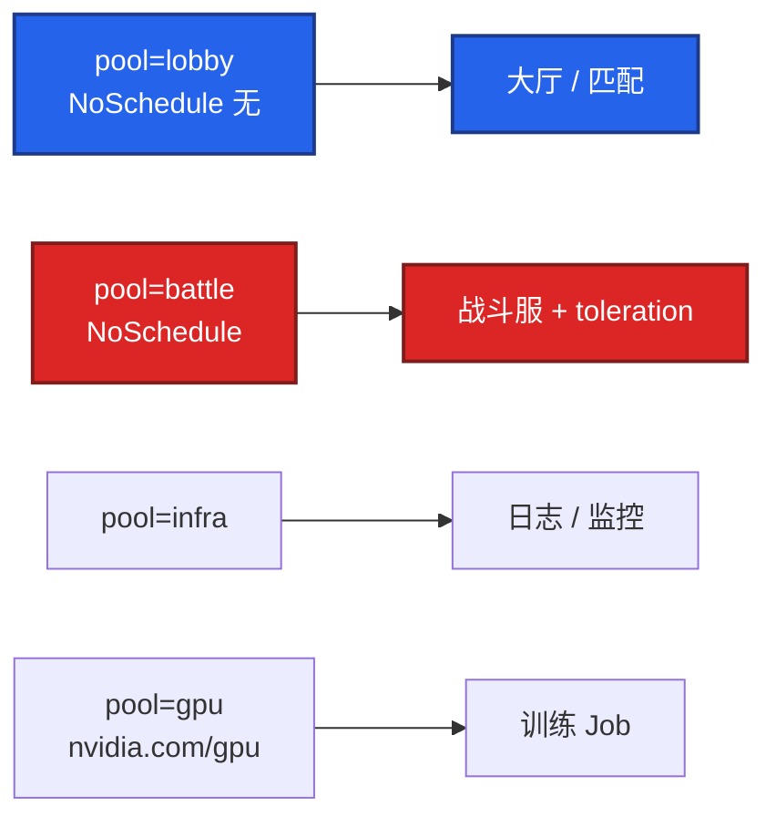
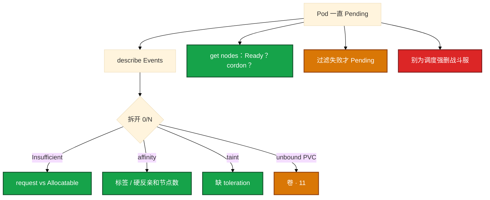

# 调度机制


开服扩容，大厅 HPA 从 3 扩到 10，第 4～10 个 Pod 全 Pending。有人要改 Scheduler 源码，有人要加 Score 权重——Events 里一行 `didn't match pod anti-affinity` 写得很清楚：3 副本硬反亲和，只有 3 台 Worker。这一章只做一件事：**Filter 为 0 才 Pending，先 describe Events，不要调权重**。

**本章主线（Pending 就按这三步想）：**

1. **两阶段**：Filter 为 0 才 Pending；Score 只是在剩余里选一个。
2. **Events**：Insufficient / taint / affinity / unbound PVC——按条拆，不要调 Score 权重。
3. **分池**：独占战斗服靠污点，不靠口头约定；改亲和只影响下一轮调度。

**读完你能：** 过滤失败才 Pending、打分只是选一个；硬反亲和要算节点数；污点拒人、容忍开门、NoExecute 才赶已有 Pod；独占池靠污点不靠口头约定。

## 本章目录

- [1. 基本概念](#1-基本概念)
- [2. 架构图](#2-架构图)
- [3. 原理](#3-原理)
  - [3.1 Filter / Score](#31-filter-predicate--score-priority)
  - [3.2 亲和与 spread](#32-选择器亲和反亲和-spread)
  - [3.3 污点与容忍](#33-污点与容忍)
  - [3.4 request 记账](#34-request-记账limit-管运行时)
  - [3.5 优先级与抢占](#35-优先级与抢占)
  - [3.6 Descheduler](#36-descheduler)
- [4. 安装部署](#4-安装部署)
- [5. 核心配置](#5-核心配置)
- [6. 命令与操作](#6-命令与操作)
- [7. 生产排障](#7-生产排障)
- [8. 必会 · 常考](#8-必会--常考)
- [合上书](#合上书问自己)

**本章不讲：** 容器起不来、探针、QoS 细节 → [04](../04-Pod生命周期/)；PDB、drain 卡住 → [05](../05-工作负载控制器/)；HPA 顶满仍 Pending、CA → [07](../07-弹性伸缩/)；PVC / WaitForFirstConsumer → [11](../11-存储/)；节点 NotReady、NoExecute 驱逐展开 → [16](../16-节点运行时与升级/)。

---

## 1. 基本概念

你 apply 了大厅 Deployment，`replicas: 3`。其中一个 Pod 一直 Pending，`NODE` 列是空的。Scheduler 给 **没有 nodeName** 的 Pod 选节点，写下 `spec.nodeName`。**不管镜像拉没拉下来，不管探针过不过。** 调度成功 ≠ 容器起来。

**值班里怎么认现象**：

| Events / 现象 | 技术含义 | 你的第一刀 |
|---------------|----------|------------|
| `Insufficient cpu/memory` | request 之和超 Allocatable | describe node Allocatable，不是 top |
| `had taint ... didn't tolerate` | 缺 toleration | describe node Taint |
| `didn't match pod anti-affinity` | 硬反亲和节点不够 | 算节点数 vs 副本 |
| `unbound PersistentVolumeClaims` | 卷没绑或 WaitForFirstConsumer | 查 StorageClass（11） |
| `0/N nodes are available` | 多条 Filter 叠加 | 按分号拆开逐条对 |
| NODE 有了但 ContainerCreating | **不是调度** | kubelet + CRI（04） |

两阶段名字要对上（面试会用旧名追问）：

| 现在常说 | 旧名 | 干什么 |
|----------|------|--------|
| **Filter** | predicate | 去掉不够的节点。0 个剩下 → **Pending** |
| **Score** | priority | 给剩下的打分。只选一个，**不会** Pending |
| **Bind** | — | patch `spec.nodeName`。还没有容器 |

**Allocatable ≠ Capacity。** Scheduler 看 `Capacity − kubeReserved − systemReserved − eviction 预留`。节点 top 还空、但 Pending Insufficient，多半是 **request 之和** 把 Allocatable 吃满。

**打个比方**：Scheduler 像 **排球场裁判**——先筛「这队能不能在这个场地打」（Filter），再在能打的场地里选「对哪队最公平」（Score）。场地一个都不合格，比赛排不了（Pending）；不是「打分低」排不了。

> **记住**：过滤失败才 Pending；打分只是选一个；写上 nodeName 还不等于容器起来。

**面试怎么说**：「Pending 我先 describe Events；Filter 为 0 才 Pending，Score 不会；调度成功不等于 Pod Running。」

---

## 2. 架构图

先把调度链钉住。后面亲和、污点、Pending 都对着这张图说话。



**读图三句话：**

1. **Filter 为 0 才 Pending**——Score 失败不会让你看不到节点。
2. **predicate 常见：资源、污点、硬亲和、PVC 拓扑、cordon**——按 Events 逐条拆。
3. **改亲和只影响下一轮**——已 Running 的不会自动搬家（NoExecute 除外）。

生产 Pending 99% 不是要换调度器。`schedulerName` 写错 Events 很直白却常被忽略。

---

## 3. 原理

**本节 6 块：** 3.1 Filter/Score · 3.2 亲和 · 3.3 污点 · 3.4 资源 · 3.5 抢占 · 3.6 Descheduler

### 3.1 Filter（predicate）与 Score（priority）

**一句话：** Filter 去掉不够的节点，一个都不剩才 Pending；Score 只是在剩余里选一个。

**打个比方**：相亲会先筛身高学历（Filter），筛完没人符合条件就单身（Pending）；在符合条件的人里再挑最合适的（Score）——不是「评分低」导致单身。

**现场走一遍**（新 Pod 一直 Pending，先 Events）：

1. 查 Pod：

```bash
kubectl get po hall-expansion-xyz -n prod -o wide
```

2. 屏幕：

```text
NAME                  READY   STATUS    RESTARTS   AGE   IP    NODE
hall-expansion-xyz    0/1     Pending   0          8m    <none>   <none>
```

3. describe Events：

```bash
kubectl describe po hall-expansion-xyz -n prod | tail -20
```

4. 屏幕出现：

```text
Warning  FailedScheduling  0/5 nodes are available: 2 Insufficient cpu,
  3 node(s) didn't match Pod's node affinity/selector.
```

5. 查节点标签和 Allocatable：

```bash
kubectl get nodes --show-labels | grep pool
kubectl describe node node-lobby-01 | grep -A12 Allocatable
```

6. 屏幕：

```text
Labels: pool=lobby,zone=az-a
Allocatable: cpu 7800m, memory 28Gi
```

**输出解读：**

```text
0/5 nodes are available: 2 Insufficient cpu, 3 node(s) didn't match ...
```

| 片段 | 含义 |
|------|------|
| `0/5` | 5 台节点 **Filter 后一个都不剩** |
| `2 Insufficient cpu` | 2 台 request 记账满了 |
| `3 didn't match node affinity` | 3 台标签不对——**AND 叠加** |
| `<none>` NODE | 还没 Bind，不是 kubelet 问题 |

ContainerCreating 就不是调度的锅。已 Running 改亲和不会搬家——`IgnoredDuringExecution`。

**面试怎么说**：「Pending 我 describe Events 按条拆；0/N 是分号清单，Filter 为 0 才 Pending，不去调 Score 权重。」

> **记住**：把 Pending 当成打分配错去调权重，是错路。

### 3.2 放哪：选择器、亲和、反亲和、spread

**一句话：** 硬反亲和要算节点数；无状态优先 preferred 或 topologySpread。

**打个比方**：硬反亲和像 **「同一桌不能坐两个同名玩家」**——只有 2 张桌却来了 3 人，第 3 个只能站门口（Pending）；软反亲和像 **「尽量分开坐，坐不下也凑合」**。

**现场走一遍**（3 副本硬反亲和，只有 2 节点，第 3 个 Pending）：

1. 看分布：

```bash
kubectl get po -n prod -l app=hall -o wide
```

2. 屏幕：

```text
hall-aaa   1/1   Running   node-01
hall-bbb   1/1   Running   node-02
hall-ccc   0/1   Pending   <none>
```

3. describe Pending Pod：

```bash
kubectl describe po hall-ccc -n prod | grep -A3 FailedScheduling
```

4. 屏幕：

```text
0/2 nodes are available: 2 node(s) didn't match pod anti-affinity rules.
```

5. 看 YAML 亲和：

```bash
kubectl get deploy hall -n prod -o yaml | grep -A15 podAntiAffinity
```

6. 可见 `requiredDuringSchedulingIgnoredDuringExecution` + `topologyKey: kubernetes.io/hostname`。

**输出解读：**

| 观察 | 含义 |
|------|------|
| 2 Running 各在不同 node | 硬反亲和 **已生效** |
| 第 3 个 Pending | 只有 2 节点，**hostname 级硬反亲和** 放不下 |
| 改 preferred 或 spread | 节点不够时仍能调度 |
| `DoNotSchedule` spread | 和硬反亲和一样会卡 |

无状态生产常用 `topologySpreadConstraints`（`maxSkew: 1`，`ScheduleAnyway`）。

**面试怎么说**：「硬反亲和 3 副本 2 节点第 3 个永远 Pending；无状态用 preferred 或 spread，硬条件要节点数 ≥ 副本。」

> **记住**：硬反亲和要算节点数；开服扩副本前先算机型库存。

### 3.3 污点与容忍

**一句话：** 污点拒人、容忍开门；NoExecute 才会赶已经在跑的 Pod。

**打个比方**：污点像 **「VIP 厅谢绝散客」** 的门牌；toleration 是 **邀请函**。NoSchedule 只拦新客；NoExecute 还会把没邀请函的赶出去。

**现场走一遍**（大厅 HPA 扩到战斗机节点）：

1. Pending Pod Events：

```bash
kubectl describe po hall-7d8f9c-new99 -n prod | grep -i taint
```

2. 屏幕：

```text
0/8 nodes are available: 5 node(s) had taint {pool: battle},
  that the pod didn't tolerate.
```

3. 查战斗节点：

```bash
kubectl describe node node-battle-03 | grep Taint
```

4. 屏幕：

```text
Taints: pool=battle:NoSchedule
```

5. 查大厅 Pod 有没有乱 toleration：

```bash
kubectl get po hall-7d8f9c-new99 -n prod -o yaml | grep -A6 tolerations
```

6. 空——正确，大厅不应 tolerate `pool=battle`。

**输出解读：**

| Effect | 新 Pod | 已有 Pod |
|--------|--------|----------|
| **NoSchedule** | 无容忍则不调度 | 不动 |
| **PreferNoSchedule** | 尽量不来 | 不动 |
| **NoExecute** | 不来 | **驱逐**无容忍者 |

口头约定「别往战斗机调」没用——HPA 不认口头，靠污点。CNI / kube-proxy 通常 `tolerations: Exists`。

**面试怎么说**：「大厅占战斗机是缺污点隔离；NoSchedule 只拦新的，NoExecute 才赶已有 Pod；独占池靠污点。」

> **记住**：独占战斗服池靠污点；业务不要 toleration 控制面污点。

### 3.4 资源：request 记账，limit 管运行时

**一句话：** Scheduler 用 request 减 Allocatable 记账，不看瞬时 top。

**打个比方**：酒店订房按 **预订间数**（request）算满不满，不是看 **实际住了几个人**（top）。全订满了，新客进不来（Pending），哪怕很多房间空着。

**现场走一遍**（top 很闲，Pod Insufficient cpu）：

1. describe Pending Pod：

```bash
kubectl describe po api-heavy -n prod | grep Insufficient
```

2. 屏幕：

```text
0/3 nodes are available: 3 Insufficient cpu.
```

2. 节点 top（误导）：

```bash
kubectl top node node-lobby-01
```

3. 屏幕：

```text
NAME            CPU(cores)   CPU%   MEMORY(bytes)
node-lobby-01   890m         11%    8192Mi
```

4. 看 Allocatable 和已分配 request：

```bash
kubectl describe node node-lobby-01 | grep -A15 "Allocated resources"
```

5. 屏幕：

```text
Allocatable: cpu 7800m
Allocated resources:
  cpu 7600m (97%)   memory 24Gi (85%)
```

6. 新 Pod request：

```bash
kubectl get po api-heavy -n prod -o jsonpath='{.spec.containers[0].resources.requests}'
```

7. 屏幕：`{"cpu":"500m","memory":"512Mi"}` — 7600+500 > 7800 → Pending。

**输出解读：**

| 对比 | 含义 |
|------|------|
| top 11% vs Allocated 97% | **记账满**不等于瞬时 CPU 满 |
| 没写 request | 调度当 0，易超卖后 Evict |
| limit 超 CPU | throttle，不杀 |
| limit 超 memory | OOMKill（04） |

加节点还是降 request？HPA 顶满整池 → 加节点/CA（07）；单个 Pod 虚高 → 降 request。

**面试怎么说**：「Insufficient 我看 Allocatable 和 request 之和，不看 top；request 是调度记账，limit 管运行时。」

> **记住**：调度看 request/Allocatable，不看 top。

### 3.5 优先级与抢占

**一句话：** 低优先级 Pod 可被挤掉；战斗服不要标低优先级让出资源。

**打个比方**：抢占像 **「VIP 来了，把普通票观众请出去」**——战斗服标低优先级等于对局里第一个被请出去。

**现场走一遍**（战斗服 Pending，批处理占满节点）：

1. 看 PriorityClass：

```bash
kubectl get priorityclass
kubectl get po -n prod -o custom-columns=NAME:.metadata.name,PRI:.spec.priorityClassName,PRIO:.spec.priority
```

2. 战斗服误标 `batch-low`，批处理也是 `batch-low`。

3. describe 战斗 Pending Pod——可能 Insufficient，或等抢占。

4. 正确做法：战斗服用 `production-high` 或默认，批处理用低优先级。

**输出解读：**

| 做法 | 结果 |
|------|------|
| 批处理低 PriorityClass | 节点紧时先被挤，合理 |
| 战斗服低优先级 | 节点紧 **先杀对局** |
| 靠抢占当容量规划 | PDB 可能拦，不可靠 |

**面试怎么说**：「战斗服不要标低 PriorityClass；Pending 先 Events 查资源污点亲和，99% 不是换调度器。」

> **记住**：游戏逻辑服不要标成可杀。

### 3.6 Descheduler：创建后再平衡，不是第二套 Scheduler

**一句话：** Descheduler 会驱逐运行中 Pod，战斗服不要进范围。

**打个比方**：Scheduler 是 **入学分配**；Descheduler 是 **学期中调班**——会把正在上课的学生叫起来换教室，战斗服进范围等于踢玩家。

**现场走一遍**（跑 Descheduler 后大厅 Pod 被删重建）：

1. 观察 Pod 年龄突变：

```bash
kubectl get po -n prod -l app=hall -o wide
```

2. 多个 Pod AGE 从 30d 变成 2m，Events 有 `Killing`。

3. 查 Descheduler 策略是否包含战斗 namespace。

4. drain 类 SIGTERM，PDB 会拦——单副本 minAvailable=1 赶不走。

**输出解读：**

| 点 | 含义 |
|----|------|
| 只调度一次 | 新节点空着，老节点满载，Scheduler **不会自动迁** |
| Descheduler 驱逐 | **自愿中断**，PDB 拦 |
| 战斗服进范围 | 等于定时踢玩家 |

**面试怎么说**：「Descheduler 是再平衡不是第二 Scheduler；会驱逐运行中 Pod，STS 和战斗服排除；PDB 拦自愿中断。」

> **记住**：Pending 先 Events，不是先上 Descheduler。

---

## 4. 安装部署

### 4.1 生产怎么选

kube-scheduler 是控制面静态 Pod（01）。多副本必须 leader-elect。业务侧「部署」是节点标签、污点和亲和约定。

| 场景 | 做法 |
|------|------|
| 网关高可用 | preferred 反亲和或 spread；硬反亲和要算节点数 |
| 逻辑服绑节点盘 | nodeAffinity + 本地卷；STS + WaitForFirstConsumer |
| GPU / 独占机 | 污点 + 容忍 |
| 大厅 / 战斗 / GPU | 分池靠污点和标签 |
| 批处理混部 | 低 PriorityClass；战斗服不要低优先级 |

### 4.2 节点池落地



| 操作 | 命令示例 |
|------|----------|
| 打污点 | `kubectl taint nodes node-battle-03 pool=battle:NoSchedule` |
| 去污点 | `kubectl taint nodes node-battle-03 pool=battle:NoSchedule-` |
| 打标签 | `kubectl label nodes node-lobby-01 pool=lobby zone=az-a` |

标签少而稳：`pool=lobby|battle|infra`，`zone=az-a|az-b`。不要为每个活动发明新标签。开服预案要算机型库存；PVC WaitForFirstConsumer 会互相等（11）。

---

## 5. 核心配置

| 项 | 生产怎么用 | 改错会怎样 |
|----|------------|------------|
| 硬 anti-affinity + hostname | 仅双副本且节点数 ≥ 副本 | 第 N 个永远 Pending |
| preferred / spread | 无状态打散首选 | 单点宕机全区大厅没了 |
| Taint NoSchedule | 独占池 | 口头约定挡不住 HPA |
| NoExecute | 明白会赶已有 Pod | 误打赶战斗服 |
| 业务容忍控制面污点 | **不要** | 业务上到 master |
| CNI / kube-proxy 容忍 | `Exists` | 节点没网络 |
| request | 实测 P95 | 写 0 超卖；写太大 Insufficient |
| PriorityClass | 批处理低 | 战斗服低 → 先杀对局 |
| Descheduler 范围 | 排除 STS / 战斗服 | 再平衡踢玩家 |

示例 spread（无状态大厅）：

```yaml
topologySpreadConstraints:
  - maxSkew: 1
    topologyKey: kubernetes.io/hostname
    whenUnsatisfiable: ScheduleAnyway
    labelSelector:
      matchLabels:
        app: hall
```

> **记住**：改亲和只影响下一轮；别为了调度强删正在打的 Pod。

---

## 6. 命令与操作

```bash
kubectl describe pod <p>                              # Events 第一现场
kubectl describe node <n> | grep -A12 Allocatable
kubectl describe node <n> | grep Taint
kubectl get nodes --show-labels
kubectl get pod -o wide                             # 是不是全堆同一台
```

| Events | 原因 |
|--------|------|
| Insufficient cpu/memory | request vs Allocatable |
| didn't match node affinity | 标签对不上 |
| had taint ... didn't tolerate | 缺 toleration |
| unbound PVC | 卷 / WaitForFirstConsumer（11） |
| 0/N nodes are available | 按分号逐条对 |

已经 Running 改 affinity **不会**迁走——要搬家靠驱逐或滚动（05）。drain 卡住先看 PDB（05）。只 cordon 不 drain，新 Pod 不来，旧战斗服还在跑。

---

## 7. 生产排障



| 现象 | 先做什么 | 不要做什么 |
|------|----------|------------|
| 一直 Pending | describe Events，按 0/N 拆 | 调 Score 权重；换调度器 |
| Insufficient + top 低 | Allocatable 和 request 之和 | 先改镜像 |
| 第 N 个 Pending + 反亲和 | 算节点数；改 preferred/spread | 硬撑硬反亲和 |
| 大厅上战斗机 | 查 battle 污点；大厅不要 tolerate | 口头约定 |
| NODE 有了还 Pending | 不是本章——看 kubelet（04） | 重启 Scheduler |

现场 Pending 先 Events，不是先上 Descheduler。

---

## 8. 必会 · 常考

| 说法 | 对错 | 口径 |
|------|:----:|------|
| Score 失败会 Pending | 错 | 只有 Filter 为 0 才 Pending |
| 调度成功就是容器起来了 | 错 | 只写 nodeName |
| Scheduler 挂了已有 Pod 会停 | 错 | 新的 Pending |
| 硬反亲和节点不够也能上 | 错 | 第 N 个永远 Pending |
| 改了亲和老 Pod 会搬家 | 错 | IgnoredDuringExecution |
| 口头约定能挡住 HPA 占战斗机 | 错 | 靠污点 |
| NoSchedule 会赶走已有 Pod | 错 | 只有 NoExecute |
| 调度看瞬时 top | 错 | request vs Allocatable |
| 战斗服标低优先级让出资源 | 错 | 先杀对局 |
| Descheduler 是第二套 Scheduler | 错 | 再平衡，会驱逐 |
| cordon 会杀战斗服 | 错 | 只是不接新 Pod |

数字：硬 anti-affinity 要 **节点数 ≥ 副本**；Allocatable = Capacity − 预留。

易混：Filter vs Score；required vs preferred；NoSchedule vs NoExecute；request vs top；drain vs NotReady NoExecute。

---

## 合上书，问自己

1. 调度两阶段？哪个导致 Pending？谁把容器拉起来？
2. required 和 preferred 差在哪？硬反亲和 3 副本 2 节点会怎样？
3. 污点三档？独占战斗服池怎么做？
4. 为什么 top 很低还 Insufficient？Allocatable 是什么？
5. 游戏逻辑服绑机型怎么做？能不能标低优先级？
6. Descheduler 和 Scheduler 差在哪？会赶走战斗服吗？

六题都能口述，这一章就过了。下一章把弹性剖开：HPA 解决不了有状态游戏服什么问题。
